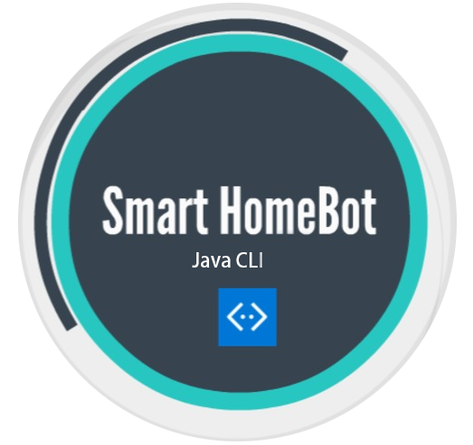

#  SmartHomeBot 

SmartHomeBot is a desktop application that consolidates all home appliances control into a centralized system via a Command Line Interface (CLI). Users can switch on or off appliances using this application and record electricity usage; having a clearer picture of their electrical usage patterns. SmartHomeBot has an auto-save feature that will automatically save all the appliances' data and export it to a text file. Upon the start of the [application](releases/latest). , it will import the data from the text file and loads the appliances' data back.

