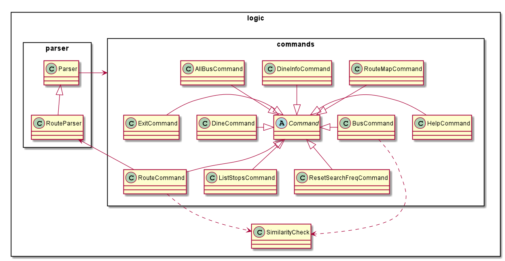

# Developer Guide

This developer guide aims to provide an overview of Nav@NUS to aid developers in creating extensions or making 
enhancements.

- [1. Design & Implementation](#1-design--implementation)
  * [1.1. Architecture](#11-architecture)
    + [1.1.1 Ui Component](#111-ui-component)
    + [1.1.2 Logic Component](#112-logic-component)
    + [1.1.3 Model Component](#113-model-component)
    + [1.1.4 Storage Component](#114-storage-component) 
  * [1.2. Implementation](#12-implementation)
    + [1.2.1 Direct Route Finder](#121-direct-route-finder)
        * [1.2.1.1. Implementation](#1211-implementation)
        * [1.2.1.2. Design Considerations](#1212-design-considerations)
- [2. Product scope](#2-product-scope)
  * [2.1. Target user profile](#21-target-user-profile)
  * [2.2. Value proposition](#22-value-proposition)
- [3. User Stories](#3-user-stories)
- [4. Non-Functional Requirements](#4-non-functional-requirements)
- [5. Glossary](#5-glossary)
- [6. Instructions for manual testing](#6-instructions-for-manual-testing)

## 1. Design & Implementation

{Describe the design and implementation of the product. Use UML diagrams and short code snippets where applicable.}

### 1.1. Architecture

The architecture diagram given in figure 1 explains the high-level design of the App. 

 
_Figure 1: Architecture diagram_

Given below is a quick overview of each component.

`Main` is the class Duke.java. It is responsible for:

- Initializing the components in the correct sequence, and calling or creating objects in the order of execution.

The rest of the App consists of 4 main components:

- `Ui` : The Ui component handles all interactions with the user.
- `Logic` : The Logic component makes sense of the command and executes it.
- `Model` : The Model component is responsible for all data held in the memory.
- `Storage` : The storage component handles data by reading from and writing to files in the hard disk. 

#### 1.1.1 Ui Component
The ui component is responsible for getting the user input and for displaying appropriate messages as response 
to commands executed by the logic component.

 
_Figure 2: Class diagram for ui component_

#### 1.1.2 Logic Component
The logic component is responsible for the following tasks:
- Make sense of the command entered by the user by splitting it into the command type and the parameters and/or 
delimiters if any.
-  Executes a command based on its type and provides an appropriate result to the user via the Ui component.

The following class diagram briefly explains how different classes in the logic component interact with each other.

 
_Figure 3: Class diagram for logic component_

#### 1.1.3 Model Component
[Work in Progress]

#### 1.1.4 Storage Component
[Work in Progress]

### 1.2. Implementation
This section provides details of how the main features of Nav@NUS have been implemented.

#### 2.2.1 Direct Route Finder (`/route` Feature)

The `/route <location1> /to <location2>` is the command that has to entered by the user to see all direct bus routes 
available from *location1* to *location2*.

The class diagram in the figure below shows how different classes used for implementation of the `/route` command 
are linked to each other. 

The `RouteCommand#executeCommand()` method of RouteCommand Class executes the command in the following steps:
1. Call `RouteParser#getLocations()` to get the locations entered by the user in the order of starting location and 
destination.
    - The `RouteParser#getLocations()` method throws an exception if the locations or the delimiter `/to` is missing.
2. Calls `RouteCommand#checkLocations()` to make sure location strings are not empty or the same.
    - The `RouteCommand#checkLocation()` method throws an exception if locations are empty or the same.
3. Calls `RouteCommand#similarityCheck()` to check if the locations are not in the list of bus stops but 
are similar.
    - The `RouteCommand#similarityCheck()` method calls the static `SimilarityCheck#similarLoc()` method and returns 
    a list of similar locations, if any.
    - If the list of similar locations is empty, `RouteCommand#executeCommand()` performs step 4 given below, 
    else it calls the static method, `Ui#printPossibleLocsMessage()`, to print the list of similar locations. 
4. Calls static `BusData#possibleBuses()` to get a list of buses with their routes from the starting location to 
the destination.
   - `BusData#possibleBuses()` calls `Bus#getPossibleRoute()` to check for a possible route for the given bus number.
   - `BusData#possibleBuses()` repeats this call for all bus numbers.

The following sequence diagram explains the above steps when the user enters `/route loc1 /to loc2`.

The following sequence diagrams explain the interactions omitted in the main diagram.

## 2. Product scope

### 2.1. Target user profile
Nav@NUS targets people who are unfamiliar with the shuttle bus service in NUS Kent Ridge Campus 
including students, professors and visitors.
These are people who:
 - needs to be punctual for events such tutorials
 - prefer a desktop CLI app over other types
 - are new to NUS Kent Ridge Campus
  
### 2.2. Value proposition
Nav@NUS seeks to help the intended audience to achieve the following:
 - Efficient checking of bus routes in NUS
 - Fast viewing of dining options available at other locations

## 3. User Stories

|Version| As a ... | I want to ... | So that I can ...|
|--------|----------|---------------|------------------|
|v1.0|freshman/ anyone new to nus|know if there is any direct bus to my target destination|I do not need to change buses|
|v1.0|someone that is unfamiliar with the NUS campus|know the full routes of the buses|I could plan my route to my desired destination|
|v1.0|someone new to NUS|know all the available bus stops in the school|I can check the possible bus stops I can board/alight at to reach my destination|
|v1.0|curious person|know the full routes of all the buses in NUS|I can see where each bus is heading to|
|v1.0|freshman/ anyone new to NUS|I want to know the buses available at specific bus stops|I can better plan my trip around the campus in advance|
|v2.0|frequent user|have a list of favourite commands|I can access my favourite commands quickly|
|v2.0|frequent user|be able to customise my list of favourite commands|I can change the list according to my needs|
|v2.0|frequent user|view my most searched bus stop|it can promptly remind me of the bus stop to key in|

## 4. Non-Functional Requirements

{Give non-functional requirements}

## 5. Glossary

* *glossary item* - Definition

## 6. Instructions for manual testing

{Give instructions on how to do a manual product testing e.g., how to load sample data to be used for testing}
