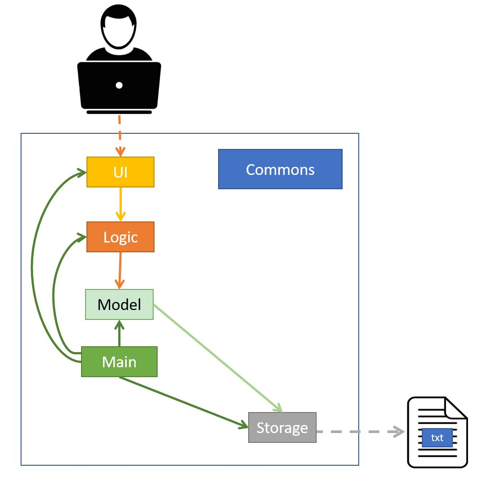
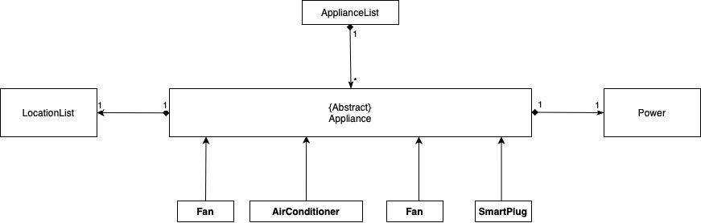
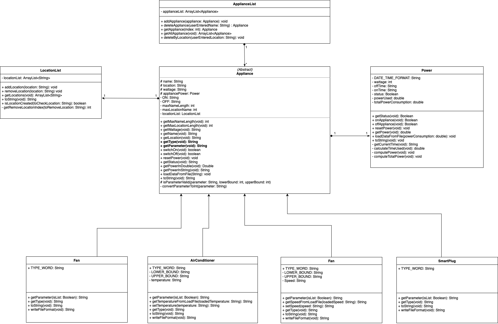
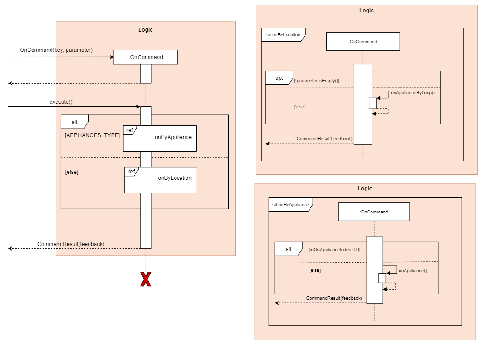
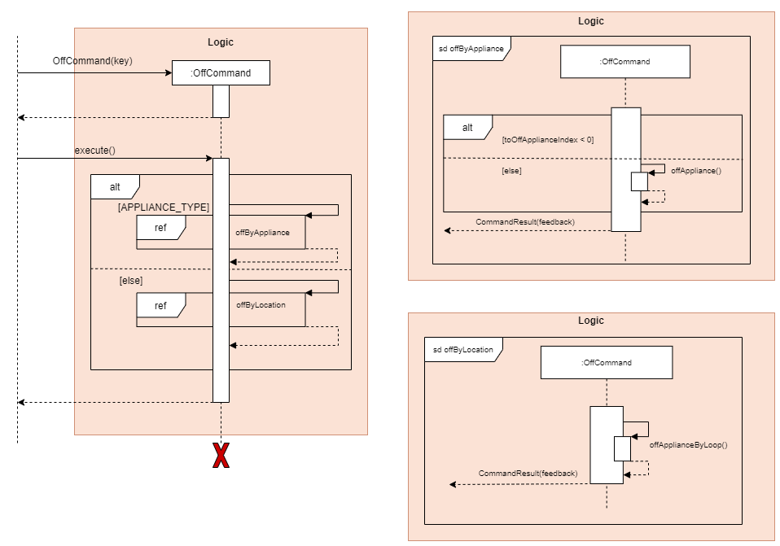

# Developer Guide

## Table of Contents
* [Setting up](#setting-up)
  * [Prerequisites](#prerequisites)
  * [Get Started](#get-started)
* [Design](#design) 
  * [Architecture](#architecture) 
  * [UI Component](#ui-component)
  * [Logic Component](#logic-component)
  * [Model Component](#model-component)
  * [Storage Component](#storage-component)
* [Implementation](#implementation) 

## **Introduction**

SmartHomeBot is a desktop application tailored for users who are comfortable using a Command Line Interface (CLI), it allows users to control their smart devices at home and record all appliance power usage.

## **Setting up**

### Prerequisites

+ *JDK `11`* or above
+ Permission rights to create a file and folder in machine
+ At least 10Mb of free space on disk

### **Get Started**

Fork this repo and clone it into your computer.

Intellij IDEA User (highly recommended):
1. Configure the JDK to JDK 11.
2. Make sure you have enabled Grade extension, if disable please re-enable it back by going to `File`>`Settings`>`Plugins`.
3. Import the project as a Gradle project by selecting *build.gradle*
4. Verify the setup:
    Run the seedu.smarthomebot.Main and try a few commands.
    Run the Tests to ensure they all pass.
- - -

## Design

### Architecture

The *Architecture Diagram* shown above explains the high-level design of the SmortHomeBot Application. Given below is a brief overview of each component.

`Main` is responsible for initializing other components in correct sequence, and connects them up with each other.

`Commons` represents a collection of classes used by multiple components. 

The rest of the App consists of four components.
* `Ui`: The user interface where user can enter instructions and view output.
* `Logic` The command executor which consists of,
   * `Paser`: Extract the keyword from user input
   * `Commands`: Execute the specific command according to the keyword
* `Model` Holds the data in-app-memory while program is running. Consists of ...

* `Storage` Reads and writes data from and to a text file.

### Model Component

The *Model Component* shown above explains the summarised model of SmartHomeBot. The four appliances classes are extended from the abstract appliance class. 

### Detailed Model Component 

The *Detailed Model Component* shown above explains the full detailed model of SmartHomeBot; which includes all of their variables and methods. 

### Command Component
#### On Command

The *On Command* shown above explains the Sequence Diagram of the On Command.
#### Off Command

The *Off Command* shown above explains the Sequence Diagram of the Off Command
### Storage Component

## Implementation