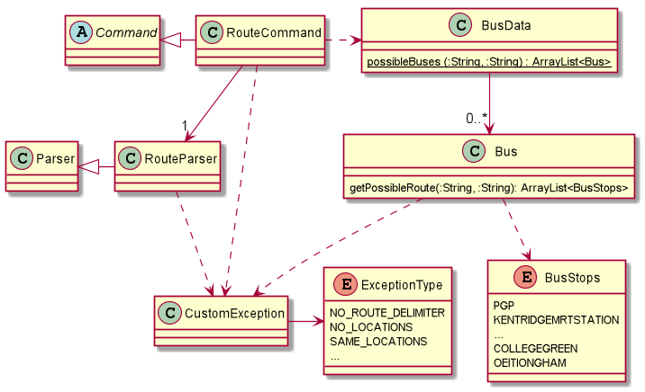

# Developer Guide

This developer guide aims to provide an overview of Nav@NUS to aim developers in creating extensions or making 
enhancements.

- [1. Design & Implementation](#1-design--implementation)
  * [1.1. Architecture](#11-architecture)
  * [1.2. Implementation](#12-implementation)
    + [1.2.1 Direct Route Finder](#121-direct-route-finder)
        * [1.2.1.1. Implementation](#1211-implementation)
- [2. Product scope](#2-product-scope)
  * [2.1. Target user profile](#21-target-user-profile)
  * [2.2. Value proposition](#22-value-proposition)
- [3. User Stories](#3-user-stories)
- [4. Non-Functional Requirements](#4-non-functional-requirements)
- [5. Glossary](#5-glossary)
- [6. Instructions for manual testing](#6-instructions-for-manual-testing)

## 1. Design & Implementation

{Describe the design and implementation of the product. Use UML diagrams and short code snippets where applicable.}

### 1.1. Architecture

The architecture diagram given in figure 1 explains the high-level design of the App. 

<i>
Figure 1: Architecture diagram
</i>

Given below is a quick overview of each component.

### 1.2. Implementation

This section provides details of how the main features of Nav@NUS have been implemented.

#### 1.2.1 Direct Route Finder

The `/route <location1> /to <location2>` is the command that has to entered by the user to see all direct bus routes 
available from *location1* to *location2*.

##### 1.2.1.1. Implementation

The class diagram in figure 2 shows how different classes used for implementation of the `/route` command are linked to
each other. 

<i>
Figure 2: Class diagram showing the implementation of the route feature
</i>

The RouteCommand Class executes the command in the following steps:
1. Uses RouteParser to get the locations entered by the user in the order of starting location and destination.
    - The RouteParser throws an exception if the locations or the delimiter `/to` is missing.
2. Uses its method to make sure that location strings are not empty or same.
    - The checkLocation() method throws an exception if locations are empty or the same.
3. Calls a method from BusData to get a list of buses with their routes from the starting location to the destination.
   - This method uses another method from class Bus to check for a possible route for the given bus number.
   - Repeats for all bus numbers.

The sequence diagram in figure 3 explains the above steps when the user enters `/route loc1 /to loc2`.

[Work in Progress]

<i>
Figure 3: Sequence diagram showing how the operation works
</i>

##### 1.2.1.1. Design Considerations

[Work in Progress]

## 2. Product scope
### 2.1. Target user profile

{Describe the target user profile}

### 2.2. Value proposition

{Describe the value proposition: what problem does it solve?}

## 3. User Stories

|Version| As a ... | I want to ... | So that I can ...|
|--------|----------|---------------|------------------|
|v1.0|new user|see usage instructions|refer to them when I forget how to use the application|
|v2.0|user|find a to-do item by name|locate a to-do without having to go through the entire list|

## 4. Non-Functional Requirements

{Give non-functional requirements}

## 5. Glossary

* *glossary item* - Definition

## 6. Instructions for manual testing

{Give instructions on how to do a manual product testing e.g., how to load sample data to be used for testing}
