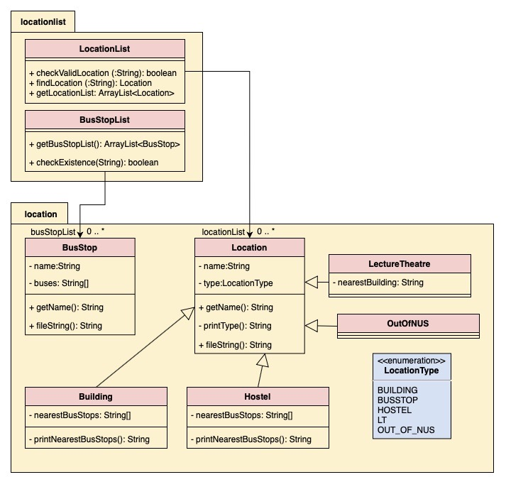
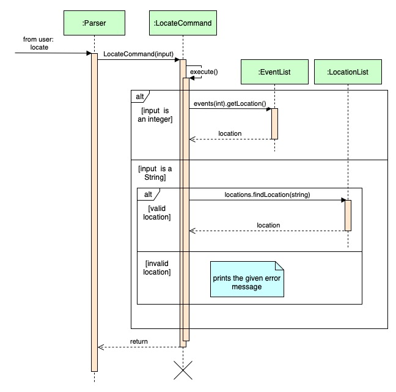

# Developer Guide
google docs [link](https://docs.google.com/document/d/1dGM1DYHVXxqUM8RPfAPs6MuFXK3VgL6807x5ivZ5yJk/edit)

## Table of Contents
1. [Introduction](#1-introduction)
2. [Setting Up](#2-setting-up)
3. [Design](#3-design)  
3.1 [Architecture](#31-architecture)  
3.2 [UI](#32-ui)  
3.3 [Storage](#33-storage)  
3.4 [Logic](#34-logic)  
3.5 [Events](#35-events)  
3.6 [Location](#36-location)  
4. [Implementation](#4-implementation)  
4.1 [Add events](#41-add-events)  
4.2 [Clear events](#42-clear-events)  
4.3 [Edit events](#43-edit-events)  
4.4 [Locate](#44-locate)   
4.5 [Reminders](#45-reminders)  
4.6 [Sort events](#46-sort-events)  
4.7 [View events](#47-view-events)  
5. [Documentation](#5-documentation)  
5.1 [Product scope](#51-product-scope)  
5.2 [User stories](#52-user-stories)  

## 1. Introduction
NUSchedule is a Command-Line based application written in Java. It provides a simple 
and intuitive way to keep track of commitments. This guide provides information on the Architecture 
and system design of NUSchedule that will help developers, designers and software testers of NUSchedule.

## 2. Setting up
Step 1: __Fork__ the repo, and __clone__ the fork onto your computer. 
 Step 2: Ensure that you have configures IntelliJ IDEA (recommended) or your preferred IDE to use JDK 11.
 Step 3: Import the project as a Gradle project. 
 Step 4: Verify you have set the project up correctly by running `NuSchedule` and typing in a
            few commands. 

## 3. Design
This section describes the different components of the application and how each component interact with
each other to run the program. 

### 3.1 Architecture
### 3.2 UI 
__API:__ `UI.java`  

### 3.3 Storage 
__API:__ `Storage.java`  

### 3.4 Logic
__API:__ `Parser.java`  

### 3.5 Events
__API:__ `EventList.java`  

### 3.6 Location

*Figure 3.6.1 Class diagram for location component*

__API:__ `LocationList.java`  

The `LocationList` is made up of an ArrayList of Locations, which is a type of variable that stores different information 
for different types of location (eg. `Building`, `Hostel`, etc.). However, do note that any place that is 
not within the list of saved locations will be saved as type `OutOfNUS`, and would not be saved into the `location.txt` 
file. The location will still be part of the location list before the app closes, and it will also be 
saved as part of the Event information.

 There is a separate api for bus stops (`BusStopList.java`), which stores all available bus stops 
and their information. Although the variable is declared in the main NUScheule class, it is only referenced 
and not edited in any part of the program.

 The `Location` component 
* stores information about various types of locations 
* prints the list of locations that is saved in the data file 
* checks if a location is saved in the list and returns the location when asked

## 4. Implementation
This section describes some noteworthy details of how each feature is implemented. 

### 4.1 Add events

### 4.2 Clear events 

### 4.3 Edit events

### 4.4 Locate
The `locate` command executes with the following steps:  
Step 1. When the user type in `locate [input]`, the Parser class will extract the input from the command and call a 
`LocateCommand` object.  
* `input` will always be a String when passed into the command object. 

Step 2. `LocateCommand` will then try to convert the input into an integer, if possible.  

Step 3. If conversion is possible, the method will obtain the event at the given index and return its location 
information.  
* Try to catch `IndexOutOfBoundException` to check if the given index is within the range of the
event list.

Step 4. If conversion is not possible, then it will check if the given string is a valid location.  
* Returns the location if valid
* Prints an error message if invalid   

The sequence diagram below shows exactly which methods, from which classes, are called to obtain the required location. 

*Figure 4.4.1 Sequence diagram for locate function*

### 4.5 Reminders

### 4.6 Sort events

### 4.7 View events

## 5. Documentation

### 5.1 Product scope
__Target user profile:__
* NUS student or staff
* able to type quickly
* has quite a number of events to keep track of  
* prefers to use desktop apps
* prefers using Command Line Interface (CLI) apps
* prefers typing instead of mouse interactions

### 5.2 Value proposition

{Describe the value proposition: what problem does it solve?}

### 5.3 User Stories

|Version| As a ... | I want to ... | So that I can ...|
|--------|----------|---------------|------------------|
|v1.0|new user|see usage instructions|refer to them when I forget how to use the application|
|v2.0|user|find a to-do item by name|locate a to-do without having to go through the entire list|

## Non-Functional Requirements

{Give non-functional requirements}

## Glossary

* *glossary item* - Definition

## Instructions for manual testing

{Give instructions on how to do a manual product testing e.g., how to load sample data to be used for testing}
