# Developer Guide

* Table of Contents
{:toc} 

## Design 

### UI component
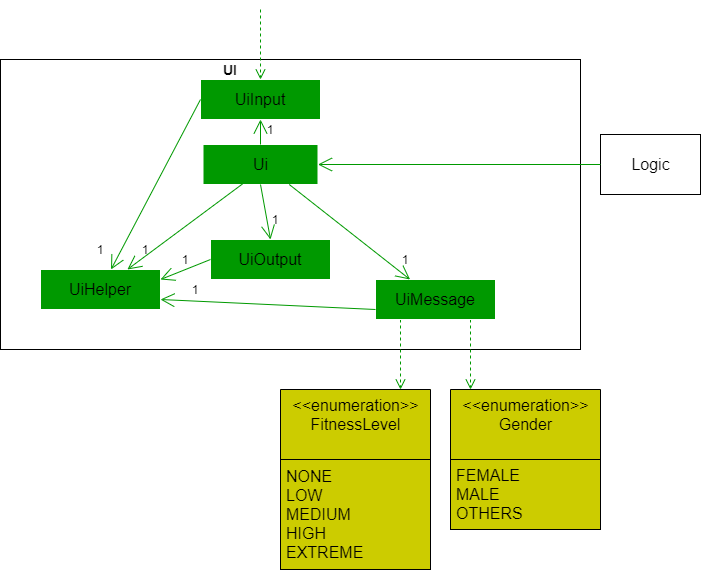

**API**: [`Ui.java`](https://github.com/AY2021S1-CS2113-T14-4/tp/blob/master/src/main/java/seedu/dietbook/ui/Ui.java)

The `UI` component makes use of the following classes:

* [`Ui`](https://github.com/AY2021S1-CS2113-T14-4/tp/blob/master/src/main/java/seedu/dietbook/ui/Ui.java): Responsible for communication between the other classes in the `UI` component and with the `Logic` component.
* [`UiHelper`](https://github.com/AY2021S1-CS2113-T14-4/tp/blob/master/src/main/java/seedu/dietbook/ui/UiHelper.java): Responsible for providing helper methods to the other classes in the `UI` component.
* [`UiInput`](https://github.com/AY2021S1-CS2113-T14-4/tp/blob/master/src/main/java/seedu/dietbook/ui/UiInput.java): Responsible for reading in the user commands and checking if it is empty.
* [`UiOuput`](https://github.com/AY2021S1-CS2113-T14-4/tp/blob/master/src/main/java/seedu/dietbook/ui/UiOutput.java): Responsible for printing the outputs.
* [`UiMessage`](https://github.com/AY2021S1-CS2113-T14-4/tp/blob/master/src/main/java/seedu/dietbook/ui/UiMessage.java): Responsible for storing output messages in methods so that they can be retrieved and printed when necessary.
    
The `UiMessage` class has **dependencies** with the following enumeration classes:

* **Rationale**: Increased coupling was sacrificed to reduce code duplicates and increase ease of code extension/editing.
* [`FitnessLevel`](https://github.com/AY2021S1-CS2113-T14-4/tp/blob/master/src/main/java/seedu/dietbook/person/FitnessLevel.java): Descriptions of the five `FitnessLevel` are required in `UiMessage#getAskForUserInfoMessage(String name)` as shown in the code snippet below.

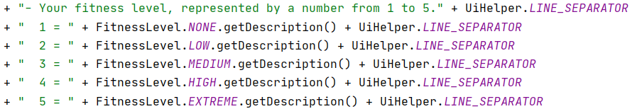

* [`Gender`](https://github.com/AY2021S1-CS2113-T14-4/tp/blob/master/src/main/java/seedu/dietbook/person/Gender.java): Descriptions of the three `Gender` are required in `UiMessage#getAskForUserInfoMessage(String name)`as shown in the code snippet below.

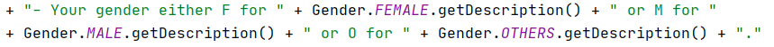

In summary, the `UI` component,
* Takes in user command, ensure that it is not empty before passing it to the `Logic` component for command execution.
* Updates the user about any changes in the data after executing the command or errors encountered when executing the commands as instructed by the `Logic` component.

### Model Component

Data of the user's diet is stored in the app's memory via the model: a `FoodList`.
**API**: [`FoodList.java`] (https://github.com/AY2021S1-CS2113-T14-4/tp/blob/master/src/main/java/seedu/dietbook/list/FoodList.java) 

`FoodList` provides the following functions:
* Stores data on entries made into the dietbook app: portion size, details on the food, and the time of consumption.
* Provides string representations of the data so that the UI can be updated.
* Allows selective retrieval and simple calculations of the data without modifying the stored data.

Additionally, it is not dependent on the other components listed. Instead, it is dependent on a common `Food` class, which is used by serval components, including the storage, database, and calculator.

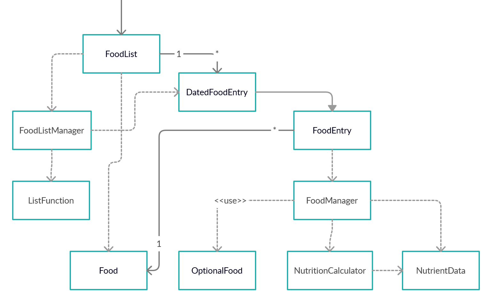
<!--- Link to Creately file:  https://app.creately.com/diagram/J8IZgmEohx4/edit --->

    
A more detailed class diagram is availble here

<!--- Link to Creately file:  https://app.creately.com/diagram/JsQLCacKi4N/edit --->

Some attributes and methods of the classes have been truncated for brevity. See the full details in the next subsections on `FoodListManager` and `FoodManager`.

The above functions and the lack of dependency are met through the following means:
* `FoodList` stores new information added via the creation and maintenance of a list of `FoodEntry` objects. These encapsulate the data being stored. In practice, the objects in the list are `DatedFoodEntry` objects, which additionally support the storage of the date and time.
* A `FoodListManager` is used to perform logical operations on the list of `FoodEntry` objects. A `FoodManager` is also used as a fascade that obscures calculations and prevents modification of `Food` data stored.
* The result of an operation is typically a `String` that is meant to be supplied to the UI. In other data retrieval operations, such as those required by calculator, a list of `Food` objects is supplied as a means of data transfer between the components. Other lists of java data types such as `LocalDateTime` and `Integer` are also provided to the storage component.

#### FoodListManager

    
 Fascade pattern of `FoodListManager`

<!--- Link to Creately file:  https://app.creately.com/diagram/JsQLCacKi4N/edit --->

`FoodListManager` obscures the operations performed on the individual items of the list of `FoodEntry` objects. These operations are performed using a functional programming paradigm to reduce code repetition, since all operations typically take the form of a list mapping or filtering.

It is only within `FoodListManager` that forced type conversions from `FoodEntry` to `DatedFoodEntry` are performed. Hence, only `FoodListManager` needs to be aware of the functions in `FoodEntry` and `DatedFoodEntry`.

`FoodListManager` also reduces code repetition in `FoodList` by having generic list operations that can be combined to achieve the desired result (e.g. A method in `FoodList` may use `FoodListManager` for filtering followed by conversion to string. Yet another method in `FoodList` may use `FoodListManager` for its filtering function, scaling, and then conversion to string).

Overall, `FoodList` fulfils the role of being the app's Model component by holding consumption data in the app's memory. It is currently used as a singleton, but is not necessarily limited to such: e.g. a seperate `FoodList` for favorites/recurrent entries or entries that are flagged as unhealthy/healthy can be made and maintained by `Logic`.

#### FoodManager

    
 Fascade pattern of `FoodManager`

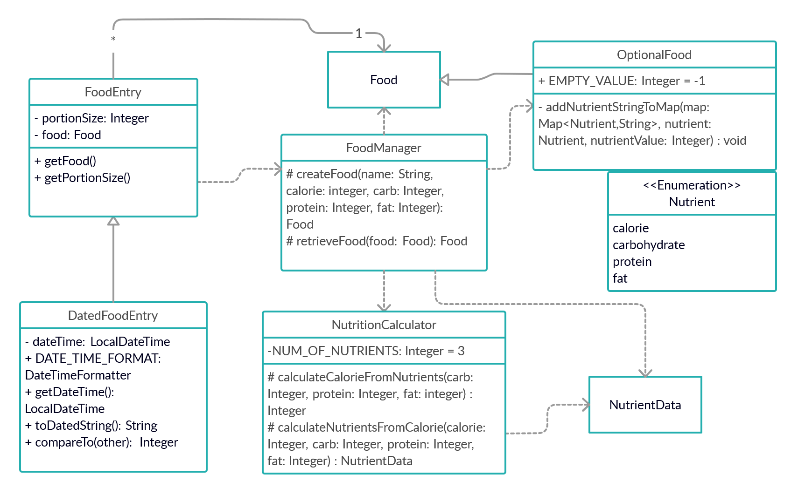
<!--- Link to Creately file:  https://app.creately.com/diagram/JsQLCacKi4N/edit --->

`FoodManger` obscures the existence of the class `OptionalFood` from `FoodEntry` and all classes dependent on `Food` from `FoodEntry`.
It uses an obscured `NutrientCalculator` to handle the missing values from the user by providing a guesstimation/calculation of their value.
The use of this fascade pattern, however, comes with downsides that will be further discussed in the implementation section.

### Common classes

There are a few common classes/packages that can be used multiple components. These are `Food`, `StringFormatter`, and `MainLogger`, located in the `seedu.dietbook.food`, `seedu.dietbook.utils`, and `seedu.dietbook.logger` packages respectively.

#### Food

`Food` is a data class containing all the relevant nutritional information on a food: calories, carbohydrates, proteins, fats. Being common to multiple components/classes, it is a means of data transfer between classes while reducing direct coupling.

#### StringFormatter

`StringFormatter` allows the formatting of strings in a manner similar to Python's fstrings:
Strings can be formatted using the pattern `${map_key}` and a corresponding key to value map.

#### Logger

`MainLogger` provides logging support to all classes.

## Implementation

### Enter user information feature

#### Implementation

This feature allows users to enter their personal information into the system so that they can be used for tracking diet progress and calorie recommendation calculation. This feature and its associated command words is **only used during the initial setup of the application**. Any subsequent editing of the user information can be done using the [Edit user information feature](#edit-user-information-feature).

**Commands words used**:

* [`name`](https://ay2021s1-cs2113-t14-4.github.io/tp/UserGuide.html#entering-username-name): Saves the user's name or nickname into the application. 
* [`info`](https://ay2021s1-cs2113-t14-4.github.io/tp/UserGuide.html#entering-user-information-info): Saves the user's age, gender, height, fitness level, original, current and target weight into the application. 

**Main classes and methods used**: 

* [`Manager`](https://github.com/AY2021S1-CS2113-T14-4/tp/blob/master/src/main/java/seedu/dietbook/Manager.java): Stores a `Person` object.
    * `Manager#setPerson(String newName, Gender newGender, int newAge, int newHeight, int newOriginalWeight, int newCurrentWeight, int newTargetWeight, FitnessLevel newFitnessLevel)`: Calls a method in `Person` class (listed below) to set the attribute values of the `Person` object.
* [`Person`](https://github.com/AY2021S1-CS2113-T14-4/tp/blob/master/src/main/java/seedu/dietbook/person/Person.java): Stores all user information provided.
    * `Person#setAll(String newName, Gender newGender, int newAge, int newHeight, int newOriginalWeight, int newCurrentWeight, int newTargetWeight, FitnessLevel newFitnessLevel)`: Updates the attribute values of the `Person` object.
                                             

**Example usage scenario and how the feature work**: 
_Summary_: Only one instance of `Person` is ever instantiated. A default person is instantiated at the start with default attribute values and when the user enters their information for the first time during the set up, all the default values would be updated to the inputted values. Therefore, the command to enter the user information will result in a change in the attribute values and not the creation of a new `Person` object.

**Step 1**. When the user launches the application for the first time. A default `Person` object will be initialised by `Manager` and the user will be prompted to enter their name.
 
_Object Diagram:_ 
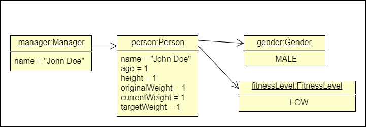
 
**Step 2**. The user inputs `name Jack` command to enter their name into DietBook. The `name` command calls `Manager#setName(Jack)`, to store the name in `Manager` first. After which, user will be prompted to enter all other details.

_Object Diagram:_ 
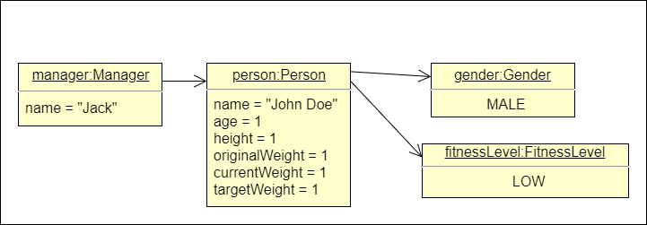

_Sequence Diagram:_ 
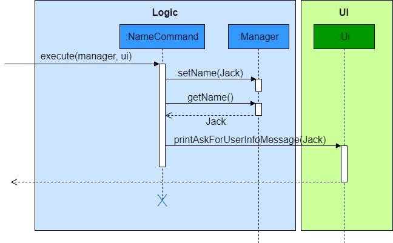
  
**Step 3**. The user inputs a command like the following `info g/M a/21 h/175 o/85 c/85 t/75 f/2` to enter all other personal information including age, gender, height, fitness level, original, current and target weight. The `info` command then calls `Parse#executeProcessedInfo(info g/M a/21 h/175 o/85 c/85 t/75 f/2, manager)` before calling `Manager#setPerson(Jack, Gender.MALE, 21, 175, 85, 85, 75, FitnessLevel.LOW)` which proceeds to call `Person#setAll(Jack, Gender.MALE, 21, 175, 85, 85, 75, Fitness.LOW)`.

_Object Diagram:_ 
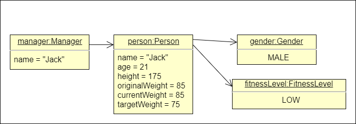 

_Sequence Diagram:_ 
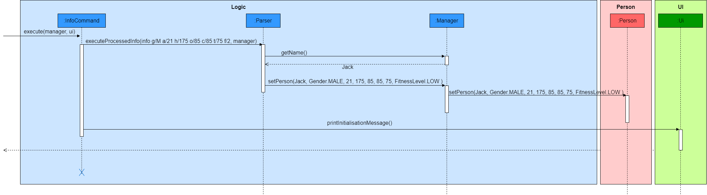
   
#### Design considerations:

Aspect: Whether to enter name and other information separately or together

* **Alternative 1 (current choice)**: Enter name and other information separately
    * Pros: Increase user interaction and engagement.
    * Cons: Enter information using two commands.

* **Alternative 2**: Enter name and other information together
    * Pros: Enter all information at once.
    * Cons: Decrease user interaction and engagement.
    
Aspect: Single or multiple usage of feature and command words

* **Alternative 1 (current choice)**: Single usage of feature and command words, requiring any subsequent editing of user information to be done through another command
    * Pros: Increase user interaction and engagement during initial setup. Enable users to edit any information thereafter more conveniently through one command. The two features of entering and editing personal information are clearly differentiated.
    * Cons: Three commands need to be implemented, potentially leading to more bugs.
    
* **Alternative 2**: Multiple usage of feature and command words such that any subsequent editing of user information can be to be done the same command
    * Pros: Two commands need to be implemented, likely to have lesser bugs.
    * Cons: Decrease user interaction and engagement during initial set up. Subsequent editing needs to be done through two commands and there is no differentiation between the two features of entering and editing personal information.

Aspect: Whether to use singleton pattern for Person class

* **Alternative 1 (current choice)**: Did not use singleton pattern for `Person`
    * Pros: Reduce coupling and increase testability.
    * Cons: Risk of creating multiple `Person` object by mistake and there might be negative consequence in creating multiple objects.
    
    However, there is minimal risk of creating multiple `Person` object by mistake and minimal negative consequence in creating multiple objects as long as the `Manager` refers the correct instance of `Person`.
      
* **Alternative 2**: Use singleton pattern for `Person`    
    * Pros: Easy to implement, prevent the instantiation of more than one `Person` object.
    * Cons: Increase coupling and reduce testability

Aspect: Changing attribute values in `Person` object or creating new `Person` object

* **Alternative 1 (current choice)**: Changing attribute values in `Person` object 
    * Pros: Reduce the number of objects being created to reduce memory usage and reduce the risk of creating multiple objects which can potentially lead to negative consequences and bugs.
    * Cons: Unable to write tests as method chains.

* **Alternative 2**: Creating new `Person` object
    * Pros: Ability to write tests as method chains.
    * Cons: Creation of many objects, which takes up memory space. Have to ensure that only the correct `Person` instance is kept and referred to.

### Edit user information feature

#### Implementation

This feature allows users to edit their personal information after it has been entered into the system during the initial set up using the [Enter user information feature](#enter-user-information-feature). This feature was implemented to allow long term users to update their personal information like age, current weight, etc when necessary and also for careless users to edit their personal information if they have entered it wrongly.

**Command word used**:

* [`editinfo`](https://ay2021s1-cs2113-t14-4.github.io/tp/UserGuide.html#editing-user-information-editinfo): Edits the user information stored in the application. 
The command is implemented in such a way that **one or more changes to the personal information can be made** using a single command. Below are some examples of valid commands. 
    * `editinfo a/22`: Edits the age of the user to `22`
    * `editinfo a/22 c/80`: Edits the age of the user to `22` and the current weight to `80`.
    * `editinfo n/Jane g/F a/22 h/165 o/70 c/63 t/60 f/3`: Edit the name, gender, age, height, original, current and target weight as well as the fitness level of the user to `Jane`, `female`, `22`,`165`, `70`, `63`, `60` and `You engage in moderate amount of exercise or have a job that requires moderate physical activity.` respectively.

**Main classes and methods used**: 

* [`Person`](https://github.com/AY2021S1-CS2113-T14-4/tp/blob/master/src/main/java/seedu/dietbook/person/Person.java): Stores all user information provided.
    * `Person#setName(String newName)`: Updates the name the `Person` object.
    * `Person#setGender(Gender newGender)`: Updates the gender of the `Person` object.
    * `Person#setAge(int newAge)`: Updates the age of the `Person` object.
    * `Person#setHeight(int newHeight)`: Updates the height of the `Person` object.
    * `Person#setOriginalWeight(int newOriginalWeight)`: Updates the original of the `Person` object.
    * `Person#setCurrentWeight(int newCurrentWeight)`: Updates the current weight of the `Person` object.                                             
    * `Person#setTargetWeight(int newTargetWeight)`: Updates the target weight of the `Person` object.    
    * `Person#setFitnessLevel(FitnessLevel newFitnessLevel)`: Updates the fitness level of the `Person` object                                       
                                        
**Example usage scenario and how the feature work** 
_Summary_: The corresponding existing values in `Person` class would be updated to the inputted values, even if the new value given is the same as the existing value.

**Step 1**. Takes for example the user's name, age, gender, height, fitness level, original, current and target weight are currently `Jack`, `21`, `male`, `175`,`You engage in some form of light exercise or have a job that requires some physical activity.` ,`85`, `85` and `75` respectively. 

_Object Diagram:_ 

 
**Step 2**. When the user wishes to edit their age and current weight, they can enter a command like the following `editinfo a/22 c/80`. The `editinfo` command would call `Parse#executeEditInfo(editinfo a/22 c/80, manager)` before `Person#setAge(22)` and `Person#setCurrentWeight(80)` is called.

_Object Diagram:_ 

_Sequence Diagram:_ 
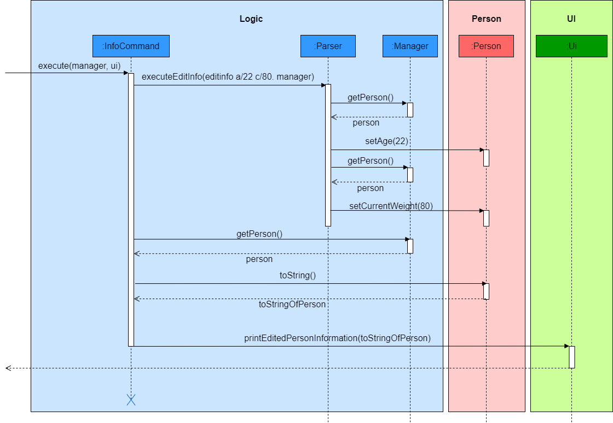
   
#### Design considerations:

Aspect: Whether one or more changes to the personal information can be made using a single command or through the use of various commands

* **Alternative 1 (current choice)**: One or more changes to the personal information can be made using a single command
    * Pros: Easier and more convenient for the user when editing multiple pieces of personal information. Less user commands required.
    * Cons: Harder to implement.

* **Alternative 2**: Each piece of personal information is changed using separate commands
    * Pros: Easier to implement.
    * Cons: Tedious for the user to edit multiple pieces of personal information. More user commands required.
    
Aspect: Use of multiple or single setter method(s)

* **Alternative 1 (current choice)**: Use of multiple setter methods each updating an attribute in the `Person` class 
E.g.`Person#setName(String newName)`: Updates the name the `Person` object. 
E.g.`Person#setGender(Gender newGender)`: Updates the gender of the `Person` object. 
    * Pros: Easier to implement and uses the KISS principle.
    * Cons: More method calls is required, possibly resulting in more bugs due to wrong method calls.

* **Alternative 2**: Use of a single setter method that is able to update a variable number of attributes in `Person` class
    * Pros: Lesser method calls is required, possibly resulting in lesser bugs due to wrong method calls.
    * Cons: Harder to implement.

Head over to the Design Considerations Section in the [Enter user information feature](#enter-user-information-feature) for more related design considerations.

### View user information feature

#### Implementation

This feature allows users to view their personal information stored in system. It was implemented to allow users to validate their personal information so that they can edit it if necessary using the [Edit user information feature](#edit-user-information-feature).

**Command word used**:

* [`userinfo`](https://ay2021s1-cs2113-t14-4.github.io/tp/UserGuide.html#viewing-user-information-userinfo): Shows the user information stored in the application.

**Main classes and methods used**: 

* [`Person`](https://github.com/AY2021S1-CS2113-T14-4/tp/blob/master/src/main/java/seedu/dietbook/person/Person.java): Stores all user information provided.
    * `Person#toString()`: Returns a string representation of all user information.
                                        
**Example usage scenario and how the feature work** 
 
**Step 1**. When the user wishes to view their personal information, they can enter`userinfo`. The
 `userinfo` command would call `Person#toString()`.

_Sequence Diagram:_ 
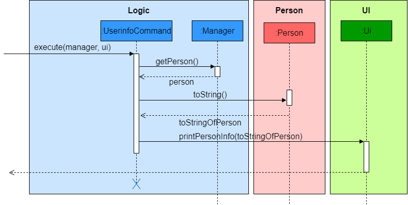

### [Proposed] Supporting missing fields in a user entry

This feature gives the user some flexibility, allowing them to make an entry without full knowledge of the nutritional information of the food that they are eating.
Due to limitations in what can be estimated, there are only two main scenarios for missing fields: a missing total calorie count or some combination of missing nutritional values (carbohydrates, proteins, fat).

#### Implementation details

**Main components involved**: 
`Manager`: Parses the user input and creates an `AddCommand` based on the details provided in the user input. It recognises that some combination of the optional inputs are missing and flags them to `FoodList` when calling the `FoodList#addFood(...)` method by using `OptionalFood.EMPTY_VALUE = -1` as the input value.

`FoodList`: A food entry is created via the `FoodList#addFood(...)` method, which has some arguments set to `OptionalFood.EMPTY_VALUE = -1`. Hence, when a `FoodEntry` is instantiated, the `FoodManager#createFood(String name, int calorie, int carbohydrate, int protein, int fat)` recognises the flags in the arguments and creates an `OptionalFood` instead of `Food`, for which a reference is kept in `FoodEntry`. When a method requiring `FoodEntry#getFood()` is called, `FoodManager` is called via `FoodManager#retrieveFood(Food food)` to return a `Food` object with guesstimated nutritional values. This guesstimation process is done by the `NutritionCalculator` class.

#### Usuage Example

There are essentially two phases to the usuage of `FoodManager` and its associated dependencies: the creation of a `OptionalFood` that has missing values and the retrieval of a guesstimated `Food` object when `FoodEntry#getFood()` needs to be called.
For brevity, the focus will be on the processes within `FoodList`.

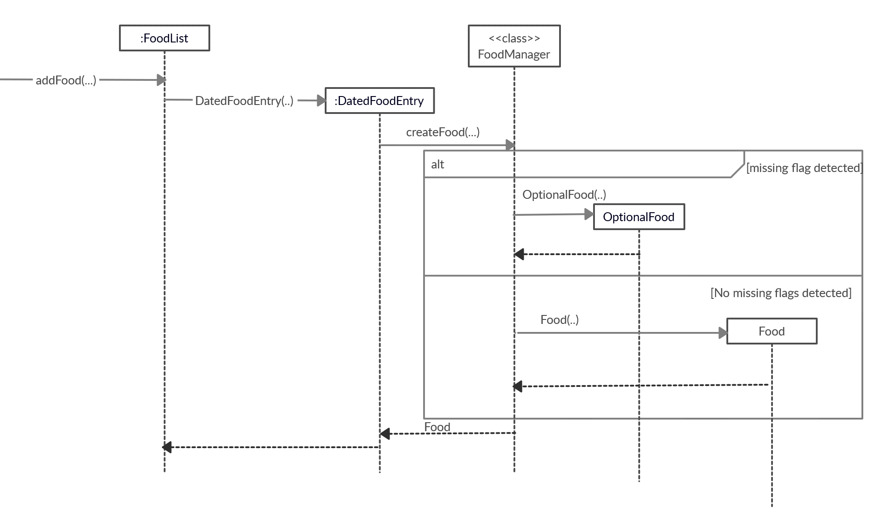

**Creation**:
1. `FoodList#addFood(int portionSize,String name, int calorie, int carbohydrate, int protein, int fat)` (or its variant for backlogs: `FoodList#addFoodAtDateTime(...)`) is called by the Logic component to add a new entry with missing nutritional inputs. The missing inputs are encapsulated by `OptionalFood.EMPTY_VALUE = -1` flags.
1. `FoodList#addFood(...)` instantiates a new instance of `DatedFoodEntry`, passing on the arguments and flags to it instead. `DatedFoodEntry` uses `FoodManager#createFood(String name, int calorie, int carbohydrate, int protein, int fat)` to instantiate a `Food` object. Because there are missing values, `FoodManager` actually instantiates `OptionalFood`, a child class of `Food` instead. A reference to this `OptionalFood` object is stored in the `DatedFoodEntry`. The newly instantiated `DatedFoodEntry` is also stored in the list of `FoodEntry` objects in `FoodList`.

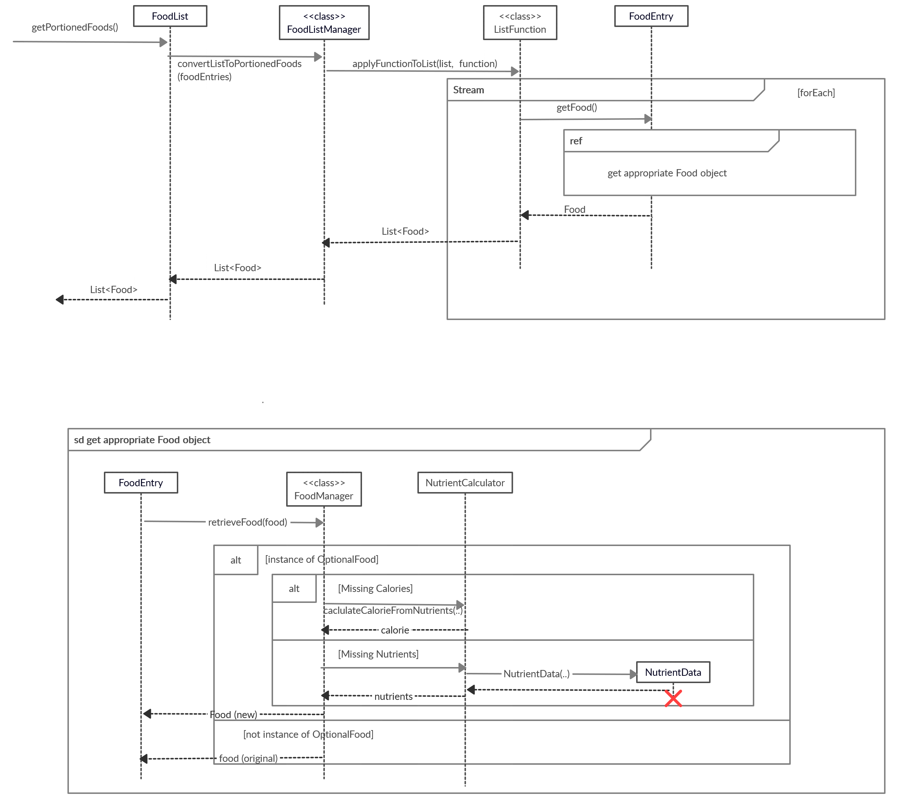

**Retrieval**:
1. The method `FoodEntry#getFood()` is only called within functions of `FoodListManager`. When a method such as `FoodList#getPortionedFoods()` is called, `FoodListManager#convertListToPortionedFoods(List list)` is subsequently called.
1. `FoodListManager#convertListToPortionedFoods(List list)` calls `ListFunctions#applyFunctionToList(List list, Function function)`, and passes `FoodEntry#getFood()` within the function argument.
1. `ListFunctions#applyFunctionToList(List list, Function function)` executes the function containing `FoodEntry#getFood()` in its `forEach` stream.
1. `FoodEntry#getFood()` calls the method `FoodManager#retrieveFood(Food food)`, passing its `Food` object as an argument.
1. `FoodManager#retrieveFood(Food food)` checks whether the `Food` object is an instance of `OptionalFood`. If it is an `OptionalFood`, then it is handled differently based on the missing information. Otherwise, the `Food` object is simply returned.
1. The missing information in `OptionalFood` is calculated using `NutritionCalculator` based on what is missing: if calorie is missing, then `NutritionCalcular.calculateCalorieFromNutrients(int carbohydrate, int protein, int fat)`is called, otherwise `NutritionCalculator.calculateNutrientsFromCalorie(int calorie, int carbohydrate, int protein, int fat)` is called instead to calculate the missing nutrient masses.
1. With the calculated information, a new `Food` object containing the estimates is created and returned by `FoodManager#retrieveFood(Food food)`, leaving the original reference to the `Food` object in `FoodEntry` unmodified in any case.

#### Future work
Only simple methods of estimating the missing information is used by `NutritionCalculator`. We can allow the user the weight the split of missing nutritional values differently (it is currently all weighed equally and split by calorie contribution). This ought to be performed by the `Calculator` component since that is its main role. However, due to the fascade pattern being used in this implementation, the difficulty to add this feature is increased: in order to maintain the status of `FoodList` being non-dependent on the other components, it is recommended that functions to split the nutrients be passed to FoodManager instead (i.e. use a functional paradigm).

Additionally, storage of the `FoodList` should support the storage and retrieval of such missing values. Currently, only the estimated versions of the Foods are stored, and information on its status as a Food  that had missing values (an `OptionalFood`) is lost.

#### Design Considerations

* **Alternative 1** (Current choice): Fascade pattern using `FoodManager` to obscure the details and processes behind the handling of a `Food` object with missing values. It is noted that the `OptionalFood` class is obscured in this process, despite being a child class of the common class `Food`.
    * Pros: All higher level components and dependencies do not need to deal with the existence of a new common class `OptionalFood` or check for the possibility of missing values within `Food`. This implementation limits the existence of instances of `OptionalFood` to within the `FoodEntry` class.
    * Cons: New test suite for `FoodEntry` and `FoodManager` had to be created and maintained due to the use of this design pattern. It also makes future work with other components that want to interact with `FoodManager` more difficult (see Future Work section).

* **Alternative 2**: An adapter pattern with a similar implementation could be used. In this case, `FoodManager` could be exposed as a seperate set of API that should be invoked whenever an `OptionalFood` needs to be handled. `FoodManager` becomes an adapter that components such as `FoodListManager` or other classes use when there is the possibility of an `OptionalFood` object.
    * Pros: It becomes easier to extend the features of `FoodManager` since it is exposed and can vary independently. It is also easier to test.
    * Cons: Other higher level classes need to be aware of `FoodManager` and potentially even `OptionalFood` if the latter is allowed to be passed around outside of `FoodList`.
=======

## Save/Load Feature

The Save/Load feature is implemented by the saveload package.
At the base of the package, there is the `Saver`
and `Loader` class.

### Design
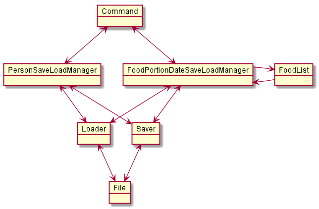
Note only the Saver and Loader class is flexible. They can be adapted to new situations without modifying
the code. The FoodSaveLoadManager and PersonSaveLoadManager are written specifically for this version. They
will have to be modified/replaced for future versions.

#### Saver class

Stores data in a internal table with length and height specified.
Handles the storage of its data by writing to a text file.

##### Constructor
Specifies the length and height of the internal Saver table
##### Main Methods
* `Saver#save()` saves the current data to the file in the folder with the given file name
* `Saver#add()` Store String data in the x,y position in the table

#### Loader class
Loads data from a text file and stores it in a internal table just like the saver
##### Constructor
`static method Loader.load(folder name , file name)` : creates a Loader object with 
a table storing the data found in the text file
##### Main Methods
* `Loader#get()` retrives the data stored in the loader

#### FoodPortionDateSaveLoadManager class
Built on top of Saver and Loader class to implement save/load functionality
for list of food items the user has input into the dietbook. Contains a instance
of both `Saver` and `Loader`. It has its own folder to work with,
the user only has to specify the file name. To save the contents of a `FoodList`, call 
`FoodPortionDateSaveLoadManager#saveFoodList(FoodList foodlist, String fileName)` 
To load a file, call `FoodPortionDateSaveLoadManager#load()` first to load the contents of the file into
the `FoodPortionDateSaveLoadManager` and then call `FoodPortionDateSaveLoadManager#saveFoodList()` to
return the `FoodList` with those contents. 

##### Main Methods
* `FoodPortionDateSaveLoadManager#saveFoodList()` saves the contents of the `FoodList` object
* `FoodPortionDateSaveLoadManager#load()` loads the file and store the contents 
* `FoodPortionDateSaveLoadManager#saveFoodList()` returns a `FoodList` with the contents of the 'FoodPortionDateSaveLoadManager'

#### PersonSaveLoadManager class
Built on top of Saver and Loader class to implement save/load functionality for user information
Same as `FoodPortionDateSaveLoadManager`, it has its own folder to work with, the user only has to specify the file name
Unlike the `FoodPortionDateSaveLoadManager`, it stores the data inside itself and can be updated.
##### Main Methods
* `PersonSaveLoadManager#save()` save the current state into the file
* `PersonSaveLoadManager#load()` loads the file 
* Setters and Getters for all the personal data in this current version

#### UML diaghram
##### `FoodPortionDateSaveLoadManager#save()`
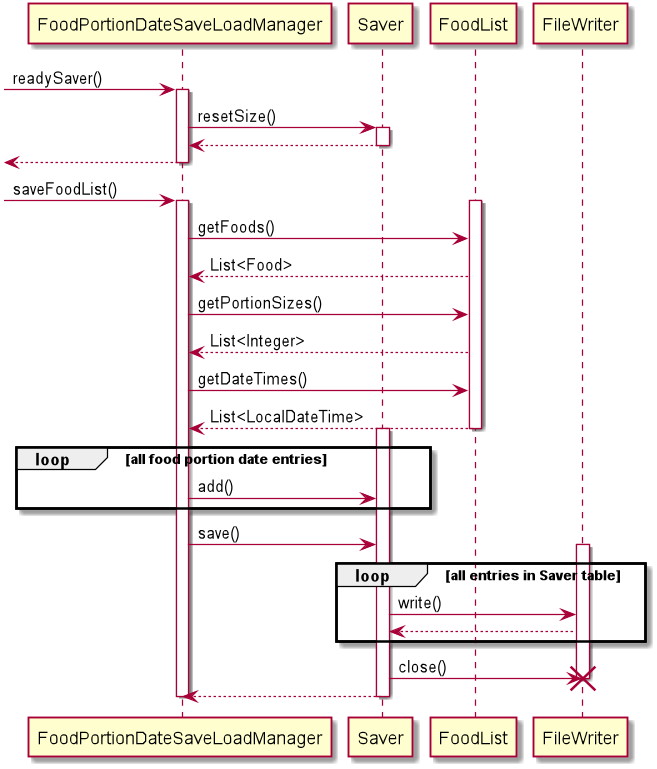
##### `FoodPortionDateSaveLoadManager#load()`
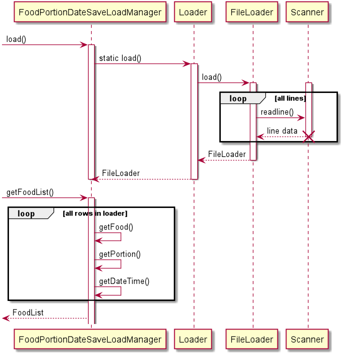
similiar diaghrams for `PersonSaveLoadManager`

## DataBase feature
`DataBase` stores a list of food items that can be found in NUS and can be accessed by user
The data is organized into a Canteen contains a number of Stores each of which contains a list of food items
It also offers a number of filtering and searching methods. The data base resource is a text file which
can be manually updated. 

### DataBase class
Stores a `List` of `Canteen` objects. Each `Canteen` object stores a `List` of `Store` object,
each `Store` object contains a `List` of `Food` objects. Currently has a number of filtering and searching
methods. These methods can easily be modified and new ones implemented depending on the needs of the application. 

##### Main Methods
* `DataBase#init()` reads from the data text resource and loads the contents into itself
* searching methods Examples 
    * `DataBase#searchFoodByIndex()` returns the `Food` with the provided index
    * `DataBase#searchFoodByName()` returns the first `Food` object that contains the string provided
    * `DataBase#searchAllFoodContainingName()` returns a `Stream<Food>` that contains all `Food` containing the string provided

### Manually editing the text resource
As of this version, there is no dev mode for an administrator or a user to add new items to the
data base. This can be done manually by directly editing the data.txt resource.

##### Format of data.txt resource
The `DataBase#init()` method reads the data.txt file line by line
**&%START** and **&%STOP** the `DataBase#init()` method will read anything between these two indicators
initially the data base is in the `_*canteen*_` state, the next line it reads will be the canteen name
when it moves from the canteen name line to the next line, it is in the `_*store*_` state,
again the next line it reads will be the store name, when it moves from the store name line to the next line,
now it is in the `_*food*_` state. In this state, input a line in the format `{food name}|{calorie}|{carbohydrate}|{protein}|{fats}`,
this will add a food item. Any number of food lines can be written and the database will be in the `_*food*_` state.
To go back up to the store state, write a line of **&%UP**. If a store name is given in the next line, the database
will again be in the `_*food*_` state. To go back up to the canteen state write 2 consecutive lines of **&%UP**.
##### Example 
|data.txt line|explanation|before state|after state|
|-----------------------------------------------------|-----------------------------------------------------------|-----------------|---------------|
|&%START| starts the reading | not reading | canteen |
| canteen1 | set the current canteen name to canteen1 | canteen | store |
| store 1 | sets the current store name to store1 | store | food |
| food1 | adds a food with the data of food1 | food | food |
| food2 | adds a food with the data of food2 | food | food |
| &%UP | goes up to store | food | store |
| store 2 | sets the current store name to store2 | store | food |
| food 3 | adds a food with the data of food3 | food | food |
| &%UP | goes up to store | food | store |
| &%UP | goes up to canteen | store | canteen |
|&%STOP | stops the reading | canteen | not reading |

### UML diagram 
##### `DataBase#init()`
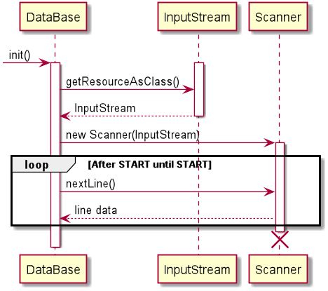
##### `DataBase#search()`
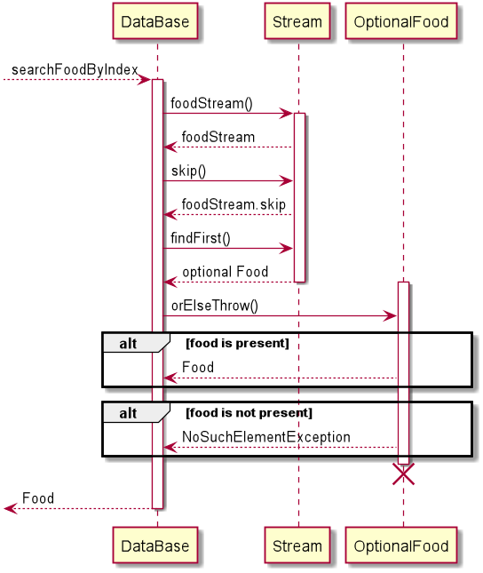

## Product scope
### Target user profile

NUS students living on campus who would like to track their diet.

### Value proposition

DietBook is designed to **track the food and different kinds of nutritional intake** of the user. It can also provide the user with a **daily calorie recommendation** based on their personal information. As the application mainly targets _NUS students staying on campus, it has a **database prepopulated with food items commonly found around NUS**. This allows for such food items to be easily added to the list of food items consumed for tracking.

## User Stories

|Version| As a ... | I want to ... | So that I can ...|
|--------|----------|---------------|------------------|
|v1.0 v2.0|person with an ideal weight in mind|input my target weight and relevant information|get daily calorie intake recommendations|
|v1.0|careless or long term user|be able to view my personal information|make changes when necessary|
|v2.0|careless user|be able to edit my personal information|make changes if I input the wrong information|
|v2.0|potential long term user|be able to edit my personal information|make changes to information like age, weight and fitness level as it can changes over time|
|v2.0|user that wants to track weight changes|be able to view the weight I started off with, my current weight and the weight I desire|take note of my progress|

## Non-Functional Requirements

1. Should work on any mainstream OS as long as `Java 11` is installed in the system.
1. A user who can type fast and prefer typing over mouse/voice commands should be able to accomplish the same tasks faster when using Command Line Interface, the interface implemented by that DietBook, as compared to other modes of inputs.

## Glossary

* _Mainstream OD_ - Windows, Linux, Unix, OS-X
* _Food items_ - Includes both food and drinks 
* _Nutrient / Nutritional intake_ - Includes carbohydrates, fats, proteins and calories
* _Information / Personal information_ - Includes name, age, gender, height, fitness level, original, current and target weight.
* _Database_ - Contains a list of commonly found food items in the National University of Singapore

## Instructions for manual testing

Given below are instructions to test the app manually.

### Entering user information

1. Entering name or nickname into the application
    1. Test case: `name Tom and Jerry` 
    Expected: The name `Tom and Jerry` will be stored in the system and a message prompting the user to enter all other details will be displayed.
    1. Test case: `name *1*` 
    Expected: The name `*1*` will be stored in the system and a message prompting the user to enter all other details will be displayed.
    1. Test case: `name Ja/ck` 
    Expected: No name will not be stored in the system and an error message will be displayed.
    1. Test case: `nameJack` 
    Expected: Similar to previous.
    1. Test case: `name` 
    Expected: Similar to previous.
    1. Test case: `Name Jack` 
    Expected: Similar to previous.
    
1. Entering other personal information into the application (all seven pieces of information is required e.g. age, height, etc)
    1. Test case: `info g/M a/21 h/175 o/85 c/85 t/75 f/2` 
    Expected: All information is stored in the system and a message stating that initialising is complete will be displayed.
    1. Test case: `info o/85 a/21 f/2 h/175 g/M c/85 t/75` (where parameters can be entered in any order) 
    Expected: Similar to previous.
    1. Test case: `info g/Ma/21h/175 o/85 c/85 t/75 f/2` (where there are no spaces between the different parameters) 
    Expected: Similar to previous.
    1. Test case: `Info o/85 a/21 F/2 h/175 g/M c/85 t/75` (where any letter of the command word or parameter tags are capitalised) 
    Expected: The information is not stored in the system and an error message will be displayed.
    1. Test case: `infog/M a/21 h/175 o/85 c/85 t/75 f/2`  
    Expected: Similar to previous.
    1. Test case: `info g/M a/21 h/175 o/85 c/85 t/75 f/2 z/9` (where extra parameters,parameter tags or words are present) 
    Expected: Similar to previous.
    1. Test case: `info g//F a/21 h/175 o/85 c/85 t/75 f/2` (where `/` or any other special characters is used inappropriately) 
    Expected: Similar to previous.
    1. Test case: `info g/f a/160 h/500 o/900 c/85 t/75.6 f/7`(where age, height, weights, gender and fitness level are not within the valid ranges or not valid - refer to [User Guide](UserGuide.md) for more information)  
    Expected: Similar to previous.
    1. Test case: `info a/21` (where any of the required parameters are missing) 
    Expected: Similar to previous.
    
### Editing user information

1. Editing user information store in the application (one or more change(s) is/are allowed) 
    1. Test case: `editinfo n/Jane` 
    Expected: User's personal information is displayed and the name of the user is updated to `Jane`.
    1. Test case: `editinfo a/22 c/80` (where variable number of information is changed) 
    Excepted: User's personal information is displayed and the age of the user is updated to `22` while the current weight is updated to `80`.
    1. Test case: `editinfo` 
    Expected: User's personal information is not updated and an error message is displayed.

Refer to [Entering User Information Section under Instructions for manual testing](#entering-user-information) for **similar** test cases that can be used for testing.

### Viewing user information

1. Viewing user personal information stored in the application 
    1. Test case: `userinfo` 
    Expected: User's personal information is displayed.
    1. Test case: `userinfo userinfo` 
    Expected: User's personal information will not be displayed. Error message will be shown to user.
    1. Test case: `Userinfo` 
    Expected: Similar to previous.
