# Developer Guide

  
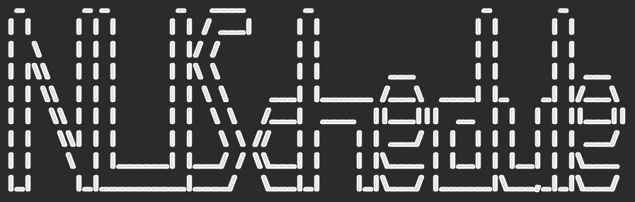 

Yang Jiaqi 

Zhuang Mengjin 

Xu Che 

Wu Nan 

Wan Shi Jie Brendan 

## Table of Contents

* [1. Introduction](#intro)
* [2. Getting Started](#getting_started) 
    * [2.1. Prerequisites](#prerequisites) 
    * [2.2. Setting Up](#setting_up) 
* [3. Design](#design)  
    * [3.1 Architecture](#architecture)  
    * [3.2 UI](#ui)  
    * [3.3 Storage](#storage)  
    * [3.4 Logic](#logic)  
    * [3.5 Model](#model)  
        * [3.5.1. Event](#event)  
        * [3.5.2. Location](#location)  
* [4. Implementation](#implementation)  
    * [4.1. Add events](#add_events)  
    * [4.2. Clear events](#clear)  
    * [4.3. Edit events](#edit)  
    * [4.4. Locate](#locate)   
    * [4.5. Reminders](#reminder)  
    * [4.6. Sort events](#sort)  
    * [4.7. View events](#view)  
    * [4.8. Help](#help)  
    * [4.9 Repeat](#repeat)  
    * [4.10 Delete](#delte)  
    * [4.11 Find](#find)  
    * [4.12 Find based on date](#date)  
    * [4.13 Print locations of a certain group](#location_group)  
    * [4.14 Study time](#study_time)  
    * [4.15 Done](#done)  
    * [4.16 User Info](#user_info)  
* [5. Documentation](#documentation)  
* [6. Testing](#6-testing) 
* [Appendix A. Product scope](#appendix-a-product-scopea-idproduct_scopea) 
* [Appendix B.User stories](#appendix-b-user-storiesa-idstoriesa) 
* [Appendix C. Non-functional requirements](#appendix-c-non-functional-requirements) 
* [Appendix D. Instructions for manual testing](#appendix-d-instructions-for-manual-testing)

## 1. Introduction
  
NUSchedule is a Command-Line based application that manages all of your commitments. Built with a clean and intuitive
interface, NUSchedule will help you manage your commitments without any hassle. If you are a proficient in typing, 
NUSchedule will prove itself to be the most efficient way to manage your commitments.  
  
This developer guide provides information on the architecture and design of the application, NUSchedule. This guide
provides information that will not only help you get started as a NUSchedule contributor, but that you will find useful
to refer to even if you are already a contributor.

## 2. Getting Started
  
This section provides information to help you get NUSchedule up and running on your own computers.

### 2.1 Prerequisites
  
1. JDK 11
2. Intellij IDEA

### 2.2 Setting Up
  
1. Fork [this repo](https://github.com/AY2021S1-CS2113T-F14-4/tp), and clone the fork onto your computer.   
2. Open IntelliJ (if you are not in the welcome screen, click File > Close Project
to close the existing project dialog 
first).   
3. Set up the correct JDK version for Gradle  
    1. Click Configure > Project Defaults > Project Structure
    2. Click New… and set it to the directory of the JDK.
4. Click Import Project (or Open or Import in newer version of Intellij).
5. Locate the build.gradle file (not the root folder as you would do in a normal importing) and select it. Click OK.
   If asked, choose to Open as Project (not Open as File).
6. Click OK to accept the default settings but do ensure that the selected version of Gradle JVM matches the JDK 
   being used for the project.

## 3. Design
  
This section describes the different components of the application and how each component interact with
each other to run the program. 

### 3.1 Architecture
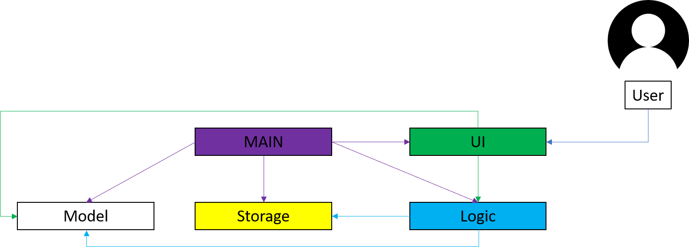 

The Architecture Diagram above provides a high-level view of the design of NUSchedule. The app can be broken down into 
5 different components:  
1. Main: Initializes the other components and connects them with each other.
2. UI: Manages the User Interface that the user interacts with.
3. Logic: Interprets user commands.
4. Storage: Reads data from and writes data to the hard disk.
5. Model: Stores the data the app uses in memory.

### 3.2 UI
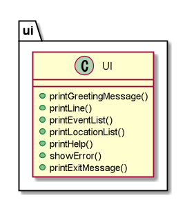 

*Figure 3.2.1 Class diagram for UI component*

 __API__:`UI.java`  
The UI consists of various parts, e.g. `printGreetingMessage`, `printEventList`, `showError`, `printNumEvent`, etc.
 
The `UI` component reads user input using readCommand() and then executes user commands according to the Logic component.

### 3.3 Storage
__API__:`Storage.java`
The `Storage` component can save the list of event data in .txt format and read it back.   
### 3.4 Logic
__API__:`Parser.java`  

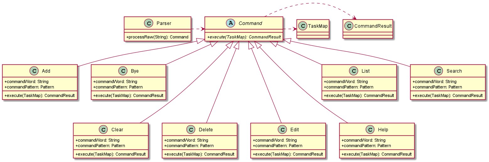 

*Figure 3.4.1 Class diagram for Logic component*

The `Logic` component parses the user input and executes commands based on the given input.
 1.	Parser reads the user input and returns a command to be executed by `NuSchedule`.
 2.	The command execution affects the EventList (e.g. clearing the list).
 3.	The result passes back to the UI, which then displays relevant feedback to the user (e.g. successful execution).  

### 3.5 Model
The `Model` component stores an ArrayList, events, that represents the current list of events and available locations.

#### 3.5.1 Event
__API__:`EventList.java`   

### 3.5.2 Location
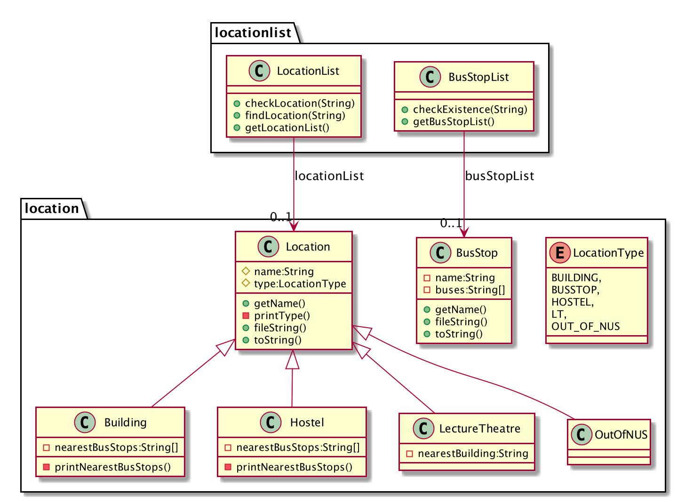  
*Figure 3.6.1 Class diagram for location component*

__API:__ `LocationList.java`  

The `LocationList` is made up of an ArrayList of Locations, which is a type of variable that stores different information 
for different types of location (eg. `Building`, `Hostel`, etc.). However, do note that any place that is 
not within the list of saved locations will be saved as type `OutOfNUS`, and would not be saved into the `location.txt` 
file. The location will still be part of the location list before the app closes, and it will also be 
saved as part of the Event information.

 There is a separate api for bus stops (`BusStopList.java`), which stores all available bus stops 
and their information. Although the variable is declared in the main NUSchedule class, it is only referenced 
and not edited in any part of the program.

 The `Location` component 
* stores information about various types of locations 
* prints the list of locations that is saved in the data file 
* checks if a location is being saved in the list and returns the location when asked

## 4. Implementation

This section describes the implementation of some noteworthy features. 

### 4.1 Add events
  
This feature allows users to add events and relevant information about them (description, time and location) to the list
. There are three possible types of events that can be added: classes, assignments, and personal events.

Given below is an example usage scenario:

Step 1. The user launches the application to add a class to his schedule. The user executes 
`class CS1010 Lecture /t 2020-05-05 10:00 /e 2020-05-05 12:00 /l LT27` to add a new class to the list.  

Step 2. The Parser class parses the input as a new class with description ‘CS1010 Lecture’,
starting time ‘2020-05-05 at 10:00’, ending time ’2020-05-05 at 12:00’, and location ‘LT27’.  

Step 3. `addCommand()` is then called with the above parameters, and calls `addEvent()` from EventList to adds it to the list of events. It also checks 
whether there are any events that overlap in timing with the newly added event. The newly added event is then printed for the user through `UI`.

The sequence diagram below shows the process of adding a new event.
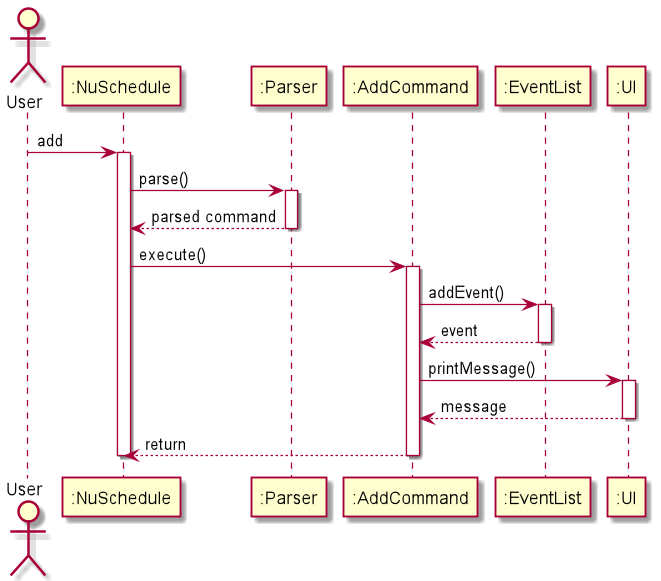 
*Figure 4.1 Sequence Diagram for add function*

### 4.2 Clear events
  
This feature allows users to completely delete the existing event information that is previously typed in by users.
Users may choose to delete all events, events happened one month ago, or events happened before a certain date.

Given below is an example usage scenario:

Step 1. The user launches the application and wants to clear some events that happened a long time ago as there is no
need to refer to these events anymore. The user types `clearBefore 2020-06-01` to clear all events before 1st June, 2020.

Step 2. The Parser class parses the input and identifies the full command to be a ClearBeforeCommand class, and so
`clearBeforeCommand()` will be called to create a `clearBeforeCommand` object with parameter `2020-06-01`. 

Step 3. After that, the `execute()` function of `clearBeforeCommand` will be called and as a result `EventList#clearBefore(clearDate)` will
also be called, where `2020-06-01` will be passed as the parameter `clearDate`.

Step 4. The user wants to clear all the extra information of events but does not want to do it manually, hence the user 
types in `autoClear on` to turn on the autoClear function, which will clear all events happened one month ago automatically.
This function can be switched off by typing `autoClear off`.

Note that the command `clear` does not require any parameter input.

The sequence diagram below shows the process of clearing events before a certain date.
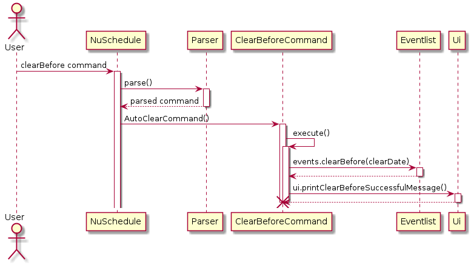 
*Figure 4.2.1 Sequence Diagram for clearBefore function*

The sequence diagram below shows the process of clearing all events.
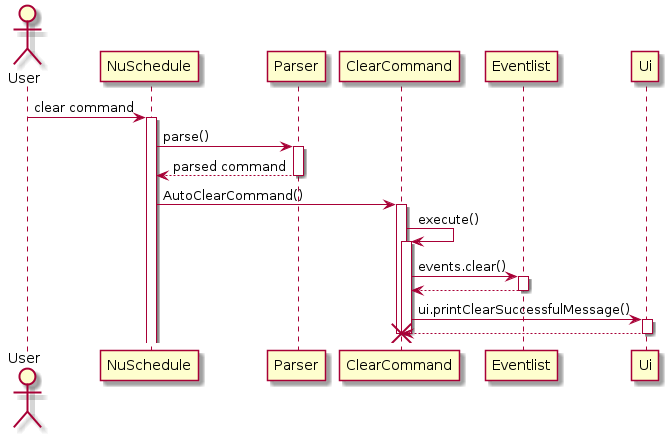 
*Figure 4.2.2 Sequence Diagram for clear function*

### 4.3 Edit events
  
This feature allows users to edit the information of events that was previously added. 

Given below is an example usage scenario:

Step 1. The user launches the application and inputs `assignment homework \t 2020-02-02 20:00 \l home` command to add an event. 

Step 2. The user realises that there was a mistake in the event added and decides to edit the task information by 
entering `edit 1`, which will be parsed by `Parser` and calls an `EditCommand` object.  

Step 3. The user follows the instructions on screen and enters the desired changes.  

Step 4. `EditCommand#execute()` will call `EventList#editEvents` to edit the event.  

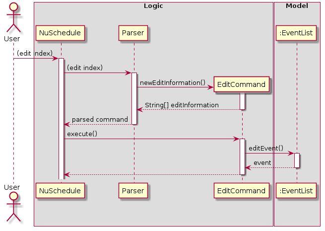 
*Figure 4.3 Sequence Diagram for EditCommand()*

### 4.4 Locate
  
This feature allows users to add locations as part of the event information. If the place is located within the school, 
additional information about the location will be provided such as nearest bus stops or buildings. If the place is a 
bus stop, the buses available will be provided instead. The user will add location name as the last piece of information 
when adding an event. The LocationList has a method that searches for the place with the exact same name, if such a 
place is not found, it will create a location and allocate it to be OutOfNUS.  

This feature also allows users to search for a location based on a given location name, or the location where an event 
is held. It will print out additional information about the location to the user. 

The `locate` command executes with the following steps: 
  
Step 1. When the user type in `locate [input]`, the Parser class will extract the input from the command and call a 
`LocateCommand` object.  
* `input` will always be a String when passed into the command object. 

Step 2. `LocateCommand` will then try to convert the input into an integer, if possible.  

Step 3. If conversion is possible, the method will obtain the event at the given index and return its location 
information.  
* Tries to catch `IndexOutOfBoundException` to check if the given index is within the range of the
event list.

Step 4. If conversion is not possible, then it will check if the given string is a valid location.  
* Returns the location if valid
* Prints an error message if invalid   

The sequence diagram below shows exactly which methods, from which classes, are called to obtain the required location. 
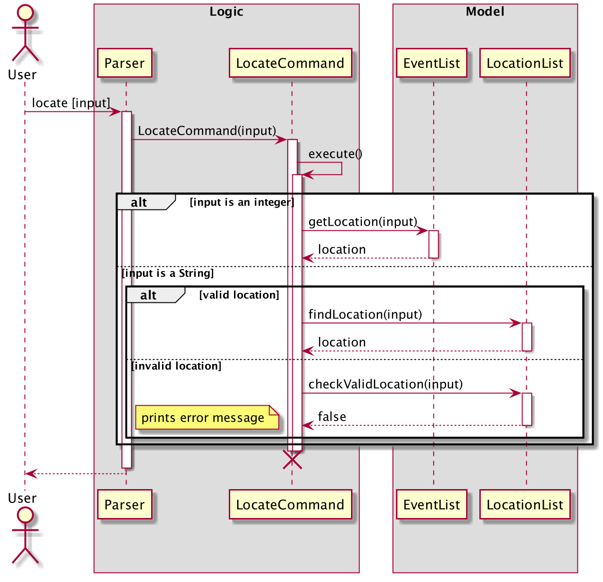 
*Figure 4.4 Sequence diagram for locate function*

### 4.5 Reminder
  
This feature allows users to get a reminder of the events that will occur today.

Given below is an example usage scenario:

Step 1. The user wants to see all the events that are happening today. He inputs the command `reminder`.

Step 2. The command filters the list of all events based on the current date.

Step 3. It then calls `UI` to print the filtered list.

The sequence diagram belows shows the process of executing the reminder command.
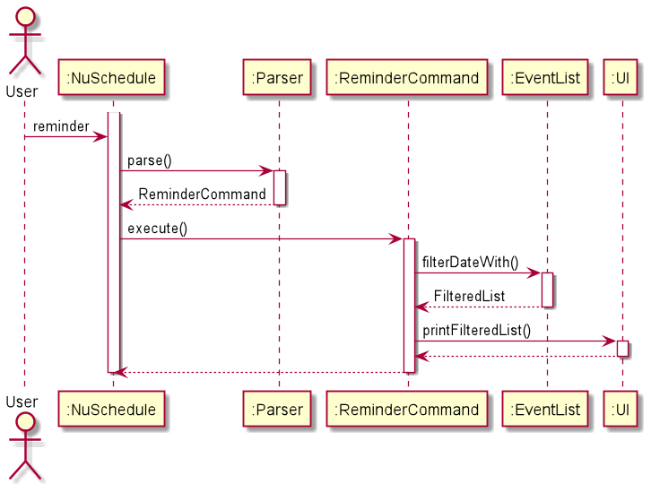
*Figure 4.5 Sequence Diagram for reminder function*

### 4.6 Sort events
  
This feature allows users to sort the available task by a sorting criteria. Currently, the sorting criteria available
are sorting by time, description and location.  

Given below is an example usage scenario:

Step 1. The user wants to view the events in a chronological order. 

Step 2. The user enters `sort time`, which will call the `sortCommand()` function which will sort all events.  
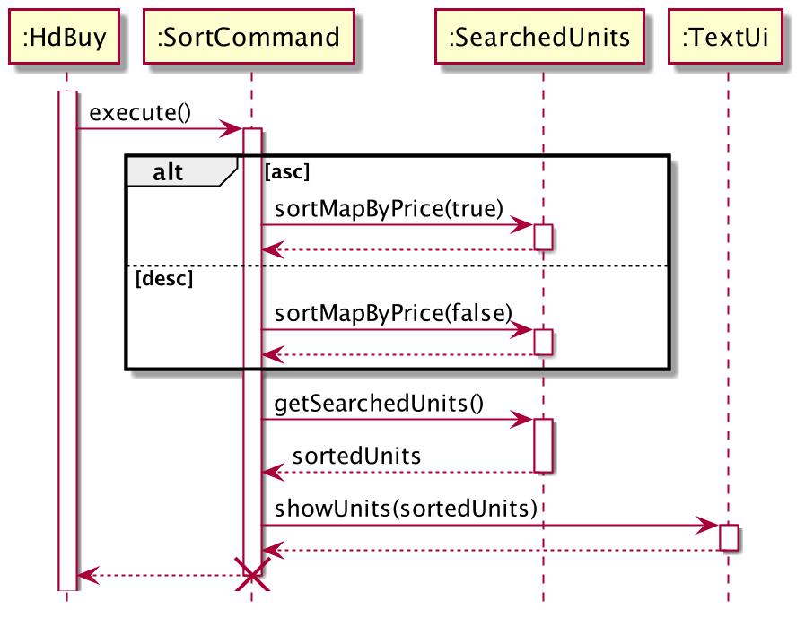 
*Figure 4.6 Sequence diagram for SortCommand()*

### 4.7 View events
  
This feature allows users to view a numbered list of all the events/tasks they have added so far,
in the order which they were added.

Given below is an example usage scenario:

Step 1. The user wants to see a list of all the events he has added so far, and executes the command `list`.

Step 2. The command calls the `printEventList` function from `UI`, which then prints the list of events.

The sequence diagram below shows what happens when the list command is executed.
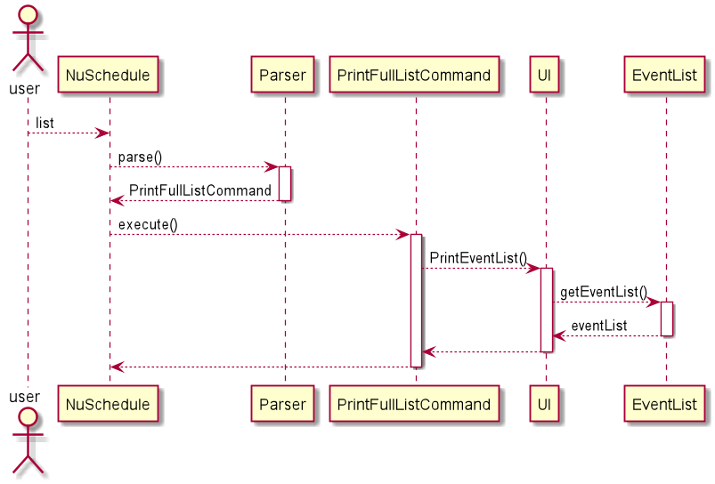
*Figure 4.7 Sequence Diagram for list function*

### 4.8 Help
  
This feature allows users to view a summary of all the features available for the current version of NUSchedule. 
When the user inputs `help`, all available commands and a simple description for each of them will be printed.

The sequence diagram below shows what happens when user enters `help`:

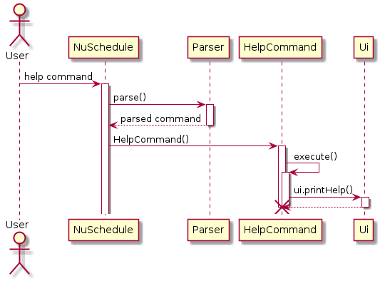 
*Figure 4.8 Sequence Diagram for help function*

### 4.9 Repeat
This feature allows users to repeat all classes in the current week or a selected event for several weeks.

### 4.10 Delete
This feature allows the user to delete unwanted events. `DeleteCommand#Execute` deletes the specified event in the 
following steps:  

Step 1. The user enters `delete NUMBER` where `NUMBER` refers to the index of the command to be deleted. The user input is parsed by the Parser class which creates a new `DeleteCommand` object.

Step 2. `Eventlist#remove()` is called which will delete the event with the specified index.

### 4.11 Find
This feature allows the user to filter his/her events by a particular keyword. This command will search through all the events and find events that have descriptions
containing the search criteria. The process takes place in the following steps:

Step 1. The user enters `find CRITERIA` which will be parsed by the `Parser` class. The `Parser` class will create a new `FindCommand`
object.

Step 2. `EventList#filterWith()` will be called which will create a ArrayList containing events that match the specified criteria.

Step 3. `UI#printFilteredEventList` is called to print out the events.

### 4.12 Find based on date

This feature allows users to find events on the date inputted by the user.

Given below is an example usage scenario:

Step 1. The user wishes to find events happening on a certain date, so he inputs `date 2020-10-10`.

Step 2. This executes FindDateCommand, which calls `filterDateWith(2020-10-10)` to create a new filtered list.

Step 3. This filtered list is then printed by calling `printFilteredDateEventList` from UI.

### 4.13 Print locations of a certain group

### 4.14 Study time
This feature allows the user to know the amount of time spent on study for certain date. The command is `studyTime DATE`.  

### 4.15 Done

### 4.16 User Info

This feature allows users to input information about themselves into the app, specifically their name, and
whether they are a student or a professor.

Given below is an example usage scenario:

Step 1: The user wishes to store his personal information, so he inputs `student Harry`.

Step 2: This calls the UserInfoCommand, which stores his name, Harry, and type, student in UserInfo.

1. The user enters `delete NUMBER` where `NUMBER` refers to the index of the command to be deleted. The user input is parsed by the Parser class which creates a new `DeleteCommand` object.

2. `Eventlist#remove()` is called which will delete the event with the specified index.
### 4.11 Find 

### 4.12 Print locations
This feature allows users to know locations in a certain faculty, including blocks and lecture theatres when users input
abbreviations of various faculties (e.g. FOS).

The sequence diagram belows shows what happens when user input any faculty abbreviation:  
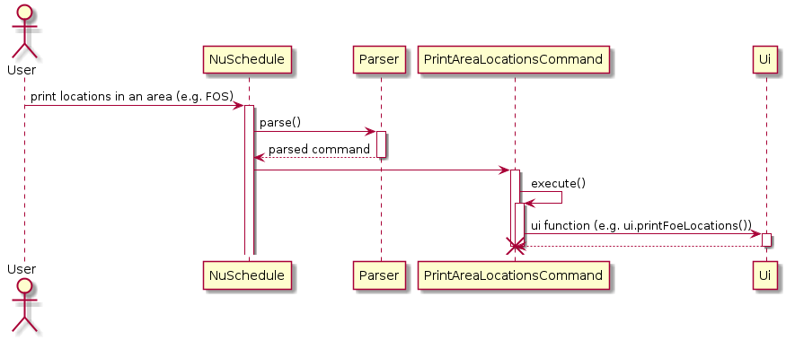 
*Figure 4.12 Sequence Diagram for print area locations function*

### 4.13 Study Time

### 4.14 User Info

### 4.15 Done 
This feature allows users to mark an event as done, provided the event's time has passed. With the exception of event 
type `Assignment`, all the other event types cannot be marked as done before event occurs. 

`DoneCommand` marks an event as done with the following steps: 

Step 1. The user will input `done` followed by an integer that represents the index of the event they want to mark as 
done. 

Step 2. The program will first check if the index is valid. If invalid, application will print an error message. 

Step 3. Then it will check for the type and time of event. If the time of event is later, and the event is not an 
`Assignment`, then it will print a warning message. Else, it will mark the event as done.

## 5. Documentation
  
All documentation can be found in the `docs/` folder.
* [Jekyll](https://jekyllrb.com/) is used to manage documentation.
* [Markdown](https://guides.github.com/features/mastering-markdown/) style is used for the documentation.
* [PlantUML](https://plantuml.com/) is used to create the diagrams.
  

## 6. Testing
  
JUnit is used to write tests for the project. Learn more about JUnit [here](https://se-education.org/guides/tutorials/gradle.html).
If you are using IntelliJ, you can run all test by right-clicking on the `test/java` folder and selecting `Run 'Tests'` or press `CRTL` + `SHIFT` + `F10`
on your keyboard. Alternatively, you can open a console and run the command `gradelw clean test` (Mac/linus: `.gradlew clean test`).  

## Appendix A: Product scope
  
### User profile
  
__Target user profile:__
* NUS student or staff
* able to type quickly
* has quite a number of events to keep track of  
* prefers to use desktop apps
* prefers using Command Line Interface (CLI) apps
* prefers typing instead of mouse interactions

### Value proposition
  
NUSchedule aims to assist the target audience with:  
* managing all their events in one application (personal or work)
* easily finding out about the location of their events 

## Appendix B: User stories
  
|Version| As a ... | I want to ... | So that I can ...|
|--------|----------|---------------|------------------|
|1.0|busy individual|keep track of both personal and school activities|avoid clashing events
|1.0|freshman|know module details and lesson venues|be on time for my activities
|1.0|forgetful person|be reminded of the deadlines for my assignments|submit on time
|1.0|tutor|know the estimated time for my students to travel to their next class|pace my lesson suitably
|1.0|hardworking student|track how much time I have spent studying|allocate my time efficiently
|2.0|exchange student|know the optimal path to reach my next destination|avoid getting lost
|2.0|user|find a to-do item by name|locate a to-do without having to go through the entire list|
|2.0|professor|Know whether my students have another lesson after mine and the expected time of travelling|Pace my lesson appropriately
|2.0|student using zoom for lessons|record the virtual locations|store the links and passwords of the meetings

## Appendix C: Non-Functional Requirements
  
1. This application will work on any computers running either Windows, macOS or Unix that has Java 11 or a higher version installed.

2. A user that is proficient in typing will find this application to be faster and more convenient to use than applications that requires mouse clicks.

## Appendix D: Instructions for manual testing
  
1. Initial launch
   * Download the jar file [here](https://github.com/AY2021S1-CS2113T-F14-4/tp/releases) and place it in an empty folder.
   * Open the command prompt and enter the command `java -jar NuSchedule.jar`.
   * Expected: The application shows the NuSchedule logo.
   
2. Adding events
   * Test case: `assignment homework /t 2020-02-02 20:00 /l home`
   * Expected: Confirmation message to indicate that the assignment has been added successfully.
   * Test case: `class cs2113 /t 2020-02-02 20:00 /e 2020-02-02 21:00 /o zoom.com /p 123`
   * Expected: Confirmation message to indicate that the class has been added successfully.
   * Test case: `personalEvent shopping /t 2020-02-02 21:00 /e 2020-02-02 22:00 /l supermarket`
   * Expected: Confirmation message to indicate that the personal event has been added successfully.
   
3. Editing events
   * Test case: `edit NUMBER` where `NUMBER` is the index of the event to be editted.
   * Expected: Confirmation message asking for the desired changes.
   
