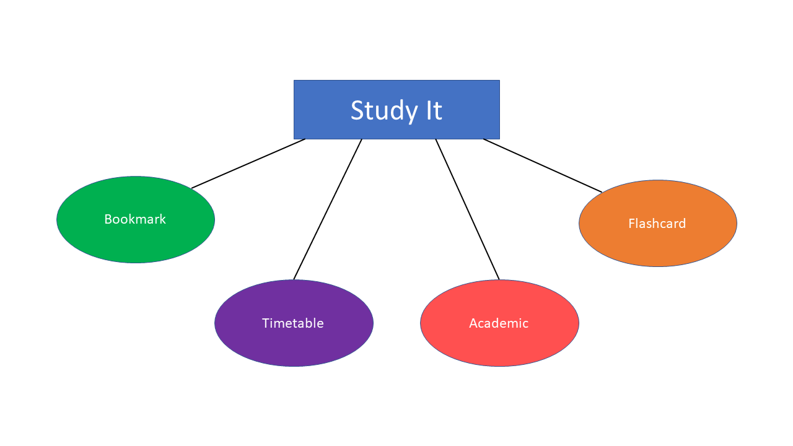
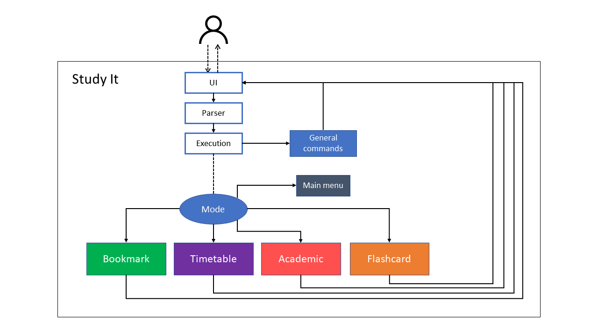
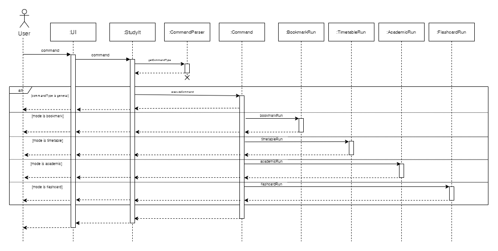
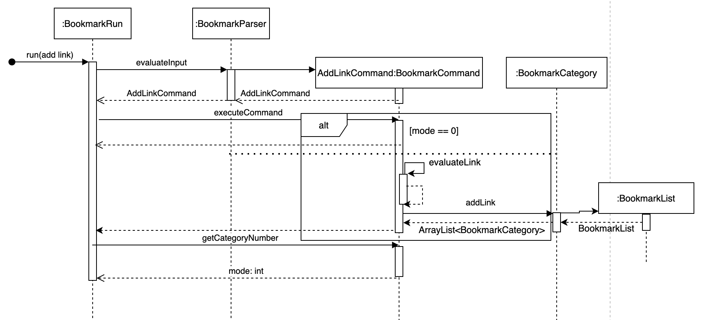
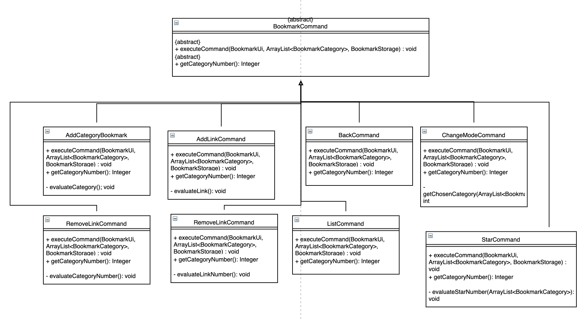
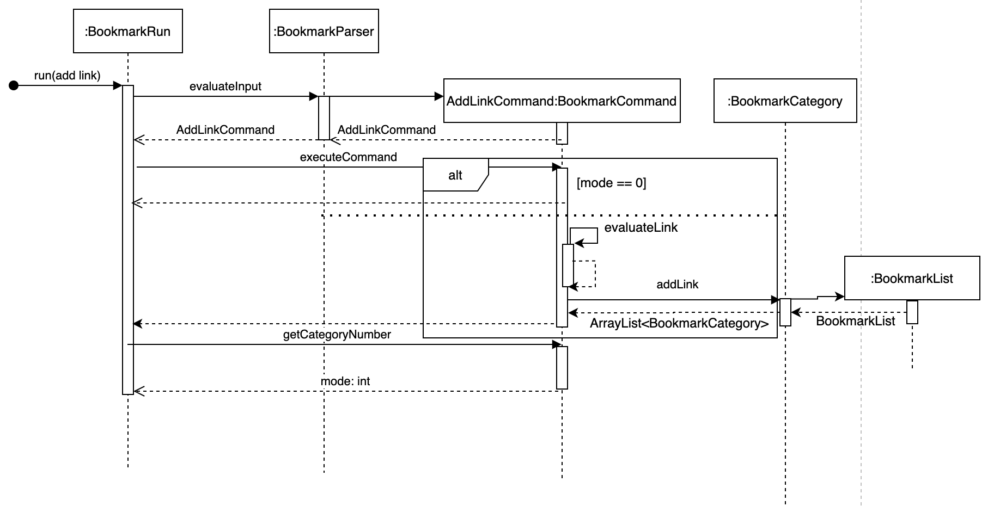

* Table of Contents
{:toc}

## Introduction
Welcome to Study It developer guide!

This document details the architecture of Study It. It aims to provide an overview of the high-level system 
architecture and design of the app. It will also break down the design of the app into smaller components and be 
explained in detail. This will allow the readers to understand the architecture and design flow of Study It and 
how it operates.

Study It is an interactive desktop app that helps NUS students manage their study related matters especially during 
this online study environment. It is optimized for use via a Command Line Interface (CLI). It can keep track of the 
student’s various study matters, present them in an organized and thoughtful manner to help them organize their 
study life. It will also provide various functionalities to help with their studies. 

The 4 main functionalities available now are bookmark, timetable, academic tracker and flashcard. 
Each of this will be discussed in detail under the “Design & Implementation” section later in the document.

## Setting up & getting started
**Requirements**
* Java 11.0.8
  * You may refer to this [website](https://www.oracle.com/java/technologies/javase/jdk11-archive-downloads.html) 
to download and install Java 11.0.8
  * The installation guide can be found in the following websites:
    * [Windows](https://docs.oracle.com/en/java/javase/11/install/installation-jdk-microsoft-windows-platforms.html#GUID-A7E27B90-A28D-4237-9383-A58B416071CA)
    * [Linux](https://docs.oracle.com/en/java/javase/11/install/installation-jdk-linux-platforms.html)
    * [Mac](https://docs.oracle.com/javase/10/install/installation-jdk-and-jre-macos.htm#JSJIG-GUID-2FE451B0-9572-4E38-A1A5-568B77B146DE)

**Running the software**
1. Download the tP.jar file from our [Github release](https://github.com/AY2021S1-CS2113T-T12-1/tp/releases) and 
place it in an empty folder
2. Open your computer’s command prompt
3. Change the directory of the command prompt to the folder containing tP.jar file
4. Type `java -jar tp.jar` into the command prompt and press Enter to execute it
5. If the application runs successfully, you’ll be greeted by a welcome message

## Design & implementation
This section explains the architecture of our software and the design of each component.

### **Major components**
This section introduces the multiple components in Study It.

Study It contains 4 major functional components which are the 
bookmark, timetable, academic and flashcard. Each of these component
provide different functionalities, and they combine to form our software -- Study It.

Component | What it does
----------|----------------
Bookmark  | Stores internet links under different categories for easier access
Timetable | Tracks and display your weekly schedule
Academic  | Stores important contacts and keep track of your grades
Flashcard | Stores study questions and allow you to quiz yourself for easier memorization

The **main component** of Study It helps user access each of these components.
It processes the user input, provides general functionalities to traverse the software and other
helpful functionalities. This will be further explained under Study It's design later.

### **Architecture**
This section describes the overall architecture of Study It.

The *Architecture Diagram* given above explains the high-level design of the software.
Each component in the diagram will be briefly explained below.

The **`main`** in **`Study It`** is responsible for initializing all the other components
in the software.

The following is a brief overview of the components in Study It:
* **UI**: Handles the communication between the software and the user
* **Parser**: Processes the input from the user
* **Execution**: Perform the actions determined by the parser

The following components processes their respective actions (parsing and execution) and handles their own
storage component: 
* **Bookmark**
* **Timetable**
* **Academic**
* **Flashcard**

**General commands** are commands that takes priority in execution no matter which mode the software is currently
in.

**Modes of the program**

Study It has 5 **modes** that the user can navigate between:
* **Main menu**: Default mode when booting the software, there are no functionalities tied to this mode
* **Bookmark**
* **Timetable**
* **Academic**
* **Flashcard**

Each of these modes has their own unique commands. The user must switch to that mode to perform the
mode's functionalities.

User can switch between these modes at any point when using the software.

**How the architecture components interact with each other**

As shown in the sequence diagram above, the user will interact with Study It via the User Interface (UI).
The commands received will then be parsed to identify the type of command. If the command is one of the 
general commands, it'll be processed and provide output. Otherwise, the command will be relayed
to different components to be processed based on the software's current mode. 

### **Main Component**
This section will give an overview of the main component of Study It

The main class being run for the program is contained under `StudyIt` class. 
As there are multiple modes of our app (main menu/bookmark/timetable/academic/flashcard), 
the Mode enumeration and a private static currentMode of Mode type is introduced to monitor the current 
operating mode of StudyIt. This is to allow the program to respond to different commands under different modes.

Each command input by the user will be processed by CommandParser class to determine the command type. 
This information, along with the original command string will be passed into Command class and executed under 
executeCommand(). If it is one of the general commands, it will be processed by that class. 
If it isn’t, the Command class will detect the current mode of the program and run that command string under that 
specific mode, distributed under handleNonGeneralCommand() method. If it still doesn’t parse successfully, 
it will be considered an invalid command and an error message will be printed out.

The classes Ui, ErrorMessage, HelpMessage and MainMenu help handle the printing of various user interfaces of the 
program. ErrorMessage, HelpMessage and MainMenu are subclasses of Ui to make use of the methods in Ui.

StudyIt class will also initialize various instances of classes such as TimeTableRun, FlashCardRun, 
ArrayList<BookmarkCategory>, ArrayList<Grade>, ArrayList<Person> and pass it to Command class to perform 
each mode’s functionality.

### **Bookmark Component**

This bookmark section consists of how the bookmark feature is implemented. 
The bookmark feature is implemented similarly as the main architecture, however, 
in a smaller scale and a more bookmark-specific way. Figure 1 illustrates the general overview, 
the associations and the multiplicity of the bookmark classes.

[uml diagram]

API: java.bookmarkRun

The bookmark component consists of six major classes: `BookmarkRun`, `BookmarkStorage`, `BookmarkUi`, 
`BookmarkCategory`, `BookmarkList` and `BookmarkParser`. 
As shown in figure 1, `BookmarkRun` is 
* The main class to be called when the bookmark mode is accessed.
* The main class to access other bookmark classes.

Given below, Figure 2, is the sequence diagram of how the classes interact with each 
other when bookmark mode is accessed from the main function.

[uml diagram]

The bookmark component has two modes: the main bookmark mode and the category mode. 
As shown in Figure 2, when `BookmarkRun` is called, 
`BookmarkParser` will be called and return a `BookmarkCommand`. 
Afterwards, `BookmarkRun` will then call `executeCommand` in `BookmarkCommand` which executes 
the intended actions 
Then, it will call `getCategorymode` to get the current mode the user is in. 

**Bookmark Implementation**

A more detailed explanation of `BookmarkCommand`, `BookmarkCategory` and `BookmarkList` will be 
shown below. `BookmarkUi` and `BookmarkStorage` follow the same design implementations as the main 
architecture. The below figure shows the command classes available and they are called based on the 
`BookmarkParser` class as illustrated in Figure 2. 

Figure 4 shows a more detailed sequence diagram of how the `BookmarkCategory`, `BookmarkCommand` 
and `BookmarkList` interacts with each other for the scenario when the user input an `AddLinkCommand` 
in Bookmark mode.

## Product scope
### Target user profile

{Describe the target user profile}

### Value proposition

{Describe the value proposition: what problem does it solve?}

## User Stories

|Version| As a ... | I want to ... | So that I can ...|
|--------|----------|---------------|------------------|
|v1.0|new user|see usage instructions|refer to them when I forget how to use the application|
|v2.0|user|find a to-do item by name|locate a to-do without having to go through the entire list|

## Non-Functional Requirements

{Give non-functional requirements}

## Glossary

* *glossary item* - Definition

## Instructions for manual testing

{Give instructions on how to do a manual product testing e.g., how to load sample data to be used for testing}
