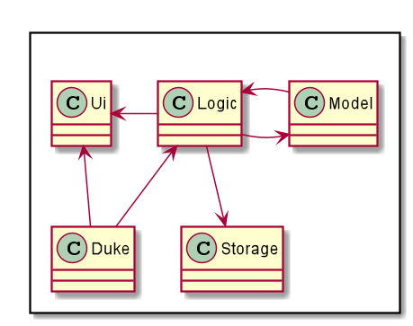
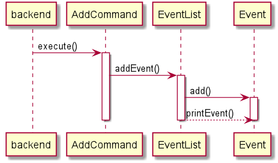

# CCA Manager Developer Guide

  * [Introduction](#introduction)
  * [Setting up](#setting-up)
  * [Design and Implementation](#design-and-implementation)
    + [Input Parsing](#input-parsing)
    + [Finance](#finance)
    + [Event](#event)
  * [Product scope](#product-scope)
    + [Target user profile](#target-user-profile)
    + [Value proposition](#value-proposition)
  * [User Stories](#user-stories)
  * [Non-Functional Requirements](#non-functional-requirements)
  * [Glossary](#glossary)
  * [Instructions for manual testing](#instructions-for-manual-testing)

## Introduction 
CCA Manager is a revolutionary all-in-one management tool that changes the way you can manage interest groups with unrivaled efficiency and simplicity. Its lightweight Command Line Interface (CLI) allows administrators to breeze through tasks quickly and easily while offering powerful features to advanced users.

This developer guide is written to document the implementation of CCA Manager. This document is intended for people who
are interested in learning more about the technical details of the various features and the organization of the application.

## Setting up
Refer to the guide here.

## Design and Implementation

The **Architecture Design** given above explains the high-level design of the App. Given below is a quick overview of each component.

**`Duke`** is the main class of the application, and handles the app launch, initializing the appropriate classes to be used.

The rest of the app consists of the below:

* [**`UI`**] : The UI of the App.
* [**`Logic`**] : The command executor.
* [**`storage`**]: Reads data from, and writes data to, the hard disk.
* [**`Model`**] : Holds the data of the App in memory.

### Input Parsing
**Current Implementation**  
The `Parser` class in `seedu.duke.backend` handles most of the input parsing. The `Parser` is a standalone class. Its purpose is to handle the conversion of read Strings from the `Ui` to UserInput objects
safely for the rest of the program to handle. It implements the following operations:

* `Parser#parse()` - Converts the supplied input `String` to a `UserInput` object
* `Parser#checkCategory()` - Convert the supplied `String` to a `String` category. This function implements Shorthand category detection.
* `Parser#sanitize()` - Check for unsupported, illegal or potentially malicious input and remove it from the `String`.

Given below is an explanation on the logical flow of the `parse()` function.

1. The supplied `String` is sent to `sanitize()` to remove any potentially unwanted input that may cause undefined application behavior.
2. `sanitize()` will analyze the `String` and run a set list of checks to verify that the input is safe for the rest of the routine to handle.
3. `parse()` will split the `String` to a `String[]` to identify the number of arguments.
4. `checkCategory()` is invoked to identify if the command belongs to a specific category.
5. A `HashMap<String,String>` is created to store all the arguments supplied by the user.
6. A new `UserInput` object is created with the arguments in the HashMap, the category of the command and the command.
7. The function returns the `UserInput` to the `Ui` for further execution.

**Design Considerations**  
Aspect: Statefulness of Parser object
* Alternative 1 (Current Choice): Parser does not preserve state between parses.
    * Pros: Easy to implement. Easy to test. Promotes use of single commands over multi-step commands.
    * Cons: Unable to implement intelligent functionality where previous input influences the behavior of the next.
    * Reason for choice: Our focus for this application is simplicity and efficiency. Having stateful commands runs counter to this design philosophy.
* Alternative 2: Parser preserves stateful information
    * Pros: Able to implement multi-step commands. Can easily implement confirmation step for commands that manipulate large volume of data.
    * Cons: More complicated to implement. Harder to ensure the behaviour of the parser is consistent. Harder to debug.
Aspect: Design of parser
* Alternative 1 (Current Choice): Dedicated parser class creates an object to be passed into all other Command objects
    * Pros: Allows other classes to check for the required arguments without having to do low level string handling. Enforces consistent parsing across all commands. Enables `/` arguments to be added and read in any order.
    * Cons: Incurs additional overhead from adding an extra step between the input operation and the command invocation.
* Alternative 2: Each Command handles its own input independently
    * Pros: Command classes are free to simplify the parsing step depending on the required complexity of the command. No intermediate step and overhead.
    * Cons: More difficult to enforce parsing standards across Commands. String manipulation becomes required in every command.

### Finance
**1.1. Add/delete finance log entry feature**  
1.1.1. Current Implementation  
The `CommandFinanceAdd` class in `seedu.duke.finance` handles adding finance log entry. It adds a new `FinanceLog` instance according to `userInput` into `FinanceList`.  
The `CommandFinanceDel` in the same package handles deleting finance log entry. It deletes a certain `FinanceLog` instance according to the index provided by `userInput` from `FinanceList`.  
They implement the following operations:  
* `CommandFinanceAdd#execute()` - Adds a new finance log entry into the `FinanceList` according to `userInput`.  
* `CommandFinanceDel#execute()` - Deletes a certain finance log entry from `FinanceList` according to the index provided by `userInput`.  

Given below is an example usage scenario and how the add/delete finance log entry behaves at each step.  

Step 1. The user launches the application for the first time. The `FinanceList` will be initialized with no `FinanceLog` in it.  

Step 2. The user executes `finance addLog iphone12 1299` command to add a finance log entry with content "iphone12" and value "1299" into finance list. The `finance addLog` command
calls `CommandFinanceAdd#execute()`, then `FinanceList` will be added a `FinanceLog` with its `finLog` as `iphone12` and its value as `1299`.  

Step 3. The user executes `finance delLog 1` command to delete the 1st finance log entry in the finance list. The `finance delLog`
command calls `CommandFinanceDel#execute()`, causing the `FinanceLog` of index 1 removed from `FinanceList`.  

**Design Considerations**  
Aspect: User input format for adding a finance log entry
*Alternative 1(Current Choice): The user inputs command in format of "finance addLog ITEM_NAME ITEM_VALUE".  
    *Pros: It is more convenient for the user to type commands and easier to memorize the command format.  
    *Cons: It takes longer time to execute the command for the program has to identify which part is ITEM_NAME and which part is
    ITEM_VALUE. If the user inputs a separate number for ITEM_NAME but forgets to type ITEM_VALUE, then the program will mistake 
    the separate number in ITEM_NAME for its ITEM_VALUE.  
*Alternative 2: The user inputs command in format of "finance addLog /n ITEM_VALUE /v ITEM_VALUE".  
    *Pros: The program can easily detect if the input command is valid.  
    *Cons: It is harder for the user to memorize the command format. It also costs more time when executing.  
    

**1.2. List the summary of finance log entries**  
1.2.1. Current Implementation  
The `CommandFinanceSummary` class in `seedu.duke.finance` handles listing all the finance log entries in `FinanceList` and 
showing the total budget of all the `FinanceLog`.  
It implements the following operation:  
* `CommandFinanceSummary#execute()` - Lists all `FinanceLog` in `FinanceList` and shows the total budget of them.  

Given below is an example usage scenario and how the program list the summary of finance log entries.  

Step 1. After some `finance addLog` commands, the user created a `FinanceList` with two `FinanceLog`. The first `FinanceLog` is 
"iphone12 $1299" and the second `FinanceLog` is "chicken rice $3.5".  

Step 2. The user executes `finance summary` command to list the summary of `FinanceList`. The `finance summary` command calls 
`CommandFinanceSummary#execute()`, then every `FinanceLog` in `FinanceList` will be output and the total budget will be printed out at the bottom. Nothing will be changed in `FinanceList`.  

**Design Considerations**  
Aspect: Repeated items  
*Alternative 1(Current Choice): The summary will output all the repeated items.  
    *Pros: It can display all the indexes of the repeated items so that when user wants to delete any one of them, 
    he can just refer to this summary.  
    *Cons: It cannot display the total budget for these repeated items. The user has to find a way to calculate it 
    by himself.  
*Alternative 2: The summary will combine all the repeated items then output them.  
    *Pros: The user do not have to calculate the total budget for repeated items by himself.  
    *Cons: The summary cannot show each index of the repeated items that it is confusing when user wants to delete 
    any one of them.  

### Event
**1.1. Add/delete events feature**  
1.1.1. Current Implementation  
The `CommandEventAdd` class in `seedu.duke.event` handles the adding of events. According to the `userInput`, it adds a new event to the `EventList`. 
The `CommandEventDel` class in the same package handles deleting of a event. It deletes an `Event` instance according to the index provided by `userInput` from the `EventList`.  
They implement the following operations:  
* `CommandEventAdd#execute()` - Adds a new event into the `EventList` according to `userInput`.  
* `CommandEventDel#execute()` - Deletes a event from `EventList` according to the index provided by `userInput`.  

Given below is an example usage scenario and how add/delete event function behaves at each step.  

Step 1. The user launches the application for the first time.   

Step 2. The user executes `event addEvent /n arduino course /d 2020-12-30 /t 8pm` command to add a new event with the name "arduino course", 
the date of the event "2020-12-30" and the time "8pm" into event list. 
The `event addEvent` command calls `CommandEventAdd#execute()`, then `EventList` will add a new `Event` with event name as `iphone12`, date as `2020-12030` and time as `8pm`.  

Step 3. The user executes `event delEvent 1` command to delete the 1st event in the event list. The `event delEvent`
command calls `CommandEventDel#execute()`, causing the `Event` at index 1 to be removed from `EventList`.  

The sequence diagram for addEvent is as follows: (To be continued)

## Product scope
### Target user profile

Our product targets people who manage interest groups and CCAs. 
However, our software solution allows us to easily expand the target audience to target schools and corporate enterprise clients in the future.

### Value proposition

Management software is expensive and complex, training employees to use it is time-consuming. CCA Manager aims to solve these
problems by offering an all-in-one solution focused on simplicity and efficiency. 
Our use of industry standard csv format ensures compatibility with leading industry tools. 
Shorthand Commands and Relative Time allow advanced users to enter up to 70% more commands per minute. 

## User Stories

|Version| As a ... | I want to ... | So that I can ...|
|--------|----------|---------------|------------------|
|v1.0|user|add/delete members to the list |keep track of the members in the CCA|
|v1.0|user|view a summary of members |view information of people in the various roles|
|v1.0|user|add/delete events to the list|so that i can manage the schedule|
|v1.0|user|view a summary of events |keep track of future and completed events|
|v1.0|user|add/delete entries|keep track of financial records in the CCA|
|v1.0|user|view financial summary |keep track of cashflow information at a glance|
|v2.0|user|view the number of days remaining for the events|remind myself of upcoming events |
|v2.0|user|perform a search on member/events|find the details of the member/event quickly|
|v2.0|user|view the list of contacts of the prof/admin|so that i know how to contact them for admin matters|

## Non-Functional Requirements

1. Should work on any mainstream OS as long as it has Java 11 or above installed.
2. Should be able to hold hundreds of thousands of data entries without losing the data.
3. A user with average typing speed should be able to accomplish most of the tasks faster using commands than using the mouse.
4. The program should support writing to a universally supported and easy to edit non-proprietary file format such as RFC 4180 .csv files.

## Glossary

* *glossary item* - Definition

## Instructions for manual testing

{Give instructions on how to do a manual product testing e.g., how to load sample data to be used for testing}
