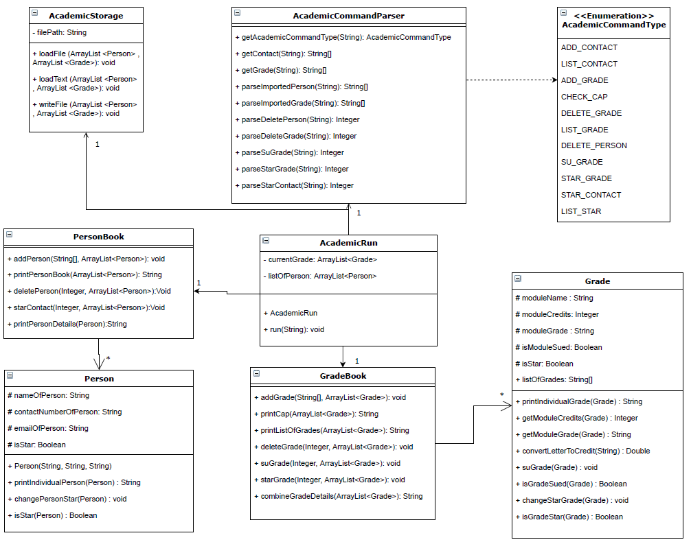
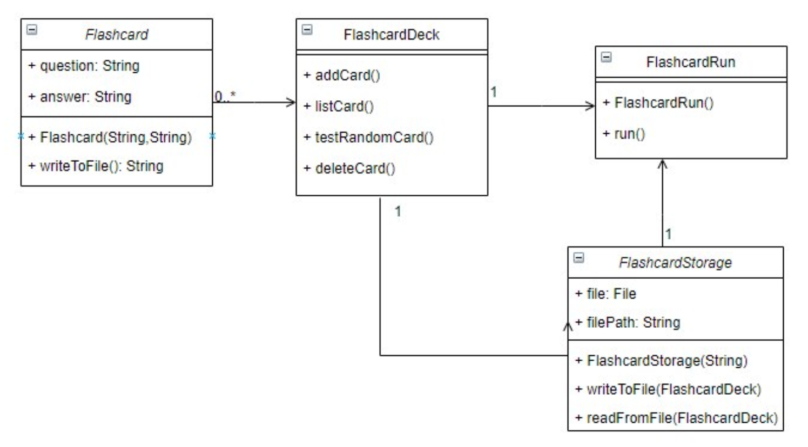
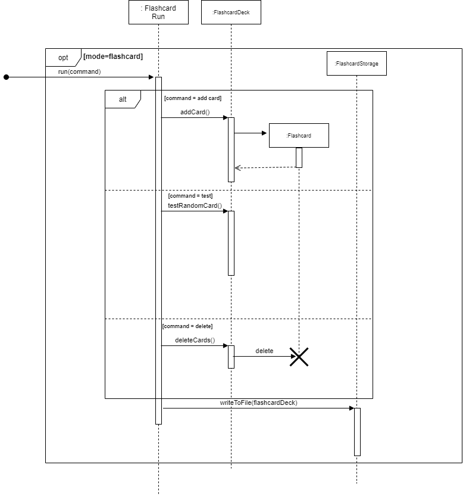

# Developer Guide
##Content 
[to be filled] 

## Setting up, Getting Started
###Setting up the project in your computer

First, **fork** this repo, and **clone** the fork into your computer.

If you plan to use Intellij IDEA (highly recommended):
1. Configure the JDK: Configuring the JDK to ensure Intellij is configured to use JDK 11.
2. Import the project as a Gradle project.
3. Run the studyit.StudyIt and try a few commands.
4. Run the tests to ensure they all pass.

###Before writing code

1. Configure the coding style. 
Ensure Coding style is standardised throughout. 
2. Learn the design. 
When you are ready to start coding, we recommend that you get some 
sense of the overall design by reading about AddressBook’s architecture.

## Design & implementation
###Architecture
[to be filled]
###Bookmark Component

This bookmark section consists of how the bookmark feature is implemented. 
The bookmark feature is implemented similarly to the main architecture, however, 
in a smaller scale and a more bookmark-specific way. Figure 1 illustrates the general overview, 
the associations and the multiplicity of the bookmark classes.

API: java.bookmarkRun

The bookmark component consists of six major classes: `BookmarkRun`, `BookmarkStorage`, `BookmarkUi`, 
`BookmarkCategory`, `BookmarkList` and `BookmarkParser`. 
As shown in figure 1, `BookmarkRun` is 
* The main class to be called when the bookmark mode is accessed.
* The main class to access other bookmark classes.

Given below, Figure 2, is the sequence diagram of how the classes interact with each 
other when bookmark mode is accessed from the main function.

The bookmark component has two modes: the main bookmark mode and the category mode. 
As shown in Figure 2, when `BookmarkRun` is called, 
`BookmarkParser` will be called and return a `BookmarkCommand`. 
Afterwards, `BookmarkRun` will then call `executeCommand` in `BookmarkCommand` which executes 
the intended actions 
Then, it will call `getCategorymode` to get the current mode the user is in. 

**Bookmark Implementation**

A more detailed explanation of `BookmarkCommand`, `BookmarkCategory` and `BookmarkList` will be 
shown below. `BookmarkUi` and `BookmarkStorage` follow the same design implementations as the main 
architecture. The below figure shows the command classes available and they are called based on the 
`BookmarkParser` class as illustrated in Figure 2. 

Figure 4 shows a more detailed sequence diagram of how the `BookmarkCategory`, `BookmarkCommand` 
and `BookmarkList` interacts with each other for the scenario when the user input an `AddLinkCommand` 
in Bookmark mode.

### **Academic Component**

This section will describe in detail how some features inside the academic tracker section have been implemented.
Figure x illustrates the general overview, the associations and the multiplicity of the academic classes.

API: `java.academic`

The above diagram looks at the overall structure of how the academic tracker is being implemented. 
This component is split into 7 different classes, 
their associations and multiplicity as explained in the above diagram x. 
The functions of the academic tracker will be called through the `AcademicRun` class 
when the program is in academic mode, which will subsequently call 
the functions in `PersonBook` or `GradeBook`. 

The academic component:
* initialises two arraylists, `ArrayList<Grade>` and `ArrayList<People>` 
to store the relevant `Grade` and `People` objects.
* uses `AcademicCommandParser` to parse the user command.
* identifies `AcademicCommandType` to decide 
which of the commands under `PersonBook` or `GradeBook` is to be executed.
* calls `AcademicStorage` to store the current set of data into the local storage file.

**Academic Implementation**

This section explains the details on how certain features 
are implemented in the academic tracker.

**GradeBook Features**
The grade features are facilitated `Gradebook`, which further make use of `Grade`. 
All grades are stored internally under `AcademicRun` as an array list `ArrayList<Grade>`.
It implements the following operations:
* `addGrade(String[], ArrayList<Grade>)`:Adds a `Grade` to the `ArrayList<Grade>`. 
* `printCap(ArrayList<Grade>)`:Calculate the current CAP based on the `ArrayList<Grade>`. 
* `printListOfGrades(ArrayList<Grade>)`:Print out all the `Grade` that are currently stored inside `ArrayList<Grade>`.
* `deleteGrade(Integer, ArrayList<Grade>)`:Delete a `Grade` from a specified index inside `ArrayList<Grade>`.
* `suGradeInGradeBook(Integer, ArrayList<Grade>)`:Su a `Grade` from a specified index inside `ArrayList<Grade>`.
* `starGrade(Integer, ArrayList<Grade>)`:Star a `Grade` from a specified index inside `ArrayList<Grade>`.
* `combineGradeDetails(Grade)`:Print out the details of a particular `Grade`.

### **Flashcard Component**

This section will describe in detail how the flashcard feature is implemented.

The above diagram looks at the overall structure of how the flashcard component is being implemented. 
This component is split into 4 different classes, their associations and multiplicity as explained in 
the above Figure 7. As shown in Figure 7, the main class `FlashcardRun` will be accessed when the 
flashcard mode is called in `StudyIt` Class. `FlashcardRun` class is associated with `FlashcardStorage` 
class that is used to store data in .txt file and `FlashcardDeck` class which contains any number of `Flashcards`.

**Flashcard Implementation**

With reference to Figure 8, when `FlashcardRun` is first initialised by `StudyIt`, it will construct 
the `FlashcardDeck` class. As an add card command is given by the user, `FlashcardRun` will take in the 
command and call `addCard()` method in `FlashcardDeck` which constructs a new Flashcard object and stores 
it inside the `FlashcardDeck` object.The `addCard()` function will then show the user the question and 
answer of the flashcard that have been created.

##Documentation, logging, testing, configuration, dev-ops
###Testing guide
Running tests:  
The main way that was used to run the test for Study It is:   
Using IntelliJ JUnit test runner.   
A. To run all tests, right-click on the src/test/java folder and choose 
Run Test in ‘tp.test’  
B. To run a subset of tests, you can right-click on a test package, 
test class or a test and choose Run ‘ABC’.  
Type of Tests  
This project has 5 types of tests. 4 tests to test each feature and 1 test to test the main integration of the whole application.

###Logging guide
We are using java.util.logging package for logging 
The StudyItLog class is used to manage the logging levels and logging destinations.
Log messages are output through the console and to a  .log file.
The output logging level can be controlled using .setlevel( )
When choosing a level for a log message, follow the following conventions:
1. SEVERE: A critical problem detected which may cause the termination of the application.
2. WARNING: Can continue, but with caution.
3. INFO: Information showing the noteworthy actions by the App.
4. FINE:  Details that are not usually noteworthy but may be useful in debugging.

###DevOps Guide 
Build automation  
This project uses Gradle for build automation management.
./gradlew build - check for checkstyle error and runs all tests
Code coverage
This project uses code coverage that is in IntelliJ IDE to check for the coverage of the code. 

##Appendix: Requirement 
### Product scope
**Target user profile:**
* studies in NUS
* has a need to manage a significant number of links
* has a need to manage their classes in a timetable
* has a need to manage their grades
* has a need to manage contact numbers of professors and teaching assistants.
* has a need to memorise content to study 
* prefer desktop apps over other types
* can type fast
* prefers typing to mouse interactions
* is reasonably comfortable using CLI apps  

**Value proposition:**
* manage links faster than a typical mouse/GUI driven app
* manage grades than a typical mouse/GUI driven app
* manage contact numbers of professors and teaching assistants than a typical mouse/GUI driven app
* manage timetable than a typical mouse/GUI driven app
* manage study content than a typical mouse/GUI driven app 

#### User Stories

|Version| As a ... | I want to ... | So that I ...|
|--------|----------|---------------|------------------|
|v1.0|Student in Nus|organise my zoom links|don’t need to find the zoom link everytime lectures/tutorials start.|
|v1.0|student attending online classes|keep track of the timetable of my lessons whether  it is online or offline|do not miss any lessons.|
|v2.0|Student in Nus|organise all the useful signup links (internship/ hackathon/ talks) sent to our emails|can keep track of my time and dates of any relevant events.|
|v1.0|Student in Nus|keep track of my results and the number of SUs I have left,|can plan my semester properly|
|v1.0|student with packed timetables|see clashes in my timetable |can plan things without overlapping events.|
|v1.0|student taking a mod that requires me to memorize a lot of contents|organize the contents into flashcards|can revise them on the go.|
|v1.0|student who is worried about my results|calculate my CAP based on estimated grades|know i won’t get expelled :’)|
|v1.0|Student in Nus|keep track of my profs and ta’s contacts|know who to find when i have troubles.|
|v1.0|Student in Nus|bookmark all the important NUS websites|can access them more easily|

#### Non-Functional Requirements

* Should work on any mainstream OS as long as it has Java 11 or above installed.
* A user with above average typing speed for regular English text 
(i.e. not code, not system admin commands) should be able to accomplish most of the 
tasks faster using commands than using the mouse.

## Glossary

* *glossary item* - Definition

## Instructions for manual testing

{Give instructions on how to do a manual product testing e.g., how to load sample data to be used for testing}
