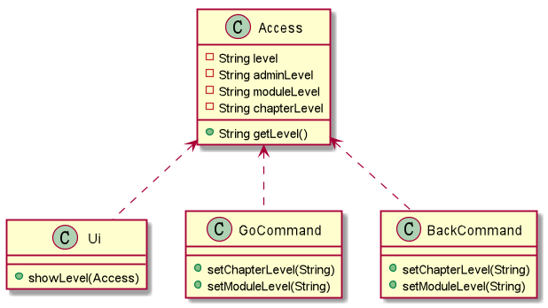
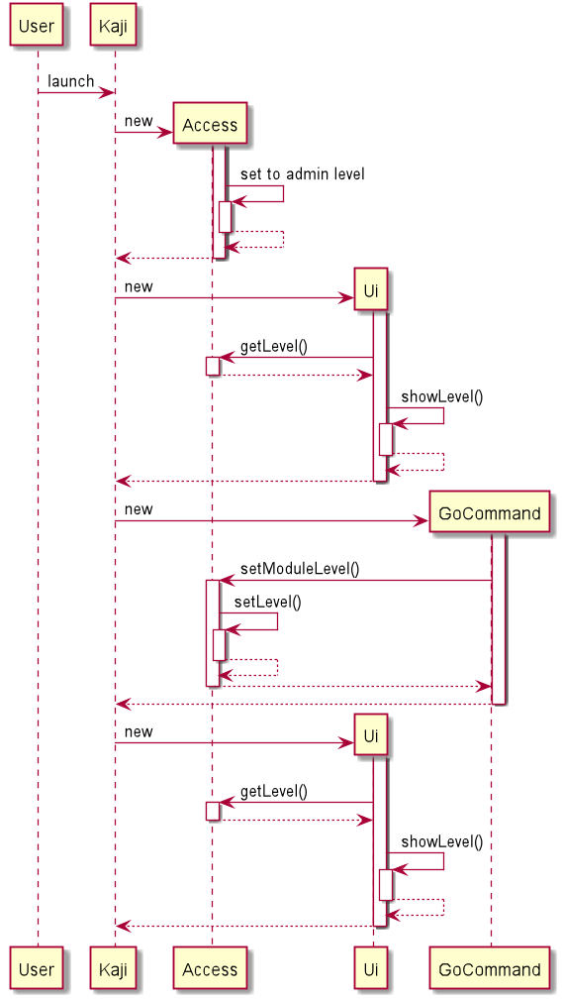

# Developer Guide

## Design & implementation

{Describe the design and implementation of the product. Use UML diagrams and short code snippets where applicable.}

## Product scope
### Target user profile

{Describe the target user profile}

### Value proposition

{Describe the value proposition: what problem does it solve?}

## User Stories

|Version| As a ... | I want to ... | So that I can ...|
|--------|----------|---------------|------------------|
|v1.0|new user|see usage instructions|refer to them when I forget how to use the application|
|v2.0|user|find a to-do item by name|locate a to-do without having to go through the entire list|

## Non-Functional Requirements

{Give non-functional requirements}

## Glossary

* *glossary item* - Definition

## Instructions for manual testing

{Give instructions on how to do a manual product testing e.g., how to load sample data to be used for testing}

## Implementation
### Print prompt feature
#### Proposed implementation
`<Ui>` and `<Acess>` facilitate the proposed print prompt feature. The `<Access>` class stores user's temporary 
access level as a variable `<Access#level>`. Before any read command execution in `<Kaji>`, `<Ui#showLevel(Access)>` 
method runs and prints user's current access level. 

`<Access>` are exposed in both the `<GoCommand>` class and `<BackCommand>` class as `<Access#setChapterLevel()>` and 
`<Access#setModuleLevel()>` respectively.

Given below is an example usage scenario and how the print prompt feature behaves at each step.

Step 1. The user launches the application. The `<Access>` will be initialized with the initial access level 
which is the admin level.

Step 2. In the `<Kaji>`, the `<Ui>` will also be initialized, then `<Kaji>` calls `<Ui#showLevel(Access)>` 
to get the access level from `<Access>` and prints the prompt.

Given below is another example usage scenario and how the print prompt feature behaves at each step.

Step 1. The user executes the `<GoCommand>` to modify access level from admin to module. The `<GoCommand>` modifies 
`<Access>` via the `<Access#setModuleLevel()>` method. 

Step 2. In the `<Access>` instance, `<Access>` call itself `<Access#setLevel()>` to modify the `<Access#level>`
variable. 

Step 3. `<Ui#showLevel(Access)>` method therefore prints different prompt based on the modification in `<Access>`.

The following sequence diagram shows how the `<GoCommand>` modify `<Access>` and results in different prompt.

#### Design consideration
##### Aspect: When access prompt shows
* **Alternative 1 (current choice)**: Keep a variable `<Access#level>` in Access class.
    * Pros: Easy to implement and easy for the Kaji.class to access.
    * Cons: Use up memory usage and hard to debug.
* **Alternative 2**: Use `<Access#chapterLevel>`, `<Access#moduleLevel>` and `<Access#adminLevel>` every time before print prompt in Kaji.class.
    * Pros: Will use less memory and increases testability.
    * Cons: We must access three variables before printing new prompt, unnecessary waste of CPU.