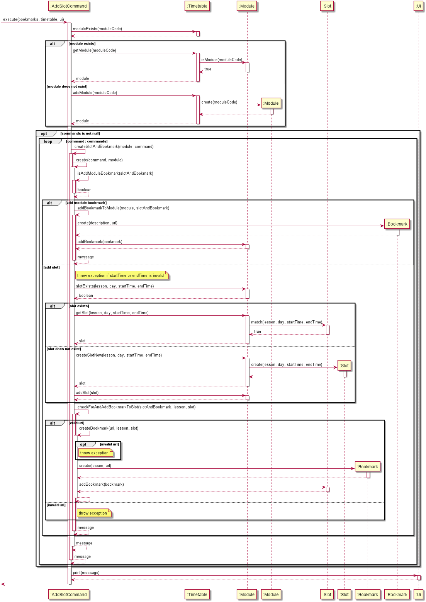

# Developer Guide

## **Design**

{Describe the design and implementation of the product. Use UML diagrams and short code snippets where applicable.}

## **Implementation**
{describe how you implement the features}

### Bookmark and Timetable modes feature (TYS)

### Add Module and Slot feature (Xing Rong)
This feature allows the user to add modules and lesson slots into the timetable.
Users can also add bookmarks to specific modules and slots.
Users can enter one-shot-commands, adding multiple slots and bookmarks to a module.

Given below is a sequence diagram of how the feature works.

 
 
Step 1. After calling execute() method of the AddSlotCommand object, there will be a check on whether the module code 
entered by the user already exists in the timetable. If it does not exist, then the module will be created.

Step 2. There will then be a check for additional commands pertaining to the module entered by the user.

Step 3. The code will then check if the command is to add a module bookmark or a lesson slot, and do so accordingly.

Step 4. If the command is to add a lesson slot, then there will be check for a bookmark entry in the command. If there 
is one, then the bookmark will be added to the lesson slot.

Step 5. Loop to step 3 if there are additional commands which have not been executed.

#### Design consideration:

##### Aspect: How to enable fast typing users to add modules, slots and related bookmarks faster
* **Alternative 1 (Current choice):** allowing one shot command to add slots and bookmarks to a module
    * Pros: Allow one shot command
    * Cons: Difficult to implement.
* **Alternative 2:** separate adding of modules, lesson slots and related bookmarks into different commands
    * Pros: Easy to implement
    * Pros: Lower chance of error
    * Cons: User has to enter multiple commands each at a time to perform the functions, which takes up more time.

    
## Product scope
### Target user profile

{Describe the target user profile}

### Value proposition

{Describe the value proposition: what problem does it solve?}

## User Stories

|Version| As a ... | I want to ... | So that I can ...|
|--------|----------|---------------|------------------|
|v1.0|studious NUS student| bookmark important websites from different modules|launch them easily when needed|
|v1.0|NUS student|label my bookmarks|I can know quickly the topics of each link|
|v1.0|busy NUS student|create a timetable within the app which syncs up with the system time|I will not miss my lessons|
|v1.0|NUS student|take a look at my modules for the day, or the entire week|I can plan out my day/week|
|v1.0|new user|see usage instructions|refer to them when I forget how to use the application|
|v1.0|new user|see usage instructions|refer to them when I forget how to use the application|
|v2.0|user|find a to-do item by name|locate a to-do without having to go through the entire list|

## Non-Functional Requirements

{Give non-functional requirements}

## Glossary

* *glossary item* - Definition

## Instructions for manual testing

{Give instructions on how to do a manual product testing e.g., how to load sample data to be used for testing}
