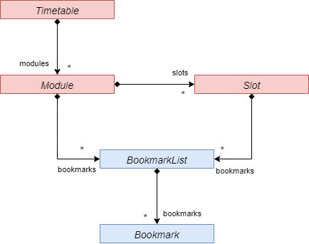
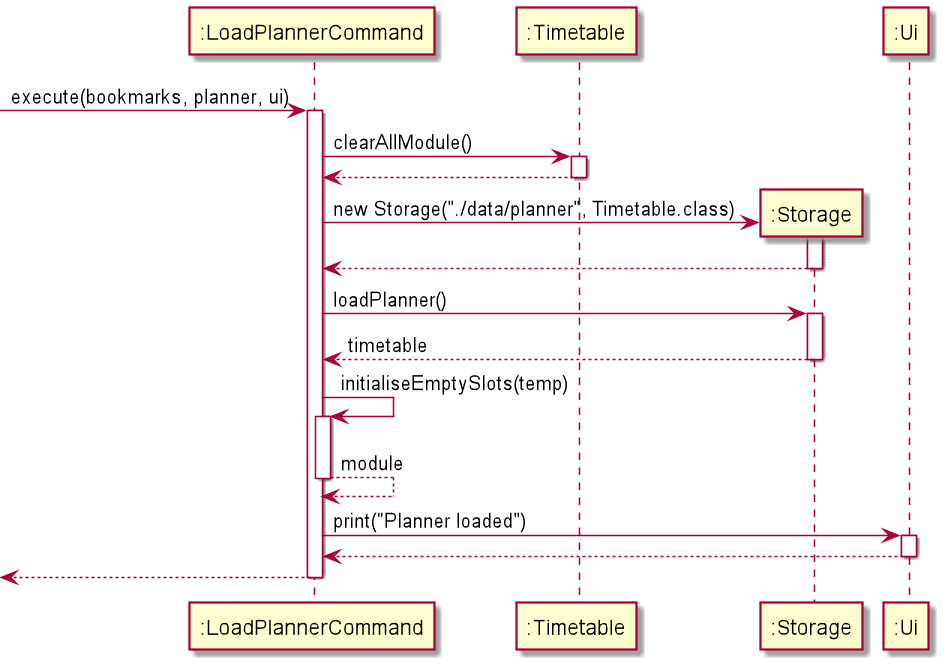
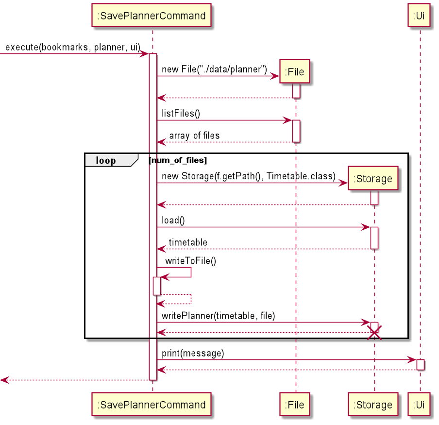

# **Developer Guide**

## **Introduction**
    
### Introduction to Zoomaster
Zoomaster is a Java application for the Command Line. It provides a simple and intuitive way to store Zoom links for 
online classes and other useful links for the lesson at hand. 

Zoomaster can also intelligently determine the current lesson users are having, allowing them to launch the correct 
links quickly and elegantly from the command line.

### Target audience
This developer guide is for experienced programmers with knowledge of object oriented programming.

### Purpose
This guide seeks to introduce to you the design and implementation of Zoomaster features. It will share our reasoning 
behind the way we implemented different features and its logic flow. With this, you would be able to tweak and further 
develop Zoomaster without confusion or introduce unwanted bugs to the App.

### Scope
First, the guide will help you set up Zoomaster in its current iteration so that you can familiarise with it.   
Secondly, the guide will explain the design of Zoomaster and its various components.  
Next, the guide will showcase how we implement various features into Zoomaster with 
step by step explanations and diagram.  
Finally, the guide has several appendixes explaining the scope of the product, user stories, non-function requirements, 
glossary and instructions for manual testing.

### Navigation
You can navigate the guide via the table of contents below.  
Otherwise, each major section is distinguished by a bold header and underline. Sub-sections are of a smaller font than 
major sections but still larger than normal paragraphs to distinguish them.

### Table of contents
* [Getting Started](#getting-started)
* [Design](#design)
  * [Architecture](#architecture)
  * [Initialization](#initialization)
  * [UI component](#ui-component)
  * [Parser component](#parser)
  * [Commands component](#command)
  * [Temporary list component](#temp-list)
  * [Storage component](#storage-component)
  * [Local files component](#local-files)
* [Implementation](#implementation)
  * [Bookmark and Timetable modes feature](#mode)
  * [Show timetable feature](#show-timetable)
  * [Add Module and Slot features](#add-module-slot)
  * [Validate Modules feature](#nusmodulelist)
  * [Extended HelpCommand feature](#extendedhelpcommand)
  * [Edit Slot feature](#edit-slot)
  * [Show Settings Feature](#showsettings)
  * [Set Settings Feature](#setsettings)
  * [Planner Feature](#planner)
* [Appendix A: Product Scope](#appendix-a)
* [Appendix B: User Stories](#appendix-b)
* [Appendix C: Non-Functional Requirements](#appendix-c)
* [Appendix D: Glossary](#appendix-d)
* [Appendix E: Instructions for manual testing](#appendix-e)
  * [Basics](#appendix-e-basic)
  * [Advanced](#appendix-e-advanced)

## **Getting Started**
First, download the source cod and jar file of Zoomaster [here](https://github.com/AY2021S1-CS2113T-W11-1/tp/releases).

Next, follow the startup procedures as stated in the 
[User Guide](https://github.com/AY2021S1-CS2113T-W11-1/tp/blob/master/docs/UserGuide.md) and familiarize yourself with 
Zoomaster's features.

Now, you can dive into the source code and explore the inner workings of Zoomaster with this guide.

## **Design**

This section explains the design behind Zoomaster by first sharing the grand architecture of the code 
then its various components.

### Architecture

The figure below shows a high-level design for the architecture of Zoomaster.   
   
*
 Figure 1.1 Architecture diagram of Zoomaster 
   *

Our Program can be split up into 7 components
* Initialization
* User Interface
* Parser
* Commands
* Lists
* Storage
* Local Files

These components interact with each other as shown in Figure 1.1 to execute the functionalities of Zoomaster.

### Initialization
The diagram below shows a class-level diagram for Zoomaster.   
   
*
 Figure 1.2 Class diagram of Initialization 
   *

**API**:`Zoomaster.java`

The Initialization component is responsive for setting up Zoomaster for it to be used by users. 

It consists of `Zoomaster`, `Ui`, `Storage`, `BookmarkList`, `Timetable` and `Module` classes.

Its main roles are:
* Retrieving bookmark, timetable and planner lists from storage if it exists.
* Set the list of Modules for Zoomaster 
* Initializes the User Interface object, as well as the 3 Storage  objects for `BookmarkList`, `Timetable` and `Planner`.

### User Interface component

**API**:`Ui.java`

The UI component is responsible for all visual output to the User from the app. 

The only class carrying out the component's function is the `Ui` class.

It utilises the `Jansi` library to enable the usage of ANSI escape codes to format the console, 
allowing the app to output in colour.  

The UI also receives input from the User using a `Scanner` object. It returns the input as a String 
to the main function.  

In addition, the UI contains the different exception and error messages which can be displayed. 
When a particular exception is thrown (eg. **UNKNOWN_INPUT**), the corresponding method is called in UI to 
print out the error message (**printUnknownInputMessage()**). 

Its main roles are:

* Receiving user commands and returning it to the Main function.
* Prints visual output in the console for the User

### Parser component

   
*
 Figure 1.3 Class diagram of Parser 
   *

The Parser component is responsible for decoding the user's input and telling the Main function 
which command to execute.

It also contains the **programMode** which indicates which mode the program currently is in.

It initializes the different commands according to which mode the program currently is in.

It consists of `Parser` and the Command interface classes.

Its main roles are:

* Decoding users commands and returning the correct command to the Main function to be executed
* Catch errors in users commands and return the appropriate exception to the Main function
* Storing the mode Zoomaster is in (Bookmark/Timetable/Planner)

The interaction of the Parser component with the Command component is covered in greater detail below. 

### Commands component
Figures 1.4 to 1.7 below show the class-level diagrams for Parser and Command for each different mode.  
The diagrams are colour coded as such:
* Orange -> Global
* Green -> Bookmark Mode
* Blue -> Timetable Mode
* Red -> Planner Mode

   
*
 Figure 1.4 Class diagram of Commands valid in all modes (Global) 
   *
  
   
*
 Figure 1.5 Class diagram of Commands valid in Bookmark Mode 
   *
  
   
*
 Figure 1.6 Class diagram of Commands valid in Timetable Mode
   *
  
   
*
 Figure 1.7 Class diagram of Commands valid in Planner Mode
   *
  
The Command component is responsible for carrying out the functions of Zoomaster.

Usually, a successful command will return a message to indicate a successful execution or updates to Zoomaster. 
Otherwise, it will create error messages for the Ui to display to the users.

It consists of `ChangeModeCommand`, `ClearCommand`,  `ExitCommand`,  `HelpCommand`,   `LaunchNowCommand`, 
`AddBookmarkCommand`,   `DeleteBookmarkCommand`,  `FindBookmarkCommand`,  `LaunchBookmarkCommand`, 
`ShowBookmarkCommand`, `AddTimetableCommand`, `DeleteTimetableCommand`, `ShowTimetableCommand`, `EditTimetableCommand`, 
`LaunchTimetableCommand`, `AddMeetingCommand`, `LoadPlannerCommand` and `SavePlannerCommand` classes.

Its main roles are:

* Execute commands to carry out functionalities of Zoomaster
* Signal to Ui successful execution of commands
* Create messages for Ui on updates to Zoomaster
* Catch errors or conflicts in users commands and throw the appropriate exception to the Main function

### Lists component

The Temp List component is responsible for holding on to temporary data of Zoomaster to be used by Commands.

It consists of `BookmarkList`, `SlotList`, `Module` and `Timetable`

Its main role is:

* Hold on to temporary data about Zoomaster

### Storage component

The Storage component is responsible for saving and retrieving Zoomaster data to and from an external text file.

It uses `Gson` library to encode temporary data from Temp List into a HTML format. Then it writes the encoded data to 
an external text file. On the other hand, it decodes the HTML format from the external text file and update the 
Temp List of Zoomaster.

The only class carrying out the component's function is the `Storage` class.

Its main roles are:

* Store Zoomaster data to an external text file for long term storage
* Retrieve Zoomaster data on Initialization
* Return error messages to the users during extraction or writing

### Local Files component

The Local Files component is where Zoomaster's long term storage of data is kept

Its main role is:

* Store Zoomaster data

In addition, the filepath to the directory containing the jar file is obtained by the getJarFilePath() method in `Zoomaster`.
The files are saved using this filepath, allowing them to be saved in the same directory as the jar file. This allows for more convenient running of Zoomaster, as the user does not have to switch to the same directory of the jar file when running the application.

## **Implementation**

This section explains the implementations of Zoomaster's features. It goes through the step-by-step process, 
expected outcomes of each feature and the design considerations.

<!-- @@author TYS0n1 -->

### Bookmark, Timetable and Planner modes feature (Tan Yu Shing)

Zoomaster has three modes for users to interact in. First, bookmark mode has the list of bookmarks with links to online resources. 
Secondly, timetable mode has a list of timetable slots. Lastly, planner mode which helps users plan their timetable. 
To simplify input commands for users, all lists has the same keywords for adding, deleting, and showing items in the lists. 
Hence, by having separating both list into different modes allows both lists to access the same keywords without causing conflicts when parsing commands.

In this section, I will refer to *input command* and *input parameter*.   
* *input command* refers to the string of characters the user has typed into the command line and entered into the program. Eg. "mode bookmark" is an *input command*   
* *input parameter* refers to the string of characters the proceeds after the identifier string of the *input command*. 
Eg. "mode bookmark", "mode" is the identifier string of the command and "bookmark" is the *input parameter*.

#### Implementation

This feature extends Command class with a way to toggle between different modes of Zoomaster. The integer variable used to control the modes is stored in the Parser class called "programMode". Additionally, it implements the following operation:
* getModeFromCommand() - Decodes the command sent by the users to figure out which mode the user wants to move to.

Given below is a sequence diagram of how changing between modes occur.

   

*
Figure 2.01 sequence diagram for ChangeModeCommand
   *

1. When Zoomaster gets an input command from the user to change modes, a new ChangeModeCommand object is created.

2. The ChangeModeCommand passes the input command through getModeFromCommand() function to decode the mode the user wishes to change to.

3. Zoomaster now executes the command and changes to the respective mode. 

4. If an invalid mode was given by the user or if the input field was empty, the execute function throws an exception and tells the user valid modes for Zoomaster.

The following activity diagram summarizes what happens when a user executes a new command:

   
*
 Figure 2.02 Activity diagram for ChangeModeCommand 
   *

1. First, the program checks if the length of the input command is more than 5. Any input command of length less than 5 is
an invalid mode command. This is because mode command requires an input parameter separated by a space hence "mode " or "mode1"
are examples of invalid mode commands with length of less than 5. If this is so, it throws an invalid mode message to tell the
user the valid modes of Zoomaster. Else, it continues to the next step.

2. Secondly, the program checks if the input parameter corresponds to a valid mode of Zoomaster.

3. If the input parameter corresponds to "bookmark", the program changes the mode of Zoomaster to the bookmark mode.

4. If the input parameter corresponds to "timetable", the program changes the mode of Zoomaster to the timetable mode.

5. If the input parameter corresponds to "planner", the program changes the mode of Zoomaster to the planner mode.

6. If the input parameter does not correspond to any of the valid modes of Zoomaster, it throws an invalid mode message to tell the
user the valid modes of Zoomaster.

#### Design consideration:

##### Aspect: How to store programMode variable for security

* **Alternative 1 (Current choice):** No security
    * Pros: Easy to implement
    * Cons: May introduce errors to the App if the variable is changed outside of ChangeModeCommand class objects.
* **Alternative 2:** Private variable and implement mode changing inside Parser class
    * Pros: Ensure the App does not change modes outside commands to change modes.
    * Cons: Reduces OOP standard of code by decoupling ChangeModeCommand from Command class and increases code complexity.

### Show timetable feature (Tan Yu Shing)
Users can see the timetable they have created in the App using the **show** command. 
They can see complete timetable from monday to sunday, the timetable of a specified day of the week or the timetable today. 
The commands for these are **show**, **show {DAY}** eg. **show mon**, **show tue** and **show today**.   

In this section, I will refer to *input command* and *input parameter*.   
* *input command* refers to the string of characters the user has typed into the command line and entered into the program. 
Eg. "show today" is an *input command*   
* *input parameter* refers to the string of characters the proceeds after the identifier string of the *input command*. 
Eg. "show sun", "show" is the identifier string of the command and "sun" is the *input parameter*.

#### Implementation
This feature extends the command class. It is a simple retrieval algorithm which firstly gets data from the Timetable class. Then sorts it by timing and add additional indicators for the users. And finally, prints it our using the User Interface.   It uses SlotContainer class sortSlotsByTime method to help sort the list of lessons and it's module code by timing.  
Additionally, it implements the following operations:
* getMessageSlotsInADay(List<Module> **modules**, List<Slot> **slots**, String **day**) - Retreives all the lesson **slots** and it's respective **module** code on the **day** specified. It then sorts the lessons by timing and returns it as a **message string**.   If valid, additional formatting such as current lesson indicator or current time indicator is added to the **message string**.
* getMessageTimetable(List<Module> **modules**, List<Slot> **slots**) - Retreives all the lesson **slots** and it's respective **module** code for the whole week. It then sorts the lessons by timing and returns it as a **message string**.    If valid, additional formatting such as current lesson indicator or current time indicator is added to the **message string**.
* getMessageLessonAtTime(List<Module> **modules**, List<Slot> **slots**, String **dayInput**) - Decodes the mode the user wants the timetable to be printed out in using **dayInput**.   Then calls the appropriate methods such as getMessageSlotsInADay and getMessageTimetable to get the **message string** which is then returned to the execute function to be printed out by the User Interface. If the the timetable is empty or an invalid **dayInput** is given, an **exception** is thrown to tell users their mistake.
* hasLessonNow(Slot **slot**) - Checks if a **slot** timing is overlapping with the current system time. Returns a **boolean** true or false based on the check.
* getIndicatorMessage() - Returns a **String** containing a indicator with the current system time.
* getHighlighBoxUpperMessage() - Returns a **String** containing a indicator with a message "lesson now".
* getHighlighBoxLowerMessage() - Returns a **String** containing a indicator.

Given below is a sequence diagram of how printing the timetable occurs.   
   
*
Figure 2.03 sequence diagram for ShowTimetableCommand
   *

   
*
Figure 2.04 sequence diagram for "Initialize ShowTimetableCommand" Block
   *

   
*
Figure 2.05 sequence diagram for "Execute ShowTimetableCommand" Block
   *

1. When Zoomaster gets a command from the user to show the timetable, a new ShowTimetableCommand object is created.

2. The ShowTimetableCommand decodes the input command to retrieve the way the user wishes to view the timetable in.

3. If an invalid input day is entered by the user, the input day will be set as **null**.

4. Zoomaster now executes the command and displays the timetable in the requested mode. 

5. If the input day is **null**, no timetable will be printed out. Instead, the program checks for does checks for Show Lesson Bookmarks feature.

The following activity diagram summarizes what happens when a user executes a new command:   
   
*
Figure 2.06 Activity diagram for ShowTimetableCommand
   *

1. First, the program checks if the input command is just "show". This corresponds to the user requesting the full timetable.
Hence, it sets **day** variable as "ALL" and moves on to the Execute step, step 6. Else it continues to decode the input command.

2. Secondly, the program checks for spacing error in the command. Show command requires a spacing after "show" help decode the input command.
Hence, if there is no space after "show", the program throws an Unknown Input ZoomasterException and shows the list of valid commands.

3. Next, the program checks if the input parameter is "today". This corresponds to the user requesting the timetable on the day of the current system time.
Hence, it sets **day** variable as the day of the current system time and moves on to the Execute step, step 6. Else it continues to further check the input command.

4. Afterwards, the program checks if the input parameter corresponds to a valid day of the week in its three letter abbreviation.
If so, it sets **day** variable as that of input parameter and moves on to the Execute step, step 6.

5. Else, if the input parameter does not correspond to any of the valid inputs. The program sets **day** variable as "NULL".

6. Now, the program executes. If the **day** variable is not "NULL", it prints the corresponding timetable the user wants.

7. If the **day** variable is "NULL", the program moves on to the Show Lesson Bookmarks feature.

#### Design consideration:

##### Aspect: What keyword for the user to input to get show timetable feature.

* **Alternative 1 (Current choice):** Using `show` keyword and a valid `DAY(optional)` input.
    * Pros: Able to use `show` keyword for the show module and slot details feature too.
    * Cons: Unable to show error message for an invalid `DAY(optional)` input 
    as the program reads the input as a `MODULE` input instead. Users have to use `help` command or
    to refer to the User Guide to receive help.
* **Alternative 2:** Using `list` keyword and a valid `DAY(optional)` input.
    * Pros: Easier to create code. No need to have an algorithm figure out if user wants to access show timetable
    feature or show module and slot details feature.
    * Cons: Less user-friendly. Users have to remember another keyword for showing data from Zoomaster.
* **Alternative 3:** Using `show timetable` keyword and a valid `DAY(optional)` input.
    * Pros: Less complex code. An additional keyword allows program to easily recognise show timetable feature.
    * Cons: Less user-friendly. Users have to type an additional phrase to show their timetable. Experienced users
    whom can memorise the command would not encounter the error message of Alternative 1, thus would find typing the
    additional keyword troublesome.

<!-- @@author -->
<!-- @@author xingrong123-->

### Add Module and Slot feature (Xing Rong)
This feature allows the user to add modules and lesson slots into the timetable.
Users can also add bookmarks to specific modules and slots.
Users can enter one-shot-commands, adding multiple slots and bookmarks to a module.

The class diagram below mainly shows the associations between the objects contained in the Timetable class. In the 
following sequence diagrams, the BookmarkList class is omitted for simplicity.  
  
*
 Figure 2.07 Class diagram for Timetable 
   *

Given below is a sequence diagram of how the feature works.  
  
*
 Figure 2.08 Sequence diagram for AddSlotCommand 
   *
  
  
*
 Figure 2.09 Sequence diagram for 
"Get module if it exist, else create a new module" Block 
   *
  
  
*
 Figure 2.10 Sequence diagram for 
"Create bookmark for module" Block 
   *
  
  
*
 Figure 2.11 Sequence diagram for 
"Create bookmark for existing slot base on its index" Block 
   *
  
  
*
 Figure 2.12 Sequence diagram for 
"Get slot if it exist, else create a new slot" Block 
   *
  
  
*
 Figure 2.13 Sequence diagram for 
"Create bookmark for slot" Block 
   *
  

1. After calling execute() method of the AddSlotCommand object, there will be a check on whether the module code 
entered by the user already exists in the timetable. If it does not exist, then the module will be created.

2. There will then be a check for additional commands pertaining to the module entered by the user.

3. The code will then check if the command is to add a module bookmark or a lesson slot, and do so accordingly.

4. If the command is to add a lesson slot, then there will be check for a bookmark entry in the command. 
If there is one, then the bookmark will be added to the lesson slot.

5. Loop to step 3 if there are additional commands which have not been executed.

6. Print the message of all commands executed and error messages.

#### Design consideration:

##### Aspect: How to enable fast typing users to add modules, slots and related bookmarks faster
* **Alternative 1 (Current choice):** allow one shot command to add slots and bookmarks to a module
    * Pros: Fast typers can input faster
    * Cons: Difficult to implement
* **Alternative 2:** separate adding of modules, lesson slots and related bookmarks into different commands
    * Pros: Easy to implement
    * Pros: Lower chance of error
    * Cons: User has to enter multiple commands each at a time to perform the functions, which takes up more time.

### Delete Module and Slot feature (Xing Rong)
This feature allows the user to delete the modules, slots and their bookmarks from the timetable.  

Given below is a sequence diagram of how the feature works.  
  
*
 Figure 2.14 Sequence diagram for DeleteSlotCommand 
   *
  
  
*
 Figure 2.15 Sequence diagram for 
"delete module" Block 
   *
  
  
*
 Figure 2.16 Sequence diagram for 
"delete slot" Block 
   *
  
  
*
 Figure 2.17 Sequence diagram for 
"delete module bookmarks" Block 
   *
  
  
*
 Figure 2.18 Sequence diagram for 
"delete slot bookmarks" Block 
   *
  

1. There will be a check if the module associated with the deleted object exists. 
If it does not exist, an exception will be thrown.

2. If the module exists, it will then check what kind of object the user wants to delete.
There are four options:
    1. Delete the module (including everything contained in the module).
    2. Delete a slot contained in the module.
    3. Delete all bookmarks associated with the module.
    4. Delete all bookmarks contained in a slot from the module.  

The whole-relationship between the objects, which can be seen from the class diagram Figure 2.07, would mean that 
deleting an object would also delete all objects contained in it.  
  

<!-- @@author -->
<!-- @@author Speedweener -->   

### Validate Modules feature (Zhan Hao)
This feature allows the application to validate if the modules entered by the user 
are existing NUS modules. This helps the user avoid erroneously adding modules from typos, 
as the application might otherwise consider the input to be a new module (eg. When adding slots to 
existing module CS2113T, a typo such as CS2113R would cause the application to add a new module 
instead).

This is done by retrieving a JSON file of existing NUS modules from NUSMods API. 
The application will then convert the JSON file to an ArrayList of modules, which will be used to validate 
modules entered by the user. The ArrayList is then stored locally so that subsequent runs of the application
will be able to read from the local file instead, which allows the application to be loaded faster. 
Below is a sequence diagram of the process of retrieving the module list. Note that the alt block is informally used 
to illustrate the try-catch block. 

  
*
 Figure 2.19 Sequence diagram for retrieving module list 
   *

  

1. When the application is launched, the application will try to read the module list from a modulelist.txt file in the same directory. 
It will read each line as a separate module and add them to an ArrayList.

2. If it cannot find the local file, or the file is empty, **FileNotFoundException** will be thrown.

3. When the **FileNotFoundException** is thrown, the nusModuleListFromNusMods() method will be called. It will first obtain the URL to be accessed using 
getNusModsUrl(), which creates the URL based on the current year. It will then attempt to connect to the URL. 

4. If unable to connect, the method will return null. The importance of this null value will be explained further down.

5. Else if it is able to connect, the application retrieves the JSON file as a string. The jsonToArrayList method is then called to parse 
the string to a JSONArray, then store the "modulecode" attribute of each JSONArray entry into an ArrayList. This ArrayList is returned to the 
loadModuleList() method.

6. If the ArrayList value is not null (Connection was successful), it is saved locally using the saveModuleList() method.
7. The ArrayList value is then returned to `Zoomaster`, which stores it as a static ArrayList in `Module`. This ArrayList is then used to validate modules.
8. To be validated, the module to be added must exists in the ArrayList. However, if the ArrayList is null (Failed to Connect), the validation will always 
return true. This is to allow the application to still be usable, although without the module validation feature.

#### Design consideration:

##### Aspect: How to allow the validation to be useful in most scenarios
* **Alternative 1 (Current choice):** Connection is needed once, to retrieve module list for the current year.
    * Pros: Allows for updated list of modules based on current year
    * Cons: Module validation will not work without initial internet connection
* **Alternative 2:** Save the module list along with the jar file.
    * Pros: Does not require internet connection
    * Cons: Module list might not be updated as per the year which the application is being run, prevent newer modules from being added

Since the application is primarily based on launching URLs, having an internet connection is a general requirement for the rest of the 
application to function. Hence, the cons of the first alternative is not significant.

##### Aspect: How to increase usability among different users
* **Alternative 1 (Current choice):** Module list is a saved as a editable txt file
    * Pros: Allows for editing of module list to include non-NUS modules
    * Cons: App start up takes a longer time as module list has to be loaded .
* **Alternative 2:** Store the module list within the jar file file itself.
    * Pros: Faster start up of app
    * Cons: Module list cannot be edited, preventing users from other universities taking other modules from adding their modules.

Since the start up time for the app after loading the module list from online is still very fast, it should not affect most users.
  

### Extended HelpCommand feature (Zhan Hao)
This feature allows user to query more about the different commands available in the different modes. This is to allow quick typist to 
have a fast way to reference the purpose and format of the commands without having to consult the User Guide.

This command will be sensitive to the current mode of the application. For example, the command `help add` would print different text in 
Bookmark, Timetable, or Planner Mode. The command `help edit` would be valid in Timetable mode, but not valid in Bookmark mode as such a 
command does not exist in that mode.

Below is a sequence diagram of the extended HelpCommand.   

  
*
 Figure 2.20 Sequence diagram for "HelpCommand" 
   *
  

  
*
 Figure 2.21 Sequence diagram for 
"details is empty" Block 
   *
  

  
*
 Figure 2.22 Sequence diagram for 
"details not empty" Block 
   *
  

  

1. From Figure 2.20, when Zoomaster calls parse() on user input and Parser parses it as a HelpCommand, HelpCommand will check if the details 
are not empty, then validate if the details match a valid command based on the current mode (not shown in diagram). If the details are not valid, 
an exception is thrown. Zoomaster will then call the execute() method on HelpCommand.

2. From Figure 2.21, if the details are empty, the HelpCommand will call the printHelpMessage() in Ui command without the details. Ui will retrieve the 
current mode through a call to static variable programMode in Parser. The mode is then used to determine which list of available command is to be printed.  

3. Else from Figure 2.22, if the details are not empty, the command HelpCommand will call the printHelpMessage(details) in Ui. Similarly, Ui will retrieve the current 
mode through a call to static variable programMode in Parser. Ui will check if the details correspond to any of the global command keywords, such as 
CLEAR_KW or EXIT_KW and print accordingly. If the details do not match any, the mode will be used to determine which print extended help method is to be called. 

4. The HelpCommand then becomes an unused object to be deleted to free up memory.

5. The different print with colour methods utilise the JAnsi library to print to the Command Prompt in colour.

  
<!-- @@author -->

<!-- @@author fchensan -->

### Edit Slot feature (Francisco)

This feature allows users to edit a slot's title or time. Users can also move slots over to another module.

Given below is an example usage scenario and how the edit mechanism works.

1. The user enters `edit title mon 2 new_title`.
2. A new EditSlotCommand instance is created and its `execute` method is called.
3. Based on the chosen field in the user input, different methods are called:
    a. If the command is `edit module`, the moveSlotToAnotherModule method in timetable is called to move the slot to a given module.
    b. If the command is `edit title`, like in the current example, the slot corresponding to the day and index given in the user input is retrieved by calling the getSlotByIndexInDay method of the timetable. 
    In this case, the 2nd slot on Monday will be returned. The setTitle method of the retrieved slot is then called.
    c. If the command is `edit time`, it works similar to `edit title`, but with changeSlotTime called instead. This method will call setDay(), setStartTime(), and setEndTime() of the retrieved slot.

The sequence diagram below explains how this feature is executed:

 
*
 Figure 2.23 Sequence diagram for EditSlotCommand 
   *

#### Design consideration:

##### Aspect: What part of a slot should the user be able to edit
* **Alternative 1 (Current choice):** The user can choose to edit the slot's module, title, or time.
    * Pros: Allows for quicker edits.
    * Cons: Harder to implement.
* **Alternative 2:** The user needs to type in the entire slot details (including module, title, and time).
    * Pros: Easier to implement.
    * Cons: The user needs to type the module, title, and time even when the user only wants to edit one of them.

### Show settings feature (Francisco)

This feature allows more experienced users to view Zoomaster's settings. 

Given below is an example usage scenario and how the `showsettings` command works.

1. The user enters `showsettings`
2. A new ShowSettingsCommand instance is created and its `execute` method is called.
3. Inside the `execute` method, a private method `generateSettingsListMessage` is called to generate the string of 
settings to be printed.
4. `generateSettingsListMessage` retrieves a list of the user's settings by calling the getSettingsVariables method of 
the UserSettings object in the main Zoomaster class. It will then convert them into a string and return it.
5. In `execute`, the generated text will be printed by calling the `ui`'s `print` method.

The sequence diagram below explains how this feature is executed:

 
*
 Figure 2.24 Sequence diagram for ShowSettingsCommand 
   *

### Set settings feature (Francisco)

This feature allows users to change settings as shown from the `showsettings` command. 

Given below is an example usage scenario and how the `set` command works.

1. The user enters `set def_mode timetable`, which means set the default mode to timetable mode.
2. A new SetSettingsCommand instance is created and its `execute` method is called.
3. Inside the `execute` method, the list of all settings variables is retrieved from the `UserSettings` object in
`Zoomaster`.
4. The corresponding variable is extracted out (in this case, `def_mode`), and the value is set to `timetable`.

The sequence diagram below explains how this feature is executed:

 
*
 Figure 2.25 Sequence diagram for SetSettingsCommand 
   *

#### Design consideration:

##### Aspect: How should the user specify which setting to change
* **Alternative 1 (Current choice):** The settings all have a name associated with each of them.
    * Pros: Allows for more expressive commands (e.g. `set autosave on` vs. `set 2 on`).
    * Cons: Harder to implement.
* **Alternative 2:** The user selects a setting to change by its index number.
    * Pros: Easier to implement.
    * Cons: The user needs to type in `show` to know the index number.

 

<!-- @@author jusufnathanael-->

### Planner feature (Jusuf)

This feature is an extension of the timetable feature that allows users to find common empty slots from each individual timetable. The users can then add a new meeting, and the app will automatically write the meeting to each timetable.

Below is the general flow on how the mechanism works:
1. The different timetables must first be loaded to the `planner` folder manually.
2. In the app, the user can enter the `load` command to load all the timetables and initialise the common empty slots.
3. To view the slots, the user can enter the `show` command with or without the day (optional).
4. The user can also call the `add` command to add a new meeting, similar to the timetable feature.
5. Finally, the user can call the `save` command to store the newly added meeting(s) to each individual timetable.

 

Some of the key features of the planner mode is the `load` and `save` commands.

The general flow of the loading process is as below:
1. First, the command clear all the modules in the planner timetable.
2. Next, the files inside the `planner` folder will be loaded and converted to a single timetable.
3. The empty slots will be initialised based on the previous timetable and it will return an `EMPTY` module 
along with all the empty slots.
4. Finally, a confirmation message will be printed if the loading process is successful.

The sequence diagram below explains how the load planner command is executed:

  
*
Figure 2.26 Sequence diagram for LoadPlannerCommand
  *

 

The general flow of the saving process is as below:
1. First, we store the file paths of the individual timetables to an array of files. 
2. For each file, the command will load the timetable and add the newly added meeting to the timetable.
3. Finally, a confirmation message will be printed  if the saving process is successful.

The sequence diagram below explains how the load planner command is executed:

  
*
Figure 2.27 Sequence diagram for SavePlannerCommand
  *

#### Design consideration:

##### Aspect: How to load and save the group meeting to the timetables.

* **Alternative 1 (Current choice):** Manually load the individual timetables and save the new meetings (slots and bookmarks) to the timetables.
    * Pros: User can decide when to save the newly added meetings (still allow some changes).
    * Cons: In case that the program crashes, the meeting will not be saved.
* **Alternative 2:** Automatically load and save the individual timetables per every command.
    * Pros: Any changes will be automatically saved, in case that the program crashes
    * Cons: Hard to implement
    * Cons: Do not allow any further modifications in case the user wants to change the meeting details.
    
 

<!-- @@author -->

## **Appendix A: Product scope**
### Target user profile

* NUS students
* Students with fast typing skills 
* Students comfortable with using the command line interface

### Value proposition

Zoomaster was developed during the coronavirus pandemic whereby many NUS classes have been transitioned towards online lessons. 
NUS lessons are mainly conducted on Zoom video conferencing software. 
However, as Zoom does not store recurring nor past meetings, it is hard for students to easily access their online lessons. 
Hence, Zoomaster helps to organise students’ Zoom links for easy access to their lesson.

## **Appendix B: User Stories**

|Version| As a ... | I want to ... | So that I can ...|
|--------|----------|---------------|------------------|
|v1.0|studious NUS student| bookmark important websites from different modules|launch them easily when needed|
|v1.0|NUS student|label my bookmarks|know quickly the topics of each link|
|v1.0|busy NUS student|create a timetable within the app which syncs up with the system time|avoid missing my lessons|
|v1.0|NUS student|take a look at my modules for the day, or the entire week|plan out my day/week|
|v1.0|new user|see usage instructions|refer to them when I forget how to use the application|
|v2.0|user|find a to-do item by name|locate a to-do without having to go through the entire list|
|v2.0|first time user of Zoomaster|be able to see the list commands available|easily navigate through the Zoomaster|
|v2.0|advanced user|be able to launch multiple links at the same time if the links are grouped together|save time by not doing multiple launching commands|
|v2.0|advanced user|edit my bookmarks and timetable lists according to changes in my module and timetable|quickly make changes to my lessons|
|v2.0|busy user|have an indicator telling me the current time|easily check on the time in a hurry|
|v2.0|fast typer|be able to type a one-shot-command when entering the details of the lessons in my timetable|add the lesson details faster|
|v2.0|busy NUS student|be able quickly launch my next Zoom lesson|avoid being late for my lessons|
|v2.0|NUS student|find common empty slots between my teammates|plan my group meetings accordingly and efficiently|
|v2.0|NUS student|save my group meetings to my timetable|avoid missing my group meetings|

## **Appendix C: Non-Functional Requirements**

1. The App should work on any mainstream OS as long as it has Java `11` installed.
2. A user with above average typing speed should be able to accomplish most of the tasks faster using commands than using the mouse.

## **Appendix D Glossary**

### Zoom
> A popular video communication program by a company of the same name

### UML 
> Unified Modeling Language, a standard to visualize the design of a system

### UI
> User Interface
    
### ANSI 
> American National Standards Institute, ANSI characters is a popular character set used by programmers
    
### NUS
> National University of Singapore

### Mainstream OS
> Windows, Linux, Unix, OS-X

## **Appendix E: Instructions for manual testing**

**Basics**
1. Initial launch
    1. Download the jar file and copy into an empty folder.
    2. Open the command prompt and change directory to the location of the jar file.
    3. Enter `java -jar zoomaster.jar` in the command line. You should expect to see the welcome screen of the application.
2. Testing
    1. Download the test cases text file from github [here](https://github.com/AY2021S1-CS2113T-W11-1/tp/tree/master/text-ui-test).
    Its name is input.txt. 
    2. These are some the sample test cases used to test if the program is working as intended. You should get the same results   
    as shown in EXPECTED.txt file.
    3. You can refer to the [User Guide](https://github.com/AY2021S1-CS2113T-W11-1/tp/blob/master/docs/UserGuide.md) for the full list
    of features and available commands for Zoomaster.
    4. Now you can manually input test cases into Zoomaster and see the results.
    5. Note that the output of the application is dependent on the system time of your machine.
3. Saving and Loading
    1. Saving and loading of data is done automatically in Zoomaster. 
    2. The application uses the Gson library to convert the java objects in Zoomaster into JSON constructs, then 
    writing them into the text files stored locally in the machine.
    3. Data is stored in 3 separate text files; `bookmarks.txt`, `modulelist.txt` and `timetable.txt` which are located
    in the `data` folder. The `data` folder is created in the directory where `zoomaster.jar` is placed.
    4. To test the saving feature, you can enter input some data into the Zoomaster through the command line interface
     such as using the commands `mode timetable` then `add CS2113T`.
    5. Exit the application by using the command `exit` and look in the `timetable.txt` file. The module "CS2113T" 
    should be recorded.
    6. You can test the loading feature by launching Zoomaster and entering the commands `mode timetable` 
    and `add CS2113T`. There should be a message that the module "CS2113T" already exists. 
    7. You can also edit the data in the text files in JSON format and test the loading of data into the Zoomaster by 
    launching the application. You can refer to the class diagrams above for the associations between the classes.

**Advanced**
1. Testing global commands (`mode`, `help`, `clear`, `showsettings`, `set`, `exit`)
    1. Test `mode` command. Enter `mode bookmark` to enter bookmark mode, you should see the message "Changing to bookmark mode".  
    Enter `mode timetable` to enter bookmark mode, you should see the message "Changing to timetable mode".  
    Enter `mode planner` to enter bookmark mode, you should see the message "Changing to planner mode".  
    2. Test `help` command. In bookmark mode, enter `help`, you should see message "Available inputs in Bookmark mode are" and the list available commands.
    Then, enter `help add`, you should see message "Adds a bookmark to the bookmark list URL must start with www or https:// or http:// Format: add {description} {URL}".
    3. Test `clear`. Enter `clear`, you should see your screen is cleared.
    4. Test `showsetings`. Enter `showsettings`, you should see two settings in a list.
    5. Test `set`. Enter `set def_mode timetable`, you should see that the default mode is now `timetable`.
    6. Test `exit`. Enter `Exit`, you should see message "Bye. Hope to see you again soon!" and the program is terminated.
    7. Run the jar file again, the program should be in `timetable`.
    
2. Testing bookmark commands (`add`, `show`, `delete`, `find`, `edit`, `launch`)
    1. Test `add`. Enter `add google www.google.com`, you should see message "Added bookmark: [google] www.google.com".
    2. Test `show`. Enter `show`, if you did not add any other bookmark except that of step 1, you should see message
    "Here are the bookmarks in your list: 1.[google] www.google.com".
    3. Test `find`. Enter `find google`, you should see message "Here are your matching bookmarks 1.[google] www.google.com". 
    4. Test `edit`. 
    Enter `edit desc 1 search`, and then type `show` and you should see that the description is now `[search]`.
    Enter `edit url 1 www.bing.com`, and then type `show` and you should see that the URL is now `www.bing.com`.
    4. Test `delete`. Enter `delete 1`, you should see message "I've deleted this bookmark!: [google] www.google.com".
    5. Test `launch`. Re-add bookmark from step 1 and enter `launch 1`, you should see www.google.com launched in your browser.
    
3. Testing timetable commands (`add`, `show`, `edit`, `delete`, `launch`)
    1. Test `add`. Enter `add cs2113t lecture fri 16:00 18:00 www.github.com`, you should see message 
    "CS2113T added lecture slot added bookmark added to CS2113T lecture".
    2. Test `show`. Enter `show`, if you did not add any other slot except that of step 1, you should see a lesson slot
    from 16:00 to 18:00 on fridays with description "lecture CS2113T". Enter `show fri`, and you should see the same lesson slot.
    Enter `show today`, if your system date is friday, you should.see the lesson slot. Else you should see message "No lesson" and
    the current time indicator.
    3. Test `edit`. Enter `edit module fri 2 cs2113`, you should see message "Slot moved to CS2113". Enter `edit title fri 2 tutorial`,
    you should see message "Slot title changed to tutorial". Enter `edit time fri 2 thu 17:00 18:00`, you should see message "Slot time changed to thu 17:00 18:00".
    4. Test `delete`. Enter `delete cs2113 1`, you should see message "deleted 17:00-18:00 tutorial from cs2113".
    5. Test `launch`. Re-add slot from step 1 and enter `launch cs2113t 1`, you should see www.github.com launched in your browser.
    
4. Testing planner commands (`load`, `add`, `show`, `save`)
    1. Test `load`. First, manually copy your teammates' timetable to the `/data/planner/` folder. Enter `load` and you should see a `planner loaded` message if successful.
    2. Test `show`. Enter `show` and you should see the list of empty time slots. Enter `show fri`, and you should see the list of empty slots on Friday.
    3. Test `add`. Enter `add cs2113t lecture fri 16:00 18:00 www.github.com`, you should see message "CS2113T added lecture slot added bookmark added to CS2113T lecture".
    4. Test `save`. Enter `save` and you should see a `planner saved` message.

5. Testing `launch now`
    1. First, get your current system time. You can view this via your clock app on your device.
    2. Secondly, in timetable mode, use the `add` command to create a new slot with period overlapping with your current system time.
    3. Thirdly, use `add` command to add a bookmark (e.g. www.google.com) to the slot you created in step 2. 
    4. Lastly, enter `launch now`, you should see the bookmark you entered launched in your browser.
    
