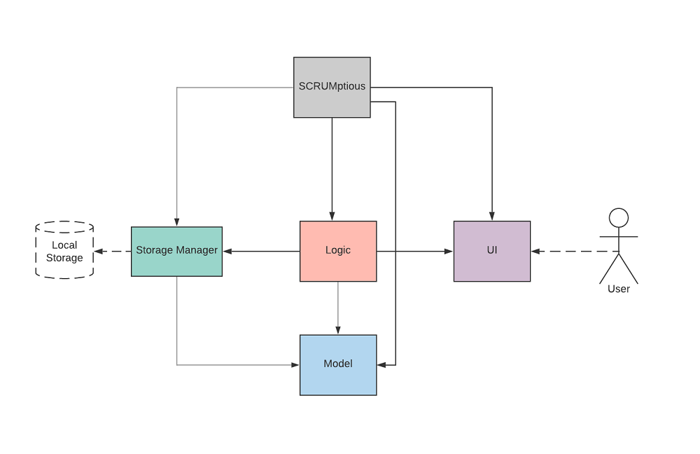
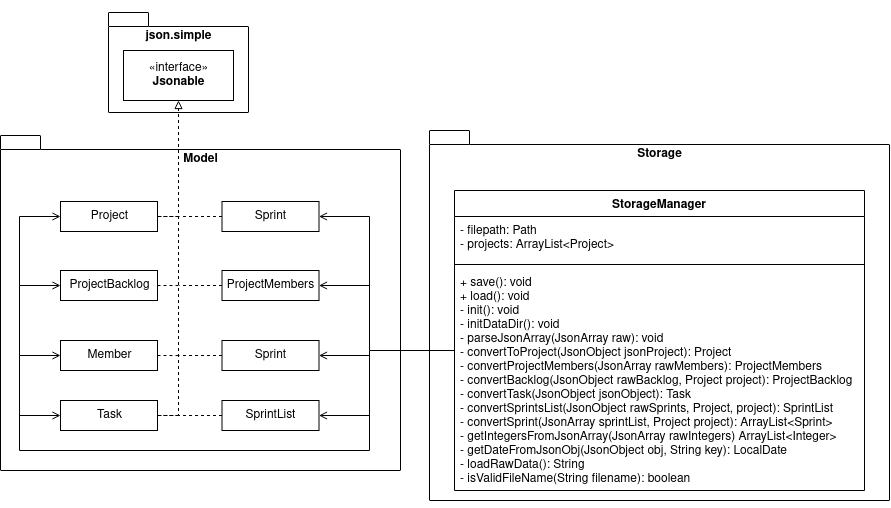
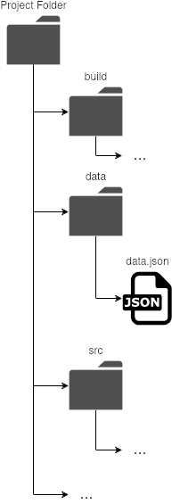
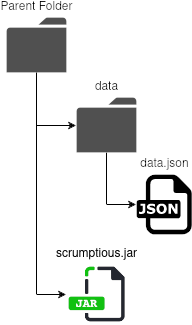

# Developer Guide

## Table of Contents
1. [Introduction](#introduction)
    1. [Background](#background)
    1. [Purpose](#purpose)
    1. [Scope](#scope)
1. [Getting Started](#getting-started)
    1. [Prerequisites](#prerequisites)
    1. [Setting Up](#setting-up)
    1. [Running the Program](#running-the-program)
1. [Design](#design)
    1. [Architecture](#architecture)
    1. [UI Component](#ui-component)
    1. [Logic Component](#logic-component)
    1. [Model Component](#model-component)
    1. [Storage Component](#storage-component)
1. [Implementation](#implementation)
    1. [Project](#project)
        1. [Create Project](#create-project)
        1. [Select Project](#select-project)
    1. [Task](#task)
        1. [Add Task](#add-task)
        1. [View Task](#view-task)
        1. [Delete Task](#delete-task)
        1. [Change Task Priority](#change-task-priority)
        1. [Mark Task as Complete](#mark-task-as-complete)
    1. [Sprint](#sprint)
        1. [Create Sprint](#create-sprint)
        1. [View Sprint](#view-sprint)
        1. [Add Task to Sprint](#add-task-to-sprint)
        1. [Remove Task from Sprint](#remove-task-from-sprint)
        1. [Allocate Sprint Tasks to Members](#allocate-sprint-tasks-to-members)        
    1. [Saving of Data](#saving-of-data)
1. [Appendix: Requirements]()
1. [Others](#target-user-profile)

## Introduction
### Background
SCRUMptious is a Java-based command line interface application for you to efficiently manage the development of a project. Leveraging the robust SCRUM/Agile framework, it allows you to delegate tasks to your team members and organize project requirements with ease. As a bonus, if you are a keyboard warrior, you can reach peak efficiency using SCRUMptious to manage your projects.

### Purpose
This guide illustrates the general architecture, and software design of SCRUMptious.

### Scope
This guide is geared towards developers who wish to enhance or create their own version of SCRUMptious. As such, it contains important information regarding the software architecture and design considerations of SCRUMptious.

## Getting Started
### Prerequisites
1. JDK 11.
1. IntelliJ IDEA.

### Setting Up
1. Use a Git tool to fork this repository, or download the .zip file from GitHub and extract the contents into a new folder.
1. Right-Click on the folder and select “Open folder as Intellij IDEA Community Edition Project”.
1. Ensure JDK 11 is selected for Gradle, by navigating to Configure > Structure for New Projects > Project Settings > Project > Project SDK.

### Running the Program
This program can be run once it is compiled. If you have built its artifacts (.jar) file, you may run it using java -jar <filename.jar> on your command line.

## Design
This section seeks to explain the high-level design of the application. Given below is a quick overview of each component and the explanation of the design architecture in greater detail.
NotUS is the main class of the application, and handles the initializing and execution of the appropriate classes.
### Architecture
  
The architecture design is given in the diagram above. The main components of
SCRUMptious are:

1. `ProjectManager` : Manages and stores all the projects added by the user, keeps track of selected project.    
1. `SprintManager` : Stores all sprints associated with a project.
1. `TaskManager` : Stores all tasks in backlog associated with a project.
1. `ProjectMembers` : Stores all team-members associated to a project. 
1. `Parser` : Creates a suitable parser, based on the command to make sense of the user input. Respective parser then
 make use the information and call respective commands. 
### UI Component
{UML}
### Logic Component
{UML}
### Model Component
{UML}
### Storage Component
  
  
API: [StorageManager.java](/src/main/java/seedu/duke/storage/StorageManager.java)  
The Storage component is using the JavaScript Object Notation (JSON) to save the data. The library used for serialising and deserializing the data is _json.simple 3.1.1_ by **Clifton Labs**.  
As shown in the diagram above, `JsonableObject` and `JsonableArray` are interfaces which inherits the `Jsonable` interface. The following model class inherits only one of the two interfaces:  
- ProjectManager  
- Project  
- SprintManager  
- TaskManager  
- ProjectMembers  
- Sprint  
- Task  
- Member  

This requires the model classes to implement two methods required for JSON serialisation and deserialisation:  
- `toJson()`: Contains logic required to convert the model object into JSON string.  
- `fromJson()`: Contains logic required to convert JSON object into its respective model class.  
  - Due to the limitations of the library, parsing of the JSON string only converts it into either `JsonObject` or `JsonArray` objects which requires additional operations to map the data back to the respective model classes.  
  - `fromJson()` will take in either one of the `JsonObject` or `JsonArray` object, and map the properties to the respective properties of the model classes.  

## Implementation
### Project
#### Create Project
A project is created with a clear title and description of what the team is working on 
for delivery, as well as the project length and the sprint duration specified.
Command executed by user `project /create -title <title> -desc <description> -dur <duration> -sd <sprint interval>`
is passed, the following operations are implemented:
    * UI receives user input and passes it to Parser class.
    * Parser checks if input format is valid, and executes a corresponding AddProjectCommand object
    * A new project is created , and added to project manager.

#### Select Project
### Task
#### Add Task
#### View Task
#### Delete Task
#### Change Task Priority
#### Mark Task as Complete    
### Sprint
#### Create Sprint
#### View Sprint
#### Add Task to Sprint
#### Remove Task from Sprint
#### Allocate Sprint Tasks to Members    
### Saving of Data
To make the data persistent and portable, **JSON** has been chosen as the format for data to be saved to a persistent storage such as storage drives, thumb drives and any other storage medium that is used to run the program. JSON is also human-readable which allows users to directly modify the data file easily which can be useful in certain scenarios such as fixing the data file in the event of data corruption.

  
_Figure X: Running the Jar_  
  
_Figure X: Running in IDE_  

As shown in the above diagram, the program will save the data as “data.json”. The data file is saved in the “data/” folder that is located in the folder of the program. If you are testing the program using Intellij IDE, the “data/” folder will be in the root of the project folder. 
  
When you start the program, the program will load the data file from its respective location and deserialise it into its respective object instances. Data will be saved when the program exits or whenever the user makes changes to the program.  

### Target user profile

{Describe the target user profile}

### Value proposition

{Describe the value proposition: what problem does it solve?}

## User Stories

|Version| As a ... | I want to ... | So that I can ...|
|--------|----------|---------------|------------------|
|v1.0|new user|see usage instructions|refer to them when I forget how to use the application|
|v2.0|user|find a to-do item by name|locate a to-do without having to go through the entire list|

## Non-Functional Requirements

{Give non-functional requirements}

## Glossary

* *glossary item* - Definition

## Instructions for manual testing

{Give instructions on how to do a manual product testing e.g., how to load sample data to be used for testing}
