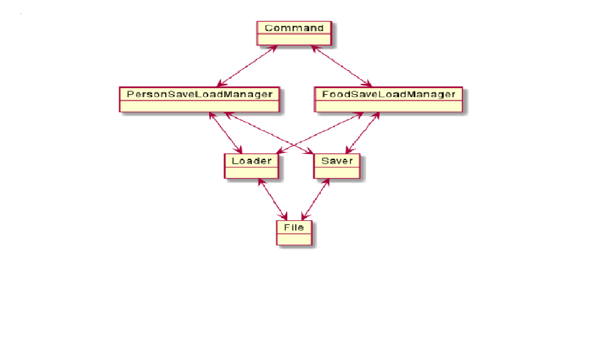
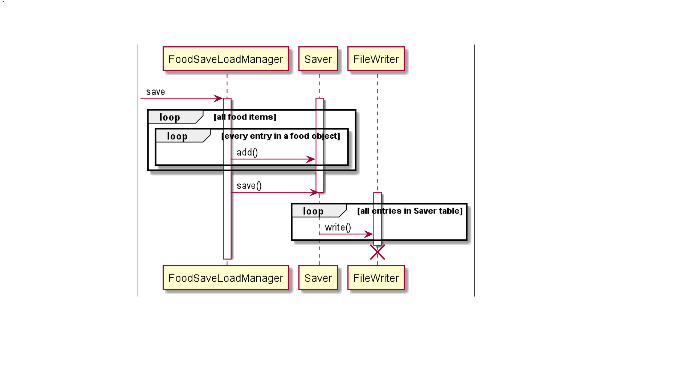
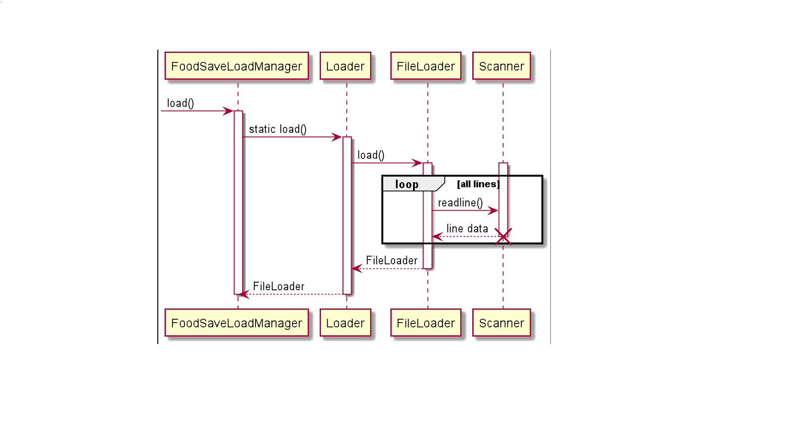

# Developer Guide

## Design & implementation

{Describe the design and implementation of the product. Use UML diagrams and short code snippets where applicable.}
## Save/Load Feature

The Save/Load feature is implemented by the saveload package.
At the base of the package, there is the <mark> Saver </mark> 
and <mark> Loader </mark>  class.

### Architecture

Note only the Saver and Loader class is flexible. They can be adapted to new situations without modifying
the code. The FoodSaveLoadManager and PersonSaveLoadManager are written specifically for this version. They
will have to be modified/replaced for future versions.

#### Saver class

Stores data in a internal table with length and height specified.
Handles the storage of its data by writing to a text file.

##### Constructor
Specifies the length and height of the internal Saver table
##### Main Methods
* Saver#save() saves the current data to the file in the folder with the given file name
* Saver#add() Store String data in the x,y position in the table

#### Loader class
Loads data from a text file and stores it in a internal table just like the saver
##### Constructor
static method Loader.load(folder name , file name) : creates a Loader object with 
a table storing the data found in the text file
##### Main Methods
* Loader#get() retrives the data stored in the loader

#### FoodSaveLoadManager class
Built on top of Saver and Loader class to implement save/load functionality
for list of food items the user has input into the dietbook. Contains a instance
of both <mark> Saver </mark> and <mark> Loader </mark>. It has its own folder to work with,
the user only has to specify the file name.
##### Main Methods
* FoodSaveLoadManager#save() saves the list of food objects to the specified file name
* FoodSaveLoadManager#load() loads the file and returns the list of food objects stored inside it

#### PersonSaveLoadManager class
Built on top of Saver and Loader class to implement save/load functionality for user information
Same as FoodSaveLoadManager, it has its own folder to work with, the user only has to specify the file name
Unlike the FoodSaveLoadManager, it stores the data inside itself and can be updated.
##### Main Methods
* PersonSaveLoadManager#save() save the current state into the file
* PersonSaveLoadManager#load() loads the file 
* Setters and Getters for all the personal data in this current version

#### UML diaghram
##### FoodSaveLoadManager#save()

##### FoodSaveLoadManager#load()

similiar diaghrams for PersonSaveLoadManager

## Product scope
### Target user profile

{Describe the target user profile}

### Value proposition

{Describe the value proposition: what problem does it solve?}

## User Stories

|Version| As a ... | I want to ... | So that I can ...|
|--------|----------|---------------|------------------|
|v1.0|new user|see usage instructions|refer to them when I forget how to use the application|
|v2.0|user|find a to-do item by name|locate a to-do without having to go through the entire list|

## Non-Functional Requirements

{Give non-functional requirements}

## Glossary

* *glossary item* - Definition

## Instructions for manual testing

{Give instructions on how to do a manual product testing e.g., how to load sample data to be used for testing}
