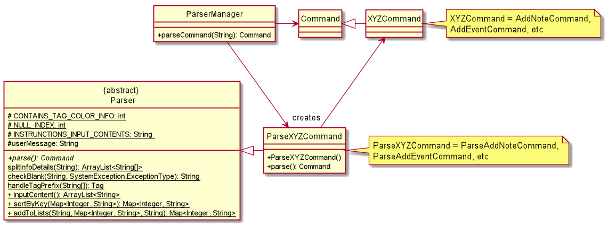
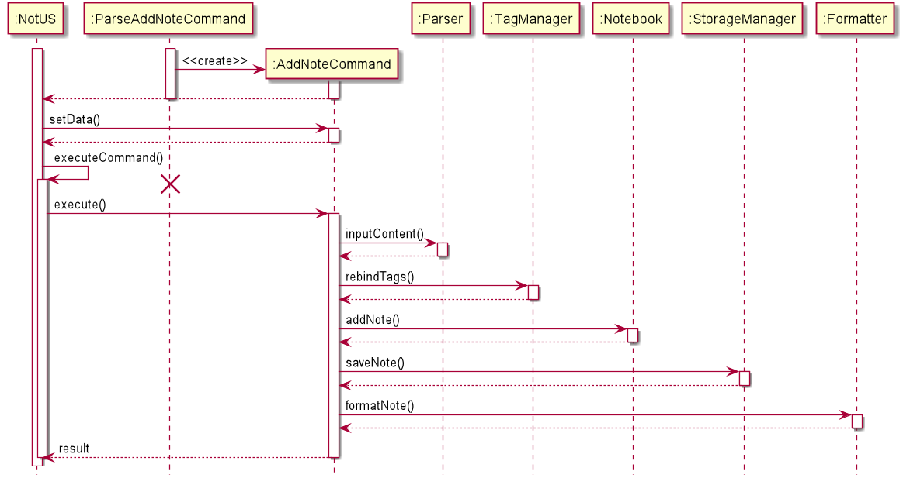
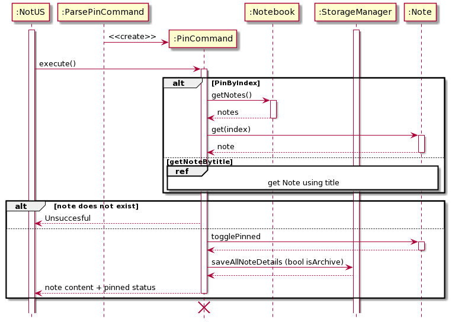
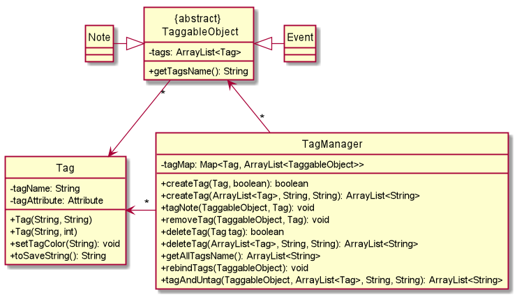
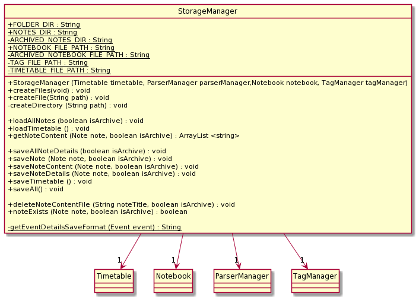
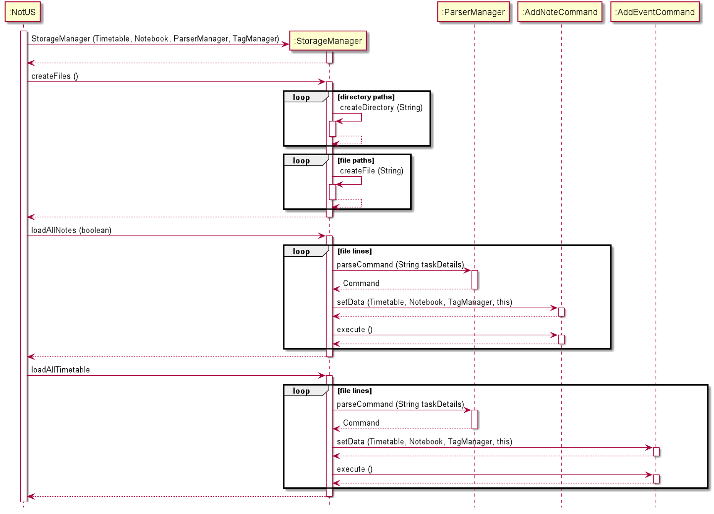

## Table of Contents
#### [1. Introduction](#intro)
##### &nbsp;&nbsp;&nbsp;&nbsp;&nbsp;&nbsp;[1.1 Setting Up](#setup)
##### &nbsp;&nbsp;&nbsp;&nbsp;&nbsp;&nbsp;[1.2 Project Management & Development Practices](#management)
#### [2. Design & Implementation](#design)
##### &nbsp;&nbsp;&nbsp;&nbsp;&nbsp;&nbsp;[2.1 Architecture Overview](#overview)
##### &nbsp;&nbsp;&nbsp;&nbsp;&nbsp;&nbsp;[2.2 NotUS](#notus)
##### &nbsp;&nbsp;&nbsp;&nbsp;&nbsp;&nbsp;[2.3 ParserManager](#parserManager)
##### &nbsp;&nbsp;&nbsp;&nbsp;&nbsp;&nbsp;[2.4 Commands](#commands)
##### &nbsp;&nbsp;&nbsp;&nbsp;&nbsp;&nbsp;[2.5 Notebook](#note)
##### &nbsp;&nbsp;&nbsp;&nbsp;&nbsp;&nbsp;[2.6 Timetable](#event)
##### &nbsp;&nbsp;&nbsp;&nbsp;&nbsp;&nbsp;[2.7 Tags](#tag)
##### &nbsp;&nbsp;&nbsp;&nbsp;&nbsp;&nbsp;[2.8 Storage](#storage)
##### &nbsp;&nbsp;&nbsp;&nbsp;&nbsp;&nbsp;[2.9 User Interface](#ui)
##### &nbsp;&nbsp;&nbsp;&nbsp;&nbsp;&nbsp;[2.10 System Exception](#exception)
##### &nbsp;&nbsp;&nbsp;&nbsp;&nbsp;&nbsp;[2.11 Usage of External Libraries](#color)
#### [3. Product Scope](#scope)
##### &nbsp;&nbsp;&nbsp;&nbsp;&nbsp;&nbsp;[3.1 Target User Persona](#userpersona)
##### &nbsp;&nbsp;&nbsp;&nbsp;&nbsp;&nbsp;[3.2 Target User Profile](#userprofile)
##### &nbsp;&nbsp;&nbsp;&nbsp;&nbsp;&nbsp;[3.3 Value Proposition](#value)
#### [4. User Stories](#userstories)
#### [5. Non-Functional Requirements](#nfr)
#### [6. Glossary](#gloss)
#### [7. Instructions for Manual Testing](#testinstr)

 

## <a id="intro">1. Introduction</a>

NotUS is a quick and simple, Command Line Interface (CLI) based, note-taking application for keyboard-inclined users. NotUS allows for users to categorize notes by tagging as well as pinning the more important notes. NotUS is also designed to assist in planning timetables to highlight possible clashes.

This document describes the design, implementation and architecture of NotUS. The aim of this developer guide is to get developers and potential contributors familiarised with the design and implementation of NotUS. It is assumed that the reader has some basic understanding of UML Notations. If you do not possess such knowledge, this document is probably not meant for you. Please access the [User Guide](https://github.com/AY2021S1-CS2113-T13-1/tp/blob/master/docs/UserGuide.md) instead.

#### <a id="setup"><ins>1.1 Setting Up</ins></a>

**Prerequisites:**
* JDK 11
* IntelliJ IDE

Fork this repo and clone it onto your local machine.
Import the project as a **Gradle project**.
Ensures that you are using the correct JDK version (For this project we are using JDK 11).

For a more detailed set of instructions, please refer to the [following guide](https://github.com/AY2021S1-CS2113-T13-1/tp/blob/master/README.md).

#### <a id="management"><ins>1.2 Project Management and Development Practices</ins></a>

Please refer to the [Development Practices Guide](DevelopmentPractices.md) for the Software Development practices used in the project. The document serves to inform on the Project Management frameworks used in the project.

 

## <a id="design">2. Design & Implementation</a>

This section seeks to explain the high-level design of the application. Given below is a quick overview of each component and the explanation of the design architecture in greater detail. NotUS is the main class of the application, and handles the initializing and execution of the appropriate classes.  
Diagrams found in our documentation were generated using <a href="https://plantuml.com/">PlantUML</a> and references were made to <a href="https://github.com/se-edu/addressbook-level2/tree/master/src/seedu/addressbook">addressbook-level2</a> for the structure of the classes and packages. The structures have been modified to meet the needs of our application.

#### <a id="overview"><ins>2.1 Architecture Overview</ins></a>

  
   <em>Figure 1</em>

The architecture design is given in the diagram above. The main components of NotUS are:

1. `InterfaceManager`: Manages the user input as well as the message output from application.
1. `ParserManager`: Creates a suitable parser, based on the command, to make sense of user message. The respective parsers then make sense of the information and calls the respective commands.
1. `Command`: Executes the necessary tasks, depending on the respective command calls.
1. `TagManager`: Stores and manages the creation and deletion of tags and other tag-related functionality.
1. `Timetable`: Stores and manages the creation and deletion of events and other event-related functionality.
1. `Notebook`: Stores and manages the creation and deletion of notes and other note-related functionality.
1. `StorageManager`: Manages the loading of existing saved files and exporting of data to human-editable files.

#### <a id="notus"><ins>2.2 NotUS</ins></a>

NotUS manages the flow of the application. On launch, it will create the necessary components, as listed above and then attempts to load any existing saved files into the application. Subsequently, it will accept and interpret the user input and execute the commands accordingly. The diagram below depicts the main flow of the application.

  
   <em>Figure 2</em>

#### <a id="parserManager"><ins>2.3 ParserManager</ins></a>

The ParserManager manages the creation of specific parser objects based on the type of command. The parser then makes sense of the user input and calls the respective commands into action. The class diagram is as follows.

  
   <em>Figure 3</em>

💡 Note that variables and methods in the Command class is empty as it will be covered under [Commands](#commands).

1. The ParserManager receives the user input message as a whole.
1. Interprets the type of command and creates the respective parser for each command.
1. The parser then splits the message to identify all the parameters provided.
1. Creates and returns the Command class respectively.

The sequence diagram is as follows.

  
   <em>Figure 4</em>

💡 Note that the alternate paths in the sequence diagram above are not exhaustive. There is an alternate path for each unique command. As there are various paths, they are omitted from the diagram. The Command objects in the diagram are used to represent a generic Command object that is created through the Parser. Refer to the next figure for more details.

 

   
    <em>Figure 5</em>
 

Based on the user input, the Parser handles and creates the corresponding Command object.

#### <a id="commands"><ins>2.4 Commands</ins></a>

Commands are used to give order to control the notebook. The majority of commands contain prefixes to distinguish between their various input forms.

Command used:

1. `help`: Shows a list of all the commands that the user can enter.
1. `add-n`: Adds a new note to the list of note items.
1. `list-n`: Shows a list of all the notes in the notebook.
1. `view-n`: View selected note
1. `edit-n`: Edits an existing note.
1. `find-n`: Finds the notes and return a list of notes that contain the keyword(s) in the title.
1. `archive-n`: Archives a note.
1. `unarchive-n`: Unarchives a note.
1. `delete-n`: Deletes an existing note.
1. `create-t`: Create multiple tags.
1. `list-t`: Shows a list of tags that have been created.
1. `tag-n`: Tags or untags a note by its given tag name.
1. `tag-e`: Tags or untags an event by its given tag name.
1. `delete-t`: Deletes a tag from the list of tags and remove the tag from the related notes and events.
1. `add-e`: Adds an event to the list.
1. `edit-e`: Edits an existing event in the event list/timetable.
1. `list-e`: Display the module timetable on the current day.
1. `remind-e`: Reminds the specified event from the timetable.
1. `delete-e`: Adds a new item to the list of todo items.
1. `exit`: Exits the program.

The following are some examples of the different type of Command Objects and its flow.

**AddNoteCommand**

Command used to add notes.

1. Created by the parserManager.
1. Gets the note with all its variables prepared in ParseAddNoteCommand. 
1. Obtain content input into note.
1. Process and stores tags into TagManager.
1. Handle saving of notes.
1. Returns the title, tags as well as the contents of the note. 

   
    <em>Figure 6</em>

**PinCommand**

Command used to pin/unpin notes.

1. Created by the parserManager.
1. Gets the note that is referenced either by title or index.
1. Toggles the pinned status of the specified note. 
1. Returns the title as well as the pinned status of the note. 

 
   
    <em>Figure 7</em>

 

#### <a id="note"><ins>2.5 Notebook</ins></a>

The notebook component stores a catalogue of notes. On launch, an empty notebook will be created. The note will be created by the user.
Notebook handles adding, deleting, editing, finding, sorting, pinning and archiving of notes.
A single note holds information such as title, contents, tags, if its pinned and if its archived.
Tagging will be handled by a separate class. Tag helps to sort user's notes as the program allows user to retrieve notes by tags.
The diagram below is a class diagram of the relationship between the Notebook, Note and Tags.

   
    <em>Figure 8</em>

There are multiple overloaded methods. The uses are given below:

1. getNote(): is used to retrieve note by integer or note title. getNote is also used to retrieve archived note.
1. deleteNote(): is used to delete note by integer or note title.
1. getPinnedNotes(): is used to retrieve all pinned notes from the notebook or all pinned notes from a specific notebook.
1. getUnpinnedNotes(): is used to retrieve all unpinned notes from the notebook or all unpinned notes from a specific notebook.
1. getSortedList(): is used to sort the notebook alphabetically or sort specified notebook alphabetically.
1. archiveNotes(): is used to archive note by integer or note title.
1. unarchiveNotes(): is used to unarchive note by integer or note title.

The rationale for overloading such methods are given below: 

**1. getNote()** 
- There are a total of 3 getNote() methods.
    1. First one takes in an `int` index as an argument.
    2. Second takes in a `String` of the note title.
    3. The third takes in a `String` of the note title, and a `boolean` isArchive.  

- getNote(`int`) returns the Note that is in the position of specified index within the default notebook.
- getNote(`String`) checks if the note of the specified title exists in the default notebook and returns a `boolean` value.
- getNote(`String`, `boolean`) checks if the note of the specified title exists and returns a `boolean` value. The `boolean` acts as a flag to determine which of the notebook (default/archived), will be streamed and filtered.

**2. getPinnedNotes()** 
- There are a total of 2 getPinnedNotes() methods.
    1. First one takes no arguments.
    2. Second takes in an `ArrayList<Note>` representing the ArrayList to be filtered.

- getPinnedNotes() returns an `ArrayList<Note>` containing all the pinned notes found in the default notebook.
- getPinnedNotes(`ArrayList<Note>`) returns an `ArrayList<Note>` containing all the pinned notes found in the `ArrayList<Note>` parameter that was passed in. Used when the user wants to filter the list-n search with tags. The ArrayList would only contain notes with the specific tags.

**3. getUnpinnedNotes()** 
- There are a total of 2 getUnpinnedNotes() methods.
    1. First one takes no arguments.
    2. Second takes in an `ArrayList<Note>` representing the ArrayList to be filtered.

- getUnpinnedNotes() returns an `ArrayList<Note>` containing all the unpinned notes found in the default notebook.
- getUnpinnedNotes(`ArrayList<Note>`) returns an `ArrayList<Note>` containing all the unpinned notes found in the `ArrayList<Note>` parameter that was passed in. Used when the user wants to filter the list-n search with tags. The ArrayList would only contain notes with the specific tags.

**4. getSortedList()** 
- There are a total of 2 getSortedList() methods.
    1. First one takes in 2 `Boolean` parameters specifying if only pinned notes are to be filtered, as well as a flag for the sort order.
    2. Second takes in 2 `Boolean` parameters specifying if only pinned notes are to be filtered, as well as a flag for the sort order. A third `ArrayList<Note>` parameter representing the ArrayList to be filtered is also taken in.

- getSortedList(`Boolean`, `Boolean`) returns an `ArrayList<Note>` containing all notes, or just pinned notes found in the default notebook, in the specified sort order.
- getSortedList(`Boolean`, `Boolean`, `ArrayList<Note>`) returns an `ArrayList<Note>` containing all notes, or just pinned notes found in the `ArrayList<Note>` parameter that was passed, in the specified sort order. Used when the user wants to filter the list-n search with tags. The ArrayList would only contain notes with the specific tags.

**5. archiveNotes()** 
- There are a total of 2 archiveNotes() methods.
    1. First one takes in an `int` index as an argument.
    2. Second takes in a `String` of the note title.

- archiveNotes(`int`) returns a String value of the note title that is in the position of specified index, and that is being archived.
- archiveNotes(`String`) checks if the note of the specified title exists in the default notebook and returns a `boolean` value. If the note exists, it will be archived.

**6. unarchiveNotes()** 
- There are a total of 2 unarchiveNotes() methods.
    1. First one takes in an `int` index as an argument.
    2. Second takes in a `String` of the note title.

- unarchiveNotes(`int`) returns a String value of the note title that is in the position of specified index, and that is being unarchived.
- unarchiveNotes(`String`) checks if the note of the specified title exists in the archived notebook and returns a `boolean` value. If the note exists, it will be unarchived.

#### <a id="event"><ins>2.6 Timetable</ins></a>

The timetable component stores an array of events. On launch, an empty timetable will be created. All stored events will be loaded via the StorageManger. 

Timetable handles adding, deleting and getting all instances of stored events in a given time period.

#### <a id="tag"><ins>2.7 Tags</ins></a>

The class diagram below denotes the relationship between the TagManager and the Taggable Objects (Notes and Events).

   
    <em>Figure 9</em>

 
💡 As the focus of this diagram is on Tag, TaggableObject and TagManager, the variables and methods of Notes and Events are omitted.
 
Notes and Events inherit from the abstract class, TaggableObject, and TagManager contains a map of individual unique tags to an ArrayList of TaggableObjects. The TagManager handles the creation, deletion as well as the tagging and untagging of tags from notes or events.

#### <a id="storage"><ins>2.8 Storage</ins></a>
The StorageManager saves and loads data to text files. On launch, the storage manager checks for existing directories that may contain previously saved data, otherwise it creates the necessary directories. Following that, it will load the previously saved notes and events from the text files into NotUS.Below is the class diagram representing the relationship between the StorageManager, Timetable, Notebook, TagManager and ParserManager.

   
    <em>Figure 10</em>

While loading information is passed to the parser manager to prepare the information to be added. Following that, the respective Add Command will be called to add the event/note to the program Below is the sequence for loading the notes and events when the program first starts up. 

   
    <em>Figure 11</em>

#### <a id="ui"><ins>2.9 User Interface</ins></a>

The Formatter class handles the formatting of the Note(s), Event(s) and message(s) which is then displayed to the user. Any changes to the layout or information to display will be done in this class. This class only contains static methods to eliminate the need of a Formatter object.

   
    <em>Figure 12</em>

#### <a id="exception"><ins>2.10 System Exception</ins></a>

The System Exception Enumeration contains all the possible types of exception with specific messages.

   
   
    <em>Figure 13</em>

💡 As there are various types of exception, the class diagram is split into two.

#### <a id="color"><ins>2.11 Usage of External Libraries</ins></a>

This application uses 2 color libraries, <a href="https://github.com/dialex/JColor">JColor</a> and <a href="https://fusesource.github.io/jansi/">Jansi</a>, to print colored messages on the terminals using ANSI escape codes. While JColor itself is sufficient to colorize the strings, Windows 10 terminal, by default, **does NOT support** ANSI escape code. Hence, there was a need for the Jansi library to support ANSI escape codes on Windows.
  
<ins>Note on usage of JColor library:</ins>

IntelliJ's *'Dracula'* and *'High Contrast'* themes print white fonts as black and vice versa. Developers using either of the themes will have to change the white and black console color to reflect the correct color that is being printed. Instructions to do so are given below.

- Go under Settings -> Editor -> Color Scheme -> Console Colors -> ANSI colors -> Change the Foreground color for Black and White to the correct RGB value.

The figure below illustrates what you should see on your screen.

  
  <em>Figure 14</em>

<ins>Note on usage of Jansi library:</ins>

While Jansi provides support for Windows terminal to print colored texts, it does not work within IntelliJ IDEA console. Therefore, when running on IntelliJ console, comment out the following lines in NotUS.java main function:

 `AnsiConsole.systemInstall();`
 `AnsiConsole.systemUninstall();`
 
Remember to uncomment them when building jar files for release.

## <a id="scope">3. Product Scope</a>

#### <a id="userpersona"><ins>3.1 Target User Persona</ins></a>

Jane Doe is a NUS undergraduate student who is in SOC/FOE and is having a hard time managing her responsibilities and extra curricular activities. She wants to have a convenient platform to take notes and categorize them according to her modules. She also wants to plan her time so she is more aware of her module schedule.

She also wants to be able to export the information so she is able to share them with whomever easily.

#### <a id="userprofile"><ins>3.2 Target User Profile</ins></a>

1. NUS students, specifically SOC and CEG students (herein referred to as students) who are comfortable and adept at using CLI.
2. Students who want to take notes and categorize them so they are not all over the place.
3. Students who are comfortable with CLI.

#### <a id="value"><ins>3.3 Value Proposition</ins></a>

A all-in-one solution for note-taking and managing your schedule. NotUS solves the following problems.

1. Lack of access to organizing schedule
1. Lack of access to organizing notes

 

## <a id="userstories">4. User Stories</a>

| Version | Target User | Function/Feature | User's Benefit |
|--------|----------|---------------|------------------|
|v1.0| As a ... | I want to ... | So that I can ... |
|v1.0|SOC/FOE student|Keep track of my notes|Be organized and find notes easily|
|v1.0|Meticulous student|Categorize my notes by level of importance|Focus on the important topics|
|v1.0|Student who is overloading|Categorize my notes by module|Be more aware of which notes are necessary for the upcoming lessons|
|v1.0|Student who is more visual|Categorize my notes by colour (visible on CLI)|Be able to easily identify which module is which|
|v1.0|Meticulous student|Create daily and weekly task lists|Keep track of my work progress|
|v1.0|Forgetful student|To obtain reminders about my schedule for the day|So I do not forget what I have on for the day|
|v1.0|Busy student|Pin important notes, events and todo list|Focus on the important information|
|v1.0|SOC/FOE student|Be able to edit my notes|Update missing information|
|v1.0|SOC/FOE student|Be able to read my notes|To revise before exams|
|v1.0|SOC/FOE student|Be able to delete my notes|To clear up space and keep it more organized|
|v2.0|Outgoing student|Able to add my social events to the timetable|View all my upcoming events and classes|
|v2.0|Busy student|Be alerted if there are clashes in between my events and classes|Reschedule my plan|
|v2.0|Student leader|Be able to share certain events with others|Can get people to join events more conveniently|
|v2.0|SOC/FOE student|Archive old notes|Keep dashboard neat while allowing me to refer to old notes when necessary|
|v2.0|SOC/FOE student|Be able to import my notes|To make edits|
|v2.0|SOC/FOE student|Be able to export my notes|To share my notes with my peers|
|v2.0|SOC/FOE student|Be able to import my timetable/events|To make adjustments to my schedule|
|v2.0|SOC/FOE student|Be able to export my timetable/events|To share my schedule with my peers|

 

## <a id="nfr">5. Non-Functional Requirements</a>

| Requirement Type | Description |
|------------------|-------------|
|Constraint|Single user product|
|Performance|Software should not be dependent on a remote server|
|Performance|Software should not exceed 100Mb for JAR file and 15MB per PDF file|
|Quality|Users should prefer CLI/Typing|
|Technical|Must have Java 11 installed|
|Technical|No DBMS, all data to be stored locally|
|Technical|Data stored must be in human-editable files|
|Technical|Programme should be platform independent|
|Technical|Programme should work without an installer|

 

## <a id="gloss">6. Glossary</a>

* *CLI* - Command Line Interface
* *DBMS* - Database Management System
* *UML* - Unified Modelling Language
* *PERT* -  Program Evaluation Review Technique
* *IntelliJ* - An Integrated Development Environment (IDE) developed by [JetBrains](https://www.jetbrains.com/idea/) for developing computer software.
* *SOC* - School of Computing
* *FOE* - Faculty of Engineering
* *CEG* - Computer Engineering

 

## <a id="testinstr">7. Instructions for Manual Testing</a>

1. Download the jar file and copy it into an empty folder.
1. Open a new terminal window and navigate to the same directory where the notus.jar is located. As a shortcut if you are on windows, you can open the folder where the notus.jar is located > click on the address bar > type `cmd` > press enter on your keyboard.
1. Enter the command `java -jar notus.jar` into the terminal window to launch the application. The application should now be running.
1. Enter the command `help` to get a list of all available commands and its usages.
1. For a detailed list on the command features, refer to the [user guide](https://github.com/AY2021S1-CS2113-T13-1/tp/blob/master/docs/UserGuide.md#features).
1. Simply enter `exit` to terminate and exit the application.
