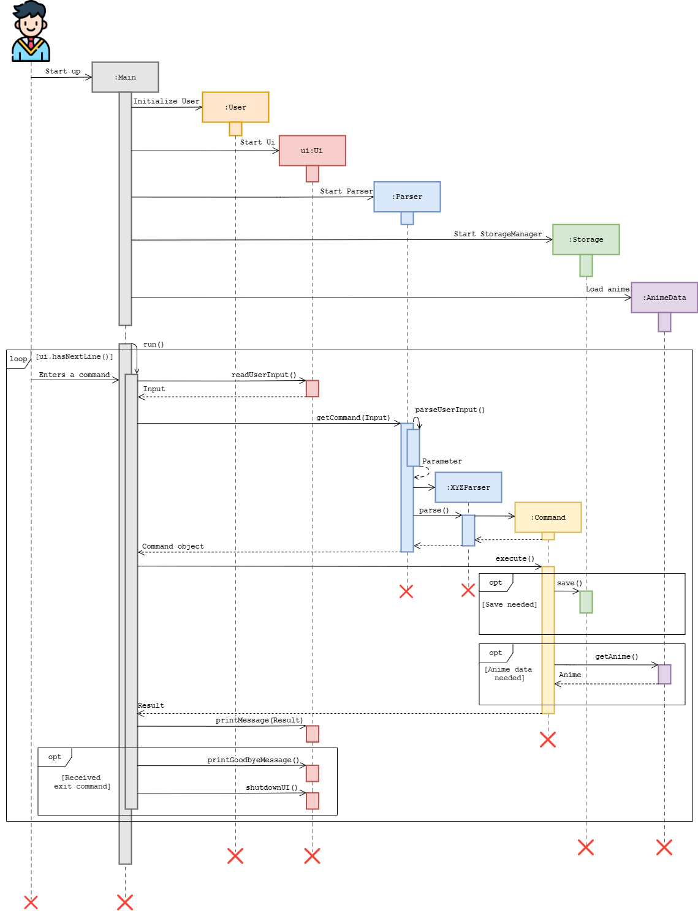

# Developer Guide

## Table of Content
1. [Setting up](#1-setting-up-and-getting-started)
2. [Design](#2-design)
<br/>&nbsp;2.1 [Architecture](#21-architecture)
<br/>&nbsp;2.2 [UI component](#22-ui)
<br/>&nbsp;2.3 [Parser component](#23-parser)
<br/>&nbsp;2.4 [Command component]()
<br/>&nbsp;2.5 [User component]()
<br/>&nbsp;2.6 [AnimeData component]()
<br/>&nbsp;2.7 [StorageManager component](#27-storagemanager)
3. [Implementation](#3-implementation)
<br/>&nbsp;3.1 [Workspace Feature](#31-workspace-feature)
<br/>&nbsp;3.2 [Estimation Feature](#32-estimation-feature)
<br/>&nbsp;3.3 [Bookmark Feature](#33-bookmark-feature)
<br/>&nbsp;3.4 [Browse Feature](#34-browse-feature)
4. [Produce scope](#4-product-scope)
<br/>&nbsp;4.1 [Target user profile]()
<br/>&nbsp;4.2 [Value proposition]()
5. [User stories](#5-user-stories)
6. [Non-functional requirements](#6-non-functional-requirements)
7. [Documentation, logging, testing, configuration, dev-ops](#7-documentation-logging-testing-configuration-dev-ops)
8. [Glossary](#8-glossary)
9. [Appendices](#9-appendices)
<br/>&nbsp;9.1 [Instructions for manual testing]()


## 1. Setting up and getting started
Please take a look [here](SettingUp.md) for more information on setting up and getting started.

## 2. Design 

### 2.1 Architecture


The `Main` class contains the `main` and `run` method.
It is responsible for initializing the various components and loading of any saved data into AniChan.
* At launch: Initializes the various components in the correct sequence, 
connects them together, and loads any saved data into AniChan.
* At shut down: AniChan invokes any clean up methods where necessary.

The rest of AniChan consists of 6 components:
- `UI`: Manages the user interface of AniChan
- `Parser`: Parses the user input 
- `Command`: Performs the execution of commands
- `User`: Manages workspace and the user data
- `AnimeData`: Provides data from the anime data file.
- `StorageManager`: Reads data from, and writes data to, the hard disk.

**LifeCycle of AniChan**

Here is an overall Sequence Diagram to help illustrate the general program flow and how the different objects 
interact with each other

<br/>




### 2.2 UI
API: `Ui.java`
The UI consists of a `UI` class that will handle all user inputs and system output. This includes the result of each Command execution. 

The `UI` component

Handles user commands by calling on Parser component
Listens for the execution of commands to print the result of the Command
Listens for any exceptions thrown to show an error message to the user, instead of a program termination

### 2.3 Parser


API: `Parser.java`

- Parser.java will parse the user command first to obtain the command type.
- With the command type known, it will call the respective `XYZParser`.
- `XYZParser` will parse the parameters and create the Command object.


Given below is the Sequence Diagram for interactions within the `Parser` component for the execution of `browse -p 1` API call

### 2.4 Command


### 2.5 User


API: `User.java`  

The User inherits from the abstract `Human` class and stores the name and gender of the user. It represents the user's interaction with `Workspace`. 

The `User`component:  
* Can provide user information like `name`, `gender`, and `honorific name`
* Stores an array list of type `Workspace`
* Can add, set, and switch between workspaces 


#### 2.5.1 Workspace

API: `Workspace.java`  

The `Workspace` component:  
* Can allow `User` to create and get `Bookmark` 
* Can allow `User` to create and get `Watchlist` array list which user owns
* Can allow `User` to change his active `Watchlist`


### 2.7 StorageManager


API: `StorageManager.java`

The `StorageManager `component: 
* can **save** user, watchlist and bookmark data in `.txt` format and **read it back** using 
their respective storage class, `UserStorage`, `WatchlistStorage`, and `BookmarkStorage`.
* can **read** script files that are in `.txt` format using the `ScriptStorage` class. 

**AniChan** saved these data as `.txt` files so advanced users will be able to 
view and manipulate these saved data easily with any available text editor.


## 3. Implementation
This section describes some details on how some features were implemented.
### 3.1 Workspace Feature

### 3.2 Estimation Feature

### 3.3 Bookmark Feature

### 3.4 Browse Feature
The `BrowseCommand` is executed by `BrowseCommandParser`. It will fetch `Anime` objects matching the parameters specified 
that are stored in `AnimeData`. It extends the `Command` class and implements the following operations:
- `sortBrowseList`
- `buildBrowseOutput`

These are the two fundamental operations that will carry out the execution of the browse command.
`BrowseCommand` will be constructed with default values. 
This ensures that even when there is  no input provided, it can still perform a default browse and return useful information.

Before we go any further, here is a helpful table of the `BrowseCommand` parameters for reference.

| Parameter | Option | Function |
| --- | --- | --- |
| order                    | 0                                                  | Ascending       |
| order			           | 1				                                    | Descending      |
| sortType		           | 0                                                  | No Sort         |
| sortType		           | 1                                                  | by name         |
| sortType		           | 2                                                  | by rating       |
| sortType		           | 3                                                  | back to original|
| page			           | \>= 1                                              | page number     |

Note: The magic constants have already been refactored out into constant variables in the code.

Let us now look at an example of how the default `browse` command would be carried out using an example page size of `3` 
(it is set to `20` in actual execution) on a small sample list of `AnimeData`.

`BrowseCommand` will utilise the `buildBrowseOutput` operation to return all anime series in the page window, as shown 
in the diagram above.

In this example, it fetches the following `Anime` objects.
```
Charlie
Echo
Gamma
```
Once the `Anime` object is obtained it will access its methods to get relevant information about the anime series
to construct a printable result for browsing.

Moving on, if we were to run `browse -p 2` which is to browse the 2nd page of the list. 
It would shift the page window down by 1 page as depicted in the diagram below.


It will then carry out the remaining operation as per normal.

Currently, this result is not very exciting as it is just based on the Anime ID 
which is assigned randomly by our data source, AniList.

Now, let us try browsing the 2nd page of a **sorted** list. We can do this by setting browse to 
sort alphabetically and in ascending order (A-Z). 

Or in command form: `browse -n name -o asc -p 2`.


`BrowseCommand` will now firstly sort the AnimeData list through the `sortBrowseList` operation.

As you can see, even though the page window is at the same position as the previous command, 
the list is different as it has been sorted.

From this point onwards, the operation will continue as per normal, but will perform another `sortBrowseList` operation
to revert the list back to its original form.

This will be done through: `sortBrowseList(3)` method call.

Here is the sequence diagram to better illustrate the lifecycle of a browse command.


## 4. Product scope
### Target user profile


### Value proposition

{Describe the value proposition: what problem does it solve?}

## 5. User Stories

| Version |  As a ... | I want to ... | So that I can … |
| -------- | ---------- | --------------- |------------------ |
| v1.0 | user | manage my own watchlist to keep track of animes | be aware of the animes that I have watched or intending to watch |
| v1.0 | user | store my own anime watching information | I do not have to remember these details and could see them whenever I open the application |
| v2.0 | translator | estimate the amount of time needed to translate a script | give my clients a good estimate of how much time I need |

## 6. Non-Functional Requirements

{Give non-functional requirements}

## 7. Documentation, logging, testing, configuration, dev-ops

### 7.2 Logging
* We are using  `java.util.logging`  package for logging.
* The  `AniLogger`  class is used to manage the logging levels and logging destinations.
* The  `Logger`  for a class can be obtained using  `AniLogger.getAniLogger(Class)`  which will log messages according to the specified logging level.
* Log messages are output through the console and to a file  `/data/AniChan.log` which will be automatically created.
* When choosing a level for a log message, follow the conventions given in  [_[se-edu/guides] Java: Logging conventions_](https://se-education.org/guides/conventions/java/logging.html).


## 8. Glossary

* *glossary item* - Definition

## 9. Appendices

### Instructions for manual testing

{Give instructions on how to do a manual product testing e.g., how to load sample data to be used for testing}
