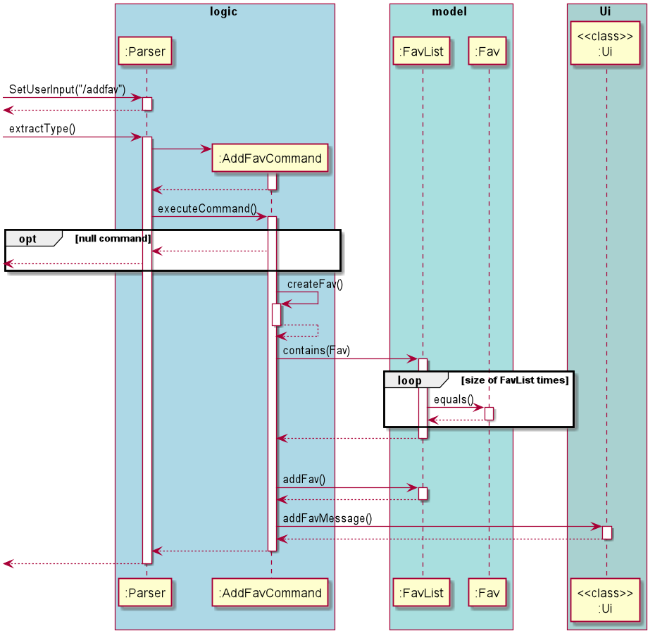
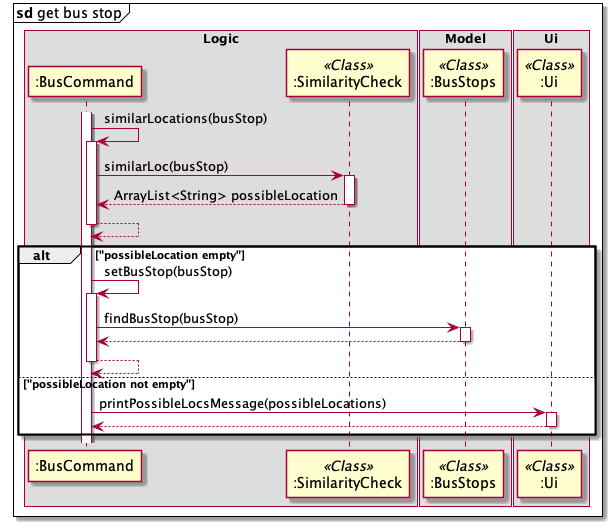

This developer guide aims to provide an overview of Nav@NUS to aid developers in creating extensions or making 
enhancements.

## Table of Contents

* Table of Contents
{:toc}

## 1. Setting up, getting started

Refer to the guide [Setting up and getting started](https://github.com/AY2021S1-CS2113T-F14-3/tp/blob/master/README.md#duke-project-template).

<!-- @@author wamikamalik -->
## 2. Design - Wamika

This section describes the design and implementation of the product. It has been divided into two sections: Architecture 
and Implementation. 

### 2.1. Architecture

The architecture diagram given in the figure below explains the high-level design of the App. 

Given below is a quick overview of each component.

`Main` is the class Duke.java. It is responsible for:

- Initializing the components in the correct sequence, and calling or creating objects in the order of execution.

The rest of the App consists of 4 main components:

- `Ui` : The Ui component handles all interactions with the user.
- `Logic` : The Logic component makes sense of the command and executes it.
- `Model` : The Model component is responsible for all data held in the memory.
- `Storage` : The Storage component handles data by reading from and writing to files in the hard disk. 

The sections below give more details of each component.

#### 2.1.1 Ui Component
The Ui component is responsible for getting the user input and for displaying appropriate messages as response 
to commands executed by the logic component. The following class diagram gives a brief overview of the Ui component 
and it's interaction with other components.

#### 2.1.2. Logic Component
The Logic component is responsible for the following tasks:
- Makes sense of the command entered by the user by splitting it into the command type and the parameters and/or 
delimiters if any.
- Executes a command based on its type and provides an appropriate result to the user via the Ui component.

The following class diagram briefly explains how different classes in the Logic component interact with each other.

> Note: ABCFavCommand represents the different fav command classes.
> PQRCommand represents the different dine command classes.
> XYZCommand represents the different route command classes.
> The actual class names are written in the notes beside the classes.

#### 2.1.3. Model Component
The Model component is responsible for the following tasks:
- Stores the bus data, dine info data and favourites list in memory.
- Performs operations on the data to facilitate the command execution by Logic component.

The following class diagram briefly explains how different classes in the Model component interact with each other.

#### 2.1.4. Storage Component
The Storage component is responsible for the following tasks:
- Stores the favourite commands in a file in a certain format and retrieves this information everytime 
the user enters the application.
- Stores the number of times each bus stop has been typed by the user since he/she started using the application and 
retrieves it everytime the user enters the application.
    + This information is used to find out the user's most frequently searched location so far and display it to the 
    user. 
- These files are updated after every execution of a user command.

The following class diagram briefly explains how different classes in the Storage component interact with each other.

## 3. Implementation
This section provides details of how the main features of Nav@NUS have been implemented.

### 3.1. Finding a direct route (`/route` Feature) - Wamika
`/route <location1> /to <location2>` is the command that has to entered by the user to see all direct bus routes 
available from **location1** to **location2**.

The class diagram in the figure below shows how different classes used for implementation of the `/route` command 
are linked to each other.  

The `RouteCommand#executeCommand()` method of RouteCommand Class executes the command in the following steps:
1. Calls `RouteParser#getLocations()` to get the locations entered by the user in the order of starting location and 
destination.
    - The `RouteParser#getLocations()` method throws an exception if the locations or the delimiter `/to` is missing.
2. Calls `RouteCommand#checkLocations()` to make sure location strings are not empty or the same.
    - The `RouteCommand#checkLocation()` method throws an exception if locations are empty or the same.
3. Calls `RouteCommand#similarityCheck()` to check if the locations are not in the list of bus stops but 
are similar.
    - The `RouteCommand#similarityCheck()` method calls the static `SimilarityCheck#similarLoc()` method and returns 
    a list of similar locations, if any.
    - If the list of similar locations is empty, `RouteCommand#executeCommand()` performs step 4 given below, 
    else it calls the static method, `Ui#printPossibleLocsMessage()`, to print the list of similar locations. 
4. Calls static `BusData#possibleBuses()` to get a list of buses with their routes from the starting location to 
the destination.
   - `BusData#possibleBuses()` calls `Bus#getPossibleRoute()` to check for a possible route for the given bus number.
   - `BusData#possibleBuses()` repeats this call for all bus numbers.

The following sequence diagram explains the above steps when the user enters `/route loc1 /to loc2`.

The following sequence diagrams explain the interactions omitted in the main diagram.

#### Design Considerations
The main aim here is to find if the starting location and destination exist in a particular list of bus stops in 
that order.

##### Aspect: How bus data should be stored and retrieved.
* **Alternative 1 (current choice):** Each bus is an object that contains the bus number and full route as an ArrayList.
    + Pros: Makes it easier to integrate with other functions of the app such as displaying bus route of a particular 
    bus.  
    + Cons: Each bus number's route has to be scanned to check for the starting location and destination in that order.
     
* **Alternative 2:** Each location is an object that contains the location name and an ArrayList of bus objects. Each
bus object contains the list of remaining stops in the route of that bus.
    + Pros: It is easier and somewhat faster to find the buses that go from the starting location to the destination as 
    the data itself has filtered out the buses that stop at the starting location.
    + Cons: A lot of duplicate data is stored since each bus stop will have a list of the remaining route for every bus 
    that stops there. 
    
Given the above alternatives, alternative 1 was used considering the implementation of other features of the 
application.
<!-- @@author -->

<!-- @@author Johnson-Yee -->
### 3.2. Full Route Display (`/routemap` Feature) - Johnson

The `/routemap <bus code>` is the command that has to entered by the user to see the full bus route of a user-specified
bus route.

The class diagram in the figure below shows how different classes used for implementation of the `/routemap` command 
are linked to each other.

The `RouteMapCommand#executeCommand()` method of RouteMapCommand Class executes the command in the following steps:
1. Calls `RouteMapCommand#selectAndPrintBusRoute()`to attempt to retrieve user-specified bus code. (Bus code is stored
as a string variable in the command)
2. Calls `RouteMapCommand#checkBusCode()` to make sure bus code entered by the user is not empty or a white-space.
3. Calls static `BusData#selectBus()` to find the user-specified bus in the bus data list. If found, the Bus object will be 
returned. Else, null is returned.
4. Calls `Ui#printFullRoute()` to display full route of the specified bus.

The following sequence diagram explains the above steps when the user enters `/routemap busCode`.

The following sequence diagrams explain the interactions for bus route retrieval.

#### Design Considerations
##### Aspect: Retrieval of bus routes
* **Alternative 1 (current choice):** Each bus is an object that contains the bus number and full route as an ArrayList
of busStops objects.
    + Pros: It is easy to maintain and updating of bus stops and bus codes are easier to implement.
    + Cons: Has to loop through the array of bus stops and obtain their individual bus description.
     
* **Alternative 2:** The full route of each bus is stored in a string format and is directly accessed.
    + Pros: It is easier and quicker to print out the full route of a user-specified bus.
    + Cons: Alot of manual work is needed if the bus route/ bus stop is updated. It is not scalable for large-scale 
    projects.
    
Given the above alternatives, alternative 1 was used considering the scalability of the application.
<!-- @@author -->

<!-- @@author Lezn0 -->
### 3.3. List All stops (/liststops Feature) - Yuxin
`/liststops` is the command which prints all bus stops declared in the BusStops enum.

The `ListStopsCommand#executeCommand()` method of ListStopsCommand Class executes the command in the following steps:
1. Calls `BusStops#listStops()` to print out all stops.
    - The `BusStops#listStops()` method iterate through all bus stops declared in the BusStops enum class.
    - Close names for bus stops will also be printed if it has one.
    
The following sequence diagram illustrates the steps taken by the program when the user calls the `/liststops` command.  

#### Design Considerations
##### Aspect: Close names of bus stops

* **Alternative 1 (current choice):** Close names are only mentioned but not implemented for users to use in other functions.
    + Pros: It is easy to implement and there will be no bugs since it only uses the print function.
    + Cons: Inconvenient for users as they have to re-enter the command using the full name of the bus stop.
     
* **Alternative 2:** Able to use close names in other functions.
    + Pros: It is quicker and more convenient for the user as they can run commands using close names they prefer.
    + Cons: It is very time-consuming to implement and can lead to many bugs.
    
Given the above alternatives, alternative 1 was used considering the integration of other commands.

### 3.4. Favourite command adder (`/addfav` Feature) - Yuxin

`/addfav <description>` is the command that has to be entered by the user to add a previous valid command in to the user's 
list of favourites.

The `AddFavCommand#executeCommand()` method of AddFavCommand Class executes the command in the following steps:
1. The `AddFavCommand#executeCommand` method throws an exception if the command to be saved in FavList is missing.
2. Calls `AddFavCommand#createFav()` to make a new Fav object to be saved in the FavList.
    - The `AddFavCommand#createFav()` method creates a Fav object with its command saved as its description if 
    the user left description empty.
3. Calls `AddFavCommand#addToFavList()` method to add the Fav object created to the Favlist.
    - The `AddFavCommand#createFav()` method calls the contains method within Favlist to check for any duplicate
    Fav objects within the list that contains the same command.
    - If the there are no duplicate Fav objects, Fav object created will be added to the FavList.

The following sequence diagram illustrates the steps taken by the program when the user calls the `/addfav` command.  

<!-- @@author -->

<!-- @@author EthanWong22 -->
### 3.5. Favourite command executor (`/execfav` Feature) - Wong Heng Chin
`/execfav <index>` is the command to execute a command with the specific index in the list of favourite commands.  

The command is executed in the following steps:
1. The user calls `Parser#setUserInput(<UserInput>)` by entering the command `/execfav <index>`. The new user input is updated.
2. `Parser#extractType()` is called to instantiate `ExecFavCommand` and run the user command.
3. `ExecFavParser` is instantiated and `ExecFavParser#setIndex()` is called to parse the `<index>` input from the user.
    - `ExecFavParser#setIndex()` method throws an exception if `<index>` cannot be parsed into an integer or if it is blank.
4. `ExecFavCommand#executeCommand()` is called.
5. `ExecFavCommand#getFav()` is self invoked to obtain the required `Fav` object from `FavList`.
    - An exception is thrown if there is no `Fav` object in the specified index in `FavList`.
6. A new `Parser` object is instantiated to run the command in the `Fav` object.
    - If the command from the Fav object throws an exception when running, the exception will be caught in `ExecFavCommand#executeCommand()` and the `Fav` object will be deleted from the `FavList`.

The following sequence diagram illustrates the steps taken by the program when the user calls the `/execfav` command.

<!-- @@author -->
#### Design Considerations
##### Aspect: Choice of command object in FavList to execute
* **Alternative 1 (current choice):** Choosing command by index in list.
    + **Implementation:** Easy to implement as `Fav` object can be extracted directly through index in `FavList`
    + **Bugs handling:** Bugs for the first approach are easier to handle and limited. As all `Fav` objects in `FavList` have a unique index, the only bug to check for is whether the `<index>` keyed in by the user can be converted into an integer and whether the index is larger than the size of `FavList`.
    + **User experience:** Command to execute fav object will be shorter.
* **Alternative 2:** Choosing command by description in list.
    + **Implementation:** Implementation is more difficult as the description of all the `Fav` objects in the `FavList` will have to be scanned through and compared with the required description. This may adversely affect processing time as well.
    + **Bugs handling:** Handling of bugs is more difficult as the description of `Fav` objects in the `FavList` are not unique. This causes extra complications to allow users to be able to choose which command to execute amongst those with duplicate descriptions instead of executing the wrong command.
    + **User experience:** Command to execute fav object will be longer.
    
Therefore, choosing commands based on index (alternative 1) is easier to implement, more efficient, reduces possible bugs encountered and provides better user experience.

<!-- @@author wamikamalik -->
### 3.6. Modifying the description of a favourite command (`/descfav` Feature) - Wamika
`/descfav <index> /to <newDescription>` command allows the user to change the current description of their favourite command
at location **index** in the list to **newDescription**.

>Note: **index** is the index of the item in the list when the first number is indexed as 1. As a result, 
>we access this element in the ArrayList using **index** - 1.

The class diagram in the figure below shows how different classes used for implementation of the `/descfav` command 
are linked to each other. 

The `DescFavCommand#executeCommand()` method of DescFavCommand Class executes the command in the following steps:
1. Calls `DescFavParser#parseInput()` to check if the command message input by the user is valid.
    - Throws an exception if 
        + the input is empty.
        + the delimiter `/to` is missing.
    - Calls `Parser#splitCommands()` to separate the **index** and **description**.
    - Checks the validity of each parameter and throws an exception if 
        + both or either of the parameters have only spaces.
        + the given index is not a number.
    - If both inputs are valid, it assigns the input values to index and description variables.
2. Calls `DescFavParser#getIndex()` and `DescFavParser#getDescription()` to get the appropriate values input by the user.
3. Calls static `FavList#changeDesc()` to change the description of favourite at **index**.
    - Calls static `FavList#checkIndexAndDesc()` which throws an exception if **index** is out of bounds or if 
    **description** is the same as the previous description of this favourite.
    - Calls `Fav#changeDesc()` to update the old description to **description**.
    
The following sequence diagram explains the above steps when the user enters `/descfav 1 /to hello`.

The following sequence diagram explains the interactions omitted in the main diagram.

#### Design Considerations
The main aim here is to change the description of a particular command in the list of favourites.

##### Aspect: How index and description are verified.
* **Alternative 1 (current choice):** Perform checks on the validity of index and description at intermediate steps
    + Pros: The checks specific to `FavList` and `Fav` will be performed in those classes and all these methods 
    will be called in the main `DescFavCommand#executeCommand()` thus reducing coupling.
    + Cons: It requires more methods to be written for any particular class.
    
* **Alternative 2:** Use the `DescFavParser` class to determine if the index is within bounds of the list and 
the description is different from what is already stored.
    + Pros: It is quicker to determine that the command is invalid.
    + Cons: Requires calling functions from `FavList` and `Fav` in the parser which would increase coupling.
    
While alternative 2 would place all checks in one place, it can be tedious to test or debug. Therefore, alternative 1 
was chosen. It also made the code look neater and more readable. 
<!-- @@author -->
    
<!-- @@author mrwsy1 -->
### 3.7. Dining options finder (/dine Feature) - Shuyi

`/dine <faculty>` is the command that has to be entered by the user to see all the dining options available in the 
specified faculty.

The `DineCommand#executeCommand()` method of DineCommand Class executes the command in the following steps:
1. Checks the user input and throws an exception if the input is empty.
2. Calls `DineCommand#checkFaculty()` method to check for a match between the data and user input.
    + Sets the `isFound` parameter to **true** if there is any match.
        + Calls `Ui#printDineResult()` method to print the matching results.
    + Sets the `isFound` parameter to **false** if there is no match.
        + Throws an exception if `isFound` is false.

The following sequence diagram illustrates the steps taken by the program when the user calls the `/dine` command. 

### 3.8 Find specific dining outlets (/dineinfo Feature) - Shuyi

`/dineinfo <outlet>` is the command that has to be entered by the user to see information of a specified dining outlet.

The `DineInfoCommand#executeCommand()` method of DineInfoCommand Class executes the command in the following steps:
1. Checks the user input and throws an exception if the input is empty.
2. Calls `DineInfoCommand#checkFoodPlace()` method to check for a match between the data and user input.
    + Adds any matching data to an ArrayList `searchList`.
    + Throws an exception if `searchList` is empty.
    + Calls `Ui#printDineInfoResult()` method to print the data in `searchList` if it is not empty.

The following sequence diagram illustrates the steps taken by the program when the user calls the `/dineinfo` command.  

<!-- @@author -->

<!-- @@author EthanWong22 -->
### 3.9. Bus at bus stop finder (`/bus` Feature) - Wong Heng Chin

`/bus <bus stop>` is the command to execute to see buses which stop at a specific bus stop. 

The command is executed in the following steps:
1. The user calls `Parser#setUserInput(<UserInput>)` by entering the command `/bus <bus stop>`. The new user input is updated.
2. `Parser#extractType()` is called to instantiate `BusCommand` and run the user command.
3. `BusCommand#similarLocations()` is self invoked and calls `SimilarityCheck#similarLoc()` which returns an arraylist of possible location.
4. `BusCommand#setBusStop()` is self invoked in which, if `SimilarityCheck#similarLoc()` returns an empty array list, `BusStops#findBusStop()` is called.
    - If `SimilarityCheck#similarLoc()` returns non-empty array list, `Ui#printPossibleLocsMessage()` is called and an exception is thrown.
    - If `BusStops#findBusStop()` returns null, an exception is thrown.
5. `BusCommand#executeCommand()` is called.
6. `BusData#getBusAtStop()` is called and returns an array list of buses.
7. `BusData#printBusAtBusStop()` is called to print array list of buses.

The following sequence diagram illustrates the steps taken by the program when the user calls the `/bus` command.

The following sequence diagram explains the interactions omitted in the main diagram.

<!-- @@author -->

<!-- @@author wamikamalik -->
### 3.10. Performing similarity checks -Wamika
This feature provides the user with suggestions for possible spelling errors, if any. It does not require any explicit 
instruction or command from the user and runs every time the user enters a `/route` or `/bus` command. 
The following steps explain how the similarity checks are performed.
* Once the location(s) entered by the user are retrieved, the `SimilarityCheck#similarLoc()` method is called for each 
location.
* `SimilarityCheck#similarLoc()` retrieves the list of bus stops and for each bus stop name, calls the 
`SimilarityCheck#getSimilarity()` method.
    + `SimilarityCheck#getSimilarity()` finds the location name with longer length and calculates Levenshtein distance
    between the two names using `SimilarityCheck#editDistance()`.
    + This distance is then divided by the longer distance to get a number between 0 and 1.
    + This number is subtracted from 1 to get the ratio of similarity.
* `SimilarityCheck#similarLoc()` adds the bus stop name to the list of possible locations if this similarity is greater 
than a certain threshold (taken as 0.60).

Refer to [`/route` feature implementation](#31-finding-a-direct-route-route-feature) and 
[`/bus` feature implementation](#39-bus-at-bus-stop-finder-bus-feature) for examples of where this feature is used.

_Credits: The Levenshtein distance algorithm was adapted from 
[this site.](http://rosettacode.org/wiki/Levenshtein_distance#Java)_
<!-- @@author -->

<!-- @@author Johnson-Yee -->
### 3.11 Displaying most searched bus stop on start-up - Johnson
This feature informs the user about their most searched bus stop.
There is no function to explicitly call it and is executed only during Nav@NUS's start up.

The following steps explain how the search frequencies of each bus are updated.
1. Whenever the user enters a valid command (`/route` or `/bus`) that requires bus stops, `BusStops#findBusStop()` is 
called to locate the specified bus stop.
2. `BusStops#incrementSearchCount()` is called to increase the search count of the bus stop.

The following steps explain how the most searched bus stop is displayed.

1.On start-up, `Ui#printWelcomeMessage()` is called.  
2.`Ui#printMostSearchedBusStop()` is called to retrieve the most searched bus stop and display it.
3.`BusData#mostSearchedBusStop()`is called to identify the first instance of the bus stop with the highest search frequency.

The following sequence diagram illustrates the steps taken by the program on start-up.

#### Design Considerations

##### Aspect: Implementing search frequencies
* **Alternative 1 (current choice):** Each value in the BusStops enumeration has a private integer
variable called searchCount.
    + Pros: It is easier to maintain and updating of bus stops are easier to implement. It provides a template to be
    used for locations with many bus stops.
    + Cons: Has to loop through the array of bus stops and obtain their respective search counts.
     
* **Alternative 2:** The search frequency of each bus stop is stored in an array of tuple and is directly accessed.
    + Pros: It is easier and quicker to obtain the most searched bus stop.
    + Cons: It does not blend in well with other features that accesses the BusStops class.
    
Given the above alternatives, alternative 1 was used considering the integration of other commands.

### 3.11.1 Resetting search frequencies of bus stops (`/reset` Feature)
This feature allows the user to reset the search frequencies of all bus stops.

The `ResetSearchFreqCommand#executeCommand()` method of ResetSearchFreqCommand Class executes the command in the following steps:
1.`BusStops#resetSearchFrequency()` is called to re-initialise all search counts of respective bus stops to zero.
2. `Ui#printResetSearchFreqMessage()` is called to inform the user that all search counts have been reset.

The following sequence diagram illustrates the steps taken by the program when the user calls the `/reset` command.

### 3.12 Removing specific delete command (`/deletefav` Feature)
`/deletefav <index>` is the command to remove a favourite command in the user's list of favourite commands. It allows the
user to customise the list of favourite commands to the user's liking.

The DeleteFavCommand#executeCommand() method of DeleteFavCommand Class executes the command in the following steps:
1.`Parser#extractType()` is called to instantiate `DeleteFavCommand`. During instantiation, if the user specified
index is empty or blank, an exception would be thrown.
2.`Ui#printDeleteFavMessage(<index>)` is called to inform the user that the favourite command corresponding to the
index has been deleted.
3.`FavList#deleteFav(<index>)` is executed to remove the favourite command from the list of favourite commands.

The following sequence diagram illustrates the steps taken by the program when the user calls the `/deletefav` command.

<!-- @@author -->

## 4. Appendix A: Product Scope 

<!-- @@author Johnson-Yee -->
### 4.1. Target user profile - Johnson

Nav@NUS targets people who are unfamiliar with the shuttle bus service in NUS Kent Ridge Campus 
including students, professors and visitors.
These are people who:
 - needs to be punctual for events such tutorials
 - prefer a desktop CLI app over other types
 - are new to NUS Kent Ridge Campus
  
### 4.2. Value Proposition - Johnson

Nav@NUS seeks to help the intended audience to achieve the following:
 - Efficient checking of bus routes in NUS
 - Fast viewing of dining options available at other locations
 - Personalised application suited to the user's needs
<!-- @@author -->

<!-- @@author wamikamalik -->
## 5. Appendix B: User Stories - Wamika

|Version| As a ... | I want to ... | So that ...|
|--------|----------|---------------|------------------|
|v1.0|freshman/ anyone new to nus|know if there is any direct bus to my target destination|I do not need to change buses|
|v1.0|someone that is unfamiliar with the NUS campus|know the full routes of the buses|I could plan my route to my desired destination|
|v1.0|someone new to NUS|know all the available bus stops in the school|I can check the possible bus stops I can board/alight at to reach my destination|
|v1.0|curious person|know the full routes of all the buses in NUS|I can see where each bus is heading to|
|v1.0|freshman/ anyone new to NUS|know the buses available at specific bus stops|I can better plan my trip around the campus in advance|
|v2.0|frequent user|have a list of favourite commands|I can access my favourite commands quickly|
|v2.0|frequent user|be able to customise my list of favourite commands|I can change the list according to my needs|
|v2.0|frequent user|view my most searched bus stop|it can promptly remind me of the bus stop to key in|
|v2.0|frequent user|be able to change how I describe my favorite commands|I know when and why I usually use that command and so that I can use it accordingly later.|

## 6. Appendix C: Non-Functional Requirements - Wamika

1. Nav@NUS should be able to work on any _mainstream OS_ which has Java 11 or a higher version of Java installed.
2. The user is expected to have a basic idea about the places around NUS.
3. A user comfortable with typing english text should be able to find this application faster and more useful than those
that require mouse clicks.
<!-- @@author -->

## 7. Appendix D: Glossary

* **Mainstream OS** - Windows, Linux, Unix, OS-X

## 8. Appendix E: Instructions for manual testing
This portion contains instructions on how to perform manual testing.

### E.1 Launch and Shutdown
1. Initial launch
    - Download the jar file and copy into an empty folder
    - Launch CLI and navigate to home folder of jar file
    - Run jar file, `java -jar Nav@NUS.jar` 
    Expected: The CLI application will run with the Nav@NUS logo.

2. Shutdown
    - Type `/exit` followed by enter key to exit 
    Expected: The CLI application closes with an exit message. List of favourite commands and search frequency will be saved

<!-- @@author wamikamalik -->
### E.2 Check for direct bus - Wamika
> Note: The user can list all bus stop names using the `/liststops` command if unsure of the starting location or 
>destination.

1. Finding a direct route between 2 places in NUS.
    - Test case: `/route University Town /to PGP` 
    Expected: The buses you can take from **University Town** to **PGP** will be displayed with the intermediate stop 
    names.
    - Test case: `/route EA /to Kent Vale` 
    Expected: A message saying no direct bus routes are available will be displayed.
    - Test case: `/route vivocity /to sentosa` 
    Expected: A message saying that the starting location and destination are not in the bus stops list will be 
    displayed.
    - Test case: `/route ent Vale /to pgp` 
    Expected: A message displaying suggestions for **ent Vale** will be displayed.
    - Test case: `/route  /to pgp` 
    Expected: An appropriate error message will be displayed.
    - Other incorrect route commands to try: `/route   `, `/route pgp Kent Ridge mrt station`, `/route  /to  `, etc 
    Expected: An appropriate error message will be displayed.      
<!-- @@author -->

<!-- @@author Johnson-Yee -->
### E.3 Check for full bus route - Johnson
1. Executing a route map command to view full route of a selected bus
- Prerequisites: List all buses available by executing `/allbus` command

- Test case 1: `/routemap AA1` 
Expected: The full route of bus AA1 will be displayed. 

- Test case 2: `/routemap AA1000` 
    -Other incorrect test cases includes all invalid bus codes not included in the list of all buses as displayed
    by the `/allbus` command
Expected: No bus routes will be displayed as there is no such bus in our database. 

- Test case 3: `/routemap` 
Expected: No bus routes will be displayed. Error details will be shown to remind users to type in
the needed parameter. 
<!-- @@author -->

<!-- @@author EthanWong22 -->
### E.4 Check for buses at a bus stop - Wong Heng Chin
1. Checking for the buses available at a bus stop
    * Prerequisites: Nill
    * Test case: `/bus Museum` 
    Expected: Buses available at museum (AA1) will be shown. 
    * Test case: `/bus univarity town` 
    Expected: Suggestion for correct location will be shown. 
    * Test case: `/bus invalid stop`  
    Expected: Error details will be shown 
    * Other incorrect data to test: `/bus`
    Expected: Similar to previous.
<!-- @@author -->

<!-- @@author mrwsy1 -->
### E.5 Search for dining options within a faculty - Shuyi
1. Searching for dining options within a faculty.
    - Prerequisites: List all faculties by executing `/faculty` command 
    - Test case: `/dine science` 
    Expected: All dining outlets within Science faculty will be displayed. 
    - Test case: `/dine sci` 
    Expected: All dining outlets within Science faculty will be displayed. 
    - Test case: `/dine` 
    Expected: No dining outlets will be displayed. Error details will be shown. 
    - Other incorrect commands to test: `/dine scienceee` (name of faculty has been misspelled) 
    Expected: Similar to previous. 

2. Searching for dining options within faculties with similar names.
    - Prerequisites: List all faculties by executing `/faculty` command 
    - Test case: `/dine school` 
    Expected: All dining outlets within both the School of Business and School of Computing will be displayed. 
    - Test case: `/dine sch` 
    Expected: All dining outlets within both the School of Business and School of Computing will be displayed. 
    - Test case: `/dine` 
    Expected: No dining outlets will be displayed. Error details will be shown. 
    - Other incorrect commands to test: `/dine schooool` (keyword has been misspelled) 
    Expected: Similar to previous. 

### E.6 Search for specific dining outlet - Shuyi
1. Searching for specific dining outlet.
    - Test case: `/dineinfo arise & shine` 
    Expected: Dining outlets with the name Arise & Shine will be displayed. 
    - Test case: `/dineinfo` 
    Expected: No dining outlets will be displayed. Error details will be shown. 
    - Other incorrect commands to test: `/dineinfo arisee & shiine` (name of outlet has been misspelled) 
    Expected: Similar to previous.  
    
2. Searching for dining outlets with similar names.
    - Test case: `/dineinfo cafe` 
    Expected: Dining outlets with names containing 'cafe' will be displayed. 
    - Test case: `/dineinfo` 
    Expected: No dining outlets will be displayed. Error details will be shown. 
    - Other incorrect commands to test: `/dineinfo caffe` (keyword has been misspelled) 
    Expected: Similar to previous.  
<!-- @@author -->
<!-- @@author Lezn0 -->
### E.7 Add a favourite command - Yuxin
1. Adding a command to the list of favourites.
- Prerequisites: Executed a command.
- Test case:  
    Step 1.`/liststops` 
    Step 2.`/addfav` 
    Expected: Message of the command `/liststops` being added to your favourites will be shown.
- Test case:  
    Step 1.`/liststops` 
    Step 2.`/addfav` 
    Step 3.`/liststops` 
    Step 4.`/addfav` 
Expected: Message of the command `/liststops` already exists in your favourites will be shown.
- Test case:  
    Step 1.`/listfav` 
    Step 2.`/addfav` 
    Expected: Message of command not being detected will be shown as `listfav` is not a valid command.
- Other incorrect data to test: `/execfav 1`, `/help 3`, `/bus musseeuum`.
Expected: Similar to previous.
<!-- @@author -->

<!-- @@author Johnson-Yee -->
### E.8 Delete favourite command from favourite list - Johnson
1. Deleting a favourite command from favourite list
- Prerequisites: List all buses available by executing `/listfav` command. There are existing favourite commands in
the favourite list.

- Test case 1: `/deletefav 1` 
    - The range of values accepted is the number of favourite commands there are in the list.
Expected: The favourite command at index 1 will be deleted. 

- Test case 2: `/deletefav 0` 
    -Other incorrect test cases includes all numbers out of range (0 or more than size of favourite list),
     any string or empty input. 
Expected: No command executed.Error details will be shown to remind users to type in the needed parameter. 

- Test case 3: `/deletefav` 
Expected: No command executed.Error details will be shown to remind users to type in the needed parameter. 
<!-- @@author -->

<!-- @@author EthanWong22 -->
### E.9 Execute a favourite command from favourite list - Wong Heng Chin
1. Executing a favourite command in list of favourites.
    - Prerequisites: List all favourite commands by executing `/listfav` command
    - Test case: `/execfav 1` 
    Expected: Command in index 1 of the list of favourites will be executed. 
    - Test case: `/execfav 0` 
    Expected: No command executed. Error details will be shown. List of favourites will not be modified. 
    - Other incorrect data to test: `/execfav`, `/execfav words`, `/execfav x`(where x is larger than list). 
    Expected: Similar to previous.
<!-- @@author -->

<!-- @@author wamikamalik -->
### E.10 Change description of favourite command in favourite list - Wamika
1. Changing the description of a favourite command in the list.
    - Prerequisites: List all favourite commands by executing `/listfav` command. There is at least one favourite in the 
    list.
    - Test case: `/descfav 1 /to I go there often` 
    Expected: The description for the first command will be changed to "I go there often".
    - Test case: `/descfav 0 /to I go there often` 
    Expected: An error message will be displayed. The list of favourites remains unchanged.
    - Test case: `/descfav 1 /to I go there often` after running the first test case. 
    Expected: An error message saying the description is the same as before will be displayed.
    - Test case: `/descfav   /to I go there often`, `/descfav  `, `/descfav 1 I go there`, `/descfav x /to something` 
    (where x is a number bigger than the number of elements in the list), `/descfav 2e /to something`, etc. 
    Expected: The appropriate error message will be displayed.
    
<!-- @@author -->

<!-- @@author EthanWong22-->
### E.11 Saving of favourite list - Wong Heng Chin
1. Data is automatically saved in the `/data/FavList.txt` directory of the jar file's home directory.

2. Loading FavList
    - Prerequisites: `/data/FavList.txt` contains valid commands.
    - The txt file contains a command along with description in each line.
    - Expected: All commands can be seen in FavList using `/listfav` command upon running the jar file

3. Dealing with corrupted data
    - Prerequisite: `FavList.txt` exists
    - Test case: Corrupted data line has no delimiter "`|`" 
        Step 1. add lines with no delimiter, "`|`" to the `FavList.txt` file. 
        Step 2. Run the jar file 
        Expected output: Message detailing corrupted data detailed at start and corrupted data removed from FavList.
<!-- @@author -->
