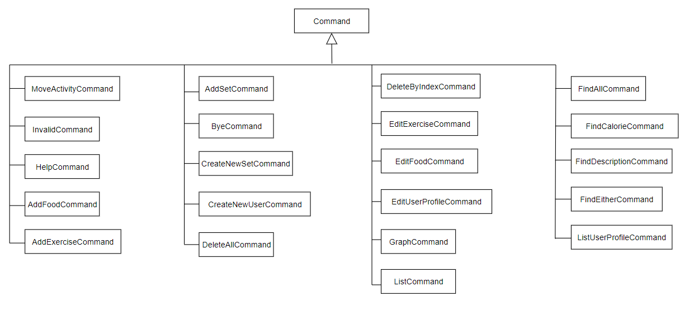

# Developer Guide

## Table of Contents
- [Introduction](#introduction)
- [Setting up, getting started](#setting-up-getting-started)
- [Design](#design)
    * [Architecture](#architecture)
    * [UI Component](#ui-component)
    * [Command Component](#command-component)
    * [Parser Component](#parser-component)
    * [UserData Component](#userdata-component)
    * [Storage component](#storage-component)
- [Implementation](#implementation)
    * [Help](#help-feature)
    * [Add](#add-feature)
    * [List](#list-feature)
    * [Calendar](#calendar-feature)
    * [Repeat](#repeat-feature)
    * [Deadline](#deadline-feature)
    * [Check](#check-feature)
    * [Goal](#goal-feature)
    * [Done](#done-feature)
    * [Undone](#undone-feature)
    * [Delete](#delete-feature)
    * [Note](#note-feature)
    * [View](#view-feature)
    * [Reminder](#reminder-feature)
    * [Extract](#extract-feature)    
    * [Bye](#bye-feature)
- [Appendix: Requirements](#appendix-requirements)
    * [Product scope](#product-scope)   
    * [User Stories](#user-stories) 
    * [Use Cases](#use-cases)
    * [Non-Functional Requirements](#non-functional-requirements)
- [Glossary](#glossary)
- [Instructions for manual testing](#instructions-for-manual-testing)
    * [Launch and Shutdown](#launch-and-shutdown)
    * [Loading and Saving Data](#loading--and-saving-data)
    * [Adding new event](#adding-new-event)
    * [Delete Event](#delete-event)
    * [Repeat Event](#repeat-event)
    * [Changing status of events](#changing-status-of-events)
    * [Help Command](#help-command)
    * [Printing calendar](#printing-calendar)
    * [Checking schedule availability](#checking-schedule-availability)
    * [Adding deadline to event](#adding-deadline-to-event)
    * [Setting reminder](#setting-reminder)
    * [Adding new note for event](#adding-note-for-an-event)
    * [View note](#viewing-note-for-an-event)

<div style="page-break-after: always;"></div>

## Introduction

Scheduler-\-; (S-\-) is a desktop app for managing deadlines from different sources. The user will use a Command Line Interface to control it. It is specially designed for Computing students who are comfortable in using CLI and have Git project deadlines as well as consolidated Zoom session links due which will suit home based learning in this COVID period. 

## Setting up, getting started

1. Ensure you have version 11 of Java. You can install it from this [link](https://docs.aws.amazon.com/corretto/latest/corretto-11-ug/downloads-list.html).
2. Fork the Scheduler-\-; repo from this [link](https://github.com/AY2021S1-CS2113T-T12-4/tp).
3. Clone the fork on to your computer.
4. Open Intellij. If you are not in the welcome screen, click `File` -> 'Close project' 
to close the existing project dialog. 
5. Set up the correct JDK version for Gradle.
    1. Click `Configure` -> `Project Defaults` -> `Project Structure`
    2. Click `New...` and set it to the directory of the JDK.
6. Click `Open or Import` in Intellij.
7. Locate the `build.gradle` file, select it and click `OK`.
8. If asked, choose to `Open as Project`.
9. Click `OK` to accept the default settings.
10. Wait for the importing process to finish.
11. Locate run the 'Duke.java' file, right click and select `Run Duke.main()`.
12. Navigate to the `test\java` folder and right click `seedu.duke` and select `Run Tests in 'seedu.duke'`.
If the setup is successful, you should see this after step 10. All tests should also pass.
````
_________________________________
Welcome to scheduler--;!
What can I do for you?
_________________________________
File Created: Personal
0/0 loaded successfully for Personal
File Created: Zoom
0/0 loaded successfully for Zoom
File Created: Timetable
0/0 loaded successfully for Timetable
File Created: Goal
The file has successfully been loaded!
_________________________________
You have no events today!
_________________________________
````

<div style="page-break-after: always;"></div>

## Design

### Architecture


The ***Architecture Diagram*** given above explains the high-level design of App. Given below is a quick overview of
each component.

`Duke` class contains the main method. It is responsible for,

- At app launch: Initializes the components in the correct sequence, and connects them up with each other.  
- At shut down: Stores the user data from memory into the hard disk.

<div style="page-break-after: always;"></div>

The rest of the App consists of five components.

- `Ui`: The Ui of the App.
- `Parser`: Parses the input to determine which command to execute.
- `Command`: The command executer.
- `UserData`: Holds the data of the App in the memory.
- `Storage`: Reads data from, and writes data to, the hard disk.

#### Ui Component

The 'Ui' component is in charge of handling input from users and system output.

#### Command Component



API: [Command.java](https://github.com/AY2021S1-CS2113T-T12-4/tp/blob/master/src/main/java/seedu/duke/command/Command.java) 
1. `Parser` class to parse the user command 
1.  This results in a `Command` object executed by the `Parser`
1.  The command execution can affect the `UserData`

It listens for commands made in the Duke Class and sends the input to the parser class.
It is also responsible for printing messages from commands and exception messages. 

#### Parser Component


The `Parser` object uses its `parse` method to parse inputs passed to it from `Ui`. This method returns a `Command` object to be executed by `Duke`.

#### UserData Component


The `UserData`
- stores `EventList` objects that store events of different categories (i.e. Personal, Timetable, Zoom).
- stores a `Goal` object that represents the current user goal.
- does not depend on the other components.

#### Storage Component


API [Storage.java](https://github.com/AY2021S1-CS2113T-T12-4/tp/blob/master/src/main/java/seedu/duke/storage/Storage.java) 

The storage component,
- is able to store all event and goal information onto the computer
- is able to load all event and goal information from the computer into the program


How does the storage component load files
- the storage component will read the correct txt file.
- It passes the text to the StorageParser.
- The event strings are converted to actual events using their respective class constructors

The following object diagram shows the state of the storage object upon completion of converting each txt file to their respective events.


- The events are stored within the UserData object to be used by the program

The following object diagram illustrates the state of the storage object upon completion of this step


How does the storage component save files
- The storage component will first retrieve the correct EventList from the UserData.
- It will next send this EventList into the StorageParser
- The StorageParser uses its functions to convert the events into string representations
- The StorageParser then returns these string representations to Storage
- the Storage class then writes them to the correct Path and the corresponding text(.txt) files are modified. 

<div style="page-break-after: always;"></div>

## Implementation

In this section, the features implemented will be explained using various UML diagrams and code snippets.

#### Help feature

The help feature in the program allows the user to extract out help information for a specified command. Information for help is stored in a file titled `helpfile.txt` located in the `resources` folder of the project


#### Add feature

The add feature in the program allows the user to create one of 3 different events in scheduler-\-;.
These 3 are the Personal, Zoom and Timetable events. These events have varying numbers of arguments or fields that can 
be inserted upon creation. 

The following is a class diagram to show the structure of the Add feature:


Generally, Personal events are meant for non school related events and can be any general task the user wants to do. 
Zoom events are meant for events that require zoom links and helps the user to store their zoom links easily. 
Timetable events can contain a location and are meant for school related events like classes.

The personal event can contain the following fields: 
- Description 
- Description and date
- Description, date and time

Examples of user inputs for the respective fields of personal events are:
- add personal; run
- add personal; run; 16/7/2020;
- add personal; run; 16/7/2020; 1600

The zoom event can contain the following fields:
- Description and link
- Description, link, date and time

Examples of user inputs for the respective fields of zoom events are:
- add zoom; meeting; zoom.com.sg
- add zoom; meeting; zoom.com.sg; 17/10/2000; 2100

The Timetable event can contain the following fields:
- Description, date and time
- Description, location, date and time

Examples of user inputs for the respective fields of timetable events are:
- add timetable; math class; 10/10/2000; 4:00 pm
- add timetable; math class; NUS engineering; 10/10/2000; 4:00 pm

The optional fields to fill in like the link and location for the zoom and timetable classes can be inserted respectively in the position right after the description field. 
The fields for what each event can contain were chosen based on what we as a team thought were important fields for the respective event types.
However, these methods can easily be edited to accept different numbers of fields if we change our minds in the future.

Given below is a general explanation of how the add feature works and an example usage scenario:

When a valid format of the add command is called, the constructor to `AddCommand` will be able to detect the event type based on the user's input. It then stores the event type in that instance of the addCommand. <br>
Next, when `AddCommand#execute()` is called from the main, this method will call the respective method to create one of the three events. These methods are `AddCommand#addPersonal()`, `AddCommand#addZoom()`, and `AddCommand#addTimetable()`. <br>
These methods are then used to create events based on the number of fields/parameters entered by the user. Each event has multiple constructors and can contain different combinations of fields which was stated above.

Example usage scenario:
 
Step 1. The user launches the application for the first time. There will be no events stored at the moment.
 
Step 2. The user inputs `add zoom; cs2113t meeting; zoom.sg; 16/09/20; 2100`. The `addCommand` instance is created and detects that the event is of Zoom type.
 
Step 3. `addCommand#execute()` is called. The class knows the current addCommand is of Zoom type so it calls `addCommand#addZoom()`.
 
Step 4. `addCommand#addZoom()` detects there are 4 fields in the command, separated by semicolons, and uses this to create a new Zoom event.
 
Step 5. The Zoom event is then added to the user's `UserData` for further use.
 
The following sequence diagram shows how the add feature works:


<div style="page-break-after: always;"></div>

#### List feature

The list feature allows the user to print a list of events added by type.
The list of events is print according to the order it was added in.

The following is the class diagram for list command:


User calls the list command by executing `list [argument]`.

Executing `list` without specifying any argument prints a list of event types available.  
Specifying an event type as the argument prints a list of events of that type.  
Specifying `all` as the argument prints a list of all events in the order: Personal, Timetable, Zoom.

Given below is an example usage scenario of the list feature.

Step 1. The user executes `list zoom` command to print a list of Zoom events.
The `list` command is passed through a parser to return the ListCommand with arguments initialised.

Step 2. `ListCommand#execute()` is called, retrieving the list of Zoom events in `UserData`.

Step 3. `ListCommand#execute()` calls `Ui#printList()` and passes the list of Zoom events to print.

Step 4. `Ui#printList()` loops through every event in the Zoom event arraylist and prints it.

The following sequence diagram shows how the `list zoom` command is parsed:


<div style="page-break-after: always;"></div>

The following sequence diagram shows how `ListCommand#execute()` works:


<div style="page-break-after: always;"></div>

#### Calendar feature

The calendar feature allows the user to list all events in chronological order.
Only events with a date and time will be included in the calendar.
The calendar is sorted by date using a treemap with each entry being an arraylist of events on the same date.
It is then sorted by time in the arraylist of events.

The following is the class diagram for calendar command:


User calls the list command by executing `calendar`.

Given below is an example usage scenario of the calendar feature.

Step 1. The user executes `calendar` command to list the events in a calendar.
The `calendar` command is passed through a parser to return the CalendarCommand with arguments initialised.

Step 2. `CalendarCommand#execute()` is called, sorting the events with date and time in chronological order in a map.

Step 3. `CalendarCommand#execute()` calls `Ui#printCalendarStart()` to print the number of dates to list and the number
of events that will not be in the calendar.

Step 4. `CalendarCommand#execute()` calls `Ui#printCalendar()` for every date in the map.

Step 5. The user can choose to end the calendar with the input `q` or press **Enter** to list the next date.

Step 6. `CalendarCommand#execute()` calls `Ui#printCalendarEnd()` to print that it is the end of the calendar when the
last date is listed or the user ends it.

The following sequence diagram shows how `CalendarCommand#execute()` works:


<div style="page-break-after: always;"></div>

#### Repeat feature

The repeat feature on the program allows for the user to be able to make certain events repeat several times over a defined time period.
For instance, the user can request for a personal event to be repeated monthly for four months. To run the program, the user will need to key in the command `repeat [event type] [index] [timeUnit] [count]`

|Argument| Description |
|--------|----------|
|event type|What type of event is to be repeated? Accepted arguments are `personal`, `timetable` or `zoom`|
|index|Index number of the event to be repeated that is stored on the Event List|
|timeUnit|For what unit of time each event is to be repeated. Accepted arguments are `daily`, `weekly` and `monthly`|
|count|Integer indicating how many times the event is to be repeated|

For example, to repeat a personal event located at index 2 for 3 days, the user will key in this: `repeat personal 2 daily 3`.

The following sequence diagram shows the overall process of repeating an event:


The steps to repeating the command will be described in the following sections. 

##### Step 1: Obtaining the event information

The repeat command first locates the event that is to be repeated along with its starting date.
Next, it creates an empty ArrayList called `repeatEventList` that will contain all repeated events.


##### Step 2: Incrementing the Original Date

The repeatCommand object will now call upon Event to increment the date by a fixed unit of time. In the following diagram, it shows how the program flow will work should a monthly repeat increment be set. 
The increment date will be assigned the name `repeatDate`


##### Step 3: Set Repeat type

The repeatCommand now will set the original Event to have a repeat type setting. In the diagram's example, it will be set to `monthly`


##### Step 4: Clone the event

The original event is now cloned as shown in the following sequence diagram.


##### Step 5: Add the cloned activity

The cloned activity will now have its date set to be `repeatDate`. This new activity is now added into the `repeatEventList` as shown in the following diagram.


##### Step 6: Repeat steps 2 to 5

Steps 2 to 5 are repeated up till the number specified by `count` as shown in the loop.


##### Step 7: Assign the ArrayList as the RepeatEventList attribute of the original event.

Finally, set the `repeatEventList` using the `setRepeatEventList` command as shown in the following section of the sequence diagram. The results of this process is printed and control returns back to the main program.


<div style="page-break-after: always;"></div>

#### Deadline feature

The deadline feature allows user to add/update the deadline for their personal events.

|Argument| Description |
|--------|----------|
|index|Index number of the event to change deadline that is stored on the `Personal` List|
|date|The new deadline for the event [Optional field]|
|time|The new specified time for deadline [Optional field]|

The deadline feature is implemented using `DeadlineCommand` class. `DeadlineCommand` accesses the Personal `Events` to get the event specified by the user and change the date of the event. It implements the following operations:

- `DeadlineCommand#parseUserCommand(command)` -- Parses the command argument to take out the respective index, date/time given by the user
- `DeadlineCommand#parsingNumber(stringIndex)` -- Check whether if index is a number. If it is not, exception would be thrown. If it is, the index will be parse to Integer and returned.
- `DeadlineCommand#validDateRange(date)` -- Check whether date specified by user is equal or after current date
- `DeadlineCommand#validTimeRange(time)` -- Check whether time specified by user is equal or after current time 

These operations are not exposed, and are used as private methods within the `DeadlineCommand`.

Given below is an example usage scenario and how the deadline feature functions.

Step 1. The user executes `deadline 1; 7/10/20; 11:20 PM` command to set the deadline for the 1st event in Personal event list
to be on the 7th October 2020 at 11:20 PM. 

Step 2. `DeadlineCommand#execute()` is called. The command string is then parsed to `DeadlineCommand#parsingNumber(stringIndex)`.

Step 3. Event is obtained using `EventList#getEventByIndex(index)`

Step 4. `DeadlineCommand#validDateRange(date)` and `DeadlineCommand#validTimeRange(time)` are used to check if the user specified date and time is valid. 

Step 5. After validating the date and time, `Event#setDate(date)` and `Event#setTime(time)` are used to add/update the deadline.

The following sequence diagram shows how the deadline operation works: <br>


Given below is how the deadline command behave: <br>

<p align="center">
  
</p>

<div style="page-break-after: always;"></div>

#### Check feature

The check feature allows the user to check for events happening during a defined time period. The format for the check command is `check [START_DATE]; [START_TIME]; [END_DATE]; [END_TIME]`.

|Argument| Description |
|--------|----------|
|START_DATE|The start date of the defined time period. Accepted formats are: d/M/yyyy, M/yyyy, yyyy, d/M/yy, M/yy, yy. Slashes may also be replaced with dashes. If left blank, the current date is taken by default. Missing fields (e.g. 2020 missing d/M) will be filled in using the current date (i.e if today's date is 15/10/2021, input 2020 will be read as 15/10/2020). |
|START_TIME|The start time of the defined time period. Accepted formats are: hh:mm a, hhmm a, hh a, HH:mm, HHmm, HH. If left blank, current time is taken by default. If only hour is given, the time at the start of the hour is taken. |
|END_DATE|The end date of the defined time period. Accepted formats are: d/M/yyyy, M/yyyy, yyyy, d/M/yy, M/yy, yy. Slashes may also be replaced with dashes. If left blank, the current date is taken by default. Missing fields (e.g. 2020 missing d/M) will be filled in using the current date (i.e if today's date is 15/10/2021, input 2020 will be read as 15/10/2020). |
|END_TIME|The start time of the defined time period. Accepted formats are: hh:mm a, hhmm a, hh a, HH:mm, HHmm, HH. If left blank, current time is taken by default. If only hour is given, the time at the start of the hour is taken. |

The following is the class diagram for CheckCommand:


The check feature is implemented using the `CheckCommand` class. `CheckCommand` accesses the `Event` stored within `EventList` in order to determine if events are occurring within a given time period. It implements the following operations:

- `CheckCommand#getDate(stringDate)` -- Parses a given string to get a LocalDate variable (either the start or end date for the time period).
- `CheckCommand#getTime(stringTime)` -- Parses a given string to get a LocalTime variable (either the start or end time for the time period).
- `CheckCommand#verifyValidTimePeriod(LocalDate, LocalDate, LocalTime, LocalTime)` -- Verifies that the given start of the time period is before the given end of the time period.
- `CheckCommand#checkEventsInTimeRange(eventsList, startDate, endDate, startTime, endTime)` -- Checks each event in the eventsList to see if they occur within the time period defined in the command, and saves all coinciding events in an ArrayList.

These operations are not exposed, and are used as private methods within the `CheckCommand` interface.

Given below is an example usage scenario and how the check feature functions.

Step 1. The user inputs `check 11/5/2020; 5:15 PM; 15/5/2020; 9 PM` in order to check for events occurring between 11th May 2020, 5:15 pm and 15th May 2020, 9:00 pm. This input is received by the Ui, which processes it into a string. The string is parsed by the Parser, which returns a CheckCommand with the date and time parameters stored in it as a string.

Step 2. `CheckCommand#execute()` is called. The command string containing the date and time parameters are split into a String array to separate the different parameters. 

Step 3. Within `CheckCommand#execute()`, `CheckCommand#getDate()` is called to parse the start and end dates, and `CheckCommand#getTime()` is called to parse the start and end times.

This sequence diagram shows how the `getDate` method functions:


`getTime` adds ":00" to the back if only hh or HH is given, then uses `DateTimeParser#timeParser` to parse the time. The parsed time is then returned.

Step 4. Within `CheckCommand#execute()`, the start date, start time, end date and end time are passed to `CheckCommand#verifyValidTimePeriod()`. This method checks that the start date and time of the time period happen before the end date and time, and returns a boolean indicating the validity of the given time period.

Step 5. Within `CheckCommand#execute()`, the start date time and end date time is passed to `CheckCommand#checkEventsInTimeRange()` along with an `EventList` (i.e. Zoom, Personal or Timetable). This method checks each `Event` in the `EventList` to determine if the event occurs within the time period. If the event date time coincides with the time period, the event is added to an ArrayList that stores all the coinciding events in the current `EventList`. This is done for each `EventList`. 

Step 6. The contents of the ArrayLists returned by `CheckCommand#checkEventsInTimeRange()` are combined into a single ArrayList, and a new `EventList` ("coinciding") is created using this combined list of events.

Step 7. `Ui#printList()` is called to print the list of coinciding events.

The following sequence diagram shows how the check operation works:


<div style="page-break-after: always;"></div>

#### Goal feature

The goal feature is achieved by `GoalCommand`. It either prints the current goal stored internally in
`UserData` if there is one, or it sets the input as the new goal by replacing the previous goal.
The user can only have one goal at any time.

The following is the class diagram for goal command:


Given below is an example usage scenario of the goal feature.

Step 1. The user launches the application for the first time. `Ui#printGoal` is called, 
a line informing them they have no goal is printed.

Step 2. The user executes `goal save money` command to set the goal as "save money".
The `goal` command is passed through a parser to return the GoalCommand with arguments initialised.

Step 3. `GoalCommand#execute()` is called, setting the goal in `UserData` to "save money". The change is printed
with `Ui#printChangeGoal()`.

Step 4. The user executes `goal` command to print the current goal.
The `goal` command is passed through a parser to return the GoalCommand with blank arguments.

Step 5.  `GoalCommand#execute()` is called, to retrieve the current goal in `UserData` and print it
with `Ui#printGoal()`.

The following sequence diagram shows how `GoalCommand#execute()` works:


<div style="page-break-after: always;"></div>

#### Done feature

The done feature allows users to mark events in Scheduler-\- as done. The format for the done command is `done EVENT_TYPE; EVENT_INDEX; [EVENT_DATE]`.

|Argument| Description |
|--------|----------|
|EVENT_TYPE|The type of event to be marked done. Accepted arguments are `personal`, `timetable` or `zoom`.|
|EVENT_INDEX|Index number of the event to be marked done that is stored on the Event List.|
|EVENT_DATE|The date on which the repeated event to be marked done should occur. Accepted formats are: d/M/yyyy, d/M/yy, yyyy/M/d, yy/M/d. Slashes may also be replaced by dashes.|

The following is the class diagram for DoneCommand:


The done feature is implemented using the `DoneCommand` class. `DoneCommand` accesses the `Event` stored within `EventList` and marks it as done. It implements the following operations:

- `DoneCommand#parse(input)` -- Parses the processed input from `Parser` to create a `DoneCommand` with the parsed event list type and event identifier.
- `DoneCommand#scanRepeatList(repeatEventList, doneEventDate, ui)` -- Scans the `repeatEventList` of a repeat event and marks the matching event as done.

`DoneCommand#parse(input)` is exposed and is used in Parser to create the `DoneCommand`.
`DoneCommand#scanRepeatList(repeatEventList, doneEventDate, ui)` is not exposed, and is used as a private method within the `DoneCommand` interface.

Given below is an example usage scenario and how the done feature functions.

Step 1. The user inputs `done personal; 4` in order to mark the 4th `Personal` event as done. This input is received by the Ui, which processes it into a string. The string is parsed by the Parser, which removes "done" from the string and parses the resulting string with `DoneCommand#parse()`. This returns a `DoneCommand`.


Step 2. `DoneCommand#execute()` is called. The `command` string is split at semicolons to separate the event index from an event date (if event date is given). The event index for this DoneCommand is 4, and it has no event date.

Step 3. Within `DoneCommand#execute()`, the 4th `Event` is called from the Personal `EventList` and is marked as done.


If the called event is a repeat event and an event date not matching the called event's date is given, `DoneCommand#scanRepeatList()` is called to check for events matching the event date in the repeat event's `repeatEventList`. When a matching event is found, it is marked as done.

Step 4. `Ui#printEventMarkedDoneMessage()` is called to print the event marked as done.

Step 5. `Storage#saveFile()` is called to save the updated event list to the external file.

#### Undone feature

The undone feature allows users to mark events in Scheduler-\- as undone. The format for the undone command is `undone EVENT_TYPE; EVENT_INDEX; [EVENT_DATE]`.

|Argument| Description |
|--------|----------|
|EVENT_TYPE|The type of event to be marked undone. Accepted arguments are `personal`, `timetable` or `zoom`.|
|EVENT_INDEX|Index number of the event to be marked undone that is stored on the Event List.|
|EVENT_DATE|The date on which the repeated event to be marked undone should occur. Accepted formats are: d/M/yyyy, d/M/yy, yyyy/M/d, yy/M/d. Slashes may also be replaced by dashes.|

The following is the class diagram for UndoneCommand:


The undone feature is implemented using the `UndoneCommand` class. `UndoneCommand` accesses the `Event` stored within `EventList` and marks it as undone. It implements the following operations:

- `UndoneCommand#parse(input)` -- Parses the processed input from `Parser` to create an `UndoneCommand` with the parsed event list type and event identifier.
- `UndoneCommand#scanRepeatList(repeatEventList, doneEventDate, ui)` -- Scans the `repeatEventList` of a repeat event and marks the matching event as undone.

`UndoneCommand#parse(input)` is exposed and is used in Parser to create the `UndoneCommand`.
`UndoneCommand#scanRepeatList(repeatEventList, undoneEventDate, ui)` is not exposed, and is used as a private method within the `UndoneCommand` interface.

Given below is an example usage scenario and how the done feature functions.

Step 1. The user inputs `undone personal; 4` in order to mark the 4th `Personal` event as undone. This input is received by the Ui, which processes it into a string. The string is parsed by the Parser, which removes "undone" from the string and parses the resulting string with `UndoneCommand#parse()`. This returns a `UndoneCommand`.


Step 2. `UndoneCommand#execute()` is called. The `command` string is split at semicolons to separate the event index from an event date (if event date is given). The event index for this UndoneCommand is 4, and it has no event date.

Step 3. Within `UndoneCommand#execute()`, the 4th `Event` is called from the Personal `EventList` and is marked as undone. 


If the called event is a repeat event and an event date not matching the called event's date is given, `UndoneCommand#scanRepeatList()` is called to check for events matching the event date in the repeat event's `repeatEventList`. When a matching event is found, it is marked as undone.

Step 4. `Ui#printEventMarkedUndoneMessage()` is called to print the event marked as undone.

Step 5. `Storage#saveFile()` is called to save the updated event list to the external file.

#### Delete feature

The delete feature allows users to delete events from Scheduler-\-. The format for the delete command is `delete EVENT_TYPE; EVENT_INDEX; [EVENT_DATE]`.

|Argument| Description |
|--------|----------|
|EVENT_TYPE|The type of event to be deleted. Accepted arguments are `personal`, `timetable` or `zoom`.|
|EVENT_INDEX|Index number of the event to be deleted that is stored on the Event List.|
|EVENT_DATE|The date on which the repeated event to deleted should occur. Accepted formats are: d/M/yyyy, d/M/yy, yyyy/M/d, yy/M/d. Slashes may also be replaced by dashes.|

The following is the class diagram for DeleteCommand:


The delete feature is implemented using the `DeleteCommand` class. `DeleteCommand` accesses the `Event` stored within `EventList` and removes it from the `EventList` to delete it from Scheduler-\-;. It implements the following operations:

- `DeleteCommand#parse(input)` -- Parses the processed input from `Parser` to create an `DeleteCommand` with the parsed event list type and event identifier.
- `DeleteCommand#scanRepeatList(repeatEventList, deleteEventDate, ui, deleteEvent)` -- Scans the `repeatEventList` of a repeat event and deletes the matching event from the `repeatEventList`.

`DeleteCommand#parse(input)` is exposed and is used in Parser to create the `DeleteCommand`.
`DeleteCommand#scanRepeatList(repeatEventList, undoneEventDate, ui)` is not exposed, and is used as a private method within the `DeleteCommand` interface.

Given below is an example usage scenario and how the done feature functions.

Step 1. The user inputs `delete timetable; 1; 10/10/2020` in order to delete the 1st `Timetable` repeat event that occurs on 10 October 2020. This input is received by the Ui, which processes it into a string. The string is parsed by the Parser, which removes "delete" from the string and parses the resulting string with `DeleteCommand#parse()`. This returns a `DeleteCommand`.


Step 2. `DeleteCommand#execute()` is called. The `command` string is split at semicolons to separate the event index from an event date (if event date is given). The event index for this DeleteCommand is 1, and the event date is 10/10/2020.

Step 3. Within `DeleteCommand#execute()`, the 1st `Event` is called from the Timetable `EventList`. Since the called event is a repeat event and an event date not matching the called event date was provided, `DeleteCommand#scanRepeatList()` is called to check for events matching the date in the repeat list. When a matching event is found, it is deleted. Since there are no more events in the repeatEventList, the repeat status of the called event is set to null.


Step 4. `Ui#printEventDeletedMessage()` is called to print the event that was deleted.

Step 5. `Storage#saveFile()` is called to save the updated event list to the external file.

#### Note feature

The Note feature allow user to add notes to the event.

|Argument| Description |
|--------|----------|
|event type|Type of event. Accepted arguments are `personal`, `timetable` or `zoom` |
|index|Index number of the event to add note that belongs to the specified `event type` List |

The note feature is implemented using `NoteCommand` class. `NoteCommand` accesses the `Events` to get the event specified by the user and add notes to the event. It implements the following operations:

- `NoteCommand#parseUserCommand(command)` -- Parses the command argument to take out the respective index, event type given by the user
- `NoteCommand#parsingNumber(stringIndex)` -- Check whether if index is a number. If it is not, exception would be thrown. If it is, the index will be parse to Integer and returned.
- `NoteCommand#getNotesFromUser(Ui)` -- Calls `Ui#receiveCommand()` to get user's input for notes
- `NoteCommand#updatingNotesWithTimestamp(existingNotes,newNotes)` -- Include a timestamp of the time that user create a note
- `NoteCommand#indicateNewLineUsingDelimeter(notes)` -- ` is used to indicate a new line and form the array list into a string of note

These operations are not exposed, and are used as private methods within the `NoteCommand`.

Given below is an example usage scenario and how the deadline feature functions.

Step 1. The user executes `note personal; 1` command to create the note for the 1st event in Personal event list.

Step 2. `NoteCommand#execute()` is called. The command string is then parsed to `NoteCommand#parseUserCommand(command)`

Step 3. After obtaining the event using `Event#getEventByIndex(index)`,  using the user input we have obtained from `NoteCommand#getNotesFromUser(Ui)` create a note for the event. 

Step 4. Before storing the note, notes have to be tagged with timestamp using `NoteCommand#updatingNotesWithTimestamp(existingNotes,newNotes)` and `NoteCommand#indicateNewLineUsingDelimeter(notes)` reformat notes to use ` as an indicator for new line.

The following sequence diagram shows how the note operation works: <br>


Given below is how the note command behave: <br>

<p align="center">
  
</p>


#### View feature

The view feature allows user to see the notes they have created for a particular event.

|Argument| Description |
|--------|----------|
|event type|Type of event. Accepted arguments are `personal`, `timetable` or `zoom` |
|index|Index number of the event to view note that belongs to the specified `event type` List |

The following is the class diagram for reminder command:

<p align="center">
  
</p>


The view feature is implemented using `ViewCommand` class. `ViewCommand` accesses the `Events` to get the event specified by the user and show the notes created to users. It implements the following operations:

- `ViewCommand#parseUserCommand(command)` -- Parses the command argument to take out the respective index, event type given by the user
- `ViewCommand#parsingNumber(stringIndex)` -- Check whether if index is a number. If it is not, exception would be thrown. If it is, the index will be parse to Integer and returned.

These operations are not exposed, and are used as private methods within the `ViewCommand`.

Given below is an example usage scenario and how the reminder feature functions.

Step 1. The user executes `view` command to show events happening today.

Step 2. `ViewCommand#execute()` is called. 

Step 3. After obtaining the event using `EventList#getEventByIndex(index)`, the user notes can be obtained using `Event#getNotes()`

The following sequence diagram shows how the view operation works: <br>


#### Reminder feature

The reminder feature allows user list to the user the events that are happening today. Events are sorted according to time if applicable. The remind feature would called at every start of the program.

The following is the class diagram for reminder command:

<p align="center">
  
</p>

The reminder feature is implemented using `ReminderCommand` class. `ReminderCommand` accesses `EventList` to get all event and filter out events happening today and sort them according to with/without time. It implements the following operations:

- `ReminderCommand#filterTodayEvents(eventlist)` -- Filter out the events happening today and return an array list of events
- `ReminderCommand#checkingRepeatedEvent(event)` -- Check for events that have been repeated and is happening today

These operations are not exposed, and are used as private methods within the `ReminderCommand`.

Given below is an example usage scenario and how the reminder feature functions.

Step 1. The user executes `reminder` command to show events happening today.

Step 2. `ReminderCommand#execute()` is called. 

Step 3. After obtaining all the event using `UserData#getAllEventLists()`,  `ReminderCommand#filterTodayEvents(eventlist)` will be called to check event if they are happening today and store the events in an ArrayList if they are. 

Step 4. While checking if the events fall on today in `ReminderCommand#filterTodayEvents(eventlist)`, `ReminderCommand#checkingRepeatedEvent(event)` will also check if there are repeated events that fall on the same day.

Step 5. After getting all the events happening today, `ReminderCommand#execute()` would then sort the events into 2 ArrayList, one with time and one without time.

The following sequence diagram shows how the reminder operation works: <br>


#### Extract feature
The extract feature allows users to copy and paste a body of text like emails and it will help users create either
a Zoom or a Personal event. It utilizes Regular Expressions (Regex) patterns in order to match dates, times and zoom links
in the text entered. 

The following is a class diagram to show the structure of the Extract feature:


Given below is an example usage scenario to explain how the extract feature works.

Step 1. To begin, the user enters `extract CS2113T Quiz;`. 
The constructor for `ExtractCommand` will then be called and the `TEXT_SUBJECT` which is `CS2113T Quiz` will be stored in that instance of ExtractCommand.

Step 2. Next, `ExtractCommand#execute()` is called from the main. This method will call `ExtractCommand#receiveTextBody()` which will let the user enter any text and only ends once the user types `extractend` on a new line.
The user may then input a text copied from email, for example `The quiz will be on October 8 2020 or 9th October at 4pm or 5pm. The zoom link is at https://nus-sg.zoom.com`. After going to the next line, the user has to type `extractend`.

Step 3. The text body is then used in multiple methods. These include `ExtractCommand#detectZoomLink()`, `ExtractCommand#detectDate()` and `ExtractCommand#detectTime()` which will use Regex patterns to find and match dates, times and zoom links.

Step 4. `ExtractCommand#detectZoomLink()` will check if the URL found is a valid zoom link. In this case, the link is valid as it contains ".zoom.".

Step 5. `ExtractCommand#verifyDate()` and `ExtractCommand#verifyTime()` will be called which will return dates and times that are valid. In this case, it will verify the 2 dates and 2 timings detected.
 
Step 6. `ExtractCommand#chooseZoomLink()`, `ExtractCommand#chooseDate()` and `ExtractCommand#chooseTime()` will be called and will print out a list of valid zoom links/dates/times and allow the user to input the number of the link/date/time they want to select it. The user can only choose 1 of each detected.

Step 7. `ExtractCommand#createEvent()` will be called. If the event has a zoom link, like the example, a `Zoom` event will be created using the link, date, time and `TEXT_SUBJECT` as its description. Otherwise, a `Personal` event will be created with the date, time and description fields. The event will be added to the user's `UserData`.

The following sequence diagram shows how the Extract feature works in general like I have explained above:


Design considerations:

For the detection of date, the Regex pattern used detects dates in the DD/Month Name/YYYY format or Month name/DD/YYYY format. The current year can also be added automatically if no year was detected.
It can also detect if the day portion of the date has any suffixes. This does not detect dates written in other formats like DD/MM/YYYY or DD/MM/YY because upon
looking at many of the emails sent to us, we found most were of the Regex pattern we chose. However, this could be implemented in the future. 

For the detection of time, the Regex pattern used detects time in the 12 or 24 hour format. It can detect time with AM/PM behind it too. However, it cannot detect 24 hour timings
with no "." or ":" in it unlike some commands above. This is because it may result in detecting a lot of false timings like if a 4 digit number like 2020 for a date was detected as a time and a year which may confuse the user.

For the detection of zoom link, the Regex pattern used first detects any URL starting with https:// or http://. It then checks whether the URL contains ".zoom." which we found the be common in most zoom links.

#### Bye feature

The Bye feature allows user to exit smoothly after saving all the files.

Step 1. The user executes `bye` command to exit Scheduler-\-.

Step 2. `ByeCommand#execute()` is called and `ByeCommand` will set `isExit` to true.

Step 3. Returning to `Duke`, `Duke` will call `Storage#saveAll()` to save all the files.

Step 4. Before exiting, `Ui#printByeMessage()` will be called to print and exit the program smoothly.

The following sequence diagram shows how the Bye feature works:


<div style="page-break-after: always;"></div>
 

<div style="page-break-after: always;"></div>

## Appendix: Requirements

### Product scope

##### Target user profile

<ul>
    <li>has a need to organise events using scheduler</li>
    <li>prefer desktop application</li>
    <li>can type fast</li>
    <li>prefer typing to mouse interactions</li>
    <li>is reasonably comfortable using CLI apps</li>
</ul>

##### Value proposition

Manage one's events quickly compared to GUI scheduling applications. 
Users can check when they are free using a simple command 
and also extract deadlines from any body of text.

<div style="page-break-after: always;"></div>

### User Stories

|Version| As a ... | I want to ... | So that I can ...|
|--------|----------|---------------|------------------|
|v1.0|office worker (working from home)|organise large amount of online Zoom meetings to manage|keep track of his schedule for the day|
|v1.0|university student|consolidate my schedule for both my online zoom lectures and my ordinary timetable|better manage my time|
|v1.0|university student having projects|be informed of the goals of my project|keep track of the project details|
|v1.0|university student|customise repeated task|set events like tutorials to weekly|
|v1.0|teacher|organise all my zoom links for my classes|it can be easily accessible.|
|v1.0|user|see the events that I have created|refer to them when I forget|
|v1.0|user|check when I am available on that day|avoid manually searching through my entire calendar to find out if I have time|
|v2.0|user|be able to keep track the status of completion of the events I created|focus more on the tasks that I need to complete|
|v2.0|user|view which events are upcoming in a convenient readable format|locate the events easily by date|
|v2.0|user|the application to alert me when my deadlines are coming up|be given enough time to work on them and not rush last minute|
|v2.0|user|create deadlines from the email text body|avoid looking through the email to create one by one|
|v2.0|user|create notes for the event|avoid creating new notes in word documents for every event|
|v2.0|user|view notes written for the event|avoid looking through to find notes|
|v2.0|new user (new to text-based application)|detailed directions on commands I can use|easily navigate through the application|
|v2.0|new user (expert in using text-based application)|have some useful shortcut keys|speed up common tasks|

<div style="page-break-after: always;"></div>

### Use Cases
(For all use cases below, the System is Scheduler-\-; and the Actor is the user, unless specified otherwise)

**Use case: Extracting deadlines from an email**

MSS:
1. User enters extract command for a body of text/email
2. Scheduler-\-; shows a list of dates detected
3. User chooses one of the dates
4. Scheduler-\-; shows a list of the time slots detected
5. User chooses one of the time slots
6. Scheduler-\-; creates a personal event based on the user's choices

Use case ends.

Extensions:

2a. There are no dates detected.

Scheduler-\-; creates a Personal event with no date or time.

 3a. User selects an invalid index from the list of dates.
- 3a1. Scheduler-\-; requests for the user to pick a valid number.
- 3a2. User enters new index.

Steps 3a1-3a2 are repeated until the index entered is valid.
Use case resumes from step 4.

 5a. User selects an invalid index from the list of time slots.
- 5a1. Scheduler-\-; requests for the user to pick a valid number.
- 5a2. User enters new index.

Steps 5a1-5a2 are repeated until the index entered is valid.
Use case resumes from step 6.

**Use case: Repeating an event and checking its status**

MSS:

1. User uses list command for one of the three types of events.
2. Scheduler-\-; prints a list for the event type chosen.
3. User enters repeat command for one of the events.
4. Scheduler-\-; prints a confirmation message.
5. User uses repeat command to check status of the repeated event.
6. Scheduler-\-; prints out the status of the repeated event.

Use case ends.

Extensions:

3a. User selects a personal event that does not have a deadline

Scheduler-\-; prints an error message and use case ends.


### Non-Functional Requirements

<ol>
    <li>Work on any mainstream OS that has Java 11 or above installed</li>
    <li>A user who has faster typing speed than average should be able to use this program with ease</li>
</ol>

<div style="page-break-after: always;"></div>

## Glossary

- Mainstream OS: Windows, Linux, Unix, OS-X

## Instructions for manual testing

Below are some instructions provided for use in manual testing

### Launch and Shutdown
1. Initial Launch
    1. Copy the Java Archive file into an empty directory
    1. On windows machines, open up the terminal and navigate to the directory
    1. Type in `java -jar scheduler.jar` and press enter. Expected: You should now see the welcome message printed on the screen
1. Shutdown
    1. In the program, type the word `bye` and press enter
    1. You should now see the goodbye message printed on the screen. Expected: The program should return you back to the main terminal window

### Adding new event
1. Add a personal event
    1. Load the program
    1. Type `add personal; dental appointment`
    1. Type `list personal`. Expected: your new personal event should be displayed on the screen
1. Add a zoom event
    1. Load the program
    1. Type `add zoom; math lesson; www.zoom.com; 20/10/2020; 15:00`
    1. Type `list zoom`. Expected: your new zoom event should be displayed on the screen
1. Add a timetable event
    1. Load the program
    1. Type `add timetable; science class; S17; 23/10/2020; 11:00`
    1. Type `list timetable`. Expected: your new timetable event should be displayed on the screen
    
### Loading  and Saving Data
1. Sample Save Data
    1. Follow the instructions for "Initial Launch"
    1. Type `add personal; dental appointment`
    1. Type `list personal`, your new personal event should be displayed on the screen
    1. Type `save` into the terminal
    1. Type `bye` to exit the program
    1. At your current file directory, find the file `personal.txt` located in the `data` directory of where your program is running. Expected:You should see that the file is no longer empty and should see one line with the words `dental appointment` written. 
1. Sample Load data
    1. Follow the instructions in "Sample Save Data"
    1. Launch the program
    1. Type `list personal`. Expected: your previous personal event should be displayed on the screen

### Delete Event
1. Deleting a personal event
    1. Launch the program
    1. Type `add personal; dental appointment`
    1. Type `list personal`, your new personal event should be displayed on the screen
    1. Test Case: `delete personal; 1` 
        Expected: When you type `list personal`, you should notice that the list is blank
    1. Test Case: `delete personal; 3`
        Expected: An error message should be displayed as none of the events are labelled with event index 3.

### Repeat Event
1. Repeating a personal event
    1. Load the program
    1. Type `add personal; dental appointment; 18/09/2020`
    1. Type `add personal; birthday`
    1. Type `list personal`, your new personal events should be displayed on the screen
    1. Test Case: `repeat personal; 2; monthly; 3`
        Expected: An error message should be displayed indicating that you cannot repeat an event with no deadline
    1. Test Case: `repeat personal; 1; monthly; 3`
        Expected:When you type `repeat personal; 1`, you should see a message indicating to you that the event is repeated monthly for three more times. 

### Changing status of events
1. Changing the status of a personal event
    1. Load the program
    1. Type `add personal; dental appointment; 18/09/2020`
    1. Type `add personal; birthday`
    1. Type `list personal`, your new personal events should be displayed on the screen
    1. Test Case: `done pesonal; 1`
        Expected: When you type `list personal`, you should see that the symbol of the first event has changed from a cross to a tick
    1. Test Case: `undone personal; 1`
        Expected: When you type `list personal`, you should see that the symbol of the first event has changed from a tick to a cross 

### Help Command
1. Getting generic help
    1. Load the program
    1. Type `help` and press enter
    Expected: You should see a summary of all the commands available to the user printed on the screen

### Printing calendar
1. Printing calendar
    1. Launch the program
    1. Type `add personal; dental appointment; 18/09/2020; 1400`
    1. Type `add personal; birthday; 19/10/2020; 1200`
    1. Type `list all` Expected: You should now see the events listed on the terminal
    1. Type `calendar`
    Expected: As you press enter, you should see all your events and timings displayed in chronological order. Once all the events have been printed, the `End of calendar` message should appear.
    Your calendar should appear as shown:
    
    ```
      calendar
      _________________________________
      Calendar has 2 dates to display
      ---------------------------------------------------------------------------------------
      18 Sep 2020
      ---------------------------------------------------------------------------------------
      P | 2:00 PM | X | dental appointment 
      ---------------------------------------------------------------------------------------
      Enter 'q' to exit or enter to continue...
      
      ---------------------------------------------------------------------------------------
      19 Oct 2020
      ---------------------------------------------------------------------------------------
      P | 12:00 PM | X | birthday 
      ---------------------------------------------------------------------------------------
      End of calendar
      _________________________________

   ```

   
   
### Checking schedule availability
1. Check Schedule
    1. Launch the program
    1. Type `add personal; dental appointment; 18/09/2020; 1400`
    1. Type `add personal; birthday; 19/10/2020; 1200`
    1. Type `list all` Expected: You should now see the events listed on the terminal
    1. Test Case: `check 01/01/2010; 1100; 01/01/2010; 2359;`
    Expected: The message `You have no coinciding events!` should be printed. 
    1. Test Case: `check 01/01/2020; 1100; 01/01/2021; 2359;`
    Expected: You should see the check command prints out all events that fall between the timing of 01 Jan 2010 1100hrs to 2359hrs as shown below
    
    ```
   _________________________________
   Here is a list of your coinciding events:
   1. [P][X] dental appointment on 2020-09-18, 14:00
   2. [P][X] birthday on 2020-10-19, 12:00
   _________________________________

   ```

### Adding deadline to event
1. Repeating a personal event
    1. Load the program
    1. Type `add personal; dental appointment; 18/09/2020`
    1. Type `add personal; birthday`
    1. Type `list all` Expected: You should now see the events listed on the terminal
    1. Test Case: `deadline 2; <date>; <time>` where `date` and `time` are any date and time that is past the current date and time this test is being run.
        Expected: A success message should be printed, indicating that the new deadline has been set
        When `list personal` is typed, you should see that the second birthday event now has a deadline attached to it.

### Setting reminder
1. Repeating a personal event
    1. Load the program
    1. Type `add personal; dental appointment; 18/09/2020`
    1. Type `add personal; birthday; <<current date that test is run>>`
    1. Test Case: `reminder`
        Expected: The program should show that the personal birthday event is the event that you have for today. 
        
        ```
       reminder
       _________________________________
       You have the following events today: 
       
       _________Events Without Time_____
       [P][X] birthday on 2020-11-09
       _________________________________

       ```
        

### Adding note for an event
1. Add a new note for an event
    1. Load the program
    1. Type `add personal; dental appointment; 18/09/2020`
    1. Test Case:  `note personal; 1`
        1. Upon Scheduler prompt , type the following
        
            ```
           Teeth polished
           Cost: 100
           noteend
           ```
           
        Expected: The program should show that the note has been successfully created with the content of the note printed.
        

### Viewing note for an event 
1. View note for an event
    1. Load the program
    1. Type `add personal; dental appointment; 18/09/2020`
    1. Type `note personal; 1`
        1. Upon Scheduler prompt , type the following
        
            ```
           Teeth polished
           Cost: 100
           noteend
           ```
           
    1. Test Case: `view personal; 1`
         Expected: The program should show that the notes for the dental appointment that you previously created
         
         ```
       _________________________________
       These are the notes that you have taken: 
       ---------2020-11-09T22:57:09.242317700---------
       Teeth polished
       Cost: 100
       _________________________________

       ```
        
### Extract information for an event
1. Extracting information
    1. Load the program
    1. Type `extract quiz; `
        1. Upon Scheduler prompt, type the following
        
        ```
       7 October 2020 at 4pm there is a quiz
       extractend
       ```
     
    Expected: The terminal should indicate that you have added a personal event as shown below
    
    ```
   7 October 2020 at 4pm there is a quiz
   extractend
   One date detected and chosen: 2020-10-07
   One timing detected and chosen: 16:00
   You have successfully added this event to your list!
   [P][X] quiz on 2020-10-07, 16:00
   _________________________________

   ```