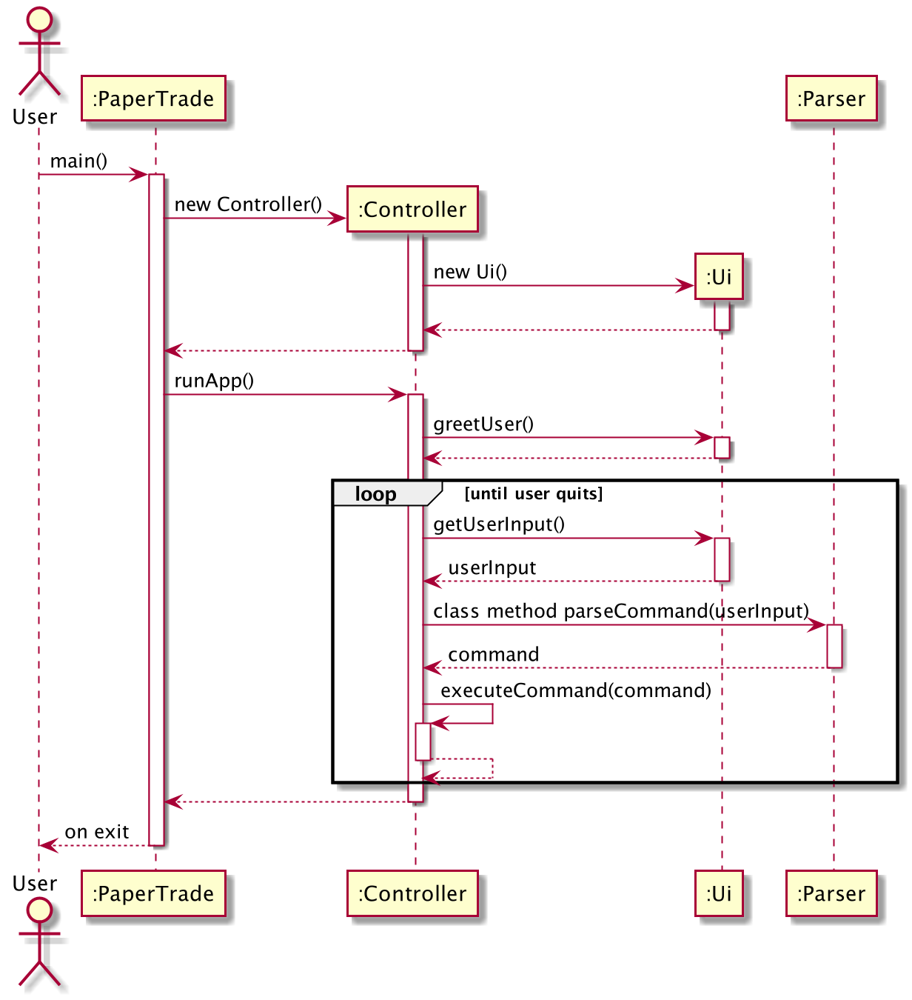
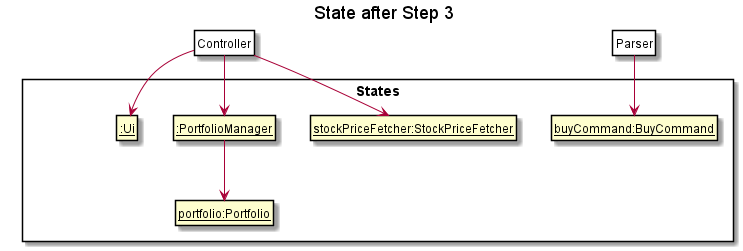
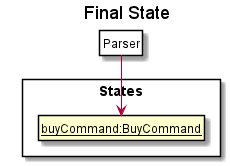

# Developer Guide
It is recommended that you read through the user guide to familiarize yourself with the program before using the 
developer guide.

# Setting up PaperTrade
Fork the repository and clone the fork into your computer.

To set up the project:
1. Ensure that you have JDK 11 installed.
2. Import the project as a Gradle project.
3. To build the project, run "./gradlew build" on a Unix machine or run "gradlew build" on Windows.

## Design & implementation

### Architecture

The Package Diagram above gives a high level view of the project structure and the classes in each package. 

The Architecture Diagram above gives a high level design of PaperTrade. Below is a quick overview of each component.

### Overview

* `PaperTrade`: The main entry point into the program. It initializes the Controller object which then takes over the 
execution of the program.
* `Controller`: Acts as an interface between all the other classes, to process all the business logic incoming commands
from the user. Manipulates the data through `PortfolioManager` and interact with `Ui` to display information to the 
user.
* `PortfolioManager`: Responsible for managing the persistency of the user's data through the `Storage` class and holds 
all the data for the program at a point in time.
* `Ui`: Responsible for displaying information to the user and getting input from the user.
* `Parser`: Responsible for parsing the user input and returning a `Command` object corresponding to the user command 
requested.
* `StockPriceFetcher`: Responsible for calling the AlphaVantage API to retrieve stock information.
* `Storage`: Responsible for managing the storing of data for persistency.

### Lifecycle of PaperTrade
The sequence diagram below shows how different packages and classes interact with each other throughout the lifecycle 
of PaperTrade.

## Implementation

### Buy/Sell Stock Feature

#### Current implementation

Buy and sell stock commands are largely similar, with the only difference being the way values of attributes in 
the objects instantiated are updated and the condition for throwing exceptions. 
Other than that, the way the functions work is the same.

Below is the explanation of the implementation of based on buy stock command, 
which can be applied to the sell stock command as well.

Buy stock command is instantiated by `Parser`. It allows users to buy stocks and add them to their 
 `Portfolio` by calling the `buyStock` methods from `PortfolioManager`, `StockPriceFetcher` and `Wallet` 
 objects instantiated by the `Controller` This will also _add_ the stock `portfolio` in `PortfolioManager`. 

Additionally, buy stock command extends the `Command` class which contains the `symbol` and `quantity` attributes. 
An external class, `buyParse` method is being called to validate the various parameters that the user has entered.

Given below is an example usage scenario and how buy stock command behaves at each step.

**Step 1** : The user calls the buy stock command from the `Parser`, which will initialise a 
`BuyCommand` and get the attribute values for `symbol` and `quantity`. 
`BuyCommand`'s constructor takes in parameter of `String symbol`, `Person`.
Below is a table of what each parameter corresponds to in the state diagram of the program.

|Parameter|Corresponds to
|:---:|:---:
|`symbol`| Ticker symbol of Stock to buy
|`quantity`| Integer number of shares to be 

**Step 2** : `buyStock()` is called from the instances of both `portfolioManager` and `wallet` 
with the values of `symbol` and `quantity` passed to them. 

**Step 3** : In the instance of `wallet`, the value of attribute `amount` is updated accordingly.
In the instance of `portfolioManager`, a new `Portfolio` object is instantiated. 
 
 

 
**Step 4** : The `buyStock` method is called from the `portfolio` instance, which instantiates a new `Transaction` object. 
 The `transaction` object stores details of the stock bought.
Below is a table of what each attribute in `Transaction` corresponds to in the program.

|Attribute|Corresponds to
|:---:|:---:
|`TransactionType`| Buy or Sell stock
|`Quantity`| Integer number of shares to be bought
|`BuyPrice`| Cost price of a stock at a specific time 
|`LocalDateTime`| the time when the command is called 

**Step 5** : A new 'Stock' object is also instantiated from the method call in the previous step. 
(_If a stock with the same symbol has not been instantiated before_.) Otherwise, the `Stock` object of that stock
symbol will be used. 

The method `addTransaction` in the `stock` object is then called, with the `transaction` object as a parameter, 
to update the value of the attribute `totalQuantity` in `Stock`.

**Step 6** : `BuyCommand`, `Parser`, `StockPriceFetcher`, `Transaction` and `Stock` are terminated.

The following sequence diagram summarizes what happens when the user executes an `BuyCommand` :

(Sequence Diagram to be added)

#### Design consideration

The following explains the design considerations when implementing commands:

* Make `BuyCommand` As a class by itself
    * Reason: Increases modularity of code, higher overall code quality 
* Alternatives: have a `buyCommand` method, increases coupling and reduces testability

## Product scope
### Target user profile

{Describe the target user profile}

### Value proposition

{Describe the value proposition: what problem does it solve?}

## User Stories

|Version| As a ... | I want to ... | So that I can ...|
|--------|----------|---------------|------------------|
|v1.0|new user|see usage instructions|refer to them when I forget how to use the application|
|v2.0|user|find a to-do item by name|locate a to-do without having to go through the entire list|

## Non-Functional Requirements

{Give non-functional requirements}

## Glossary

* *glossary item* - Definition

## Instructions for manual testing

{Give instructions on how to do a manual product testing e.g., how to load sample data to be used for testing}
