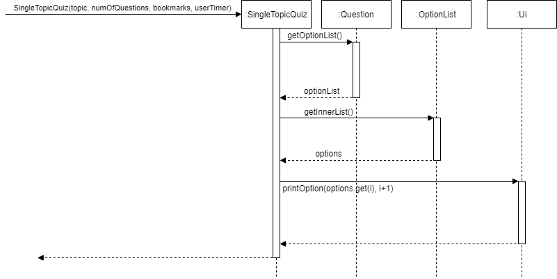
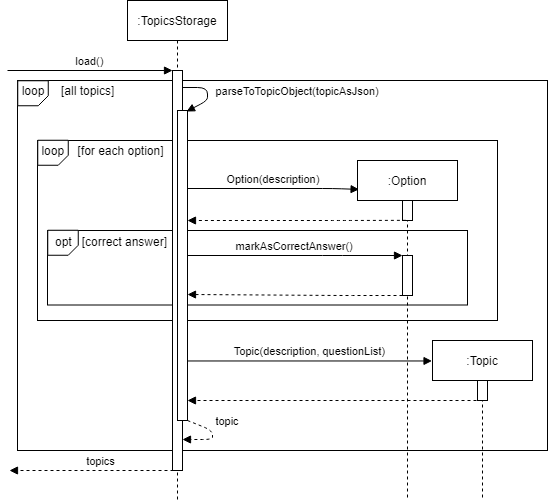

# Developer Guide for E-Duke-8

- [Developer Guide for E-Duke-8](#developer-guide-for-e-duke-8)
  - [1. Introduction](#1-introduction)
    - [1.1. Software Overview](#11-software-overview)
    - [1.2. Setting up](#12-setting-up)
  - [2. Design & implementation](#2-design--implementation)
    - [2.1. Architecture](#21-architecture)
    - [2.2. Model Component](#22-model-component)
      - [2.2.1. Design of TopicList](#221-design-of-topiclist)
      - [2.2.2. Implementation of TopicList](#222-implementation-of-topiclist)
      - [2.2.3. Implementation of Notes](#223-implementation-of-notes)
      - [2.2.4. Design of Option and OptionList](#224-design-of-option-and-optionlist)
      - [2.2.5. Implementation of Option and OptionList](#225-implementation-of-option-and-optionlist)
    - [2.3. Logic Component](#23-logic-component)
      - [2.3.1. Design of Parser](#231-design-of-parser)
      - [2.3.2. Implementation of MenuParser](#232-implementation-of-menuparser)
      - [2.3.3. Design of QuizQuestionsManager](#233-design-of-quizquestionsmanager)
      - [2.3.4. Implementation of QuizQuestionsManager](#234-implementation-of-quizquestionsmanager)
      - [2.3.5 Design of Stats Feature](#235-design-of-stats-feature)
      - [2.3.6. Implementation of Stats Feature](#236-implementation-of-stats-feature)
    - [2.4. Storage Component](#24-storage-component)
      - [2.4.1. Design of TopicsStorage](#241-design-of-topicsstorage)
      - [2.4.2. Implementation of TopicsStorage](#242-implementation-of-topicsstorage)
      - [2.4.3. Design of UserStorage](#243-design-of-userstorage)
      - [2.4.4. Implementation of UserStorage](#244-implementation-of-userstorage)
    - [2.5. UI Component](#25-ui-component)
      - [2.5.1. Implementation of Ui](#251-implementation-of-ui)
  - [3. Product scope](#3-product-scope)
    - [3.1. Target user profile](#31-target-user-profile)
    - [3.2. Value proposition](#32-value-proposition)
  - [4. User Stories](#4-user-stories)
  - [5. Non-Functional Requirements](#5-non-functional-requirements)
  - [6. Glossary](#6-glossary)
  - [7. Appendix](#7-appendix)
    - [7.1. Instructions for manual testing](#71-instructions-for-manual-testing)

## 1. Introduction

### 1.1. Software Overview

E-Duke-8 (pronounced "Educate") helps CS2113/T students **learn and understand software engineering and OOP principles** through a gamified
platform and enhances their learning experience. 

On this desktop application, CS2113/T students can attempt bite-sized quizzes, through the **Command Line Interface (CLI)**, to test their understanding of the concepts taught, and serves to consolidate key concepts for easy revision.

E-Duke-8, comprises of a Logic component, UI component, Storage component, and Model component. Each component comprises of multiple classes that work in tandem, to fulfil the purpose of our program. 

The purpose of this developer guide is to allow any interested contributors, who wish to develop this learning companion further, understand the inner workings of the program. 
This understanding will enable such contributors to add value to the current code, by improving its performance, level of interaction or capabilities. 

### 1.2. Setting up

First, fork this repo, and clone the fork into your computer.

You are recommended to use Intellij IDEA to edit the program.

1. **Configure the JDK**: Ensure Intellij is configured to use JDK 11.
2. **Import the project as a Gradle project**: Choose the option to import the project as a Gradle project when prompted.
3. **Verify the setup**: Enter some commands to ensure E-Duke-8 functions as expected. Refer to our [User Guide](https://ay2021s1-cs2113t-f12-3.github.io/tp/UserGuide.html) for more information.

## 2. Design & implementation

### 2.1. Architecture

The high-level design of our program is based on a 3-tier architecture which consists of the Presentation, Application and Database layers. The Logic component, UI component, Storage component, and Model component can be found in each layer as shown in the architecture diagram below.


### 2.2. Model Component

The data model is centered around `DisplayableList` objects which hold `Displayable` objects. This implementation allows us to create various topics with questions, options, hints and explanations. This was also extended to creating bookmarks and notes.

####  2.2.1. Design of TopicList

TopicList is an ArrayList of type Displayable, which is one of two interfaces implemented 
in the code for E-Duke-8. As such, many of the commands that manipulate the TopicList make 
use of the package java.util.ArrayList. The TopicList is used to store Topics. Additionally,
each topic stores a NoteList, which contains Notes.

1. Listing topics in TopicList
2. Adding a new note
3. Deleting an existing note
4. Listing out all notes in a topic


#### 2.2.2. Implementation of TopicList

**Listing topics in TopicList:**


This task is performed by the `TopicList.showTopics()` method.

Step 1. The `parseCommand()` method instantiates a `TopicsCommand` object which then calls the 
        `TopicList.showTopics()` method.
        
Step 2. The `TopicList.showTopics()` method then calls the method `Ui.printTopicList()`. The 
        current `TopicList` is passed into the called method.
        
Step 3. The `Ui.printTopicList()` method then prints out the description of each topic in the 
        `TopicList`. 

`NoteList` is also an `ArrayList` of type `Displayable`, which is one of two interfaces implemented in the code for 
E-Duke-8. As such, many of the commands that manipulate the `TopicList` make use of the package `java.util.ArrayList`. 
The `NoteList` stores `Note` objects. Each topic has 1 `NoteList`. 

#### 2.2.3. Implementation of Notes

**Adding a new note:**

This task is performed by the `NoteList.add()` method.

Step 1. The `parseCommand()` method instantiates a `NoteCommand` object which then calls the `NoteList.add()` method. 
        A new `Note` object is passed into its parameter.

Step 2. The `NoteList.add()` method makes use of `ArrayList` API, specifically the `ArrayList.add()` method, to add 
        the `Note` object into `NoteList`.

**Deleting a note:**

This task is performed by the `NoteList.delete()` method.

Step 1. The `parseCommand()` method instantiates a `NoteCommand` object which then calls the `NoteList.delete()` method. 
        An integer that represents the index of the `Note` object to be deleted within the `NoteList` is passed into 
        this method.

Step 2. The `NoteList.delete()` method makes use of `ArrayList` API, specifically the `ArrayList.remove()` method, to 
        delete the `Note` object in `NoteList`.

**Listing out all notes in a topic**

This task is performed by the `Ui.printNoteList()` method.

Step 1. The `parseCommand()` method instantiates a `NoteCommand` object which then instantiates an Ui object
and calls the `Ui.listInteraction` method. 

Step 2. The `Ui.listInteraction` method calls the `Ui.printNoteList()` method. The topic's `NoteList` is passed into 
this method. `Ui.printNoteList()` prints out the descriptions and texts of all the `Note` objects in the 
topic's `NoteList`.

#### 2.2.4. Design of Option and OptionList 

The `Option` and `OptionList` classes implements the `Displayable` and `DisplayableList` interfaces respectively. 
The `Option` object stores one option of a question while the `OptionList` object stores all 4 options of the same 
question. The class diagram below illustrates the structure of both classes. 

The `Option` class implements the `Displayable` interface while the `OptionList` class implements the `DisplayableList` interface. The illustration below shows the class diagram of `Option` and `OptionList`. 


The `Option` object stores the description of one option from a question. It also indicates if the option is the correct answer for the question by using the `isCorrectAnswer` boolean. 
The `OptionList` object stores all 4 options of the same question. 

#### 2.2.5. Implementation of Option and OptionList

An example of when the `Option` and `OptionList` classes are used is when the quiz mode is activated. The quiz requires all the options of a particular question to be printed out. 



Step 1. When a quiz is started, the `SingleTopicQuiz()` method will instantiate a `SingleTopicQuiz` object which calls the `getOptionList()` method. 

Step 2. The `OptionList` object then calls the `getInnerList()` method, a getter method, to get the list of options for the same question. 

Step 3. The `printOption()` method is then called to print out all the options for the user to see. The `options.get(i)` parameter will get the description of the specific option and the `i+1` parameter 
will handle the numbering of the options. The printing out of the options will be handled by the `Ui` class. 

### 2.3. Logic Component

The main application logic, such as provisioning quizes, is handled by the Logic component. This component also acts as the middleman between the backend and frontend by processing data before passing it to the user interface and parsing user input from the user interface.

#### 2.3.1. Design of Parser


1. After constructing a new MenuParser() in the `Eduke8` class, the parseCommand() method is used to parse the 
   user command.
2. This results in a `Command` object, which is executed by `Command` class itself, using the execute() method.
3. The `Ui` object in the `Command` object is used to display the requested information, or to display the required task 
to be completed as per the user input.

#### 2.3.2. Implementation of MenuParser

Below is the sequence diagram for how the Parser component of `Eduke8` works with commands to show output to the user.


The command parsing feature is our program’s way of reading the user’s input into the command line. It makes use of a 
single method `parseCommand` that identifies what command the user is calling for and then calls the command. There are 
two parsers in our program that implements a single `Parser` interface. One parser is for choosing menu options and is 
named `MenuParser`. The other parser is used during quizzes, in order to answer questions or request for hints, and is 
called `QuizParser`. Given below is an example usage scenario of how the command parsing feature works at each step, 
when the user types in input to get help in order to see what commands are available to the user.

Step 1. The user launches the program for the first time. The `MenuParser()` will be initialised and awaiting the user’s
        input to proceed.
        
Step 2. The user types in "help" into the command line interface and presses enter. This user input “help” is stored as 
        a string and is put into the `parseCommand()` method as a parameter, together with the list of topics. This 
        topic list is not relevant to the help command for now.
        
Step 3. The user input string is subjected to the `lang.string.trim()` and `lang.string.split()` functions of a string 
        in the Java libraries in order to remove redundant spaces around the input, and to discern the number of words 
        in the input. The `lang.string.split()` function uses a blank space string, “ “, as the delimiter to split the 
        string into its individual components.
        
Step 4. Each subsequent string separated by a space is stored in a string array named `commandArr`. The 0th index of the 
        `commandArr` array is the first word, the 1st index is the second word, and so on. In this case there is only 
        one word stored in the array, at the 0th index, which is “help”.
        
Step 5. The string at the 0th index is then used in a switch statement, where each case represents the different menu 
        options available. As such, the contents of the case with reference “help” is run, which is a return statement 
        containing a new `HelpCommand()`. This leads to the execution of the `help` command.
        
#### 2.3.3. Design of QuizQuestionsManager

To start a quiz in E-Duke-8, the user will have to indicate the number of questions that he wants to attempt, as well as the topic to get the questions from. Thereafter, questions will be shown to the user one by one until all them are attempted. 

The class diagram given below explains the high-level design of the Quiz system in E-Duke-8. Given below it is a quick overview of each component.


An object of `SingleTopicQuiz` class represents an instance of the quiz in E-Duke-8. Its `numberOfQuestions` attribute and `Topic` object correspond to the user's specified number of questions and topic for the quiz respectively.

The `startQuiz(:Ui)` method call from the `SingleTopicQuiz` object initializes an object of `QuizQuestionsManager` by passing into it `numberOfQuestions`, as well as an ArrayList of questions from the `Topic` object. The `QuizQuestionsManager` object will then randomly select `numberOfQuestions` questions from the topic the user has chosen, using its `setQuizQuestions(:int, :ArrayList<Displayable>)` method. 

Thereafter, by making use of `QuizQuestionsManager`'s `getNextQuestion()` and `areAllQuestionsAnswered()` method calls, the `goThroughQuizQuestions(:Ui, :QuizQuestionsManager)` will loop through the questions until the user has answered all of them on the command line interface.

#### 2.3.4. Implementation of QuizQuestionsManager

As mentioned earlier in the section on the design of the quiz system, a `QuizQuestionsManager` object will randomly select the indicated number of questions from the list of questions in the `Topic` object, and these will form the quiz questions for the user.

The sequence diagram below shows how `QuizQuestionsManager` is implemented to achieve this for the scenario where the user indicates that he wants to attempt 5 questions from the topic on OOP, which translates to the `setQuizQuestions(5, questionsInTopic)` call:


`nextInt(5)` is a method call to an object of the `Random` class. It returns a random integer between 0 (inclusive) and the number passed in as argument, 5 in this scenario, exclusive. 

To ensure that no two of the same question is selected, the selected randomQuestionIndex is checked to see if it is repeated. To determine if randomQuestionIndex is not selected before, an integer ArrayList is initialized to record all the selected integers. By checking against this collection of integers, it can be determined if a currently selected integer is repeated or not, and if it is, no question will be added for that iteration of the loop. 

An ArrayList of `Question` objects stores all the selected questions meant for the quiz.

#### 2.3.5 Design of Stats Feature

E-Duke-8 allows for user’s stats to be shown to the user when requested. These statistics correspond to the results of the user’s past attempts of the quiz. An aggregate result, followed by topical results of the quiz will be displayed. 

A `Stats` class facilitates what is to be shown to the user. It also calls the methods of the objects of the two subclasses of `StatsCalculator`, `UserStatsCalculator` and `TopicalStatsCalculator` to retrieve the necessary information to be displayed.

The class diagram given below showcases the high-level design of the stats feature in E-Duke-8. Given below it is a quick overview of each component.


Results of the quiz attempts can be calculated using the information stored in a `Question` object, because of its methods, namely `wasShown()`,  `wasHintShown()` and `wasAnsweredCorrectly()`, that indicate if it has been attempted before, whether hint was used when user attempted the question and if the question was answered correctly respectively. 

The current design of the stats feature is such that a correct answer without hint being used would award the user with 2 points, while a correct answer with hint used would award the user with 1 point. No point is awarded to the user if they chose the wrong answer. `calculatePointsEarnedForQuestion( :Question)` in `StatsCalculator` class and its subclasses, is the method that contains the logic for this calculation.

An object of `UserStatsCalculator` class is responsible for calculating the aggregate results from the user’s previous quiz results. For instance, its `calculateTotalPointsEarned()` method will iterate through the multiple topics stored in E-Duke-8 and calculate the total sum of the user’s past results of the quizzes done for those topics.

On the other hand, an object of `TopicalStatsCalculator` is used by the object of `Stats` class to calculate the topical results. In its constructor, the `TopicalStatsCalculator` object uses the single `Topic` object passed into it to retrieve its specific `QuestionList` object. Thereafter, by iterating through the questions for the particular `QuestionList` object, the results for individual topics can be calculated with its methods.

#### 2.3.6. Implementation of Stats Feature

The current implementation of the stats feature is such that the object of `Stats` class controls what is shown to the user when the `stats` command is received. It calls on methods of a `UserStatsCalculator` object and a `TopicalStatsCalculator` object to calculate and retrieve the statistics of the user’s previous attempts of quizzes in E-Duke-8, before displaying them.

The sequence diagram below shows the interactions between the different objects when `showPointsEarned(ui)` is invoked, by the object of `Stats` class, to display to the user the total points he has earned in E-Duke-8 so far, out of all the points that he can potentially earn. 


Through the logic in the object of `UserStatsCalculator`, necessary information regarding the user’s statistics, such as the `totalPointsGained` integer value and `totalPointsAvailable` integer value, are calculated, and then passed to the `Ui` object to print them to the user. This same concept and procedure are applied to the display the other aggregate results.

A similar procedure is being employed by the `TopicalStatsCalculator` object to calculate the topic-level statistics for the user. The only difference between the objects of these two classes is that instead of iterating through all the topics available, the `TopicalStatsCalculator` object only deals with a particular topic at any point of time. By iterating through the questions of the single topic, it calculates statistics for the topic and returns it back to the `Stats` object, which will then pass them to the `Ui` object to display them to the user. As such, in order to display the user’s statistics for each and every topic, a loop is done in the `Stats` object to repeatedly calculate the topic-level information for all of the topics and displaying them concurrently. 


### 2.4. Storage Component

The storage component is implemented locally and mainly saves and loads files in JavaScript Object Notation (JSON) format, except for log files which are stored as normal text files.

#### 2.4.1. Design of TopicsStorage

Given data for the topics and questions is loaded automatically from JSON files in the data folder. This is mainly facilitated through the `TopicsStorage` 
class which handles accessing the file as well as converting from JSON into `Topic`, `Question` and `Option` objects. The class diagram below shows this relationship.


The format of the JSON file is important as it is loaded in a particular way. This format has been designed as an array 
of topics that hold the different properties for questions, options, hints and explanations. An example is as such:

```json
[
  {
    "topic": "Topic Title", 
    "questions": [
      {
        "description": "What is your question?",
        "hint": "Put the hint here",
        "explanation": "Put the explanation here",
        "options": [ 
          {
            "description": "This is the first option and correct answer",
            "correct": true
          },
          {
            "description": "This is the second option",
            "correct": false
          },
          {
            "description": "This is the third option",
            "correct": false
          },
          {
            "description": "This is the fourth option",
            "correct": false
          }
        ]
      }
    ]
  }
]
```

Users may choose to edit this data as well and are provided with the following requirements from the User Guide:
> Note that the title will be loaded with spaces replaced with underscores, there must be 4 options for each question,
and there must be one and only one option chosen as the correct answer by specifying `true` as the value of the
`correct` key.

#### 2.4.2. Implementation of TopicsStorage

When the user launches the app, the main program will initialize a `TopicsStorage` object and call the `load` method 
which will return an `ArrayList` of  `Topic` objects. The following sequence diagram shows how the load operation works, focusing on how options are marked as correct:



As there is a high level of nesting in the JSON file, many methods are called in loops to parse each section and return them as objects which are then used to build the next object at a higher level. In the diagram above, the `Option` objects within each `Topic` has to be constructed with a description from the file and then marked as the correct answer if `correct` was `true` in the given data.  More properties can easily be added to the classes and the storage component in a similar way, by parsing in loops.

#### 2.4.3. Design of UserStorage

In order to save and load attributes specific to each user, such as the questions attempted, answered correctly or bookmarked, a `UserStorage` class is used to selectively store these attributes into a JSON file, `user.json`. This class requires access to the main `TopicList` and `BookmarkList` from the Model component in order to extract these attributes. The class diagram below shows this relationship.


The attributes will be saved in the JSON file tied to each question in a topic and is identified by its description. A question's presence in the file represents that it has been attempted before while other attributes are stored as boolean values. An example is given below.

```json
[
  {
    "notes":[],
    "questions": [
      {
        "correct":true,
        "bookmarked":true,
        "hint":false,
        "description":"First Question"
      },
      {
        "correct":false,
        "bookmarked":false,
        "hint":true,
        "description":"Second Question"
      }
    ],
    "topic":"First Topic"
  },
  {
    "notes":[
      {
        "description":"Note Title",
        "text":"Note Text"
      }
    ],
    "questions":[],
    "topic":"Second Topic"
  }
]
```

Unlike `topics.json`, users should not be editing the `user.json` file as it is system generated.

#### 2.4.4. Implementation of UserStorage

Unlike `TopicStorage`, `UserStorage` accesses existing objects in order to extract their attributes. The following sequence diagram shows an example of getting the topic description from a `Topic` object within the `TopicList`.


A similar method is used to extract the attributes from each `Question` object inside the `Topic`.

### 2.5. UI Component

The command line interface was chosen for users that prefer to type using a keyboard over using the mouse.

#### 2.5.1. Implementation of Ui

The `Ui` class handles all the interactions with the users. It reads the input from the users and prints out replies to 
the users. It is the point of communication between EDuke8 and the users. 

An example is provided below to illustrate how the `Ui` class prints out the starting page of the quiz for 
the user to comprehend. 


As the user starts the quiz, the `Ui` class will print out the quiz page to show that the quiz has started. 
The user inputs the number of questions that he wants to answer and also the topics that he wants to be tested on. 
The `Ui` will go through printStartQuizQuestions() to print out the number of questions that the user has chosen. 
Afterwards, the `Ui` will go through printStartQuizTopics() to print out the topics that the user has chosen. 

## 3. Product scope

### 3.1. Target user profile

CS2113/T Students

### 3.2. Value proposition

Help CS2113/T students learn and understand software engineering and OOP principles through a gamified platform and 
enhance their learning experience. Consolidate key concepts for easy revision.

## 4. User Stories

|Version| As a ... | I want to ... | So that I can ...|
|--------|----------|---------------|------------------|
|v1.0|new user|quickly see what the software has to offer|understand how to use the app|
|v1.0|new user|answer given questions|start testing myself immediately|
|v1.0|long-time user|get different questions each time|repeatedly test my understanding for the particular topic|
|v1.0|busy user|test myself on concepts using short, targeted quizzes|confirm my understanding of concepts|
|v1.0|user|get a hint for the question in the quiz|think about the question from a different angle|
|v1.0|user|see what the available topics are|navigate around the app effectively|
|v1.0|user|select the number of questions to do in the quiz|manage the workload and time spent on the quiz|
|v2.0|slow but hardworking user|see the explanations provided in the quiz|learn from my mistakes and revise|
|v2.0|busy, lazy user|take note of key concepts|refer to it easily at a later time|
|v2.0|frequent disorganized user|view the percentage of error in each topic|tell how well I understand the content|


## 5. Non-Functional Requirements

- Should work on any mainstream [Operating System (OS)](#6-glossary) as long as it has Java 11 or above installed.
- A user with above average typing speed for regular English text (i.e. not code, not system admin commands) should be able to accomplish most of the tasks faster using commands than using the mouse.

## 6. Glossary

- **Mainstream Operating Systems (OS)**: Windows, Linux, Unix, OS-X

## 7. Appendix

### 7.1. Instructions for manual testing

To test the product please refer to the E-Duke-8 [User Guide](https://ay2021s1-cs2113t-f12-3.github.io/tp/UserGuide.html).
