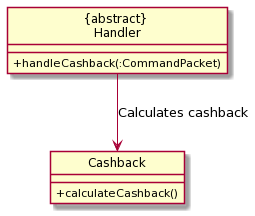
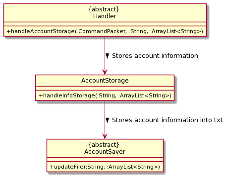
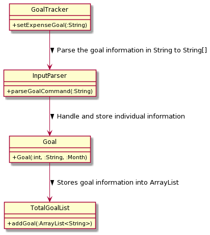

# Developer Guide

### Overview of architecture
There are 5 distinct features that exists within the FinanceIt application, all of which are accessed via the main menu 
interface facilitated in FinanceIt.java.

## Design & implementation
### Main Menu
- Loading up user data
- Access to various features
- Saving outstanding user data to respective save files

### Manual Tracker
**Overview**
<br>
ManualTracker.java manages various states of operation via a finite state machine class, 
handling different states representing each operation on Ledger instances.

|States| Operations | 
|--------|----------|
|```MAIN_MENU```|Go to main menu for users to choose the available operations
|```CREATE_LEDGER```|Create a ledger specified by date, and append it to ```ledgerList```.
|```DELETE_LEDGER```|Delete an existing ledger, referenced by date or index.
|```OPEN_LEDGER```|Go to subroutine "Entry Tracker" for the entries recorded  under the specified ledger.

**Helper Operation: Param Handler**

***UML Class Diagram***


***Summary***
* Classes which require input parameters by users require the collection of
helper classes to handle the parsing, checking and organisation of the input string.
* The handling of parameter input is isolated into an abstract class, whereby classes which requires a param handling
feature will inherit from the abstract class.
* Specific behavior towards different ```param type```-```parameter``` pairs  will be defined within their 
own class declarations.

***Architecture***
* The initialisation of ```Ledger``` and ```Entry``` instances can be
performed with reference to input parameters supplied from the user input.
* For ledger creation operations, the input from the user is parsed and passed into an initialized ledger instance
to handle. That is, the handling of input parameters is abstracted out from the handler classes. 
<br> The handle operation will set the various attributes within the ledger in accordance to specifications inferred
from the user input. 
<br> If the ledger is successfully specified in full, it will be added to a ```ledgerList``` instance within the handler 
class ```ManualTracker```.
* For ledger deletion/open, a ledger will need to be selected from the ledger list maintained by the handler class.
<br>Hence, the input from the user is parsed and passed into the ledger list instance to handle. If the input
is valid, the ledger list instance will assign a reference to the ledger selected to a public ```currLedger``` 
attribute. 
<br>After which, an operation of edit/open would be performed upon the ledger referenced from 
```currLedger``` in ```ledgerList```.


***Parsing***

****Input Conventions****
* The user input is composed of the following format:
```
    <command> <param type> <parameter> <param type> <parameter> ...
```
* The ```command``` string determines the current state of the Finite State Machine, and
hence the function executed. 
* The remainder of the string includes a series of  ```param type``` - ```param``` combinations, whereby
```param type``` indicates the type of the parameter which is to be identified by the user class,
and ```param``` indicates the parameter that is associated with the ```param type```. 

* Param types are restricted to two types: 
    * ```/<string>```, requires a corresponding parameter.
        * Eg. ```param type```: ```/date```
              <br>  ```param``` : ```2020-04-04```
    * ```-<string>```, does not require a corresponding parameter. 
        * Reserved for param types which are used to specify a property to be true/false
        * Eg. ```-auto```, to specify if an entry has automatic deduction. 
        
****Command Packet****
* A helper class. Contains two particular attributes to store the user input in an organised fashion.
    * ```commandString``` :  ```String``` Store the command string from the input.
    * ```paramMap``` : ```HashMap``` Store the pairs of ```param type``` and ```param``` present in the input string.
        * Key: ```param type```
        * Value:  ```param```

****InputParser****
* A helper class. Parses the input string and returns a corresponding ```commandPacket```.
    * ```parseInput()```: 
        * Initializes a ```commandPacket``` and populates the ```commandString``` attribute.
        * Calls ParamParser instance to parse the segment of the input string
        that corresponds with the sequence of ```param type``` - ```param``` pairs, and
        return a HashMap populated with the aforementioned pairs.
        * Returns a fully populated ```commandPacket``` to be used by user classes.
         
****ParamParser****
* A helper class. Parses the subsequence of the input string that corresponds with sequence of 
```param type``` - ```param``` pairs.
    * ```parseParams()```:
        * __Step 1__: Use a regex helper class ```RegexMatcher``` to identify and extract ```param type``` that matches the 
        pattern specified in "Input conventions":
        ```
        Param types are restricted to two types: 
          /<string>, requires a corresponding parameter.
              Eg. param type: /date
                    <br>  param : 2020-04-04
          -<string>, does not require a corresponding parameter. 
              Reserved for param types which are used to specify a property to be true/false
              Eg. -auto, to specify if an entry has automatic deduction. 
        ```
        * __Step 2__: Identify the substring of the rest of the input string before the next ```param type``` or end-of-line, 
        as the ```param``` to the previously identified ```param type```. Extract it from the input string.
        * __Step 3__: Put the ```param type``` - ```param``` pair into a ```HashMap```.
        * __Step 4__: Repeat steps 1 to 4 until there is the input string is fully extracted.
        * __Step 5__: Return a ```HashMap``` populated with the aforementioned pairs.


**Operation: Ledger Creation**

***UML Sequence Diagram***

### FinanceTools
FinanceTools consists of the following features
1. Simple Interest Calculator
2. Yearly/Monthly Compound Interest Calculator
3. Cashback Calculator
4. Miles Credit Calculator
6. Account Storage
7. Command and Calculation History

### Simple Interest Calculator
Simple Interest Calculator is facilitated by ```SimpleIntest``` class. It allows user to calculate interest earned.
When user inputs ```simple``` as a command, ```handleSimpleInterest``` from ```Handler``` class will handle user
inputted parameters. The calculation is done by ```SimpleInterest``` class. The result is outputted in
```FinanceTools.main()```.
<br />
### Parameters
* ```/a``` - Amount (Mandatory)
* ```/r``` - Interest Rate (Mandatory)

The following class diagram shows how the Simple Interest Calculator feature works:
<br />


The following sequence diagram shows how the params are handled before the implementation is carried out:
<br />
.png)
<br />
<br />
The following sequence diagram shows how the Simple Interest Calculator feature works:
<br />
.png)

### Yearly/Monthly Compound Interest Calculator
Yearly/Monthly Compound Interest Calculator is facilitated by ```YearlyCompoundInterest``` /
```MonthlyCompoundInterest``` class. It allows user to calculate interest earned.
When user inputs ```cyearly``` / ```cmonthly``` as a command, ```handleYearlyCompoundInterest``` /
```handleMonthlyCompoundInterest``` from ```Handler``` class will handle user inputted parameters. The calculation 
is done by ```YearlyCompoundInterest``` / ```MonthlyCompoundInterest``` class. The result is outputted in
```FinanceTools.main()```.
<br />
### Parameters (Yearly Compound Interest Calculator)
* ```/a``` - Amount (Mandatory)
* ```/r``` - Interest Rate (Mandatory)
* ```/p``` - Number of Years (Mandatory)
* ```/d``` - Yearly Deposit (Optional)

### Parameters (Monthly Compound Interest Calculator)
* ```/a``` - Amount (Mandatory)
* ```/r``` - Interest Rate (Mandatory)
* ```/p``` - Number of Months (Mandatory)
* ```/d``` - Monthly Deposit (Optional)

The following class diagram shows how the Yearly/Monthly Compound Interest Calculator feature works:
<br />


<br />
The following sequence diagram shows how the params are handled before the implementation is carried out:
<br />
.png)
<br />
<br />
.png)
<br />
<br />
The following sequence diagram shows how the Yearly/Monthly Compound Interest Calculator feature works:
<br />
.png)
<br />
<br />
.png)

### Cashback Calculator
Cashback Calculator is facilitated by ```Cashback``` class. It allows user to calculate cashback earned.
When user inputs ```cashb``` as a command, ```handleCashback``` from ```Handler``` class will handle user
inputted parameters. The calculation is done by ```Cashback``` class. The result is outputted in
```FinanceTools.main()```.
<br />
### Parameters
* ```/a``` - Amount (Mandatory)
* ```/r``` - Cashback Rate (Mandatory)
* ```/c``` - Cashback Cap (Mandatory)

The following class diagram shows how the Cashback Calculator feature works:
<br />


The following sequence diagram shows how the params are handled before the implementation is carried out:
<br />
.png)
<br />
<br />
The following sequence diagram shows how the Cashback Calculator feature works:
<br />
.png)

### Miles Credit Calculator
Miles Credit Calculator is facilitated by ```MilesCredit``` class. It allows user to calculate miles credit earned.
When user inputs ```miles``` as a command, ```handleMilesCredit``` from ```Handler``` class will handle user
inputted parameters. The calculation is done by ```MilesCredit``` class. The result is outputted in
```FinanceTools.main()```.
<br />
### Parameters
* ```/a``` - Amount (Mandatory)
* ```/r``` - Miles Rate (Mandatory)

The following class diagram shows how the Miles Credit Calculator feature works:
<br />


The following sequence diagram shows how the params are handled before the implementation is carried out:
<br />
.png)
<br />
<br />
The following sequence diagram shows how the Miles Creidt Calculator feature works:
<br />
.png)

### Account Storage 
Account Storage feature is facilitated by ```AccountStorage``` class. It allows user to store account
information such as name of account, interest rate, cashback rate, etc. When user inputs ```store``` as command,
```handleAccountStorage``` from ```Handler``` class will handle user inputted parameters and store information 
accordingly. The implementation is done by ```handleInfoStorage``` from ```AccountStorage``` class. Afterwards, this 
information is stored into a txt file which is done by ```updateFile``` from ```AccountSaver``` class.
<br />

Additionally, it implements the following operations:
* ```info``` - list account(s) information
* ```clearinfo``` - clear all information
* ```store /rm <ACCOUNT_NO>``` - delete corresponding account number in list

### Parameters
* ```/n``` - Account Name (Optional)
* ```/ir``` - Interest Rate (Optional)
* ```/r``` - Cashback Rate (Optional)
* ```/c``` - Cashback Cap (Optional)
* ```/o``` - Other Notes (Optional)
* ```/rm``` - Account Number (Optional)

#### Details
```handleInfoStorage``` stores the user inputted information into an ArrayList which is then passed into
```updateFile``` to update the txt file. The purpose of using txt file is so that when the user exits and enters the
program again, the information is retained, and the user does not have to re-enter the account information(s) again.
<br />
 
When user first enters FinanceTools in the program, ```readFileContents``` reads 5 lines in the txt file consecutively
in a ```while``` loop because these 5 lines consists of information that belong to a particular account. These
categories include: Name, Interest Rate, Cashback Rate, Cashback Cap and Notes". Doing so helps to facilitate
the ```delete``` option where instead of deleting single lines, we can delete the entire account information
which correspond to a particular account because the information is stored in one index of the ArrayList.
<br />
 
The following class diagram shows how the Account Storage feature works:
<br />


The following sequence diagram shows how the params are handled before the implementation is carried out:
<br />
.png)
<br />
<br />
The following sequence diagram shows how the Account Storage feature works:
<br />
.png)
<br />
<br />
.png)
 
### Command and Calculation History
To store the commands inputted by user and results from calculations in FinanceTools, an ArrayList is used.
The commands are stored before the params are handled and implementation is executed. The results from calculation
is stored when the implementation has finished executed.

### Goal Tracker
### Set Expense Goal Feature
The set expense goal feature is being implemented by ```GoalTracker```. It allows the user to set an expense goal for
the respective month to ensure that the user does not overspent his budget. 
When user enter ```expense 2000 for 08```, the command will be sent to InputParser and parse it into String[].
With the String[], it will be sent to a class called ```Goal```, and it will store the individual information.
Afterwards, it will be added to a ArrayList in a class called ```TotalGoalList```. 
 
Not only that, ```GoalTracker``` also implemented a feature called ```set income goal``` that works almost the same as 
set expense goal feature with just slight command difference.
 
 `Format:`
* setExpenseGoal: expense 5000 for 08
* setIncomeGoal: income 5000 for 08
 
### How it works?
Firstly, user will input the command based on the `Format`.
Secondly, the input command will be sent to InputParser to parse.
Thirdly, the parsed information will be sent to class `Goal` to store the individual information
Next, it will be added to a ArrayList in class `TotalGoalList`.
Lastly, the goal status will be displayed to the user.  
 
This class diagram will show how the setting of expense goal works:

 
This sequence diagram will show the flow of setting of expense goal:


## Product scope
### Target user profile

{Describe the target user profile}  
Fresh computing graduates who are just starting to enter the workforce.
* Have limited income/budget
* Little experience in personal financial management
* Busy juggling their various job applications and interview which might cause them to lose track of their expenditure/ 
bill payments
* First time drawing salary and lack experience in income tax filling

### Value proposition

{Describe the value proposition: what problem does it solve?}  
**Expenditure Tracker**
* Input itemised spending on a daily basis
* Sum the monthly/weekly expenditure, as well as average weekly/daily expenditure
* Categorise expenditures (e.g. food, transport etc) and sort by category

**Budget Management**
* Set a budget (monthly)
* Remind users of how much budget they have left for that month
* Edit the budget (monthly)
* Display the budget for that month

**Bill Tracker**
* Remind users of payment due dates
* Monthly tracker for each individual bill, visualise trends in bill spending

**Finance Tools**
* Calculate simple interest
* Calculate compound interest with optional monthly/yearly deposit
* Calculate cashback earned
* Calculate miles credit earned
* Save account information for reference

## User Stories

|Version| As a ... | I want to ... | So that I can ...|
|--------|----------|---------------|------------------|
|v1.0|new user|see usage instructions|refer to them when I forget how to use the application|
|v2.0|user|find a to-do item by name|locate a to-do without having to go through the entire list|

## Non-Functional Requirements

{Give non-functional requirements}

## Glossary

* *glossary item* - Definition

## Instructions for manual testing

{Give instructions on how to do a manual product testing e.g., how to load sample data to be used for testing}