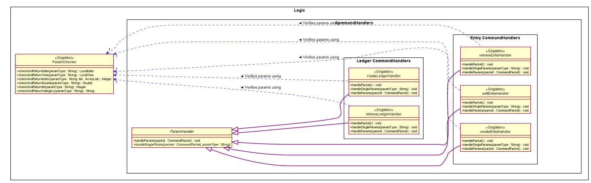
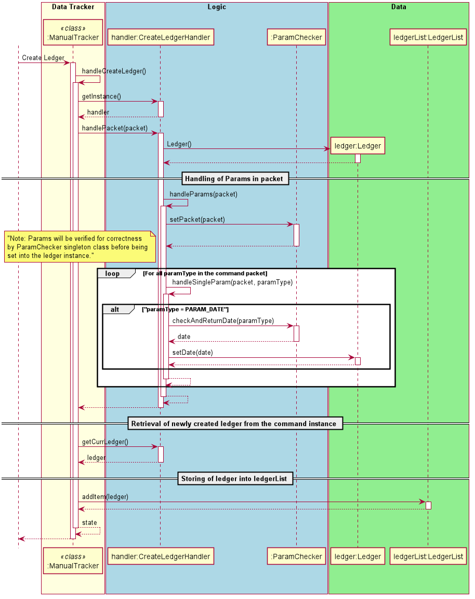
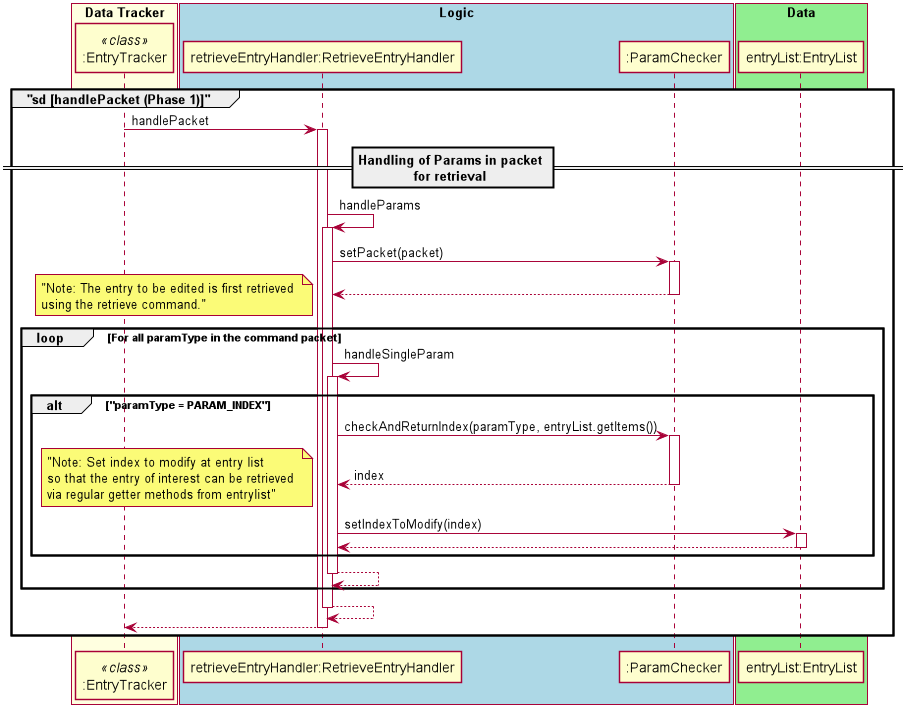
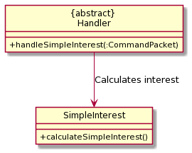
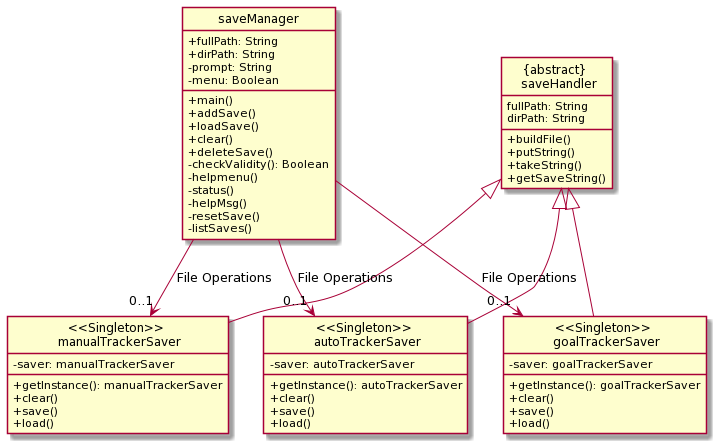

# Developer Guide for FinanceIt

* Table of Contents
{:toc}

<div style="page-break-after: always;"></div>

# Design

<!-- @@author kaiwen98 -->
## Overview of Architecture
__Architecture Diagram__


There are 5 distinct features that exists within the FinanceIt application, all of which are accessed via the main menu 
interface facilitated in FinanceIt.java.

The design of the software can be split into 5 distinct components:
* Logic Manager component
* Logic component
* Input Manager component
* Data component
* Storage component

## Logic Manager Component


__Description__

The Logic Manager component serves as the bridge between user interface and program operations.
<br />It includes 5 classes: 
* ```ManualTracker```
* ```EntryTracker```
* ```RecurringTracker```
* ```GoalTracker```
* ```FinanceTools```

__API__
* ```ManualTracker```, `RecurringTracker` and ```EntryTracker``` maintains an instance of a ```DataList``` (```LedgerList``` and ```EntryList```) in ```Model``` respectively, 
 and provides an interface for the user can append, remove or perform other ```Data``` operations with the contents of the ```Datalist```.
* ```GoalTracker``` maintains a list of income or expense ```Goals``` to track against entries in the ```EntryList```, 
and provides an interface for the user to append or remove ```Goals```.
* ```Finance Tools``` class provides an interface for users to utilize an array of 
finance calculator tools within it.
* All ```LogicManager``` classes use the ```InputManager``` component to process user input, then use ```Logic``` component
to perform the operation associated with the param handling.

## Logic Component


__Description__

The Logic Component executes logic operations passed via a `CommandPacket`, by handling individual params 
contained in the `CommandPacket`.

__API__

* Different `CommandHandler` classes are used in `LogicManager` classes to handle various operations e.g. new, edit, delete
* If `CommandHandler` classes recognises a `param` from the `CommandPacket` instance, it performs a sub-operation
associated with the `param`. For instance, `/date` will cause `CreateLedgerCommand` instance to set the date of the
newly created ledger.  
* `CommandHandler` in turn uses `ParamChecker` to verify validity of inputs before setting.
<!-- @@author-->


## Input Manager Component


__Description__

The Input Manager consists of the ```UiManager``` class, and the ```Parser``` sub-component.

__API__

* ```handleInput()``` from the ```UiManager``` class is called from ```Handler``` classes to 
retrieve the raw string input from the user.

* ```Parser``` classes are responsible for parsing raw String input from the user
and produce a ```CommandPacket```.
* `CommandPacket` consists of two components
    * `commandString` which is the command entered by the user
    * `paramMap` which is a HashMap of param entered - key is param tag and value 
    is the raw input String.
    * E.g. if user inputs `new /desc Quick brown fox`, `commandString` will be `"add"`,
    while paramMap will consist of one key-value pair, key being `"/desc"` and value being
    `"Quick brown fox"`


## Model Component


__Description__

Represents data and data list in the program, whereby program operations specified
by user input can be performed upon.

__API__

* ```EntryTracker```, ```RecurringEntryTracker``` and ```ManualTracker``` classes can interact with ```LedgerList``` and ```EntryList```
instances to perform add, remove or edit operations on the ```Ledgers``` or ```Entry``` instances in it.
* ```Storage``` component interact with ```DataList``` classes for save and load operations.
    * For save, ```Storage``` component uses the ```EntryTracker``` and ```ManualTracker``` instances in the program
    at the point of save to write to a series of text files that persists after the program closes.
    * For load, ```Storage``` component writes data from the text files to ```EntryTracker``` and ```ManualTracker``` respectively.
* Utility Model sub-components
    * Goal
        * Used by the `GoalTracker`. The user can set their income or expense goals by creating a `Goal` instance. They can then be compared against with total entry amounts recorded by the user, whereby the `GoalTracker` will report the progress of the user towards the `Goal` that they set. 
        * More information can be found in the [GoalTracker section](#goalTracker).
    * AccountSaver
        * Stores account information of the user.
        * More details can be found in the [FinanceTools section](#financeTools).

## Storage Component


__Description__

Storage component performs storage of data from Goal Tracker, Manual Tracker and Recurring Tracker. It loads
the data upon entry into the program and performs auto save upon exiting the program. Save Manager also added
a feature that allow multiple copies of backup data to be saved and loaded.

__API__

* ```manualTrackerSaver```, ```goalTrackerSaver``` and ```autoTrackerSaver``` inherits some common methods
from ```saveHandler```. The saver classes are primarily used by ```saveManager``` for file input output operations.

<div style="page-break-after: always;"></div>

<!-- @@author kaiwen98 -->
## Logging

__Description__

Some classes facilitate critical operations which need to be logged for debugging purposes.
The `LoggerCentre` class includes all logger instances for such classes throughout the program.

__API__
* The `LoggerCentre` interacts with `FinanceIt` class directly; it creates log files in the beginning of program execution.
* The `LoggerCentre` consolidates initial configuration of all `logger` instances used in the program. However,
those instances will log independently of the `LoggerCentre`. 
* The `LoggerCentre` creates new log files every time the program runs from the command line. The files are in .log format and
can be accessed in the `logs` folder.   
<!-- @@author-->

<div style="page-break-after: always;"></div>

# Implementation
## Module-level Implementation
* This section describes generalizable implementations that are similar across features.
* More components described in [Feature-level implementation](#feature-level-implementation) below.

&nbsp;  

<!-- @@author kaiwen98 -->
### Input Manager
* Note: Refer to [Input Manager Component](#input-manager-component) above for class diagram 
illustration of the below subsections.

__Input Conventions__
* The user input is composed of the following format:
```
    <command> <param type> <parameter> <param type> <parameter> ...
```
* The ```command``` string determines the function to be executed e.g. `new` or `edit`.
* The remainder of the string includes a series of  param type` - `param` combinations, whereby
```param type``` indicates the type of the parameter and ```param``` indicates the parameter 
that is associated with the ```param type```. 

* Param types are restricted to two types: 
    * ```/<string>```, requires a corresponding parameter. 
        * Eg. `/date 200814` 
        * ```param type```: ```/date```
        * ```param``` : ```200814```
    * ```-<string>```, does not require a corresponding parameter. 
        * Reserved for param types which are used to specify a property to be true/false
        * Eg. ```-auto```, to specify if an entry has automatic deduction. 
        
<a name="commandPacket"></a> __CommandPacket class__ 
* A helper class. Contains two particular attributes to store the user input in an organised fashion.
    * ```commandString``` :  ```String``` Store the command string from the input.
    * ```paramMap``` : ```HashMap``` Store the pairs of ```param type``` and ```param``` present in the input string.
        * Key: ```param type```
        * Value:  ```param```

__InputParser class__
* A helper class. Parses the input string and returns a corresponding [```commandPacket```](#commandPacket).
    * ```parseInput()```: 
        * Initializes a ```commandPacket``` and populates the ```commandString``` attribute.
        * Calls ParamParser instance to parse the segment of the input string
        that corresponds with the sequence of ```param type``` - ```param``` pairs, and
        return a HashMap populated with the aforementioned pairs.
        * Returns a fully populated ```commandPacket``` to be used by user classes.
         
__ParamsParser class__
* A helper class. Parses the subsequence of the input string that corresponds with sequence of 
```param type``` - ```param``` pairs.
    * Parsing of input for params via ```parseParams()```:
        * __Step 1__: Use a regex helper class ```RegexMatcher``` to identify and extract ```param type``` that matches the 
        pattern specified in "Input conventions":
            * `/<string>` or `-<string>`
        * __Step 2__: Identify the substring of the rest of the input string before the next ```param type``` or end-of-line. 
        This is the `param` to the previously identified `param type`. Extract it from the input string.
            * Eg. input is `new /desc NNN /amt 35`. `ParamsParser` will receive `/desc NNN /amt 35` as a string.
            * It will look for a param type -  in this case the first param type is `/desc`.
            * It then removes the param type from the string and checks for the next param or end of string.
            * The next param identified is `/amt`
            * `param` associated with `/desc` is hence everything after `/desc` until `/amt`, which is `"NNN"` 
        * __Step 3__: Put the ```param type``` - ```param``` pair into a ```HashMap```.
        * __Step 4__: Repeat steps 1 to 4 until there is the input string is fully extracted.
        * __Step 5__: Return a ```HashMap``` populated with the aforementioned pairs.

&nbsp;  
<!-- @@author-->

### Logic Managers
* Note: Refer to [Logic Manager Component](#logic-manager-component) above for class diagram 
illustration of the below subsections.

**Execution** <br />
1. Logic Managers are implemented with a common method: ```execute()```, which utilizes a `while loop`
to maintain a cycle of 2 processes: User input processing and Command handling.

**User Input Processing** <br />
1. Logic Managers depend on InputManager module to read user input, parse user input and produce a 
meaningful ```CommandPacket``` instance.
1. The ```CommandPacket``` instance can then be used by the next step of the cycle.

**Command Handling** <br />
1. Each Logic Manager will have several methods that are dedicated to handle a single operation. They can
typically be identified by a specific naming convention: `"handle.....()"`.
1. These methods use ```CommandHandler``` classes to perform `param` dependent operations, which involves evaluation
of `paramMap` in the provided `CommandPacket` instance to decide the operation to perform, be it on `Data` or `DataList`.

**Error Reporting** <br />
1. While error handling from `param` parsing is handled by `ParamChecker` singleton class, there is a need
to identify from the execution methods at Logic Managers, whether an exception has been thrown. 
1. This is handled by a `try-catch block` within the  `"handle.....()"` methods, whereby an exception caught
will result in an error message printed. The error message will not be specific to the exact error; rather it 
generally indicates whether an operation has failed.

**Example** <br />
* Execute Method

```
    public static void execute() {
        endTracker = false;
        UiManager.printWithStatusIcon(Common.PrintType.SYS_MSG, "Welcome to Manual Tracker!");
        while (!endTracker) {
            endTracker = false;
            handleMainMenu();
        }
    }
```

* Operation Methods

```
    static void handleDeleteLedger() {
        //Retrieves ledger and deletes it
    }
```
&nbsp;  

### Logic 
* Note: Refer to [Logic Component](#logic-component) above for class diagram 
illustration of the below subsections.

**`ParamChecker`**
1. Contains a set of public static methods which verifies the validity of the raw input provided
1. If there is nothing wrong with the ```param```, the method will typically return the `param` supplied without modification.
1. If the ```param``` fails to pass the tests administered within the method, the following procedures will execute:
    1. Log to log file a corresponding error message with ```WARNING``` level
    1. Print to console, any applicable error messages.
    1. Throw a common exception: `ParseFailParamException` 
        1. The implication is that the range of exceptions that would have been caught in other
        parts of the software with regards to param handling, is now consolidated within a single class in the program.
        The class that uses ParamChecker is only concerned with whether the ```param``` is valid or not.

**`ParamHandler`**
1. `CommandPacket` created from user-input needs to be handled by a particular `ParamHandler` subclass,
depending on what kind of command it is. E.g. CreateEntryHandler handles creating a new Entry.

**`CommandHandler`**
1. Extends `ParamHandler` class. Individual implementation of `handleSingleParams()`
    * E.g. `CreateEntryHandler` handles `/desc` param, whereas `RetrieveEntryHandler` does not.
1. Used within Logic Managers to handle processing of `CommandPacket`.  

**Handling of params by `XYZCommandHandler`**:  
1. Initialize the state of the handler 
    * `XYZCommandHandler#setRequiredParams()` sets required Params that need to be parsed successfully to 
    constitute a valid input.
        * E.g. to create a new `RecurringEntry`, `/desc` and `/day` are two of the required params,
        whereas editing has no required params (provided that at least one param is present).
    * Pass `CommandPacket` to `ParamChecker` by calling `ParamChecker#setPacket(packet)`.
1. Call `ParamHandler#handleParams()`
    * For every`paramType` in the `CommandPacket` instance, execute `XYZCommandHandler#handleSingleParam(packet)`
    * If the `param` parses successfully, it will be added to `paramsSuccessfullyParsed`, else an Exception will be thrown
1. Check if the CommandPacket is valid. The below conditions must be satisfied:
    * All params set earlier via `setRequiredParams()` are parsed with no exceptions thrown.
    That is, all params in `requiredParams` is also in `paramsSuccessfullyParsed`.
1. If all successful, the entry created is returned. Else, throw ```InsufficientParamsException()```.

<div style="page-break-after: always;"></div>

## Feature-level Implementation
### Main Menu
- Loading up user data
- Access to various features
- Saving outstanding user data to respective save files

&nbsp;  
### Manual Tracker & Entry Tracker
**Overview** <br />

__Ledgers and Entries__

In this feature, we represent the transactions incurred by the users as ```Entry``` instances.
Instances of ```Entry``` class are categorised by the date of origin, which is represented by
```Ledger``` instances.

```Entry``` instances are characterized by the following: 
* Time of transaction
* Type of transaction: Income/ Expense 
* Amount in transaction
* Category of spending/ expenditure
* Description

```Ledger``` instances are characterized by the following: 
* Time of transaction
* Collection of ```Entry```instances

**Manual Tracker** <br />

The Manual Tracker is a feature that allows users to manage Ledgers with create, delete
and open operations. Ledgers is a class that maintains a list of transactions that are 
recorded for a given date. 

The Entry Tracker is fundamentally similar to the Manual Tracker, except it manages ```Entry``` instances
instead of ```Ledger```. Entry Tracker is initialized when a ```Ledger``` instance is "opened", whereby 
the Entry Tracker facilitate the manipulation of the collection of ```Entry``` instances that are associated with
that particular ```Ledger``` instance.

For the sake of brevity, this section will focus on the discussion of the Manual Tracker. 
The edit operation of the Entry Tracker will be discussed at the [end of this section](#entryseq); it is sufficiently unique to Manual Tracker operations to merit detailed discussion.

The Manual Tracker is capable of executing the following states of operation:

|States| Operations | 
|--------|----------|
|```MAIN_MENU```|Go to main menu for users to choose the available operations
|```CREATE_LEDGER```|Create a ledger specified by date, and append it to ```ledgerList```.
|```DELETE_LEDGER```|Delete an existing ledger, referenced by date or index.
|```OPEN_LEDGER```|Go to subroutine "Entry Tracker" for the entries recorded  under the specified ledger.

**Architecture in Context** 

**Logic Manager and Parser** 


|Class| Function |	
|--------|----------|	
|```InputParser```| Breaks input string by user into ```commandString``` and a sequence of ```paramTypes```-```param``` pairs. <br><br> The latter subsequence of the string is passed into ParamParser for further processing. <br><br> Information obtained from input parsing will be used to populate an instantiated ```CommandPacket``` instance, which will then be passed to the entity that called the parsing function.	
|```ParamParser```| Process the sequence of ```paramTypes```-```param``` pairs and populate the ```paramMap``` in the instantiated ```CommandPacket``` instance.	
|```ManualTracker```| [Refer to section](#logicManager_handler).
|```EntryTracker```| Omitted for brevity.


**<a name = logic_data></a>Logic Manager and Data** <br />


|Class| Function |
|--------|--------|
|```ManualTracker```| [Refer to section](#logicManager_handler).
|```EntryTracker```| Omitted for brevity.
|```EntryList```| Omitted for brevity.
|```Entry```| Omitted for brevity.
|```LedgerList```| Extends ItemList. Refer to Ledgers and Entries section for class behavior.
|```Ledger```| Extends DateTimeItem. Refer to Ledgers and Entries section for class behavior.
|```ItemList```| Class with defined list behavior specified with helper methods such as retrieval, checking of Duplicates and deletion.
|```DateTimeItem```| Abstract class that extends ```Item``` class; instances will have ```LocalDate``` or ```LocalTime``` attributes and corresponding helper methods.
|```Item```| Abstract class to define behavior of entities that need are stored in ```ItemList``` instances.

**<a name = handler_logic></a>Handler and Logic** <br />



|Class| Function |
|--------|----------|
|```RetrieveLedgerHandler```| Process ```paramTypes```-```param``` pairs from the ```CommandPacket``` instance to identify specified ```Ledger``` instance, then retrieves the instance from the existing ```LedgerList```.
|```CreateLedgerHandler```| Process ```paramTypes```-```param``` pairs from the ```CommandPacket``` instance to identify specified ```Ledger``` instance to be created, then creates the instance and append to existing ```LedgerList```.
|```retrieveEntryHandler```| Omitted for brevity.
|```CreateEntryHandler```| Omitted for brevity.
|```EditEntryHandler```| Omitted for brevity.
|```ParamChecker```| Class contains a collection of methods that verify the correctness of the ```param``` supplied. <br><br> For instance, ```ParamChecker.checkAndReturnIndex``` checks if the index provided is out of bounds relative to the specified list, and throws the relevant exception if the input index is invalid. 
|```ParamHandler```| Abstract class that outlines the general param handling behavior of ```commands``` instances and other classes that need to handle ```params``` in its operation.  


**<a name = logicManager_handler> </a>Logic Manager and Handler** <br />


|Class| Function |
|--------|----------|
|```RetrieveLedgerHandler```| [Refer to section](#handler_logic).
|```CreateLedgerHandler```| [Refer to section](#handler_logic).
|```retrieveEntryHandler```| Omitted for brevity.
|```CreateEntryHandler```| Omitted for brevity.
|```EditEntryHandler```| Omitted for brevity.
|```ManualTracker```| Implements Manual Tracker. Contains handler methods that implements a particular operation capable by the Manual Tracker. <br><br> These methods use the above ```command``` instances for param handling operations from user input.
|```EntryTracker```| Omitted for brevity.


**Functions with Sequence Diagrams** <br />

**Creation of Ledger([Sequence Diagram](#diag1))** <br />
1. At ```ManualTracker.handleMainMenu()```, the user's input is registered via ```java.util.Scanner``` instance.
1. Input is parsed by ```InputParser.parseInput()```, and ```ManualTracker.packet``` is set to the returned ```CommandPacket``` instance.
1. The ```commandString``` of the ```CommandPacket``` instance is evaluated, and the corresponding handle method() is executed.<br/>In this case, ```handleCreateLedger()``` will be called.
1. At `handleCreateLedger()`, the following processes will be executed:
    1. A new instance of ```CreateLedgerHandler``` is created. The input String array will be passed into `CreateLedgerHandler.setRequiredParams()` to set required params for a successful parse.
    1. A new instance of `Ledger` will be instantiated and set to `CreateLedgerHandler.currLedger`.
    1. ```CreateLedgerHandler.handlePacket(packet)``` is called to handle params in the packet.
        1. Refer to the section on [Param Handling](#impl_logic) for more details pertaining to general param handling. 
        1. For `CreateLedgerHandler`, the `handleSingleParam` abstract method will be implemented as shown in the [following table](#table1).
        
1. From ```ManualTracker```, the configured ```Ledger``` instance will be retrieved from the ```CreateLedgerHandler``` instance
and added into the ```LedgerList``` instance at ```ManualTracker.ledgerList```.

#### <a name = table1></a> Param Handling Behavior

|ParamType|ParamType String| Expected Param | Operation | Verification method |
|---------|----------------|----------------|-----------|---------------------|
|```PARAM.DATE```|"/date"|Various format of date in string, eg. "2020-03-02"| Call ```currLedger.setDate()``` to set date for the ```Ledger``` instance. | ```ParamChecker.checkAndReturnDate(packet)```|

#### <a name = diag1></a> Sequence Diagram



**Deletion of Ledger ([Sequence Diagram](#diag2))** <br />
The deletion of a specified ledger is performed in two phases: Ledger Retrieval and Ledger Delete.
1. __Phase 0: Instruction retrieval__ 
    1. At ```ManualTracker.handleMainMenu()```, the user's input is registered via ```java.util.Scanner``` instance.
    1. Input is parsed by ```InputParser.parseInput()```, and ```ManualTracker.packet``` is set to the returned ```CommandPacket``` instance.
    1. The ```commandString``` of the ```CommandPacket``` instance is evaluated, and the corresponding handle method() is executed.<br>
    In this case, ```handleDeleteLedger()``` will be called.
1. __Phase 1: Ledger retrieval__
    1. At ```handleDeleteLedger()```, the following processes will be executed:
        1. A new instance of ```RetrieveLedgerHandler``` is created. The input String array will be passed into 
        ```CreateLedgerHandler.setRequiredParams()``` to set required params for a successful parse.
        1. ```RetrieveledgerHandler.handlePacket(packet)``` is called to handle params in the packet.
            1. Refer to the section on [Param Handling](#impl_logic) for more details pertaining to general param handling. 
            1. For ```CreateLedgerHandler```, the ```handleSingleParam``` abstract method will be implemented as shown in the [following table](#table2):
                * Note that only one of the two params need to be invoked from the input. 
1. __Phase 2: Ledger Deletion__
    1. From ```ManualTracker```, call ```ledgerList.RemoveItemAtCurrIndex()``` to remove the ledger specified by the index set to modify earlier.

#### <a name = table2></a> Param Handling Behavior
    
|ParamType|ParamType String| Expected Param | Operation | Verification method |
|---------|----------------|----------------|-----------|---------------------|
|```PARAM.DATE```|"/date"|Various format of date in string, eg. "2020-03-02"| Call ```ledgerList.setIndexToModify()``` to set index of retrieved item. | ```ParamChecker.checkAndReturnDate(packet)```|
|```PARAM.INDEX```|"/index"|Valid index on the list from 1 onwards.|Call ```ledgerList.setIndexToModify()``` to set index of retrieved item. | ```ParamChecker.checkAndReturnIndex(packet)```|

#### <a name = diag2></a> Sequence Diagram


**<a name = entryseq></a>Entry Tracker: Edit of entries** <br />
The editing of details within the entry is performed in two phases: Entry Retrieval and Entry Edit.


1. __Phase 0: Instruction retrieval__ 
    1. At ```EntryTracker.handleMainMenu()```, the user's input is registered via ```java.util.Scanner``` instance.
    1. Input is parsed by ```InputParser.parseInput()```, and ```EntryTracker.packet``` is set to the returned ```CommandPacket``` instance.
    1. The ```commandString``` of the ```CommandPacket``` instance is evaluated, and the corresponding handle method() is executed.<br>
    In this case, ```handleEditEntry()``` will be called.
1. __Phase 1: Entry retrieval([Sequence Diagram](#diag3))__
    1. At ```handleEditEntry()```, the following processes will be executed:
        1. A singleton instance of ```RetrieveEntryHandler``` is retrieved. The input String array will be passed into 
        ```retrieveEntryHandler.setRequiredParams()``` to set required params for a successful parse.
        1. ```retrieveEntryHandler.handlePacket(packet)``` is called to handle params in the packet.
            1. Refer to the section on [Param Handling](#impl_logic) for more details pertaining to general param handling. 
            1. For ```retrieveEntryHandler```, the ```handleSingleParam``` abstract method will be implemented as shown in the [following table](#table3).
            1. From ```EntryTracker```, call ```entryList.popItemAtCurrIndex``` to retrieve the entry specified by the index set to modify earlier.

#### <a name = table3></a> Param Handling Behavior

|ParamType|ParamType String| Expected Param | Operation | Verification method |
|---------|----------------|----------------|-----------|---------------------|
|```PARAM.INDEX```|"/index"|Valid index on the list <br/>from 1 onwards.|Call ```entryList.setIndexToModify()``` <br/>to set index of retrieved item. | ```ParamChecker.checkAndReturnIndex(packet)```|

#### <a name = diag3></a> Sequence Diagram 



1. __Phase 2: Entry edit ([Sequence Diagram](#diag4))__ 
    1. Following Phase 1, the following processes will be executed:
        1. The singleton instance of ```EditEntryHandler``` is retrieved. There is no need to call ```EditEntryHandler.setRequiredParams()```
        ; this command does not require params to modify. Instead, it acceps any params supplied and performs the edit accordingly.
        1. `editeEntryHandler.setPacket(packet)` is called to set packet.
    1. ```EditEntryHandler.handlePacket()``` is called to handle params in the packet.
        1. Refer to the section on [Param Handling](#impl_logic) for more details pertaining to general param handling. 
        1. For ```EditEntryHandler```, the ```handleSingleParam``` abstract method will be implemented as shown in the [following table](#table4).
    1. The edited entry is added back into the list.
#### <a name = table4></a> Param Handling Behavior           

|ParamType|ParamType String| Expected Param | Operation | Verification method |
|---------|----------------|----------------|-----------|---------------------|
|```PARAM.AMOUNT```|"/amt"|Positive Double in 2 decimal places|Call ```entryList.setAmount()``` to set amount | ```ParamChecker.checkAndReturnDoubleSigned(packet)```|
|```PARAM.TIME```|"/time"|Various format of time in string, eg. "15:00"|Call ```entryList.setTime()``` to set index of retrieved item. | ```ParamChecker.checkAndReturnTime(packet)```|
|```PARAM.INC```|"-i"|Income entry type flag|Call ```entryList.setEntryType(EntryType.INC)``` to set index of retrieved item. | ```nil```|
|```PARAM.EXP```|"-e"|Expense entry type flag|Call ```entryList.setEntryType(EntryType.EXP)``` to set index of retrieved item. | ```nil```|
|```PARAM.DESCRIPTION```|"/desc"|Description in string, ';' character is illegal.|Call ```entryList.setDescription()``` to set index of retrieved item. | ```ParamChecker.checkAndReturnDescription(packet)```|
|```PARAM.CATEGORY```|"/cat"|A set of strings that corresponds with entry type|Call ```entryList.setCategory()``` to set index of retrieved item. | ```ParamChecker.checkAndReturnCategories(packet)```|

#### <a name = diag4></a> Sequence Diagram 


<div style="page-break-after: always;"></div>

&nbsp;  
### Recurring Tracker
**Overview** <br />
Recurring Tracker handles the creation, deletion and editing of recurring entries.

Entries use the class ```RecurringEntry```, and are stored in the ```RecurringEntryList``` class.

`RecurringEntry` has the following attributes:
* `day` - The day which the transaction occurs
* `description`
* `entryType` - Can be `Constants.EntryType.INC` or `Constants.EntryType.INC` 
depending on whether the entry is an income or expenditure respectively.
* `amount`
* `start` and `end` - Which months does the entry apply to. Set to 1 and 12 by 
default (i.e. occurs every month)
    * [Proposed] Start-end month feature: User is able to set start and end months. 
    Reminders will not be generated for months in which entry does not occur.
* `isAuto` - Indicates whether the entry is automatically deducted/credited from/to account, 
or manually deducted/credited from/to account. Causes entry to be displayed differently to the user, 
but does not cause different functionality.
* `notes` - Any user-specified notes

`RecurringEntryList` extends ItemList, and supports the following methods on top of inherited methods
* `addItem(Item)` - Override. Adds item and sorts according to the day in ascending order
* `getEntriesFromDayXtoY` - Returns an ArrayList of all entries that fall between day X and Y 
(provided by developer in the code, not by user). Used for reminders.


**Logic Manager and Handler**

`RecurringTracker`, like `EntryTracker`, utilizes 3 handlers - `CreateEntryHandler`, `EditEntryHandler` and `RetrieveEntryHandler`.

**`handleCreateEntry()`**

* Entry creation is handled by `CreateEntryHandler`, who will create an empty RecurringEntry,
call `ParamChecker` to verify validity of input, and set the relevant fields in the RecurringEntry.
* Finally, it returns the filled entry back to RecurringTracker to add to the list.

Below are the compulsory params; an Exception will be thrown by `CreateEntryHandler` if not all are present.
* "-e" or "-i"
* "/desc"
* "/amt" 
* "/day"

Optional params are
* "-auto"
* "-notes"

The following sequence diagram illustrates the process:


**`handleDeleteEntry()`**

The only compulsory param is `/id`, the 1-based index of the item to delete.

* Uses`RetrieveEntryHandler`, who will call `ParamChecker` to verify
that a valid index was provided. 
* The handler will then remove the entry at the given index
by calling `entries#removeItemAtCurrIndex()`.

**`handleEditEntry()`**

Compulsory params are "/id" and at least one other param to edit 

* `RetrieveEntryHandler` is first called to retrieve the entry to be edited, similar to what 
occurs in `handleDeleteEntry().
* `EditEntryHandler` is then called to operate on the given entry. The overall process is 
similar to that of `handleCreateEntry()`.


**Reminders** <br />
Upon launching the program, the system date and time is recorded in `RunHistory`.

The program then checks if there are any entries upcoming within 5 days from the current date, and prints the entries out
as reminders.

1. Main code calls `MenuPrinter#printReminders()`, which in turn calls 
`ReminderListGenerator#generateListOfRemindersAsStrings()`. 
1. `ReminderListGenerator` checks the current date, and calculates the day of month which is 5 days from current date.
This is stored in `dayToRemindUntil`.
1. `ReminderListGenerator` then checks if `dayToRemindUntil` is after the last day of the current month. If it is,
then the reminder timeframe will overflow to the next month. 
    
    For example:
    * Current date is 29th October. There are 31 days in October. 5 days after today is 34th, 
    which is beyond last day of October.
    * Reminder timeframe will overflow to next month, until 3rd of November

1. If it has overflown, set `isOverflowToNextMonth` to true. Subtract the last day of month from `dayToRemindUntil`.
The new value of `dayToRemindUntil` is the day of next month that the reminder timeframe extends to.

    For example:
    * Continuing from example earlier, `dayToRemindUntil = 34`.
    * `dayToRemindUntil -= NUM_DAYS_IN_OCT`, i.e. 34 - 31
    * `dayToRemindUntil = 3`, representing that the reminder timeframe extends to 3rd of November
1. `ReminderListGenerator` then grabs the entries within the reminder timeframe from the list of all recurring entries.
    * If `isOverflowToNextMonth == true`, it will grab all entries from `currentDay` to `lastDayOfMonth` 
    and all entries from `1` (1st day of next month) to `dayToRemindUntil`
    * Else, it will simply grab all entries from `currentDay` to `dayToRemindUntil`

1. Lastly, the list of entries will be converted to a formatted String to be displayed as reminders, and passed back
to `MenuPrinter`, who will pass it to `UiManager` to print.

The sequence diagram below shows how it works:


<div style="page-break-after: always;"></div>

&nbsp;  

<!-- @@author bqxy -->
### <a name = financeTools></a> FinanceTools
**Overview** <br />
FinanceTools consists of the following features
1. Simple Interest Calculator
2. Yearly/Monthly Compound Interest Calculator
3. Cashback Calculator
4. Miles Credit Calculator
6. Account Storage
7. Command and Calculation History

**Simple Interest Calculator** <br />
Simple Interest Calculator is facilitated by ```SimpleInterest``` class. It allows user to calculate interest earned.
When user inputs ```simple``` as a command, ```handleSimpleInterest``` from ```Handler``` class will handle user
inputted parameters. The calculation is done by ```SimpleInterest``` class. The result is outputted in
```FinanceTools.main()```.
<br />

**Parameters** <br />
* ```/a``` - Amount (Mandatory)
* ```/r``` - Interest Rate (Mandatory)

The following class diagram shows how the Simple Interest Calculator feature works:
<br />


The following sequence diagram shows how the params are handled before the implementation is carried out:
<br />
For more information on parameters handling, refer [here](#implementation).
.png)
<br />
<br />
The following sequence diagram shows how the Simple Interest Calculator feature works:
<br />
.png)

**Yearly/Monthly Compound Interest Calculator** <br />
Yearly/Monthly Compound Interest Calculator is facilitated by ```YearlyCompoundInterest``` /
```MonthlyCompoundInterest``` class. It allows user to calculate interest earned.
When user inputs ```cyearly``` / ```cmonthly``` as a command, ```handleYearlyCompoundInterest``` /
```handleMonthlyCompoundInterest``` from ```Handler``` class will handle user inputted parameters. The calculation 
is done by ```YearlyCompoundInterest``` / ```MonthlyCompoundInterest``` class. The result is outputted in
```FinanceTools.main()```.
<br />

**Parameters** <br />

* ```/a``` - Amount (Mandatory)
* ```/r``` - Interest Rate (Mandatory)
* ```/p``` - Number of Years/Months (Mandatory)
* ```/d``` - Yearly/Monthly Deposit (Optional)

The following class diagram shows how the Yearly/Monthly Compound Interest Calculator feature works:
<br />


<br />
The following sequence diagram shows how the params are handled before the implementation is carried out:
<br />
For more information on parameters handling, refer [here](#implementation).
.png)
<br />
<br />
.png)
<br />
<br />
The following sequence diagram shows how the Yearly/Monthly Compound Interest Calculator feature works:
<br />
.png)
<br />
<br />
.png)

**Cashback Calculator** <br />
Cashback Calculator is facilitated by ```Cashback``` class. It allows user to calculate cashback earned.
When user inputs ```cashb``` as a command, ```handleCashback``` from ```Handler``` class will handle user
inputted parameters. The calculation is done by ```Cashback``` class. The result is outputted in
```FinanceTools.main()```.
<br />

**Parameters** <br />
* ```/a``` - Amount (Mandatory)
* ```/r``` - Cashback Rate (Mandatory)
* ```/c``` - Cashback Cap (Mandatory)

The following class diagram shows how the Cashback Calculator feature works:
<br />


The following sequence diagram shows how the params are handled before the implementation is carried out:
<br />
For more information on parameters handling, refer [here](#implementation).
.png)
<br />
<br />
The following sequence diagram shows how the Cashback Calculator feature works:
<br />
.png)

**Miles Credit Calculator** <br />
Miles Credit Calculator is facilitated by ```MilesCredit``` class. It allows user to calculate miles credit earned.
When user inputs ```miles``` as a command, ```handleMilesCredit``` from ```Handler``` class will handle user
inputted parameters. The calculation is done by ```MilesCredit``` class. The result is outputted in
```FinanceTools.main()```.
<br />

**Parameters** <br />
* ```/a``` - Amount (Mandatory)
* ```/r``` - Miles Rate (Mandatory)

The following class diagram shows how the Miles Credit Calculator feature works:
<br />


The following sequence diagram shows how the params are handled before the implementation is carried out:
<br />
For more information on parameters handling, refer [here](#implementation).
.png)
<br />
<br />
The following sequence diagram shows how the Miles Creidt Calculator feature works:
<br />
.png)

**Account Storage** <br />
Account Storage feature is facilitated by ```AccountStorage``` class. It allows user to store account
information such as name of account, interest rate, cashback rate, etc. When user inputs ```store``` as command,
```handleAccountStorage``` from ```Handler``` class will handle user inputted parameters and store information 
accordingly. The implementation is done by ```handleInfoStorage``` from ```AccountStorage``` class. Afterwards, this 
information is stored into a txt file which is done by ```updateFile``` from ```AccountSaver``` class.
<br />

Additionally, it implements the following operations:
* ```info``` - list account(s) information
* ```clearinfo``` - clear all information
* ```store /rm <ACCOUNT_NO>``` - delete corresponding account number in list

**Parameters** <br />
* ```/n``` - Account Name (Optional)
* ```/ir``` - Interest Rate (Optional)
* ```/r``` - Cashback Rate (Optional)
* ```/c``` - Cashback Cap (Optional)
* ```/o``` - Other Notes (Optional)
* ```/rm``` - Account Number (Optional)

**Details** <br />
```handleInfoStorage``` stores the user inputted information into an ```ArrayList``` which is then passed into
```updateFile``` to update the txt file. The purpose of using txt file is so that when the user exits and enters the
program again, the information is retained, and the user does not have to re-enter the account information(s) again.
<br />
 
When user first enters FinanceTools in the program, ```readFileContents``` reads 5 lines in the txt file consecutively
in a ```while``` loop because these 5 lines consists of information that belong to a particular account. These
categories include: Name, Interest Rate, Cashback Rate, Cashback Cap and Notes". Doing so helps to facilitate
the ```delete``` option where instead of deleting single lines, we can delete the entire account information
which correspond to a particular account because the information is stored in one index of the ```ArrayList```.
<br />
 
The following class diagram shows how the Account Storage feature works:
<br />


The following sequence diagram shows how the params are handled before the implementation is carried out:
<br />
For more information on parameters handling, refer [here](#implementation).
.png)
<br />
<br />
The following sequence diagram shows how the Account Storage feature works:
<br />

.png)
<br />
<br />

.png)
 
**Command and Calculation History** <br />
To store the commands inputted by user and results from calculations in FinanceTools, an ```ArrayList``` is used.
The commands are stored in the ```ArrayList``` before the params are handled and implementation is executed. 
The results from calculation is stored in the ```ArrayList``` when the implementation has finished executed.

<div style="page-break-after: always;"></div>

<!-- @@author-->

&nbsp;  

### <a name = goalTracker></a> Goal Tracker
**Set Expense Goal Feature** <br />
The set expense goal feature is being implemented by ```GoalTracker```. It allows the user to set an expense goal for
the respective month to ensure that the user does not overspent his budget. 
When user enter ```expense 2000 for 08```, the command will be sent to InputParser and parse it into String[].
With the String[], it will be sent to a class called ```Goal```, and it will store the individual information.
Afterwards, it will be added to a ArrayList in a class called ```TotalGoalList```. 
 
Not only that, ```GoalTracker``` also implemented a feature called ```set income goal``` that works almost the same as 
set expense goal feature with just slight command difference.
 
 `Format:`
* setExpenseGoal: expense 5000 for 08
* setIncomeGoal: income 5000 for 08
 
**Details** <br />
Firstly, user will input the command based on the `Format`.
Secondly, the input command will be sent to InputParser to parse.
Thirdly, the parsed information will be sent to class `Goal` to store the individual information
Next, it will be added to a ArrayList in class `TotalGoalList`.
Lastly, the goal status will be displayed to the user.  
 
This class diagram will show how the setting of expense goal works:
<br />


 
This sequence diagram will show the flow of setting of expense goal:
<br />


<div style="page-break-after: always;"></div>

&nbsp;  

### Storage Utility
**What it does** <br />
Storage utility is a tool designed for backup and storage of all data associated with Goal tracker, Manual tracker and recurring tracker.
It performs auto loading and saving of data upon entry and exit of the program as well as allowing multiple saves to be created and loaded
at will.

**Overview** <br />
Storage utility contains 5 classes. SaveHandler class contains some commonly used functions such as buildFile that is inherited to the 3
saver child classes. goalTrackerSaver produce text file to save goalTracker states, autoTrackerSaver saves recurringTracker states and
manualTrackerSaver saves manualTracker states.

**Save Manager Class Diagram** <br />


<br />
Saver classes alone can handle autosave of data during entry and when exiting the program. This is done by calling load and save functions
in the Financit main. saveManager class adds additional features that performs adding and loading of backup saves. addSave function is done
by calling save function in each respective saver class with 2 parameters attached. Since save function is implemented as variable argument
function, it is designed to accept no argument or two arguments. For the case with no argument the function will save to the default location
given during initilization of the program and used for loading during startup and saving upon exit. For the case with two argument, new directory 
location is specified that is used for saving of backup data.

saveManager loadSave function was implemented by calling first the clear function in each respective saver classes, then the load functions.
FileChannel is also used to copy contents of the backup save file into the default initilzation save file in case program was unexpectedly
terminated.

**Save Manager Sequence Diagram** <br />


<div style="page-break-after: always;"></div>

&nbsp;  

# Product scope
## Target user profile

* has a need to keep track of their expenditure and income
* needs a tool to calculate interest earned and cashback amounts
* prefers CLI over a GUI app
* can type fast

## Value proposition
 
**Expenditure Tracker**
* Input itemised spending on a daily basis
* Sum the monthly/weekly expenditure, as well as average weekly/daily expenditure
* Categorise expenditures (e.g. food, transport etc) and sort by category

**Budget Management**
* Set a budget (monthly)
* Remind users of how much budget they have left for that month
* Edit the budget (monthly)
* Display the budget for that month

**Recurring Expenditure/Income**
* Keep track of expenditure/income that occur on a monthly basis e.g. bills and income
* Remind users of upcoming entries, e.g. a bill payment which is due tomorrow

**Finance Tools**
* Calculate simple interest
* Calculate compound interest with optional monthly/yearly deposit
* Calculate cashback earned
* Calculate miles credit earned
* Save account information for reference

<div style="page-break-after: always;"></div>

&nbsp;  

# User Stories

|Version| As a ... | I want to ... | So that I can ...|
|--------|----------|---------------|------------------|
|v1.0|Financially prudent user|Keep record of my spendings of the day|I can keep track of my spending habits on a daily basis.|
|v1.0|As a student who mistypes easily|Edit my transaction details using one line commands|I can correct my mis-types in a easy and intuitive way.|
|v1.0|As a university student who may have difficulty keeping track of his finances|Monitor my spending habits and income according to various categories of expenditure|I can identify which particular category of spending forms the majority of my daily expenditures.|
|v1.0|As a person who spends a lot of time in front of a computer|Record my expenses and income using one-line commands|I can monitor my spending habits conveniently and hassle-free.|
|v1.0|user|calculate interest over a principal amount|know how much interest I can earn|
|v1.0|user|calculate interest earned over a period time|know how much interest I can earn at the end of a period|
|v1.0|user|calculate cashback earned|know how much cashback I can earn|
|v1.0|user|calculate miles credit earned|know how much miles credit I can earn|
|v1.0|user|set expense goal for 1 year|manage my expenditure according to the budget I set aside|
|v1.0|user|set income goal for 1 year|know how much I have saved and did I reach my saving target|
|v1.0|user|know my goal status everytime I made an entry|saved the hassle to go to goal tracker just to check the progress|
|v1.0|user|add a recurring entry|Keep track of monthly transactions like income or bills|
|v1.0|user|edit a recurring entry|update details of existing entries without having to re-enter everything|
|v1.0|user|delete a recurring entry|remove recurring entries that are no longer valid e.g. cancelled subscription|
|v2.0|user|calculate interest over a principal amount with yearly or monthly deposit|know how much interest I can earn with regular deposits|
|v2.0|user|store account or card information|refer to account features such as interest rate any time|
|v2.0|user|compare my calculations with different interest rate|decide which account is better|
|v2.0|user|set expense goal for specific month|manage my expenditure monthly instead of yearly|
|v2.0|user|set income goal for specific month|know exactly which month I manage to saved up to my target goal|
|v2.0|user|edit expense/income goal for specific month|adjust my expenditure/saving target according to the situation|
|v2.0|user|display expense/income goal for specific month|keep track of my progress|
|v2.0|busy user with many bills to pay|see all my upcoming recurring entries|keep track of bill payment dates and prevent overdue fees|

<div style="page-break-after: always;"></div>

&nbsp;  

# Non-Functional Requirements

* _Constraint_ - Single User Product. 
* _Performance_ - JAR file does not exceed 100Mb.
* _User_ - Users should prefer typing on CLI
* _Program_ - Platform independent (Windows/Mac/Linux)
* _Program_ - Works without needing an installer

&nbsp;  

# Glossary
* __General__
    * _IntelliJ_ - An Integrated Development Environment (IDE) used to develop FinanceIt
    * _CLI_ - Command Line Interface
    * _UML_ - Unified Modeling Language
* __Manual Tracker and Entry Tracker__
    * _Entries_ - The class designed to represent a unit of transaction of the user. 
    * _Ledger_ - A collection of entries which are incurred on the same day.
    * _Entry Type_ - Whether an entry is an Income or Expense.
    * _Entry Category_ - Type of entry along the following choices:
        * _Expense Entry_ - Transport, Food, Travel, Shopping, Bills, Others
        * _Income Entry_ - Allowance, Salary, Others
    * _Entry Amount_ - Amount of money associated with the transaction.
    * _Entry Description_ - Text for users to identify the transaction. Can include general transaction details.
* __Recurring Tracker__
    * _Entries_ - Transactions which occur on a monthly basis
    * _Day_ - Day of month on which the entry occurs. Can also be deadline, for instance bill due date. 
<div style="page-break-after: always;"></div>

&nbsp;  

# Future implementations

1. **Integrate Goal Tracker with Recurring Tracker**  <br/>
In the next version, the Goal tracker will be used to keep track not only the manual tracker but also the recurring 
tracker. With this feature being implemented, those fixed monthly income and expenditure will also be included into 
the goal tracker progress to better aid the user in managing their finances.

1. **Entry Categories used for analysis** <br />
In the next version, entry categories can be recorded and used in meaningful calculations to represent the user's 
spending habits in a more detailed and categorised manner. Perhaps a tabulated summary of entries by each category
would be helpful in assisting the users in meaningfully monitoring their spending habits.

<div style="page-break-after: always;"></div>

&nbsp;  

# Instructions for Manual Testing

1. Download the executable from our [latest release](https://github.com/AY2021S1-CS2113-T16-1/tp/releases/)
1. Save the executable file in your preferred folder
1. Run the program via the command line. The command is: ```java -jar financeit.jar```
1. You should see the following output:


## Main Menu
1. Accessing a feature (Using ManualTracker as example):
    1. Enter ```manual``` into the console.
    You should see the following: 
            


1. Exiting the main menu and quit the program: 
    1. Enter ```exit``` into the console.
        You should see the following: 
        


## ManualTracker
**Show Command List** <br />
1. Enter ```commands``` into the console.
You should see the following: 


**Create Ledger** <br />
**Positive Test** <br />
1. Enter ```new /date 200505``` into the console.
You should see the following:


**Negative test: Duplicate inputs** <br />
1. Again, enter ```new /date 200505``` into the console.
You should see the following:


**Testing Show Ledger List** <br />
**Positive Test** <br />
1. Enter ```list``` into the console. 
You should see the following: 


> Observe that there is currently one ledger in the list, of date 2020-05-05.
1. Refer to the above section on creating ledgers to create another ledger of date 2020-06-06 using the command: 
```new /date 200606```. 
1. Enter ```list``` into the console. 
> Observe that there are now two ledgers in the list.
You should see the following: 


**Testing Delete Ledger** <br />
**Positive Test** <br />
1. Enter ```delete /id 1``` into the console.
    * This will delete the first ledger on index, which is of date 2020-05-05
1. Enter ```list``` into the consolde.
You should see the following:


> Observe there is now one ledger on the list.

**Open Ledger** <br />
1. Enter ```open /date 200707``` into the console.
You should see the following:


> Note that the ledger of date 2020-07-07 was not created beforehand. However, the ledger will be automatically created by the operation, and will resume as per normal. 

## EntryTracker
1. The following testing guide assumes that testing at [7.2](#7.2) is completed.
**Show Command List** <br />
1. Enter ```commands``` into the console.
You should see the following:


**Show Category List** <br />
1. Enter ```cat``` into the console.
You should see the following:


**Create Entry** <br />
**Positive Test** <br />
1. Enter ```new /time 1500 /cat tpt /amt $16.30 /desc Riding the bus back home -e``` into the console.
You should see the following:


1. Enter ```new /time 1500 /cat slr /amt $16.30 /desc Riding the bus back home -i``` into the console.
You should see the following:


**Negative Test** <br />
1. Enter ```new /time 1500 /cat tpt /amt $16.30 /desc Riding the bus back home -i``` into the console.
You should see the following:


> Note that the error is thrown because category ```tpt``` is not considered an income, `-i`. Instead, it is 
    considered an expenditure, and `-e` should have been used instead.

**Testing Show Entry List** <br />
1. Enter ```list``` into the console.
You should see the following:


> Note that the number of entries is now __2__.

**Testing Edit Entry** <br />

1. Enter ```edit /id 1 /amt $0.50``` into the console.
1. Enter ```list``` into the console.
You should see the following:


> Observe that the entry of entry number 1 is not $0.50 under the __Amount__ column.

**Testing Delete Entry** <br />
1. Enter ```delete /id 2``` into the console.
1. Enter ```list``` into the console.
You should see the following:


> Observe the entry that is the latter to be added, entry with __Entry Type = Income__, is now
removed from the list.

## RecurringTracker
1. Enter `recur` in the Main Menu. You should see the following:


**Show Command List** <br />
1. Enter `commands`. Output: <br />


**Testing Add Entry** <br />

**Positive Test 1: Normal Entry** <br/>
1. Enter `new -e /desc Netflix /amt 36.20 /day 27 /notes Cancel when finished watching Black Mirror`. Output:


**Entry with special day of month** <br />
1. Enter `new -e /desc Drinks /amt 58.45 /day 31`. Output:


**Negative Test** <br />
1. Enter `new /desc OIH()(&%* /amt 343243`. Output:


**Testing List Entries** <br />
* The following testing guide assumes that the testing above has been completed. <br />
Enter `list`. Output:


**Testing Edit Entry** <br />
* The following testing guide assumes that the testing above has been completed. <br />
**Positive Test** <br />
1. Enter `edit /id 1 /day 29 -i`. Output:<br />

1. Enter `list`. Output:


**Negative Test: No Params to Edit** <br />

1. Enter `edit /id 1`. Output:


<br />

**Negative Test: No Such Index** <br />

1. Enter `edit /id 4 /desc Hello Bubble`. Output:


**Testing Delete Entry** <br />
* The following testing guide assumes that all testing above has been completed. <br />

1. Enter `delete /id 1`. Output:


1. Enter `list`. Output:


**Testing Reminders** <br />
* The following testing guide assumes that all previous entries have been deleted. This can be achieved by running `delete /id 1` repeatedly until list is empty.
* As reminders are based on system date at time of running, the `/day` param of the below examples will have to be modified accordingly. Simply copy-pasting the commands will not create the expected output.
1. Enter `add -e /desc SingTel bill /amt 120.50 /day {CURRENT_DAY}`
    * E.g. if today is 15th, input will be `/day 15`
    
1. Enter `add -e -auto /desc Spotify subscription /amt 9.99 /day {CURRENT_DAY + 2}`
    * E.g. if today is 15th, input will be `/day 17`
    
1. Enter `add -i /desc Collect cash from Sonia /amt 500 /day {CURRENT_DAY + 7}`
    * E.g. if today is 15th, input will be `/day 22`
    * E.g. if today is 28th, input will be `/day 5` OR `day 4` depending on whether the current month has 30 or 31 days respectively.

1. Enter `exit` to quit to main menu. Reminders are printed above the Main Menu prompt. Note: Screenshot was taken on 6th, hence entries entered above are on the 6th, 8th and 13th respective.

    Output:


1. Enter `exit` to quit the program. Run the .jar file again. Reminders are printed below the logo and above the Main Menu prompt.


## GoalTracker
**Set Goal for Expense** <br />
**Positive Test** <br />
Enter ``` expense 4000 for 01 ``` into the console.
You should see the following: 


**Negative Test** <br />
Again, enter ```expense 2000 for 01``` into the console.
You should see the following:


**Testing Set Goal for Income** <br />
**Positive Test** <br />
Enter ```income 2000 for 02``` into the console.
You should see the following:


**Negative Test** <br />
Again, enter ```income 7000 for 02``` into the console.
You should see the following:


**Edit Goal for Expense** <br />
**Positive Test** <br />
Enter ```edit expense 2000 for 01``` into the console.
You should see the following:


**Negative Test** <br />
Enter ```edit expense 4000 for 05``` into the console.
You should see the following:


**Edit Goal for Income** <br />
**Positive Test** <br />
Enter ```edit income 5000 for 02``` into the console.
You should see the following:


**Negative Test** <br />
Enter ```edit income 1000 for 09``` into the console.
You should see the following:


**Display Expense goal** <br />
**Positive Test** <br />
Enter ```display expense for 01``` into the console.
You should see the following:


**Display Income Goal** <br />
**Positive Test** <br />
Enter ```display income for 02``` into the console.
You should see the following:


**Goal Status Update** <br />
When a user make a new entry, the goal status will update and display as output as shown:


## SaveManager
**Add Save** <br />
**Positive Test** <br />
Enter ```add /name save123``` into the console.
<br />
You should see the following:


**Negative Test** <br />
Enter ```add /name``` into the console.
<br />
You should see the following:


**Load Save** <br />
**Positive Test** <br />
Enter ```load /name save123``` into the console.
<br />
You should see the following:


**Negative Test** <br />
Enter ```load /name wrongName``` into the console.
<br />
You should see the following:


**Delete Save** <br />
**Positive Test** <br />
Enter ```delete /name save123``` into the console.
<br />
You should see the following:


**Negative Test** <br />
Enter ```delete /name wrongName``` into the console.
<br />
You should see the following:


<!-- @@author bqxy -->
## FinanceTools
**Simple Interest Calculator** <br />
Enter ```simple /a 1000 /r 5``` into the console. <br />
You should see the following:
.PNG)

**Yearly Compound Interest Calculator** <br />
Enter ```cyearly /a 1000 /r 3 /p 2``` into the console. <br />
You should see the following:
.PNG) <br />

**Monthly Compound Interest Calculator** <br />
Enter ```cmonthly /a 1000 /r 3 /p 2``` into the console. <br />
You should see the following:
.PNG) <br />

**Cashback Calculator** <br />
Enter ```cashb /a 1000 /r 5 /c 1000``` into the console. <br />
You should see the following:
.PNG) <br />

**Miles Credit Calculator** <br />
Enter ```miles /a 1000 /r 5``` into the console. <br />
You should see the following:
.PNG) <br />

**Account Storage** <br />
Enter ```store /n myaccount /ir 2 /r 2 /c 100 /o main account``` followed by ```info``` into the console. <br />
You should see the following:
.PNG)
<br />
<br />
.PNG) <br />
<!-- @@author -->
