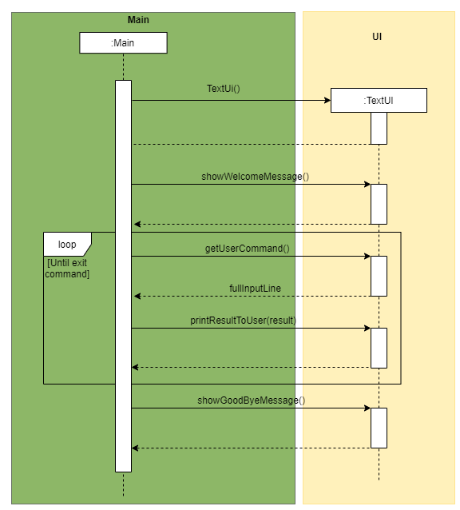
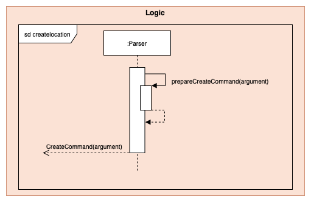
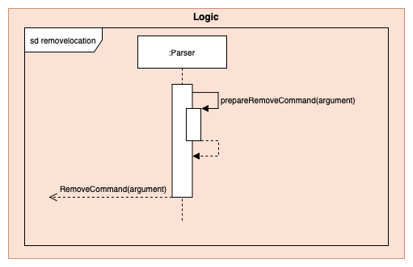
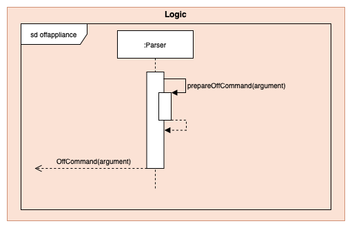
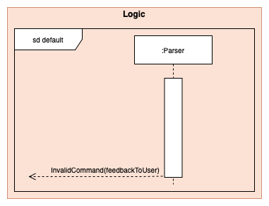
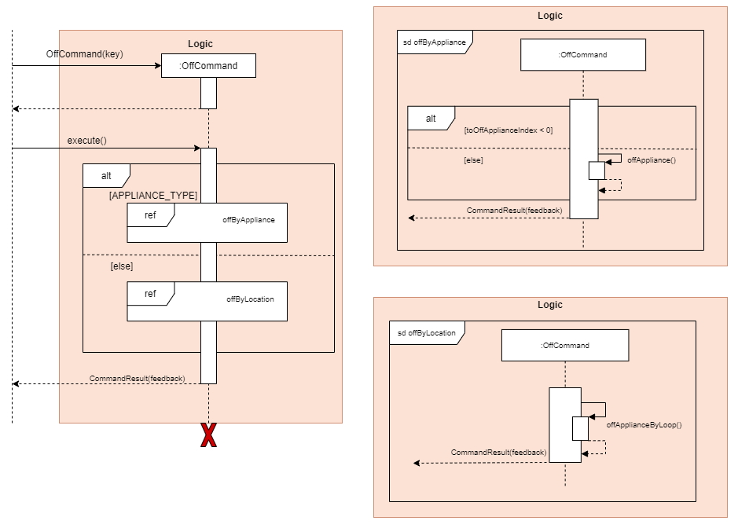
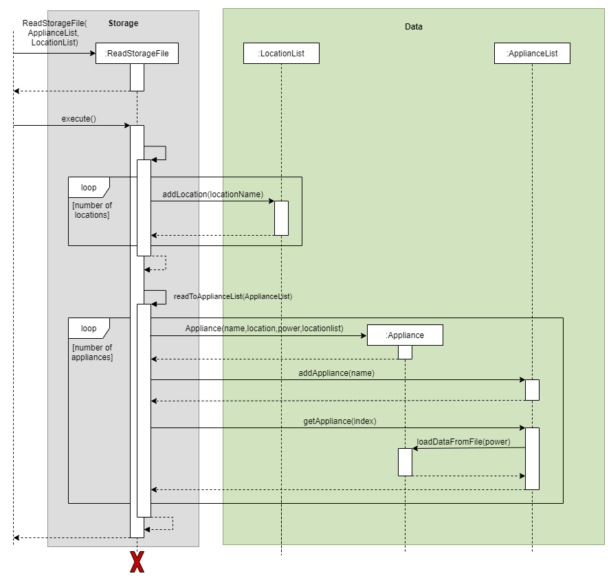

# Developer Guide

## Table of Contents
* [Setting up](#setting-up)
  * [Prerequisites](#prerequisites)
  * [Get Started](#get-started)
* [Design](#design) 
  * [Architecture](#architecture) 
  * [UI Component](#ui-component)
  * [Logic Component](#logic-component)
* [Implementation](#implementation)
  * [Detailed Data Component](#detailed-data-component)
  * [Command Component](#command-component)
  * [Storage Component](#storage-component)
  * [Parser Component](#parser-component)
* [Product scope](#implementation)
  * [Target user profile](#target-user-profile)
  * [Value proposition](#value-proposition) 
* [User Stories](#user-stories)
* [Non Functional Requirements](#non-functional-requirements)
* [Instructions for manual testing](#instructions-for-manual-testing)

## **Introduction**

SmartHomeBot is a desktop application tailored for users who are comfortable using a Command Line Interface (CLI), it 
allows users to control their smart devices at home and record all appliance power usage.

## **Setting up**

### Prerequisites

+ *JDK `11`* or above
+ Permission rights to create a file and folder in machine
+ At least 10Mb of free space on disk

### **Get Started**

Fork this repo and clone it into your computer.

Intellij IDEA User (highly recommended):
1. Configure the JDK to JDK 11.
2. Make sure you have enabled Grade extension, if disable please re-enable it back by going to `File`>`Settings`>`Plugins`.
3. Import the project as a Gradle project by selecting *build.gradle*
4. Verify the setup:
    Run the seedu.smarthomebot.Main and try a few commands.
    Run the Tests to ensure they all pass.
- - -

## Design
### Project overview

SmartHomeBot is built using java. SmartHomeBot can be built on any platform including Windows, MAC-OS and Linux. When 
running locally on these systems, SmartHomeBot has the ability to keep track of all the appliances registered into the 
program and control their operating systems through the program. SmartHomeBot also has a storage file that allows the 
saving and loading of data. This allows the SmartHomeBot to keep the information of the appliance and its parameters 
even after the program is turned off. 

### Architecture

   

The *Architecture Diagram* shown above explains the high-level design of SmortHomeBot Application. Given below is a brief overview of each component.

`Main` is responsible for initializing other components in correct sequence, and connects them up with each other.

`Commons` represents a collection of classes used by multiple components. 

The rest of the App consists of four components.
* `Ui`: The user interface where user can enter instructions and view output.
* `Logic` The command executor which consists of,
   * `Paser`: Extract the keyword from user input
   * `Commands`: Execute the specific command according to the keyword
* `Data` Holds the data in-app-memory while the program is running. 
* `Storage` Reads and writes data from and to a text file.

How the architecture components interact with each other

The *Sequence Diagram* below shows how the components interact with each other for the scenario where the user issues the command `create br1`.

   

The sections below give more details of each component.

### Ui Component

The class diagram of `TextUi` is shown below together with `Main`:

   

The sequence diagram of `TextUi` is shown below:

   

**API** : [TextUI.java](https://github.com/AY2021S1-CS2113-T14-1/tp/blob/master/src/main/java/seedu/smarthomebot/ui/TextUi.java)

The UI component which consists of TextUi,
* Prompt commands from the user.
* Execute user commands using the *Logic component*.
* Displays information based on changes to *Data*.
* Prints the SmartHomeBot appliance in a well-formatted form.

### Logic Component

The class diagram of `Logic Component` is shown below together with an example:

   

**API** : [Logic](https://github.com/AY2021S1-CS2113-T14-1/tp/tree/master/src/main/java/seedu/smarthomebot/logic)

1. Logic uses the **Parser class** to parse the user command.
2. This results in a **Command object**.
3. The command execution can affect the *Data* (e.g. adding a new location “br1” into its **LocationList**).
4. The result of the command execution is encapsulated as a **CommandResult object** which is passed back to the Ui.
5. In addition, the **CommandResult object** can also instruct the *Ui* to perform certain actions, such as displaying help to the user.
6. Shown above is the Sequence Diagram for interactions within the *Logic component* for the when user enter "create br1" and how the API call.

### Data Component
   

The *Data Component Diagram* shown above explains the high-level design of the Data which consists of `LocationList` which stores all the locations created by user, `ApplianceList` stores all the appliance which can be created from one of the types - `Fan`, `AirConditioner`,`Light`, or `SmartPlug`. Each appliance creates `Power` which used for computation of power usage. 
 
## Implementation

### Detailed Data Component 

The *Detailed Data Component* shown above explains the summarised model of SmartHomeBot. The four appliances classes are extended
from the abstract appliance class. 

   

To create an Appliance, we pass the name, location, wattage, power and the entire locationList. We first check from the 
locationList if the name of the appliance is inside the locationList, and the location exists within the locationList. 
If all these conditions are met, the Appliance will be created. It will be appended into the ApplianceList with the 
`addAppliance()` method. 

The Power class is responsible for computing the appliance’s power consumption.

The public methods in the Appliances accessible via the ApplianceList are used to manipulate the appliances such as
turning `ON` and `OFF`. From the appliance class, the program will be able to retrieving the name, location, statuses of
the appliances. 

### Parser Component

This section will describe how the Parser feature is implemented as well as the design consideration and rational. 

The main purpose of the Parser Class is to interpret the user inputs so that the correct command can be executed.  

Sequence Diagram when `parseCommand(userCommandText)` is initially called.  

The `userCommandText` is first capture by TextUi and then passed into parseCommand(userCommandText) method in Parser.
As shown in the Sequence Diagram above, different userCommandText will result in different paths being taken. 

Below is the list of commands available. 
* Help: `help`
* Create a location: `create`
* Remove a location: `remove`
* Add an appliance: `add`
* Delete an appliance: `delete`
* Switch ON an appliance: `on`
* Switch OFF an appliance: `off`
* Listing appliance/location: `list`
* Displaying usage of appliance: `usage`
* Resetting usage of appliance: `p_reset`
* Exiting the application: `exit`
 	
#### Sequence Diagram for `create`

When the user enters the `create` command, the `prepareCreateCommand(arguments)` is called. 
It will reject the input provided by the user if the `arguments` is empty or contain characters such as `/` or if the argument contains spaces in between. 
If the arguments is not rejected, it will return and construct a new CreateCommand object with arguments as the parameter to be created.  

For example: user input: `create bedroom1`. `prepareCreateCommand(bedroom1)` will return a new CreateCommand object to be executed to create the location `bedroom1` in the LocationList. 

#### Sequence Diagram for `remove`

When the user enters the `remove` command, the `prepareRemoveCommand(arguments)` is called. 
It will reject the input provided by the user if the `arguments` is empty. 
If the arguments is not rejected, it will return a new RemoveCommand object with arguments as the parameter to be used to remove a location in the LocationList. 

For example: user input: `remove bedroom1`. `prepareRemoveCommand(bedroom1)` will return and construct a new RemoveCommand object to be executed to remove the location `bedroom1` in the LocationList.  

#### Sequence Diagram for `add`

When the user enters the `add` command, the `prepareAddCommand(arguments)` is called. 
It will reject the input provided by the user if the l/[LOCATION_NAME] w/[WATTAGE] t/[APPLIANCE_TYPE] is not in this particular order. 
If the `arguments` entered are in the right order, it will split and reject if any of the parameters entered by the user is empty. 
Next, it will check to ensure that the [APPLIANCE_NAME] parameter does not contain characters such as `/` or spaces in between and [WATTAGE] is a valid int number from 1-9999. 
If all these conditions are fulfilled, it will return and construct a new AddCommand object with name, location, wattage and type as the parameters to be used to add an appliance to the ApplianceList. 

#### Sequence Diagram for `delete`

When the user enters the `delete` command, the `prepareDeleteCommand(arguments)` is called. 
It will reject the input provided by the user if the `arguments` is empty. If the arguments is not rejected, it will return a new DeleteCommand object with arguments as the parameter to be used to delete an appliance from the ApplianceList. 

For example: user input: `delete aircon1`. `prepareRemoveCommand(aircon1)` will return and construct a new DeleteCommand object to be executed to remove the location `aircon1` in the LocationList.  

#### Sequence Diagram for `on`

#### Sequence Diagram for `off`

 

#### Sequence Diagram for `list`

  
When the user enters the `list` command, the 
`prepareListCommand(arguments)` is called. It will check if the argument contains “appliance’ or ‘location”.
1. If the arguments contains “location”,  a new `ListCommand(LOCATION_TYPE, ““)` will be returned. 

2. If the arguments contains “appliance”, it will check if it contains a “l/” parameter. If it exist, it 
means there is a filteredLocation, thus a new `ListCommand(APPLIANCE_TYPE, filteredLocation)` will be returned.
Else, a new `ListCommand(APPLIANCE_TYPE, ““)` will be returned.

3. Any argument that does not contains “location” and “appliance” or contains “appliance” with a wrong 
format will return a `InvalidCommand` class with their respective error messages. 

#### Sequence Diagram for `commandword`

`commandword` refers to the following commands `help`, `usage`, `p_reset`, `exit`.
As these 4 commands does not require any additional parsing. The sequence diagram referred above will return their
respective CommandObject to execute the command. 

#### Sequence Diagram for `default`

When input provided by the User is not any of the commands available, it will return a new `InvalidCommand(MESSAGE_INVALID_COMMAND_FORMAT)`
that will be executed to inform the user that it is a ‘Invalid Command Format’.  

### Command Component
#### Help Command
To see the help usage for the commands in SmartHomebot, the `HelpCommand` class is used. This class' object is 
first created by the `Parser` class, where it is then returned to the `Main` class to have its `execute()` 
function called. When the `Main` class calls the `execute()` function, the `HelpCommand` 
will then return a new `CommandResult` class (which stores the Help message)

The sequence diagram for `HelpCommand` is shown below:

   

#### Create Command
To create a new location, the `CreateCommand` class is used. 
This class object is first created by the `Parser` class, where it is then returned to the `Main` class to have its `execute()` function called. 
The userEnteredLocation which was the argument parsed by the `Parser` will be used in LocationList’s addLocation(userEnteredLocation) function to create the location in the LocationList. 
After the location is created, it will then return a new CommandResult class to indicate the result of this process. 

If the userEnteredLocation already exists in the LocationList, it will return a new CommandResult class to indicate that the location already exists and could not be created.

The sequence diagram for `CreateCommand` is shown below:

  

#### Remove Command 
To remove a location, the `RemoveCommand` class is used. The class object is first created by the `Parser` class, where 
it is then returned to the `Main` class to have its `execute()` method called. The name of the location to be removed 
will be parsed into the `RemoveCommand` class. The `RemoveCommand` class will call the `removeLocation` method in 
`LocationList`, which will loop until the name of the location to be removed is found in the `LocationList`. 

Next, the `RemoveCommand` class will call the `deleteByLocation` method in `ApplianceList`, which will loop to look for all the appliance in the location to be removed and delete the appliance. 
If the name of the location to be removed is not found, the `RemoveCommand` will return the “location does not exist” message.

The sequence diagram for `RemoveCommand` is shown below:

  

#### Add Command

To add a new appliance, the `AddCommand` class is used. This class object is first created by the `Parser` class, where 
it is then returned to the `Main` class to have its `execute()` method called. The name,location,wattage, and type of 
the appliance will be parsed into the AddCommand class. The `AddCommand` class will perform the `execute()` method to 
convert the appliance into static (`Fan`, `AirConditioner`, `Lights`, `SmartPlug`) depending on their type. Then the 
appliance will be added into the ApplianceList. The name of the appliance has to be unique. 

The sequence diagram for `AddCommand` is shown below:

  

#### Delete Command

To delete an appliance, the `DeleteCommand` class is used. This class object is first created by the `Parser` class 
where it is then returned to the `Main` class to have its `execute()` method called. The name of the appliance to be 
deleted will be parsed into the `DeleteCommand` class. The `DeleteCommand` class will call the deleteAppliance method 
in the `ApplianceList` class, which will loop until the name of the appliance to be deleted is found in the 
`ApplianceList` and remove the appliance from the `ApplianceList`. If the name of the appliance to be deleted is not 
found, the `DeleteCommand` will return “appliance does not exist” message.

The sequence diagram for `DeleteCommand` is shown below:

  

#### On Command

The `OnCommand` shown below explains the Sequence Diagram of the OnCommand. When the Main class calls the execute() function there will be are 2 cases for on command to flow:
1. `OnByLocation`
2. `OnByAppliance`

The sequence diagram for `OnCommand` is shown below:

  

The program will determine if the user inputted: key is a name of an appliance, or a location.This is done by checking 
the key in the `LocationList`, if it exists, the program will deem it as `OnByLocation` vice versa.

1. `OnByLocation`  
The first condition checks if the user types in any parameter into the command, if so, the program will be unable to turn on
the appliances in the location. This is done as not all parameters are accepted by every appliance, for example,
`setTemperature` is only accepted for Air Conditioner. Thus, the parameter option is only opened to the `OnByAppliance` method.
Then, `onByApplianceLoop` will be called to turn on all appliances in the location.

2. `OnByAppliance`  
The first condition checks the index of the tagged appliance in the applianceList. If the index is negative, this signifies
that that key does not exist in the location or appliance list. Else, we will call the `onAppliance` method.

#### Off Command

When the Main class calls the `execute()` function there are 2 cases for off command:
1. `OffByLocation`
2. `OffByAppliance`

The sequence diagram for `OffCommand` is shown below: 

  

The program will determine if the user inputted: key is a name of an appliance or a location. This is done by checking 
the key in the LocationList, if it exists, the program will deem it as `OffByLocation` vice versa. 

1. `OffByLocation`  
This method will call offByApplianceLoop which turns off every appliance in that location.

2. `OffByAppliance`  
The first condition checks the index of the tagged appliance in the applianceList. If the index is negative, this 
signifies that that key does not exist in the location or appliance list. Else, we will call the `offAppliance` method.

#### List Command 

To list appliances or locations, the `ListCommand` class is used. This class' object is first created by the `Parser` class, 
where it is then returned to the `Main` class to have its `execute()` function be called.When the Main class calls the `execute()` 
function, ListCommand will call upon the function “list appliance” or  “list location”  in `ListCommand` class to 
determine whether to list the appliances or location, then return a new `CommandResult` class (which stores the list)

The sequence diagram for `ListCommand` is shown below:

   

As depicted from the diagram, there are 
2 cases for `ListCommand`:
1. `listAppliance`
2. `listLocation`

1) `listAppliance`  
This method checks for the user's key in a filteredLocation together with the “list appliance”. If there is no filteredLocation, 
it will just create a list of all the appliances in all the locations. Vice versa, if it exists a filteredLocation,it will 
just create a list of all the appliances in filteredLocation. 

2) `listLocation`  
This method creates a list of all the locations that stores in the locationList.

#### Usage Command

To find out the power consumption of each appliance and total power usage. This class object is first created by the `Parser` class, where it is then returned to the `Main` class to have its `execute()` method called. 
When the `Main` class calls the `execute()` function, `UsageCommand` will get the appliance’s details such as name, location, status and power usage as shown in the sequence diagram. Power consumption will be computed based on the appliance usage time with respect to the system time. If the appliance status is **on** it will get its time used with respect to the current system time. Thus, the power consumption will be calculated and displayed auto-formatted content to the user which returns a new `CommandResults` class.

The sequence diagram of `UsageCommand` is shown below when user enters *usage*:

  

#### Reset Command 

To reset the power consumption of each appliance and total power usage of SmartHomeBot back to zero. This class object is first created by the `Parser` class, where it is then returned to the `Main` class to have its `execute()` 
method called. When the `Main` class calls the `execute()` function, `ResetCommand` will then access the power class 
and reset the appliance power. A new CommandResults class will be returned to the main with a feedback message.

The sequence diagram of `ResetCommand` is shown below when user enters *p_reset*:

  

#### Invalid Command

If users key in the wrong command, the `InvalidCommand` class is used.This class' object is 
first created by the `Parser` class, where it is then returned to the `Main` class to have its `execute()`  
function be called. When the `Main` class calls the `execute()` function, `InvalidCommand` will 
return a new `CommandResult` class (which stores the Invalid message)

The sequence diagram for `InvalidCommand` is shown below:

   

#### Exit Command
To exit SmartHomeBot, the `ExitCommand` class is used. For this `ExitCommand`  class. This class' object 
is first created by the `Parser` class, where it is then returned to the Main class to have its `execute()` 
function be called. When the `Main` class calls the `execute()` function, the `ExitCommand` will off all the 
appliance and ,then return a new `CommandResult` class (which stores the Exit message)

The sequence diagram for `ExitCommand` is shown below:

   
#### CommandResult Command
The `CommandResult` class is used to store feedback to users and will interact with `UI` in the `Main`.

### Storage Component

#### Storage Module
The Storage module manages the load and save operations of the SmartHomeBot. It consist of two different classes, 
the `ReadStorageFile` class, and the `WriteToFile` class. As of the name stated, the function of `WriteStorageFile` class 
is to store the data into a .txt file for future usage. The `ReadStorageFile` class is to load the previously stored data 
from the .txt file back into the SmartHomeBot when it start up. 

The class diagram for storage module is shown below:

##### Process of writing data into Storage File
After each command input by the user, SmartHomeBot will perform the `execute()` method in SaveStorageFile. This allows
the program to continuously save the changes made by the user into the .txt file and prevent the lost of updates made 
by the user.

Within the `execute()` method, the `createFile()` method will be performed to create a new .txt file if there is no .txt 
file exist. Then the `clearFile()` method will be performed to empty .txt file. After that all the data updated by the 
user will be written into the .txt file. This process will be carried out each time the user input a command. The first
line in the .txt file will always be the LocationList and subsequent lines will be all the appliances, each occupying 
one line each. The appliances will be written together with their parameters in each line. 

The sequence diagram for `WriteStorageFile` is shown below:

##### Process of retrieving data back into the program
On startup, SmartHomeBot will perform the `execute()` method in ReadStorageFile. This allows the program to retrieve all 
stored data saved previously from the .txt file back into the program to be used again.

Within the `execute()` method, a Scanner object will be created to parse individual lines in the .txt file back into the 
program and converting them into String. The first line parsed into the program will be the locationlist, which will 
then be parse into the `readToLocationList(locations)` method. In the `readToLocationList(locations)` method, the 
locations will be added back into the `LocationList` one by one. Then the program will return back to execute(). 

The second line onwards in the .txt file will be the appliances. These appliances will be converted into String and 
parse into the `readToApplianceList` method. In the `readToApplianceList(appliance)` method, each line will be split up 
into their specific parameters(name,location, power, type, powerConsumption and parameter). Then the appliance will be 
converted into static (`Fan`, `AirConditioner`, `Lights`, `SmartPlug`) depending on their types. Then the appliance will 
be added back to the `ApplianceList`. The powerConsumption of each appliance will also be updated to keep track of the 
powerUsage of each appliance.

The sequence diagram for `ReadStorageFile` is shown below:

## Product scope

### Target user profile

Disabled Home Users who want to automate/monitor their home with smart home devices.

### Value proposition

This program consolidates all the home appliance’s control into a centralised system. Users can also review and 
monitor electricity usage; having a clearer picture of their electrical usage patterns. We can extract the latest 
electricity price to calculate users’ utility bills. A backlog of the usage can also be recorded. 

## User Stories

|Version| As a(n) ... | I want to ... | So that I can ...|
|--------|----------|---------------|------------------|
|v1.0|Inexperienced user|list all the functions of the app |To see what he can do. |
|v1.0|New user |add new locations into SmartHomeBot|Tag these locations into appliances |
|v1.0|New user |add new appliances|Manipulate and view his appliances usage|
|v1.0|disabled user |On/Off appliances|Turn on and off appliances without moving much|
|v1.0|Lazy user|list all the appliances in SmartHomeBot|Remove unnecessary locations and appliances|
|v1.0|Calculative user |View usage of his appliances|View all the appliances and see their status|
|v2.0|Lazy user|Change the temperature of the air-conditioner and the speed of the fan from SmartHomeBot|Monitor his smart home appliances|
|v2.0|Experienced SmartHomeBot user|On/OFF appliances by location and list appliances by location|Easily view and manipulate appliances by location|

## Non-Functional Requirements

{Give non-functional requirements}

## Glossary

* *glossary item* - Definition

## Instructions for manual testing

{Give instructions on how to do a manual product testing e.g., how to load sample data to be used for testing}
