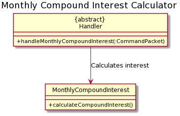

# Developer Guide

## Overview of architecture
There are 5 distinct features that exists within the FinanceIt application, all of which are accessed via the main menu 
interface facilitated in FinanceIt.java.
### Architecture

* __Feature modules__: Modules implementing the features of the application as follows:

    | Feature| Purpose|
    |-------|-------|
    |Manual Tracker| User can manually record daily transactions into the program
    |Recurring Tracker|
    |Goal Tracker|
    |Finance Tools|
    
* __Helper modules__: Modules that serve auxillary purposes to the program

    | Feature| Purpose|
    |-------|-------|
    |Data| Represents data relevant to the program.
    |Ui| Handles console output and user input at user interface.
    |Logic| Describes param handling and checking logic.
    |Storage| Handles saving and loading of program data.
    |Error Handling.Exceptions| Exception classes unique to each program error identified.
    |Error Handling.LoggerCentre| Class that consolidates ```Logger``` instances used throughout the program.

## Design & implementation

### Summary
* Classes which require input parameters by users require the collection of
helper classes to handle the parsing, checking and organisation of the input string.
* The handling of parameter input is isolated into an abstract class, whereby classes which requires a param handling
feature will inherit from the abstract class.
* Specific behavior towards different ```param type```-```parameter``` pairs  will be defined within their 
own class declarations.

### Architecture
* The initialisation of ```Ledger``` and ```Entry``` instances can be
performed with reference to input parameters supplied from the user input.
* For ledger creation operations, the input from the user is parsed and passed into an initialized ledger instance
to handle. That is, the handling of input parameters is abstracted out from the tracker classes. 
<br> The handle operation will set the various attributes within the ledger in accordance to specifications inferred
from the user input. 
<br> If the ledger is successfully specified in full, it will be added to a ```ledgerList``` instance within the handler 
class ```ManualTracker```.
* For ledger deletion/open, a ledger will need to be selected from the ledger list maintained by the handler class.
<br>Hence, the input from the user is parsed and passed into a command instance to handle. If the input
is valid, the ledger list instance will assign a reference to the ledger selected to a public ```currLedger``` 
attribute. 
<br>After which, an operation of edit/open would be performed upon the ledger referenced from 
```currLedger``` in ```ledgerList```.


### Logic

#### Input Parsing

##### Input Conventions
* The user input is composed of the following format:
```
    <command> <param type> <parameter> <param type> <parameter> ...
```
* The ```command``` string determines the current state of the Finite State Machine, and
hence the function executed. 
* The remainder of the string includes a series of  ```param type``` - ```param``` combinations, whereby
```param type``` indicates the type of the parameter which is to be identified by the user class,
and ```param``` indicates the parameter that is associated with the ```param type```. 

* Param types are restricted to two types: 
    * ```/<string>```, requires a corresponding parameter.
        * Eg. ```param type```: ```/date```
              <br>  ```param``` : ```2020-04-04```
    * ```-<string>```, does not require a corresponding parameter. 
        * Reserved for param types which are used to specify a property to be true/false
        * Eg. ```-auto```, to specify if an entry has automatic deduction. 
        
##### Command Packet
* A helper class. Contains two particular attributes to store the user input in an organised fashion.
    * ```commandString``` :  ```String``` Store the command string from the input.
    * ```paramMap``` : ```HashMap``` Store the pairs of ```param type``` and ```param``` present in the input string.
        * Key: ```param type```
        * Value:  ```param```

##### InputParser
* A helper class. Parses the input string and returns a corresponding ```commandPacket```.
    * ```parseInput()```: 
        * Initializes a ```commandPacket``` and populates the ```commandString``` attribute.
        * Calls ParamParser instance to parse the segment of the input string
        that corresponds with the sequence of ```param type``` - ```param``` pairs, and
        return a HashMap populated with the aforementioned pairs.
        * Returns a fully populated ```commandPacket``` to be used by user classes.
         
##### ParamParser
* A helper class. Parses the subsequence of the input string that corresponds with sequence of 
```param type``` - ```param``` pairs.
    * Parsing of input for params via ```parseParams()```:
        * __Step 1__: Use a regex helper class ```RegexMatcher``` to identify and extract ```param type``` that matches the 
        pattern specified in "Input conventions":
        ```
        Param types are restricted to two types: 
          /<string>, requires a corresponding parameter.
              Eg. param type: /date
                    <br>  param : 2020-04-04
          -<string>, does not require a corresponding parameter. 
              Reserved for param types which are used to specify a property to be true/false
              Eg. -auto, to specify if an entry has automatic deduction. 
        ```
        * __Step 2__: Identify the substring of the rest of the input string before the next ```param type``` or end-of-line, 
        as the ```param``` to the previously identified ```param type```. Extract it from the input string.
        * __Step 3__: Put the ```param type``` - ```param``` pair into a ```HashMap```.
        * __Step 4__: Repeat steps 1 to 4 until there is the input string is fully extracted.
        * __Step 5__: Return a ```HashMap``` populated with the aforementioned pairs.

### Param Handling

#### ParamHandler
* An abstract class that defines all param handling behavior. 
    * Handling of params via```handleParams(packet)```:
        * Initialize the state of the handler 
            * Children class of ```ParamHandler``` call ```setRequiredParams()``` to set required Params that need to be parsed successfully to constitute an overall successful parse.
            * Resetting String arrays in the following ```param``` arrays:
                * ```missingRequiredParams```
                * ```paramsSuccessfullyParsed```
            * Set the ```CommandPacket``` instance in ```ParamChecker``` by calling ```ParamChecker.setPacket(packet)```.
        * For every```paramType``` in the ```CommandPacket``` instance, execute ```handleSingleParam(packet)``` method. 
            1. ```handleSingleParam(packet)``` is an abstract method, and it is implemented by children classes of ```ParamHandler``` depending on the needs and requirements of that particular class.
        1. Check if the parse was successful. The condition below that define a successful parse is:
            1. All ```param``` in ```createLedgerCommand.requiredParams``` string array are parsed with no exceptions thrown.
        1. If parse is successful, the process ends gracefully. Else, throw ```InsufficientParamsException()```.

### Features
#### Main Menu
- Loading up user data
- Access to various features
- Saving outstanding user data to respective save files

#### Feature 1: Manual Tracker & Entry Tracker
##### Overview
__Ledgers and Entries__

In this feature, we represent the transactions incurred by the users as ```Entry``` instances.
Instances of ```Entry``` class are categorised by the date of origin, which is represented by
```Ledger``` instances.

```Entry``` instances are characterized by the following: 
* Time of transaction
* Type of transaction: Income/ Expense 
* Amount in transaction
* Category of spending/ expenditure
* Description

```Ledger``` instances are characterized by the following: 
* Time of transaction
* Collection of ```Entry```instances

##### Manual Tracker

The Manual Tracker is a feature that allows users to manage Ledgers with create, delete
and open operations. Ledgers is a class that maintains a list of transactions that are 
recorded for a given date. 

The Entry Tracker is fundamentally similar to the Manual Tracker, except it manages ```Entry``` instances
instead of ```Ledger```. Entry Tracker is initialized when a ```Ledger``` instance is "opened", whereby 
the Entry Tracker facilitate the manipulation of the collection of ```Entry``` instances that are associated with
that particular ```Ledger``` instance.

For the sake of brevity, this section will focus on the discussion of the Manual Tracker.

The Manual Tracker is capable of executing the following states of operation:

|States| Operations | 
|--------|----------|
|```MAIN_MENU```|Go to main menu for users to choose the available operations
|```CREATE_LEDGER```|Create a ledger specified by date, and append it to ```ledgerList```.
|```DELETE_LEDGER```|Delete an existing ledger, referenced by date or index.
|```OPEN_LEDGER```|Go to subroutine "Entry Tracker" for the entries recorded  under the specified ledger.

#### Architecture

##### Architecture Overview


|Module| Function | 
|--------|----------|
| ```Parser```|Parse inputs from user and return ```CommandPacket``` instance with organised ```commandString``` and ```paramMap``` 
| ```Tracker/ Handler```|Manages the overall workflow of the Manual Tracker; identifies operation required from input and executes the corresponding ```command```.
| ```Data``` |Refers to ```Ledger``` instances, stores relevant data of the day's transactions.
| ```Data List``` |Refers to ```LedgerList``` instances, maintains Ledger instances within the program. 
| ```Commands``` |Processes information from ```CommandPacket``` and executes the appropriate process from recognised params.
| ```Logic``` |Outlines the abstract behavior of commands, as well as handle verification of params with appropriate error handling.


##### Command and Logic


|Class| Function |
|--------|----------|
|```retrieveLedgerCommand```| Process ```paramTypes```-```param``` pairs from the ```CommandPacket``` instance to identify specified ```Ledger``` instance, then retrieves the instance from the existing ```LedgerList```.
|```createLedgerCommand```| Process ```paramTypes```-```param``` pairs from the ```CommandPacket``` instance to identify specified ```Ledger``` instance to be created, then creates the instance and append to existing ```LedgerList```.
|```retrieveEntryCommand```| Omitted and left as exercise for reader. : ^ )
|```createEntryCommand```| Omitted for brevity.
|```editEntryCommand```| Omitted for brevity.
|```ParamChecker```| Class contains a collection of methods that verify the correctness of the ```param``` supplied. <br><br> For instance, ```ParamChecker.checkAndReturnIndex``` checks if the index provided is out of bounds relative to the specified list, and throws the relevant exception if the input index is invalid. 
|```ParamHandler```| Abstract class that outlines the general param handling behavior of ```commands``` instances and other classes that need to handle ```params``` in its operation.  

##### Handler and Command


|Class| Function |
|--------|----------|
|```retrieveLedgerCommand```| Refer to section above.
|```createLedgerCommand```| Refer to section above.
|```retrieveEntryCommand```| Omitted for brevity.
|```createEntryCommand```| Omitted for brevity.
|```editEntryCommand```| Omitted for brevity.
|```ManualTracker```| Implements Manual Tracker. Contains handler methods that implements a particular operation capable by the Manual Tracker. <br><br> These methods use the above ```command``` instances for param handling operations from user input.
|```EntryTracker```| Omitted for brevity.

##### Handler and Parser


|Class| Function |
|--------|----------|
|```InputParser```| Breaks input string by user into ```commandString``` and a sequence of ```paramTypes```-```param``` pairs. <br><br> The latter subsequence of the string is passed into ParamParser for further processing. <br><br> Information obtained from input parsing will be used to populate an instantiated ```CommandPacket``` instance, which will then be passed to the entity that called the parsing function.
|```ParamParser```| Process the sequence of ```paramTypes```-```param``` pairs and populate the ```paramMap``` in the instantiated ```CommandPacket``` instance.
|```ManualTracker```| Refer to section above.
|```EntryTracker```| Omitted for brevity.

##### Handler and Data


|Class| Function |
|--------|--------|
|```ManualTracker```| Refer to section above.
|```EntryTracker```| Omitted for brevity.
|```EntryList```| Omitted for brevity.
|```Entry```| Omitted for brevity.
|```LedgerList```| Extends ItemList. Refer to Ledgers and Entries section for class behavior.
|```Ledger```| Extends DateTimeItem. Refer to Ledgers and Entries section for class behavior.
|```ItemList```| Class with defined list behavior specified with helper methods such as retrieval, checking of Duplicates and deletion.
|```DateTimeItem```| Abstract class that extends ```Item``` class; instances will have ```LocalDate``` or ```LocalTime``` attributes and corresponding helper methods.
|```Item```| Abstract class to define behavior of entities that need are stored in ```ItemList``` instances.

#### Functions with Sequence Diagrams

##### Creation of Ledger
1. At ```ManualTracker.handleMainMenu()```, the user's input is registered via ```java.util.Scanner``` instance.
1. Input is parsed by ```InputParser.parseInput()```, and ```ManualTracker.packet``` is set to the returned ```CommandPacket``` instance.
1. The ```commandString``` of the ```CommandPacket``` instance is evaluated, and the corresponding handle method() is executed.<br>
In this case, ```handleCreateLedger()``` will be called.
1. At ```handleCreateLedger()```, the following processes will be executed:
    1. A new instance of ```createLedgerCommand``` is created. The input String array will be passed into 
    ```createLedgerCommand.setRequiredParams()``` to set required params for a successful parse.
    1. A new instance of ```Ledger``` will be instantiated and set to ```createLedgerCommand.currLedger```.
    1. ```createLedgerCommand.handlePacket(packet)``` is called to handle params in the packet.
        1. Refer to the section on Param Parsing for more details pertaining to general param handling. 
        1. For ```createLedgerCommand```, the ```handleSingleParam``` abstract method will be implemented as follows:
        
            |ParamType|ParamType String| Expected Param | Operation | Verification method |
            |---------|----------------|----------------|-----------|---------------------|
            |```PARAM.DATE```|"/date"|Various format of date in string, eg. "2020-03-02"| Call ```currLedger.setDate()``` to set date for the ```Ledger``` instance. | ```ParamChecker.checkAndReturnDate(packet)```|
1. From ```ManualTracker```, the configured ```Ledger``` instance will be retrieved from the ```createLedgerCommand``` instance
and added into the ```LedgerList``` instance at ```ManualTracker.ledgerList```.
  


##### Deletion of Ledger
1. At ```ManualTracker.handleMainMenu()```, the user's input is registered via ```java.util.Scanner``` instance.
1. Input is parsed by ```InputParser.parseInput()```, and ```ManualTracker.packet``` is set to the returned ```CommandPacket``` instance.
1. The ```commandString``` of the ```CommandPacket``` instance is evaluated, and the corresponding handle method() is executed.<br>
In this case, ```handleCreateLedger()``` will be called.
1. At ```handleCreateLedger()```, the following processes will be executed:
    1. A new instance of ```createLedgerCommand``` is created. The input String array will be passed into 
    ```createLedgerCommand.setRequiredParams()``` to set required params for a successful parse.
    1. A new instance of ```Ledger``` will be instantiated and set to ```createLedgerCommand.currLedger```.
    1. ```createLedgerCommand.handlePacket(packet)``` is called to handle params in the packet.
        1. Refer to the section on Param Parsing for more details pertaining to general param handling. 
        1. For ```createLedgerCommand```, the ```handleSingleParam``` abstract method will be implemented as follows:
        
            |ParamType|ParamType String| Expected Param | Operation | Verification method |
            |---------|----------------|----------------|-----------|---------------------|
            |```PARAM.DATE```|"/date"|Various format of date in string, eg. "2020-03-02"| Call ```currLedger.setDate()``` to set date for the ```Ledger``` instance. | ```ParamChecker.checkAndReturnDate(packet)```|
1. From ```ManualTracker```, the configured ```Ledger``` instance will be retrieved from the ```createLedgerCommand``` instance
and added into the ```LedgerList``` instance at ```ManualTracker.ledgerList```.


### Feature 2: Recurring Tracker
##### Overview
##### Recurring Tracker
Recurring Tracker handles the creation, deletion and editing of recurring entries.

Entries use the class ```RecurringEntry```, and are stored in the ```RecurringEntryList``` class.

`RecurringEntry` has the following attributes:
* `day` - The day which the transaction occurs
* `description`
* `entryType` - Can be `Constants.EntryType.INC` or `Constants.EntryType.INC` 
depending on whether the entry is an income or expenditure respectively.
* `amount`
* `start` and `end` - Which months does the entry apply to. Set to 1 and 12 by 
default (i.e. occurs every month)
* `isAuto` - Indicates whether the entry is automatically deducted/credited from/to account, 
or manually deducted/credited from/to account
* `notes` - Any user-specified notes

`RecurringTrackerList` extends ItemList, and supports the following methods on top of inherited methods
* `addItem(Item)` - Override. Adds item and sorts according to the day in ascending order
* `getEntriesFromDayXtoY` - Returns an ArrayList of all entries that fall between day X and Y 
(provided by developer in the code, not by user). Mainly used for reminders

##### Reminders
Upon launching the program, the system date and time is recorded in `RunHistory`.

The program then checks if there are any entries upcoming within 5 days from the current date, and prints the entries out
as reminders.

1. Main code calls `MenuPrinter#printReminders()`, which in turn calls 
`ReminderListGenerator#generateListOfRemindersAsStrings()`. 
1. `ReminderListGenerator` checks the current date, and calculates the day of month which is 5 days from current date.
This is stored in `dayToRemindUntil`.
1. `ReminderListGenerator` then checks if `dayToRemindUntil` is after the last day of the current month. If it is,
then the reminder timeframe will overflow to the next month. 
    
    For example:
    * Current date is 29th October. There are 31 days in October. 5 days after today is 34th, 
    which is beyond last day of October.
    * Reminder timeframe will overflow to next month, until 3rd of November

1. If it has overflown, set `isOverflowToNextMonth` to true. Subtract the last day of month from `dayToRemindUntil`.
The new value of `dayToRemindUntil` is the day of next month that the reminder timeframe extends to.

    For example:
    * Continuing from example earlier, `dayToRemindUntil = 34`.
    * `dayToRemindUntil -= NUM_DAYS_IN_OCT`, i.e. 34 - 31
    * `dayToRemindUntil = 3`, representing that the reminder timeframe extends to 3rd of November
1. `ReminderListGenerator` then grabs the entries within the reminder timeframe from the list of all recurring entries.
    * If `isOverflowToNextMonth == true`, it will grab all entries from `currentDay` to `lastDayOfMonth` 
    and all entries from `1` (1st day of next month) to `dayToRemindUntil`
    * Else, it will simply grab all entries from `currentDay` to `dayToRemindUntil`

1. Lastly, the list of entries will be converted to a formatted String to be displayed as reminders, and passed back
to `MenuPrinter`, who will pass it to `UiManager` to print.

The sequence diagram below shows how it works:


#### Feature 3: FinanceTools
##### Overview
FinanceTools consists of the following features
1. Simple Interest Calculator
2. Yearly/Monthly Compound Interest Calculator
3. Cashback Calculator
4. Miles Credit Calculator
6. Account Storage
7. Command and Calculation History

##### Simple Interest Calculator
Simple Interest Calculator is facilitated by ```SimpleIntest``` class. It allows user to calculate interest earned.
When user inputs ```simple``` as a command, ```handleSimpleInterest``` from ```Handler``` class will handle user
inputted parameters. The calculation is done by ```SimpleInterest``` class. The result is outputted in
```FinanceTools.main()```.
<br />

__Parameters__
* ```/a``` - Amount (Mandatory)
* ```/r``` - Interest Rate (Mandatory)

The following class diagram shows how the Simple Interest Calculator feature works:
<br />


The following sequence diagram shows how the params are handled before the implementation is carried out:
<br />
.png)
<br />
<br />
The following sequence diagram shows how the Simple Interest Calculator feature works:
<br />
.png)

##### Yearly/Monthly Compound Interest Calculator
Yearly/Monthly Compound Interest Calculator is facilitated by ```YearlyCompoundInterest``` /
```MonthlyCompoundInterest``` class. It allows user to calculate interest earned.
When user inputs ```cyearly``` / ```cmonthly``` as a command, ```handleYearlyCompoundInterest``` /
```handleMonthlyCompoundInterest``` from ```Handler``` class will handle user inputted parameters. The calculation 
is done by ```YearlyCompoundInterest``` / ```MonthlyCompoundInterest``` class. The result is outputted in
```FinanceTools.main()```.
<br />

__Parameters (Yearly/Monthly Compound Interest Calculator)__

* ```/a``` - Amount (Mandatory)
* ```/r``` - Interest Rate (Mandatory)
* ```/p``` - Number of Years/Months (Mandatory)
* ```/d``` - Yearly/Monthly Deposit (Optional)

The following class diagram shows how the Yearly/Monthly Compound Interest Calculator feature works:
<br />


<br />
The following sequence diagram shows how the params are handled before the implementation is carried out:
<br />
.png)
<br />
<br />
.png)
<br />
<br />
The following sequence diagram shows how the Yearly/Monthly Compound Interest Calculator feature works:
<br />
.png)
<br />
<br />
.png)

##### Cashback Calculator
Cashback Calculator is facilitated by ```Cashback``` class. It allows user to calculate cashback earned.
When user inputs ```cashb``` as a command, ```handleCashback``` from ```Handler``` class will handle user
inputted parameters. The calculation is done by ```Cashback``` class. The result is outputted in
```FinanceTools.main()```.
<br />
__Parameters__
* ```/a``` - Amount (Mandatory)
* ```/r``` - Cashback Rate (Mandatory)
* ```/c``` - Cashback Cap (Mandatory)

The following class diagram shows how the Cashback Calculator feature works:
<br />


The following sequence diagram shows how the params are handled before the implementation is carried out:
<br />
.png)
<br />
<br />
The following sequence diagram shows how the Cashback Calculator feature works:
<br />
.png)

##### Miles Credit Calculator
Miles Credit Calculator is facilitated by ```MilesCredit``` class. It allows user to calculate miles credit earned.
When user inputs ```miles``` as a command, ```handleMilesCredit``` from ```Handler``` class will handle user
inputted parameters. The calculation is done by ```MilesCredit``` class. The result is outputted in
```FinanceTools.main()```.
<br />
__Parameters__
* ```/a``` - Amount (Mandatory)
* ```/r``` - Miles Rate (Mandatory)

The following class diagram shows how the Miles Credit Calculator feature works:
<br />


The following sequence diagram shows how the params are handled before the implementation is carried out:
<br />
.png)
<br />
<br />
The following sequence diagram shows how the Miles Creidt Calculator feature works:
<br />
.png)

##### Account Storage 
Account Storage feature is facilitated by ```AccountStorage``` class. It allows user to store account
information such as name of account, interest rate, cashback rate, etc. When user inputs ```store``` as command,
```handleAccountStorage``` from ```Handler``` class will handle user inputted parameters and store information 
accordingly. The implementation is done by ```handleInfoStorage``` from ```AccountStorage``` class. Afterwards, this 
information is stored into a txt file which is done by ```updateFile``` from ```AccountSaver``` class.
<br />

Additionally, it implements the following operations:
* ```info``` - list account(s) information
* ```clearinfo``` - clear all information
* ```store /rm <ACCOUNT_NO>``` - delete corresponding account number in list

__Parameters__
* ```/n``` - Account Name (Optional)
* ```/ir``` - Interest Rate (Optional)
* ```/r``` - Cashback Rate (Optional)
* ```/c``` - Cashback Cap (Optional)
* ```/o``` - Other Notes (Optional)
* ```/rm``` - Account Number (Optional)

###### Details
```handleInfoStorage``` stores the user inputted information into an ArrayList which is then passed into
```updateFile``` to update the txt file. The purpose of using txt file is so that when the user exits and enters the
program again, the information is retained, and the user does not have to re-enter the account information(s) again.
<br />
 
When user first enters FinanceTools in the program, ```readFileContents``` reads 5 lines in the txt file consecutively
in a ```while``` loop because these 5 lines consists of information that belong to a particular account. These
categories include: Name, Interest Rate, Cashback Rate, Cashback Cap and Notes". Doing so helps to facilitate
the ```delete``` option where instead of deleting single lines, we can delete the entire account information
which correspond to a particular account because the information is stored in one index of the ArrayList.
<br />
 
The following class diagram shows how the Account Storage feature works:
<br />


The following sequence diagram shows how the params are handled before the implementation is carried out:
<br />
.png)
<br />
<br />
The following sequence diagram shows how the Account Storage feature works:
<br />
.png)
<br />
<br />
.png)
 
#### Command and Calculation History
To store the commands inputted by user and results from calculations in FinanceTools, an ArrayList is used.
The commands are stored before the params are handled and implementation is executed. The results from calculation
is stored when the implementation has finished executed.

#### Feature 4: Goal Tracker
##### Set Expense Goal Feature
The set expense goal feature is being implemented by ```GoalTracker```. It allows the user to set an expense goal for
the respective month to ensure that the user does not overspent his budget. 
When user enter ```expense 2000 for 08```, the command will be sent to InputParser and parse it into String[].
With the String[], it will be sent to a class called ```Goal```, and it will store the individual information.
Afterwards, it will be added to a ArrayList in a class called ```TotalGoalList```. 
 
Not only that, ```GoalTracker``` also implemented a feature called ```set income goal``` that works almost the same as 
set expense goal feature with just slight command difference.
 
 `Format:`
* setExpenseGoal: expense 5000 for 08
* setIncomeGoal: income 5000 for 08
 
##### How it works?
Firstly, user will input the command based on the `Format`.
Secondly, the input command will be sent to InputParser to parse.
Thirdly, the parsed information will be sent to class `Goal` to store the individual information
Next, it will be added to a ArrayList in class `TotalGoalList`.
Lastly, the goal status will be displayed to the user.  
 
This class diagram will show how the setting of expense goal works:

 
This sequence diagram will show the flow of setting of expense goal:


#### Feature 5: Save Manager
##### What it does
Save Manager is a tool designed for backup and storage of all data associated with Goal tracker, Manual tracker and recurring tracker.
It allows multiple saves to be created and loaded at will.

##### Overview
Save Manager is the backup storage and Ui program for the various save handler subclasses. Without Save Manager, save handler alone
will only save one copy of goal tracker, manual tracker and auto tracker information upon exiting the program and load them upon
start up.

##### Save Manager Sequence Diagram


## Product scope
### Target user profile

{Describe the target user profile}  
Fresh computing graduates who are just starting to enter the workforce.
* Have limited income/budget
* Little experience in personal financial management
* Busy juggling their various job applications and interview which might cause them to lose track of their expenditure/ 
bill payments
* First time drawing salary and lack experience in income tax filling

### Value proposition

{Describe the value proposition: what problem does it solve?}  
**Expenditure Tracker**
* Input itemised spending on a daily basis
* Sum the monthly/weekly expenditure, as well as average weekly/daily expenditure
* Categorise expenditures (e.g. food, transport etc) and sort by category

**Budget Management**
* Set a budget (monthly)
* Remind users of how much budget they have left for that month
* Edit the budget (monthly)
* Display the budget for that month

**Bill Tracker**
* Remind users of payment due dates
* Monthly tracker for each individual bill, visualise trends in bill spending

**Finance Tools**
* Calculate simple interest
* Calculate compound interest with optional monthly/yearly deposit
* Calculate cashback earned
* Calculate miles credit earned
* Save account information for reference

## User Stories

|Version| As a ... | I want to ... | So that I can ...|
|--------|----------|---------------|------------------|
|v1.0|new user|see usage instructions|refer to them when I forget how to use the application|
|v2.0|user|find a to-do item by name|locate a to-do without having to go through the entire list|

## Non-Functional Requirements

{Give non-functional requirements}

## Glossary

* *glossary item* - Definition

## Instructions for manual testing

{Give instructions on how to do a manual product testing e.g., how to load sample data to be used for testing}
