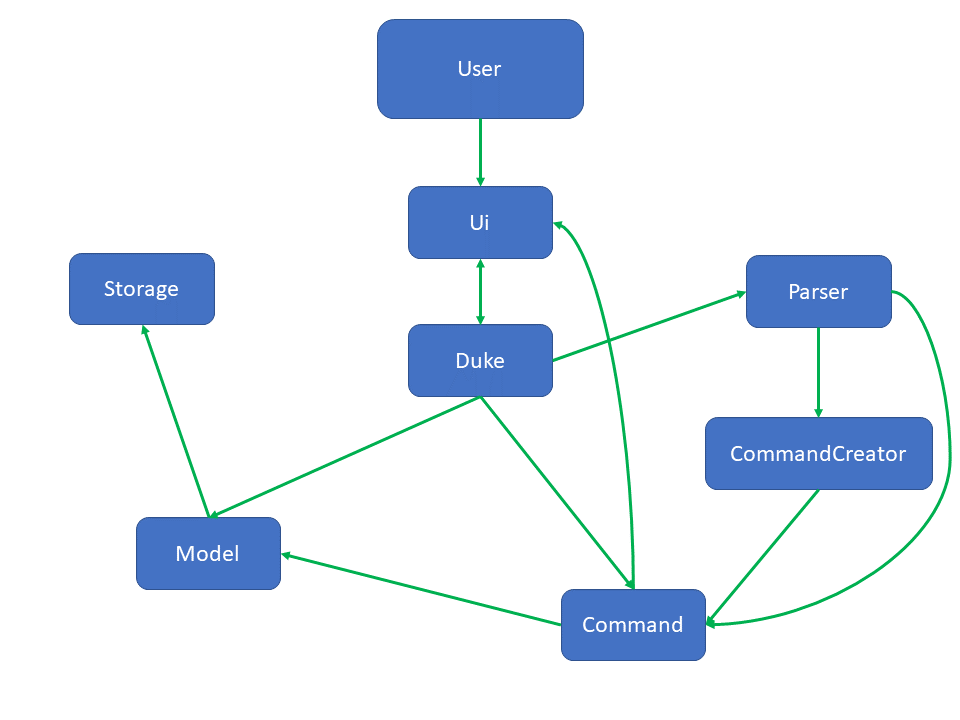
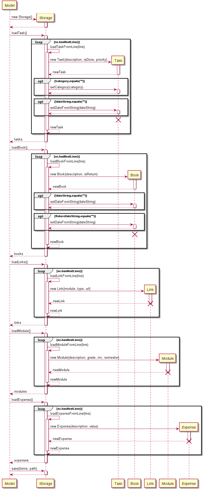

<h1 align="center">termiNus Developer Guide</h1>
{:.no_toc}

* Table of contents
{:toc}

## Introduction

termiNus is an interactive Command Line Interface (CLI) task manager for undergraduate students in NUS. 
This program will help them achieve a better grip on their school life as well as assist in better management of their 
daily expenses and be reminded of any library loans. 

This guide gives an overview understanding of the architectural design and implementation of termiNus. It will
assist developers in the knowledge they require to further build upon this application. We hope you have a clearer picture
after reading through our Developer Guide. <br>

**Pre-requisite:** Proficient in comprehending UML diagrams and notations.   

## Setting up, Getting Started

### Setting up the project in your local machine 
Ensure that you have JDK 11 or above installed on your computer. 

First, **fork** this [repo](https://github.com/AY2021S1-CS2113-T14-3/tp), and **clone** the fork to your local machine. 

If you plan to use IntelliJ IDEA (highly recommended):
1. Ensure IntelliJ IDEA is configured to use JDK 11.
    * Open IntelliJ and a welcome screen should appear.
    * Click on `Configure` -> `Structure for New Projects` -> `Project Settings` -> `Project`.
    * Under the `Project SDK:` section, select **java version "11.0.8"** or higher).
1. Import the project as a Gradle project.
    * Ensure Gradle plugin is enabled by going to `File` -> `Settings` -> `Plugins`.
    * Under the `Installed` section go to `Build Tools` and enable Gradle. 
    * At the welcome page, click on `Open or Import`.
    * Locate the `build.gradle` file within the folder that contains the clone repo and select it.
    * Choose the `Open as Project` option when asked.
    * Accept all default settings and wait for the project to import. 
1. Verify the setup.
    * Under the `seedu.duke` package, locate the `Duke` class and run it.
    * Try a few commands. You may want to refer to the [user guide](https://ay2021s1-cs2113-t14-3.github.io/tp/UserGuide.html).
    * **Run the tests (NOT SURE ABOUT THIS!) to ensure they all pass**.

### Before writing the code 
1. Configure the coding style
    * If using IntelliJ IDEA, follow this [guide](https://se-education.org/guides/tutorials/intellijCodeStyle.html) to set up IDEA's coding style to match ours.
1. Set up CI
    * This project comes with a GitHub Actions config files (in `.github/workflows` folder). When GitHub detects those files, 
    it will run the CI for the project automatically at each push to the `master` branch or to any PR.
    **No setup is required for this**.
    
1. Learn the design
   * When you are ready to start coding, we recommend that you refer to [termiNus's architecture] (#LINK TO DG ARCHITECTURE DESIGN)
   to get a better idea of the overall design.
   
## Design

<!-- @@author iamchenjiajun -->
### Architecture

#### Architecture Diagram
Below is an architecture diagram of termiNus.



- `Duke` is the main object of the program and handles all the logic and models related to the program.
- `Ui` is the main object that provides an interface between `Duke` and the user.
- `Command` represents a command that is provided by the user. `Ui` reads the command before it is sent to `Parser` to create a new `Command` object.
- `Parser` creates a command object by parsing the user's arguments and sending them to `CommandCreator`, which returns a `Command` object. For instances where no arguments are needed (such as `ByeCommand`), Parser creates the `Command` object directly.
- `Duke` executes the `Command` and shows the output to the user through `Ui`.
- `Command` object modifies the state of `Model`, which consists of multiple lists for different types of `Items`.
- `Storage` takes the state of `Model` and stores it to file.

#### Sequence Diagram
Below is a sequence diagram of how the main program functions.


- First, the `main` function of the `Duke` class creates an instance of `Duke`.
- During the instantiation of `Duke`, a `Model` object is created.
- `Duke` loads the state of `Model` from file by calling the `load()` method of `Model`.
- After `Duke` is initialized, the `Duke` class calls the `run()` method of `Duke`.
- `Duke` calls methods from `Ui` class and shows messages to the user.
- `Duke` reads user commands using the `Ui` class (which acts as an interface between `Duke` and the user).
- `Command` object is returned to `Duke` which is executed.
- `Command` object interacts with `Model` and changes its state.
- `Duke` saves the state of `Model` to file by calling the `save()` method of `Model`.
- `Duke` continues reading commands until a `ByeCommand` is generated by the user.
<!-- @@author -->

### Ui component (not done yet )

<!-- @@author iamchenjiajun -->
### Parser component

The `Parser` class is a class forming part of the logic of termiNus. The `Parser` parses user commands and
returns a `Command` subclass which corresponds to the full command with arguments.

#### High level description

The `Parser.parse()` method takes in `fullCommand` as an argument, which is the full command entered by the user.

Example commands:
- `add task tP meeting c/cs2113 p/0`
- `add module CS2113 mc/4 ay/2021S1 g/A`

The `fullCommand` is composed of several parts, which consists of a root command (`add`), description (`module CS2113`)
and optional arguments (`mc/4 ay/2021S1 g/A`).

An optional argument consists of 2 parts, which is delimited by a forward slash. In the example above, there are 3 optional
arguments, which are `mc/4`, `ay/2021S1` and `g/A`. Each optional argument can be represented in this form: `<key>/<value>`.

In some commands, the optional arguments may be compulsory and is checked by the `Parser` at runtime.

The `parse` method parses the `fullCommand` into these parts before passing them as arguments to `CommandCreator`
methods and returns a `Command` object with the corresponding arguments.

#### Implementation details

The following sequence diagram shows how the `Parser` works.


The following diagram shows how a command should be parsed into its separate parts.


1. The `parse` method of `Parser` is invoked by the calling object. In termiNus, the only object that invokes this
method is `Duke`. The `fullCommand` is passed an argument, which is the full command entered by the user.
1. The method parses `fullCommand` into two separate `Strings`, which are `rootCommand` and `commandString`.
`rootCommand` contains the first word of the command and `commandString` contains the rest of the command with the first
word removed. This is done using the `split` method of the `String` class, then removing the `rootCommand` from the 
`fullCommand` before storing it in `commandString`.
1. The method then invokes the `removeArgumentsFromCommand` method to parse and remove optional arguments from the full
command. This is done using regular expression parsing which is detailed in the next section. The results are returned
to the `parse` method and stored in `description`.
1. The method then invokes the `getArgumentsFromRegex` method to parse the optional arguments from the full command.
The results are stored in a `HashMap<String, String>`, which is a `HashMap` of key-value pairs, similar to the form of the
optional argument (`<key>/<value>`). The results are returned to the `parse` method and stored as `argumentsMap`.
1. The method then checks the `rootCommand` and decides which `Command` to return, which calls `CommandCreator`
methods with the parsed `argumentsMap`, `description`, and `commandString`.
1. The results of the `CommandCreator` methods are returned as a `Command` back to the invoker of the `parse` method.

#### Regular expression parsing

Two of the previously mentioned methods, `removeArgumentsFromCommand` and `getArgumentsFromRegex` make use of regular
expressions to parse the optional arguments.

The diagram below illustrates how the regular expression matches an optional argument.


- The regular expression that parses these optional arguments is `([\w]+/[^\s]+)`. This regular expression matches 1 or more
alphanumeric characters (denoted by `[\w]+`), followed by a forward slash, then 1 or more of any character except whitespace (denoted by `[^\s]+`).
- The expression also uses capturing parenthesis to ensure that the parser does not parse the same argument twice.

#### Design considerations

- The results of `getArgumentsFromRegex` are stored as a `HashMap` instead of `ArrayList` or simply returned as a value.
This allows the same method to be reused for different commands, which may accept different optional arguments with
different key-value pairs. This ensures that the code follows DRY principles.
- The regular expressions parsing means that we do not need to manually parse every different command with different
arguments, thus reducing code complexity and SLOC.

<!-- @@author -->
### Command component (not done yet )

<!-- @@author GuoAi -->
### Storage component  

The `Storage` class is a class loading data from files when termiNus starts and saving data to files after each command.

#### High level description

Methods handling data loading (i.e. `loadTask()`, `loadBook()`, `loadLinks()`, `loadModule()` methods) 
return an `ArrayList` of `Item`s (i.e. `Task`, `Book`, `Link`, `Module`). These will be the initial values of 
the `ItemList`. The `save()` method takes an `ItemList` and a `String` specifying the path to which the file will be 
saved. The `ItemList` will be parsed and saved into files (each `ItemList` will be saved to a separate file) at the 
specified path.  
  
Formats of the files: 
  
- `tasks.txt`:  
  
There are 6 fields stored for each `Task`:  
1. String `T` for "Task"  
2. Whether the `Task` has been done or not (1 for done, 0 for not done)  
3. Description of the `Task`  
4. Priority of the `Task` (an Integer)
5. Category of the `Task`
6. Date of the `Task`  
  
All the fields are separated by `|` with a leading and a trailing space. Each `Task` is stored as one line.  
  
Example: `T | 0 | borrow book | 1 | book | 28-10-2020`  
  
- `books.txt`:  

There are 5 fields stored for each `Book`:  
1. String `B` for "Book"  
2. Whether the `Book` has been returned or not (1 for returned, 0 for not returned)   
3. Name/Description of the `Book`  
4. Borrow date of the `Book`  
5. Return date of the `Book`  

All the fields are separated by `|` with a leading and a trailing space. Each `Book` is stored as one line.  
  
Example: `B | 0 | cooking book | 11-11-2011 | 11-12-2011`  
  
- `links.txt`:  

There are 3 fields stored for each `Link`:  
1. Module of the `Link`  
2. Use of the `Link`  
3. URL of the `Link`  
  
All the fields are separated by `|` with a leading and a trailing space. Each `Link` is stored as one line.  

Example: `CS2113 | lecture | https://cs2113Lecture.zoom.com`  
  
- `modules.txt`:  

There are 4 fields for each `Module`:  
1. Module code  
2. Grade  
3. Modular credits  
4. Academic year and semester  

All the fields are separated by `|` with a leading and a trailing space. Each `Module` is stored as one line.  
  
#### Implementation details

The following sequence diagram shows how the `Storage` works.


  
1. At the start of `Duke`, a new `Storage` object will be created.
2. `Duke` calls loading methods (i.e. `loadTask()`, `loadBook()`, `loadLinks()`, `loadModule()`) 
sequentially. Each loading method calls the corresponding helper method (i.e. `loadTaskFromLine()`, `loadBookFromLine()`, 
`loadLinkFromLine()`, `loadModuleFromLine()`) to load `Item`s from each line in the file. 
3. After each command, `Duke` calls the `save()` method of `Storage` to save all the `Item`s in the list to files.

 
## Implementation
This section describes how certain features are implemented.

### List feature

<!-- @@author Cao-Zeyu -->
#### List tasks
The list tasks feature allows the user to list all the tasks tracked.
This feature is facilitated by `ListCommand`. 
1. The user inputs the command `list tasks`. (Assuming the task list is not empty)
1. The full command string will be parsed by `Parser`, whose `parse()` method returns a `CommandCreator` object to create a `ListCommand`.
1. The method `createListCommand()` in `CommandCreator` further parses the input by identifying the keyword `tasks`, and returns a `ListCommand` for the whole task list.
1. The command is executed and the complete list of all the tracked tasks is displayed.

#### List tasks with priority
The list tasks with priority feature allows the user to list tasks of a certain priority.
This feature is facilitated by `Parser` and `ListCommand`.
1. The user inputs the command `list tasks p/3`. (Assuming the tasks of CS2113 is not empty)
1. The full command string will be parsed by `Parser`, whose `parse()` method returns a `CommandCreator` object to create a `ListCommand`.
1. The method `createListCommand()` in `CommandCreator` further parses the input by identifying the keyword `tasks` and `p/`, and returns a `ListCommand` for the task list of priority level 3.
1. The command is executed and the list of tasks with level 3 priority is displayed.

#### List tasks with category
The list tasks with category feature allows the user to list tasks of a certain category.
This feature is facilitated by `Parser` and `ListCommand`.
1. The user inputs the command `list tasks c/CS2113`. (Assuming the tasks of CS2113 is not empty)
1. The full command string will be parsed by `Parser`, whose `parse()` method returns a `CommandCreator` object to create a `ListCommand`.
1. The method `createListCommand()` in `CommandCreator` further parses the input by identifying the keyword `tasks` and `c/`, and returns a `ListCommand` for the task list under CS2113 category.
1. The command is executed and the list of tasks categoried by CS2113 is displayed.

#### Add links
The add links feature allows the user to add and save zoom meeting links of modules.
This feature is faclitated by `Parser`, `AddCommand` and `Storage`.
1. The user inputs `add links m/CS2113 t/lecture u/https://nus.sg.zoom.us/cs2113/lecture`.
1. The full command string will be parsed by `Parser`, whose `parse()` method returns a `CommandCreator` object to create a `AddCommand`.
1. The method `createAddCommand()` in `CommandCreator` further parses the input by identifying the keyword `link`, and returns a `AddCommand`.
1. The command is excuted and the links is added into the link list with module name and online class type.
1. `Storage` saves the added link by writing it into the `links.txt` file.

#### List links
The list link feature allows the user to list all the zoom meeting links.
This feature is facilitated by `Parser` and `AddCommand`.
1. The user inputs `list links`. (Assuming the link list is not empty).
1. The full command string will be parsed by `Parser`, whose `parse()` method returns a `CommandCreator` object to create a `ListCommand`.
1. The method `createListCommand()` in `CommandCreator` further parses the input by identifying the keyword `links`, and returns a `ListCommand` for the link list.
1. The command is excuted and the complete list of links is displayed.
<!-- @@author -->

### Calendar feature

<!-- @@author iamchenjiajun -->
#### Calendar command
The calendar command allows users to print out a calendar view of their tasks within the next `X` days, where `X` is a parameter passed by the user.

1. `CalendarCommand` obtains a list of tasks from `TaskList` by using its `getTaskList` method, which returns an `ArrayList` of `Task` objects.
1. The list of tasks is converted into a `Stream`.
1. The `Task` objects without dates are filtered out.
1. The `Task` objects outside the range of the current date and `X` days of the current date are filtered out.
1. The `ArrayList` is sorted by task dates, which uses a `Comparator` defined in the parameters.
1. The `Stream` is collected back into an `ArrayList`, which has sorted dates of tasks within the next `X` days.
1. The `ArrayList` of `Task` objects are passed to the `Ui.dukePrintCalendar` method, which prints the tasks as a calendar.
1. The `dukePrintCalendar` method groups tasks by date and a new heading is printed for each day. This is done by comparing each `Task` in the loop with the
previous task to check if they have the same date, and to print a new heading if not.

The filtering of the tasks by date is done using this code, which is called on a `Stream` object.
```
    .filter(task -> currentDate.until(task.getDate(), ChronoUnit.DAYS) >= 0)
    .filter(task -> currentDate.until(task.getDate(), ChronoUnit.DAYS) <= daysToPrint)
```

The sorting of tasks by date is done using this code, which is also called on a `Stream` object.
```
    .sorted(Comparator.comparing(Task::getDate))
```

This sorts the stream using a `Comparator` which is defined inline. The `Comparator` makes use of the `Task.getDate()` method to do the comparisons.
This is done instead of defining a new `Comparator` class as `toCompare` is already implemented in the `LocaDate` API, and doing this simplifies the code.
<!-- @@author -->

## Appendix: Requirements

### Product scope

<!-- @@author MuhammadHoze -->
#### Target user profile
Undergraduate students of National University of Singapore who:
- require help to better manage their school work.
- forgets to return their loan books to the library on time.
- wants a timetable planner for easy reference.
- are lazy to create separate module folders every semester.
- wish to calculate their CAP.

#### Value proposition
termiNus is an application which helps NUS undergraduates to better manage their school life, by providing daily task or
borrowed books tracking, and module-related functions. This increase users' efficiency and make their life more organized.

### User Stories
| Version | Priority | As a ... | I want to ... | So that I can ...|
| -------- | ---------- | ---------- | --------------- | ------------------ |
| v1.0 | *** | student | add tasks into a list | keep track of the things I need to do |
| v1.0 | *** | student | assign priorities to tasks | focus on the more important things first |
| v1.0 | ** | student | assign categories to tasks| have a more organised task list |
| v1.0 | *** | student | mark tasks as done| keep track of the remaining tasks to do |
| v1.0 | ** | student | list all tasks in my list| have a better overview |
| v1.0 | *** | student | be able to delete unwanted tasks| focus on the tasks which I need |
| v1.0 | *** | student | save all data after using the application| retrieve the data upon running the application |
| v2.0 | ** | student | automatically create folders for my modules| I do not have to manually create them |
| v2.0 | *** | student| add recurring tasks| avoid adding the same tasks every week |
| v2.0 | *** | student | have a calendar| I can view my current and upcoming tasks |
| v2.0 | *** |student| be able to set a tracker my borrowed books| avoid overdue fines | 
| v2.0 | ** | student | sort my tasks based on highest priority | focus on those tasks first |
| v2.0 | *** | student | save zoom links in a centralized place | easily attend my online classes instead of looking through my email for the link | 
| v2.0 | *** | student | add modules and calculate my CAP| have a better projection of my grades and efforts |
| v2.0 | * | student | login with a password | my system is protected |

**Take note** : `*` Low priority (Unlikely to implement) , `**` Medium priority (Consider implementing) ,  `***` High priority (Must implement)
 <!-- @@author -->

### Non-Functional Requirements

1. Should work on any *mainstream OS* as long as it has `Java 11` or above installed.

2. Should be able to respond to any command in less than 2 seconds.

3. A user should be able to complete majority of tasks faster using CLI than GUI.

### Glossary

**UML** - Unified Modeling Language <br>
**CLI** - Command Line Interface <br>
**GUI** - Graphical User Interface <br>
**Mainstream OS** - Windows, Linux, Unix, OS-X <br>
**SLOC** - Source Lines of Code <br>
**DRY** - Don't Repeat Yourself *(Every piece of knowledge must have a single, unambiguous, authoritative representation within a system)* <br>
**CAP** - Cumulative Average Point

## Appendix: Instructions for manual testing
Below are the steps required for manual testing of termiNus

### Initial launch and shutdown

1. Initial Launch
    a. Download the latest version of `termiNus` from [here](https://github.com/AY2021S1-CS2113-T14-3/tp/releases/latest) and copy the jar file to a new folder.

    b. Launch termiNus by typing `java -jar termiNus.jar` and press enter.

    c. To get a detailed description, refer to [User Guide](UserGuide.md).


2. Shutdown 
    a. Once testing is conducted, exit the program by entering `bye`.

### Features and functions

1. Add task function `add task`

    