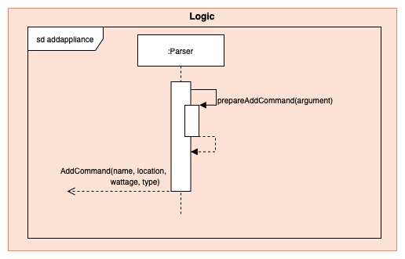
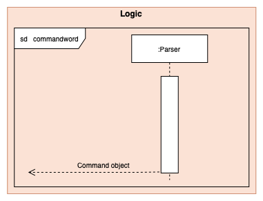

# Developer Guide

## Table of Contents
* [Setting up](#setting-up)
  * [Prerequisites](#prerequisites)
  * [Get Started](#get-started)
* [Design](#design) 
  * [Architecture](#architecture) 
  * [UI Component](#ui-component)
  * [Logic Component](#logic-component)
* [Implementation](#implementation)
  * [Model Component](#model-component)
  * [Command Component](#command-component)
  * [Storage Component](#storage-component)
  * [Parser Component](#parser-component)
* [Product scope](#implementation)
  * [Target user profile](#target-user-profile)
  * [Value proposition](#value-proposition) 
* [User Stories](#user-stories)
* [Non Functional Requirements](#non-functional-requirements)
* [Instructions for manual testing](#instructions-for-manual-testing)

## **Introduction**

SmartHomeBot is a desktop application tailored for users who are comfortable using a Command Line Interface (CLI), it allows users to control their smart devices at home and record all appliance power usage.

## **Setting up**

### Prerequisites

+ *JDK `11`* or above
+ Permission rights to create a file and folder in machine
+ At least 10Mb of free space on disk

### **Get Started**

Fork this repo and clone it into your computer.

Intellij IDEA User (highly recommended):
1. Configure the JDK to JDK 11.
2. Make sure you have enabled Grade extension, if disable please re-enable it back by going to `File`>`Settings`>`Plugins`.
3. Import the project as a Gradle project by selecting *build.gradle*
4. Verify the setup:
    Run the seedu.smarthomebot.Main and try a few commands.
    Run the Tests to ensure they all pass.
- - -

## Design

### Architecture

The *Architecture Diagram* shown above explains the high-level design of the SmortHomeBot Application. Given below is a brief overview of each component.

`Main` is responsible for initializing other components in correct sequence, and connects them up with each other.

`Commons` represents a collection of classes used by multiple components. 

The rest of the App consists of four components.
* `Ui`: The user interface where user can enter instructions and view output.
* `Logic` The command executor which consists of,
   * `Paser`: Extract the keyword from user input
   * `Commands`: Execute the specific command according to the keyword
* `Model` Holds the data in-app-memory while program is running. Consists of ...

* `Storage` Reads and writes data from and to a text file.

### Model Component

 
## Implementation

### Model Component

The *Model Component* shown above explains the summarised model of SmartHomeBot. The four appliances classes are extended from the abstract appliance class. 

### Detailed Model Component 

The *Detailed Model Component* shown above explains the full detailed model of SmartHomeBot; which includes all of their variables and methods. 

### Command Component

#### Create Command
  
The *Create Command* shown above explains the Sequence Diagram of the Create Command.
#### Remove Command 
  
The *Remove Command* shown above explains the Sequence Diagram of the Remove Command.
#### Add Command
  
The *Add Command* shown above explains the Sequence Diagram of the Add Command.
#### Delete Command
  
The *Delete Command* shown above explains the Sequence Diagram of the Delete Command.
#### On Command
  
The *On Command* shown above explains the Sequence Diagram of the On Command.
#### Off Command
  
The *Off Command* shown above explains the Sequence Diagram of the Off Command.
#### Invalid Command
  
The *Invalid Command* shown above explains the Sequence Diagram of the Invalid Command.
#### Help Command
  
The *Help Command* shown above explains the Sequence Diagram of the Help Command.
#### Exit Command
  
The *Exit Command* shown above explains the Sequence Diagram of the Exit Command.
#### CommandResult Command
  
The *CommandResult* shown above explains the Sequence Diagram of the CommandResult.

### Storage Component

#### Storage Module
The Storage module manages the load and save operations of the SmartHomeBot. It consist of two different classes, 
the ReadStorageFile class, and the WriteToFile class. As of the name stated, the function of WriteStorageFile class is 
to store the data into a .txt file for future usage. The ReadStorageFile class is to load the previously stored data 
from the .txt file back into the SmartHomeBot when it start up. The class diagram for storage module is shown below.

##### Process of saving data into Storage File
After each command input by the user, SmartHomeBot perform the execute() method in SaveStorageFile. This allows
the program to continuously save the changes made by the user into the .txt file and prevent the lost of updates made 
by the user.

Within the execute() method, the createFile() method will be performed to create a new .txt file if there is no .txt 
file exist. Then the clearFile() method will be performed to empty .txt file. After that all the data updated by the 
user will be written into the .txt file. This process will be carried out each time the user input a command. The first
line in the .txt file will always be the locationlist and subsequent lines will be all the appliances, each occupying 
one line each. The appliances will be written together with their parameters in each line. 

The sequence diagram for SaveStorageFile is shown below:

##### Process of retrieving data into the program
On startup, SmartHomeBot will perform the execute() method in ReadStorageFile. This allows the program to retrieve all 
stored data saved previously from the .txt file back into the program to be used again.

Within the execute() method, a Scanner object will be created to parse individual lines in the .txt file back into the 
program and converting them into String. The first line parsed into the program will be the locationlist, which will 
then be parse into the readToLocationList(locations) method. In the readToLocationList method, the locations will be 
added back into the locationList one by one. Then the program will return back to execute(). 

The second line onwards in the .txt file will be the appliances. These appliances will be converted into String and parse into the 
readToApplianceList method. In the readToApplianceList(appliance) method, each line will be split up into their 
specific parameters(name,location, power, type, powerConsumption and parameter). Then the appliance will be converted 
into static (Fan, AirConditioner, Lights, SmartPlug) depending on their types. Then the appliance will be added back to
the applianceList. The powerConsumption of each appliance will also be updated to keep track of the power Usage of each 
appliance.

The sequence diagram for SaveStorageFile is shown below:

### Parser Component

This section will describe how the Parser feature is implemented as well as the design consideration and rational. 

The main purpose of the Parser Class is to interpret the user inputs so that the correct command can be executed.  

Sequence Diagram when `parseCommand(userCommandText)` is initially called.  

The `userCommandText` is first capture by TextUi and then passed into parseCommand(userCommandText) method in Parser.
As shown in the Sequence Diagram above, different userCommandText will result in different paths being taken. 

Below is the list of commands available. 
* Help: `help`
* Create a location: `create`
* Remove a location: `remove`
* Add an appliance: `add`
* Delete an appliance: `delete`
* Switch ON an appliance: `on`
* Switch OFF an appliance: `off`
* Listing appliance/location: `list`
* Displaying usage of appliance: `usage`
* Resetting usage of appliance: `p_reset`
* Exiting the application: `exit`
 	
Sequence Diagram for `create`

Sequence Diagram for `remove`

Sequence Diagram for `add`

Sequence Diagram for `delete`

Sequence Diagram for `on`

Sequence Diagram for `off`

 

Sequence Diagram for `list`

Sequence Diagram for `commandword`

`commandword` refers to the following commands `help`, `usage`, `p_reset`, `exit`.
As these 4 commands does not require any additional parsing. The sequence diagram referred above will return their
respective CommandObject to execute the command. 

Sequence Diagram for `default`

