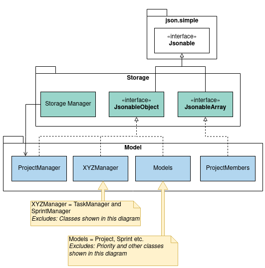

# Developer Guide

## Table of Contents
1. [Introduction](#introduction)
    1. [Background](#background)
    1. [Purpose](#purpose)
    1. [Scope](#scope)
1. [Getting Started](#getting-started)
    1. [Prerequisites](#prerequisites)
    1. [Setting Up](#setting-up)
    1. [Running the Program](#running-the-program)
1. [Design](#design)
    1. [Architecture](#architecture)
    1. [UI Component](#ui-component)
    1. [Logic Component](#logic-component)
    1. [Model Component](#model-component)
    1. [Storage Component](#storage-component)
1. [Implementation](#implementation)
    1. [Project](#project)
        1. [Create Project](#create-project)
        1. [Select Project](#select-project)
    1. [Task](#task)
        1. [Add Task](#add-task)
        1. [View Task](#view-task)
        1. [Delete Task](#delete-task)
        1. [Change Task Priority](#change-task-priority)
        1. [Mark Task as Complete](#mark-task-as-complete)
    1. [Sprint](#sprint)
        1. [Create Sprint](#create-sprint)
        1. [View Sprint](#view-sprint)
        1. [Add Task to Sprint](#add-task-to-sprint)
        1. [Remove Task from Sprint](#remove-task-from-sprint)
        1. [Allocate Sprint Tasks to Members](#allocate-sprint-tasks-to-members)        
    1. [Storage](#storage)
        1. [Location](#location)
        1. [Loading Data](#loading-data)
            1. [Converting and Mapping of JSON to Objects](#converting-and-mapping-of-json-to-objects)
        1. [Saving Data](#saving-data)
            1. [When the Program Exits](#when-the-program-exits)
            1. [Changes Made to the Data](#changes-made-to-the-data)
            1. [Serialising Objects to JSON](#serialising-objects-to-json)
1. [Appendix: Requirements]()
1. [Others](#target-user-profile)

## Introduction
### Background
SCRUMptious is a Java-based command line interface application for you to efficiently manage the development of a project. Leveraging the robust SCRUM/Agile framework, it allows you to delegate tasks to your team members and organize project requirements with ease. As a bonus, if you are a keyboard warrior, you can reach peak efficiency using SCRUMptious to manage your projects.

### Purpose
This guide illustrates the general architecture, and software design of SCRUMptious.

### Scope
This guide is geared towards developers who wish to enhance or create their own version of SCRUMptious. As such, it contains important information regarding the software architecture and design considerations of SCRUMptious.

## Getting Started
### Prerequisites
1. JDK 11.
1. IntelliJ IDEA.

### Setting Up
1. Use a Git tool to fork this repository, or download the .zip file from GitHub and extract the contents into a new folder.
1. Right-Click on the folder and select “Open folder as Intellij IDEA Community Edition Project”.
1. Ensure JDK 11 is selected for Gradle, by navigating to Configure > Structure for New Projects > Project Settings > Project > Project SDK.

### Running the Program
This program can be run once it is compiled. If you have built its artifacts (.jar) file, you may run it using java -jar <filename.jar> on your command line.

## Design
This section seeks to explain the high-level design of the application. Given below is a quick overview of each component and the explanation of the design architecture in greater detail.
NotUS is the main class of the application, and handles the initializing and execution of the appropriate classes.
### Architecture
  
The **Architecture Diagram** shown above describes the high level association operations of the application. 
A quick overview of the components is as follows:

`Main` is single-class component of `SCRUMptious`. It is responsible for:
    1. At app launch: Initializes the components in the correct sequence(Storage, UI, Parser), and links them together where appropriate.
    1. At program exit: Invokes Storage component to save all unsaved data.

The other packages are described below: 
1. `UI` : The user interface of the app, reads user input and is visible to the user.
1. `Parser Manager` : The module that reads user inputs, and creates a suitable parser based on the command to make 
 sense of user input. Respective parser then tells the Command module what to execute.
1. `ProjectManager` : Manages and stores all the projects added by the user, keeps track of selected project.    
1. `SprintManager` : Stores all sprints associated with a project.
1. `TaskManager` : Stores all tasks in backlog associated with a project.
1. `ProjectMembers` : Stores all team-members associated to a project. 
1. `Parser` : Creates a suitable parser, based on the command to make sense of the user input. Respective parser then
 make use the information and call respective commands. 
 
Each of the modules listed above are a collection of constituent classes, with each handling specialized tasks in-line with the SLAP principle.

### UI Component
  
### Logic Component

When a user types a command, `SCRUMptious`calls the `ParserManager`. The `ParserManager` then parses commands from the user. Subsequently, 
the `ParserManager` passes the commands on to the respective exceptions parsers which inherit from the `ExceptionsParser` interface. 
The exceptions parsers consist of:  
- `ProjectParser`
- `MemberParser`
- `TaskParser`
- `SprintParser`
- `HelpParser`

The `ProjectParser` validates the parameters of the command. If the command is valid, it returns the respective `ProjectCommandXYZ` to the `ParserManager`.
If the command is invalid, the `ProjectParser` returns an appropriate warning message to the user.  

The `MemberParser` validates the parameters of the command. If the command is valid, it returns the respective `MemberCommandXYZ` to the `ParserManager`.
If the command is invalid, the `TaskParser` returns an appropriate warning message to the user.  

The `TaskParser` validates the parameters of the command. If the command is valid, it returns the respective `TaskCommandXYZ` to the `ParserManager`.
If the command is invalid, the `TaskParser` returns an appropriate warning message to the user.  

The `SprintParser` validates the parameters of the command. If the command is valid, it returns the respective `SprintCommandXYZ` to the `ParserManager`.
If the command is invalid, the `SprintParser` returns an appropriate warning message to the user.  

The `HelpParser` validates the parameters of the command. If the command is valid, it returns the respective `HelpParserCommandXYZ` to the `ParserManager`.
If the command is invalid, the `HelpParser` returns an appropriate warning message to the user.

The subcommand classes `HelpParserCommandXYZ`, `ProjectCommandXYZ`, `MemberCommandXYZ`, `TaskCommandXYZ`, `SprintCommandXYZ` all inherit from an abstract `Command` class, 
which has an execute function.

The `ParserManager` then returns the command back to `SCRUMptious`, which then executes the command.

A detailed list of the subcommand classes is as follows:
* Project Commands:  
    * `CreateProjectCommand`
    * `ListProjectCommand`
    * `SelectProjectCommand`
    * `ViewProjectCommand`
* Member Commands:
    * `AddMemberCommand`
    * `DeleteMemberCommand`
* Task Commands:
    * `AddTaskCommand`
    * `ChangeTaskPriorityCommand`
    * `DeleteTaskCommand`
    * `DoneTaskCommand`
    * `ViewTaskCommand`
* Sprint Commands:
    * `AddSprintTaskCommand`
    * `AllocateSprintTaskCommand`
    * `CreateSprintCommand`
    * `DeallocateSprintTaskCommand`
    * `EditSprintCommand`
    * `RemoveSprintTaskCommand`
    * `ViewSprintCommand`
* Help Commands:
    * `HelpCommand`
    * `MemberHelpCommand`
    * `ProjectHelpCommand`
    * `SprintHelpCommand`
    * `StorageHelpCommand`
    * `TaskHelpCommand`
### Model Component
  
Link: [Model Package](https://github.com/AY2021S1-CS2113T-F11-4/tp/tree/master/src/main/java/seedu/duke/model)  
The Model
* Includes four packages namely, Project, Task, Member and Sprint.

Project package
* Includes a ProjectList to manage the multiple instances of Project created by the user
* Each instance of Project stores one instance of ProjectBacklog, ProjectMembers and SprintList.

Task  package
* Includes a ProjectBacklog to manage every Tasks created by the user
* Task can be allocated to Sprints and can be assigned to Members, 

Member package
* Includes a ProjectMembers to manage every Members created by the user
* Member can be assigned with Tasks and can be allocated to Sprints holding those Tasks
 
Sprint package
* Includes a SprintList to manage every Sprints created by the user
* Sprint can contain Tasks and Members allocated to those Tasks
### Storage Component
 
API: [StorageManager.java]( https://github.com/AY2021S1-CS2113T-F11-4/tp/tree/master/src/main/java/seedu/duke/storage/StorageManager.java)  
The Storage component is using the JavaScript Object Notation (JSON) to save the data. The library used for serialising and deserializing the data is _json.simple 3.1.1_ by **Clifton Labs**.  
As shown in the diagram above, `JsonableObject` and `JsonableArray` are interfaces which inherits the `Jsonable` interface. The following model class inherits only one of the two interfaces:  
- ProjectManager  
- Project  
- SprintManager  
- TaskManager  
- ProjectMembers  
- Sprint  
- Task  
- Member  

This requires the model classes to implement two methods required for JSON serialisation and deserialisation:  
- `toJson()`: Contains logic required to convert the model object into JSON string.  
- `fromJson()`: Contains logic required to convert JSON object into its respective model class.    

## Implementation
### Project
#### Create Project
 
 Link: [CreateProjectCommand.java](/src/main/java/seedu/duke/command/project/CreateProjectCommand.java) 
A project is created with a clear title and description of what the team is working on 
for delivery, as well as the project length and the sprint duration specified. `ProjectManager` stores all the projects
in a hash table with `projectID`, `project` as key,value pair.

Before execution:
1. Parse user input `project /create -title <title> -desc <description> -dur <duration> -sd <sprint interval>` into Command

    SCRUMptious will receive user input using the `Ui` class and parse it into `CreateProjectCommand` with `Parser` and
     `ProjectParser`.
1. Execute CreateProjectCommand

    SCRUMptious calls `Command.execute()` which will execute the command as mentioned in the implementation.

Implementation:

1. Prepare parameters
    1. Extracts required arguements, to be passed as parameters for project creation.
        
1. `projectManager.addProject()` adds a project using the parameters provided.
    
1. Output to User
    
    `printCreatedProject()` is then called to output the newly created Project in `addProj.toString` via `Ui
    .showToUserLn()`

#### List Project
All the projects added by the user are shown

#### Select Project

#### View Project

### Task
#### Add Task
A task is created following the creation of a project, with a clear title, description 
and priority of the task.
Command executed by user `task /add -title <title> -desc <description> -priority <priority>`
is passed, the following operations are implemented:
    * UI receives user input and passes it to Parser class.
    * Parser checks if the input format is valid and if a project exists, and executes a corresponding AddTaskCommand 
    object.
    * A new task is created, and added to project manager.
    
#### View Task
#### Delete Task
An existing task is deleted when the user wishes to remove a completed or unnecessary task. The task
ID is provided.
Command executed by user `task /del -id`
is passed, the following operations are implemented:
    * UI receives user input and passes it to Parser class.
    * Parser checks if the id entered is valid, and executes a corresponding DeleteTaskCommand 
    object.
    * The corresponding task is deleted from the program.
    
#### Change Task Priority
An existing task can have its priority changed when the user wishes to re-rank the urgency of the task. The task
ID and the new priority are provided.
Command executed by user `task /priority -priority HIGH -id 1`
is passed, the following operations are implemented:
    * UI receives user input and passes it to Parser class.
    * Parser checks if the id and priority entered is valid, and executes a corresponding ChangeTaskPriorityCommand 
    object.
    * The corresponding task will have its priority updated in the program.
    
#### Mark Task as Complete    
An existing task can be marked as complete when the user completes the task. The task
ID is provided.
Command executed by user `task /done -id`
is passed, the following operations are implemented:
    * UI receives user input and passes it to Parser class.
    * Parser checks if the id entered is valid, and executes a corresponding DoneTaskCommand 
    object.
    * The corresponding task is marked as done in the program.
    
### Sprint
In SCRUMptious, a Project will be broken down into smaller iterations known as Sprints. The Sprint will contain information about the Tasks allocated for that iteration and Members that are assigned to complete the Tasks.

The following section will explain how the management of Sprints is implemented in the program.

#### Create Sprint

  
  
Link: [CreateSprintCommand.java](/src/main/java/seedu/duke/command/sprint/CreateSprintCommand.java) 

A Sprint can be created when there is an existing Project.
When the Project is created, the duration of the Project and length of the Sprints are specified, thus, there will be a finite number of Sprints for each Project.

Before execution:
1. Parse user input into Command

    SCRUMptious will receive user input using the `Ui` class and parse it into `CreateSprintCommand` with `Parser` and `SprintParser`.
1. Execute CreateSprintCommand

    SCRUMptious calls `Command.execute()` which will execute the command as mentioned in the implementation.

Implementation:
1. Choose the Project to add the new Sprint

    `chooseProject()` will be called to check for the optional `-project` tag in the user specified parameters.
    
    Note: If the tag is not specified, the default Project in the ProjectManager indexed by `selectedProject` will be chosen.
1. Prepare parameters
    
    `prepareParameters()` will be called to check for the mandatory `-goal` tag in the user specified parameters.
    In addition, It will also prepare the optional `-start` tag as required in the following two scenarios:
    1. New Sprint is first Sprint in Project
        
        Being the first Sprint in the Project, the `-start` tag will determine the start date for both the new Sprint and Project.
        Thus, the `String` parameter will be sent to _DateTimeParser_ via `parseDate()` to parse it into a _LocalDate_ object.
        
        The end date for the Project and Sprint will also be determined by adding `projectDuration` and `sprintLength` to the start date respectively.
        
    1. New Sprint is not first Sprint in Project
    
        As there is a previous Sprint before the newly created Sprint, the new Sprint will start the day after the previous 
        Sprint ends. Thus, the `-start` tag will be ignored even if specified by user.

1. Check all sprint created

    With all the necessary parameters prepared, the command will check if there is still room to add new Sprint by checking
    if the prepared `sprintEndDate` is after the `projectEndDate`.
    
    Note: This check is done after the `prepareParameters()` as the _LocalDate_ `sprintEndDate` is required.
    
1. Update Project Start and End date if new Sprint is first Sprint

    As mentioned above, if the new Sprint is the first Sprint in the Project, the `-start` tag will determine the start and end date of the Project.
1. Add Sprint to Sprint Manger
    
    `addSprint()` is finally called to add a new Sprint to the Sprint Manager.
   
1. Output to User
    
    `printCreatedSprint()` is then called to output the newly created Sprint in `createdSprint.toString` via `Ui.showToUserLn()`

#### View Sprint

Link: [ViewSprintCommand.java](/src/main/java/seedu/duke/command/sprint/ViewSprintCommand.java) 

A Sprint can only be viewed when there is an existing Sprint. When the user request to view the sprint, the Sprint number is specified and the program will output the information about the Sprint corresponding to the Sprint number.

Prerequisites:    
1. At least one Sprint in the SprintList

Implementation:
1. UI receive user input
1. Parser parse user input
1. Execute ViewSprintCommand
    1. Get Sprint from SprintList
    1. UI output to user

#### Add Task to Sprint

Link: [AddSprintTaskCommand.java](/src/main/java/seedu/duke/command/sprint/AddSprintTaskCommand.java) 

Users can add Tasks existing in the Project Backlog to the Sprint, indicating that the Tasks are to be worked on during the iteration. 

Prerequisites:    
1. At least one Sprint in the SprintList
1. At least one Task in the ProjectBacklog

Implementation:
1. UI receive user input
1. Parser parse user input
1. Execute AddSprintTaskCommand
    1. On Sprint 
        1. Add Task ID into sprintTaskIds
    1. On Task
        1. Add Sprint Number into sprintAllocatedTo
    1. UI output to user

#### Remove Task from Sprint

Link: [RemoveSprintTaskCommand.java](/src/main/java/seedu/duke/command/sprint/RemoveSprintTaskCommand.java) 

Users can remove Tasks from Sprint, indicating that the Tasks are deemed to not be worked on during the iteration. 

Prerequisites:    
1. At least one Sprint in the SprintList
1. At least one Task is added to the selected Sprint

Implementation:
1. UI receive user input
1. Parser parse user input
1. Execute RemoveSprintTaskCommand
    1. On Sprint 
        1. Remove Task ID from sprintTaskIds
    1. On Task
        1. Remove Sprint Number from sprintAllocatedTo
    1. UI output to user

#### Allocate Sprint Tasks to Members   

Link: [AllocateSprintTaskCommand.java](/src/main/java/seedu/duke/command/sprint/AllocateSprintTaskCommand.java) 
 
Users can allocate Sprint Tasks to Members, indicating that the Tasks are assigned to the selected member to work on during the iteration. 

Prerequisites:    
1. At least one Task is added to the selected Sprint
1. At least one Member is added to the Project

Implementation:
1. UI receive user input
1. Parser parse user input
1. Execute AllocateSprintTaskCommand
    1. On Task
        1. Add Member ID into membersAllocatedTo
    1. On Member
        1. Add Task ID into allocatedTaskIds

### Storage
To make the data persistent and portable, JSON has been chosen as the format for data to be saved to a persistent storage such as storage drives, thumb drives and any other storage medium which stores the program. JSON is also **human-readable** which allows users to directly modify the data file easily. This can be useful in certain scenarios such as fixing the data file in the event of data corruption.

#### Location
  
_Figure X: Running the Jar_  
  
_Figure X: Running in IDE_  

As shown in the above diagram, the program will save the data as _"data.json"_. The data file is saved in the _“data/”_ folder that is located in the folder of the program. If you are testing the program using Intellij IDE, the _“data/”_ folder will be in the root of the project folder.  
When you start the program, the program will load the data file from its respective location and deserialise it into its respective objects. Data will be saved when the program exits or whenever the user makes changes to the program.  

#### Loading Data
  

The program will only load the data file in the persistent storage during the initialisation process of the program. With reference to the sequence diagram above, the flow of the logic is as follows:  
1. When the user starts the program, it will first call `init()` to initialise the program. 
2. A `StorageManager` object will be instantiated with the reference to a `ProjectManager` object that is used during load and save operations.
3. `load()` will read the data file from the persistent storage, deserialise it into a `JsonObject` object and attempt to convert the object into its respective types.  
  
The program will exit immediately with an **exit code 1** if any of the conditions are met:
- Error trying to read the file.
- Conversion error due to missing properties.
- Mapping error due to invalid property type (e.g. "name" is expecting a `String` but data read is an `Integer`).

##### Converting and Mapping of JSON to Objects
Due to the limitations of the library, parsing of the JSON string only converts it into either JsonObject or JsonArray objects which requires additional operations to map the data back to the respective model classes.  
  
As explained in [Storage Component](#storage-component), each model class except for `Priority` will inherit either `JsonableObject` or `JsonableArray` which are custom interfaces inheriting the `Jsonable` interface of _**json.simple**_. This requires the classes to implement the methods `toJson()` and `fromJson()`. This section will focus on `fromJson()`, which is used to implement the logic for **converting and mapping of JSON to objects of their respective type**.  
  
1. After loading the raw JSON string, `StorageManager` will call `Jsoner.deserialize()` to convert it into an object of `JsonObject`.
2. At this point, `JsonObject` contains all the properties of `ProjectManager` and needs to be mapped back to a `ProjectManager` object.
3. `StorageManager` will call `ProjectManager.fromJson()`, passing the `JSONObject` object from _Step 2_ as the parameter. 
4. In `fromJson()`, there are two type of actions depending on the property it is mapping:  
   1. **Type Casting**: Properties that are primitive or standard can be mapped directly through type casting (e.g. `int`, `boolean`, `String` etc.)
   2. **\*Calling `fromJson()` of the Actual Type**: Any property that is originally a type of the **Scrumptious model classes** will be mapped with the following steps:
      1. Create an empty object of the respective type (e.g. `Sprint`).
      2. Type cast the property as `JsonObject` or `JsonArray` depending on the actual type of the property (e.g. `(JsonArray) object`).
      3. Call `fromJson()` of the newly created object, passing the property as the parameter (e.g. `Sprint.fromJson()`).
      4. New object's `fromJson()` will **repeat the same process again under Step 4** for its own properties.  
      
*`Priority` is an **enum** and is the only model which does not follow this strictly. It is mapped by type casting the property as `String` first, then calling the `Priority.valueOf()` method to convert it into its respective **enum**.  

#### Saving Data
  

Data will be saved under two scenarios: 1. When the program exits. 2. Changes made to the data. 

##### When the Program Exits
`Scrumptious` will call `destroy()` which calls `save()` before it returns.

##### Changes Made to the Data
Changes made to the data during the runtime of the program can only be made by executing a command.
   
As shown in the diagram above, each command class inherits the `shouldSave` property from `Command` class. `shouldSave` is a boolean variable and is initialised inside the constructor. `shouldSave` will be set to `true` if the command results in a change of data (e.g. adding a task, creating a sprint etc.), otherwise it is set to `false` (e.g. viewing projects, sprints etc.).

After executing the command by calling `execute()`, the program will call `save()` from `StorageManager` object if the `shouldSave` is set to `true`.

##### Serialising Objects to JSON
As explained in [Storage Component](#storage-component), each model class except for `Priority` will inherit either `JsonableObject` or `JsonableArray` which are custom interfaces inheriting the `Jsonable` interface of _**json.simple**_. This requires the classes to implement the methods `toJson()` and `fromJson()`. This section will focus on `toJson()`, which is used to implement the logic for **serialising objects into JSON string**.  
When saving the data as JSON file, `StorageManager` will call `Jsoner.serialize()` of the _**json.simple**_, passing in the `ProjectManager` and `FileWriter` (points to the data file) object as the parameters. The library will automatically serialise the objects and sub-objects into JSON string depending on the type of the objects:
 1. **Primitive and Standard Types (e.g. `int`, `String`, `Collection`)**: The library can directly serialise these types into JSON string.
 2. **\*Scrumptious Model Types (e.g. `Project`, `Task`)**: The library will serialise these types by calling its `toJson()` method which contains the logic for the serialisation.  
    
*`Priority` is an exception, it is serialised by calling `name()` of the **enum** which will return its `String` representation.
    

### Target user profile

{Describe the target user profile}

### Value proposition

{Describe the value proposition: what problem does it solve?}

## User Stories

|Version| As a ... | I want to ... | So that I can ...|
|--------|----------|---------------|------------------|
|v1.0|new user|see usage instructions|refer to them when I forget how to use the application|
|v2.0|user|find a to-do item by name|locate a to-do without having to go through the entire list|

## Non-Functional Requirements

{Give non-functional requirements}

## Glossary

* *glossary item* - Definition

## Instructions for manual testing

{Give instructions on how to do a manual product testing e.g., how to load sample data to be used for testing}
