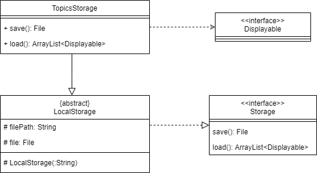

# Developer Guide

## Design & implementation

{Describe the design and implementation of the product. Use UML diagrams and short code snippets where applicable.}

### Loading Data

Data is loaded automatically from JSON files in the data folder. This is mainly facilitated through the `TopicsStorage` class which handles accessing the file as well as converting from JSON into `Topic`, `Question` and `Option` objects.

Given below is an example usage scenario of loading in two topics with two questions each.

When the user launches the app, the main program will initialize a `TopicsStorage` object and call the `load` method which will return a `TopicList` object. The following sequence diagram shows how the load operation works:

## Product scope
### Target user profile

CS2113/T Students

### Value proposition

Help CS2113/T students learn and understand software engineering and OOP principles through a gamified platform and enhance their learning experience. Consolidate key concepts for easy revision.

## User Stories

|Version| As a ... | I want to ... | So that I can ...|
|--------|----------|---------------|------------------|
|v1.0|new user|answer given questions|start testing myself immediately|

## Non-Functional Requirements

{Give non-functional requirements}

## Glossary

* *glossary item* - Definition

## Instructions for manual testing

{Give instructions on how to do a manual product testing e.g., how to load sample data to be used for testing}
