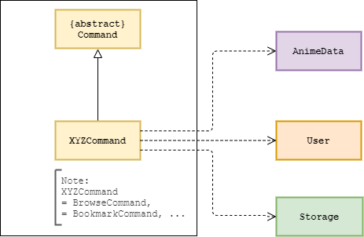
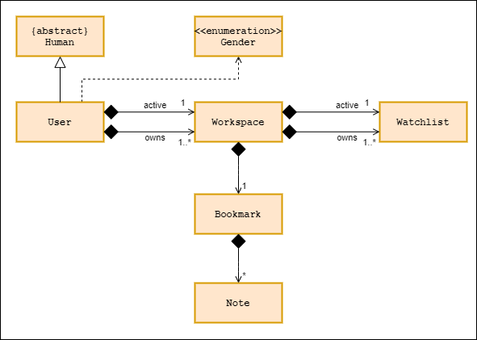
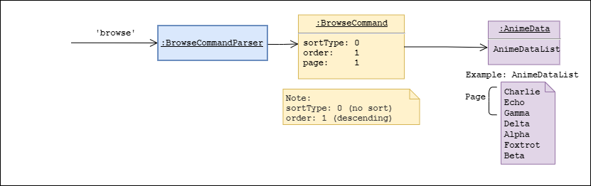

# Developer Guide

## Table of Content
1. [Introduction](#1-introduction)
<br/>&nbsp;1.1 [Purpose](#11-purpose)
2. [Setting up](#2-setting-up)
3. [Design](#3-design)
<br/>&nbsp;3.1 [Architecture](#31-architecture)
<br/>&nbsp;3.2 [UI Component](#32-ui-component)
<br/>&nbsp;3.3 [Parser Component](#33-parser-component)
<br/>&nbsp;3.4 [Command Component](#34-command-component)
<br/>&nbsp;3.5 [AnimeData Component](#35-animedata-component)
<br/>&nbsp;3.6 [User Component](#36-user-component)
<br/>&nbsp;3.7 [Storage Component](#37-storage-component)
4. [Implementation](#4-implementation)
<br/>&nbsp;4.1 [Estimation Feature](#41-estimation-feature)
<br/>&nbsp;4.2 [Browse Feature](#42-browse-feature)
<br/>&nbsp;4.3 [Workspace Feature](#43-workspace-feature)
<br/>&nbsp;4.4 [Watchlist Management Feature](#44-watchlist-management-feature)
5. [Documentation, Logging, Testing, and DevOps](#5-documentation-logging-testing-and-devops)
<br/>&nbsp;5.1 [Documentation](#51-documentation)
<br/>&nbsp;5.2 [Logging](#52-logging)
<br/>&nbsp;5.3 [Testing](#53-testing)
<br/>&nbsp;5.4 [DevOps](#54-devops)

<br/>

## 1. Introduction
**AniChan** is a command-line application written in **Java 11**. It is written using the Object-Oriented Programming (OOP) paradigm which provides us with means to structure a software program into organized, reusable and reusable pieces of code that makes it good for future improvements and revisions.
<br/>

### 1.1 Purpose

This document is meant for new and current developers of AniChan. It describes the overall architecture design of AniChan, and lays out the current implementation details of our notable features with the rationale and considerations behind each one. It is a living document that would continue to be edited and updated for each major release, and the current edition of this document is intended for the release v2.0.

<br/>

## 2. Setting Up
### Setting up the project in your computer

Ensure that you have the following installed: 
* JDK 11.
* IntelliJ IDE (highly recommended).

Firstly, **fork** this repo and **clone** a copy into your computer.

If you plan to use Intellij IDEA: 
1. **Ensure IntelliJ is configured to use JDK 11**.
    1. Click on `Configure` > `Structure for New Projects` > `Project Settings` > `Project`, 
       and ensure the `Project SDK` is using **JDK 11**.
2. **Import the project as a Gradle project**.
    1. Click on `Import Project` and locate the `build.gradle` file and select it. Click `OK`
    2. If asked, choose to `Open as Project` (not `Open as File`).
    3. Click `OK` to accept the default settings but do ensure that the selected version of `Gradle JVM` matches the JDK being used for the project.
    4. The import process could take a few minutes to finish.
3. **Verify the setup**: 
    1. Run the `seedu.anichan.Main` and try a few commands. 
    2. You may want to refer to our [User Guide](UserGuide.md) for the list of commands.

----

### Before writing code
1. **Configuring the coding style**

    If using IDEA, follow this guide 
    [IDEA: Configuring the code style](https://se-education.org/guides/tutorials/intellijCodeStyle.html) 
    to setup IDEA’s coding style to match ours.

2. **Set up CI**

    There is no set up required as the project comes with a GitHub Actions config files, 
    located in `.github/workflows` folder. When GitHub detects these files, it will run the CI for the project
    automatically at each push to the master branch or to any PR.

3. **Learn the design**

    When you are ready to start writing codes, 
    we recommended that you have a look at AniChan's overall design 
    by reading about it at [AniChan's architecture](DeveloperGuide.md#31-architecture).

<br/>

## 3. Design 

The following section describes the architecture design of **Anichan**. This section starts off by looking at the overall architecture design in a general view, before going into the specific implementation details of the individual features.

<br/>

### 3.1 Architecture
This section will help provide insight to the general overview of Anichan’s architecture.

<br/>


*Figure 1: Architecture Design Diagram*

> :bulb:   The images used are stored in the directory: `images/`. If you wish to update a diagram you may replace the images in this folder.


The **Architecture Diagram** presented above explains the high-level design of AniChan, and given below is a quick overview of each component involved.

The `Main` class is the starting point of the application and has only one class called `Main`, it is responsible for, 
* At launch: Initializes the various components in the correct sequence, connects them up with each other, and loads any saved data.
* At shut down: Shuts down the components and invokes any clean up methods where necessary.

The rest of AniChan consists of 6 components: 
- `Ui`: Manages the user interface of AniChan.
- `Parser`: Parses the user input.
- `Command`: Executes the command.
- `User`: Manages the workspace(s) and user data.
- `AnimeData`: Provides data from the anime source file.
- `Storage`: Reads data from, and writes data to, the hard disk.

<br/>

Below is an overall sequence diagram to help illustrate the general program flow and how the different objects interact with each other.

<br/>

 <br/>
*Figure 2: Overall Sequence Diagram* 
<br/>
<br/>

### 3.2 UI Component
 <br/>
*Figure 3: UI Class Diagram*

The UI component consists of a `UI` class that handles all user input and system output. The UI is only dependent on the `Main` class and does not interact directly with other classes ensuring high cohesiveness and separation of roles.

The `Ui` component listens for: 
*  the execution of commands to print the result of the Command.
* any exceptions thrown to show an error message to the user, instead of a program termination.

<br/>

### 3.3 Parser Component
 <br/>
*Figure 4: Parser Class Diagram*

The `Parser` component consists of a `Parser` class and multiple `XYZParser` each representing a specific command’s parser. The Parser class will first receive a user command from `Main` and will proceed to determine the command type.

Once the command type is known, it will then create the respective `XYZParser` class.

Example: If Browse command was parsed, `Parser` will create `BrowseParser`.

`XYZParser` will then parse the parameter and perform input validation, before creating the Command object to return to `Main`.

<br/>

### 3.4 Command Component
 <br/>
*Figure 5: Command Class Diagram*

The `Command` component consists of different commands represented together as `XYZCommand` which all inherits from the abstract `Command` class. 

Example: The Browse command would be represented by a `BrowseCommand`.

`Main` would utilise the `Command.execute` operation to carry out the execution of the command and retrieve a String output that will contain the successful result of the `Command`. If the `Command` was not successful an exception will be thrown with details of the failure.

<br/>

### 3.5 AnimeData Component
 <br/>
*Figure 6: AnimeData Class Diagram*

The `AnimeData` component is responsible for retrieving offline json data and parsing it into `Anime` objects that will be stored in program memory. The `AnimeData` will manage an ArrayList of `Anime` objects providing AniChan with an interface for the program to retrieve with the source data.

The `AnimeData `component:
* can retrieve Anime objects using ID.
* can view detailed  information of each Anime Object.
* can browse the Anime catalog with sorting algorithms.

<br/>

<!-- @@author ChanJianHao -->
### 3.6 User Component
 <br/>
*Figure 7: User Class Diagram*

The User inherits from the abstract `Human` class and stores the name and gender of the user. It represents the user's interaction with `Workspace` class.

The `User`component: 
* can provide user information like `name`, `gender`, and `honorific name`
* stores an array list of type `Workspace`
* can add, set, and switch between workspaces 

The `Workspace` component:  
* can allow `User` to create and get the list of `Watchlist` and `Bookmark`.
* can allow `User` to change his active `Watchlist`.

<!-- @@author -->
<br/>

### 3.7 Storage Component
 <br/>
*Figure 8: Storage Class Diagram*

The `Storage` component consist of `StorageManager` which:
* can **save** workspace created by the user as a folder.
* can **save** user, watchlist and bookmark data in `.txt` format and **read it back** using 
their respective storage class, `UserStorage`, `WatchlistStorage`, and `BookmarkStorage`.
* can **read** script files that are in `.txt` format using the class `ScriptStorage`.

**AniChan** saved these data as `.txt` files so advanced users will be able to view and manipulate these saved data easily with any available text editor.

<br/>

## 4. Implementation
This section introduces the specific implementation details and design consideration of some features in AniChan.

<br/>

### 4.1 Estimation Feature

The `estimate` feature aims to provide translators with better estimates on the time needed to translate a script based on their capability. Hence, users will be able to ensure they do not overpromise their clients.

> :bulb: The application only accepts `.txt` files.

##### 4.1.1 Current Implementation

The `estimate` feature is facilitated by `EstimateCommand`, which extends from the abstract class `Command`. `EstimateCommand` is instantiated by `EstimateParser`, and it requires two parameters:
* `ScriptFileName` (mandatory).
* `wordsPerHour` (optional), if not specified, the values 400, 500, and 600 words per hour (average translator's speed) will be used to generate 3 estimation timings.
<br/>

Given below is an example usage scenario showing how the `estimate` command behaves at each step.

**Step 1:** User executes `estimate script.txt -wph 300`, `Main` calls `Parser#getCommand()` and passes the command to it.

**Step 2:** `Parser` extracts “estimate” from the command, and according to the command type, it calls `EstimateParser#parse()` and passes the command description, "script.txt -wph 300", to it.

**Step 3:** `EstimateParser` proceed to parse the command description, extract, and validate the inputs "script.txt" and "300". Once validated and no exception was thrown, it creates and initialises `EstimateCommand` with the inputs and returns this object to `Parser`, which then returns it to `Main`.

**Step 4:** `EstimateParser` is terminated and `Main` calls `EstimateCommand#execute()` with `animeData`, `storageManager`, and `user` to begin estimating the time needed.

 <br/>
*Figure 9: Estimate Command After Step 4*

<br/>

**Step 5:** `EstimateCommand` first calls `User#getActiveWorkspace()` to initialise a `Workspace` object, `activeWorkspace`. It then calls `StorageManager#loadScript()` with `scriptFileName` and `activeWorkspace.getName()` to initialise `fileContent`, with the content of `scriptFileName` located in the workspace folder named `activeWorkspace.getName()`.

**Step 6:** `EstimateCommand` calculates the estimated time using `fileContent` and `wordsPerHour`. It then calls `EstimateCommand#timeNeededToString()` with the estimated time to convert the timing into a human-readable format and return the result to `Main` for it to be printed to the user via `Ui`.

**Step 7:** `EstimateCommand` is terminated.

 <br/>
*Figure 10: Estimate Command Final State*

<br/>

The sequence diagram presented below depicts the interaction between the components for running the `estimate` command, provided that the user has entered a valid command.

<br/>

 <br/>
*Figure 11. Sequence Diagram for EstimateCommand*

<br/>

#### 4.1.2 Design Consideration

This section shows some design considerations taken when implementing the estimate feature.

<br/>

**Aspect: When should the program read the script file**

| Approach | Pros | Cons |
| --- | --- | --- |
| During command execution (current design) |  Easy to implement since `Command` already handle file matters. | Waiting till command execution to validate the existence and validity of the script file would have wasted some memory resources. |
| During parsing | No memory resource wasted as it ensures the command does not fail execution due to invalid file. | Decreases cohesion as `Parser` now has to handle file matters on top of parsing matters, and this would affect the understandability, maintainability and reusability of the class. |

Having considered both of the alternatives, we have decided to implement the first alternative, that is to **read script file content during command execution** because we do not want to decrease the cohension of `Parser`, and we find that the memory resource that are wasted in the process is a worthy exchange for the cohesion preserved.

<br/>

**Aspect: The way user can specify the script file**

| Approach | Pros | Cons |
| --- | --- | --- |
| User have to specify file extension (current design) |  Ensures that the correct file will be read. | Some users may not be aware of how to identify their file extension. |
| User do not have to specify file extension | Users can easily specify the file to read and do not have to worry about knowing the file extension. | The application may end up reading the wrong file if there happens to be two files with the identical name name but different file extension. |

We have decided to the implement the first alternative, **users should specify the file extension in their input** because the importance of getting a correct estimation timing would outweighs and compensate for the hassle of entering the file extension. Moreover, if we were to allow such mistakes to be made, we could end up losing potential users of this product as using the wrong estimation timing could end up being costly for these users.

<br/>

### 4.2 Browse Feature
The browse feature is a useful feature that will allow users to quickly look through all 
the different anime series available in a browsing fashion. The feature will have several enhancements such 
as sorted browsing to browse in alphabetical or by the rating of the anime.

#### 4.2.1 Current Implementation
The `BrowseCommand` is executed by `BrowseCommandParser` after parsing the user input. It will then fetch `Anime` objects matching the parameters specified by `BrowseCommandParser` that are stored in `AnimeData`. It extends the `Command` class and implements the following operations:
- `BrowseCommand#sortBrowseList()` - Handles any sorting of `Anime` objects. 
- `BrowseCommand#buildBrowseOutput()` - Creates the output string to be printed to users.
<br/>

These are the two fundamental operations that will carry out the execution of the browse command.

`BrowseCommand` will be constructed with default values. This ensures that even when there is no input provided, 
it can still perform a default browse and return relevant useful information.

Before going any further, please refer to this helpful table of the `BrowseCommand` parameters for reference.

| Attribute | Option | Function          |
| ---       | ---    | ---               |
| order     | 0      | Ascending         |
| order	    | 1      | Descending        |
| sortType  | 0      | No Sort           |
| sortType  | 1      | by name           |
| sortType  | 2      | by rating         |
| sortType  | 3      | back to original  |
| page      | \>= 1  | page number       |

> :bulb: The magic values have already been refactored out into constant variables.

Given below is an example usage scenario to showcase how a `BrowseCommand` will behave at each step. 
This example will utilise a small sample list of `AnimeData` and a page size of `3`.

> :memo: It is set to `20` as default in actual execution. 

**Step 1:** When the user enters the command for `Browse`, the input will be processed and parsed by `parser.java` and 
then further parsed by `BrowseParser.java`.

**Step 2:** Upon completion of parsing and input validation, `BrowseParser.java` will create an executable `BrowseCommand` 
object and return it to `main`.

**Step 3:** Once the `BrowseCommand` object is executed, it will firstly process the `AnimeData` by calling on its `BrowseCommand#sortBrowseList()` operation to identify the order that the list will need to be in (if any).

For this case since it is a default browse operation, there is no sorting performed.

**Step 4:** Now `BrowseCommand` will utilise its `BrowseCommand#buildBrowseOutput()` operation to access all 
`Anime objects within the page window, as shown in the diagram below.

 <br/>
*Figure 12: Browse Default State Object Diagram*

In this example, it fetches the following `Anime` objects.
```
Charlie
Echo
Gamma
```

If the 2nd page of the list was requested instead with the command `browse -p 2`. 
`BrowseCommand#buildBrowseOutput()` will shift its page window down by 1 page as depicted in the diagram below.


 <br/>
*Figure 13: Browse Next Page Object Diagram*

**Step 5:** At each `Anime` object, it will access its methods to get the relevant information about that anime series and construct a printable result for the user to view.

**Step 6:** After all `Anime` objects in the page window have been retrieved, it will return the printable result back to `BrowseCommand#execute()`. At this point it will utilise `BrowseCommand#sortBrowseOption()` again to reset the `AnimeData` list to its original form if it has been altered.

**Step 7:** Once `AnimeData` has been sorted, it will return the result back to `Main` for printing.


Currently, this result is not very exciting as it is just based on the Anime ID which is assigned randomly by our data source, AniList.

An example scenario would be browsing the 2nd page of a **sorted** list in ascending order.
The only step that would change would be at Step 3, where it will perform sorting of `AnimeData` list. 


 <br/>
*Figure 14: Browse Sorted State Object Diagram*

As you can see, even though the page window is at the same position as the previous command, 
the list is different as it has been sorted.

From this point onwards, the operation will continue as per the steps above but during the final `BrowseCommand#sortBrowseList()` call in step 6. It will perform a sort to reset the list.

Here is the sequence diagram to better illustrate the lifecycle of a browse command.

 <br/>
*Figure 15: Browse Sorted Sequence Diagram*

<br/>

#### 4.2.2 Design Consideration
Here are some various design considerations that was taken when implementing the `browse` feature.

The first design consideration was how the sorting should be carried out. The main issues here are the time and storage complexity.

| Approach | Pros | Cons  |
| --- | --- | --- |
| 1. Leaving the list unsorted                    | - No complexity and fastest approach  | - List will be unsorted and may cause confusion to users |
| 2. Resorting the list again                     | - The list will be back into its original form before browsing    | - May hinder performance as resorting could take time <br/> - Requires altering of the main list |
| 3. Cloning a duplicate animeData object to sort | - The list will be back to its original form <br/> - The main list will not be affected at all | - Expensive operation that will require large storage and time complexity |

Currently, the 2nd approach is being used with the following rationale. While the 1st approach is the fastest, the consequence of 
leaving the main list unsorted is too great and may produce a lot of uncertain results as well as confuse the user. 
Although the 3rd approach provides the best benefit, its complexity may end up violating the project’s memory limit constraint if the list is large. 
Therefore, the 2nd approach was chosen, as its performance cost outweighs the other approaches cons.  

The second design consideration was how to carry out the page by page browsing as shown above. 
The main issue was the cohesiveness between components.

| Approach | Pros | Cons  |
| --- | --- | --- |
| 1. Interactive browsing, users can `flip` pages and `pick` to view specific anime | - Fluid and seamless browsing session. <br/>- Very good usability. | - Would require `BrowseCommand` to get user input. |
| 2. Static browsing, users specify the page they want to access. | - Completely decoupled from Ui component <br/>- Allows for browse to be more precise in finding what the user wants |  - Not as seamless as the first approach but still usable. |

Though the 1st approach could have created a more authentic browsing feature it would not fit the requirements as well as the 
2nd approach. The 2nd approach allows for more precise browsing of pages means that more experienced users are able to utilise the 
tool quicker and to the same effect as the first approach. As a result, the 2nd approach was chosen as a better fit of the requirements 
and in favour of having an application that is highly object-oriented.

<br/>

### 4.3 Workspace Feature

Similar to a desktop, AniChan has a workspace feature which allows users to organise data in separate ‘containers’ and switch between them to avoid intermixing of information.

#### 4.3.1 Add new workspace 

WIP.

<br/>

### 4.4 Watchlist Management Feature

The watchlist management feature aims to provide translators with a simple way to keep track of animes of different genres, allowing them to stay organized and focus on their work.

##### 4.4.1 Current Implementation

The `watchlist` feature is facilitated by `WatchlistCommand`, which extends from the abstract class `Command`. `WatchlistCommand` is instantiated by `WatchlistParser`, and it requires 3 parameters: 
* `option` (mandatory).
* `watchlistName` (mandatory only if the option `-n` is specified).
* `watchlistIndex` (mandatory only if the options `-s` and `-d` is specified).
<br/>

Given below is an example usage scenario showing how the `watchlist` command behaves at each step.

**Step 1:** User launches the application for the first time. The `Workspace` of a user will be initialised to the initial workspace state, and the `activeWatchlist` will point to the first watchlist found in the `watchlistList` of the initialised `Workspace`.

 <br/>
*Figure 16: Watchlist Command Initial State*

<br/>

**Step 2:** User executes `watchlist -n NewAnime` to create a new watchlist named "NewAnime". `Main` calls `Parser#getCommand()` and passes the command to it.

**Step 3:** `Parser` extracts "watchlist" from the command, and according to the command type, it calls `WatchlistParser#parse()` and passes the command description, "-n NewAnime", to it.

**Step 4:** `WatchlistParser` proceed to parse the command description, extract, and validate the inputs "-n" and "NewAnime". Once validated and no exception was thrown, it creates and initialises `WatchlistCommand` with the inputs and return this object to `Parser`, which then returns it to `Main`.

**Step 5:** `WatchlistParser` is terminated and `Main` calls `WatchlistCommand#execute()` with `animeData`, `storageManager`, and `user` to create the new watchlist.

 <br/>
*Figure 17: Watchlist Command After Step 5*

<br/>

**Step 6:** `WatchlistCommand` first calls `User#getActiveWorkspace()` to initialise a `Workspace` object, `activeWorkspace`. It then calls `WatchlistCommand#createWatchlist()` to perform the operation and to call `StorageManager#saveWatchlist()` with `activeWorkspace.getName()` and `watchlistName` to save the newly created watchlist.

**Step 7:** `WatchlistCommand` is terminated.

 <br/>
*Figure 18: Watchlist Command Final State After Create*

<br/>

All the other options in the `watchlist` command also follows a similar execution process. 

The following diagrams will continue from step 7, and it will show you how the state of the application changes as it continues to execute the select and delete option of the `watchlist` command. The list option (`-l`) is not shown as there is no change in the application state after its execution.

<br/>

The user executes `watchlist -s 2` to change his active watchlist to the second watchlist ("NewAnime") in the list.

 <br/>
*Figure 19: Watchlist Command State After Select*

<br/>

The user executes `watchlist -d 2` to delete the second watchlist ("NewAnime") in the list.

 <br/>
*Figure 20: Watchlist Command Final State After Delete*

<br/>

The sequence diagram presented below depicts the interaction between the components for running the `watchlist` command, provided that the user has entered a valid command.

<br/>

 <br/>
*Figure 21: Sequence diagram for WatchlistCommand*

<br/>

#### 4.4.2 Design Consideration

This section shows some design considerations taken when implementing the watchlist feature.

<br/>

**Aspect: Saving watchlist data**

| Approach | Pros | Cons |
| --- | --- | --- |
| After each command execution (current design) | User don't have to worry about lost data if their application or system crashes midway. | Application might slow down when the data grows large. |
| When the user exits the program | Saving is more efficient and can potentially improve performance. | User may lose their data if the application or system crashes midway. |

Having considered both of these alternatives, we have decided to save watchlist data **after each command execution** because users may work on the application for long period and unexpected events can always happen. 
Losing work data can also be a frustrating and costly mistake to translators especially if these data are important. Hence, we definitely do not want to lose potential users of this product due to such a problem that could be alleviated easily.

<br/>

## 5. Documentation, Logging, Testing, and DevOps

This section details the documentation, logging, testing and dev-ops setup used in this project as well as information on how to use them.

<br/>

### 5.1 Documentation

We use **Jekyll** to manage documentation. We recommend that you document your features implementation and code changes so that other developers are aware of its architecture.

The `docs/` folder stores the documentation of this project. You can learn more about how to setup and maintain the project website at with [this guide](https://se-education.org/guides/tutorials/jekyll.html).


<br/>

### 5.2 Logging

We encourage the use of logger in this project as they provide deeper insights than error messages which can greatly help developers identify bugs and simplify their logging process.

We are using `java.util.logging`  package for logging. The logger can be accessed using the  `AniLogger`  class. 

`AniLogger` is used to manage the logging levels and logging destinations. Based on the default setting, logs will be written to both console and file `data/AniChan.log`.

The  `Logger`  for a class can be obtained using  `AniLogger.getAniLogger(Class)`  which will log messages according to the specified logging level.

We use the following log levels:
*   `Level.SEVERE` : A critical failure, which prevents normal execution of the program.
*   `Level.WARNING`: Indicates a potential problem, but can proceed with caution.
*   `Level.INFO`: General noteworthy information of the program.

<br/>


### 5.3 Testing

Testing is integral to the development of a reliable software. Before making a pull request, please ensure that all tests pass. You are recommended to write tests as you add new code to the program.

<br/>

#### 5.3.1 Running Tests

There are primarily 2 ways to run the tests.

**Method 1: Using IntelliJ**
*   To run all tests, right-click on the `src/test/java` folder in the project panel and choose `Run Tests`.
<br/>

**Method 2: Using Gradle**
*   Open a terminal and navigate to project directory, run command `./gradlew clean checkstyleMain checkstyleTest test`.

<br/>

### 5.4 DevOps

`Coming soon`
