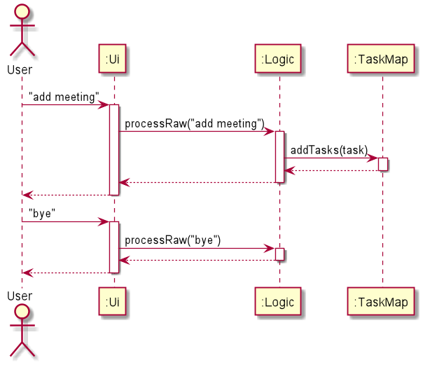
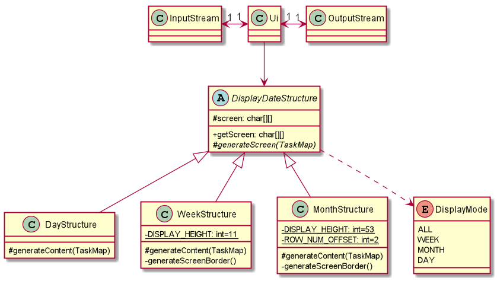

# Developer Guide

- [Design & implementation](#design--implementation)
    - [Architecture](#architecture)  
    - [Ui component](#ui-component)  
    - [Logic component](#logic-component)  
    - [Model component](#model-component)  
    - [Storage component](#storage-component)
- [Product scope](#product-scope)
    - [Target user profile](#target-user-profile)
    - [Value proposition](#value-proposition)
- [User stories](#user-stories)
- [Use cases](#use-cases)
- [Non-functional requirements](#non-functional-requirements) 
- [Glossary](#glossary)
- [Instruction for manual testing](#instructions-for-manual-testing)

## Design & implementation

### Architecture

The Architecture Diagram above gives an overview of how different components interacts 
with each other in the app. 

As the app starts, the main program initialises the Ui, Logic and Storage components.
Then, the Storage component reads existing data file if it is available, else a fresh copy of 
data file is created. This step also initialises the content of runtime storage which is store 
in a TaskMap object.

Now the Ui component is ready to take inputs from the User, and the input is processed and executed
in the Logic component, the execution result is passed back to Ui component and displayed to the User.
Just before the main program exits, Storage component saves the content in the TaskMap to the data file.

Commons provide utility functions and messages to be used by other components.

The sequence diagrams below shows a typical workflow the program.

At the start of the app, tasks are loaded using loadTasks function from Storage class, 
and writeTasksToFile function is called when the program stops. 

In the example above, after the programs starts, User inputs "add meeting",
the input is captured by the Ui component, then it calls the processRaw 
function from the Logic component, to extract useful information from the input. 
Logic component verified the command is valid and calls the addTask function 
from the TaskMap, then TaskMap carries out the operation, and a message is
return to the Ui from the Logic component.

The next input provide by the User is "bye", it follows a similar process.
After the message is shown to the User, the main program calls the
writeTasksToFile() function in Storage and saves the data.

### Ui component

The diagram above is a class diagram of the Ui component.
Other than the usual InputStream and OutputStream, the Ui component has a
DisplayDateStructure. This abstract class prepares the content to be 
printed when the DisplayMode is DAY, WEEK or MONTH. The content is generated
using generateContent function, which writes the intended content into
the 2-D array of characters for weekly and monthly view. After that, 
the array will be shown to the user by Ui class via the OutputStream. 

Moreover, DayStructure, WeekStructure and MonthStructure extends the DisplayDateStructure.
DayStructure generate content in tableformat while the other two class will generate 
a different size of the 2-D array mentioned in the previous paragraph 
due the difference in number of days displayed.

### Logic component

From the Ui component, the raw input from the User is passed to the Parser class.
Parser class will process and validate the input, then it generates a specific
command accordingly.  Specific commands extends from the abstract Command class.
Command operates on the TaskMap and execution of Command generates a 
CommandResult. This CommandResult is passed back to the Ui component and 
respective content will be displayed to User based on the CommandResult. 

### Model component

Task class consists of attributes like description, date, start time, end time,
priority that are important to users. Whereas other attributes like 
HASH_VALUE_DIGITS, taskID and internal values of Priority enum class matters
more to developers. For example, the HASH_VALUE_DIGITS and the color code of 
Priority could affect the content displayed to User, and the reason why the
constant 4 is used will be explained in the next paragraph. 

TaskMap is the container used for runtime storage, it stores up to 10000 Task
objects. The number 10000 is chosen such that the unique identifier of each
Task is kept within 4 digits. Keeping it to 4 digits allows the app to have a
better displaying effect.

The underlying data structure used for TaskMap is the Java LinkedHashMap.
It is chosen because it allows efficient access to an element (Task) using the
unique identifier (Integer). Another reason of using LinkedHashMap is because 
it is ordered, this allows the container to be sorted. DateSorter and 
PrioritySorter implements the Task comparator, they are used in the TaskMap
functions sortListByDate() and sortListByPriority().

### Storage component

At the initiating and closing stage of the program, the Storage component
will read and write to the data file respectively. As shown in the diagram
above, the data file is named as "data.json" and placed under a folder called
"data". The Storage component also uses the Google Gson library to convert Task
object to and from json format. For example, in the process of saving to file,
each Task object is convert to json string and then writes to file via FileWriter. 

### Common classes

Common classes provide utility functions and string messages used by multiple components,
and these classes are stored in the seedu.commons package.

## Product scope

### Target user profile

    - Students in general
    - Owns a personal laptop/PC
    - Willing to use command line app for planning

### Value proposition

    PlaNUS is a one stop location for students to be able to view all their 
    commitments and assignments, and prioritize their work and commitment 
    with a user-friendly text interface.

## User Stories

|Version| As a ... | I want to ... | So that I can ...|
|--------|----------|---------------|------------------|
|v1.0|Forgetful student|add tasks to list|keep track of them and not forget it|
|v1.0|Busy student|modify existing tasks|don't waste time deleting and adding it all over again|
|v1.0|New user|see instructions|have quick access to the instruction w/o having to access the user guide|
|v1.0|Student with many different tasks & due dates|set task priority|focus on more urgent tasks |
|v1.0|Student with many different tasks & due dates|sort tasks by priority|clearly view of tasks urgency|
|v1.0|Student with many tasks|search for tasks|find what i want quickly|
|v1.0|Student with many tasks|delete tasks|old tasks don’t clutter up the display|
|v1.0|Busy student|clear all tasks|don’t waste time deleting one by one|
|v2.0|Busy student|View tasks in a weekly and monthly view|I know what i have due for that time period|

## Use cases

### Use case: Add task

Main success scenario

1. User adds a task
2. PLANus adds task
3. PLANus shows the task added message

Use case ends. 

Extensions  
   - 1a. User adds task without any date  
Date is set to the current date  
   - 1b. User adds tasks without any priority  
Priority is set to low  
   - 1c. User adds task without start and end time  
Time is set to empty  
   - 1d. User inputs wrong details format  
PLANus shows invalid command message  

### Use case: List task

Main success scenario

1. User requests to list tasks
2. PLANus shows tasks

Use case ends.

Extensions
   - 2a. List is empty - PLANus displays empty list

### Use case: Edit task

Main success scenario

1. User inputs the task index, and what user wants to change
2. PLANus changes the task details
3. PLANus shows the task edited message. 

Use case ends.  

Extensions    
1a. User inputs an invalid index   
    1a1. Shows invalid command message  
    Use case ends.  
1b. User inputs wrong details format  
    1b1. Shows invalid command message  
    Use case ends.  

### Use case: Help

Main success scenario

1. User inputs help command
2. PLANus displays help message

Use case ends.

### Use case: Search

Main success scenario

1. User inputs search command with keyword
2. PLANus searches the task list for keyword
3. PLANus displays results

Use case ends.

Extensions
2a. PLANus is unable to find any matches
2a1. Shows no tasks found message
Use case ends.

### Use case: Delete

Main success scenario

1. User inputs delete command with index
2. PLANus deletes the task
3. PLANus shows task deleted message

Use case ends.

Extensions 
1a. User inputs invalid index
1a1. PLANus shows invalid task number message
Use case ends.

### Use case: Clear 

Main success scenario

1. User inputs clear command
2. PLANus clears all tasks
3. PLANus shows tasks cleared message

Use case ends. 

## Non-Functional Requirements

    - The system should respond within two seconds.
    - The system should be easy to use, do not require much effort to learn.
    - Features should be able to be implemented before project deadline.

## Glossary

## Instructions for manual testing

### Launch and Shutdown

1. Initial launch
	
    - Download the jar file and copy into an empty folder. Type `java -jar planus.jar`
    int the command line window and press enter, welcome message will be displayed.

2. Shutdown

    - Type “bye” into the command line and the program should exit.

### Adding a task

1. Add a task into the list by using add command using only description

    - Test case: add homework  
    Expected: homework task should be added to the list with default date being set 
    to the current date.

2. Add a task into the lists using add command with description and date.

    - Test case: add homework d/25-12-2020  
    Expected: homework task should be added to the list with the date set as 25-12-2020.

    - Test case: add homework d/25-13-2020  
    Expected: Since there is no 13th month, the task is not added to the list, 
    and an error message is shown.

3. Add a task into the lists using add command with description, date and start and end times.

    - Test case: add homework d/25-12-2020 st/1900 et/2000  
    Expected: homework task should be added to the list with date set as 25-12-2020 
    and start time 19:00 and end time 20:00.

    - Test case: add homework d/25-12-2020 st/1900 et/2500
    Expected: Since there is only 24 hours in a day, the task is not added to the list, 
    and an error message is shown.

4. Add a task into the lists using add command with description, date, start 
    and end times and priority.
	
    - Test case: add homework d/25-12-2020 st/1900 et/2000 p/3  
    Expected: homework task should be added to the list with date set as 25-12-2020 
    and start time 19:00 and end time 20:00 and with a HIGH priority.

    - Test case: add homework d/25-12-2020 st/1900 et/2000 p/4  
    Expected:  Since the highest priority is HIGH, the task is not added to the list, 
    and an error message is shown.

### Deleting a task

Prerequisites: Add some tasks to the list. List all tasks using the list command. 
All indexes are less than or equal to four-digit numbers.

1. Deleting a task

    - Test case: delete 3542  
    Expected: Task with the index of 3542 is deleted from the list. 

    - Test case: delete 12378
    Expected: No task is deleted, and an Invalid index error is shown.

### Editing a task

Prerequisites: Add some tasks to the list. List all tasks using the list command.
All indexes are less than or equal to four-digit numbers.

1. Editing the description of a task

    - Test case: edit 3542 des/homework   
    Expected: The task with index 3542 will have its description changed to “homework” 
    while the other components will remain the same.

2. Editing the date of a task

    - Test case: edit 3542 d/21-10-2020  
    Expected: The task with index 3542 will have its date changed to “21-10-2020” 
    while the other components will remain the same.

3. Editing the start and end time of a task

    - Test case: edit 3542 st/1500 et/1600  
    Expected: The task with index 3542 will have its start time changed to 15:00 
    and end time changed to 16:00  while the other components will remain the same.

4. Editing the priority of a task

    - Test case: edit 3542 p/3  
    Expected: The task with index 3542 will have its priority changed to “HIGH” 
    while the other components will remain the same.

### Saving data

Prerequisites: Add some tasks to the list. 

Ensure that data is saved during exit of the program

After adding some tasks to the list, exit the program using the “bye” command.
Reopen the program using the jar file and list all tasks using the list command.
Expected: All pre-existing tasks before the most recent program exit 
should be displayed in the list.
