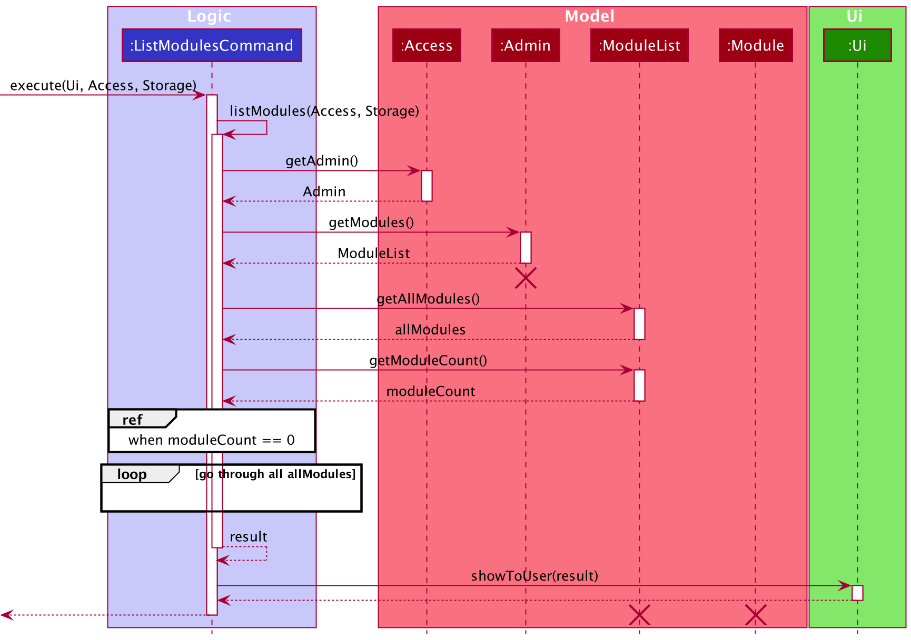
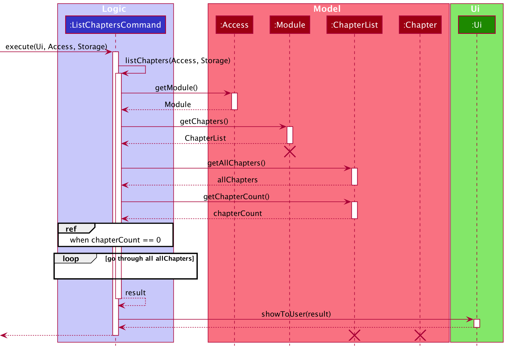
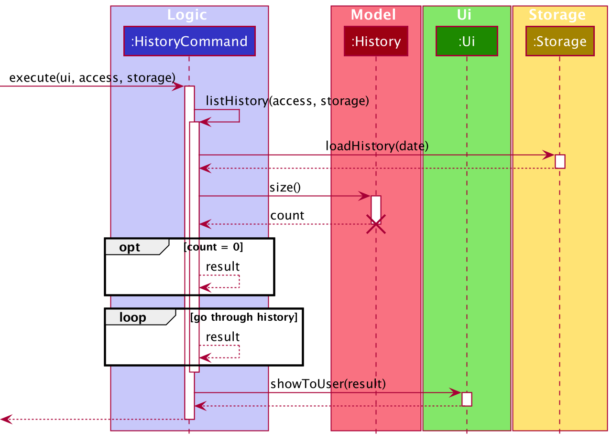

# Developer Guide

## Table of content
1. [<b>Introduction</b>](#1-introduction) 
1.1. [Overview](#11-overview) 
1.2. [Purpose](#12-purpose) 
1.3. [Scope](#13-scope) 
2. [<b>Setting Up</b>](#2-setting-up) 
2.1. [Prerequisites](#21-prerequisites) 
2.2. [Setting Up the Project in your Computer](#22-setting-up-the-project-in-your-computer) 
3. [<b>Design (Architecture)</b>](#3-design-architecture) 
3.1. [Ui Component](#31-ui-component) 
3.2. [Logic Component](#32-logic-component) 
3.3. [Model Component](#33-model-component) 
3.4. [Storage Component](#34-storage-component) 
3.5. [Common Classes](#35-common-classes) 
4. [<b>Implementation</b>](#4-implementation) 
4.1. [Admin Features](#41-admin-features) 
&nbsp;&nbsp;&nbsp;&nbsp;&nbsp;&nbsp;&nbsp;4.1.1. [Add Module Feature](#411-add-module-feature) 
&nbsp;&nbsp;&nbsp;&nbsp;&nbsp;&nbsp;&nbsp;4.1.2. [List Modules Feature](#412-list-modules-feature) 
&nbsp;&nbsp;&nbsp;&nbsp;&nbsp;&nbsp;&nbsp;4.1.3. [Edit Module Name Feature](#413-edit-module-name-feature) 
&nbsp;&nbsp;&nbsp;&nbsp;&nbsp;&nbsp;&nbsp;4.1.4. [Remove Module Feature](#414-remove-module-feature) 
&nbsp;&nbsp;&nbsp;&nbsp;&nbsp;&nbsp;&nbsp;4.1.5. [Access Module Level Feature](#415-access-module-level-feature) 
&nbsp;&nbsp;&nbsp;&nbsp;&nbsp;&nbsp;&nbsp;4.1.6. [Example of the Admin Feature](#416-example-of-the-admin-feature) 
&nbsp;&nbsp;&nbsp;&nbsp;&nbsp;&nbsp;&nbsp;4.1.7. [Conclusion](#417-conclusion) 
4.2. [Module Features](#42-module-features) 
&nbsp;&nbsp;&nbsp;&nbsp;&nbsp;&nbsp;&nbsp;4.2.1. [Add Chapter Feature](#421-add-chapter-feature) 
&nbsp;&nbsp;&nbsp;&nbsp;&nbsp;&nbsp;&nbsp;4.2.2. [List Chapters Feature](#422-list-chapters-feature) 
&nbsp;&nbsp;&nbsp;&nbsp;&nbsp;&nbsp;&nbsp;4.2.3. [Edit Chapter Name Feature](#423-edit-chapter-name-feature) 
&nbsp;&nbsp;&nbsp;&nbsp;&nbsp;&nbsp;&nbsp;4.2.4. [Remove Chapter Feature](#424-remove-chapter-feature) 
&nbsp;&nbsp;&nbsp;&nbsp;&nbsp;&nbsp;&nbsp;4.2.5. [Access Chapter Level Feature](#425-access-chapter-level-feature) 
&nbsp;&nbsp;&nbsp;&nbsp;&nbsp;&nbsp;&nbsp;4.2.6. [Return to Admin Level Feature](#426-return-to-admin-level-feature) 
&nbsp;&nbsp;&nbsp;&nbsp;&nbsp;&nbsp;&nbsp;4.2.7. [Example of the Module Feature](#427-example-of-the-module-feature) 
&nbsp;&nbsp;&nbsp;&nbsp;&nbsp;&nbsp;&nbsp;4.2.8. [Conclusion](#428-conclusion) 
4.3. [Chapter Features](#43-chapter-features) 
&nbsp;&nbsp;&nbsp;&nbsp;&nbsp;&nbsp;&nbsp;4.3.1. [Add Flashcard Feature](#431-add-flashcard-feature) 
&nbsp;&nbsp;&nbsp;&nbsp;&nbsp;&nbsp;&nbsp;4.3.2. [List Flashcards Feature](#432-list-flashcards-feature) 
&nbsp;&nbsp;&nbsp;&nbsp;&nbsp;&nbsp;&nbsp;4.3.3. [Edit Flashcard Content Feature](#433-edit-flashcard-content-feature) 
&nbsp;&nbsp;&nbsp;&nbsp;&nbsp;&nbsp;&nbsp;4.3.4. [Remove Flashcard Feature](#434-remove-flashcard-feature) 
&nbsp;&nbsp;&nbsp;&nbsp;&nbsp;&nbsp;&nbsp;4.3.5. [Return to Module Level Feature](#435-return-to-module-level-feature) 
&nbsp;&nbsp;&nbsp;&nbsp;&nbsp;&nbsp;&nbsp;4.3.6. [Check Overall Performance for a Chapter Feature](#436-check-overall-performance-for-a-chapter-feature) 
&nbsp;&nbsp;&nbsp;&nbsp;&nbsp;&nbsp;&nbsp;4.3.7. [Example of the Chapter Feature](#437-example-of-the-chapter-feature) 
&nbsp;&nbsp;&nbsp;&nbsp;&nbsp;&nbsp;&nbsp;4.3.8. [Conclusion](#438-conclusion) 
4.4. [Revise Feature](#44-revise-feature) 
&nbsp;&nbsp;&nbsp;&nbsp;&nbsp;&nbsp;&nbsp;4.4.1. [Implementation](#441-implementation) 
4.5. [Scheduler feature](#45-scheduler-feature) 
&nbsp;&nbsp;&nbsp;&nbsp;&nbsp;&nbsp;&nbsp;4.5.1. [View Due Chapters Feature](#451-view-due-chapters-feature) 
&nbsp;&nbsp;&nbsp;&nbsp;&nbsp;&nbsp;&nbsp;4.5.2. [Preview Upcoming Dues Feature](#452-preview-upcoming-dues-feature) 
&nbsp;&nbsp;&nbsp;&nbsp;&nbsp;&nbsp;&nbsp;4.5.3. [Exclusion Feature](#453-exclusion-feature) 
&nbsp;&nbsp;&nbsp;&nbsp;&nbsp;&nbsp;&nbsp;4.5.4. [Reschedule Chapter Feature](#454-reschedule-chapter-feature) 
&nbsp;&nbsp;&nbsp;&nbsp;&nbsp;&nbsp;&nbsp;4.5.5. [View Revision History Feature](#455-view-revision-history-feature) 
5. [<b>Appendix: Requirements</b>](#5-appendix-requirements) 
5.1. [Product Scope](#51-product-scope) 
&nbsp;&nbsp;&nbsp;&nbsp;&nbsp;&nbsp;&nbsp;5.1.1. [Target User Profile](#511-target-user-profile) 
&nbsp;&nbsp;&nbsp;&nbsp;&nbsp;&nbsp;&nbsp;5.1.2. [Value Proposition](#512-value-proposition) 
5.2. [User Stories](#52-user-stories) 
5.3. [Use Cases](#53-use-cases) 
5.4. [Non-Functional Requirements](#54-non-functional-requirements) 
5.5. [Glossary](#55-glossary) 
6. [<b>Appendix: Instructions for Manual Testing</b>](#6-appendix-instructions-for-manual-testing) 

--------------------------------------------------------------------------------------------------------------------

## 1. Introduction

### 1.1. Overview

### 1.2. Purpose

### 1.3. Scope
This documentation describes the software architecture and software design decisions for the implementation of Kaji. The intended audience of this document is the developers, designers, and software testers of Kaji.

--------------------------------------------------------------------------------------------------------------------

## 2. Setting Up

### 2.1. Prerequisites
* JDK 11
* IntelliJ IDEA

### 2.2. Setting up the project in your computer
1. Fork this repository, and clone the fork into your computer.
2. Open IntelliJ (if you are not in the welcome screen, click `File` → `Close Project` to close the existing project dialog first).
3. Set up the correct JDK version for Gradle.
    1. Click `Configure` → `Project Defaults` → `Project Structure`.
    2. Click `New…` and set it to the directory of the JDK.
4. Click `Import Project` (or `Open or Import` in newer version of Intellij).
5. Locate the `build.gradle` file (not the root folder as you would do in a normal importing) and select it. Click `OK`.
If asked, choose to `Open as Project` (not `Open as File`).
7. Click `OK` to accept the default settings

--------------------------------------------------------------------------------------------------------------------

## 3. Design (Architecture)
(Zeyu)

The Architecture Diagram given above explains the high-level design of the App. Given below is a quick overview of each component.

The main class is `Kaji.java`. It is responsible for:

* Initializing the components in the correct sequence, and connects them up with each other at app launch.
* Shutting down the components and invoking cleanup methods where necessary at exit.

The rest of the App consists of 8 components:
* `Access`: Keeps track of the access level of the user.
* `UI`: The UI of the App.
* `Command`: Executes the different command types.
* `Common`: Contains common classes.
* `Manager`: Holds the data of the App in memory.
* `Paser`: Parses user input into specific command type.
* `Scheduler`: Schedules the revision schedule.
* `Storage`: Reads data from, and writes data to, the hard disk.

### 3.1. Ui Component 
(Jia Ern)

The UI component consists of a main class — Ui.java. The Kaji, Logic and Storage components have a dependency on the UI component due to the need to take in user input and show the results of execution.

The UI component is responsible for:
* Taking in user input.
* Printing result of execution for the different commands. 
* Printing error messages when certain exceptions occur. 

### 3.2. Logic Component 
(Jane)

The Logic component consists of the `Parser`, `Command` and `Scheduler` classes.

  
   Figure <>. Class diagram of Logic component  

1. `Kaji` uses the `Parser` class to parse the user command.
2. This results in a `Command` object which is executed by `Kaji`.
3. The command execution can affect the `Model` and `Storage` (e.g. adding a module).
4. The `Scheduler` is used in some command execution to schedule the due date of a chapter.
5. The result of the command execution is passed to the `Ui`.

Given below is the Sequence Diagram for interactions within the `Logic` component for the `parse("edit 1 CS2113T")` API call:

  
   Figure <>. Sequence diagram of Logic component  

>:information_source: <b>Note:</b> The lifeline for `Parser` should end at the destroy marker (X) but due to a limitation of PlantUML, the lifeline reaches the end of diagram.

### 3.3. Model Component
(Jiayi)
API: Model.java

The Model,

* stores a Access object that holds temporary data for user's access level and contents of level being accessed.
* stores a History object that saves revision history of current day.
* stores a DueChapter object that manages due chapter data.
* contains an Admin class that can be created and accessed by Access object. The Admin class contains a ModuleList object to manage data for modules.
* contains a Module class that can be created and accessed by Access object. The Module class contains a ChapterList object to manage data for chapters.
* contains a Chapter class that can be created and accessed by Access object. The Chapter class contains a CardList object to manage data for cards.
* contains a Card object that can be created and accessed by CardList. A Card object represents a flashcard with question, answer and master level of revision.

### 3.4. Storage Component 
(Lucas)

### 3.5. Common Classes

--------------------------------------------------------------------------------------------------------------------

## 4. Implementation

### 4.1. Admin Features
[summary + scenario]

#### 4.1.1. Add Module Feature
(Jiayi)
##### Implementation
`AddModuleCommand` facilitates the proposed add module feature. It extends `AddCommand` with an `AddCommand#prepareResult()` method. This method formates message about the result of the action to user in `Ui`. 

Shown as the class diagram below, because of the inheritance of `AddCommand`, `Command` and `AddModuleCommand`, `Kaji` is able to execute the operation `AddModuleCommand#excute()`. 

Given below is an example usage scenario at Admin level and how the add module feature behaves at each step:

Step 1: The user is currently in admin level.

Step 2: The user want to add a new module CS2113 and enters `add CS2113` command.

Step 3: The `Kaji` object passes the user's command to the `Parser` object. Then `Parser` creates a new `AddModuleCommand` object and return the `AddModuleCommand` object to `Kaji`.

Step 4: The `Kaji` object uses the public `AddModuleCommand#excute()` to add new modules into Kaji application.

Step 5: The `AddModuleCommand` object creates a new `Module` object with the `Module#moduleName` of CS2113. 

Step 6: The new `CS2113 : Module` object will be passed into the `AddModuleCommand#addModule()` with `Access` and `Storage`.

Step 7: The `AddModuleCommand#addModule()` gets the current `Admin` object via `Access#getAdmin()` method, then it adds the new `CS2113: Module` object into the `Admin#ModuleList`. 

Step 8: The new `Admin` object with the `CS2113: Module` object is updated to `Access` via the method `Access#setAdmin(Admin)`.

Step 9: The new `Module` is updated in the folder by executing the `Storage#createModule()`. A 'CS2113' folder is created under the 'data/admin' folder.

Step 10: A result message is returned from `AddModuleCommand#addModule()` method to the `AddModuleCommand#execute()` method which uses `Ui#showToUser()` to print the success message.

The following diagam shows how the add module command feature works:

#### 4.1.2. List Modules Feature
(Zeyu)

The list modules feature allows the user to list all modules in admin level 

The list modules mechanism is facilitated by `ListModulesCommand`. It extends from the abstract class `ListCommand`. 

In addition, it implements the following operations:
* `ListModulesCommand#execute()` — oversees entire execution for listing modules.
* `ListModulesCommand#listModules()` — gets and lists all modules in admin level.

For instance, the user wants to list all modules available in `admin`, a detailed description of what happens is shown below:

* Step 1: The user is currently in `admin` level. 

* Step 2: The user enters `list` command to list all modules in `admin` level. 

The following sequence diagram shows how the list modules feature works:

#### 4.1.3. Edit Module Name Feature
(Jane)
##### Implementation
The edit module name feature allows the user to edit the name of any existing module.

The user can edit the name of an existing module with the `edit` command, which follows the following format: `edit MODULE_INDEX MODULE_NAME`.

The edit module name feature is facilitated by `ModuleList` and `Module`.
In addition, it implements the following operations:
* `ModuleList#getModule()` - Returns a module based on the specified index from the list of modules.
* `Module#setModuleName()` — Sets the name of the module.
 
For instance, the user wants to edit the module `CS2113`, a detailed description of what happens is shown below:

Step 1: The user is currently in `admin` level.

Step 2: The user enters `edit 1 CS2113T` command to edit the first module in the list of modules — which in this case is `CS2113`.

Step 3: The user input is parsed by `Parser`, and `Parser` creates a `EditModuleCommand` object.

Step 4: `EditModuleCommand` is executed and calls the method `EditModuleCommand#editModule()`.

Step 5: `EditModuleCommand#editModule()` gets the module based on the index provided by the method `ModuleList#getModule()`.

Step 6: The module name is edited to `CS2113T` by the method `Module#setModuleName()`.

Step 7: The result message from `EditModuleCommand#editModule()` is returned to `EditModuleCommand#execute()` and shown to the user by calling `Ui#showToUser()`.

The following sequence diagram shows how the edit module name feature works:

  
   Figure <>. Sequence diagram of edit module name feature  

>:information_source: <b>Note:</b> The lifeline for `Parser` and `Admin` should end at the destroy marker (X) but due to a limitation of PlantUML, the lifeline reaches the end of diagram.

#### 4.1.4. Remove Module Feature
(Jia Ern)

The remove module feature allows the user to remove a module by specifying the index of the module in the list. 

The remove module mechanism is facilitated by `RemoveModuleCommand`. It extends from the abstract class `RemoveCommand`. 

In addition, it implements the following operations:
* `RemoveModuleCommand#execute()` — oversees entire execution for removing a module.
* `RemoveModuleCommand#removeModule()` — removes module from list of modules including the chapters and flashcards under it.
* `RemoveCommand#prepareResult()` — prepares the resulting message of the execution.

For instance, the user wants to start a remove the module `CS2113T`, a detailed description of what happens is shown below:

Step 1: The user is currently in `admin` level. 

Step 2: The user enters `remove 1` command to delete the first module in the list of modules — which in this case is `CS2113T`. The `remove` command creates `RemoveModuleCommand` which will then be executed. 

Step 3: `RemoveModuleCommand#execute` gets the `module` based on the index provided and passes it to `Storage#deleteDirectory` to delete the module folder as well as the chapters and flashcards under it. 

The following sequence diagram shows how the remove module feature works:

#### 4.1.5. Access Module Level Feature
(Jiayi)

`GoModuleCommand` class facilitates the proposed access module level feature. It extends `GoCommand` class. 

It implements the following operations:
* `GoModuleCommand#execute()` -- Inherites from the abstract `GoCommand`. It is overrided to calls `GoModuleCommand#goModule()` and print message to user.
* `GoModuleCommand#goModule()` -- Accesses a new module level from admin level based on the module name entered by user. If the module name does not match with any of the existing module, it returns a error message. Otherwise, this operation returns a successful message to the `GoModuleCommand#execute` operation.

Shown as the class diagram below, with the inheritance of `GoCommand` and `Command`, `Kaji` is able to execute the operation `GoModuleCommand#execute()` directly. 

Given below is an example usage scenario at Admin level and how the access module level feature behaves at each step:

Step 1: The user is currently in admin level.

Step 2: The user want to access a module level named 'CS2113' and enters `go CS2113` command. This example is based on the assumption that the module 'CS2113' already has been added.

Step 3: The `Kaji` object passes the user's command to the `Parser` object. The `Parser` creates a new `GoModuleCommand` object if the user's current access level is admin level. Then `Parser` returns the `GoModuleCommand` object to `Kaji`.

Step 4: The `Kaji` object uses the public `GoModuleCommand#execute()` to access module level 'CS2113'.

Step 5: The `GoModuleCommand#execute()` object calls its own private operation `GoModuleCommand#goModule()` to check the existence of the module level entered by user and modify the user's access level if the module level exists. 

Step 6: The reference of both the `Access` and `Storage` objects is passed into `GoModuleCommand#goModule()`.

Step 7: The `GoModuleCommand#goModule()` gets all the `Module` objects in the `Access#Admin` via the methods `Access#getAdmin()`, `Admin#getModules()` and `ModuleList#getAllModules()` respectively. 

Step 8: A for loop is used to check the existence of module entered by user. If there is an existing module with same `Module#moduleName` as the module code entered by user, the `GoModuleCommand#goModule()` operation returns an successful message.

Step 9: `GoModuleCommand#execute()` prints the successful message to the user via `Ui#showToUser()` method.

The following diagam shows how the add chapter command feature works:

#### 4.1.6. Example of the Admin Feature

#### 4.1.7. Conclusion

### 4.2. Module Features
[summary + scenario]

#### 4.2.1. Add Chapter Feature
(Jiayi)
##### Implementation
`AddChapterCommand` facilitates the proposed add chapter feature. It extends `AddCommand` with an `AddCommand#prepareResult()` method. This method formates message about the result of the action to user in `Ui`. 

Shown as the class diagram below, because of the inheritance of `AddCommand`, `Command` and `AddChapterCommand`, `Kaji` is able to execute the operation `AddChapterCommand#excute()`. 

Given below is an example usage scenario at Module level and how the add chapter feature behaves at each step:

Step 1: The user is currently in module level.

Step 2: The user want to add a new chapter chapter1 and enters `add chapter1` command.

Step 3: The `Kaji` object passes the user's command to the `Parser` object. Then `Parser` creates a new `AddChapterCommand` object and return the `AddChapterCommand` object to `Kaji`.

Step 4: The `Kaji` object uses the public `AddChapterCommand#excute()` to add new chapters into Kaji application.

Step 5: The `AddChapterCommand` object creates a new `Chapter` object with the `Chapter#chapterName` of chapter1. 

Step 6: The new `chapter1 : Chapter` object will be passed into the `AddChapterCommand#addChapter()` with `Access` and `Storage`.

Step 7: The `AddChapterCommand#addChapter()` gets the current `Module` object via `Access#getModule()` method, then it adds the new `chapter1: Chapter` object into the `Module#ChapterList`. 

Step 8: The new `Module` object with the `chapter1: Chapter` object is updated to `Access` via the method `Access#setModule(Module)`.

Step 9: The new `Chapter` is updated in the folder by executing the `Storage#createChapter()`. A 'chapter1' folder is created under the 'data/module' folder.

Step 10: A result message is returned from `AddChapterCommand#addChapter()` method to the `AddChapterCommand#execute()` method which uses `Ui#showToUser()` to print the success message.

The following diagam shows how the add chapter command feature works:

#### 4.2.2. List Chapters Feature
(Zeyu)

The list chapters feature allows the user to list all chapters in module level 

The list chapters mechanism is facilitated by `ListChaptersCommand`. It extends from the abstract class `ListCommand`. 

In addition, it implements the following operations:
* `ListChaptersCommand#execute()` — oversees entire execution for listing chapters.
* `ListChaptersCommand#listChapters()` — gets and lists all chapters in module level.

For instance, the user wants to list all chapters available in `CS2113T` (module name), a detailed description of what happens is shown below:

* Step 1: The user is currently in `CS2113T` level. 

* Step 2: The user enters `list` command to list all chapters in `CS2113T` level. 

The following sequence diagram shows how the list chapters feature works:

#### 4.2.3. Edit Chapter Name Feature
(Jane)
##### Implementation
The edit chapter name feature allows the user to edit the name of any existing chapter.

The user can edit the name of an existing chapter with the `edit` command, which follows the following format: `edit CHAPTER_INDEX CHAPTER_NAME`.

The edit module name feature is facilitated by `ChapterList` and `Chapter`.
In addition, it implements the following operations:
* `ChapterList#getChapter()` - Returns a chapter based on the specified index from the list of chapters.
* `Chapter#setChapterName()` — Sets the name of the chapter.
 
For instance, the user wants to edit the chapter `chap 1` from the module `CS2113T`, a detailed description of what happens is shown below:

Step 1: The user is currently in `CS2113T` at the module level.

Step 2: The user enters `edit 1 Chapter 1` command to edit the first chapter in the list of chapters — which in this case is `chap 1`.

Step 3: The user input is parsed by `Parser`, and `Parser` creates a `EditChapterCommand` object.

Step 4: `EditChapterCommand` is executed and calls the method `EditChapterCommand#editChapter()`.

Step 5: `EditChapterCommand#editModule()` gets the chapter based on the index provided by the method `ChapterList#getChapter()`.

Step 6: The chapter name is edited to `Chapter 1` by the method `Chapter#setChapterName()`.

Step 7: The result message from `EditChapterCommand#editChapter()` is returned to `EditChapterCommand#execute()` and shown to the user by calling `Ui#showToUser()`.

The following sequence diagram shows how the edit chapter name feature works:

  
   Figure <>. Sequence diagram of edit chapter name feature  

>:information_source: <b>Note:</b> The lifeline for `Parser` and `Module` should end at the destroy marker (X) but due to a limitation of PlantUML, the lifeline reaches the end of diagram.

#### 4.2.4. Remove Chapter Feature
(Jia Ern)

The remove chapter feature allows the user to remove a chapter by specifying the index of the chapter in the list. 
The remove chapter mechanism is facilitated by `RemoveChapterCommand`. It extends from the abstract class `RemoveCommand`. 

In addition, it implements the following operations:
* `RemoveChapterCommand#execute()` — oversees entire execution for removing a chapter.
* `RemoveChapterCommand#removeModule()` — removes chapter from list of chapters in a module including the flashcards under it.
* `RemoveCommand#prepareResult()` — prepares the resulting message of the execution.

For instance, the user wants to start a remove the chapter `Chapter 1` from the module `CS2113T`, a detailed description of what happens is shown below:

Step 1: The user is currently in `CS2113T` at the module level. 

Step 2: The user enters `remove 1` command to delete the first chapter in the list of chapters — which in this case is `Chapter 1`. The `remove` command creates `RemoveChapterCommand` which will then be executed. 

Step 3: `RemoveChapterCommand#execute` gets the `chapter` based on the index provided and passes it to `Storage#deleteDirectory` to delete the chapter file as well as the flashcards under it. 

The following sequence diagram shows how the remove chapter feature works:

#### 4.2.5. Access Chapter Level Feature
(Lucas)

#### 4.2.6. Return to Admin Level Feature
(Lucas)

#### 4.2.7. Example of the Module Feature

#### 4.2.8. Conclusion

### 4.3. Chapter Features
[summary + scenario]

#### 4.3.1. Add Flashcard Feature
(Jane)
##### Implementation
The add flashcard feature allows the user to add a flashcard to a chapter.

The user can add a flashcard with the `add` command, which follows the following format: `add q:QUESTION | a: ANSWER`.

The add flashcard feature is facilitated by `CardList`.
In addition, it implements the following operation:
* `CardList#addCard()` - Adds a flashcard to the list of flashcards.
 
For instance, the user wants to add a flashcard `[Q] 1+1 | [A] 2` to the chapter `Chapter 1` for module `CS2113T`, a detailed description of what happens is shown below:

Step 1: The user is currently in `Chapter 1` at the chapter level of the module `CS2113T`.

Step 2: The user enters `add q:1+1 | a:2` command to add a flashcard to the list of flashcards.

Step 3: The user input is parsed by `Parser`, and `Parser` creates a `AddCardCommand` object.

Step 4: A `Card` object is created within `AddCardCommand`.

Step 5: `AddCardCommand` is executed and calls the method `AddCardCommand#addCard()`.

Step 6: `AddCardCommand#addCard()` adds a flashcard to the list of flashcards by calling the method `CardList#addCard()`.

Step 7: The result message from `AddCardCommand#addCard()` is returned to `AddCardCommand#execute()` and shown to the user by calling `Ui#showToUser()`.

The following sequence diagram shows how the add flashcard feature works:

  
   Figure <>. Sequence diagram of add flashcard feature  

>:information_source: <b>Note:</b> The lifeline for `Parser` and `Chapter` should end at the destroy marker (X) but due to a limitation of PlantUML, the lifeline reaches the end of diagram.

#### 4.3.2. List Flashcards Feature
(Zeyu)

The list flashcards feature allows the user to list all flashcards in chapter level 

The list flashcards mechanism is facilitated by `ListCardsCommand`. It extends from the abstract class `ListCommand`. 

In addition, it implements the following operations:
* `ListCardsCommand#execute()` — oversees entire execution for listing flashcards.
* `ListCardsCommand#listCards()` — gets and lists all flashcards in chapter level.

For instance, the user wants to list all flashcards available in `Chapter 1` (chapter name), a detailed description of what happens is shown below:

* Step 1: The user is currently in `Chapter 1` level. 

* Step 2: The user enters `list` command to list all flashcards in `Chapter 1` level. 

The following sequence diagram shows how the list flashcards feature works:

#### 4.3.3. Edit Flashcard Content Feature
(Jane)
##### Implementation
The edit flashcard content feature allows the user to edit the content of any existing flashcard.

The user can edit the content of an existing flashcard with the `edit` command, which follows the following format: `edit FLASHCARD_INDEX q:QUESTION | a: ANSWER`.

The edit flashcard content feature is facilitated by `CardList` and `Card`.
In addition, it implements the following operations:
* `CardList#getCard()` - Returns a flashcard based on the specified index from the list of flashcards.
* `Card#setQuestion()` — Sets the question of a flashcard.
* `Card#setAnswer()` — Sets the answer of a flashcard.
 
For instance, the user wants to edit the flashcard `[Q] 2*1 | [A] 2` from the chapter `Chapter 1` for module `CS2113T`, a detailed description of what happens is shown below:

Step 1: The user is currently in `Chapter 1` at the chapter level of the module `CS2113T`.

Step 2: The user enters `edit 1 q:1+1 | a:` command to edit the first flashcard in the list of flashcards — which in this case is `[Q] 2*1 | [A] 2`.

Step 3: The user input is parsed by `Parser`, and `Parser` creates a `EditCardCommand` object.

Step 4: `EditCardCommand` is executed and calls the method `EditCardCommand#editCard()`.

Step 5: `EditCardCommand#editCard()` gets the chapter based on the index provided by the method `CardList#getCard()`.

Step 6: The question is edited to `1+1` by the method `Card#setQuestion()`.

Step 7: As there is no content to edit the answer, the method `Card#setAnswer()` is not called.

Step 7: The result message from `EditCardCommand#editCard()` is returned to `EditCardCommand#execute()` and shown to the user by calling `Ui#showToUser()`.

The following sequence diagram shows how the edit flashcard content feature works:

  
   Figure <>. Sequence diagram of edit flashcard content feature  

>:information_source: <b>Note:</b> The lifeline for `Parser` and `Chapter` should end at the destroy marker (X) but due to a limitation of PlantUML, the lifeline reaches the end of diagram.

#### 4.3.4. Remove Flashcard Feature
(Jia Ern)

The remove flashcard feature allows the user to remove a flashcard by specifying the index of the flashcard in the list. 
The remove flashcard mechanism is facilitated by `RemoveFlashcardCommand`. It extends from the abstract class `RemoveCommand`. 

In addition, it implements the following operations:
* `RemoveFlashcardCommand#execute()` — oversees entire execution for removing a flashcard.
* `RemoveFLashcardCommand#removeModule()` — removes flashcard from list of flashcards in a chapter.
* `RemoveCommand#prepareResult()` — prepares the resulting message of the execution.

For instance, the user wants to start a remove the flashcard `[Q] 1+1 | [A] 2` from the chapter `Chapter 1`, a detailed description of what happens is shown below:

Step 1: The user is currently in `Chapter 1` at the chapter level of the module `CS2113T`. 

Step 2: The user enters `remove 1` command to delete the first flashcard in the list of flashcards — which in this case is `[Q] 1+1 | [A] 2`. The `remove` command creates `RemoveCardCommand` which will then be executed. 

Step 3: `RemoveCardCommand#execute` gets the `flashcard` based on the index provided and removes it from the `CardList` 

Step 4: The updated `CardList` is passed to `Storage#saveCards()` to update the contents of the chapter with the removed card. 

The following sequence diagram shows how the remove flashcard feature works:

#### 4.3.5. Return to Module Level Feature
(Jia Ern)

The return to module level feature allows the user to return to the module level from the chapter level.
The return to module level mechanism is facilitated by `BackModuleCommand`. It extends from the abstract class `BackCommand`. 

In addition, it implements the following operation:
* `BackModuleCommand#execute` — lowers access level of the user.

For instance, the user wants to return to the module level from the chapter he is currently at in the module `CS2113T`, a detailed description of what happens is shown below:

Step 1: The user is currently in `Chapter 1` at the chapter level in the module `CS2113T`. 

Step 2: The user enters `back` command to return to `CS2113T`. The `back` command creates `BackModuleCommand` which will then be executed.

Step 3: `BackModuleCommand#execute` passes an empty string to `Access#setChapterLevel()` to check the chapter level and calls `Access#setIsModuleLevel` to set the user back to module level.

The following sequence diagram shows how the return to module level feature works:

#### 4.3.6. Check Overall Performance for a Chapter Feature
(Jiayi)
##### Implementation
`ShowRateCommand` facilitates the proposed check overall performance feature. It extends an abstract `Command` class with the abstract `Command#execute()` and `Command#isExit()`.

It implements the following operations:
* `ShowRateCommand#execute()` -- Inherites from the abstract `Command`. It is overrided to calls `ShowRateCommand#computePercentage()` and print message that specific to performance checking feature.
* `ShowRateCommand#computePercentage()` -- Computes the overall performance by master levels and updates the `ShowRateCommand#easyPercentage`, `ShowRateCommand#mediumPercentage`, `ShowRateCommand#hardPercentage` and `ShowRateCommand#cannotAnswerPercentage`, then it returns number of cards in the `Chapter`.
* `ShowRateCommand#isExit()` -- Inherites from the abstract `Command`. It is overrided to return `false`.

Shown as the class diagram below, with the inheritance of `Command`, `Kaji` is able to execute the operation `ShowRateCommand#execute()` directly. 

Given below is an example usage scenario at Chapter level and how the show overall performance feature behaves at each step:

Step 1: The user is currently in chapter level.

Step 2: The user want to check overall performance of the current chapter level and enters `showrate` command.

Step 3: The `Kaji` object passes the user's command to the `Parser` object. Then `Parser` creates a new `ShowRateCommand` object and return the `ShowRateCommand` object to `Kaji`.

Step 4: The `Kaji` object uses the public `ShowRateCommand#excute()` to compute overall performance and print relevant message to user.

Step 5: The `ShowRateCommand` object gets the reference of current chapter level via the `Access#getChapter()` and stores the reference as a `Chapter` object. 

Step 6: The `Chapter` object will be passed into the operation `ShowRateCommand#computePercentage()`.

Step 7: The `ShowRateCommand#computePercentage()` gets all the `Card` objects in the current `Chapter` object via the methods `Chapter#getCards()` and `CardList#getAllCards()` respectively. 

Step 8: If there is no `Card` object in the current `Chapter`, the `ShowRateCommand#computePercentage()` operation returns int `0` after checking the `ArrayList<Card>` size. If there are `Card` objects, a 'for' loop is used to check the `Card#rating` of every `Card` objects and compute the overall performance. 

Step 9: `ShowRateCommand#computePercentage()` updates the variables `ShowRateCommand#easyPercentage`, `ShowRateCommand#mediumPercentage`, `ShowRateCommand#hardPercentage` and `ShowRateCommand#cannotAnswerPercentage` at the end and returns the number of cards in the chapter

Step 10: `GoModuleCommand#execute()` prints the performance message to the user via `Ui#showToUser` if the `ShowRateCommand#computePercentage()` is greater than int `0`.

The following diagam shows how the show overall performance feature works:

#### 4.3.7. Example of the Chapter Feature

#### 4.3.8. Conclusion

### 4.4. Revise Feature
(Jia Ern)

The revise feature allows the user to start a revision on a chapter and can only be done when the user is in the module level. 

#### 4.4.1. Implementation
The revise mechanism is facilitated by `ReviseCommand`. It extends from the abstract class `Command`. 

In addition, it implements the following operations:
* `ReviseCommand#execute()` — oversees the entire revise process and calls the respective methods when necessary.
* `ReviseCommand#getChapter()` — gets `chapter` based on the index the user provided.
* `ReviseCommand#getCards()` — gets a list of `card` in `chapter`.
* `ReviseCommand#promptNotDue()` — prompts user if he still wants to revise a `chapter` that is not due.
* `ReviseCommand#reviseCard()` — makes use of `ui` to show the contents of each card to the user and gets rating input for the particular card.
* `ReviseCommand#rateCard()` — gets user input on difficulty of a flashcard.
* `ReviseCommand#repeatRevision()` — repeats revision for cards which user could not answer. 

For instance, the user wants to start a revision for `Chapter 1` in the module `CS2113T`, a detailed description of what happens is shown below:

Step 1: The user is currently in `CS2113T` at the module level.

Step 2: The user enters `revise 1` command to revise the first chapter in the module — which in this case is `Chapter 1`. The `revise` command creates `ReviseCommand` which will then be executed.

Step 3: `ReviseCommand#execute` gets `Chapter1` based on the index provided as well as a list of `card` under the particular chapter by calling `ReviseCommand#getChapter` and `ReviseCommand#getCards` respectively.

Step 4: If the `chapter` is not due for revision yet, `ReviseCommand#promptNotDue()` will prompt the user if he still wants to revise a `chapter` that is not due. If the user enters `Y`, the Revise feature will continue execution, else it will return to the main class Kaji, and wait for the next command.

Step 5: `ReviseCommand#execute` loops through each flashcard and shows the user its contents by calling `ReviseCommand#reviseCard()`  and inside it, `ReviseCommand#rateCard()` is called and makes use of `Ui#getUserInput()` to get user to rate the difficulty of each flashcard. 

Step 6: A success message of completeing the revision will be shown to the user through `Ui#showToUser()`.

Step 7: `Scheduler#computeDeckDeadline()` then calculates the new deadline for the `chapter` and passes the result to `Chapter#setueBy()` to set the new deadline for the `chapter`.

Step 6: `ReviseCommand#repeatRevision` then repeats the revision session on cards which the user could not answer.

Step 7: Lastly, `ReviseCommand#execute()` calls `HistoryCommand#addHistory()` to keep a record of the chapter revised so that the user can review what revision has been completed.

The following sequence diagram shows how the revise feature works:

#### 4.4.2. Scheduling The Chapters Feature
In KAJI, each `Chapter` stores a `CardList` of `Card`s, each with their own `int` attribute `previousInterval`. Each `Chapter` also has a `LocalDate` attribute named `dueBy` that determines when the `Chapter` is due for revision. 
At the end of a revision session, the `Scheduler` class implements Spaced Repetition by computing the `deckInterval`, the mean (rounded off to the nearest integer) of the `previousInterval`s of every `Card` within the `Chapter`, and updates the `dueBy` attribute of the `Chapter` to `deckInterval` days after the day of revision.

To support this feature, `Scheduler` implements the following operations:
* `Scheduler#computeEasyInterval()` - returns the product of the `Card`'s `previousInterval` and the Easy Multiplier(4.4) rounded to the nearest integer
* `Scheduler#computeMediumInterval()` - returns the product of the `Card`'s `previousInterval` and the Medium Multiplier(2.2) rounded to the nearest integer
* `Scheduler#computeHardInterval()` - returns the product of the `Card`'s `previousInterval` and the Hard Multiplier(1.1) rounded to the nearest integer
* `Scheduler#computeChapterInterval()` - returns the mean of the `previousInterval` of each `Card` within the `Chapter` rounded off to the nearest integer
* `Scheduler#computeChapterDeadline()` - returns a `LocalDate` object containing the new `dueBy`, which is interval(returned from `Scheduler#computeChapterInterval()`) days away from the current day

`Scheduler#computeEasyInterval()`, `Scheduler#computeMediumInterval()` and `Scheduler#computeHardInterval()` are exposed in the `ReviseCommand` class as `ReviseCommand#rateCard()` while `Scheduler#computeDeckDeadline()` is exposed as `ReviseCommand#execute()`.

***Example***
Given below is an example usage scenario on how the Scheduler mechanism behaves at each step when: 
`revise 1` is called in a `Module` that contains only one `Chapter` with three `Card`s in its `CardList` attribute and confirmation is given to proceed with revision.

\<OBJECT DIAGRAMS\>

Step 1:
* The user enters `revise 1` within the `Module` and `ReviseCommand` is instantiated. 
* Upon confirmation to revise and a check that `CardList` of the designated `Chapter` is not empty is complete, `ReviseCommand` proceeds to create a `ArrayList<Card> allCards` comprising of all `Card`s within in the `CardList`.

Step 2:
* For each `Card` in `allCards`, `ReviseCommand#reviseCard()` is called upon completion of either `ReviseCommand#execute()` or `ReviseCommand#repeateRevision()`.
* This operation then calls `Scheduler#computeEasyInterval()`, `Scheduler#computeMediumInterval()` or `Scheduler#computeHardInterval()` depending on the user input to compute and update the new value of `previousInteral` for each card.

Step 3:
* Upon completion of all revision, `ReviseCommand#execute()` will call `Scheduler#computeDeckDeadline()`, which in turn calls `Scheduler#computeDeckInterval()`. `Scheduler#computeDeckInterval()` computes `deckInterval`, the mean (rounded off to the nearest integer) of the `previousInterval`s of each `Card` in `allCards,` and returns it to `Scheduler#computeDeckDeadline()`.

Step 4:
* Using `deckInterval`, `Scheduler#computeDeckDeadline()` computes the new value of `dueBy` for the Chapter, which is then returned to `ReviseCommand#execute()`, where it will then update the value of `dueBy` for the `Chapter` that was just revised.

### 4.5. Viewing and Customising the Schedule Feature
KAJI schedules the user's database automatically for them based on their [revision sessions](#), chapter by chapter, using Spaced Repetition. Users should be able to view their schedule for the current day to know which tasks they need to complete on the day itself and to view their schedule for the upcoming week so that they can plan ahead. However, to effectively use the scheduling feature, users should also be able to customise their scheduling system to include or exclude chapters from their schedule with ease.

To utilise this feature, the following commands and their corresponding features are introduced:
* [`due`](#451-View-Due-Chapters-Feature) - Viewing their schedule for the current day (View Due)
* [`preview`](#452-Preview-Upcoming-Dues-Feature) - Viewing their schedule for the upcoming week (Preview Upcoming Due)
* [`exclude`](#453-Exclusion-Feature) - Customising which of their Chapters will be in the Scheduler (Exclusion)

#### 4.5.1. View Due Chapters Feature
(Lucas)

***Implementation***

Each Chapter has a [`deadline assigned to it`](#) from the point of creation, which forms the core of the Scheduling process. The View Due Chapters Feature builds on that by allowing users to view every chapter in the database that is due on the current day with a single command.

To support this feature, the following command was added to KAJI:
* `due` - A command that displays every `Chapter` in the database that is due on a given day.
A corresponding Class `ListDueCommand` was also created to carry out the functions related to the command.

This feature takes the [`Exclusions`](#) of the database into account and will not display `Chapter`s from the Exclusion List when the user calls them even if their deadlines are due.

As this Feature can be activated at any point, the following class is created to identify `Chapter`s easily.
* `DueChapter` - object contain two variables, `String parentModule` to identify the `Chapter`'s parent `Module`, and `Chapter chapter` to hold a reference to the actual `Chapter`

To support the View Due feature, `ListDueCommand` implements the following operations:
* `ListDueCommand#loadAllDueChapters()` - Calls `Storage#loadAllDueChapters()` to load every `Chapter` in the database as a `DueChapter` and stores them into a `ArrayList<DueChapter> allDueChapters` 
* `ListDueCommand#setDueDueChapters()` - Checks each `DueChapter` in `ArrayList<DueChapter> allDueChapters` to verify if the underlying `Chapter` is due by the current day by calling `Scheduler#isDeadlineDue()` on the `Chapter`'s deadline', and adds the due `DueChapters` into `ArrayList<DueChapter> dueDueChapters`
* `ListDueCommand#execute()` - Calls `ListDueCommand#loadAllDueChapters()`, `ListDueCommand#setDueDueChapters()` and prints the `DueChapter`s that are due

On top of that, `Storage` implements the following operations:
* `Storage#checkChapterDeadline()` - Reads the deadline for each `Chapter`, prompts if they are corrupted, and adds a `DueChapter` formed with the `Chapter` into `ArrayList<DueChapter> allDueChapters`
* `Storage#checkAllChaptersForDue()` - Obtains the name of every `Chapter` from the list of Modules passed to it and calls `Storage#checkChapterDeadline()` for each of them
* `Storage#loadAllDueChapters()` - Obtains the names of every `Module` in the user database and calls `Storage#checkAllChaptersForDue()`

The following sequence Diagrams illustrates how the View Due Chapters Process is executed:

#### 4.5.2. Preview Upcoming Dues Feature
(Lucas)

***Implementation***

Similar to the View Due Chapters Feature, the Preview Upcoming Dues Feature builds on the Scheduling process by allowing users to view every chapter in the database that is due in the upcoming week with a single command.

To support this feature, the following command was added to KAJI:
* `preview` - A command that displays every `Chapter` in the database that is due in the upcoming week.
A corresponding Class `PreviewCommand` was also created to carry out the functions related to the command.

This feature also takes the [`Exclusions`](#) of the database into account and will not display `Chapters` from the Exclusion List when the user calls them even if they are due in the upcoming week.

As this Feature can be activated at any point, the following class is also (similar to View Due Chapters) used to identify `Chapter`s easily.
* `DueChapter` - object contain two variables, `String parentModule` to identify the `Chapter`'s parent `Module`, and `Chapter chapter` to hold a reference to the actual `Chapter`

To support the Preview Upcoming Dues feature, `PreviewCommand` implements the following operations:
* `PreviewCommand#loadAllDueChapters()` - Calls `Storage#loadAllDueChapters()` to load every `Chapter` in the database as a `DueChapter` and stores them into a `ArrayList<DueChapter> allDueChapters` 
* `PreviewCommand#setDueDueChapters()` - Checks each `DueChapter` in `ArrayList<DueChapter> allChapters` to verify if the underlying `Chapter` is due in an increment number of days from the current day by calling `Scheduler#isDeadlineDueIn()` on the `Chapter`'s deadline, and adds the due `DueChapters` into `ArrayList<DueChapter> dueDueChapters`
* `PreviewCommand#execute()` - Calls `PreviewCommand#loadAllDueChapters()`, before calling `PreviewCommand#setDueDueChapters()` for the current day, then one to six days after the current day, and prints the `DueChapter`s for each day individually

On top of that, the following operations from `Storage` are used:
* `Storage#checkChapterDeadline()` - Reads the deadline for each `Chapter`, prompts if they are corrupted, and adds a `DueChapter` formed with the `Chapter` into `ArrayList<DueChapter> allDueChapters`
* `Storage#checkAllChaptersForDue()` - Obtains the name of every `Chapter` from the list of Modules passed to it and calls `Storage#checkChapterDeadline()` for each of them
* `Storage#loadAllDueChapters()` - Obtains the names of every `Module` in the user database and calls `Storage#checkAllChaptersForDue()`

The following sequence Diagrams illustrates how the Preview Upcoming Dues Process is executed:

#### 4.5.3. Exclusion Feature
(Lucas)

***Implementation***

KAJI allows users to customise which Chapters are to be excluded from their scheduling by maintaining an Exclusion List: a list of Chapters that KAJI will ignore as it parses for Chapters that are due in the `due` and `preview` commands. This is to allow users to exclude and include `Chapter`s from and to their schedules without having to remove and add the `Chapter`s from their database, which can be tedious.

To support this feature, the following command was added to KAJI:
* `exclude` - A command that excludes more or less `Chapters` from the Exclusion List.
A corresponding Class `ExecuteCommand` was also created to carry out the functions related to the command.

The `exclude` command can be called with either `exclude more` or `exclude less`, which adds to or removes from the Exclusion List respectively. Furthermore, both modes can be used to edit the Exclusion List a single `Chapter` at a time or every `Chapter` belonging to a `Module` at a time as a secondary option.

To determine if the Exclusion List is going to be modified by a single `Chapter` or by an entire `Module`, `ExcludeCommand` implements an operation each for `exclude more` and `exclude less`.
* For `exclude more`:
    * `ExcludeCommand#addingToExclusion()` - calls `ExcludeCommand#addChapterToExclusion()` if user inputs "chapter", `ExcludeCommand#addModuleToExclusion()` if user inputs "module"
* For `exclude less`:
    * `ExcludeCommand#addingToExclusion()` - calls `ExcludeCommand#removeChapterFromExclusion()` if user inputs "chapter", `ExcludeCommand#removeModuleFromExclusion()` if user inputs "module"

To load and store the Exclusion List, a Exclusion File is created and maintained using these two methods from the `Storage` Class:
* `Storage#loadExclusionFile()` - Reads the contents of the Exclusion File, parses it into the Exclusion List, stored as a `ArrayList<String>`, and returns it.
* `Storage#updateExclusionFile()` - Writes the `ArrayList<String>` Exclusion List into the Exclusion File.

The `ArrayList<String>` Exclusion List is modified using four pairs of commands in both `ExcludeCommand` and `Storage`:

* Excluding a Chapter from Scheduling
    * `ExcludeCommand#addChapterToExclusion()` - gets the name of the `Chapter` to be excluded and the name of the `Module` it belongs to, and calls `Storage#appendChapterToExclusionFile()`
    * `Storage#appendChapterToExclusionFile()` - appends the target `Chapter` to the Exclusion File if the target `Chapter` exists and is not already in the Exclusion File
* Excluding a Module from Scheduling
    * `ExcludeCommand#addModuleToExclusion()` - gets the name of the `Module` to be excluded, and calls `Storage#appendModuleToExclusionFile()`
    * `Storage#appendModuleToExclusionFile()` - appends every `Chapter` of the target `Module` not already in the Exclusion File to it if the target `Module` exists
* Including a Chapter from Scheduling
    * `ExcludeCommand#removeChapterFromExclusion()` - gets the name of the `Chapter` to be included and the name of the `Module` it belongs to, and calls `Storage#removeChapterFromExclusionFile()`
    * `Storage#removeChapterFromExclusionFile()` - removes the target `Chapter` from the Exclusion File if the target `Chapter` is in the Exclusion File
* Including a Module from Scheduling
    * `ExcludeCommand#removeModuleFromExclusion()`- gets the name of the `Module` to be included, and calls `Storage#removeModuleFromExclusionFile()`
    * `Storage#removeModuleFromExclusionFile()` - removes every `Chapter` of the target `Module` that is in the Exclusion File

The following sequence Diagrams illustrates how the Exclusion Process is executed:

 

#### 4.5.4. Reschedule Chapter Feature
(Jane)
##### Implementation
The reschedule chapter feature allows the user to reschedule the due date of any existing chapter.

The user can reschedule the due date of an existing chapter with the `reschedule` command, which follows the following format: `reschedule CHAPTER_INDEX DATE(yyyy-MM-dd)`.

The reschedule chapter feature is facilitated by `ChapterList` and `Chapter`.
In addition, it implements the following operations:
* `ChapterList#getChapter()` - Returns a chapter based on the specified index from the list of chapters.
* `Chapter#setDueBy()` — Sets the due date of the chapter.
 
For instance, the user wants to reschedule the due date `2020-12-12` of the chapter `Chapter 1`  from the module `CS2113T`, a detailed description of what happens is shown below:

Step 1: The user is currently in `CS2113T` at the module level.

Step 2: The user enters `reschedule 1 2020-12-20` command to reschedule the first chapter in the list of chapters — which in this case is `Chapter 1`.

Step 3: The user input is parsed by `Parser`, and `Parser` creates a `RescheduleCommand` object.

Step 4: `RescheduleCommand` is executed and calls the method `RescheduleCommand#reschedule()`.

Step 5: `RescheduleCommand#reschedule()` gets the chapter based on the index provided by the method `ChapterList#getChapter()`.

Step 6: The due date of the chapter is rescheduled to `2020-12-20` by the method `Chapter#setDueBy()`.

Step 7: The result message from `RescheduleCommand#reschedule()` is returned to `RescheduleCommand#execute()` and shown to the user by calling `Ui#showToUser()`.

The following sequence diagram shows how the reschedule chapter feature works:

  
   Figure <>. Sequence diagram of reschedule chapter feature  

>:information_source: <b>Note:</b> The lifeline for `Parser` and `Module` should end at the destroy marker (X) but due to a limitation of PlantUML, the lifeline reaches the end of diagram.

#### 4.5.5. View Revision History Feature
(Zeyu)

The view revision history feature allows the user to list the revision completed in the session/in a day. In case the user enters `history` follow by a `date(example: 2020-10-10)`, `Kaji` will list the revision completed in `October 10, 2020`. Otherwise, `Kaji` will list the revision completed in the day the user uses `HelpCommand`. This feature can be accessed at any level.

The history mechanism is facilitated by `HistoryCommand`. It extends from the abstract class `Command`. 

In addition, it implements the following operations:

* `HistoryCommand#execute()` — calls the list method to list the history. 
* `HistoryCommand#listHistory()` — lists the revision completed in the session/in a day.

Given below is an example usage scenario and how the history mechanism behaves at each step:

Step 1: The user launches the application and is currently in the admin level. 

Step 2: The user executes `history` command to load and list the revision completed in the session/in a day.

The following sequence diagram shows how the list chapters feature works:

--------------------------------------------------------------------------------------------------------------------

## 5. Appendix: Requirements
### 5.1. Product Scope
#### 5.1.1. Target User Profile

* Needs to have an effective study schedule
* Prefers typing to mouse interactions
* Is comfortable with the usage of CLI applications

#### 5.1.2. Value Proposition

* Implements Spaced Repetition for the user 

### 5.2. User Stories

|Version| As a ... | I want to ... | So that I can ...|
|--------|----------|---------------|------------------|
|v1.0|user|revise the flashcards by chapter|do my revision|
|v1.0|user|remove modules/chapters/flashcard|remove modules/chapters/flashcards that I no longer need from the scheduler|

### 5.3. Use Cases

### 5.4. Non-Functional Requirements

1. Should work on any mainstream OS as long as it has Java 11 installed.
2. A user with above average typing speed for regular English text (i.e. not code, not system admin commands) should be able to accomplish most of the tasks faster using commands than using the mouse.

### 5.5. Glossary

* **Mainstream OS**: Windows, Linux, Unix, OS-X
* **CLI**: Command Line Interface

--------------------------------------------------------------------------------------------------------------------

## 6. Appendix: Instructions for Manual Testing

{Give instructions on how to do a manual product testing e.g., how to load sample data to be used for testing}
