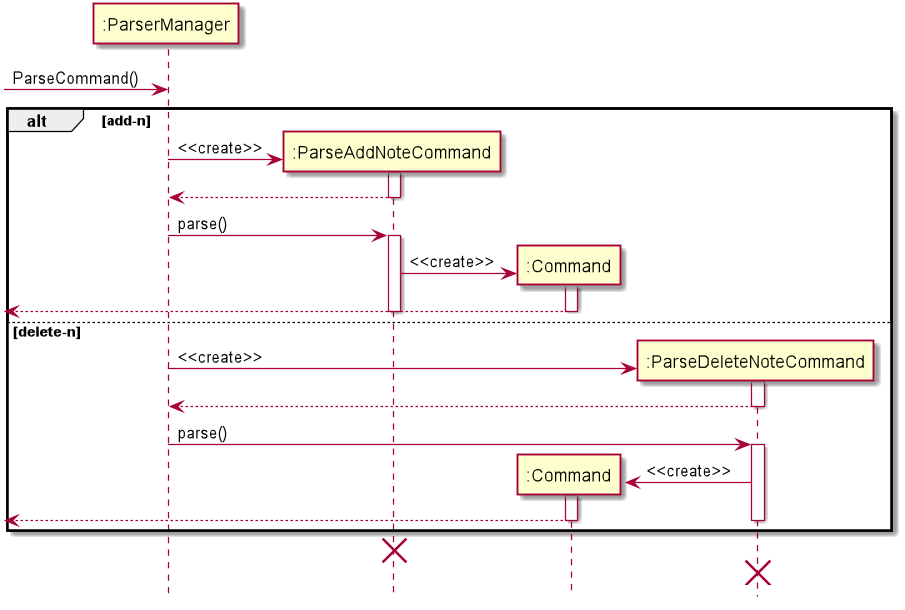

# Developer Guide

## Table of Contents
#### [1. Introduction](#intro)
##### &nbsp;&nbsp;&nbsp;&nbsp;&nbsp;&nbsp;[1.1 Setting Up](#setup)
#### [2. Design & Implementation](#design)
##### &nbsp;&nbsp;&nbsp;&nbsp;&nbsp;&nbsp;[2.1 Architecture Overview](#overview)
##### &nbsp;&nbsp;&nbsp;&nbsp;&nbsp;&nbsp;[2.2 NotUS](#notus)
##### &nbsp;&nbsp;&nbsp;&nbsp;&nbsp;&nbsp;[2.3 ParserManager](#parserManager)
##### &nbsp;&nbsp;&nbsp;&nbsp;&nbsp;&nbsp;[2.4 Commands](#commands)
##### &nbsp;&nbsp;&nbsp;&nbsp;&nbsp;&nbsp;[2.5 Notebook](#note)
##### &nbsp;&nbsp;&nbsp;&nbsp;&nbsp;&nbsp;[2.6 Timetable](#event)
##### &nbsp;&nbsp;&nbsp;&nbsp;&nbsp;&nbsp;[2.7 Tags](#tag)
##### &nbsp;&nbsp;&nbsp;&nbsp;&nbsp;&nbsp;[2.8 Storage](#storage)
##### &nbsp;&nbsp;&nbsp;&nbsp;&nbsp;&nbsp;[2.9 User Interface](#ui)
##### &nbsp;&nbsp;&nbsp;&nbsp;&nbsp;&nbsp;[2.10 Usage of External Libraries](#color)
#### [3. Product Scope](#scope)
##### &nbsp;&nbsp;&nbsp;&nbsp;&nbsp;&nbsp;[3.1 Target User Persona](#userpersona)
##### &nbsp;&nbsp;&nbsp;&nbsp;&nbsp;&nbsp;[3.2 Target User Profile](#userprofile)
##### &nbsp;&nbsp;&nbsp;&nbsp;&nbsp;&nbsp;[3.3 Value Proposition](#value)
#### [4. User Stories](#userstories)
#### [5. Non-Functional Requirements](#nfr)
#### [6. Glossary](#gloss)
#### [7. Instructions for Manual Testing](#testinstr)

 

## <a id="intro">1. Introduction</a>

NotUS is a quick and simple, Command Line Interface (CLI) based, note-taking application for keyboard-inclined users. NotUS allows for users to categorize notes by tagging as well as pinning the more important notes. NotUS is also designed to assist in planning timetables to highlight possible clashes.

This document describes the design, implementation and architecture of NotUS.

#### <a id="setup"><ins>1.1 Setting Up</ins></a>

**Prerequisites:**
* JDK 11
* IntelliJ IDE

Fork this repo and clone it onto your local machine.
Import the project as a **Gradle project**.
Ensures that you are using the correct JDK version (For this project we are using JDK 11).

 

## <a id="design">2. Design & Implementation</a>

This section seeks to explain the high-level design of the application. Given below is a quick overview of each component and the explanation of the design architecture in greater detail. NotUS is the main class of the application, and handles the initializing and execution of the appropriate classes.  
Diagrams found in our documentation were generated using <a href="https://plantuml.com/">PlantUML</a> and references were made to <a href="https://github.com/se-edu/addressbook-level2/tree/master/src/seedu/addressbook">addressbook-level2</a> for the structure of the classes and packages. The structures have been modified to meet the needs of our application.

#### <a id="overview"><ins>2.1 Architecture Overview</ins></a>

  
   <em>Figure #</em>

The architecture design is given in the diagram above. The main components of NotUS are:

1. `InterfaceManager`: Manages the user input as well as the message output from application.
1. `ParserManager`: Creates a suitable parser, based on the command, to make sense of user message. The respective parsers then make sense of the information and calls the respective commands.
1. `Command`: Executes the necessary tasks, depending on the respective command calls .
1. `TagManager`: Stores and manages the creation and deletion of tags and other tag-related functionality.
1. `Timetable`: Stores and manages the creation and deletion of events and other event-related functionality.
1. `Notebook`: Stores and manages the creation and deletion of notes and other note-related functionality.
1. `StorageManager`: Manages the loading of existing saved files and exporting of data to human-editable files

A Program Evaluation Review Technique (PERT) Chart was created prior to the start of developing NotUS and was constantly updated based on progress and updates from the development team's weekly meetings. A PERT chart is a project management tool that provides a visual representation of a project's timeline. The chart breaks down the individual tasks and aids in identifying task dependencies. A diagram of the PERT chart used for this application is shown below.

  
   <em>Figure #</em>

#### <a id="notus"><ins>2.2 NotUS</ins></a>

NotUs manages the flow of the application. On launch, it will create the necessary components, as listed above and then attempts to load any existing saved files into the application. Subsequently, it will accept and interpret the user input and execute the commands accordingly. The diagram below depicts the main flow of the application.

  
   <em>Figure #</em>

#### <a id="parserManager"><ins>2.3 ParserManager</ins></a>

The ParserManager manages the creation of specific parser objects based on the type of command. The parser then makes sense of the user input and calls the respective commands into action.

1. Receives the user input message as a whole.
1. Interprets the type of command and creates the respective parser for each command.
1. The parser then splits the message to identify all the parameters provided.
1. Creates and returns the Command class respectively.
 

  
   <em>Figure #</em>

💡 Note that the alternate paths in the sequence diagram above are not exhaustive. There is an alternate path for each unique command. As there are too many paths, they are omitted from the diagram. The Command objects in the diagram are used to represent a generic Command object that is created through the Parser. Refer to the next figure for more details.
 
 

   
    <em>Figure #</em>
 

Based on the user input, the Parser handles and creates the corresponding Command object.

#### <a id="commands"><ins>2.4 Commands</ins></a>

#### <a id="note"><ins>2.5 Notebook</ins></a>

#### <a id="event"><ins>2.6 Timetable</ins></a>

#### <a id="tag"><ins>2.7 Tags</ins></a>

The class diagram below denotes the relationship between the TagManager and the Taggable Objects (Notes and Events).

   
    <em>Figure #</em>
 

 
Notes and Events inherit from the abstract class, TaggableObject and TagManager contains a map of individual unique
 tags to an arraylist of TaggableObjects. The TagManager handles the creation, deletion as well as the tagging and
  untagging of tags from notes or events.

#### <a id="storage"><ins>2.8 Storage</ins></a>

#### <a id="ui"><ins>2.9 User Interface</ins></a>

#### <a id="color"><ins>2.10 Usage of External Libraries</ins></a>

This application uses 2 color libraries, <a href="https://github.com/dialex/JColor">JColor</a> and <a href="https://fusesource.github.io/jansi/">Jansi</a>, to print colored messages on the terminals using ANSI escape codes. While JColor itself is sufficient to colorize the strings, Windows 10 terminal, by default, **does not support** ANSI escape code. Hence, there was a need for the Jansi library to support ANSI escape codes on Windows.
  
<ins>Note on usage of JColor library:</ins>

IntelliJ's 'Dracula' and 'High Contrast' themes print white fonts as black and vice versa. Developers using either of the themes will have to change the white and black console color to reflect the correct color that is being printed. Instructions to do so are given below.

- Go under Settings -> Editor -> Color Scheme -> Console Colors -> ANSI colors -> Change the Foreground color for Black and White to the correct RGB value.

The figure below illustrates what you should see on your screen.

  
  <em>Figure #</em>

<ins>Note on usage of Jansi library:</ins>

While Jansi provides support for Windows terminal to print colored texts, it does not work within IntelliJ IDEA console. Therefore, when running on IntelliJ console, comment out the following lines in NotUS.java main function:

 `AnsiConsole.systemInstall();`
 `AnsiConsole.systemUninstall();`
 
Remember to uncomment them when building jar files for release.

**PinCommand**

1. Created by the parser function
1. Gets the note that is referenced too either by title or index 
1. Toggles the pinned status of the specified note. 
1. Returns the title as well as the pinned status of the note. 

 
   
    <em>Figure 4</em>

 

## <a id="scope">3. Product Scope</a>

#### <a id="userpersona"><ins>3.1 Target User Persona</ins></a>

Jane Doe is a NUS undergraduate student who is in SOC/FOE and is having a hard time managing her responsibilities and extra curricular activities. She wants to have a convenient platform to take notes and categorize them according to her modules. She also wants to plan her time so she is more aware of her module schedule.

She also wants to be able to export the information so she is able to share them with whomever easily.

#### <a id="userprofile"><ins>3.2 Target User Profile</ins></a>

1. NUS students, specifically SOC and CEG students (herein referred to as students) who are comfortable and adept at using CLI.
2. Students who want to take notes and categorize them so they are not all over the place.
3. Students who are comfortable with CLI.

#### <a id="value"><ins>3.3 Value Proposition</ins></a>

A all-in-one solution for note-taking and managing your schedule.

 

## <a id="userstories">4. User Stories</a>

| Version | Target User | Function/Feature | User's Benefit |
|--------|----------|---------------|------------------|
|v1.0| As a ... | I want to ... | So that I can ... |
|v1.0|SOC/FOE student|Keep track of my notes|Be organized and find notes easily|
|v1.0|Meticulous student|Categorize my notes by level of importance|Focus on the important topics|
|v1.0|Student who is overloading|Categorize my notes by module|Be more aware of which notes are necessary for the upcoming lessons|
|v1.0|Student who is more visual|Categorize my notes by colour (visible on CLI)|Be able to easily identify which module is which|
|v1.0|Meticulous student|Create daily and weekly task lists|Keep track of my work progress|
|v1.0|Forgetful student|To obtain reminders about my schedule for the day|So I do not forget what I have on for the day|
|v1.0|Busy student|Pin important notes, events and todo list|Focus on the important information|
|v1.0|SOC/FOE student|Be able to edit my notes|Update missing information|
|v1.0|SOC/FOE student|Be able to read my notes|To revise before exams|
|v1.0|SOC/FOE student|Be able to delete my notes|To clear up space and keep it more organized|
|v2.0|Outgoing student|Able to add my social events to the timetable|View all my upcoming events and classes|
|v2.0|Busy student|Be alerted if there are clashes in between my events and classes|Reschedule my plan|
|v2.0|Student leader|Be able to share certain events with others|Can get people to join events more conveniently|
|v2.0|SOC/FOE student|Archive old notes|Keep dashboard neat while allowing me to refer to old notes when necessary|
|v2.0|SOC/FOE student|Be able to import my notes|To make edits|
|v2.0|SOC/FOE student|Be able to export my notes|To share my notes with my peers|
|v2.0|SOC/FOE student|Be able to import my timetable/events|To make adjustments to my schedule|
|v2.0|SOC/FOE student|Be able to export my timetable/events|To share my schedule with my peers|

 

## <a id="nfr">5. Non-Functional Requirements</a>

| Requirement Type | Description |
|------------------|-------------|
|Constraint|Single user product|
|Performance|Software should not be dependent on a remote server|
|Performance|Software should not exceed 100Mb for JAR file and 15MB per PDF file|
|Quality|Users should prefer CLI/Typing|
|Technical|Must have Java 11 installed|
|Technical|No DBMS, all data to be stored locally|
|Technical|Data stored must be in human-editable files|
|Technical|Programme should be platform independent|
|Technical|Programme should work without an installer|

 

## <a id="gloss">6. Glossary</a>

* *CLI* - Command Line Interface
* *DBMS* - Database Management System

 

## <a id="testinstr">7. Instructions for Manual Testing</a>

1. Download the jar file and copy it into an empty folder.
1. Open a new terminal window and navigate to the same directory where the notus.jar is located. As a shortcut if you are on windows, you can open the folder where the notus.jar is located > click on the address bar > type `cmd` > press enter on your keyboard.
1. Enter the command `java -jar notus.jar` into the terminal window to launch the application. The application should now be running.
1. Enter the command `help` to get a list of all available commands and its usages.
1. For a detailed list on the command features, refer to the [user guide](https://github.com/AY2021S1-CS2113-T13-1/tp/blob/master/docs/UserGuide.md#features).
1. Simply enter `exit` to terminate and exit the application.
