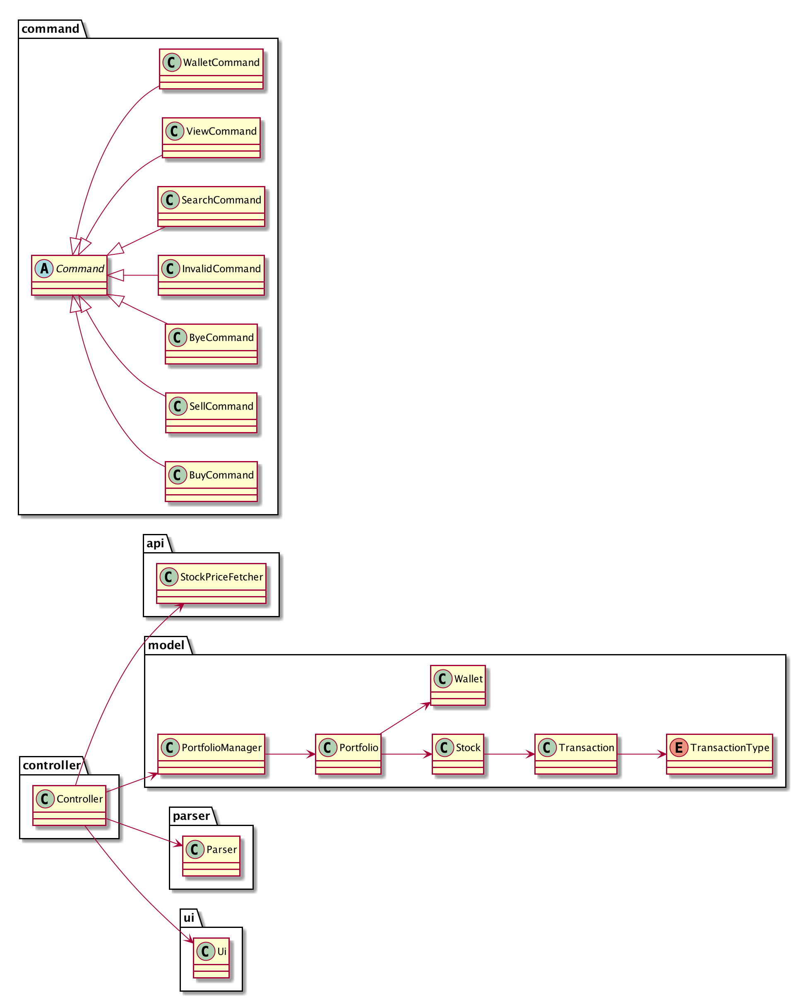
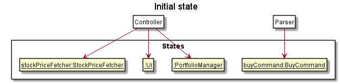
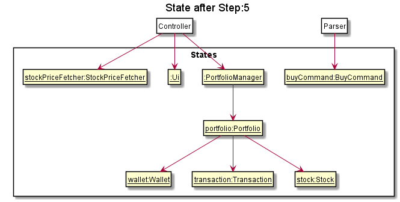
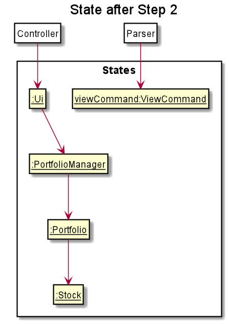

# Developer Guide
It is recommended that you read through the user guide to familiarize yourself with the program before using the 
developer guide.

# Setting up PaperTrade
Fork the repository and clone the fork into your computer.

To set up the project:
1. Ensure that you have JDK 11 installed.
2. Import the project as a Gradle project.
3. To build the project, run "./gradlew build" on a Unix machine or run "gradlew build" on Windows.

## Design & implementation

### Architecture

The Package Diagram above gives a high level view of the project structure and the classes in each package. 

The Architecture Diagram above gives a high level design of PaperTrade. Below is a quick overview of each component.

### Overview

* `PaperTrade`: The main entry point into the program. It initializes the Controller object which then takes over the 
execution of the program.
* `Controller`: Acts as an interface between all the other classes, to process all the business logic incoming commands
from the user. Manipulates the data through `PortfolioManager` and interact with `Ui` to display information to the 
user.
* `PortfolioManager`: Responsible for managing the persistency of the user's data through the `Storage` class and holds 
all the data for the program at a point in time.
* `Ui`: Responsible for displaying information to the user and getting input from the user.
* `Parser`: Responsible for parsing the user input and returning a `Command` object corresponding to the user command 
requested.
* `StockPriceFetcher`: Responsible for calling the AlphaVantage API to retrieve stock information.
* `Storage`: Responsible for managing the storing of data for persistency.

### Lifecycle of PaperTrade
The sequence diagram below shows how different packages and classes interact with each other throughout the lifecycle 
of PaperTrade.

## Implementation

### Buy/Sell Stock Feature

#### Current implementation

Buy and sell stock commands are largely similar, with the only difference being the way values of attributes in 
the objects instantiated are updated and the condition for throwing exceptions. 
Other than that, the way the functions work is the same.

Below is the explanation of the implementation of based on buy stock command, 
which can be applied to the sell stock command as well.

Given below is an example usage scenario and how buy stock command behaves at each step.

**Step 1** : The user calls the buy stock command from the `Parser`. 
Buy stock command is instantiated by `Parser`, which calls the `buyParse` method to get the attribute values 
for `symbol` and `quantity` required to instantiate `buyCommand`. The `Controller` instantiates `Ui`, `PortfolioManager`
and `StockPriceFetcher`, which gets the `price` of stock. 
In the `Controller`, we check for the instance of `buyCommand` object and calls the `buyStock` method.

Below is a table of what each parameter corresponds to in the state diagram of the program.

|Parameter|Corresponds to
|:---:|:---:
|`symbol`| Ticker symbol of Stock to buy
|`quantity`| Integer number of shares to be 
|`price`| Price of stock at current time 

**Step 2** : `buyStock()` is called from the `PortfolioManager` with the values of `symbol` and `quantity` 
and `price` passed to them. 

**Step 3** : `Portfolio` is instantiated and its `buyStock` method is called as well. 
 
 

 
**Step 4** : `Wallet` and `Stock` are instantiated. 
It then checks if there is sufficient fund in the wallet. If so, `buyStock` method is called from the `wallet` instance.
Then, new `Transaction` object is instantiated. 
The `transaction` object stores details of the stock bought.
Below is a table of what each attribute in `Transaction` corresponds to in the program.

|Attribute|Corresponds to
|:---:|:---:
|`TransactionType`| Buy or Sell stock
|`Quantity`| Integer number of shares to be bought
|`BuyPrice`| Cost price of a stock at a specific time 
|`LocalDateTime`| the time when the command is called 

**Step 5** : Following that, _if a stock with the same symbol has not been instantiated before_, 
a new 'Stock' object is also instantiated. Otherwise, the `Stock` object of that stock symbol will be used. 

The method `addTransaction` in the `stock` object is then called, with the `transaction` object as a parameter, 
to update the value of the attribute `totalQuantity` in `Stock`.

**Step 6** : `Portfolio`, `Wallet`, `Transaction` and `Stock` are terminated first.
The `save` method is then called. 

**Step 7**: `Controller` then calls the relevant methods from `Ui` to print the information about the stock bought and 
the amount left in the wallet. `StockPriceFetcher`, `Ui` and `PortfolioManager` are then terminated.

The following sequence diagram summarizes what happens when the user executes an `BuyCommand` :

#### Design consideration

The following explains the design considerations when implementing commands:

* Make `BuyCommand` As a class by itself
    * Reason: Increases modularity of code, higher overall code quality 
* Alternatives: have a `buyCommand` method, increases coupling and reduces testability

### View Portfolio feature

#### Current implementation

View portfolio command is executed by `Controller`. It allows users to access, retrieve and view array list of stocks 
owned and their historical transactions. This is done by instantiating a new `PortfolioManager` which is able to 
access `Portfolio`. The `Portfolio` object encapsulates `Stock` and `Transaction`.

Addtionally, `Stock` object is able to retrieve latest live prices by instantiating `StockPriceFetcher` to call 
AlphaVantage API. This allows users to view not only their stocks historial transactions, but to see their profit/loss  
based on current latest price. 

Given below is an example usage scenario and how view portfolio command behaves at each step.

**Step 1**: `Parser` will initialise `ViewCommand` and call `viewPortfolio()` command from the `Controller`. `Ui` is initialised to call `view()`. The method 
takes in an parameter of an array list of stock to be displayed.

|Parameter|Corresponds to
|:---:|:---:
|`Stock`| Stock objects

**Step 2**: To obtain an array list of stock to be used as an arugment in `Ui` `view()` method, `PortfolioManager` is initialised to call `getAllStocks()` method.
The method returns an array list of `Stock` by initialising `Portfolio` which is keeps a HashMap of `Stock` objects. Below is a table of what each attribute in
`Stock`corresponds to in the program.

|Attribute|Corresponds to
|:---:|:---:
|`Symbol`| Ticker Symbol of Stock in possession
|`totalQuantity`| Integer number of shares currently owned
|`transactions`| An array list of `Transaction` object 

**Step 3**: For each of the `Stock` object to be displayed, `getTransaction()` method is called to obtained historial
records of user's stock transactions.
Below is a table of what each attribute in `Transaction` corresponds to in the program. 

|Attribute|Corresponds to
|:---:|:---:
|`TransactionType`| Buy or Sell stock
|`Quantity`| Integer number of shares to be bought
|`BuyPrice`| Cost price of a stock at a specific time 
|`LocalDateTime`| the time when the command is called 

**Step 4**: For each of the `Stock` object to be displayed, `getLatestPrice()` method is called by instantiating a new `StockPriceFetcher`
which calls out to AlphaVantage API to obtain latest stock price. 

User's latest profit/loss will be displayed through calculation of latest stock price
against historical buy price. 

**Step 5**: `Parser`, `ViewCommand`, `Stock`, `Transaction`, `StockPriceFetcher` are terminated. 

## Product scope
### Target user profile

We are targeting people below 25 who have never traded stocks before.

### Value proposition

{Describe the value proposition: what problem does it solve?}
Paper trading allows inexperienced people to get a feel of what trading feels like so that they can used to it without the downside of losing real money.

## User Stories

|Version| As a/an ... | I want to ... | So that I can ...|
|--------|----------|---------------|------------------|
|v1.0|new investor|see usage instructions|refer to them when I forget how to use the application|
|v1.0|new investor|trade without putting my money at risk|learn from my mistakes and experience without losing money|
|v1.0|investor|search for stocks I can buy|have more information to make a more informed decision|
|v1.0|investor|buy stocks|profit from any capital gains or dividends|
|v1.0|investor|sell stocks|realise my gains or reallocate my money to other stocks|
|v1.0|investor|view my portfolio|see what stocks I have and my past transactions|
|v2.0|investor|keep track of what stocks I have bought or sold|see how much money I've made or lost|
|v2.0|investor|see how much cash I have left|decide how much to buy or sell|
|v3.0|investor|have a watchlist of stocks|track the price movements of individual stocks|
|v4.0|investor|see the performance of my portfolio|see if I'm on track for my financial goals|

## Non-Functional Requirements

{Give non-functional requirements}
1. Program should not take more than 5s to run for every command.
2. Program should give some loading indicator when fetching stock prices from API calls.

## Glossary

* *glossary item* - Definition

## Instructions for manual testing

{Give instructions on how to do a manual product testing e.g., how to load sample data to be used for testing}
