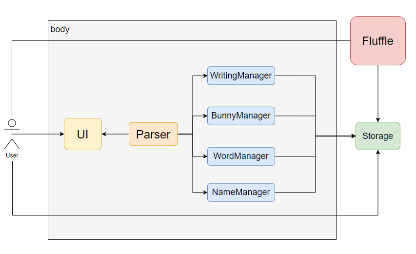
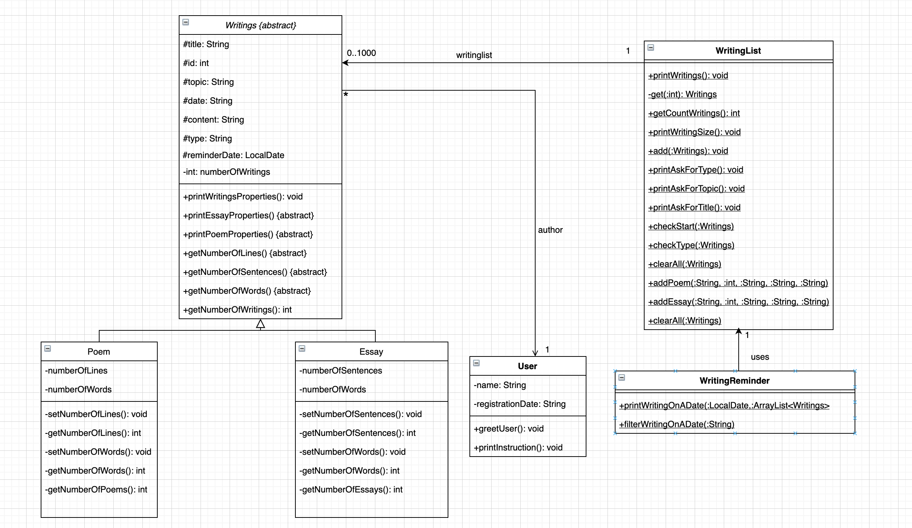
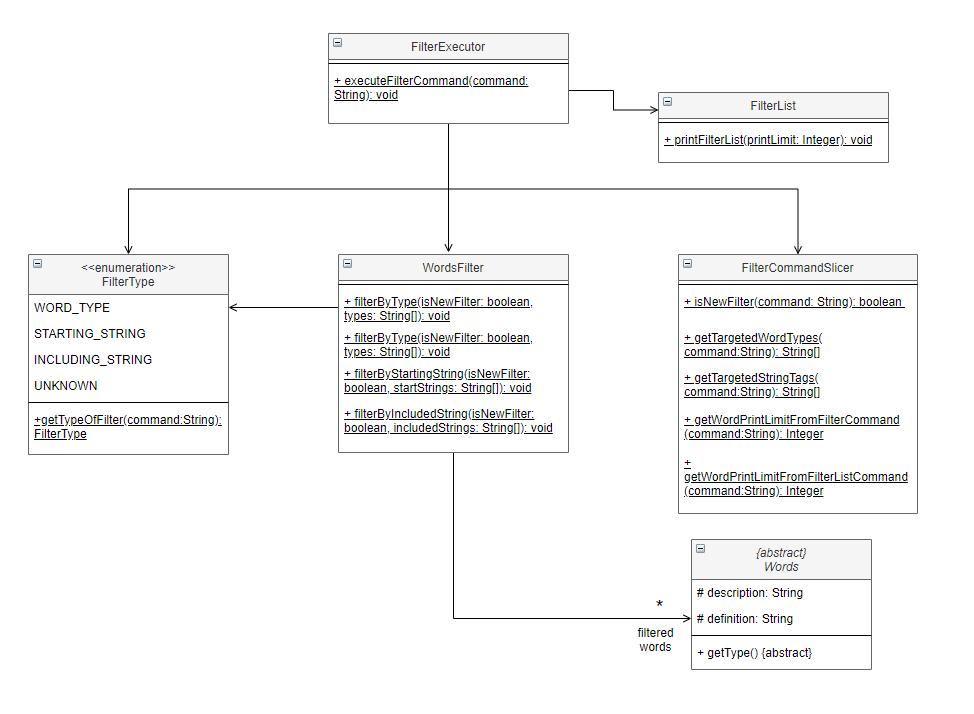
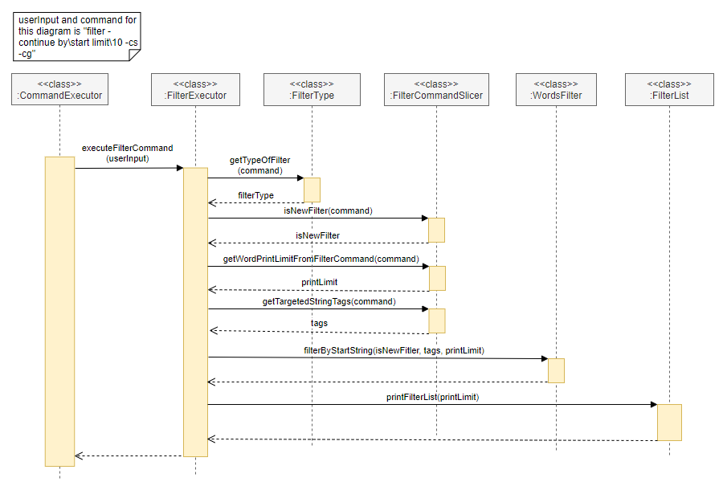
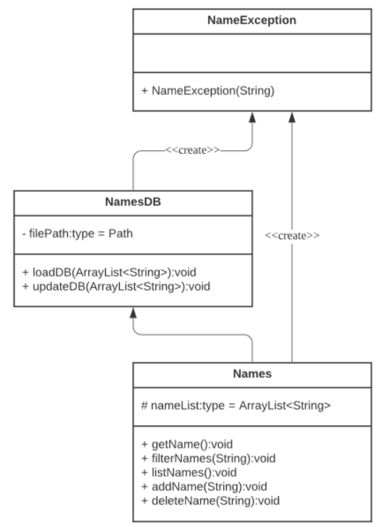

# Developer Guide

## Table of Contents
// update later on <br>
[Introduction](#introduction) <br>
&nbsp;&nbsp;&nbsp;&nbsp;[Purpose](#purpose) <br>
&nbsp;&nbsp;&nbsp;&nbsp;[Scope](#scope) <br>
&nbsp;&nbsp;&nbsp;&nbsp;[Design Goals](#design-goals) <br>
&nbsp;&nbsp;&nbsp;&nbsp;[Maintainability](#maintainability) <br>
[Definitions](#definitions) <br>
[Setting up the project in your computer](#setting-up-the-project-in-your-computer) <br>
[Design](#design) <br>
&nbsp;&nbsp;&nbsp;&nbsp;[Technological view](#technological-overview) <br>
[Architecture](#architecture) <br>
&nbsp;&nbsp;&nbsp;&nbsp;[Project Overview](#project-overview) <br>
[Writings class family](#writings-class-family) <br>
[Filter words class family](#filter-words-class-family--word-family) <br>
[Bunny class family](#bunny-class-family) <br>
[Names class family](#names-class-family) <br>
[Product scope](#appendix-a-product-scope) <br>
&nbsp;&nbsp;&nbsp;&nbsp;[Target user profile](#target-user-profile) <br>
&nbsp;&nbsp;&nbsp;&nbsp;[Value proposition](#appendix-b-value-proposition) <br>
&nbsp;&nbsp;&nbsp;&nbsp;[User Stories](#appendix-c-user-stories) <br>
&nbsp;&nbsp;&nbsp;&nbsp;[Non-Functional Requirements](#appendix-d-non-functional-requirements) <br>
[Instruction for manual testing](#instructions-for-manual-testing) <br>

## Introduction

### Background
Fluffle is a **desktop app for creative writers**, optimized for use via a **Command Line Interface (CLI)**. It aids users in creating and managing their writings and ideas. As a fast-typing writer, this CLI app is highly suitable for you.

### Purpose
This document specified architecture and software design decisions for the creative writing assistant, Fluffle. 

### Scope
This describes the software architecture and software design decisions for the implementation of Fluffle. The intended audience of this document is the developers, designers, and software testers of Fluffle.

### Design Goals
Our goal is to create an app which improves users’ ability of writing and creativity. Developers should work closely with CS2113T’s module instructors, who represent technical advisors and CS2101’s module instructors, who represent non-technical advisors. By adhering to these tutors’ specific requirements, which imitate industrial professional standards, beginner software engineers will be able to levitate their expertises and mindset in the process of developing and presenting a new product.

### Maintainability
With the aim of increasing maintainability of Fluffle, separated packages and classes were implemented in strict compliance with Object-oriented Programming. Since it is important to be able to easily change functionality of one class without disturbing other dependent classes, each class only serves one purpose to reduce dependency on other classes. With low coupling and high cohesion, subsequent developers can make minimal effort in maintaining Fluffle.

## Definitions

|Terminology|Explanation|
|--------|----------|
|Plot bunny|A story idea that refuses to go away until it is written down.|
|Fluffle|A fluffle is a group of bunnies.| 
|CLI|Command-line Interface. </br></br>A command-line interface (CLI) processes command to a computer program in the form of lines of text. The program in the computer will read the command and start proceeding.|
|Gradle|A build tool used for automated testing. It checks for code style violations and runs unit tests to ensure the code is functional between iterations.| 
|IntelliJ|An integrated development environment that used to write and test java code.|

## Setting up the project in your computer
**Prerequisites:**
* JDK 11
* IntelliJ IDE

<div markdown="span" class="alert alert-warning">

⚠ **Caution:**

You should follow the steps with caution. Otherwise, things will not work.
</div>

First, **fork** this repo, and **clone** the fork into your computer.

If you plan to use Intellij IDEA (highly recommended):
1. **Configure the JDK**: Follow the guide [_[se-edu/guides] IDEA: Configuring the JDK_](https://se-education.org/guides/tutorials/intellijJdk.html) to to ensure Intellij is configured to use **JDK 11**.
1. **Import the project as a Gradle project**: Follow the guide [_[se-edu/guides] IDEA: Importing a Gradle project_](https://se-education.org/guides/tutorials/intellijImportGradleProject.html) to import the project into IntelliJ IDEA.<br>
  :exclamation: Note: Importing a Gradle project is slightly different from importing a normal Java project.
1. **Verify the setup**:
   1. In IntelliJ IDEA, choose to run `Duke.main()`. Gradle will need some time to build the project at first.
   1. If your setup is correct, you should see something like below:
```
--------------------------------------------------------------
Write a story with
  ______ _        __  __ _
 |  ____| |      / _|/ _| |
 | |__  | |_   _| |_| |_| | ___
 |  __| | | | | |  _|  _| |/ _ \
 | |    | | |_| | | | | | |  __/
 |_|    |_|\__,_|_| |_| |_|\___|
--------------------------------------------------------------
Hello User! Welcome to Fluffle!
What can I do for you?
--------------------------------------------------------------
What is your name?
```

## Design

The following sections describe the high-level overview of our application, Fluffle.

### Technological overview
The Integrated Development Environment, IntelliJ, is used to develop our program. The program is written in Java, and uses Gradle for building and testing purposes. Our source code is mostly original, with some functions imported from the java.util package. The remaining packages and classes which form the structure of our program are independently developed.

### Project overview
Fluffle is built using IntelliJ and all concepts for the user interfaces, as well as the backend data management of the application, was created by our team. Due to the restrictions of the project, the main file format used for storage is .txt. We opted to save the data in the text files in a user readable format as opposed to the comma separated format as it is easier for users to directly refer to and edit their saved files.

### Architecture
The following figure describes the overall architecture of Fluffle.


<p align = "center"><i><b>Figure 1: Overview of Fluffle Architecture</b></i></p>

The design of Fluffle contains four main components:
- Writing Manager component
- Bunny Manager component
- Word Manager component
- Name Manager component

All components can be accessed by the user through Fluffle's UI. On loading Fluffle, all components will be loaded from the storage. On exiting Fluffle, all components will be saved to the storage.

### Writing Manager Component

### Bunny Manager Component

### Word Manager Component
Given below is the general architecture of our Word Manager Component.


<p align = "center"><i><b>Figure 2: Word Manager Architecture</b></i></p>

In Fluffle, the words list is stored in the local hard drive location `data/words.txt`. Fluffle can hold three types of word: `Noun`, `Verb` and `Adjective`. The operations that can be done on the words list are:
- Viewing the words list.
- Getting three random words.
- Filtering words (by word types or by substrings).

### Name Manager Component

## Implementation

### Writing Features
#### Constitution (member classes)
WritingList: Represent the objects which are particular lists of Writings to be used in the application.

Writings: Represent the objects of the writings, created from user’s input and stored in a database as text. 

This Writings class is also the parent of 2 subclasses which are Poem and Essay.
- Poem: Represents the Writings objects which have type is Poem.
- Essay: Represents the Writings objects which have type is Essay.

User: Represents the Users registered to the System


<p align = "center"><i><b>Figure 3: WritingList family UML diagram</b></i></p>

The above class diagram describes the overall architecture of Writings class functionalities and associations within the scope of related classes. By checking “start”, “type” command with checkStartCommand() then checkTypeCommand() methods on that sequence respectively, the user should be able to access the process of creating and saving new writings into the database. During this process, the user has the ability of choosing their preferred type of writings(which are either poem or essay at this stage)


<p align = "center"><i><b>Figure 4: General interactions between member classes when generating a new writing</b></i></p>

#### Getting reminder for writings scheduled on a specific date
This feature allows users to be reminded of which writings they should continue on a specific date.

**Implementation**

When the user keys in the command `remind DATE`, where `DATE` is the date the user wants to be reminded about in form of `dd/MM/yyyy`, the program will check the validity of the command by using `CommandChecker.extractCommandType()`. Since the command is recognized, enumeration `REMIND` is returned. Then, the program flow is as follows:

1. `WritingReminder.filterWritingsOnADate()` is called by `CommandExecutor.executeCommand()`.
1. In `WritingReminder.filterWritingsOnADate()`, the `DATE` will be parsed by `LocalDate.parse()`.
1. The Java stream is used to filter the list of writings and get which ones are scheduled for that `DATE`.
1. Private `WritingReminder.printWritingsOnADate()` will be called to print out the result.

### Word Features

#### Adding a noun

#### Adding a verb 

#### Adding an adjective

#### Listing words

#### Generating three random words

#### Filtering words
This feature allows users to getting words as they wish. The diagram below shows the overall architecture of filter words functionality.


<p align = "center"><i><b>Figure 5: Filter word UML Class Diagram</b></i></p>

**Implementation**

When the user enters a `filter words` command, the program will check the validity of the command by using `CommandChecker.extractCommandType()`. Since the command is recognized, `FILTER_WORDS` will be returned. Then, the program flow is as follows:

1. `FilterExecutor.executeFilterCommand()` will be called by `CommandExecutor.executeCommand()``. 
1. In `FilterExecutor.executeFilterCommand()` method, the program will:
    1. Call `FilterType.getTypeOfFilter()` to get the filter type enumeration (`WORD_TYPE`, `STARTING_STRING` or `INCLUDING_STRING`). 
    1. Call `FilterCommandSlicer.isNewFilter()` to determine whether the user wants to continue on the last filtered list or start a new filter on an entire word list. 
    1. Check whether the user has entered a print limit using `FilterCommandSlicer.getWordPrintLimitFromFilterCommand()`. 
    1. Depending on the filter type, `FilterCommandSlicer.getTargetedWordTypes()` or `FilterCommandSlicer.getTargetedStringTags()` will be called to get an array of strings containing the word types or strings required for the filter process.
    1. The array of strings will be passed to either one of the three methods `WordsFilter.filterByType()`, `WordsFilter.filterByStartingString()` or `WordsFilter.filterByIncludedString()` to process the filtering.
    1. Call `FilterList.printFilterList()` to print out the result.

The following sequence diagram shows how the components interact with each other for the scenario where the user issues the command `filter -continue by\start limit\10 -cs -cg.`



<p align = "center"><i><b>Figure 6: Interactions between components for the command filter -continue by\start limit\10 -cs -cg</b></i></p>

In **Figure 6** above, the flow of the program after it enters the filter process is as follows:
1. The `CommandExecutor` calls `FilterExecutor.executeFilterCommand()`.
1. In the method `executeFilterCommand`, `FilterType.getTypeOfFilter()` is called to get the filter mode, which is `START`.
1. Then, `FilterCommandSlicer.isNewFilter()`, `FilterCommandSlicer.getWordPrintLimitFromFilterCommand()`, `FilterCommandSlicer.getTargetedStringTags()` is called to check whether the program should continue on the last filter list and to get print limit as well as the strings used for filtering.
    1. The returned result of `FilterCommandSlicer.isNewFilter()` is `true`.
    1. The returned result of `FilterCommandSlicer.getWordPrintLimitFromFilterCommand()` is an integer `10`.
    1. The returned result of `FilterCommandSlicer.getTargetedStringTags()` is the array `["cs", "cg"]`
1. Since the filter type is `START`, the method `WordsFilter.filterByStartString()` class is called to execute the main filter process.
1. Filter list is printed by calling `FilterList.printFilterList()`.
1. The filter process terminates.
   
### Bunny class family


<p = "center"><i><b>Figure 7:  Bunny ideas UML Class Diagram</b></i></p>

The above class diagram describes the overall architecture of the bunny list functionalities. Recall that the term bunny refers to  plot ideas that have yet to be devloped. 
The above classes provide the functionality of storing such ideas in an organised manner that can easily be searched, saved and loaded.

The `BunnyList` class has the public ArrayList of bunnies `bunniesList` that is accessed by the `DeleteBunny` class method `deleteBunny` which removes a selected bunny from the `bunniesList` ArrayList. Similarly, `bunniesList` is also accessed by the `BunnyFilter` class which contains the `filterBunny` function which can filter through the list and obtain bunnies with specified keywords in the idea or the genre using the command `filter bunny i\IDEA g\GENRE`, where the user may choose to omit either the `IDEA` or the `GENRE` when running the command. 

The `BunnySaver` class accesses the `bunniesList` and overwrites the current `bunny.txt` file in the data directory, saving all `Bunny` objects into the file using the `saveAllBunny`  method. Bunny objects saved in that file can then be read by the `BunnyLoader` class and added into the `bunniesList` ArrayList each time the program is started up, which is done by calling the `loadBunnyFile` method.

The `GenBunny` class can access the `bunniesList` as well. The function `pickRandomBunny` from the `GenBunny` class first randomly generates an integer between 0 and the max number of `Bunny` idea in the `bunniesList` ArrayList. It then selects that indexed `Bunny` from the `bunniesList` and returns it to the user. This allows the user to easily choose an idea to start working on without struggling to decide which idea to use.


<p align = "center"><i><b>Figure 8: Bunny list UML Sequence Diagram</b></i></p>

The user may call upon the `bunny` command to add bunnies to the list. The user input is first processed by the `extractCommandType` method from the `CommandChecker` class, and the command type detected is sent to the `executeCommand` method from the `CommandExecutor` class. The `addBunny` function is called by this method accordingly. The `addBunny` command calls the `parseSingleCharacterTaggedParamsFromUserInput` method from the `Parsers` class to extract the `idea` and `genre` arguments from the command. These are then used to create a new `Bunny` object that is then added to the `bunniesList` ArrayList. The `addBunnyMessage` method from `UI` is then called to print the message that the `Bunny` idea object has been sucessfully added to the ArrayList.

### Names class family


<p = "center"><i><b>Figure 9: Names UML Class Diagram</b></i></p>

The above class diagram (Figure 9) describes the overall architecture of the name list functionalities. The Names class has the protected ArrayList of names, nameList, that is accessed by the Names class method getName which randomly gets a selected name from the nameList ArrayList. Similarly, nameList is also accessed by the Names class which contains the filterNames function which can filter through the list and obtain names with specified keywords using the command filter name <NAME>, where the user may choose to omit the NAME when running the command. Similarly, nameList is also accessed by the Names class which contains the listNames function which displays all the names stored in the nameList ArrayList. This is the same as the filterNames function when given no input String. Similarly, nameList is also accessed by the Names class which contains the addName function which adds a name to the list of names stored in the nameList ArrayList using the command add name <NAME>. The NAME cannot be omitted. Similarly, nameList is also accessed by the Names class which contains the deleteName function which removes a name from the list of names stored in the nameList ArrayList. The command to do this deletes name <INDEX>. The INDEX cannot be omitted and the range of the INDEX can be determined from the listNames function above.

The NamesDB class accesses the nameList and overwrites the current Names.txt file in the data directory, saving all String objects in nameList into the file using the updateDB method. String objects saved in that file can then be read by the NamesDB class and saved into the nameList ArrayList using the loadDB method. In the event of the database Names.txt not existing, the NamesDB class will create the Names.txt database and populate the database with 500 names using the loadDB method.

As shown in Figure 9, both the NamesDB class and the Names class will create the NameException class. This is a subclass that inherits from the Exception superclass and passes the exception message to the superclass. In the event of an exception, it is thrown from the methods in NamesDB class and Names class and handled by the NameException class.

## Testing

Put methods of testing here !!! JUnit test, Unit testing, integration testing, ...

## Appendices

### Appendix A: Product scope
#### Target user profile

The target user group are creative writers.
* Writers who enjoy digitally typing up their works and thus can integrate using our CLI based app into their workflow.
* Writers who enjoy creating short pieces but lack the organisation to do so.
* Writers who want to improve their creative writing skills and need a proper way to achieve it.

### Appendix B: Value proposition

The application aims to provide the writer with the following services:
* Provide them with an organised way to store and select their plot ideas which may be otherwise abandoned
* Provide them with customised prompt suggestions to inspire them to write
* Provide them with a system to organise longer writing projects in a neat and logical manner to facilitate the writing of long works

### Appendix C: User Stories

|Version| As a ... | I want to ... | So that I can ...|
|--------|----------|---------------|------------------|
|v1.0|new user|see usage instructions|refer to them when I forget how to use the application|
|v1.0|user|I would like the app to have a word list|keep my list of favorite words and refer to them in my writings|
|v1.0|writer|choose the name of the character generated from the database|write without thinking a lot about my character's name|
|v1.0|writer|clear and edit the saved writings in my storage|easily change them later on|
|v1.0|writer|generate words from my word list based on word type or some substrings|find the ideas to continue my writings|
|v1.0|writer|continue to filter on my last filter list|narrow down the words I want to use|
|v1.0|writer with a lot of fleeting ideas|a place I can temporarily store all my short ideas |find them easily when I need them|
|v2.0|user|check my spelling automatically|don't spell wrongly|
|v2.0|writer|have an app that list all the statistics from my past writings|
|v2.0|user|get the inspiration from the app|improve my creative writing skills|
|v2.0|user|have a database of my writings|refer to them in the future|
|v2.0|writer who uses the filter function in v1.0|limit the filter words printed out on the screen|view them easily if the filter list has a lot of words|
|v2.0|writer who is bad at sticking to an upload schedule|be reminded by the app which pieces I need to work on next|continue to hold my writing spirit|
|v2.0|writer who frequently uses the app|save the words to local storage and load them when I start the app|save more words than usual|
|v2.0|writer facing writers block|generate a random idea from my bunny storage|warm up or brainstorms on my writings|
|v2.0|writer facing writers block|have an app that randomly generate the words|brainstorm for my writings based on those words|

### Appendix D: Non-Functional Requirements

- Should be a Command-line Interface application.
- Should work on any common Operating System (Windows, Linux or OS-X platform) as long as Java 11 is installed in the system.
- Should be user-friendly to new and expert creative writers with average typing speed.
- Should help creative writers do their tasks faster by commands rather than any other programs that uses mouses and other pointing devices.
- Should display characters in ISO basic Latin alphabet and basic numbers correctly.
- Should have local storage of editable text files (.txt).
- Should work without requiring an installer.
- Should work for single user.
- Should work without Internet connection.

## Instructions for manual testing
Given below are the instructions to test Fluffle manually.

### Launch and Shutdown
Following are the instructions to launch and shutdown Fluffle

1. Verify that you have `Java11` or above version installed by typing `java --version` to your computer's terminal (Command Prompt for Windows, Terminal for MacOS)
2. Get the lastest version of **Fluffle** from [here](https://github.com/AY2021S1-CS2113T-W11-4/tp/releases/tag/v2.0).
3. Copy the file to the folder you want to use as the home folder for Fluffle.
4. Type in the terminal `java -jar duke.jar` and press Enter. If the setup is correct, you should see something like below:
```
--------------------------------------------------------------
Write a story with
  ______ _        __  __ _
 |  ____| |      / _|/ _| |
 | |__  | |_   _| |_| |_| | ___
 |  __| | | | | |  _|  _| |/ _ \
 | |    | | |_| | | | | | |  __/
 |_|    |_|\__,_|_| |_| |_|\___|
--------------------------------------------------------------
Hello User! Welcome to Fluffle!
What can I do for you?
--------------------------------------------------------------
What is your name?
```
5. After entering your name, try typing the `help` command and press Enter to get started.
6. Some example commands you can try:
    1. `noun computer d\ a smart machine`: to add a noun to your word list.
    1. `list word`: to view your word list.
7. If you want to shutdown Fluffle, use the command `exit`.

**For a more specific explanation and demonstration of the commands, visit our User Guide [here](https://ay2021s1-cs2113t-w11-4.github.io/tp/UserGuide.html).**
