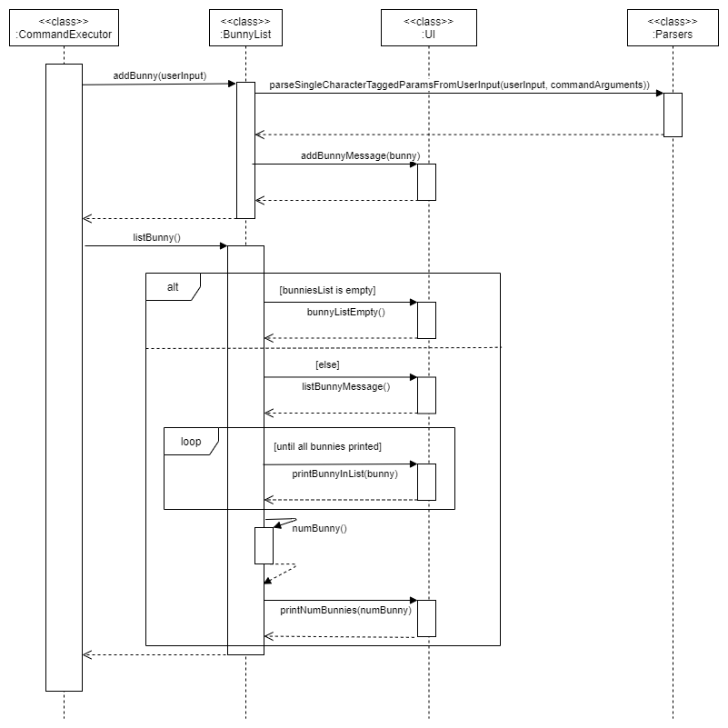

# Developer Guide

## Table of Contents

[Introduction](#introduction)  
&nbsp;&nbsp;&nbsp;&nbsp;[Purpose](#purpose)  
&nbsp;&nbsp;&nbsp;&nbsp;[Scope](#scope)  
&nbsp;&nbsp;&nbsp;&nbsp;[Design Goals](#design-goals)  
&nbsp;&nbsp;&nbsp;&nbsp;[Maintainability](#maintainability)  
[Definitions](#definitions)  
[Setting up the project in your computer](#setting-up-the-project-in-your-computer)  
[System Overview](#system-overview)  
&nbsp;&nbsp;&nbsp;&nbsp;[Technological view](#technological-view)  
[Architecture](#architecture)  
&nbsp;&nbsp;&nbsp;&nbsp;[Project Overview](#project-overview)  
[Writings class family](#writings-class-family)  
[Filter words class family](#filter-words-class-family)  
[Bunny class family](#bunny-class-family)  
[Names class family](#names-class-family)  
[Design and Implementation](#design-and-implementation)  
[Product scope](#product-scope)  
&nbsp;&nbsp;&nbsp;&nbsp;[Target user profile](#target-user-profile)  
&nbsp;&nbsp;&nbsp;&nbsp;[Value proposition](#value-proposition)  
[User Stories](#user-stories)  
[Non-Functional Requirements](#non-functional-requirements)  
[Glossary](#glossary)  
[Instruction for manual testing](#instructions-for-manual-testing)  

## Introduction

### Purpose
This document specified architecture and software design decisions for the creative writing assistant, Fluffle. 

### Scope
This describes the software architecture and software design decisions for the implementation of Fluffle. The intended 
audience of this document is the developers, designers, and software testers of Fluffle.

### Design Goals
Creating an app which improves users’ ability of writing and creativity. Developers should work closely with CS2113T’s 
module instructors, who represent technical advisors and CS2101’s module instructors, who represent non-technical 
advisors. By adhering to these tutors’ specific requirements, which imitate industrial professional standards, 
beginner software engineers will be able to levitate their expertises and mindset in the process of developing 
and presenting a new product.

### Maintainability
With the aim of increasing maintainability of Fluffle, separated packages and classes were implemented in strict 
compliance with Object-oriented Programming. Since it is important to be able to easily change functionality of one 
class without disturbing other dependent classes, each class only serves one purpose to reduce dependency on other 
classes. With low coupling and high cohesion, subsequent developers can make minimal effort in maintaining Fluffle.

## Definitions

|Terminology|Explanation|
|--------|----------|
|Plot bunny|A story idea that refuses to go away until it is written down.|
|Fluffle|A fluffle is a group of bunnies.| 
|CLI|Command-line Interface.   A command-line interface (CLI) processes command to a computer program in the form of lines of text. The program in the computer will read the command and start proceeding.|
|Gradle|A build tool used for automated testing. It checks for code style violations and runs unit tests to ensure the code is functional between iterations.| 
|IntelliJ|An integrated development environment that used to write and test java code.|

## Setting up the project in your computer
**Prerequisites:**
* JDK 11
* IntelliJ IDE

⚠ **Caution:**

Follow the steps in the following guide precisely. Things will not work out if you deviate in some steps.

First, **fork** this repo, and **clone** the fork into your computer.

If you plan to use Intellij IDEA (highly recommended):
1. **Configure the JDK**: Follow the guide [_[se-edu/guides] IDEA: Configuring the JDK_](https://se-education.org/guides/tutorials/intellijJdk.html) to to ensure Intellij is configured to use **JDK 11**.
1. **Import the project as a Gradle project**: Follow the guide [_[se-edu/guides] IDEA: Importing a Gradle project_](https://se-education.org/guides/tutorials/intellijImportGradleProject.html) to import the project into IDEA. 
  :exclamation: Note: Importing a Gradle project is slightly different from importing a normal Java project.
1. **Verify the setup**:
   1. Run the `java -jar duke.jar` and try a few commands.
   2. [Run the tests](Testing.md) to ensure they all pass. 
//Note: should ask team W11-02 the permission for the above part.

## System Overview

The following sections describe the high level overview of our application, Fluffle.

### Technological view
The Integrated Development Environment, IntelliJ, is used to develop our program. The program is written in Java, 
and uses Gradle for building and testing purposes. Our source code is mostly original, with some functions imported 
from the java.util package. The remaining packages and classes which form the structure of our program 
are independently developed.

## Architecture

<i><b>Figure 1: Overview of Fluffle UML diagram</b></i>

Fluffle Documentation: This document contains all packages and classes that are used in developing Fluffle. 

### Project overview
Fluffle is built using IntelliJ and all concepts for the user interfaces, as well as the backend data management of the 
application, was created by our team. Due to the restrictions of the project, the main file format used for storage is 
.txt. We opted to save the data in the text files in a user readable format as opposed to the comma separated format 
as it is easier for users to directly refer to and edit their saved files.

## Writings class family
### Constitution (member classes)
WritingList: Represent the objects which are particular lists of Writings to be used in the application.
Writings: Represent the objects of the writings, created from user’s input and stored in a database as text. 
This Writings class is also the parent of 2 subclasses which are Poem and Essay.
Poem: Represents the Writings objects which have type is Poem.
Essay: Represents the Writings objects which have type is Essay.
User: Represents the Users registered to the System

<i><b>Figure 2: WritingList family UML diagram</b></i>

The above class diagram describes the overall architecture of Writings class functionalities and associations within 
the scope of related classes. By checking “start”, “type” command with checkStartCommand() then checkTypeCommand() 
methods on that sequence respectively, the user should be able to access the process of creating and saving new writings 
into the database. During this process, the user has the ability of choosing their preferred type of writings(which are 
either poem or essay at this stage)

<i><b>Figure 3: General interactions between member classes when generating a new writing</b></i>

## Filter words class family

<i><b>Figure 4: Filter word UML Class Diagram</b></i>

The above class diagram describes the overall architecture of the filter words functionality. `FilterExecutor` class has 
the static void method `executeFilterCommand` that will be called first when the user enters a filter command. 
In the `executeFilterCommand` method, it will make use of the enumeration `FilterType` to get the filter type (by `WORD_TYPE`, 
`STARTING STRING` or `INCLUDING_STRING`). After that, the method will use the `FilterCommandSlicer` static methods `isNewFilter` 
to determine whether the user wants to continue on the last filtered list or start a new filter on an entire word bank. 
`executeFilterCommand` will also check whether the user has entered a print limit using `FilterCommandSlicer`'s method 
`getWordPrintLimitFromFilterCommand`. Subsequently, depending on the filter mode, `getTargetedWordTypes` or `getTargetedStringTags` will be called 
and the returned array of strings will be passed to `WordsFilter`’s static methods `filterByType`, `filterByStartingString` and `filterByIncludedString`.
Lastly, `filterCommandExecutor` will call the method `printFilterList`.

The following sequence diagram shows how the components interact with each other for the scenario where the user issues 
the command `filter -continue by\start limit\10 -cs -cg.`

<i><b>Figure 5: Interactions between components for the command filter -continue by\start limit\10 -cs -cg</b></i>

   
## Bunny class family

<i>Figure 6:  Bunny ideas UML Class Diagram</i>

The above class diagram describes the overall architecture of the bunny list functionalities. Recall that the term bunny refers to  plot ideas that have yet to be devloped. 
The above classes provide the functionality of storing such ideas in an organised manner that can easily be searched, saved and loaded.

The `BunnyList` class has the public ArrayList of bunnies `bunniesList` that is accessed by the `DeleteBunny` class method `deleteBunny` which removes 
a selected bunny from the `bunniesList` ArrayList. Similarly, `bunniesList` is also accessed by the `BunnyFilter` class which 
contains the `filterBunny` function which can filter through the list and obtain bunnies with specified keywords in the 
idea or the genre using the command `filter bunny i\IDEA g\GENRE`, where the user may choose to omit either the `IDEA` 
or the `GENRE` when running the command. 

The `BunnySaver` class accesses the `bunniesList` and overwrites the current `bunny.txt` file in the data directory, 
saving all `Bunny` objects into the file using the `saveAllBunny`  method. Bunny objects saved in that file can then 
be read by the `BunnyLoader` class and added into the `bunniesList` ArrayList each time the program is started up, which is done 
by calling the `loadBunnyFile` method.

The `GenBunny` class can access the `bunniesList` as well. The function `pickRandomBunny` from the `GenBunny` class first randomly 
generates an integer between 0 and the max number of `Bunny` idea in the `bunniesList` ArrayList. It then selects that indexed `Bunny` from the 
`bunniesList` and returns it to the user. This allows the user to easily choose an idea to start working on without struggling to decide which idea to use.

<i>Figure 7:  Bunny list UML Sequence Diagram</i>

The user may call upon the `bunny` command to add bunnies to the list. The user input is first processed by the `extractCommandType` method from 
the `CommandChecker` class, and the command type detected is sent to the `executeCommand` method from the `CommandExecutor` class. The `addBunny` function is called by this 
method accordingly. The `addBunny` command calls the `parseSingleCharacterTaggedParamsFromUserInput` method from the `Parsers` class to extract the `idea` and `genre` arguments 
from the command. These are then used to create a new `Bunny` object that is then added to the `bunniesList` ArrayList. The `addBunnyMessage` method from `UI` is then called
to print the message that the `Bunny` idea object has been sucessfully added to the ArrayList.

## Names class family

<i>Figure 8: Names UML Class Diagram</i>

The above class diagram (Figure 8) describes the overall architecture of the name list functionalities. The Names class 
has the protected ArrayList of names, nameList, that is accessed by the Names class method getName which randomly gets 
a selected name from the nameList ArrayList. Similarly, nameList is also accessed by the Names class which contains the 
filterNames function which can filter through the list and obtain names with specified keywords using the command filter 
name <NAME>, where the user may choose to omit the NAME when running the command. Similarly, nameList is also accessed 
by the Names class which contains the listNames function which displays all the names stored in the nameList ArrayList. 
This is the same as the filterNames function when given no input String. Similarly, nameList is also accessed by the 
Names class which contains the addName function which adds a name to the list of names stored in the nameList ArrayList 
using the command add name <NAME>. The NAME cannot be omitted. Similarly, nameList is also accessed by the Names class 
which contains the deleteName function which removes a name from the list of names stored in the nameList ArrayList. 
The command to do this deletes name <INDEX>. The INDEX cannot be omitted and the range of the INDEX can be determined 
from the listNames function above.

The NamesDB class accesses the nameList and overwrites the current Names.txt file in the data directory, saving all 
String objects in nameList into the file using the updateDB method. String objects saved in that file can then be read 
by the NamesDB class and saved into the nameList ArrayList using the loadDB method. In the event of the database 
Names.txt not existing, the NamesDB class will create the Names.txt database and populate the database with 500 names using the loadDB method.

As shown in Figure 8, both the NamesDB class and the Names class will create the NameException class. This is a subclass 
that inherits from the Exception superclass and passes the exception message to the superclass. In the event of an 
exception, it is thrown from the methods in NamesDB class and Names class and handled by the NameException class.

## Design and implementation

{Describe the design and implementation of the product. Use UML diagrams and short code snippets where applicable.}

## Product scope
### Target user profile

The target user group are creative writers.
* Writers who enjoy digitally typing up their works and thus can integrate using our CLI based app into their workflow
* Writers who enjoy creating short pieces but lack the organisation to do so

### Value proposition

The application aims to provide the writer with the following services:
* Provide them with an organised way to store and select their plot ideas which may be otherwise abandoned
* Provide them with customised prompt suggestions to inspire them to write
* Provide them with a system to organise longer writing projects in a neat and logical manner to facilitate the writing of long works

## User Stories

|Version| As a ... | I want to ... | So that I can ...|
|--------|----------|---------------|------------------|
|v1.0|new user|see usage instructions|refer to them when I forget how to use the application|
|v1.0|writer with a lot of fleeting ideas|a place I can temporarily store all my short ideas |find them easily when I need them|
|v1.0|As a user, I would like an to hold a word bank|
|v1.0|As a writer, I can choose the name of the character generated from the database|
|v1.0|As a writer, I would like to have an app that randomly generate the words that help me to brainstorm for my writings|
|v1.0|As a writer, I would like to clear and edit the saved writings in my storage|
|v2.0|user|find a to-do item by name|locate a to-do without having to go through the entire list|
|v2.0|As a writer, I would like to have an app that list all the statistics from my past writings|
|v2.0|As a user, I would like to get the inspiration from the app|
|v2.0|As a user, I would like to have a database to refer to my scripts for future references|

## Non-Functional Requirements

{Give non-functional requirements}

## Instructions for manual testing

{Give instructions on how to do a manual product testing e.g., how to load sample data to be used for testing}
