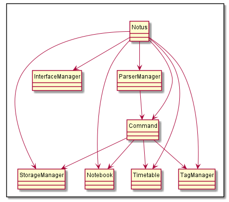

# Developer Guide

## Table of Contents
#### [1. Introduction](#intro)
##### &nbsp;&nbsp;&nbsp;&nbsp;&nbsp;&nbsp;[1.1 Setting up and getting started](#setup)
#### [2. Design & Implementation](#design)
##### &nbsp;&nbsp;&nbsp;&nbsp;&nbsp;&nbsp;[2.1 Architecture Overview](#overview)
#### [3. Product Scope](#scope)
##### &nbsp;&nbsp;&nbsp;&nbsp;&nbsp;&nbsp;[3.1 Target User Persona](#userpersona)
##### &nbsp;&nbsp;&nbsp;&nbsp;&nbsp;&nbsp;[3.2 Target User Profile](#userprofile)
##### &nbsp;&nbsp;&nbsp;&nbsp;&nbsp;&nbsp;[3.3 Value Proposition](#value)
#### [4. User Stories](#userstories)
#### [5. Non-Functional Requirements](#nfr)
#### [6. Glossary](#gloss)
#### [7. Instructions for Manual Testing](#testinstr)

 

## <a id="intro">1. Introduction</a>

NotUS is a quick and simple, Command Line Interface (CLI) based, note-taking application for keyboard-inclined users. NotUS allows for users to categorize notes by tagging as well as pinning the more important notes. NotUS is also designed to assist in planning timetables to highlight possible clashes.

This document describes the design, implementation and architecture of NotUS.

#### <a id="setup"><ins>1.1 Setting up and getting started</ins></a>

**Prerequisites:**
* JDK 11
* IntelliJ IDE

Fork this repo and clone it onto your local machine.
Import the project as a <b>Gradle project</b>.
Ensures that you are using the correct JDK version (For this project we are using JDK 11).

 

## <a id="design">2. Design & Implementation</a>

This section seeks to explain the high-level design of the application. Given below is a quick overview of each component and the explanation of the design architecture in greater detail.
NotUS is the main class of the application, and handles the initializing the appropriate classes to be used as well as
 the execution.

#### <a id="overview"><ins>2.1 Architecture Overview</ins></a>

  
   <em>Figure 1</em>

The architecture design is given in the diagram above. The main components of NotUS are:

1. `InterfaceManager`: Manages the user input as well as the message output from application.
1. `Parser`: Makes sense of user input, and parses the information to the respective commands.
1. `Command`: Executes the necessary tasks, depending on the respective command calls .
1. `TagManager`: Stores and manages the creation and deletion of tags and other tag-related functionality.
1. `Timetable`: Stores and manages the creation and deletion of events and other event-related functionality.
1. `Notebook`: Stores and manages the creation and deletion of notes and other note-related functionality.
1. `StorageManager`: Manages the loading of existing saved files and exporting of data to human-editable files

**NotUS** manages the flow of the application. On launch, it will create the necessary components, as listed above
 and then attempts to load any existing saved files into the application. Subsequently, it will accept and interpret
the user input and execute the commands accordingly. The diagram below depicts the main flow of the application.

{insert Notus.puml here}

 

**Parser**

1. Receives the user input message as a whole.
1. Interprets the type of command and splits the message to identify all the parameters provided.
1. Creates and returns the Command class respectively.
 
 {insert Parser.puml here}

**Command** classes

 

## <a id="scope">3. Product Scope</a>

#### <a id="userpersona"><ins>3.1 Target User Persona</ins></a>

Jane Doe is a NUS undergraduate student who is in SOC/FOE and is having a hard time managing her responsibilities and extra curricular activities. She wants to have a convenient platform to take notes and categorize them according to her modules. She also wants to plan her time so she is more aware of her module schedule.

She also wants to be able to export the information so she is able to share them with whomever easily.

#### <a id="userprofile"><ins>3.2 Target User Profile</ins></a>

1. NUS students, specifically SOC and CEG students (herein referred to as students) who are comfortable and adept at using CLI.
2. Students who want to take notes and categorize them so they are not all over the place.
3. Students who are comfortable with CLI.

#### <a id="value"><ins>3.3 Value Proposition</ins></a>

A all-in-one solution for note-taking and managing your schedule.

 

## <a id="userstories">4. User Stories</a>

| Version | Target User | Function/Feature | User's Benefit |
|--------|----------|---------------|------------------|
|v1.0| As a ... | I want to ... | So that I can ... |
|v1.0|SOC/FOE student|Keep track of my notes|Be organized and find notes easily|
|v1.0|Meticulous student|Categorize my notes by level of importance|Focus on the important topics|
|v1.0|Student who is overloading|Categorize my notes by module|Be more aware of which notes are necessary for the upcoming lessons|
|v1.0|Student who is more visual|Categorize my notes by colour (visible on CLI)|Be able to easily identify which module is which|
|v1.0|Meticulous student|Create daily and weekly task lists|Keep track of my work progress|
|v1.0|Forgetful student|To obtain reminders about my schedule for the day|So I do not forget what I have on for the day|
|v1.0|Busy student|Pin important notes, events and todo list|Focus on the important information|
|v1.0|SOC/FOE student|Be able to edit my notes|Update missing information|
|v1.0|SOC/FOE student|Be able to read my notes|To revise before exams|
|v1.0|SOC/FOE student|Be able to delete my notes|To clear up space and keep it more organized|
|v2.0|Outgoing student|Able to add my social events to the timetable|View all my upcoming events and classes|
|v2.0|Busy student|Be alerted if there are clashes in between my events and classes|Reschedule my plan|
|v2.0|Student leader|Be able to share certain events with others|Can get people to join events more conveniently|
|v2.0|SOC/FOE student|Archive old notes|Keep dashboard neat while allowing me to refer to old notes when necessary|
|v2.0|SOC/FOE student|Be able to import my notes|To make edits|
|v2.0|SOC/FOE student|Be able to export my notes|To share my notes with my peers|
|v2.0|SOC/FOE student|Be able to import my timetable/events|To make adjustments to my schedule|
|v2.0|SOC/FOE student|Be able to export my timetable/events|To share my schedule with my peers|

 

## <a id="nfr">5. Non-Functional Requirements</a>

| Requirement Type | Description |
|------------------|-------------|
|Constraint|Single user product|
|Performance|Software should not be dependent on a remote server|
|Performance|Software should not exceed 100Mb for JAR file and 15MB per PDF file|
|Quality|Users should prefer CLI/Typing|
|Technical|Must have Java 11 installed|
|Technical|No DBMS, all data to be stored locally|
|Technical|Data stored must be in human-editable files|
|Technical|Programme should be platform independent|
|Technical|Programme should work without an installer|

 

## <a id="gloss">6. Glossary</a>

* *CLI* - Command Line Interface
* *DBMS* - Database Management System

 

## <a id="testinstr">7. Instructions for Manual Testing</a>

{Give instructions on how to do a manual product testing e.g., how to load sample data to be used for testing}
