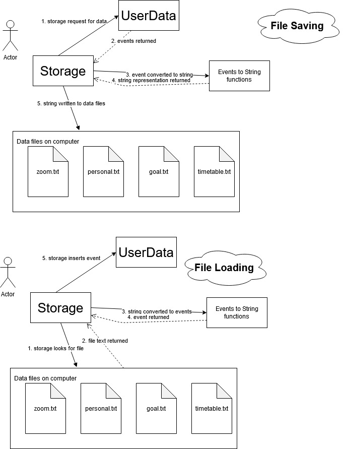
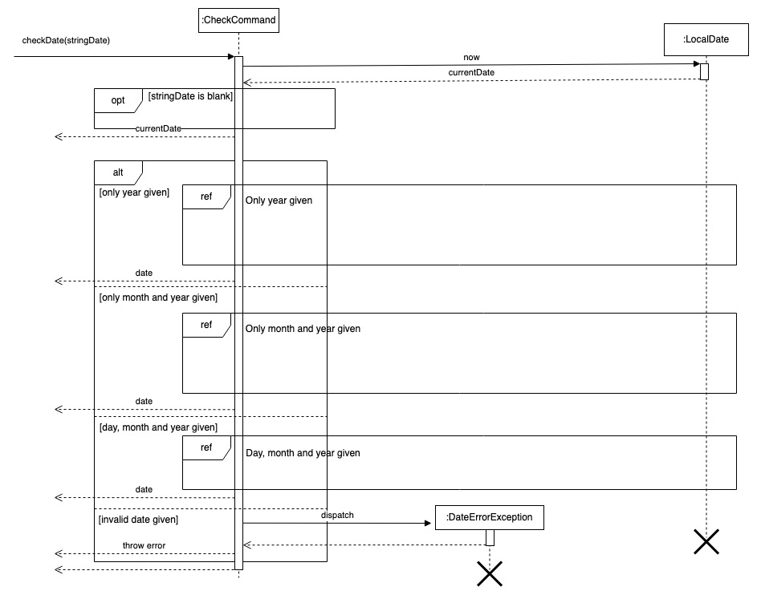
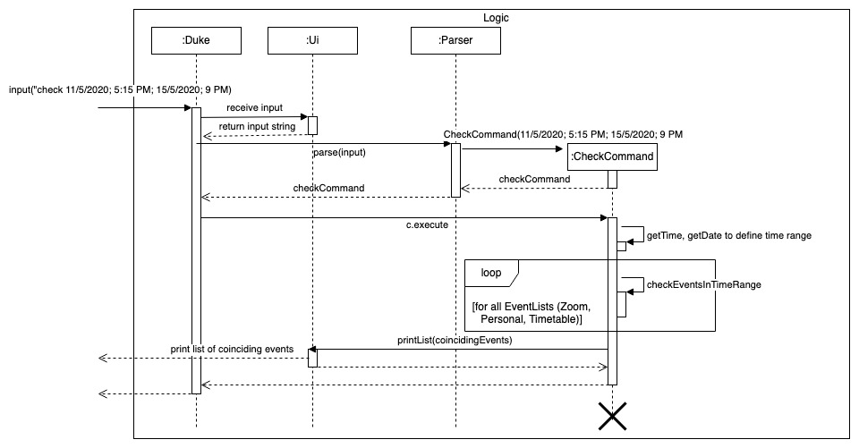

# Developer Guide

## Table of Contents
- [Introduction](#introduction)
- [Setting up, getting started](#setting-up-getting-started)
- [Design](#design)
    * [Architecture](#architecture)
    * [UI Component](#ui-component)
    * [Command Component](#command-component)
    * [Parser Component](#parser-component)
    * [UserData Component](#userdata-component)
    * [Storage component](#storage-component)
- [Implementation](#implementation)
    * [Help](#help-feature)
    * [Add](#add-feature)
    * [List](#list-feature)
    * [Calendar](#calendar-feature)
    * [Repeat](#repeat-feature)
    * [Deadline](#deadline-feature)
    * [Check](#check-feature)
    * [Goal](#goal-feature)
    * [Done](#done-feature)
    * [Undone](#undone-feature)
    * [Delete](#delete-feature)
    * [Note](#note-feature)
    * [Reminder](#reminder-feature)
    * [Extract](#extract-feature)    
- [Documentation, logging, testing, configuration, dev-ops](#documentation-logging-testing-configuration-dev-ops)
- [Appendix: Requirements](#appendix-requirements)
    * [Product scope](#product-scope)   
    * [User Stories](#user-stories) 
    * [Use Cases](#use-cases)
    * [Non-Functional Requirements](#non-functional-requirements)
- [Glossary](#glossary)
- [Instructions for manual testing](#instructions-for-manual-testing)
    * [Launch and Shutdown](#launch-and-shutdown)
    * [Loading and Saving Data](#loading--and-saving-data)
    * [Adding new event](#adding-new-event)
    * [Delete Event](#delete-event)
    * [Repeat Event](#repeat-event)
    * [Changing status of events](#changing-status-of-events)
    * [Help Command](#help-command)
    * [Printing calendar](#printing-calendar)
    * [Checking schedule availability](#checking-schedule-availability)
    * [Adding deadline to event](#adding-deadline-to-event)
    * [Setting reminder](#setting-reminder)
    
## Introduction


## Setting up, getting started
1. Fork the Scheduler--; repo from this [link](https://github.com/AY2021S1-CS2113T-T12-4/tp).
2. Clone the fork on to your computer.
3. Open Intellij. If you are not in the welcome screen, click `File` -> 'Close project' 
to close the existing project dialog. 
4. Set up the correct JDK version for Gradle.
    1. Click `Configure` -> `Project Defaults` -> `Project Structure`
    2. Click `New...` and set it to the directory of the JDK.
5. Click `Open or Import` in Intellij.
6. Locate the `build.gradle` file, select it and click `OK`.
7. If asked, choose to `Open as Project`.
8. Click `OK` to accept the default settings.
9. Wait for the importing process to finish.
10. Locate run the 'Duke.java' file, right click and select `Run Duke.main()`.
11. Navigate to the `test\java` folder and right click `seedu.duke` and select `Run Tests in 'seedu.duke'`.
If the setup is successful, you should see this after step 10. All tests should also pass.
````
_________________________________
Welcome to scheduler--;!
What can I do for you?
_________________________________
File Created: Personal
File Created: Zoom
File Created: Timetable
File Created: Goal
The file has successfully been loaded!
_________________________________
You have no events today!
_________________________________
````
## Design
### Architecture


The ***Architecture Diagram*** given above explains the high-level design of App. Given below is a quick overview of
each component.

`Duke` class contains the main method. It is responsible for,

- At app launch: Initializes the components in the correct sequence, and connects them up with each other.  
- At shut down: Stores the user data from memory into the hard disk.

The rest of the App consists of five components.

- `Ui`: The Ui of the App.
- `Parser`: Parses the input to determine which command to execute.
- `Command`: The command executer.
- `UserData`: Holds the data of the App in the memory.
- `Storage`: Reads data from, and writes data to, the hard disk.

#### Ui Component
The 'Ui' component is in charge of handling input from users and system output.

#### Command Component


API: [Command.java](https://github.com/AY2021S1-CS2113T-T12-4/tp/blob/master/src/main/java/seedu/duke/command/Command.java) 
1. `Parser` class to parse the user command 
1.  This results in a `Command` object executed by the `Parser`
1.  The command execution can affect the `Model`

It listens for commands made in the Duke Class and sends the input to the parser class.
It is also responsible for printing messages from commands and exception messages. 

#### Parser Component


The `Parser` object uses its `parse` method to parse inputs passed to it from `Ui`. This method returns a `Command` object to be executed by `Duke`.

#### UserData Component


The `UserData`
- stores `EventList` objects that store events of different categories (i.e. Personal, Timetable, Zoom).
- stores a `Goal` object that represents the current user goal.
- does not depend on the other components.

#### Storage Component


API [Storage.java](https://github.com/AY2021S1-CS2113T-T12-4/tp/blob/master/src/main/java/seedu/duke/storage/Storage.java) 

The storage component,
- is able to store all event and goal information onto the computer
- is able to load all event and goal information from the computer into the program



How the storage component load files
- the storage component will read the correct txt file.
- It passes the text to the StorageParser.
- The event strings are converted to actual events using their respective class constructors.
- the events are added back into the UserData structure.

How the storage component save files
- The storage component will first retrieve the correct EventList from the UserData.
- It will next send this EventList into the StorageParser
- The StorageParser uses its functions to convert the events into string representations
- The StorageParser then returns these string representations to Storage
- the Storage class then writes them to the correct Path and the corresponding text(.txt) files are modified. 
## Implementation

In this section, the features implemented will be explained using various UML diagrams and code snippets.

#### Help feature
(WIP)

#### Add feature

The add feature in the program allows the user to create one of 3 different events in scheduler--;.
These 3 are the Personal, Zoom and Timetable events. These events have varying numbers of arguments or fields that can 
be inserted upon creation. 

Generally, Personal events are meant for non school related events and can be any general task the user wants to do. 
Zoom events are meant for events that require zoom links and helps the user to store their zoom links easily. 
Timetable events can contain a location and are meant for school related events like classes.

Firstly, to begin, the user needs to key in the add command with the general format `add EVENT_TYPE; EVENT_DESCRIPTION; [LINK/LOCATION]; DD/MM/YY; HH:MM AM/PM`.
The optional fields to fill in like the link and location for the zoom and timetable classes can be inserted respectively in the position right after the description field. For example,
`add zoom; cs2113t meeting; zoom.sg; 16/09/20; 2100`

When a command like this is called, the constructor to `AddCommand` will be able to detect the event type based on the user's input. It then stores the event type in that instance of the addCommand.

Next, when `AddCommand#execute()` is called from the main, this method will call the respective method to create one of the three events. These methods are `AddCommand#addPersonal()`, `AddCommand#addZoom()`, and `AddCommand#addTimetable()`.
These methods are then used to create events based on the number of fields/parameters entered by the user. Each event has multiple constructors and can contain different combinations of fields which will be stated below.

The personal event can contain the following fields: 
- Description 
- Description and date
- Description, date and time

Examples of user inputs for the respective fields of personal events are:
- add personal; run
- add personal; run; 16/7/2020;
- add personal; run; 16/7/2020; 1600

The zoom event can contain the following fields:
- Description and link
- Description, link, date and time

Examples of user inputs for the respective fields of zoom events are:
- add zoom; meeting; zoom.com.sg
- add zoom; meeting; zoom.com.sg; 17/10/2000; 2100

The Timetable event can contain the following fields:
- Description, date and time
- Description, location, date and time

Examples of user inputs for the respective fields of timetable events are:
- add timetable; math class; 10/10/2000; 4:00 pm
- add timetable; math class; NUS engineering; 10/10/2000; 4:00 pm

The fields for what each event can contain were chosen based on what we as a team thought were important fields for the respective event types.
However, these methods can easily be edited to accept different numbers of fields if we change our minds in the future.

Given below is an example scenario of the add feature:
 
Step 1. The user launches the application for the first time. There will be no events stored at the moment.
 
Step 2. The user inputs `add zoom; cs2113t meeting; zoom.sg; 16/09/20; 2100`. The `addCommand` instance is created and detects that the event is of Zoom type.
 
Step 3. `addCommand#execute()` is called. The class knows the current addCommand is of Zoom type so it calls `addCommand#addZoom()`.
 
Step 4. `addCommand#addZoom()` detects there are 4 fields in the command, separated by semicolons, and uses this to create a new Zoom event.
 
Step 5. The Zoom event is then added to the user's `UserData` for further use.
 
The following sequence diagram shows how the whole add feature works: <br>


// to be updated

#### List feature

The list feature allows the user to print a list of events added by type.
The list of events is print according to the order it was added in.

The following is the class diagram for list command:


User calls the list command by executing `list [argument]`.

Executing `list` without specifying any argument prints a list of event types available.  
Specifying an event type as the argument prints a list of events of that type.  
Specifying `all` as the argument prints a list of all events in the order: Personal, Timetable, Zoom.

Given below is an example usage scenario of the list feature.

Step 1. The user executes `list zoom` command to print a list of Zoom events.
The `list` command is passed through a parser to return the ListCommand with arguments initialised.

Step 2. `ListCommand#execute()` is called, retrieving the list of Zoom events in `UserData`.

Step 3. `ListCommand#execute()` calls `Ui#printList()` and passes the list of Zoom events to print.

Step 4. `Ui#printList()` loops through every event in the Zoom event arraylist and prints it.

The following sequence diagram shows how the `list zoom` command is parsed:


The following sequence diagram shows how `ListCommand#execute()` works:


#### Calendar feature

The calendar feature allows the user to list all events in chronological order.
Only events with a date and time will be included in the calendar.
The calendar is sorted by date using a treemap with each entry being an arraylist of events on the same date.
It is then sorted by time in the arraylist of events.

The following is the class diagram for calendar command:


User calls the list command by executing `calendar`.

Given below is an example usage scenario of the calendar feature.

Step 1. The user executes `calendar` command to list the events in a calendar.
The `calendar` command is passed through a parser to return the CalendarCommand with arguments initialised.

Step 2. `CalendarCommand#execute()` is called, sorting the events with date and time in chronological order in a map.

Step 3. `CalendarCommand#execute()` calls `Ui#printCalendarStart()` to print the number of dates to list and the number
of events that will not be in the calendar.

Step 4. `CalendarCommand#execute()` calls `Ui#printCalendar()` for every date in the map.

Step 5. The user can choose to end the calendar with the input `q` or press **Enter** to list the next date.

Step 6. `CalendarCommand#execute()` calls `Ui#printCalendarEnd()` to print that it is the end of the calendar when the
last date is listed or the user ends it.

The following sequence diagram shows how `CalendarCommand#execute()` works:


#### Repeat feature

The repeat feature on the program allows for the user to be able to make certain events repeat several times over a defined time period.
For instance, the user can request for a personal event to be repeated monthly for four months. To run the program, the user will need to key in the command `repeat [event type] [index] [timeUnit] [count]`

|Argument| Description |
|--------|----------|
|event type|What type of event is to be repeated? Accepted arguments are `personal`, `timetable` or `zoom`|
|index|Index number of the event to be repeated that is stored on the Event List|
|timeUnit|For what unit of time each event is to be repeated. Accepted arguments are `daily`, `weekly` and `monthly`|
|count|Integer indicating how many times the event is to be repeated|

For example, to repeat a personal event located at index 2 for 3 days, the user will key in this: `repeat personal 2 daily 3`.

The following sequence diagram shows the overall process of repeating an event:


The steps to repeating the command will be described in the following sections. 

##### Step 1: Obtaining the event information

The repeat command first locates the event that is to be repeated along with its starting date.
Next, it creates an empty ArrayList called `repeatEventList` that will contain all repeated events.


##### Step 2: Incrementing the Original Date

The repeatCommand object will now call upon Event to increment the date by a fixed unit of time. In the following diagram, it shows how the program flow will work should a monthly repeat increment be set. 
The increment date will be assigned the name `repeatDate`


##### Step 3: Set Repeat type

The repeatCommand now will set the original Event to have a repeat type setting. In the diagram's example, it will be set to `monthly`


##### Step 4: Clone the event

The original event is now cloned as shown in the following sequence diagram.


##### Step 5: Add the cloned activity

The cloned activity will now have its date set to be `repeatDate`. This new activity is now added into the `repeatEventList` as shwon in the following diagram.


##### Step 6: Repeat steps 2 to 5

Steps 2 to 5 are repeated up till the number specified by `count` as shown in the loop.


##### Step 7: Assign the ArrayList as the RepeatEventList attribute of the original event.

Finally, set the `repeatEventList` using the `setRepeatEventList` command as shown in the following section of the sequence diagram. The results of this process is printed and control returns back to the main program.


#### Deadline feature

The user executes ```deadline 1; 7/10/20; 11:20 PM``` command to set the deadline for the 1st event in Personal event list
to be on the 7th October 2020 at 11:20 PM. 
The ```deadline``` command calls ```DeadlineCommand#execute()```, adding/updating the personal event deadline. <br>
Given below is how the deadline command behave: <br>

<p align="center">
  
</p>

The following sequence diagram shows how the deadline operation works: <br>


#### Check feature

The check feature is implemented using the `CheckCommand` class. `CheckCommand` accesses the `Event`s stored within `EventList`s in order to determine if events are occurring within a given time period. It implements the following operations:

- `CheckCommand#getDate(stringDate)` -- Parses a given string to get a LocalDate variable (either the start or end date for the time period).
- `CheckCommand#getTime(stringTime)` -- Parses a given string to get a LocalTime variable (either the start or end time for the time period).
- `CheckCommand#checkEventsInTimeRange(eventsList, startDate, endDate, startTime, endTime)` -- Checks each event in the eventsList to see if they occur within the time period defined in the command, and saves all coinciding events in an ArrayList.

These operations are not exposed, and are used as private methods within the `CheckCommand` interface.

Given below is an example usage scenario and how the check feature functions.

Step 1. The user inputs `check 11/5/2020; 5:15 PM; 15/5/2020; 9 PM` in order to check for events occurring between 11th May 2020, 5:15 pm and 15th May 2020, 9:00 pm. This input is received by the Ui, which processes it into a string. The string is parsed by the Parser, which returns a CheckCommand with the date and time parameters stored in it as a string.

Step 2. `CheckCommand#execute()` is called. The command string containing the date and time parameters are split into a String array to separate the different parameters. 

Step 3. Within `CheckCommand#execute()`, `CheckCommand#getDate()` is called to parse the start and end dates, and `CheckCommand#getTime()` is called to parse the start and end times.

This sequence diagram shows how the `getDate` method functions:



Step 4. Within `CheckCommand#execute()`, the start date time and end date time is passed to `CheckCommand#checkEventsInTimeRange()` along with an `EventList` (i.e. Zoom, Personal or Timetable). This method checks each `Event` in the `EventList` to determine if the event occurs within the time period. If the event date time coincides with the time period, the event is added to an ArrayList that stores all the coinciding events in the current `EventList`. This is done for each `EventList`. 

Step 5. The contents of the ArrayLists returned by `CheckCommand#checkEventsInTimeRange()` are combined into a single ArrayList, and a new `EventList` ("coinciding") is created using this combined list of events.

Step 6. `Ui#printList()` is called to print the list of coinciding events.

The following sequence diagram shows how the check operation works:



#### Goal feature

The goal feature is achieved by `GoalCommand`. It either prints the current goal stored internally in
`UserData` if there is one, or it sets the input as the new goal by replacing the previous goal.
The user can only have one goal at any time.

The following is the class diagram for goal command:


Given below is an example usage scenario of the goal feature.

Step 1. The user launches the application for the first time. `Ui#printGoal` is called, 
a line informing them they have no goal is printed.

Step 2. The user executes `goal save money` command to set the goal as "save money".
The `goal` command is passed through a parser to return the GoalCommand with arguments initialised.

Step 3. `GoalCommand#execute()` is called, setting the goal in `UserData` to "save money". The change is printed
with `Ui#printChangeGoal()`.

Step 4. The user executes `goal` command to print the current goal.
The `goal` command is passed through a parser to return the GoalCommand with blank arguments.

Step 5.  `GoalCommand#execute()` is called, to retrieve the current goal in `UserData` and print it
with `Ui#printGoal()`.

The following sequence diagram shows how `GoalCommand#execute()` works:


#### Done feature
(WIP)

#### Undone feature
(WIP)

#### Delete feature
(WIP)

#### Note feature
(WIP)

#### Reminder feature
(WIP)

#### Extract feature
The extract feature allows users to copy and paste a body of text like emails and it will help users create either
a Zoom or a Personal event. It utilizes Regular Expressions (Regex) patterns in order to match dates, times and zoom links
in the text entered. 

Given below is an example usage scenario to explain how the extract feature works.

Step 1. To begin, the user enters `extract CS2113T Quiz;`. 
The constructor for `ExtractCommand` will then be called and the `TEXT_SUBJECT` which is `CS2113T Quiz` will be stored in that instance of ExtractCommand.

Step 2. Next, `ExtractCommand#execute()` is called from the main. This method will call `ExtractCommand#receiveTextBody()` which will let the user enter any text and only ends once the user types `extractend` on a new line.
The user may then input a text copied from email, for example `The quiz will be on October 8 2020 or 9th October at 4pm or 5pm. The zoom link is at https://nus-sg.zoom.com`. After going to the next line, the user has to type `extractend`.
This is saved as the `textBody` in this instance of `ExtractCommand`. 

Step 3. The `textBody` is then used in multiple methods. These include `ExtractCommand#detectZoomLink()`, `ExtractCommand#detectDate()` and `ExtractCommand#detectTime()` which will use Regex patterns to find and match dates, times and zoom links.

Step 4. `ExtractCommand#verifyDate()` and `ExtractCommand#verifyTime()` will be called which will return dates and times that are valid. In this case, it will detect the 2 dates, 2 timings and 1 zoom link above.

Step 5. `ExtractCommand#chooseZoomLink()`, `ExtractCommand#chooseDate()` and `ExtractCommand#chooseTime()` will be called and will print out a list of valid zoom links/dates/times and allow the user to input the number of the link/date/time they want to select it.

Step 6. If the event has a zoom link, a `Zoom` event will be created using the link, date, time and `TEXT_SUBJECT` as its description. Otherwise, a `Personal` event will be created with the date, time and description fields. The event will be added to the user's `UserData`.

The following sequence diagram shows how the Extract Feature works in general:


Design considerations:

For the detection of date, the Regex pattern used detects dates in the DD/Month Name/YYYY format or Month name/DD/YYYY format. The current year can also be added automatically if no year was detected.
It can also detect if the day portion of the date has any suffixes. This does not detect dates written in other formats like DD/MM/YYYY or DD/MM/YY because upon
looking at many of the emails sent to us, we found most were of the Regex pattern we chose. However, this could be implemented in the future. 

For the detection of time, the Regex pattern used detects time in the 12 or 24 hour format. It can detect time with AM/PM behind it too. However, it cannot detect 24 hour timings
with no "." or ":" in it unlike some commands above. This is because it may result in detecting a lot of false timings like if a 4 digit number like 2020 for a date was detected as a time and a year.

For the detection of zoom link, the Regex pattern used first detects any URL starting with https:// or http://. It then checks whether the URL contains ".zoom." which we found the be common in most zoom links.


 
## Documentation, logging, testing, configuration, dev-ops

## Appendix: Requirements

### Product scope

##### Target user profile

<ul>
    <li>has a need to organise events using scheduler</li>
    <li>prefer desktop application</li>
    <li>can type fast</li>
    <li>prefer typing to mouse interactions</li>
    <li>is reasonably comfortable using CLI apps</li>
</ul>

##### Value proposition

Manage one's events quickly compared to GUI scheduling applications. 
Users can check when they are free using a simple command 
and also extract deadlines from any body of text.

### User Stories

|Version| As a ... | I want to ... | So that I can ...|
|--------|----------|---------------|------------------|
|v1.0|office worker (working from home)|organise large amount of online Zoom meetings to manage|keep track of his schedule for the day|
|v1.0|university student|consolidate my schedule for both my online zoom lectures and my ordinary timetable|better manage my time|
|v1.0|university student having projects|be informed of the goals of my project|keep track of the project details|
|v1.0|university student|customise repeated task|set events like tutorials to weekly|
|v1.0|teacher|organise all my zoom links for my classes|it can be easily accessible.|
|v1.0|user|see the events that I have created|refer to them when I forget|
|v1.0|user|check when I am available on that day|avoid manually searching through my entire calendar to find out if I have time|
|v2.0|user|be able to keep track the status of completion of the events I created|focus more on the tasks that I need to complete|
|v2.0|user|view which events are upcoming in a convenient readable format|locate the events easily by date|
|v2.0|user|the application to alert me when my deadlines are coming up|be given enough time to work on them and not rush last minute|
|v2.0|user|create deadlines from the email text body|avoid looking through the email to create one by one|
|v2.0|new user (new to text-based application)|detailed directions on commands I can use|easily navigate through the application|
|v2.0|new user (expert in using text-based application)|have some useful shortcut keys|speed up common tasks|

### Use Cases
(For all use cases below, the System is Scheduler--; and the Actor is the user, unless specified otherwise)

**Use case: Extracting deadlines from an email**

MSS:
1. User enters extract command for a body of text/email
2. Scheduler--; shows a list of dates detected
3. User chooses one of the dates
4. Scheduler--; shows a list of the time slots detected
5. User chooses one of the time slots
6. Scheduler--; creates a personal event based on the user's choices

Use case ends.

Extensions:

2a. There are no dates detected.

Scheduler--; creates a Personal event with no date or time.

 3a. User selects an invalid index from the list of dates.
- 3a1. Scheduler--; requests for the user to pick a valid number.
- 3a2. User enters new index.

Steps 3a1-3a2 are repeated until the index entered is valid.
Use case resumes from step 4.

 5a. User selects an invalid index from the list of time slots.
- 5a1. Scheduler--; requests for the user to pick a valid number.
- 5a2. User enters new index.

Steps 5a1-5a2 are repeated until the index entered is valid.
Use case resumes from step 6.

**Use case: Repeating an event and checking its status**

MSS:

1. User uses list command for one of the three types of events.
2. Scheduler--; prints a list for the event type chosen.
3. User enters repeat command for one of the events.
4. Scheduler--; prints a confirmation message.
5. User uses repeat command to check status of the repeated event.
6. Scheduler--; prints out the status of the repeated event.

Use case ends.

Extensions:

3a. User selects a personal event that does not have a deadline

Scheduler--; prints an error message and use case ends.


### Non-Functional Requirements

<ol>
    <li>Work on any mainstream OS that has Java 11 or above installed</li>
    <li>A user who has faster typing speed than average should be able to use this program with ease</li>
</ol>

## Glossary

- Mainstream OS: Windows, Linux, Unix, OS-X

## Instructions for manual testing

{Give instructions on how to do a manual product testing e.g., how to load sample data to be used for testing}

### Launch and Shutdown
1. Initial Launch
    1. Copy the Java Archive file into an empty directory
    1. On windows machines, open up the terminal and navigate to the directory
    1. Type in `chcp 65001` and press enter
    1. Type in `java -Dfile.encoding=UTF-8 -jar scheduler.jar` and press enter
    1. You should now see the welcome message printed on the screen
1. Shutdown
    1. In the program, type the word `bye` and press enter
    1. You should now see the goodbye message printed on the screen
    1. The program should return you back to the main terminal window

### Loading  and Saving Data
1. Sample Load data
    1. Copy the Java Archive file into an empty directory
    1. In this directory, make a directory called `data`
    1. Copy the files in the `storagetester` directory into the `data` directory
    1. Launch the program as shown in the previous section
    1. Type `list all`
    1. You should now see the files listed on the program as shown

### Adding new event
1. Add a personal event
    1. Load the program
    1. Type `add personal dental appointment`
    1. Type `list personal`, your new personal event should be displayed on the screen

### Delete Event
1. Deleting a personal event
    1. Load the program
    1. Type `add personal dental appointment`
    1. Type `list personal`, your new personal event should be displayed on the screen
    1. Test Case: `delete 1` 
        When you type `list personal`, you should notice that the list is blank
    1. Test Case: `delete 0`
        An error message should be displayed as none of the events are labelled with event index 0.

### Repeat Event
1. Repeating a personal event
    1. Load the program
    1. Type `add personal dental appointment; 18/09/2020`
    1. Type `add personal birthday`
    1. Type `list personal`, your new personal events should be displayed on the screen
    1. Test Case: `repeat personal 2 monthly 3`
        An error message should be displayed indicating that you cannot repeat an event with no deadline
    1. Test Case: `repeat personal 1 monthly 3`
        When you type `repeat personal 1`, you should see a message indicating to you that the event is repeated monthly for three more times. 

### Changing status of events
1. Changing the status of a personal event
    1. Load the program
    1. Type `add personal dental appointment; 18/09/2020`
    1. Type `add personal birthday`
    1. Type `list personal`, your new personal events should be displayed on the screen
    1. Test Case: `done pesonal 1`
        When you type `list personal`, you should see that the symbol of the first event has changed from a cross to a tick
    1. Test Case: `undone personal 1`
        When you type `list personal`, you should see that the symbol of the first event has changed from a tick to a cross 

### Help Command
1. Getting generic help
    1. Load the program
    1. Type `help` and press enter
    1. You should see a summary of all the commands available to the user printed on the screen

### Printing calendar
1. Printing calendar
    1. Copy the Java Archive file into an empty directory
    1. In this directory, make a directory called `data`
    1. Copy the files in the `storagetester` directory into the `data` directory
    1. Launch the program as shown in the previous section
    1. Type `list all`
    1. You should now see the files listed on the program as shown
    1. Type `calendar`
    1. As you press enter, you should see all your events and timings being displayed in chronological order
    1. Once all the events have been printed, the `End of calendar` message should appear
    
### Checking schedule availability
1. Check Schedule
    1. Copy the Java Archive file into an empty directory
    1. In this directory, make a directory called `data`
    1. Copy the files in the `storagetester` directory into the `data` directory
    1. Launch the program as shown in the previous section
    1. Type `list all`
    1. You should now see the files listed on the program as shown
    1. Test Case: `check 01/01/2010; 1100; 01/01/2010; 2359;`
        1. You should see the check command prints out all events that fall between the timing of 01 Jan 2010 1100hrs to 2359hrs
    1. Test Case: `check 01/01/2020; 1100; 01/01/2020; 2359`
        1. The message `You have no coinciding events!` should be printed. 

### Adding deadline to event
1. Repeating a personal event
    1. Load the program
    1. Type `add personal dental appointment; 18/09/2020`
    1. Type `add personal birthday`
    1. Type `list personal`, your new personal events should be displayed on the screen
    1. Test Case: `deadline 2; 03/08/2020`
        A success message should be printed, indicating that the new deadline has been set
        When `list personal` is typed, you should see that the second event now has a deadline attached to it

### Setting reminder
1. Repeating a personal event
    1. Load the program
    1. Type `add personal dental appointment; 18/09/2020`
    1. Type `add personal birthday; <<current date that test is run>>`
    1. Test Case: `reminder`
        The program should show that the personal birthday event is the event that you have for today. 
