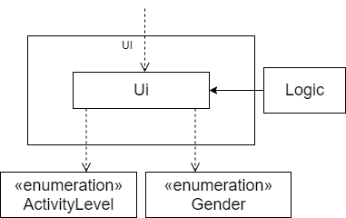
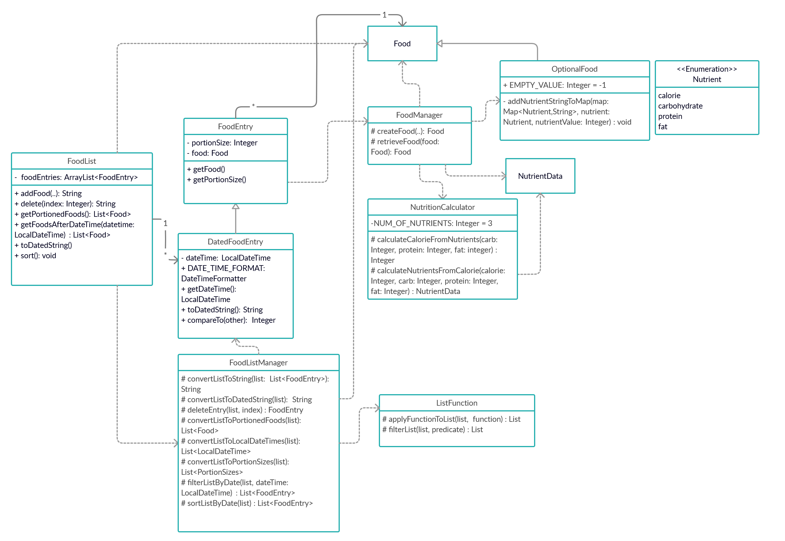
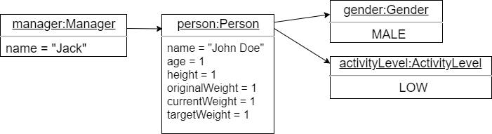
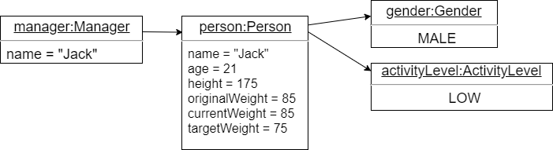
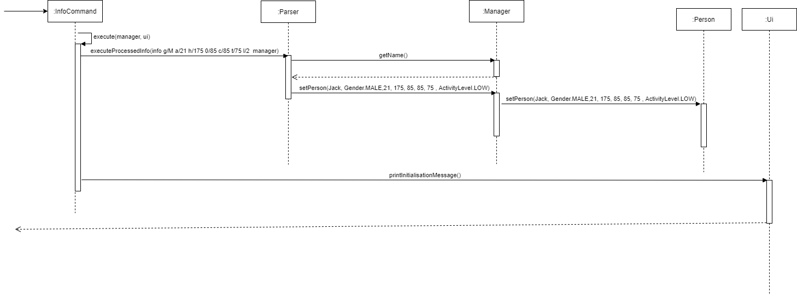

# Developer Guide

* Table of Contents
{:toc} 

## Design 

### UI component

**API**: [`Ui.java`](https://github.com/AY2021S1-CS2113-T14-4/tp/blob/master/src/main/java/seedu/dietbook/Ui.java)

The `UI` component,
* Takes in user command and passes to the `Logic` components for command execution.
* Updates the user about any changes in the data after executing the command or errors encountered when executing the commands.

The UI has a dependency with two enumeration class, [`ActivityLevel`](https://github.com/AY2021S1-CS2113-T14-4/tp/blob/master/src/main/java/seedu/dietbook/person/ActivityLevel.java) and [`Gender`](https://github.com/AY2021S1-CS2113-T14-4/tp/blob/master/src/main/java/seedu/dietbook/person/Gender.java) as descriptions of each [`ActivityLevel`](https://github.com/AY2021S1-CS2113-T14-4/tp/blob/master/src/main/java/seedu/dietbook/person/ActivityLevel.java) and [`Gender`](https://github.com/AY2021S1-CS2113-T14-4/tp/blob/master/src/main/java/seedu/dietbook/person/Gender.java) is required. Increased coupling was sacrificed to reduce code duplicates and increase ease of code extension/editing.

### Model Component

Data of the user's diet is stored in the app's memory via the model: a `FoodList`.
**API**: [`FoodList.java`] (https://github.com/AY2021S1-CS2113-T14-4/tp/blob/master/src/main/java/seedu/dietbook/list/FoodList.java) 

`FoodList` provides the following functions:
* Stores data on entries made into the dietbook app: portion size, details on the food, and the time of consumption.
* Provides string representations of the data so that the UI can be updated.
* Allows selective retrieval and simple calculations of the data without modifying the stored data.

Additionally, it is not dependent on the other components listed. Instead, it is dependent on a common `Food` class, which is used by serval components, including the storage, database, and calculator.

    
A more detailed class diagram is availble here

Some attributes and methods of the classes have been truncated for brevity. See the full details in the next subsections on `FoodListManager` and `FoodManager`.

The above functions and the lack of dependency are met through the following means:
* `FoodList` stores new information added via the creation and maintenance of a list of `FoodEntry` objects. These encapsulate the data being stored. In practice, the objects in the list are `DatedFoodEntry` objects, which additionally support the storage of the date and time.
* A `FoodListManager` is used to perform logical operations on the list of `FoodEntry` objects. A `FoodManager` is also used as a fascade that obscures calculations and prevents modification of `Food` data stored.
* The result of an operation is typically a `String` that is meant to be supplied to the UI. In other data retrieval operations, such as those required by calculator, a list of `Food` objects is supplied as a means of data transfer between the components. Other lists of java data types such as `LocalDateTime` and `Integer` are also provided to the storage component.

#### FoodListManager

    
 Fascade pattern of `FoodListManager`

`FoodListManager` obscures the operations performed on the individual items of the list of `FoodEntry` objects. These operations are performed using a functional programming paradigm to reduce code repetition, since all operations typically take the form of a list mapping or filtering.

It is only within `FoodListManager` that forced type conversions from `FoodEntry` to `DatedFoodEntry` are performed. Hence, only `FoodListManager` needs to be aware of the functions in `FoodEntry` and `DatedFoodEntry`.

`FoodListManager` also reduces code repetition in `FoodList` by having generic list operations that can be combined to achieve the desired result (e.g. A method in `FoodList` may use `FoodListManager` for filtering followed by conversion to string. Yet another method in `FoodList` may use `FoodListManager` for its filtering function, scaling, and then conversion to string).

Overall, `FoodList` fulfils the role of being the app's Model component by holding consumption data in the app's memory. It is currently used as a singleton, but is not necessarily limited to such: e.g. a seperate `FoodList` for favorites/recurrent entries or entries that are flagged as unhealthy/healthy can be made and maintained by `Logic`.

#### FoodManager

    
 Fascade pattern of `FoodManager`

`FoodManger` obscures the existence of the class `OptionalFood` from `FoodEntry` and all classes dependent on `Food` from `FoodEntry`.
It uses an obscured `NutrientCalculator` to handle the missing values from the user by providing a guesstimation/calculation of their value.
The use of this fascade pattern, however, comes with downsides that will be further discussed in the implementation section.

### Common classes

There are a few common classes/packages that can be used multiple components. These are `Food`, `StringFormatter`, and `MainLogger`, located in the `seedu.dietbook.food`, `seedu.dietbook.utils`, and `seedu.dietbook.logger` packages respectively.

#### Food

`Food` is a data class containing all the relevant nutritional information on a food: calories, carbohydrates, proteins, fats. Being common to multiple components/classes, it is a means of data transfer between classes while reducing direct coupling.

#### StringFormatter

`StringFormatter` allows the formatting of strings in a manner similar to Python's fstrings:
Strings can be formatted using the pattern `${map_key}` and a corresponding key to value map.

#### Logger

`MainLogger` provides logging support to all classes.

## Implementation
{Describe the design and implementation of the product. Use UML diagrams and short code snippets where applicable.}

### [Proposed] Enter user information feature

#### Proposed Implementation
The proposed feature utilised two commands words [`name`](UserGuide.md/####Entering username: `name`) and [`info`](UserGuide.md/####Entering user information: `info`) that allows users to enter their name using the [`name`](UserGuide.md/####Entering username: `name`) command and [`info`](UserGuide.md/####Entering user information: `info`) to enter other information, such as age, gender, height, activity level, original, current and target weight, separately. 

The proposed feature to enter user information is facilitated by `Manager` which stores a [`Person`](https://github.com/AY2021S1-CS2113-T14-4/tp/blob/master/src/main/java/seedu/dietbook/person/Person.java) which
 stores all user information provided. It implements the following operation:

* Manager#setPerson(String newName, Gender newGender, int newAge, int newHeight, int newOriginalWeight, int newCurrentWeight, int newTargetWeight, ActivityLevel newActivityLevel) - Calls the method below to set the attribute values of the `Person` object.
* Person#setAll(String newName, Gender newGender, int newAge, int newHeight, int newOriginalWeight, int newCurrentWeight, int newTargetWeight, ActivityLevel newActivityLevel) - Updates the attribute values of the `Person` object.
                                               
Both operation are only executed by the `Manager` class of the `Logic` component. Only one instance of `Person` is ever instantiated. A default person is instantiated at the start with default attribute values and when the user enters their information for the first time during the set up, all the default values would be updated to the inputted values. Therefore, the command to enter the user information will result in a change in the attribute values and not the creation of a new `Person` object.

Given below is the example usage scenario and how the feature works.

Step 1. When the user launches the application for the first time. A default `Person` object will be initialised by `Manager` and the user will be prompted to enter their name.
 

 
Step 2. The user executes `name Jack` command to enter their name into DietBook. The `name` command calls `Manager#setName(Jack)`, to store the name in `Manager` first. After which, user will be prompted to enter all other details.
  

  
Step 3. The user executes a command like the following `info g/M a/21 h/175 o/85 c/85 t/75 l/2` to enter all other personal information including age, gender, height, activity level, original, current and target weight. The `info` command then calls `Parse#executeProcessedInfo(info g/M a/21 h/175 o/85 c/85 t/75 l/2, manager)` which would parse the user command, check input validity by using methods in `InputChecker` and calls `Manager#setPerson(Jack, Gender.MALE, 21, 175, 85, 85, 75, ActivityLevel.LOW)` which proceeds to call `Person#setAll(Jack, Gender.MALE, 21, 175, 85, 85, 75, ActivityLevel.LOW)`.

   
The following sequence diagrams shows how the feature works.

`name` command

   
`info` command

#### Design considerations:

Aspect: Whether to enter name and other information separately or together

* **Alternative 1 (current choice)**: Enter name and other information separately
    * Pros: Increase user interaction and engagement.
    * Cons: Enter information using two commands.

* **Alternative 2**: Enter name and other information together
    * Pros: Enter all information at once.
    * Cons: Increase user interaction and engagement.

Aspect: Whether to use singleton pattern for Person class

* **Alternative 1 (current choice)**: Did not use singleton pattern for `Person`
    * Pros: Reduce coupling and increase testability.
    * Cons:  Risk of creating multiple `Person` object by mistake and there might be negative consequence in creating multiple objects.
    
    However, there  is minimal risk of creating multiple `Person` object by mistake and minimal negative consequence in creating multiple objects as long as the `Manager` refers the correct instance of `Person`.
      
* **Alternative 2**: Use singleton pattern for `Person`    
    * Pros: Easy to implement, prevent the instantiation of more than one `Person` object.
    * Cons: Increase coupling and reduce testability

Aspect: Changing attribute values in `Person` object or creating new `Person` object

* **Alternative 1 (current choice)**: Changing attribute values in `Person` object 
    * Pros: Reduce the number of objects being created to reduce memory usage and reduce the risk of creating multiple objects which can potentially lead to negative consequences and bugs.
    * Cons: Unable to write tests as method chains.

* **Alternative 2**: Creating new `Person` object
    * Pros: Ability to write tests as method chains.
    * Cons: Creation of many objects, which take up memory spaces and ensure that only the correct `Person` instance is kept and referred to.

### [Proposed] Supporting missing fields in a user entry

This feature gives the user some flexibility, allowing them to make an entry without full knowledge of the nutritional information of the food that they are eating.
Due to limitations in what can be estimated, there are only two main scenarios for missing fields: a missing total calorie count or some combination of missing nutritional values (carbohydrates, proteins, fat).

#### Implementation details

**Main components involved**: 
`Manager`: Parses the user input and creates an `AddCommand` based on the details provided in the user input. It recognises that some combination of the optional inputs are missing and flags them to `FoodList` when calling the `FoodList#addFood(...)` method by using `OptionalFood.EMPTY_VALUE = -1` as the input value.

`FoodList`: A food entry is created via the `FoodList#addFood(...)` method, which has some arguments set to `OptionalFood.EMPTY_VALUE = -1`. Hence, when a `FoodEntry` is instantiated, the `FoodManager#createFood(String name, int calorie, int carbohydrate, int protein, int fat)` recognises the flags in the arguments and creates an `OptionalFood` instead of `Food`, for which a reference is kept in `FoodEntry`. When a method requiring `FoodEntry#getFood()` is called, `FoodManager` is called via `FoodManager#retrieveFood(Food food)` to return a `Food` object with guesstimated nutritional values. This guesstimation process is done by the `NutritionCalculator` class.

#### Usuage Example

There are essentially two phases to the usuage of `FoodManager` and its associated dependencies: the creation of a `OptionalFood` that has missing values and the retrieval of a guesstimated `Food` object when `FoodEntry#getFood()` needs to be called.
For brevity, the focus will be on the processes within `FoodList`.

**Creation**:
1. `FoodList#addFood(int portionSize,String name, int calorie, int carbohydrate, int protein, int fat)` (or its variant for backlogs: `FoodList#addFoodAtDateTime(...)`) is called by the Logic component to add a new entry with missing nutritional inputs. The missing inputs are encapsulated by `OptionalFood.EMPTY_VALUE = -1` flags.
1. `FoodList#addFood(...)` instantiates a new instance of `DatedFoodEntry`, passing on the arguments and flags to it instead. `DatedFoodEntry` uses `FoodManager#createFood(String name, int calorie, int carbohydrate, int protein, int fat)` to instantiate a `Food` object. Because there are missing values, `FoodManager` actually instantiates `OptionalFood`, a child class of `Food` instead. A reference to this `OptionalFood` object is stored in the `DatedFoodEntry`. The newly instantiated `DatedFoodEntry` is also stored in the list of `FoodEntry` objects in `FoodList`.

**Retrieval**:
1. The method `FoodEntry#getFood()` is only called within functions of `FoodListManager`. When a method such as `FoodList#getPortionedFoods()` is called, `FoodListManager#convertListToPortionedFoods(List list)` is subsequently called.
1. `FoodListManager#convertListToPortionedFoods(List list)` calls `ListFunctions#applyFunctionToList(List list, Function function)`, and passes `FoodEntry#getFood()` within the function argument.
1. `ListFunctions#applyFunctionToList(List list, Function function)` executes the function containing `FoodEntry#getFood()` in its `forEach` stream.
1. `FoodEntry#getFood()` calls the method `FoodManager#retrieveFood(Food food)`, passing its `Food` object as an argument.
1. `FoodManager#retrieveFood(Food food)` checks whether the `Food` object is an instance of `OptionalFood`. If it is an `OptionalFood`, then it is handled differently based on the missing information. Otherwise, the `Food` object is simply returned.
1. The missing information in `OptionalFood` is calculated using `NutritionCalculator` based on what is missing: if calorie is missing, then `NutritionCalcular.calculateCalorieFromNutrients(int carbohydrate, int protein, int fat)`is called, otherwise `NutritionCalculator.calculateNutrientsFromCalorie(int calorie, int carbohydrate, int protein, int fat)` is called instead to calculate the missing nutrient masses.
1. With the calculated information, a new `Food` object containing the estimates is created and returned by `FoodManager#retrieveFood(Food food)`, leaving the original reference to the `Food` object in `FoodEntry` unmodified in any case.

#### Future work
Only simple methods of estimating the missing information is used by `NutritionCalculator`. We can allow the user the weight the split of missing nutritional values differently (it is currently all weighed equally and split by calorie contribution). This ought to be performed by the `Calculator` component since that is its main role. However, due to the fascade pattern being used in this implementation, the difficulty to add this feature is increased: in order to maintain the status of `FoodList` being non-dependent on the other components, it is recommended that functions to split the nutrients be passed to FoodManager instead (i.e. use a functional paradigm).

#### Design Considerations

* **Alternative 1** (Current choice): Fascade pattern using `FoodManager` to obscure the details and processes behind the handling of a `Food` object with missing values. It is noted that the `OptionalFood` class is obscured in this process, despite being a child class of the common class `Food`.
    * Pros: All higher level components and dependencies do not need to deal with the existence of a new common class `OptionalFood` or check for the possibility of missing values within `Food`. This implementation limits the existence of instances of `OptionalFood` to within the `FoodEntry` class.
    * Cons: New test suite for `FoodEntry` and `FoodManager` had to be created and maintained due to the use of this design pattern. It also makes future work with other components that want to interact with `FoodManager` more difficult (see Future Work section).

* **Alternative 2**: An adapter pattern with a similar implementation could be used. In this case, `FoodManager` could be exposed as a seperate set of API that should be invoked whenever an `OptionalFood` needs to be handled. `FoodManager` becomes an adapter that components such as `FoodListManager` or other classes use when there is the possibility of an `OptionalFood` object.
    * Pros: It becomes easier to extend the features of `FoodManager` since it is exposed and can vary independently. It is also easier to test.
    * Cons: Other higher level classes need to be aware of `FoodManager` and potentially even `OptionalFood` if the latter is allowed to be passed around outside of `FoodList`.

## Save/Load Feature

The Save/Load feature is implemented by the saveload package.
At the base of the package, there is the <mark> Saver </mark> 
and <mark> Loader </mark>  class.

### Architecture

Note only the Saver and Loader class is flexible. They can be adapted to new situations without modifying
the code. The FoodSaveLoadManager and PersonSaveLoadManager are written specifically for this version. They
will have to be modified/replaced for future versions.

#### Saver class

Stores data in a internal table with length and height specified.
Handles the storage of its data by writing to a text file.

##### Constructor
Specifies the length and height of the internal Saver table
##### Main Methods
* Saver#save() saves the current data to the file in the folder with the given file name
* Saver#add() Store String data in the x,y position in the table

#### Loader class
Loads data from a text file and stores it in a internal table just like the saver
##### Constructor
static method Loader.load(folder name , file name) : creates a Loader object with 
a table storing the data found in the text file
##### Main Methods
* Loader#get() retrives the data stored in the loader

#### FoodSaveLoadManager class
Built on top of Saver and Loader class to implement save/load functionality
for list of food items the user has input into the dietbook. Contains a instance
of both <mark> Saver </mark> and <mark> Loader </mark>. It has its own folder to work with,
the user only has to specify the file name.
##### Main Methods
* FoodSaveLoadManager#save() saves the list of food objects to the specified file name
* FoodSaveLoadManager#load() loads the file and returns the list of food objects stored inside it

#### PersonSaveLoadManager class
Built on top of Saver and Loader class to implement save/load functionality for user information
Same as FoodSaveLoadManager, it has its own folder to work with, the user only has to specify the file name
Unlike the FoodSaveLoadManager, it stores the data inside itself and can be updated.
##### Main Methods
* PersonSaveLoadManager#save() save the current state into the file
* PersonSaveLoadManager#load() loads the file 
* Setters and Getters for all the personal data in this current version

#### UML diaghram
##### FoodSaveLoadManager#save()

##### FoodSaveLoadManager#load()

similiar diaghrams for PersonSaveLoadManager

## Product scope
### Target user profile

NUS students living on campus who would like to track their daily food and nutritional intake.

### Value proposition

{Describe the value proposition: what problem does it solve?}

## User Stories

|Version| As a ... | I want to ... | So that I can ...|
|--------|----------|---------------|------------------|
|v1.0|new user|see usage instructions|refer to them when I forget how to use the application|
|v2.0|user|find a to-do item by name|locate a to-do without having to go through the entire list|

## Non-Functional Requirements

1. Should work on any mainstream OS as long as `Java 11` is installed in the system.

## Glossary

* *Mainstream OD* - Windows, Linux, Unix, OS-X
* *Food items* - Includes both food and drinks 

## Instructions for manual testing
