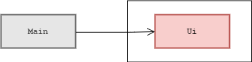
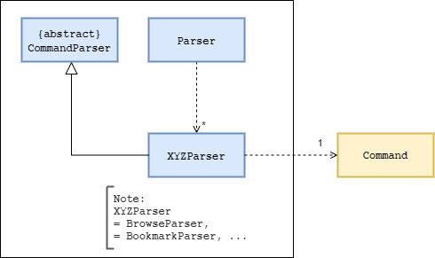
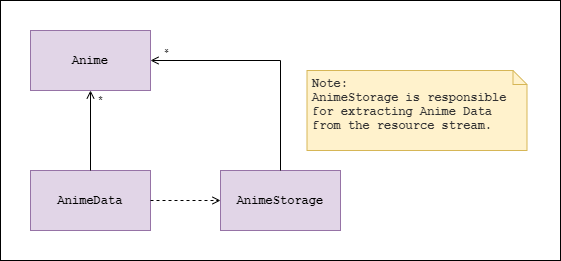
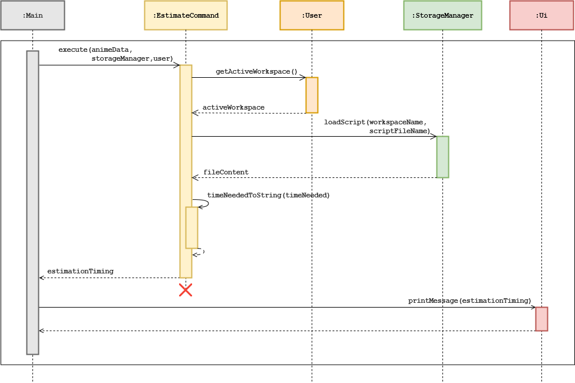
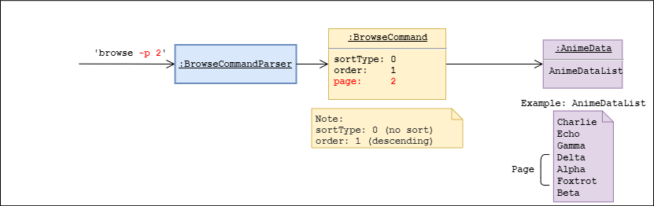
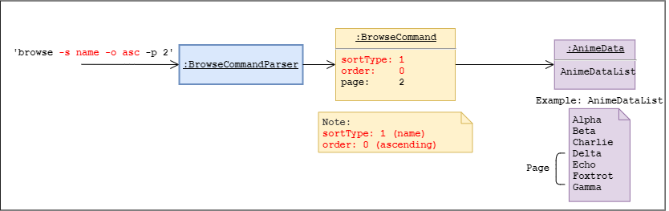
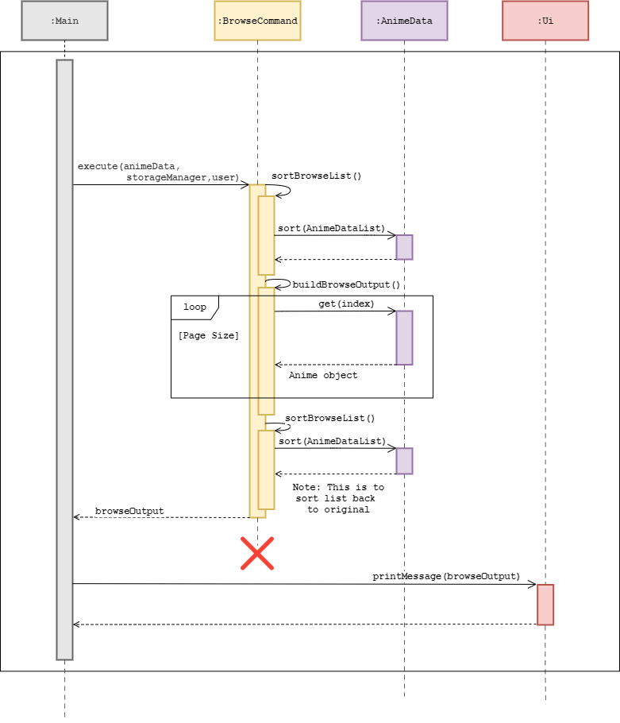
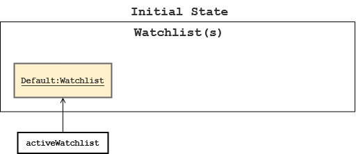
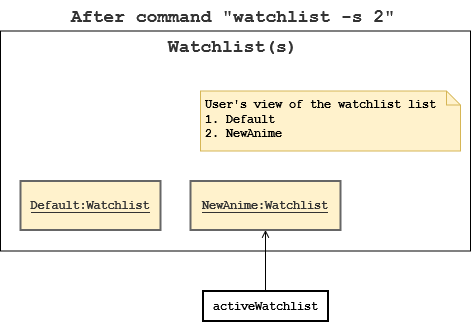
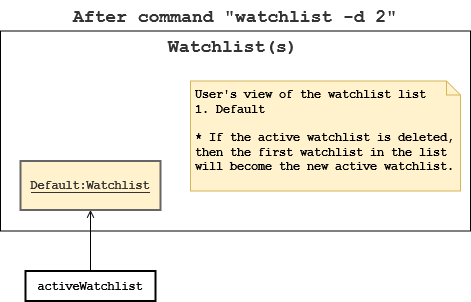

# Developer Guide

## Table of Content
1. [Introduction](#1-introduction)
<br/>&nbsp;1.1 [Purpose](#11-purpose)

2. [Setting up](#2-setting-up)
3. [Design](#3-design)
<br/>&nbsp;3.1 [Architecture](#31-architecture)
<br/>&nbsp;3.2 [UI Component](#32-ui-component)
<br/>&nbsp;3.3 [Parser Component](#33-parser-component)
<br/>&nbsp;3.4 [Command Component](#34-command-component)
<br/>&nbsp;3.5 [AnimeData Component](#35-animedata-component)
<br/>&nbsp;3.6 [User Component](#36-user-component)
<br/>&nbsp;3.7 [Storage Component](#37-storage-component)

4. [Implementation](#4-implementation)
<br/>&nbsp;4.1 [Estimate Feature](#41-estimate-feature)
<br/>&nbsp;4.2 [Browse Feature](#42-browse-feature)
<br/>&nbsp;4.3 [Workspace Feature](#43-workspace-feature)
<br/>&nbsp;4.4 [Watchlist Management Feature](#44-watchlist-management-feature)
<br/>&nbsp;4.5 [Bookmark Feature](#45-bookmark-feature)

5.  [Documentation, Logging, Testing, and DevOps](#5-documentation-logging-testing-and-devops)
<br/>&nbsp;5.1 [Documentation](#51-documentation)
<br/>&nbsp;5.2 [Logging](#52-logging)
<br/>&nbsp;5.3 [Testing](#53-testing)
<br/>&nbsp;5.4 [DevOps](#54-devops)

<br/>

## 1. Introduction
**AniChan** is a command-line application written in **Java 11**. It is written using the Object-Oriented Programming (OOP) paradigm which provides us with means to structure a software program into organized, reusable and reusable pieces of code that makes it good for future improvements and revisions.
<br/>

### 1.1 Purpose

This document is meant for new and current developers of AniChan. It describes the overall architecture design of AniChan, and lays out the current implementation details of our notable features with the rationale and considerations behind each one. It is a living document that would continue to be edited and updated for each major release, and the current edition of this document is intended for the release v2.0.

<br/>

## 2. Setting Up
### Setting up the project in your computer

Ensure that you have the following installed: 
*   JDK 11.
*   IntelliJ IDE (highly recommended).

Firstly, **fork** this repo and **clone** a copy into your computer.

If you plan to use Intellij IDEA: 
1. **Ensure IntelliJ is configured to use JDK 11**.
    1. Click on `Configure` > `Structure for New Projects` > `Project Settings` > `Project`, 
       and ensure the `Project SDK` is using **JDK 11**.
2. **Import the project as a Gradle project**.
    1. Click on `Import Project` and locate the `build.gradle` file and select it. Click `OK`
    2. If asked, choose to `Open as Project` (not `Open as File`).
    3. Click `OK` to accept the default settings but do ensure that the selected version of `Gradle JVM` matches the JDK being used for the project.
    4. The import process could take a few minutes to finish.
3. **Verify the setup**: 
    1. Run the `seedu.anichan.Main` and try a few commands. 
    2. You may want to refer to our [User Guide](UserGuide.md) for the list of commands.

----

### Before writing code
1. **Configuring the coding style**

    If using IDEA, follow this guide [IDEA: Configuring the code style](https://se-education.org/guides/tutorials/intellijCodeStyle.html) to setup IDEA’s coding style to match ours.

2. **Set up CI**

    There is no set up required as the project comes with a GitHub Actions config files, located in `.github/workflows` folder. When GitHub detects these files, it will run the CI for the project automatically at each push to the master branch or to any PR.

3. **Learn the design**

    When you are ready to start writing codes, we recommended that you have a look at AniChan's overall design by reading about it at [AniChan's architecture](DeveloperGuide.md#31-architecture).

<br/>

## 3. Design 

The following section describes the architecture design of **Anichan**. This section starts off by looking at the overall architecture design in a general view, before going into the specific implementation details of the individual features.

<br/>

### 3.1 Architecture
This section will help provide insight to the general overview of Anichan’s architecture.

<br/>


*Figure 1: Architecture Design Diagram*

> :bulb: The images used are stored in the directory: `images/`. If you wish to update a diagram you may replace the images in this folder.

<br/>

The **Architecture Diagram** presented above explains the high-level design of AniChan, and given below is a quick overview of each component involved.

The `Main` class is the starting point of the application and has only one class called `Main`, it is responsible for, 
*   At launch: Initializes the various components in the correct sequence, connects them up with each other, and loads any saved data.
*   At shut down: Shuts down the components and invokes any clean up methods where necessary.

The rest of AniChan consists of 6 components: 
*   `Ui`: Manages the user interface of AniChan.
*   `Parser`: Parses the user input.
*   `Command`: Executes the command.
*   `User`: Manages the workspace(s) and user data.
*   `AnimeData`: Provides data from the anime source file.
*   `Storage`: Reads data from, and writes data to, the hard disk.

<br/>

Below is an overall sequence diagram to help illustrate the general program flow and how the different objects interact with each other.

<br/>

 <br/>
*Figure 2: Overall Sequence Diagram*
 
<br/>

### 3.2 UI Component
 <br/>
*Figure 3: UI Class Diagram*

The UI component consists of a `UI` class that handles all user input and system output. The UI is only dependent on the `Main` class and does not interact directly with other classes ensuring high cohesiveness and separation of roles.

The `Ui` component listens for: 
*   the execution of commands to print the result of the Command.
*   any exceptions thrown to show an error message to the user, instead of a program termination.

<br/>

### 3.3 Parser Component
 <br/>
*Figure 4: Parser Class Diagram*

The `Parser` component consists of a `Parser` class and multiple `XYZParser` each representing a specific command’s parser. The Parser class will first receive a user command from `Main` and will proceed to determine the command type.

Once the command type is known, it will then create the respective `XYZParser` class.

Example: If Browse command was parsed, `Parser` will create `BrowseParser`.

`XYZParser` will then parse the parameter and perform input validation, before creating the Command object to return to `Main`.

<br/>

### 3.4 Command Component
 <br/>
*Figure 5: Command Class Diagram*

The `Command` component consists of different commands represented together as `XYZCommand` which all inherits from the abstract `Command` class. 

Example: The Browse command would be represented by a `BrowseCommand`.

`Main` would utilise the `Command.execute` operation to carry out the execution of the command and retrieve a String output that will contain the successful result of the `Command`. If the `Command` was not successful an exception will be thrown with details of the failure.

<br/>

### 3.5 AnimeData Component
 <br/>
*Figure 6: AnimeData Class Diagram*

The `AnimeData` component is responsible for retrieving offline json data and parsing it into `Anime` objects that will be stored in program memory. The `AnimeData` will manage an ArrayList of `Anime` objects providing AniChan with an interface for the program to retrieve with the source data.

The `AnimeData `component:
*   can retrieve Anime objects using ID.
*   can view detailed  information of each Anime Object.
*   can browse the Anime catalog with sorting algorithms.

<br/>

<!-- @@author ChanJianHao -->
### 3.6 User Component
 <br/>
*Figure 7: User Class Diagram*

The User inherits from the abstract `Human` class and stores the name and gender of the user. It represents the user's interaction with `Workspace` class.

The `User`component: 
*   can provide user information like `name`, `gender`, and `honorific name`
*   stores an array list of type `Workspace`
*   can add, set, and switch between workspaces 

The `Workspace` component:  
*   can allow `User` to create and get the list of `Watchlist` and `Bookmark`.
*   can allow `User` to change his active `Watchlist`.

<!-- @@author -->

<br/>

### 3.7 Storage Component
 <br/>
*Figure 8: Storage Class Diagram*

The `Storage` component consist of `StorageManager` which:
*   can **save** workspace created by the user as a folder.
*   can **save** user, watchlist and bookmark data in `.txt` format and **read it back** using their respective storage class, `UserStorage`, `WatchlistStorage`, and `BookmarkStorage`.
*   can **read** script files that are in `.txt` format using the class `ScriptStorage`.

**AniChan** saved these data as `.txt` files so advanced users will be able to view and manipulate these saved data easily with any available text editor.

<br/>

## 4. Implementation
This section introduces the specific implementation details and design consideration of some features in AniChan.

<br/>

### 4.1 Estimate Feature
The estimate feature aims to provide translators with better estimates on the time needed to translate a script based on their capability. Hence, allowing users to better manage their time and be able to provide clients with much accurate estimation timings.

#### 4.1.1 Current Implementation
The estimate feature is facilitated by `EstimateCommand`. By running the command `estimate` with the relevant arguments, `EstimateParser` will construct `EstimateCommand` which will be used to execute the user's instruction. The command takes in two parameters: 
* `scriptFileName` (mandatory).
* `wordsPerHour` (optional).

<br/>

Given below is an example usage scenario showing how the `EstimateCommand` behaves at each step.

**Step 1:** User executes the command `estimate script.txt -wph 300`. The application invokes `Parser#getCommand()` and because the command type is `estimate`, `Parser` will invoke `EstimateParser#parse()` to parse, validate, and construct `EstimateCommand` with the arguments "script.txt" and "300".

**Step 2:** `EstimateParser` is terminated at this point, and the application invokes `EstimateCommand#execute()` to execute the user's instruction.

**Step 3:** `EstimateCommand` first invokes `User#getActiveWorkspace()` to identify the workspace containing the file, then it invokes `StorageManager#loadScriptFile()`, passing in the arguments `activeWorkspace.getName()` and `scriptFileName`, to read the content of `scriptFileName` in the workspace into the variable `fileContent`.

> :memo: Every workspace is actually a folder in the system.

> :memo: The application assumes that the user has the file placed in the active (currently using) workspace.

<br/>

**Step 4:** If the file has been read successfully, then `EstimateCommand` calculates the estimated time using `fileContent` and `wordsPerHour`, then invokes `EstimateCommand#timeNeededToString()` with the estimated time to convert it into a human-readable format, and finally, returns the result to `Main` for it to be printed via `Ui#printMessage()`.

> :memo: If `wordsPerHour` was not specified, the values 400, 500, and 600 words per hour (average translator's speed) will be used and this will generate 3 estimation timings, unlike the current scenario, only 1 estimation timing will be generated.

<br/>

**Step 5:** `EstimateCommand` is terminated.

<br/>

The sequence diagram presented below depicts the interaction between the components for running the command, `estimate script.txt -wph 300`.
> :memo: The sequence diagram shows the interaction from step 2 onward.



*Figure 9: Sequence Diagram for `estimate script.txt -wph 300`*

<br/>

#### 4.1.2 Design Considerations
This section shows some design considerations taken when implementing the estimate feature.

Aspect: **When should the program read the script file**

| Approach | Pros | Cons |
| --- | --- | --- |
| During command execution **(current design)**. | Easy to implement since `Command` already handle file matters. | Failing file validation during command execution would have wasted some memory resources. |
| During parsing. | No memory resource wasted as the command will not fail due to invalid file. | Decreases cohesion as `Parser` now has to handle file matters on top of parsing matters. |

Having considered both of the alternatives, we have decided to implement the first alternative, **read script file content during command execution** because we do not want to decrease the cohesion of Parser, and we find that the memory resource wasted in the process is a worthy exchange for the cohesion preserved.

<br/>

Aspect: **The way user can specify the script file**

| Approach | Pros | Cons |
| --- | --- | --- |
| Specify file extension **(current design)**. |  Ensures the correct file will be read. | Some users may not know how to identify the file extension. |
| Do not have to specify file extension. | Users can easily specify the file to read. | May read the wrong file due to identical names but different file extension. |

We have decided to the implement the first alternative, **users should specify the file extension in their input** because there is great importance in getting a correct estimation timing, and it far outweighs and compensates for the hassle of entering the file extension, and we believe such mistakes are costly for our users.

<br/>

### 4.2 Browse Feature
The browse feature is a useful feature that will allow users to quickly look through all 
the different anime series available in a browsing fashion. The feature will have several enhancements such 
as sorted browsing to browse in alphabetical or by the rating of the anime.

<br/>

#### 4.2.1 Current Implementation
The `BrowseCommand` is executed by `BrowseCommandParser` after parsing the user input. It will then fetch `Anime` objects matching the parameters specified by `BrowseCommandParser` that are stored in `AnimeData`. It extends the `Command` class and implements the following operations:
*   `BrowseCommand#sortBrowseList()` - Handles any sorting of `Anime` objects. 
*   `BrowseCommand#buildBrowseOutput()` - Creates the output string to be printed to users.
<br/>

These are the two fundamental operations that will carry out the execution of the browse command.

`BrowseCommand` will be constructed with default values. This ensures that even when there is no input provided, 
it can still perform a default browse and return relevant useful information.

Before going any further, please refer to this helpful table of the `BrowseCommand` parameters for reference.

| Attribute | Option | Function          |
| ---       | ---    | ---               |
| order     | 0      | Ascending         |
| order	    | 1      | Descending        |
| sortType  | 0      | No Sort           |
| sortType  | 1      | by name           |
| sortType  | 2      | by rating         |
| sortType  | 3      | back to original  |
| page      | \>= 1  | page number       |

> :bulb: The magic values have already been refactored out into constant variables.

Given below is an example usage scenario to showcase how a `BrowseCommand` will behave at each step. 
This example will utilise a small sample list of `AnimeData` and a page size of `3`.

> :memo: It is set to `20` as default in actual execution. 

**Step 1:** When the user enters the command for `Browse`, the input will be processed and parsed by `parser.java` and 
then further parsed by `BrowseParser.java`.

**Step 2:** Upon completion of parsing and input validation, `BrowseParser.java` will create an executable `BrowseCommand` 
object and return it to `main`.

**Step 3:** Once the `BrowseCommand` object is executed, it will firstly process the `AnimeData` by calling on its `BrowseCommand#sortBrowseList()` operation to identify the order that the list will need to be in (if any).

For this case since it is a default browse operation, there is no sorting performed.

**Step 4:** Now `BrowseCommand` will utilise its `BrowseCommand#buildBrowseOutput()` operation to access all 
`Anime objects within the page window, as shown in the diagram below.

 <br/>
*Figure 10: Browse Default State Object Diagram*

In this example, it fetches the following `Anime` objects.
```text
Charlie
Echo
Gamma
```

If the 2nd page of the list was requested instead with the command `browse -p 2`. 
`BrowseCommand#buildBrowseOutput()` will shift its page window down by 1 page as depicted in the diagram below.

 <br/>
*Figure 11: Browse Next Page Object Diagram*

**Step 5:** At each `Anime` object, it will access its methods to get the relevant information about that anime series and construct a printable result for the user to view.

**Step 6:** After all `Anime` objects in the page window have been retrieved, it will return the printable result back to `BrowseCommand#execute()`. At this point it will utilise `BrowseCommand#sortBrowseOption()` again to reset the `AnimeData` list to its original form if it has been altered.

**Step 7:** Once `AnimeData` has been sorted, it will return the result back to `Main` for printing.

Currently, this result is not very exciting as it is just based on the Anime ID which is assigned randomly by our data source, AniList.

An example scenario would be browsing the 2nd page of a **sorted** list in ascending order.
The only step that would change would be at Step 3, where it will perform sorting of `AnimeData` list. 

 <br/>
*Figure 12: Browse Sorted State Object Diagram*

As you can see, even though the page window is at the same position as the previous command, 
the list is different as it has been sorted.

From this point onwards, the operation will continue as per the steps above but during the final `BrowseCommand#sortBrowseList()` call in step 6. It will perform a sort to reset the list.

Here is the sequence diagram to better illustrate the lifecycle of a browse command.

 <br/>
*Figure 13: Browse Sorted Sequence Diagram*

<br/>

#### 4.2.2 Design Consideration
Here are some various design considerations that was taken when implementing the `browse` feature.

Aspect: **How should the program handle the sorted list**

The first design consideration was how the sorting should be carried out. The main issues here are the time and storage complexity.

| Approach | Pros | Cons  |
| --- | --- | --- |
| 1. Leaving the list unsorted                    | - No complexity and fastest approach  | - List will be unsorted and may cause confusion to users |
| 2. Resorting the list again                     | - The list will be back into its original form before browsing    | - May hinder performance as resorting could take time <br/> - Requires altering of the main list |
| 3. Cloning a duplicate animeData object to sort | - The list will be back to its original form <br/> - The main list will not be affected at all | - Expensive operation that will require large storage and time complexity |

Currently, the 2nd approach is being used with the following rationale. While the 1st approach is the fastest, the consequence of 
leaving the main list unsorted is too great and may produce a lot of uncertain results as well as confuse the user. 
Although the 3rd approach provides the best benefit, its complexity may end up violating the project’s memory limit constraint if the list is large. 
Therefore, the 2nd approach was chosen, as its performance cost outweighs the other approaches cons.  

Aspect: **Should the program use an interactive or static browsing approach**

The second design consideration was how to carry out the page by page browsing as shown above. 
The main issue was the cohesiveness between components.

| Approach | Pros | Cons  |
| --- | --- | --- |
| 1. Interactive browsing, users can `flip` pages and `pick` to view specific anime | - Fluid and seamless browsing session. <br/>- Very good usability. | - Would require `BrowseCommand` to get user input. |
| 2. Static browsing, users specify the page they want to access. | - Completely decoupled from Ui component <br/>- Allows for browse to be more precise in finding what the user wants |  - Not as seamless as the first approach but still usable. |

Though the 1st approach could have created a more authentic browsing feature it would not fit the requirements as well as the 
2nd approach. The 2nd approach allows for more precise browsing of pages means that more experienced users are able to utilise the 
tool quicker and to the same effect as the first approach. As a result, the 2nd approach was chosen as a better fit of the requirements 
and in favour of having an application that is highly object-oriented.

<br/>

### 4.3 Workspace Feature
Similar to a desktop, AniChan has a workspace feature which allows users to organise data in separate ‘containers’ and switch between them to avoid intermixing of information.

<br/>

#### 4.3.1 Add new workspace 
WIP.

<br/>

### 4.4 Watchlist Management Feature
The watchlist management feature aims to provide translators with a simple way to keep track of animes by being able to group animes based on their own criteria. This allows them to stay organized and focused on their work rather than being concerned over management issues.

#### 4.4.1 Current Implementation
The watchlist management feature is facilitated by `WatchlistCommand`. By running the command `watchlist` with the relevant options and arguments, `WatchlistParser` will construct `WatchlistCommand` which will be used to execute the user's instruction. The command takes in three parameters: 
* `option` (mandatory).
* `watchlistName` (mandatory only if the option `-n` was specified).
* `watchlistIndex` (mandatory only if the option `-s` and `-d` was specified).

Below is a table describing the 4 options supported by the `watchlist` command, including the methods (parameters are omitted) invoked for the option.
> :memo: The term **active watchlist** refers to the watchlist that the user is using to add anime into or remove anime from, and this is tracked by the variable `activeWatchlist` in `Workspace`.

| Option | Method | Description |
| --- | --- | --- |
| `-n` | `WatchlistCommand#createWatchlist()` | Creates a new watchlist |
| `-l` | `WatchlistCommand#listAllWatchlist()` | Lists all watchlist in the workspace |
| `-s` | `WatchlistCommand#selectWatchlist()` | Selects a watchlist to be the new active watchlist |
| `-d` | `WatchlistCommand#deleteWatchlist()` | Deletes a watchlist |

<br/>

Given below is an example usage scenario showing how the `WatchlistCommand` behaves at each step. In this example, we will look at the watchlist creation process.



*Figure 14: WatchlistCommand Initial State*

**Step 1:** User executes the command `watchlist -n NewAnime`. The application invokes `Parser#getCommand()` and because the command type is `watchlist`, `Parser` will invoke `WatchlistParser#parse()` to parse, validate, and construct `WatchlistCommand` with the arguments "-n" and "NewAnime".

**Step 2:** `WatchlistParser` is terminated at this point, and the application invokes `WatchlistCommand#execute()` to execute the user's instruction.

**Step 3:** `WatchlistCommand` first invokes `User#getActiveWorkspace()` to identify the workspace to add the new watchlist. The `Workspace` instance retrieved is used to initialise the variable `activeWorkspace`.

**Step 4:** According to the instruction "-n", `WatchlistCommand#createWatchlist()` is invoked. Then, `activeWorkspace.getWatchlistList()` is invoked to initialise the variable `watchlistList`. 

**Step 5:** A `Watchlist` object is then constructed with the name "NewAnime" and an empty `ArrayList<Integer>` object. It is then validated, and if no exception was thrown, it is added to `watchlistList`, and `StorageManager#saveWatchlist()` is invoked to save the updated `watchlistList`.

> :memo: The validation checks ensure the watchlist name is unique in `watchlistList` and the name does not exceed 30 characters.

> :memo: The details of all `Watchlist` object for a workspace will be saved in the file "watchlist.txt" in the workspace folder.

<br/>

**Step 6:** `WatchlistCommand` is terminated.


*Figure 15: WatchlistCommand After Step 6 State*

<br/>

All the other options in the watchlist command also follows a similar execution process. The following diagrams will continue from step 6, and it will show you how the state of the application changes as it continues to execute the select and delete option.
> :memo: The list option (`-l`) is not shown as there will not be any change in the application state after its execution.

The user executes `watchlist -s 2` to change his active watchlist to the second watchlist (“NewAnime”) in the list.



*Figure 16: WatchlistCommand After Select State*

<br/>

The user executes `watchlist -d 2` to delete the second watchlist (“NewAnime”) in the list.



*Figure 17: WatchlistCommand After Delete State*

<br/>

The sequence diagram presented below depicts the interaction between the components for running the command, `watchlist -n NewAnime`.
> :memo: The sequence diagram shows the interaction from step 2 onward.

> :memo: The other options (`-l`, `-s`, `-d`) follow a similar process, only the list and select option does not interact with `StorageManager`.


*Figure 18: Sequence Diagram for `watchlist -n NewAnime`*

<br/>

#### 4.4.2 Design Considerations
This section shows some design considerations taken when implementing the watchlist management features.

Aspect: **Saving watchlist data**

| Approach | Pros | Cons |
| --- | --- | --- |
| After each command execution **(current design)**. | User don't have to worry about lost data if their application or system crashes midway. | Application might slow down when the data grows large. |
| When the user exits the program. | Saving is more efficient and could improve performance. | User may lose their data if the application or system crashes midway. |

Having considered both of these alternatives, we have decided to save watchlist data **after each command execution** because users may work on the application for long period and unexpected events can always happen. Losing work data can also be a frustrating and costly mistake to translators especially if these data are important.

<br/>

### 4.5 Bookmark Feature
Overview of the different features provided by bookmark
The `bookmark` feature aims to provide the user with the ability to create shortcuts to anime they wish to track. This feature further provides tools to monitor the progress of a series and make informative notes.

<br/>

#### 4.5.1 Current Implementation

The Bookmark class uses three ArrayList to store bookmark entries of the user, these arraylists maintain information about the anime index, episode and notes. The synchronisation between arraylist is required so that it enables easy retrieval of bookmark information using the bookmark index on the three arraylist.

 <br/>
*Figure 19: Bookmark Class Diagram*

`BookmarkCommand` is instantiated by `BookmarkParser`, and requires a mandatory BookmarkAction. With the BookmarkAction the parser will determine the required field for the BookmarkCommand. Below table shows the required field for each action:

| Bookmark Command | Bookmark Action | Required field |
|---|---|---|
| Add              | a               | Anime ID       |
| Delete           | d               | Bookmark ID    |
| List             | l               | Not required |
| Episode          | e               | Bookmark ID, Episode |
| Note             | n               | Bookmark ID, Note |
| Remove Note      | r               | Bookmark ID, Note ID |
| Info             | i               | Bookmark ID |

<br/>

Given below is the example usage scenario and how the `Bookmark` command behaves at each step.

> :bulb: The command is using one-based indexing while the program stores and recognises the zero-based indexing. The following example will use one-based to be consistent with the command. 

**Step 1:** User inputs command `bookmark`,  the application then calls `Parser#getCommand()` and passes the command to it.

**Step 2:** `BookmarkParser` extracts “Bookmark Action” from the command, and based on the command type, it will determine the respective required field. The `BookmarkParser` is responsible for validating the input parameters and will throw an `AniException` when encountering unrecognised inputs.

For example: `bookmark 2 -e 5`, the parser will create `BookmarkCommand` and call the method setBookmarkAction(“e”), setBookmarkIndex(2) and setBookmarkEpisode(5).

**Step 3:** The application calls `BookmarkCommand#execute()` and the command will use the `BookmarkAction` to do a corresponding validation check on the field before calling the  Bookmark Operations.

Below is a list of bookmark operations:
*   `Bookmark#addAnimeBookmark()`: Adds the `Anime` index provided into the bookmark list.
*   `Bookmark#getListInString()`: List all entries within the `Bookmark` using the `Bookmark` index together with the `Anime` name.
*   `Bookmark#deleteAnimeBookmark()`: Remove the `Bookmark` index provided from the bookmark list.
*   `Bookmark#editBookmarkEpisode()`: Edit the current episode for a Bookmark entry .
*   `Bookmark#addNote()`: Add a note for a Bookmark entry.
*   `Bookmark#removeNote()`: Remove a note from a Bookmark entry.
*   `Bookmark#getAnimeInfoFromBookmark()`: Retrieve the anime info on the anime id kept at the specified bookmark entry.
*   `Bookmark#getBookmarkEpisode()`: Retrieve the episode field for a Bookmark entry.
*   `Bookmark#getNoteInString()`: Retrieve notes in a list within the specified bookmark entry.

**Step 4:** The user executes `bookmark -a 430` command to add the anime id: 3 into the bookmark. `Bookmark#addAnimeBookmark()` will then add the anime index to the ArrayList within the bookmark.

 <br/>
*Figure 20: Bookmark Entry After Add*

> :memo: The table shows the three ArrayList objects in the column with the bookmark id. When adding a new anime id into the bookmark, the bookmark will initialise the anime episode to be 0 together with an empty note object.

**Step 4.5:** The user executes `bookmark -a 1` and `bookmark -a 410` to add anime id 1 and 410 to the bookmark.

 <br/>
*Figure 21: Bookmark Entries with more Add*

The following sequence diagram shows how the `Add Bookmark` operation works:

 <br/>
*Figure 22: Bookmark Add Command Sequence Diagram*

**Step 5:** The user executes `bookmark -l` command to list all anime within the bookmark. `Bookmark#getListInString()` will use the Anime index stored in the bookmark list and retrieve the anime name from AnimeData, the method then returns the bookmark index with the anime name.

```text
Listing all anime in bookmark:
	1. To Heart 2
	2. Cowboy Bebop
	3. InuYasha the Movie 2: The Castle Beyond the Looking Glass
```

**Step 6:** The user executes `bookmark -d 1` command to delete the bookmark entry at bookmark id: 1. `Bookmark#deleteAnimeBookmark()` will then remove the Bookmark index from the `Bookmark`.

 <br/>
*Figure 23: Bookmark Entries After Delete*

> :memo: The ArrayList comes with an inbuilt function to enable easy deletion at index, but the bookmark index of subsequent entries will decrease.

**Step 7:** The user executes `bookmark 1 -e 5` command to edit the episode for the first bookmark entry. `Bookmark#editBookmarkEpisode()` will change the episode field for that bookmark entry.

 <br/>
*Figure 24: Bookmark Entries After Edit Episode*

**Step 8:** The user executes `bookmark 1 -n Schedule push back` command to add a note for a bookmark entry. `Bookmark#addNote()' will then add a note to the bookmark entry at bookmark id:1.

 <br/>
*Figure 25: Bookmark Entries After Add Note*

**Step 9:** The user executes `bookmark 1` command to view all information of the first bookmark entry. The command will use `Bookmark#getAnimeInfoFromBookmark()` to retrieve the detailed anime info for the anime id at that bookmark, `Bookmark#getBookmarkEpisode()` for the tracked episode by the user and `Bookmark#getAnimeNotesFromBookmark()` will retrieve all notes in a list format. With all the relevant information on the bookmark entry, the result will be displayed to the user (Figure 26: Bookmark Entries After Edit Episode).

```text
Here is the information for that anime.
Index: 1
Name: Cowboy Bebop
Episodes: 26
Release Date: 03/Apr/1998
Rating: 86
Genre: [Action, Adventure, Drama, Sci-Fi]

Current Episode: 5

Notes for anime:
1. Schedule push back
```

**Step 10:** The user executes `bookmark 1 -r 1` command to remove a note from a bookmark entry. `Bookmark#removeNote()` will remove the note id:1 from the first bookmark entry. The resulting state of the remove note command will look exactly the same to the state before the note was added.

 <br/>
*Figure 26: Bookmark Entries After Edit Episode*

<br/>

#### 4.5.2 Design consideration
This section describes the various design considerations taken when implementing the `Bookmark` feature.

Aspect: **How should the bookmark entries be kept**

The first design consideration was the data structure on how to bookmark entries should be maintained. The main issue here was the cohesiveness between the `bookmark` object and the `workspace`.

| Approach | Pros | Cons  |
| --- | --- | --- |
| 1. Keep only the anime index information within the bookmark **(Current)**            | - Easy to reference objects within ArrayList using its index and it is easy to implement | - Require to synchronise the three ArrayList so the same index reference the components of the same bookmark entry |
| 2. Use a `BookmarkManager` to handle bookmark features                  | - Do not need to maintain multiple Arraylist    | - One extra layer of unnecessary abstraction (nesting), while introducing more coupling and dependency.  |

<br/>

Aspect: **How should bookmark entries keep anime information**

The second design consideration was how to keep the reference to the anime object. The main issue here was the storage and duplication of data.

| Approach | Pros | Cons  |
| --- | --- | --- |
| 1. Usage of three ArrayList to store anime index, Episode, and Notes **(Current)**            | - Easy to add and delete, which also simplifies the information to keep in offline storage. | - Bookmark Commands has to communicate with AnimeData for anime-related functionalities. |
| 2. Keep the entire anime object in Bookmark                  | - Do not need to reference AnimeData for anime information    | - One extra layer of unnecessary abstraction (nesting), also introducing more coupling and dependency  |

<br/>

## 5. Documentation, Logging, Testing, and DevOps
This section details the documentation, logging, testing and dev-ops setup used in this project as well as information on how to use them.

<br/>

### 5.1 Documentation
We use **Jekyll** to manage documentation. We recommend that you document your features implementation and code changes so that other developers are aware of its architecture.

The `docs/` folder stores the documentation of this project. You can learn more about how to setup and maintain the project website at with [this guide](https://se-education.org/guides/tutorials/jekyll.html).

<br/>

### 5.2 Logging
We encourage the use of logger in this project as they provide deeper insights than error messages which can greatly help developers identify bugs and simplify their logging process.

We are using `java.util.logging`  package for logging. The logger can be accessed using the  `AniLogger`  class. 

`AniLogger` is used to manage the logging levels and logging destinations. Based on the default setting, logs will be written to both console and file `data/AniChan.log`.

The  `Logger`  for a class can be obtained using  `AniLogger.getAniLogger(Class)`  which will log messages according to the specified logging level.

We use the following log levels:
*   `Level.SEVERE` : A critical failure, which prevents normal execution of the program.
*   `Level.WARNING`: Indicates a potential problem, but can proceed with caution.
*   `Level.INFO`: General noteworthy information of the program.

<br/>

### 5.3 Testing
Testing is integral to the development of a reliable software. Before making a pull request, please ensure that all tests pass. You are recommended to write tests as you add new code to the program.

<br/>

#### 5.3.1 Running Tests
There are primarily 2 ways to run the tests.

**Method 1: Using IntelliJ**
*   To run all tests, right-click on the `src/test/java` folder in the project panel and choose `Run Tests`.
<br/>

**Method 2: Using Gradle**
*   Open a terminal and navigate to project directory, run command `./gradlew clean checkstyleMain checkstyleTest test`.

<br/>

### 5.4 DevOps

`Coming soon`
