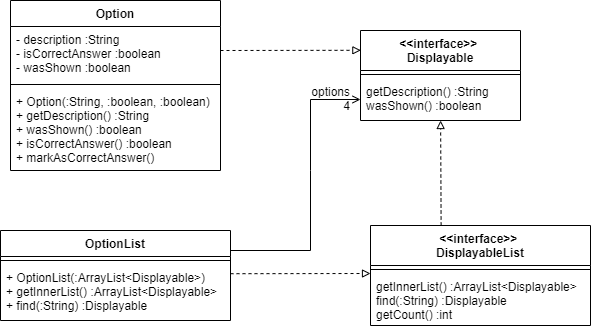

# Developer Guide

## Design & implementation

{Describe the design and implementation of the product. Use UML diagrams and short code snippets where applicable.}
### Logic Component

##### Design

1. After constructing a new MenuParser() in the `Eduke8` class, the parseCommand() method is used to parse the 
   user command.
2. This results in a `Command` object, which is executed by `Command` class itself, using the execute() method.
3. The `Ui` object in the `Command` object is used to display the requested information, or to display the required task 
to be completed as per the user input.
   
Below is the sequence diagram for how the Parser component of `Eduke8` works with commands to show output to the user.

#### Command parsing feature

##### Implementation

The command parsing feature is our program’s way of reading the user’s input into the command line. It makes use of a 
single method parseCommand that identifies what command the user is calling for and then calls the command. There are 
two parsers in our program that implements a single Parser interface. One parser is for choosing menu options and is 
named `MenuParser`. The other parser is used during quizzes, in order to answer questions or request for hints, and is 
called `QuizParser`. Given below is an example usage scenario of how the command parsing feature works at each step, 
when the user types in input to get help in order to see what commands are available to the user.

Step 1. The user launches the program for the first time. The parser will be initialised and awaiting the user’s input 
        to proceed.
        
Step 2. The user types in help into the command line interface and presses enter. This user input “help” is stored as 
        a string and is put into the parseCommand() method as a parameter, together with the topic list. This topic 
        list is not relevant to the help command for now.
        
Step 3. The user input string is subjected to the trim() and split() functions of a string in the Java libraries in 
        order to remove redundant spaces around the input, and to discern the number of words in the input. The split() 
        function uses a blank space string, “ “, as the delimiter to split the string into its individual components.
        
Step 4. Each subsequent string separated by a space is stored in a string array named commandArr. The 0th index of the 
        commandArr array is the first word, the 1st index is the second word, and so on. In this case there is only one 
        word stored in the array, at the 0th index, which is “help”.
        
Step 5. The string at the 0th index is then used in a switch statement, where each case represents the different menu 
        options available. As such, the contents of the case with reference “help” is run, which is a return statement 
        containing a new HelpCommand(). This leads to the execution of the `help` command.
        
### Loading Data

Data is loaded automatically from JSON files in the data folder. This is mainly facilitated through the `TopicsStorage` 
class which handles accessing the file as well as converting from JSON into `Topic`, `Question` and `Option` objects.

Given below is an example usage scenario of loading in two topics with two questions each.

When the user launches the app, the main program will initialize a `TopicsStorage` object and call the `load` method 
which will return a `TopicList` object. The following sequence diagram shows how the load operation works:

### Class Component 

#### Option and OptionList Class 

The `Option` and `OptionList` classes implements the `Displayable` and `DisplayableList` interfaces respectively. 
The `Option` object stores one option of a question while the `OptionList` object stores all 4 options of the same 
question. The class diagram below illustrates the structure of both classes. 

### User Interface 

#### Implementation 

The `Ui` class handles all the interactions with the users. It reads the input from the users and prints out replies to 
the users. It is the point of communication between EDuke8 and the users. 

An example is provided below to illustrate how the `Ui` class prints out the starting page of the quiz for 
the user to comprehend. 

As the user starts the quiz, the `Ui` class will print out the quiz page to show that the quiz has started. 
The user inputs the number of questions that he wants to answer and also the topics that he wants to be tested on. 
The `Ui` will go through printStartQuizQuestions() to print out the number of questions that the user has chosen. 
Afterwards, the `Ui` will go through printStartQuizTopics() to print out the topics that the user has chosen. 
The `Ui` echos back both information to ensure that EDuke8 has received the correct information from the user. 

### Design of the Quiz system

To start a quiz in E-Duke-8, the user will have to indicate the number of questions that he wants to attempt, as well as the topic to get the questions from. Thereafter, questions will be shown to the user one by one until all them are attempted. 

The Class Diagram given below explains the high-level design of the Quiz system in E-Duke-8. Given below it is a quick overview of each component.

An object of `SingleTopicQuiz` class represents an instance of the quiz in E-Duke-8. Its `numberOfQuestions` attribute and `Topic` object correspond to the user's specified number of questions and topic for the quiz respectively.

The `startQuiz(:Ui)` method call from the `SingleTopicQuiz` object initializes an object of `QuizQuestionsManager` by passing into it `numberOfQuestions`, as well as an ArrayList of questions from the `Topic` object. The `QuizQuestionsManager` object will then randomly select `numberOfQuestions` questions from the topic the user has chosen, using its `setQuizQuestions(:int, :ArrayList<Displayable>)` method. 

Thereafter, by making use of `QuizQuestionsManager`'s `getNextQuestion()` and `areAllQuestionsAnswered()` method calls, the `goThroughQuizQuestions(:Ui, :QuizQuestionsManager)` will loop through the questions until the user answers all of them on the command line interface.

### Implementation of QuizQuestionsManager

As mentioned in the section on the design of the quiz system, a `QuizQuestionsManager` object will randomly select the indicated number of questions from the list of questions in the `Topic` object, and these will form the quiz questions for the user.

The Sequence Diagram below shows how `QuizQuestionsManager` achieves this for the scenario where the user indicates that he wants to attempt 5 questions from the topic on OOP, which translates to the `setQuizQuestions(5, questionsInTopic)` call:

`nextInt(5)` is a method call to an object of the `Random` class. It returns a random integer between 0 (inclusive) and the number passed in as argument, 5 in this scenario, exclusive. 

To determine if randomQuestionIndex is not selected before, an integer ArrayList is initialized to record all the selected integers. By checking against this collection of integers, it can be determined if a currently selected integer is repeated or not, and if it is, no question will be added for that iteration of the loop. 

An ArrayList of `Question` objects stores all the selected questions meant for the quiz.

## Product scope
### Target user profile

CS2113/T Students

### Value proposition

Help CS2113/T students learn and understand software engineering and OOP principles through a gamified platform and 
enhance their learning experience. Consolidate key concepts for easy revision.

## User Stories

|Version| As a ... | I want to ... | So that I can ...|
|--------|----------|---------------|------------------|
|v1.0|new user|quickly see what the software has to offer|understand how to use the app|
|v1.0|new user|answer given questions|start testing myself immediately|
|v1.0|long-time user|get different questions each time|repeatedly test my understanding for the particular topic|
|v1.0|busy user|test myself on concepts using short, targeted quizzes|confirm my understanding of concepts|
|v1.0|user|get a hint for the question in the quiz|I can think about the question from a different angle|
|v1.0|user|see what the available topics are|navigate around the app effectively|
|v1.0|user|select the number of questions to do in the quiz|manage the workload and time spent on the quiz|
|v2.0|slow but hardworking user|see the explanations provided in the quiz|learn from my mistakes and revise|
|v2.0|busy, lazy user|take note of key concepts|refer to it easily at a later time|
|v2.0|frequent disorganized user|view the percentage of error in each topic|tell how well I understand the content|

## Non-Functional Requirements

{Give non-functional requirements}

## Glossary

* *glossary item* - Definition

## Instructions for manual testing

{Give instructions on how to do a manual product testing e.g., how to load sample data to be used for testing}
