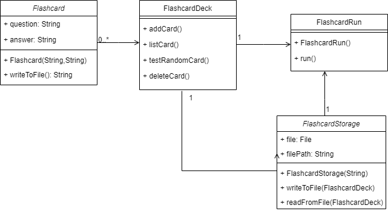

# Developer Guide

## Design & implementation

**Bookmark Component**

This bookmark section consists of how the bookmark feature is implemented. 
The bookmark feature is implemented similarly as the main architecture, however, 
in a smaller scale and a more bookmark-specific way. Figure 1 illustrates the general overview, 
the associations and the multiplicity of the bookmark classes.

[uml diagram]

API: java.bookmarkRun

The bookmark component consists of six major classes: `BookmarkRun`, `BookmarkStorage`, `BookmarkUi`, 
`BookmarkCategory`, `BookmarkList` and `BookmarkParser`. 
As shown in figure 1, `BookmarkRun` is 
* The main class to be called when the bookmark mode is accessed.
* The main class to access other bookmark classes.

Given below, Figure 2, is the sequence diagram of how the classes interact with each 
other when bookmark mode is accessed from the main function.

[uml diagram]

The bookmark component has two modes: the main bookmark mode and the category mode. 
As shown in Figure 2, when `BookmarkRun` is called, 
`BookmarkParser` will be called and return a `BookmarkCommand`. 
Afterwards, `BookmarkRun` will then call `executeCommand` in `BookmarkCommand` which executes 
the intended actions 
Then, it will call `getCategorymode` to get the current mode the user is in. 

**Bookmark Implementation**

A more detailed explanation of `BookmarkCommand`, `BookmarkCategory` and `BookmarkList` will be 
shown below. `BookmarkUi` and `BookmarkStorage` follow the same design implementations as the main 
architecture. The below figure shows the command classes available and they are called based on the 
`BookmarkParser` class as illustrated in Figure 2. 

Figure 4 shows a more detailed sequence diagram of how the `BookmarkCategory`, `BookmarkCommand` 
and `BookmarkList` interacts with each other for the scenario when the user input an `AddLinkCommand` 
in Bookmark mode.

**Flashcard Component**

This section will describe in detail how the flashcard feature is implemented.

The above diagram looks at the overall structure of how the flashcard component is being implemented. 
This component is split into 4 different classes, their associations and multiplicity as explained in 
the above Figure 7. As shown in Figure 7, the main class `FlashcardRun` will be accessed when the 
flashcard mode is called in `StudyIt` Class. `FlashcardRun` class is associated with `FlashcardStorage` 
class that is used to store data in .txt file and `FlashcardDeck` class which contains any number of `Flashcards`.

**Flashcard Implementation**

With reference to Figure 8, when `FlashcardRun` is first initialised by `StudyIt`, it will construct 
the `FlashcardDeck` class. As an add card command is given by the user, `FlashcardRun` will take in the 
command and call `addCard()` method in `FlashcardDeck` which constructs a new Flashcard object and stores 
it inside the `FlashcardDeck` object.The `addCard()` function will then show the user the question and 
answer of the flashcard that have been created.

## Product scope
### Target user profile

{Describe the target user profile}

### Value proposition

{Describe the value proposition: what problem does it solve?}

## User Stories

|Version| As a ... | I want to ... | So that I can ...|
|--------|----------|---------------|------------------|
|v1.0|new user|see usage instructions|refer to them when I forget how to use the application|
|v2.0|user|find a to-do item by name|locate a to-do without having to go through the entire list|

## Non-Functional Requirements

{Give non-functional requirements}

## Glossary

* *glossary item* - Definition

## Instructions for manual testing

{Give instructions on how to do a manual product testing e.g., how to load sample data to be used for testing}
