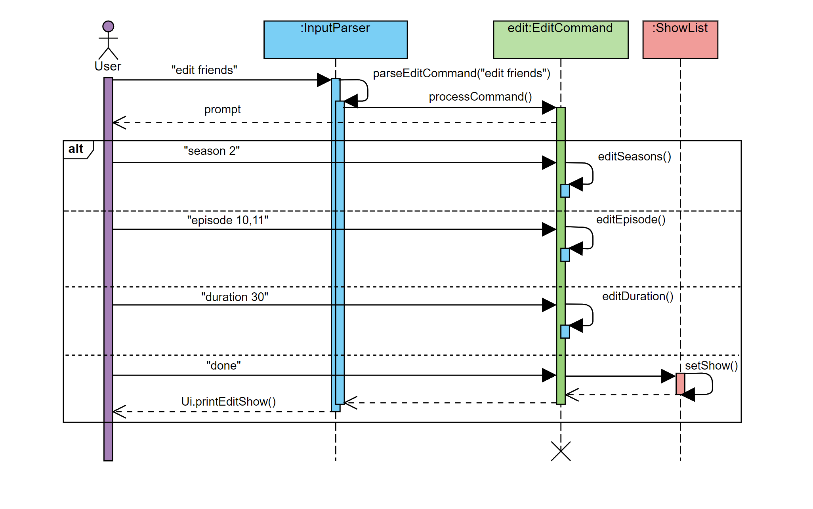
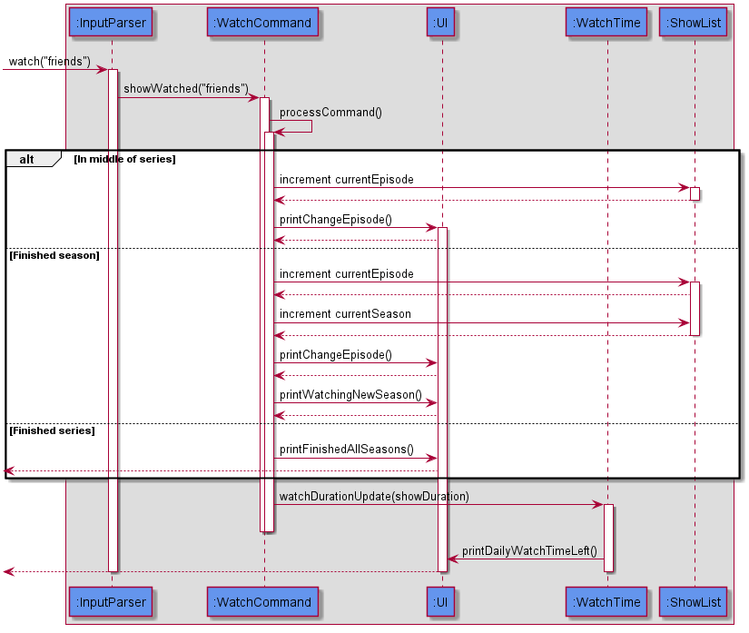

# WatchNext Developer Guide

- [WatchNext Developer Guide](#watchnext-developer-guide)
  - [1. Introduction](#1-introduction)
    - [1.a Purpose](#1a-purpose)
    - [1.b Scope](#1b-scope)
  - [2. Setting up](#2-setting-up)
    - [2.a Prerequisites](#2a-prerequisites)
    - [2.b Setting up the project in your computer](#2b-setting-up-the-project-in-your-computer)
    - [2.c Verifying the setup](#2c-verifying-the-setup)
    - [2.d Before Writing Code](#2d-before-writing-code)
  - [3. Design](#3-design)
  - [4. Implementation](#4-implementation)
    - [AddCommand](#addcommand)
    - [EditCommand](#editcommand)
    - [DeleteCommand](#deletecommand)
    - [AddReview Command](#addreviewcommand)
    - [ChangeRatingCommand](#changeratingcommand)
    - [DeleteRatingCommand](#deleteratingcommand)
    - [ChangeReviewCommand](#changereviewcommand)
    - [DeleteReviewCommand](#deletereviewcommand)
    - [WatchCommand](#watchcommand)
    - [UpdateShowEpisodeProgressCommand](#updateshowepisodeprogresscommand)
    - [UpdateShowSeasonCommand](#updateshowseasoncommand)
    - [UpdateTimeLimitCommand](#updatetimelimitcommand)
    - [Storage](#storage)
    - [Errorhandling](#error-handling)
  - [5. Documentation](#5-documentation)
  - [6. Testing](#6-testing)
  - [7. Dev Ops](#7-dev-ops)
  - [Appendix A: Product Scope](#appendix-a-product-scope)
  - [Appendix B: User Stories](#appendix-b-user-stories)
  - [Appendix C: Non-Functional Requirements](#appendix-c-non-functional-requirements)
  - [Appendix D: Glossary](#appendix-d-glossary)
  - [Appendix E: Instructions for Manual Testing](#appendix-e-instructions-for-manual-testing)

   
## 1. Introduction

### 1.a Purpose

This guide aims to provide information for you: the developers, testers and future contributors of **WatchNext** 
such that you will have an easy reference for understanding the features implemented in **WatchNext**.

### 1.b Scope

The guide outlines the architecture and design decisions for the implementation of WatchNext.The intended audience of this 
document are the developers, testers and future contributors of WatchNext.
   

## 2. Setting up
This section will show you the requirements that you need to fulfill in order to quickly start contributing to this project in no time!

### 2.a Prerequisites

1. **JDK `11`**  

[NOTE]
The `WatchNext.jar` file is compiled using the Java version mentioned above. +

2. **IntelliJ IDEA** IDE

[NOTE]
IntelliJ has Gradle and JavaFx plugins installed by default.
Do not disable them. If you have disabled them, go to `File` > `Settings` > `Plugins` to re-enable them.

### 2.b Setting up the project in your computer
 
 **Fork** this [repo](https://github.com/AY2021S1-CS2113T-W12-3/tp), and clone the fork to your computer.
 
1. Open IntelliJ (if you are not in the welcome screen, click `File` > `Close Project` to close the existing project dialog first)

2. You should set up the correct JDK version for Gradle

3. Click `Configure` > `Project Defaults` > `Project Structure`

4. Click `New...` and find the directory of the JDK

5. Click `Import Project`

6. Locate the `build.gradle` file and select it. Click `OK`

7. Click `Open as Project`

8. Click `OK` to accept the default settings

9. Open a console and run the command `gradlew processResources` (Mac/Linux: `./gradlew processResources`). It should finish with the `BUILD SUCCESSFUL` message. +
This will generate all the resources required by the application and tests.

### 2.c Verifying the setup

1. You can run `Duke` and try a few commands.

2. You can also run tests using our instructions for manual testing to explore our features.

### 2.d Before Writing Code
 
 1. Set up CI
 
 This project comes with a GitHub Actions config files (in `.github/workflows` folder). When GitHub detects those files, it will run the CI for your project automatically at each push to the master branch or to any PR. No set up required.
 
 2. Learn the design
 
 When you are ready to start coding, we recommend that you get some sense of the overall design by reading about WatchNext’s architecture [here](#3-design).

## 3. Design
WatchNext was designed drawing from the ideas of the __Event-driven architectural style__.  
 The Ui and the Scanner components work together as event emitters. The `Ui` class prompts the user for input, and the scanner is ready to receive the input. Should the format of the input be unrecognised or incorrect, the `Ui` class guides the user with prompts to rectify the errors. 
 Events will be passed onto the `InputParser` which serves as the dispatcher. The `InputParser` uses various string manipulation operations from the `StringOperations` class to recognise the intention of the user input. After recognising the command, the input will be parsed, and the command information will be passed onto the various command classes for processing. The `InputParser` communicates the events to event consumers which are the command classes in this case.  
 All available operations will be processed by the classes in the commands package. Every command class, like the `AddCommand` class, inherits from the `Command` class. Each individual command class is able to contain all the processing required for each command with the inputs passed in during the initiation of each command object.  
 During runtime, the show related data is all stored in the `ShowList` class. The data is accessible and can be modified statically by all the command classes. The `ShowList` contains `Show` objects which describes the attributes of a show. 
 Certain commands relating to the monitoring of the amount of time users spend watching shows depend on information from the `WatchTime` class. The class tracks the date and time remaining for the users to watch shows for the day. The time limit will be set by the user.  
 On the initiation of WatchNext, the `Storage` object will be initiated and retrieves any user data that has been saved from previous runs. The data is stored in plain text and can be manually edited by advanced users. The data is stored in `data/showList.txt`. After the execution of every command, the `Storage` object calls upon the save command to automatically update the save data file. The commands relating to saving and loading data can be accessed from the `SaveState` interface. 
 Throughout the lifespan of the program, various errors may occur. The `ErrorHandling` class stores the various errors that could occur. The expected errors usually stem from invalid user input or Input Output (IO) errors during file loading. The `Ui` class informs the users of the errors detected and suggests actions for rectification.  

## 4. Implementation

### AddCommand

The `add` command allows users to add a new show which they are watching to the `ShowList`. It is invoked by the 
inputParser.

Given below is an example of usage scenario of how the add command behaves at each step

**Step 1**

* The user types in `add friends 2 10,10 30` , adding the show to the `Showlist` . The details added include the title
of the show, the number of seasons of the show, the number of episodes in each season(separated by the comma) and 
the duration of each episode. 

The InputParser class calls the parseInput method to parse the command.

**[NOTE]** 

ArrayOutOfBounds and NullPointer exceptions are thrown when the number of arguments entered by the user is incorrect.

**Step 2**

* The AddCommand class calls the AddCommand method which then creates a new instance of the Show class.

**Step 3**
* The user input is tokenized by the AddCommand method into 4 seperate parameters. (Title,Number of seasons,Number of
episodes for each season respectively,Duration of an episode)

**Step 4**

A new Show instance is created with the 4 parameters created in step 3.

**Step 5**

The Show is added to the Showlist.

**Step 6** 

The changes will be reflected to the user. At the same time, the changes will be saved into the showList.txt file.

### EditCommand

The `edit` command allows the user to change the details of each show that they are watching after they have added the
show. It is self-contained, it includes its own parser and methods which prompts the user to change any parameter they 
wish, after the user enters `done`, the `edit` command replaces the old entry with the updated one.

Given below is an example of usage scenario of how the edit command behaves at each step and a sequence diagram to
illustrate the steps in a visual form.

**[NOTE]** 

NullPointerException will be thrown when show entered by user is not found in the showlist.

 
   
*Figure 1: Sequence Diagram for Edit Command*

**Step 1**

* The user types in `edit friends` , where the show `friends` already exists int the showlist.

**Step 2**

* The processCommand method is called. The processCommand method will retrieve the existing show object from the showlist,
and make a copy of it.
* Then the system will prompt the user to edit the name,season,episodes or the 
duration (of an episode) respectively. 

**Step 3**

* The process command parses each line of the user input.
* The EditCommand class then calls the corresponding method, e.g. `editDuration()` to make the corresponding changes to the copy.

**Step 4**

* The user inputs `done`, and the copy of the show object is inserted into the showlist, replacing the old object.

### DeleteCommand
  
The `delete` command takes in 1 parameter, the show to be deleted. Following that, the command proceeds to delete the
show from the Showlist. The 'delete' is invoked by the InputParser Method parseDeleteCommand.

Given below is an example usage scenario and how the DeleteCommand Class behaves at each step.

**Step 1**

* The user types in `delete friends` , assuming that friends has been added by the user beforehand.
The parseInput method in InputParser class is called to parse the command.

**[NOTE]** 

Customised NullPointerException will be thrown when show entered by user is not found in the show list

**Step 2**

* A new instance of the DeleteCommand class is called and the command is returned to the main program. 
The delete method in DeleteCommand class is called.

**Step 3**

The delete method retrieves the show to be deleted from the ShowList

**Step 4**

Deletes the show from the ShowList

**Step 5**

The changes are reflected to the user. At the same time, the changes will be saved to the showList.txt file

### AddReviewCommand

The `addreview` command takes in 2 parameters, the show which review is to be updated and the review to be updated
to the show. The `addreview` command is invoked by the InputParser method parseAddReviewCommand.

**Step 1**

The string is tokenised into separate words

**Step 2**

The corresponding show is retrieved from the show list

**Step 3**

The rating of the show is updated

**Step 4**

The review of the rating is added to the show

**Step 5**

Reflect the changes back to the user. At the same time, saving the changes into the showList.txt file

### ChangeRatingCommand
  
The `changerating` command takes in 2 parameters, the show which rating is to be changed and the new rating to be
updated to.

The command changes the rating of a desired show

Given below is an example usage scenario and how the ChangeRatingCommand Class behaves at each step.

**Step 1**

* The user types in `changerating friends 3` , assuming that friends has been added by the user beforehand.
The parseChangeRatingCommand method in the InputParser class is called to parse the command.

**[NOTE]** 

Customised IndexOutOfBoundsException will be thrown if user enters a rating with value less than 0 or more than 10. 

Customised NullPointerException will be thrown when show entered by user is not found in the show list

**Step 2**

* A new instance of ChangeRatingCommand class is created and the command is returned to the main program. 
The changeRating method in ChangeRatingCommand class is called.

**Step 3**

The changeRating method starts with retrieving the show from the ShowList

**Step 4**

After having done, the new rating will be updated to the Show

**Step 5**

The show is updated back into the Showlist

**Step 6**

The changes are reflected back to the user. At the same time, saving the changes into the showList.txt file

### DeleteRatingCommand 

The `deleterating` command takes in 1 parameter, the show which rating is to be deleted.Following that, the command 
proceeds to delete the rating of the show that was inputted by the user.

Given below is an example usage scenario and how the DeleteCommand Class behaves at each step.

**Step 1**

* The user types in `deleterating friends` , assuming that friends has been added by the user beforehand.
The parseDeleteRatingCommand method in InputParser class is called to parse the command.

**[NOTE]** 

Customised NullPointerException will be thrown when show entered by user is not found in the show list

**Step 2**

* A new instance of DeleteRatingCommand class is called and the command is returned to the main program. 
The deleteRating method in DeleteRatingCommand class is called.

**Step 3**

The deleteRating method starts with retrieving the show from the ShowList

**Step 4**

The show's rating with then be set to -1, essentially deleting it

**Step 5**

The show is updated back into the Showlist

**Step 6**

The changes are reflected back to the user. At the same time, changes are saved into the showList.txt file.

### Add Review Command

The `addreview` command is invoked by the InputParser method parseAddReview. It takes a string as input. 
Within the AddReview class

**Step 1**

The string is tokenised into separate words.

**Step 2**

The corresponding show is retrieved from the show list.

**Step 3**

The rating of the show is updated.

**Step 4**

The review of the rating is added to the show.

**Step 5**

Reflect the changes back to the user. At the same time, changes are saved into the showList.txt file.

### ChangeReviewCommand

The `changereview` command takes in 2 parameters, the show which review is to be changed and the new updated review.
The command is then invoked by the inputParser method parseChangeReview.

**Step 1**

* The user types in `changereview friends / This show is great` , assuming that friends has been added by the user beforehand.
The parseChangeReviewCommand method in InputParser class is called to parse the command.

**[NOTE]** 

Customised NullPointerException will be thrown when show entered by user is not found in the show list.

**Step 2**

* A new instance of ChangeReviewCommand class is called and the command is returned to the main program. 
The changeReview method in ChangeReviewCommand class is called.

**Step 3**

The changeReview method starts with retrieving the show from the ShowList.

**Step 4**

The show's review is then set to "null", essentially deleting it.

**Step 5**

The show is updated back into the Showlist.

**Step 6**

The changes are reflected back to the user. At the same time, saving the changes into the showList.txt file.

### DeleteReviewCommand

The `deletereview` command takes in 1 parameter, the show which review is to be deleted.
The command is then invoked by the inputParser method parseDeleteReview.

Given below is an example usage scenario and how the DeleteCommand Class behaves at each step.

**Step 1**

* The user types in `deletereview friends` , assuming that friends has been added by the user beforehand.
The parseInput method in InputParser class is called to parse the command.

**[NOTE]** 

Customised NullPointerException will be thrown when show entered by user is not found in the show list

**Step 2**

* A new instance of DeleteReviewCommand class is called and the command is returned to the main program. 
The deleteReview method in DeleteReviewCommand class is called.

**Step 3**

The deleteReview method starts with retrieving the show from the ShowList

**Step 4**

The show's review is then deleted

**Step 5**

The show is updated back into the Showlist

**Step 6**

The changes are reflected back to the user. At the same time, saving the changes into the showList.txt file

### WatchCommand

The WatchCommand class extends Command by providing methods to 
increment the current episode in the persistent watch history of the user. It also updates the watch time limit as indicated previously by the user.

Given below is an example usage scenario and how the WatchCommand class behaves at each step.

**Step 1**

* The user types in `watch friends` , assuming that friends has been added by the user beforehand.
The parseInput method in InputParser class is called to parse the command.

**[NOTE]** Customised IndexOutOfBoundsException and NullPointerException will be thrown if the user enters invalid commands.

**Step 2**

* A new instance of WatchCommand class is called and the command is returned to the main program. 
The processCommand method in WatchCommand class is called.

**Step 3**

* The processCommand method in WatchCommand class is then called. This method does three main things:

1.Check the status of user's watch progress: In middle of series , finished season and finished series.

2.Increment current episode  and new season if applicable. No change is done if user has finished series. 

3.Reflect the new changes to the user. A prompt is made to the user if the user has already finished the series. Changes are also saved in the userData.txt file.

The following sequence diagram summarises what happens when a user executes a `WatchCommand`:

 
 
   
 
 *Sequence diagram for Watch Command*

### UpdateShowEpisodeProgressCommand

### UpdateShowSeasonCommand

### UpdateTimeLimitCommand

The UpdateTimeLimit class extends Command by providing methods to 
update the current time limit of the user from the WatchTime class. 

Given below is an example usage scenario and how the UpdateTimeLimit class behaves at each step.

**Step 1**

* The user types in `updatetimelimit 120`.
The parseInput method in InputParser class is called to parse the command.

**[NOTE]** Customised IndexOutOfBoundsException and NullPointerException will be thrown if the user enters invalid commands.

**Step 2**

* A new instance of UpdateTimeLimit class is called and the command is returned to the main program. 
The processCommand method in UpdateTimeLimit class is called.

**Step 3**

* The processCommand method in UpdateTimeLimit class will call the WatchTIme class and update its `dailywatchtime` variable
to the desired value, which is 120 in this case.

* The change will then be reflected to the user, and saved to the userData.txt file.

### Storage  

For the storage function, the file which named userData will be put in a specific file path with a fixed format.  

The saveState function will save the watch time detail at the beginning and then follow by the show list. Everytime a command is executed by users, the file will be rewrite to update new contain. If the file or the folder does not exist in the specific path, the app will create it automatically.  

The loadState function will read the file line by line. It will first call the loadWatchTimeDetail function to read the watch time detail, which is always the first three lines of the file, and then return a WatchTime instance.

The rest contain of the file will be all shows details. A hash map called shows is create to collect shows information. Each show has a seven line recorded format so seven lines will be read in each loop to get a show information and then record the show into the shows class. when the function finish reading the last line, it will return shows.  

### Error Handling

The `ErrorHandling` class extends `Exception` by providing the appropriate exception error message to the user when the program encounters an exception.

The following is an example execution scenario and demonstrates how the `ErrorHandling` class behaves and interacts with other relevant classes.

**Step 1**

* The user types in `updatetimelimit hello`.
The `parseInput` method in `InputParser` class is called to parse the command. The `processCommand` method in `UpdateTimeLimit` class is called.
The `processCommand` method will attempt to parse `hello` to an integer.

**[NOTE]** At this instance `NumberFormatException` will be thrown as `hello` cannot be parsed to an integer.

**Step 2**

* The `parseUpdateTimeLimitCommand` method in `InputParser` class catches the thrown `NumberFormatException`. The printInvalidFormatException method in Ui class is called.

**Step 3**

* The `printInvalidFormatException` method in `Ui` class will call the `ErrorHandling` class and get the `EXCEPTION_INVALID_FORMAT` enumeration, along with its `exceptionMessage`.
The `Ui` class prints the `exceptionMessage` into the terminal.

## 5. Documentation

This project comes with 2 pieces of documentation, the developers' guide, which you are reading right now and the user guide, which helps new users get acquainted with the program.

## 6. Testing

We have written J-Unit test for the main functionalities for the program, such as `command` classes. The test can be found under `/src/test`.

When using gradle to build the project, these tests are run automatically and will catch any runtime errors. If you have added new functionality, please remember to add a J-Unit test for the new functionality.

Two main forms of testing was used for the development of **WatchNext**. 

1. Text-ui-test
    1. This seeks to test the general flow of the program and simulates the "expected" or "smooth" lifespan of the program.
    2. This is useful to ensure that the changes to one class does not inadvertently affect the operation of another. Any changes to the operation of another class will show through this test and can be rectified by the developer.
    3. Text-ui-test is also a good final litmus test on the smooth running of the program before it is released to production. 
    
2. J-unit
    1. The test mainly focuses on the correctness of each individual class.
    2. This tests the functions within each class and ensures that it behaves as expected by testing the output of each function against what is expected.
    3. The benefits include ensuring that the coupling between the classes do not cause any unexpected behaviour when another class has been modified.
    4. The errors thrown from the J-unit tests allow the developer to zoom in on the classes which are not showing the expected behaviour to quickly and effectively rectify the bugs.

## 7. Dev Ops

After the project is finalised and released, if you find any bugs or problems, or if you have suggestions for new functionality, please create a new issue on our [github page](https://github.com/AY2021S1-CS2113T-W12-3/tp/issues).

##  Appendix A: Product Scope

### Target user profile

**WatchNext** is a program made for teenagers and young adults.For users who use multiple free streaming platforms or other open source stream websites,
the application will track their progress in the different shows they watch, and the upcoming shows they wish to watch.In addition, it provides a tracker 
to limit your weekly show progress to help manage your time.

**WatchNext** is optimized for users who prefer to work with the Command Line Interface (CLI).

### Value proposition

There exists many options for streaming all sorts of video content from the giant media service provider company netflix, to other platforms that lean
towards user sourced content.   This poses a new challenge to any tech-savvy person who wants to make sure they do not miss a single episode of their 
favourite show. Netflix and other established streaming platforms are able to keep track of the user's progress, but should be the user use more than one
streaming platform, there is no avenue of communication between the streaming platforms to synchronise this data.   **WatchNext** seeks to fill in this gap 
by providing users with a single streamlined platform to keep track of the episodes of all their favourite shows. They do not need to worry about re-watching
or missing episodes with the help of **WatchNext's** show progress tracking features.  
 **WatchNext** also helps users track the total time they spend watching shows across all platforms. This provides users with an encompassing view of the
actual time they spend watching shows and is a feature that is not provided by most other platforms.

##  Appendix B: User Stories

|Version| As a ... | I want to ... | So that I can ...|
|--------|----------|---------------|------------------|
|v2.0|new user|limit my watching time sometimes|I do not get carried away and watch too many shows in one sitting|
|v1.0|user|be able to share my watch history |I can export and share the shows that I like with my friends.|
|v1.0|show enthusiast|revisit my ratings for shows i have watched|change the rating in the event that i want to.|
|v1.0|show enthusiast|know which current episode i am at|continue watching the show later.|
|v1.0|student|track my watchtime|not miss my deadlines.|
|v1.0|show enthusiast|revisit my ratings for shows i have watched|change the rating in the event that i want to.|
|v1.0|user|clear my watch history |I can protect my privacy.|
|v1.0|student|I want to track which zoom lectures / or webcasts that I have watched| I can make sure I don’t miss any important lessons.|

##  Appendix C: Non-Functional Requirements

1. WatchNext will work on any mainstream OS as long as it has Java 11 installed.

2. Users who can type fast and prefer typing over other means of input should be able to use WatchNext faster using commands than using the mouse in a GUI(Graphic User Interface)-based program.

##  Appendix D: Glossary

* *Graphic User Interface* - It is a user interface that includes graphical elements, such as windows, icons and buttons.

* *Mainstream OS* - Windows, Linux, Unix, OS-X

##  Appendix E: Instructions for manual testing

**[NOTE]** The instructions and sample test cases only act as a guide for you to start testing on some of our application features. You are free to test our features with more test cases of your own. Refer to [Section 2.a,“Prerequisites”](#2a-prerequisites) for the instructions to set up our program on your computer.

{Give instructions on how to do a manual product testing e.g., how to load sample data to be used for testing}

### Managing shows

#### Adding a show

1. Test case: `add friends 2 9,10 60`

Expected: An acknowledgement message displayed indicating that the show has been added.

2. Test case: `add friends`

Expected: An error message displayed due to invalid format given by the user.

3. Test case: `add friends 2 9,10,11 60`

Expected: An error message displayed due to the different number of seasons and episodes for each season given.

#### Deleting a show

1. Prerequisites: The show name `friends` has already been added into the list. 

2. Test case: `delete Friends`

Expected: An error message indicating that the show was not found. 

> **[NOTE]** The show name added is case-sensitive, as mentioned in the [User Guide](https://ay2021s1-cs2113t-w12-3.github.io/tp/UserGuide.html#3-command-format)

3. Test case: `delete friends`

Expected: An acknowledgement message displayed indicating that the show has been deleted from the list.

4. Test case: `delete 1`

Expected: An error message indicating that the show was not found.

#### Editing a show

1. Prerequisites: The show name `friends` has already been added into the list. Reach the edit prompt by the program using the `edit friends` command. 

> **[NOTE]** Refer to our manual testing for [adding a show](#adding-a-show) if you need help with the command. 

2. Test case: `season 3` followed by `episode 3,10`

Expected: An error message displayed due to the different number of seasons and episodes for each season given.

3. Test case: ``

4. Test case: ``

### Managing Reviews and Ratings

#### Adding a review

1. Prerequisites: The show name `friends` has already been added into the list. 

> **[NOTE]** Refer to our manual testing for [adding a show](#adding-a-show) if you need help with the command. 

2. Test case: `season 3` followed by `episode 3,10`

Expected: An error message displayed due to the different number of seasons and episodes for each season given.

3. Test case: ``

4. Test case: ``

#### Changing a review

1.

2. 

3. Test case: ``

Expected: 

4. Test case: ``

Expected: 

#### Changing a rating

1.

2. 

3. Test case: ``

Expected: 

4. Test case: ``

Expected: 

#### Deleting a rating

1.

2. 

3. Test case: ``

Expected: 

4. Test case: ``

Expected: 

### Modifying current watch progress and watch time

#### Updating current episode

1.

2. 

3. Test case: ``

Expected: 

4. Test case: ``

Expected: 

#### Updating current season

1.

2. 

3. Test case: ``

Expected: 

4. Test case: ``

Expected:

#### Watching a show

1. Prerequisites: The show name `friends` has already been added into the list. 

2. Test case: `watch friends`

Expected: An acknowledgement message that displays the current show progress for `friends` and the updated watch time progress.

3. Test case: `watch friends 123`

Expected: An error message indicating that the program was unable to find the show that you requested.

4. Other incorrect select commands to try: `watch -1`, `watch <any show not in the list>`

Expected: Similar to previous.

#### Updating watch time limit

1. Test case: `updatetimelimit 100`

Expected: An acknowledgement message that displays the current daily watch time limit now set to 100 minutes.

2. Test case: `updatetimelimit -100`

Expected: An acknowledgement message that displays the current daily watch time limit, decremented by 100 minutes.

3. Test case: `updatetimelimit test`

Expected: An error message indicating that the input supplied was in a wrong format.

### Viewing show details

#### Viewing your watch list

1. Test case: `list`

Expected: A list of the shows you have added will be displayed into the terminal. If no shows have been added, the list wil be empty.

2. Test case: `List`

Expected: An error message indicating that the input supplied was in a wrong format.

> **[NOTE]** The command to be input is case-sensitive.

#### Finding a show in your watch list

1.

2. 

3. Test case: ``

Expected: 

4. Test case: ``

Expected:
