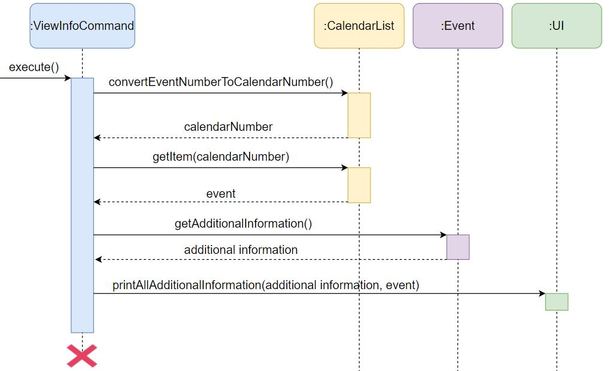
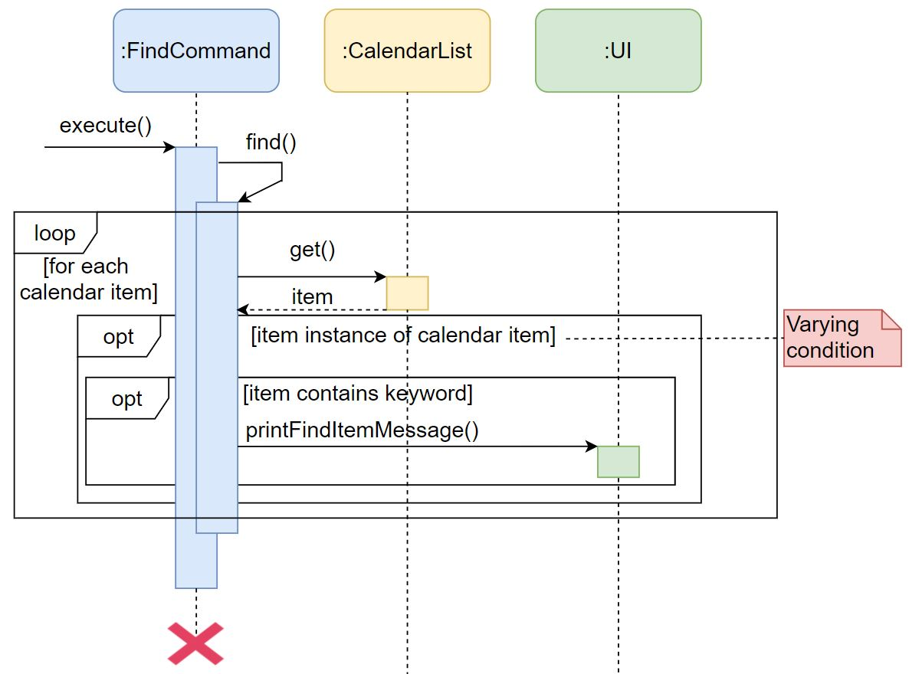
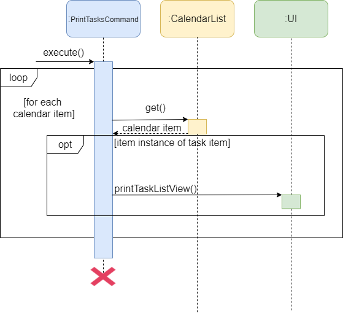
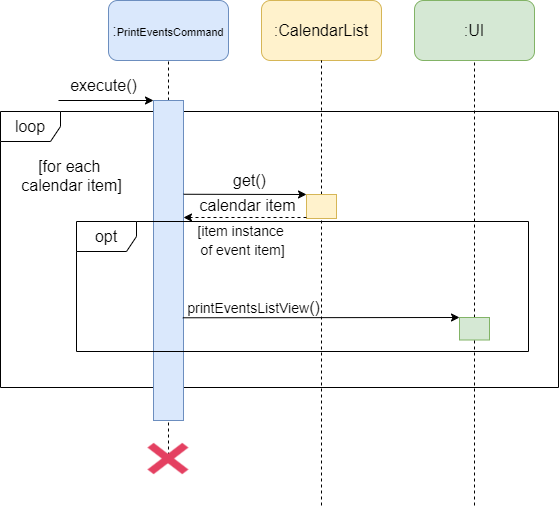
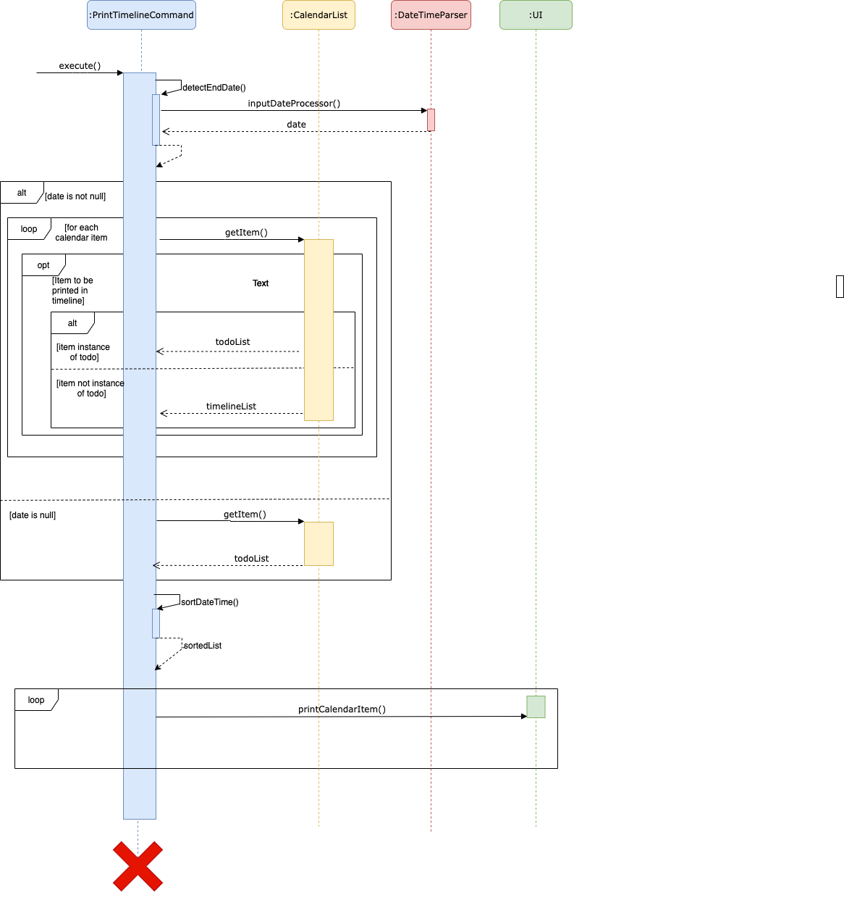

# Developer Guide

## Table of contents
- [Developer Guide](#developer-guide)
  * [Introduction](#introduction)
    + [Introduction to *25HoursADay*](#introduction-to--25hoursaday-)
    + [Purpose and scope](#purpose-and-scope)
    + [Developer guide organization](#developer-guide-organization)
  * [Setting Up & Getting started](#setting-up---getting-started)
    + [Setting up](#setting-up)
    + [Getting started](#getting-started)
  * [Design](#design)
    + [Architecture](#architecture)
    + [Ui](#ui)
    + [Parser](#parser)
    + [Command](#command)
    + [Storage](#storage)
    + [Model](#model)
      - [Task](#task)
      - [Event](#event)
  * [Implementation](#implementation)
    + [Add a calendar item feature](#add-a-calendar-item-feature)
    + [Mark a task as done feature](#mark-a-task-as-done-feature)
    + [Additional information of an event feature](#additional-information-of-an-event-feature)
      - [Add additional information](#add-additional-information)
      - [View additional information](#view-additional-information)
      - [Delete additional information](#delete-additional-information)
    + [Delete a calendar item feature](#delete-a-calendar-item-feature)
    + [Find a calendar item feature](#find-a-calendar-item-feature)
    + [Print tasks feature](#print-tasks-feature)
    + [Print events feature](#print-events-feature)
    + [Print personal calendar feature](#print-personal-calendar-feature)
    + [Prioritize a task feature](#prioritize-a-task-feature)
    + [Print prioritized tasks feature](#print-prioritized-tasks-feature)
    + [Print progress feature](#print-progress-feature)
    + [Print suggestions feature](#print-suggestions-feature)
    + [Print countdown feature](#print-countdown-feature)
    + [Saving data feature](#saving-data-feature)
    + [Check the validity of a module code](#check-the-validity-of-a-module-code)
  * [Documentation](#documentation)
    + [Documentation guide](#documentation-guide)
      - [Introduction](#introduction-1)
      - [Setting up and maintaining the project website](#setting-up-and-maintaining-the-project-website)
      - [Style guidance](#style-guidance)
      - [Editing diagrams](#editing-diagrams)
      - [Converting a document to the PDF format](#converting-a-document-to-the-pdf-format)
    + [Testing guide](#testing-guide)
    + [Logging guide](#logging-guide)
  * [DevOps guide](#devops-guide)
    + [1. Build automation](#1-build-automation)
    + [2. Continuous integration (CI)](#2-continuous-integration--ci-)
    + [3. Make a release](#3-make-a-release)
  * [Appendix A: About the product](#appendix-a--about-the-product)
    + [Product scope](#product-scope)
    + [Target user profile](#target-user-profile)
    + [Value proposition](#value-proposition)
  * [Appendix B: User Stories](#appendix-b--user-stories)
  * [Appendix C: Non-Functional Requirements](#appendix-c--non-functional-requirements)
  * [Appendix D: Glossary](#appendix-d--glossary)
  * [Appendix E: Contact the initial developers](#appendix-e--contact-the-initial-developers)
  * [Appendix F: Instructions for manual testing](#appendix-f--instructions-for-manual-testing)
    + [Command summary](#command-summary)

## Introduction
This section provides an introduction to the developer guide for *25HoursADay*.

### What is *25HoursADay*?
*25HoursADay* is a scheduling app optimized for users via a convenient yet powerful Command Line Interface (CLI) while still having the benefits of a Graphical User Interface (GUI). If you can type fast, *25HoursADay* can schedule your tasks and events faster than traditional GUI apps.

### Purpose and scope
The purpose of this developer guide is to describe the architecture and software design decisions for the task scheduling application *25HoursADay*. This developer guide covers an overview of the program architecture, the logical view of major components, and the mechanism of the functions.

The intended audience of this guide are the developers and software testers of *25HoursADay*.

## Setting Up & Getting started
This section provides on setting up the *25HoursADay* application.

### Setting up

Before diving into the project development and testing, here are some essential tools required in this project:

1. **JAVA 11.0.8**
    * Launch your terminal and type "java -version" to ensure you have the correct version number
    * If you have no Java installed or different version number, please proceed to this [website](https://www.oracle.com/java/technologies/javase/jdk11-archive-downloads.html)
    to download the **Java 11.0.8** installer.
1. **Intellij IDEA**
    * If you are new to IntelliJ, please proceed to this [website](https://www.jetbrains.com/help/idea/installation-guide.html)
    to download and install the IDE.
    
After installing the required tools, proceed to [Github Page](https://github.com/AY2021S1-CS2113T-T12-2/tp) and 
fork the project to your own repository, and clone your fork into your working computer.    

Now, Open Intellij 
1. If you are not in the welcome screen, click `File` → `Close Project` to navigate to the starting project dialog)
1. Set up the correct JDK version for Gradle.
        1. Click `Configure` → `Project Structure for New Project`
        1. Click `New...` and set it to the directory of the JDK
1. Upon the successful configuration, you should be able to see the following screenshot:

1. Lastly, **Import the project as a Gradle Project.**
    * Intellij IDEA by default has the Gradle plugin installed. If you have disabled it, go to 
    `File` → `Settings` → `Plugins` to re-enable them.
    * Click Import Project (or Open or Import in newer version of Intellij).
    * Locate the **build.gradle file** (not the root folder as you would do in a normal importing) and select it. Click `OK`.
    * If asked, choose to `Open as Project` (not Open as File).
    * Click `OK` to accept the default settings but do ensure that the selected version of Gradle JVM matches the 
    JDK being used for the project.
    * Wait for the importing process to finish (may take a few minutes, so get some :coffee: :relaxed:)
1. **Verify the set up**:
    * Run the `..main/java/seedu.duke/Main`
    * Upon a successful configuration, you should be able to see the welcome screen of the project as shown below:
    
    * Run some tests to ensure it is working properly.

### Getting started

1. **Configure the coding style**
If using IDEA, follow the guide If using IDEA, follow the guide [se-edu/guides IDEA: Configuring the code style](https://se-education.org/guides/tutorials/intellijCodeStyle.html) 
to set up IDEA’s coding style to match ours.

    :bulb: Tips: Optionally, you can follow the guide  [se-edu/guides Using Checkstyle](https://se-education.org/guides/tutorials/checkstyle.html) 
    to find how to use the CheckStyle within IDEA e.g., to report problems as you write code.
1. **Set up CI**
This project comes with a GitHub Actions config files (in `.github/workflows` folder). When GitHub detects those files, 
it will run the CI for your project automatically at each push to the master branch or to any PR. No set up required.
1. **Learn the design**
When you are ready to start coding, we recommend that you get some sense of the overall design by reading about [*25HoursADay*’s architecture](#architecture).

## Design
This section describes the design overview of the *25HoursADay* application.

### Architecture

The figure below shows the overall design of the application. 

The sequence diagram below shows how the components interact with each other for the scenario where the user issues the command `todo`.

An overview of each components is listed below.

### Ui
The `Ui` class is responsible for the user interface of the application. It receives the input from the user and prints the results to the user.

### Parser

The `Parser` class is responsible for interpreting the user's input and calling the respective command. 

### Command

The different `Command` classes are responsible for receiving the user's input from the `Parser` class and executing the corresponding commands. 
The figure belows shows the class diagram of the command class:  

All Command classes inherit from the `Command` class.

### Storage

The `Storage` class is responsible for reading and writing data to the hard disk.

### Model
The model is responsible for holding the data of the application in memory. The figure below shows the structure of the Model in this application.

 When executing commands,the `CalendarItem` class updates the information or provides the information of different types of items if needed. 
It is split into two subclasses: `Task` and `Event` class.
The `CalendarList` class holds the array of `CalendarItem` and keeps track of the number of total items, total tasks, and total events.

The `Task` and `Event` classes are further explained below.

#### Task

The `Task` class stores the information of all task items, including description and status, such as `isDone` and `isImportant`. 
It has two subclasses: `Todo` and `Deadline`. `Deadline` items also have the date information and countdown for the deadline date, which are not included in `Todo` tasks. 

#### Event

The `Event` class stores the information of all `Event` items, including date, time, venue, status whether it is overdue, and any other information if added. 
It has two subclasses: `SchoolEvent` and `Activity`. `Activity` items can have other details.
All `SchoolEvent` items must have a module code.  
Furthermore, the `SchoolEvent` class has four subclasses which are `Lecture`, `Tutorial`, `Lab`, and `Exam`. Among them only `Exam` items have a countdown for the exam date. 

Design consideration: `SchoolEvent` is modelled after classes in NUS to cater to our intended users.

## Implementation
This section describes the details of how each feature is implemented.

### Add a calendar item feature
This feature is facilitated by `AddCommand`.
The following sequence diagram shows how the `execute()` operation works to add a `Todo` item: 

The following sequence diagram shows how the `execute()` operation works to add `Activity` or `Deadline` item. A
 `Deadline` item is used as an example.
: 

The following sequence diagram shows how the `execute()` operation works to add a`SchoolEvent` item. An `Exam` item
 is used as an example.
 
 

Note: A self-call to a specific method to add the new `CalendarItem` to the `CalendarList` is done based on the type of
 `CalendarItem` being added. The `CalendarItem` object created is also based on the type of `CalendarItem` being added. 

### Mark a task as done feature
This feature is facilitated by `DoneCommand`.
The following sequence diagram show how the `execute()` operation works: 

Note: The command first extracts the task number from the user input prior to `convertTaskNumberToCalendarNumber`. 
There will be a check in the function `markTaskAsDone(calendarNumber)` to ensure that the calendar item being marked as done is a task. 

### Additional information of an event feature
#### Add additional information
This feature is facilitated by `AddInfoCommand`.
The following sequence diagram show how the `execute()` operation of `AddInfoCommand` works: 

#### View additional information
This feature is facilitated by `ViewInfoCommand`.

The following sequence diagram show how the `execute()` operation of `ViewInfoCommand` works: 

#### Delete additional information
This feature is facilitated by `DeleteInfoCommand`.

The following sequence diagram show how the `execute()` operation of `DeleteInfoCommand` works: 

Note: The commands first extracts the event number from the user input prior to `convertEventNumberToCalendarNumber`. 

### Delete a calendar item feature
This feature is facilitated by `DeleteCommand`.
The following sequence diagram show how the `execute()` operation works: 

Note: The command first extracts the task/event number from the user input prior to `convertTaskNumberToCalendarNumber` and `convertEventNumberToCalendarNumber` respectively. 

### Find a calendar item feature
This feature is facilitated by `FindCommand`.
The following sequence diagram shows how the `execute()` operation works when the user searches the entire calendar.: 

The search for tasks or events feature has a similar sequence diagram with a slight difference to the varying condition. Depending
on whether the user searches for tasks or events, the condition will check for the instance of either the task or event respectively.

### Print tasks feature
This feature is facilitated by `PrintTasksCommand`.
The following sequence diagram shows how the `execute()` operation works when the user wants to print the list of tasks stored in the program.

### Print events feature
This feature is facilitated by `PrintEventsCommand`.
The following sequence diagram shows how the `execute()` operation works when the user wants to print the list of events stored in the program.

### Print personal calendar feature
This feature is facilitated by `PrintTimelineCommand`.
The following sequence diagram show how the `execute()` operation works when the user wants to print the personalised calendar: 

### Prioritize a task feature 
This feature is facilitated by `PrioritizeCommand`. 
The following sequence diagram shows how the `execute()` operation works when the user wants to prioritize a task: 

Note: It first extracts the task number from the user input prior to convertTaskNumberToCalendarNumber. 
There will be a check in the function `markTaskAsImportant(calendarNumber)` to ensure that the calendar item being marked as important is a task.

### Print prioritized tasks feature
This feature is facilitated by `PrintPriorityCommand`.
The following sequence diagram shows how the `execute()` operation works when the user wants to print all the prioritized tasks: 

Note: It uses the `getIsImportant()` function of task items to identify whether it is a prioritized task.

### Print progress feature
This feature is facilitated by `PrintProgressCommand`.
The following sequence diagram shows how the `execute()` operation works when the user wants to see the progress of all tasks: 

### Print suggestions feature
This feature is facilitated by `PrintSuggestionCommand`.
The following sequence diagram shows how the `execute()` operation works when the user wants to see suggestions about preparing which tasks: 

Note: It uses `getEarliestDeadline()` function to get the earliest ordinary deadline in the list, and `getEarImportantDeadline()` function to get the earliest important deadline in the list.
Similarly, it uses`getFirstTodo()` function to get the first added todo task in the list, and `getFirImportantTodo()` function to get the first added important todo task in the list.
If no corresponding items, the functions will return null. Then it passes the return results to Ui, and Ui prints suggestions with respect to the importance and urgency of them.

### Print countdown feature
This feature is facilitated by `CountdownCommand`.

The following sequence diagram shows how the `execute()` operation works when the user decide to see the countdown of exams and deadlines: 

The following sequence diagram shows how the `execute()` operation works when the user decide to see the countdown of exams or deadlines: 

Note: Before printing the countdown, `countdown()` function will calculate the countdown of exams or deadlines, and the countdowns for
exams or deadlines will be sorted in ascending sequence by function `sortDeadlinesAndPrintCountdown()` or `sortExamsAndPrintCountdown()`

### Saving data feature

This feature is facilitated by `Storage` class and saves the data input by the users automatically into file `tasks.txt` in `/data` directory. 

The file `tasks.txt` is loaded when initializing the program by calling the function `readFromFile()`.

The local file is updated every time when the user adds or deletes an item, 
or changes the attributes of the item by calling the function `writeToFile()`.

Note: if the local file and directory does not exist at the beginning, `createFile()` will be called to create a new 
directory, and a new text file.

### Check the validity of a module code
This feature is facilitated by `ModuleChecker` class and `NusModule` class.

The `NusModule` class consists of an empty constructor, a getter and setter to retrieve and set the module code of a `NusModule` object.
The `ModuleChecker` class has a `generateNusModsMap()` which generates a `HashMap<String, NusModule>`. This is achieved by reading
the JSON file from the NUS Mod website and parser it into a list of Module objects.

After which, the isModuleValid function will analyse the module code entered by the user, and returns TRUE if the code is 
valid, FALSE otherwise.

The following sequence diagram further illustrates the above process. 

<!-- @@author Jingming517 -->
## Documentation
This section shows how the developer guide is documented.

### Documentation guide

We use Markdown for writing documentation.

#### Setting up and maintaining the project website
- We use [Jekyll](https://jekyllrb.com/) to manage documentation.  
- The docs/ folder is used for documentation.  
- To learn how to set it up and maintain the project website, follow the guide [[se-edu/guides] Using Jekyll for project documentation](https://se-education.org/guides/tutorials/jekyll.html).

#### Style guidance
- Follow the [Google developer documentation style guide](https://developers.google.com/style).
- Also relevant is the [[se-edu/guides] Markdown coding standard](https://se-education.org/guides/conventions/markdown.html)

#### Editing diagrams
- We use [diagrams.net](https://www.diagrams.net/) to draw UML diagrams used in this document.

#### Converting a document to the PDF format
- We use Google Chrome for converting documentation to PDF format.  
- Here are the steps to convert the project documentation to PDF format:
  - Go to your generated documentation site on GitHub using Chrome.
  - Within Chrome, click on the Print option in Chrome’s menu.
  - Set the destination to Save as PDF, then click Save to save a copy of the file in PDF format.
- See the guide [[se-edu/guides] Saving web documents as PDF files](https://se-education.org/guides/tutorials/savingPdf.html) for more details.  

### Testing guide

There are two ways to run tests.
- Method 1: Using IntelliJ JUnit test runner
  - To run all tests, right-click on the src/test/java folder and choose Run Tests in `tp.test`
  - To run a subset of tests, you can right-click on a test package, test class, or a test and choose Run `DukeTest`
- Method 2: Using Gradle
  - Open a console and run the command `gradlew checkstyleMain` (Mac/Linux: ./gradlew checkstyleMain)  

<!-- @@author -->

## DevOps guide

### Build automation
This project uses Gradle for **build automation and dependency management.**
**You are highly recommended to read [this Gradle Tutorial from the se-edu/guides](https://se-education.org/guides/tutorials/gradle.html).

Given below are how to use Gradle for some important project tasks.

* `clean`: Deletes the files created during the previous build tasks (e.g. files in the `build` folder).
e.g. `./gradlew clean`

* `shadowJar`: Uses the ShadowJar plugin to creat a fat JAR file in the `build/lib` folder, if the current file is outdated.
e.g. `./gradlew shadowJar`

* `run`: Builds and run the program.
  `runShadow`: Builds the application as a fat JAR, and then runs it.
    
* `checkstyleMain`: Runs the code style check for the main code base.
  `checkstyleTest`: Runs the code style check for the test code base.
  
* `test`: Runs all tests.
    * `./gradlew test` - Runs all tests
    * `./gradlew clean test` - Cleans the project and runs tests

### Continuous integration (CI)
This project uses GitHub Actions for CI. The project comes with the necessary GitHub Actions configurations files 
(in the `.github/workflows` folder). No further setting up required.

### Make a release
Here are the stpes to create a new release after you have implemented new features.

1. Update the version number in `Main.java`.
1. Generate a fat JAR file using Gradle (i.e. `gradlew shadow`).
1. Tag the repo with the version number e.g: `V2.1`.
1. [Create a new release using Github](https://docs.github.com/en/free-pro-team@latest/github/administering-a-repository/managing-releases-in-a-repository).
1. Upload the JAR file you created.

## Appendix A: About the product 
This section provides a description of the product.

### Product scope
*25HoursADay* is a task scheduling program optimized for use via a Command Line Interface (CLI) while still 
having the benefits of a Graphical User Interface (GUI). It serves as a one-stop application for the users to keep track of their
tasks, events and any 
It is specially catered to NUS students, offering features relevant to a NUS student. 

### Target user profile

* NUS student
* has the need to manage a significant number of day-to-day matters
* prefer desktop command line apps over other types
* prefer typing to using mouse interactions
* comfortable with using command line applications
* forgetful person who needs reminders
* a fast typer

### Value proposition

By using *25HoursADay*, it provides an all-in-one application for the users to keep track of his/her day-to-day matters. Without the
need to search through different platforms for information, *25HoursADay* can manage one's day-to-day matters faster than a 
typical mouse/GUI driven application.

## Appendix B: User Stories
This section describes the user stories considered when implementing the features.

|Version| As a ... | I want to ... | So that I can ...|
|--------|----------|---------------|------------------|
|v1.0|new user|see usage instructions|refer to them when I forget how to use the application|
|v1.0|user|add different tasks and events|better manage my day-to-day matters|
|v1.0|user|set my tasks as done|track my tasks better|
|v1.0|user|delete my calendar items|remove unwanted items and organise my calendar better |
|v1.0|user|print all events and tasks separately|have a clear picture of what I have on hand|
|v1.0|user|see my progress of tasks|know the percentage of tasks I have finished and adjust my working pace| 
|v1.0|user|store all the data locally|load my saved data to the app next time|
|v2.0|user|find an item in my calendar|locate an item without having to go through the entire list|
|v2.0|NUS student|add information about my classes|locate all the information about my class on this app|
|v2.0|NUS student|delete information about my classes|can keep the information about my class relevant at all times |
|v2.0|user|mark my tasks as important|distinguish important tasks and the ordinary tasks|
|v2.0|user|print calendar in timeline format|have a visual overview of all the items I have|
|v2.0|user|print timeline before a certain date|have an overview of current tasks and better manage my time|
|v2.0|user|get some suggestions when I do not know what to do|prepare for important and urgent tasks first|
|v2.0|NUS student|add my school events recursively|save my time typing out the events one by one|
|v2.0|NUS student|see the exam and deadline countdown|be conscious about the coming exams and deadlines and manage my time more wisely|

## Appendix C: Non-Functional Requirements

1. The program should work on any _mainstream_ OS as long as it has **Java 11.0.8** or above installed.
1. The program should be able to hold up to 1000 tasks without a noticeable slowness in performance for typical usage.
1. A user with an above average typing speed for regular English text (e.g not code, not system admin commands) should 
find it handy to use command lines rather than using the mouse.
1. The program should be able to detect all NUS modules, provided there is proper connection established between the program
and the NUS Mods API.   

{Give non-functional requirements; More to add}

## Appendix D: Glossary

* *Task* - a todo item or a deadline item.
* *School event* - a lecture, tutorial, lab session or an examination.
* *Event* - an activity or a school event.
* *Calendar item* - a task or an event.	
* *Task list* - a list that stores all the tasks added to the app.
* *Event list* - a list that stores all the events added to the app.
* *Calendar list* - a list that stores all the calendar items added to the app.

## Appendix E: Contact the initial developers
The table below shows the information and contact details of developers.

|Developer| Contact details | 
|--------|----------|
|Liu Jingming|E0424608@u.nus.edu|
|Liu Yifeng|E0425960@u.nus.edu|
|Lyu Jiawen|E0376928@u.nus.edu|
|Ng Hong Ming|E0426149@u.nus.edu|
|Zhang Yilin|E0377000@u.nus.edu|

## Appendix F: Instructions for manual testing

General steps for manual testing:
1. Execute an "Add" action.  
2. Execute a "Delete" / "Find" / "Print" / "Set" / "View" action of the same command type.

Printing the countdown of exams
1. Prerequisites: add some `exam` events into the `calendarList`.
2. Test case: `countdown exams`

   Expected: The countdown of the exams will be calculated for you. And the countdown of all upcoming exams will be printed. 
   
3. Test case: `countdown 12345678`

   Expected: No countdown will be calculated and printed. Error details will be shown in the exception message given to you.

Refer to [Command Summary](#command-summary) to view the list of actions, command types and command format.   
Refer to [User Guide](https://ay2021s1-cs2113t-t12-2.github.io/tp/UserGuide.html) to view the other commands and their expected output.

### Command summary
The following table contains the list of commands available in the application.

|Term| Meaning | Command Format|
|--------|----------------|--------|
|Add|activity event|`act <activity_description> @<venue> / <date> <time>`|
|Add|additional information for an event|`/a <event_number> - <additional_information>`|
|Add|deadline task|`deadline <task_description> / <due_date>`|
|Add|exam event|`exam <module_name> @<venue> / <date> <time>`|
|Add|lab event|`lab <module_name> @<venue> -r <recurring_number> / <date> <time>`|
|Add|lecture event|`lect <module_name> @<venue> -r <recurring_number> / <date> <time>`|
|Add|todo task|`todo <task_description>`|
|Add|tutorial event|`tut <module_name> @<venue> -r <recurring_number> / <date> <time>`|
|Delete|additional information for an event|`/- <event_number> a <additional_information_number>`|
|Delete|events|`-e <event_number>`|
|Delete|tasks|`-t <task_number>`|
|Find|all calendar items|`/f <keyword>`|
|Find|events|`/fe <keyword>`|
|Find|tasks|`/ft <keyword>`|
|Print|countdown for all items|`countdown`|
|Print|countdown for deadlines|`countdown deadlines`|
|Print|countdown for exams|`countdown exams`|
|Print|events|`print events`|
|Print|important tasks|`print *`|
|Print|progress|`print progress`|
|Print|tasks|`print tasks`|
|Print|timeline (default)|`print timeline`|
|Print|timeline before a date|`print timeline date <date>`|
|Print|timeline for the next 31 days|`print timeline month`|
|Print|timeline for the next 7 days|`print timeline week`|
|Quit|exit the application|`bye`|

