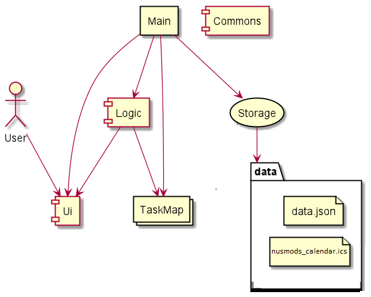
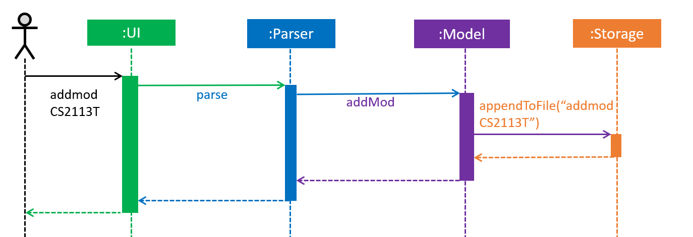
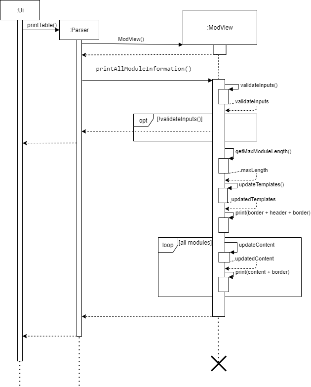
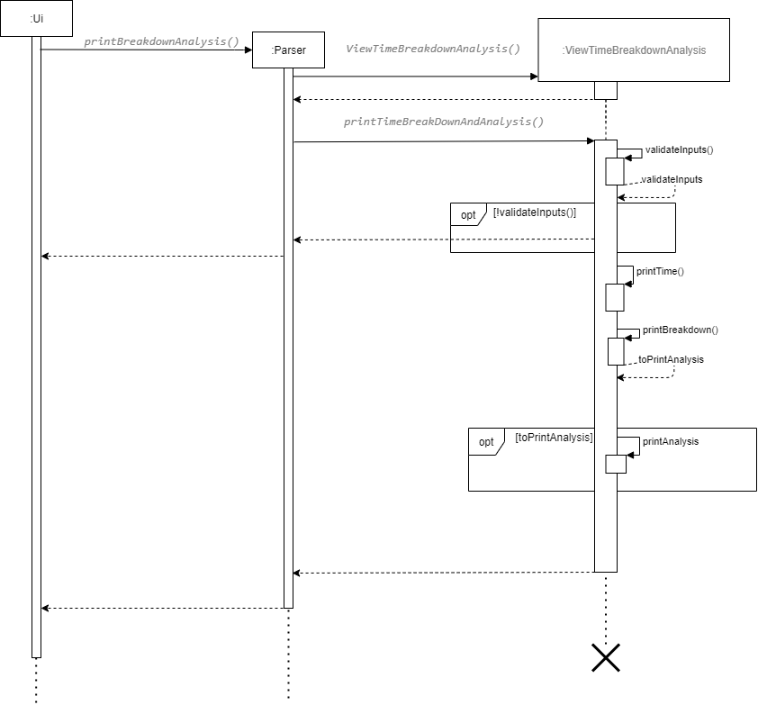
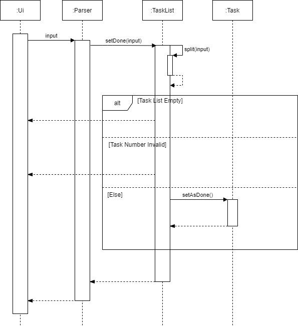

# Developer Guide

## Table of Contents

* [Setting Up, Getting Started](#setting-up-getting-started)
* [Design](#design)
    * [Architecture](#architecture)
    * [UI component](#ui-component)
    * [Parser component]()
    * [Model component](#model-component)
    * [Storage component]()
* [Implementation](#implementation)
    * [Store Data](#store-data)
    * [Add Module](#add-module) 
    * [Add Time](#add-time)
    * [Minus Time](#minus-time)
    * [View modules](#view-modules)
    * [Breakdown and analysis](#breakdown-and-analysis)
    * [Add Task](#add-task)
    * [Mark Task as Done](#mark-task-as-done)
* [Documentation, logging, testing, configuration, dev-ops](#documentation-logging-testing-configuration-dev-ops)
* [Appendix: Requirements](#appendix-requirements)
    * [Product Scope](#product-scope)
    * [User Stories](#user-stories)
    * [Use Cases](#use-cases)
    * [Non-Functional Requirements](#non-functional-requirements)
    * [Glossary](#glossary)
* [Appendix: Instructions for Manual Testing](#appendix-instructions-for-manual-testing)

## Setting Up, Getting Started
{Start up guide}

## Design

{Describe the design and implementation of the product. Use UML diagrams and short code snippets where applicable.}

### Architecture


The ModTracker class is the main entry point for the ModTracker application. It contains the main, loadData, run, 
startAndGetName and runCommandLoopUntilExitCommand methods. The methods are responsible for:
* At app launch:
    * Creation of a ModTracker object.
    * Load previously saved data from the text file into ModTracker.
    * Run the ModTracker app.
* At runtime:
    * Continuously prompt the user for input until app termination.
* At shutdown:
    * Save user data into a text file.
    * Invoke clean up methods where necessary.
    
The rest of the app consists of 4 packages:
* `Ui` : The user interface of the app.
* `Parser` : Parses the user input and calls the corresponding methods.
* `Model` : Holds the data of the app in-memory, containing the classes: ModuleList, Module, TaskList and Task.
* `Storage` : Saves and loads data to and from the hard disk.

##### How the architecture components interact with each other

The Sequence Diagram below shows how the components interact with each other for the scenario where the user types 
the command `addmod CS2113T`.  




### UI component

`UI` consists of a UI class that is responsible for dealing with user interaction. 

The `UI` component,

* Reads in the user input and passes the user input to the `Parser` component.
* Displays the message to the user based on the commands inputted by the user. 

### Model component


The Model,
* consists of ModuleList class that supports functions to execute module-related commands, 
  such as addmod, deletemod etc.
* consists of Module class that represents the module
* consists of TaskList class that supports functions to execute task-related commands, 
  such as addtask, deletetask etc.
* consists of Task class that represents the task


## Implementation
{Insert your own respective implementations here}
This section describes some noteworthy details on how certain features are being implemented.

### Store Data
The storage feature saves the data of the user so that 
the ModTracker application continues from where the user left off the previous time. 

#### Proposed Implementation
The `Storage` class facilitates the data saving and loading mechanism. 
The constructor `Storage(filePath)` accepts a String which is the file path to an external file.
This external file stores the user's data locally.

Inside the external file, it stores the name of the user 
followed by any valid inputs which modifies the data.
The format of the data inside the external file is as follows:

````
username
valid user input 1
valid user input 2
valid user input 3
...
````

When the user runs the program again, 
the program will first load data from the external file.
The `Parser` class then parses these data 
before the program prompts the user for input.

Given below is an example usage scenario, showing the 2 different times 
when a user starts the application.

##### First Use
The user launches the application for the first time.

1. `ModTracker` creates a new `Storage` object 
with file path at `data/modtracker.txt`. 

1. The newly created `Storage` object checks that there is no file 
at the specified file path, and creates a new file there.

1. The program prompts the user to input his/ her name.

1. The `Storage` object writes this username into the external file.

1. The program prompts the user for further inputs.

1. The user enters `help`, and the program displays the help message. 
Since this command does not modify the data, 
the external file remains unchanged.

1. The user enters `addmod CS1010 10`, 
and the program adds the new module correspondingly. 
Since this is a valid command which modifies the data,
 the `Storage` object appends `addmod CS1010 10` to the external file.

1. The user enters `exit`, and the program terminates.

##### Second Use
The same user starts the application again (on the same device as the first use).

1. `ModTracker` creates a new `Storage` object 
with the same specified file path at `data/modtracker.txt`.
   
1. The `Storage` object checks that the file at `data/modtracker.txt` exists,
and reads the first line of the file to obtain the user's name.

1. The `Storage` object passes the username to `ModTracker`, 
which calls `Ui` to greet the user.

1. `ModTracker` then obtains the remaining lines in the file via `Storage`,
and passes it to `Parser` to load the data into `ModuleList` and `TaskList`.

1. The program prompts the user for further inputs,
and it continues as per normal, with the data loaded.

The following sequence diagram shows how the storage feature works,
with a focus on how it obtains the username:


#### Design Considerations

* **Alternative 1 (current choice)**: Saves the user input to the file
    * Pros: Easy to implement as code from `Parser` can be reused
    * Cons: Increases coupling as it depends on the `Parser` class 
    to make sense of the data
* **Alternative 2**: Parses input into a different format 
storing the different modules, time expected, time spent and tasks
    * Pros: Independent of how `Parser` takes in user input
    * Cons: Requires additional work to parse data into the required
    storage format


### Add Module

#### Current Implementation

The add module feature will implement the checks of the module code input by the user through the following operations:

`checkIfModuleValid()` – Checks if the module code is of 6 – 8 characters without any spacing

`checkIfModuleExist()` – Checks if the module already exists in the list of modules

If the module code is valid and does not exist, the add module feature will proceed to create the module and adds it to 
the list of modules.  

> **_NOTE:_**  A module is identfied by its module code

The following activity diagram summarizes what happens when a user executes `addmod CS2113T` command for the first time.  


Given below is a detailed explanation on how the add module mechanism behaves at each step.

Step 1. The user launches the application for the first time and hence, the list of modules is empty. 
        The user types in a command: `addmod CS2113T`. 

Step 2. The parser class makes sense of the user input and calls the `addMod()` function in ModuleList class.

Step 3. Within the `addMod()` function, it will first check if the module code is valid by calling 
        `checkIfModuleValid()` function. The `checkIfModuleValid()` function will return true if the module code is 
        valid, and return false otherwise. If `checkIfModuleValid()` function returns true, proceed to step 4.

Step 4. Within the addmod function, it will then check if the module already exists in the list of modules by 
        calling `checkIfModuleExist()` function. The `checkIfModuleExist()` function will return true if the module 
        already exists in the modlist, and false otherwise. If `checkIfModuleValid()` function returns true, 
        proceed to step 5.  

Step 5. A new module with module code "CS2113T” is created by calling the constructor of Module class.

Step 6. The newly created module is added to the list of modules.

Step 7. The `printAdd()` function of the Ui class is called, displaying “CS2113T is added.” to the user.

Step 8. The newly created module is saved to storage.  

The following sequence diagram shows how the addmod CS2113T command works.

  


#### Design Considerations

##### Aspect: Checking existence of module by `checkIfModuleExist()` within `addmod()` function

Alternative 1 (Current choice): Checks that module does not exist in the list of modules before adding a new module
-	Pros: Ensure that there will be no duplicate modules in the list of modules
-	Cons: User cannot have 2 same modules in the list of modules.

Alternative 2: Always add a new module
-	Pros: The user can have 2 same modules in the list of modules.
-	Cons: If the user had inputted 2 same modules and wants to add the workload for these modules, the current 
          application will only update the module that was inputted earlier, ignoring the second module, resulting in 
          inconsistency.
-	Cons: If the user does not want duplicate modules, the user must ensure he/she does not add a module that is 
          already in the list of modules.  
          
### Add Time
The add time feature edits the actual workload for a specific module as indicated by the user. 
This is done by adding time spent on the module. The actual workload is broken down into academic weeks and
hours spent in the respective academic weeks.

#### Current implementation

The feature will implement the same checks as the add module feature as shown earlier.

If the module code is valid and exists the add time feature will proceed to add time from the module
as indicated by the user.

Given below is an example usage scenario and how the add time command behaves at each step.

Step.1 The user launches the application and does all the required steps to add a module with module code `CS2113T`
to a list of modules. This is done by inputting the command `addMod CS2113T`.

Step.2 The user now types in a command: `addTime CS2113T 2 4`. This calls the add time command from `Parser`.
`Parser` then calls the `addTime()` method in `ModuleList` and passes `CS2113T`,`2` and `4` as parameters into the
method. 
> **_NOTE:_**  The first number is the hours spent in that week. The second number is the academic week that is being
>updated.
>

Step.3 Within the `addTime()` function, it will first check if the module code is valid by calling
`checkIfModuleValid()` function. If the module code is valid, `checkIfModuleValid()` function will return true.

Step.4 Within the `addTime()` function, it will then check if the module exists in the module list storage by calling
`checkIfModuleExist()` function. If the module does exist, the `checkIfModuleExist()` function will return true.

Step.5 A time of `2` hours in academic week `4` will now be added to the actual workload of the `CS2113T` module. 

Step.6 The system will print the string `2 hours have been added to CS2113T`

Step.7 The actual workload is updated in storage.

The following sequence diagram illustrates what happens when a user executes `addTime CS2113T 2 4`.

[insert diagram here]

#### Design Considerations

* **Alternative 1 (current choice)**: adding time with academic weeks associated
    * Pros: Easy to manage for user as the user only needs to focus on the current academic week to track his workload
    * Cons: User might prefer to manage his time spent in totality
* **Alternative 2**: adding time in totality 
    * Pros: Able to cumulatively add time and manage workload based on overall total time spent.
    * Cons: May not be useful to know total time spent as workload may be better managed weekly.


### Minus Time
The minus time feature edits the actual workload for a specific module as indicated by the user. 
This is done by removing time spent on the module. The actual workload is broken down into academic weeks and
hours spent in the respective academic weeks. This feature is the opposite of the add time feature. 

#### Current implementation

The feature will implement the same checks as the add module feature as shown earlier.

As the command now is minus time, there would be two additional checks implemented.

`doesActualTimeExist()` - checks if the module code has existing actual workload stored to it.

`doesHoursExceedTotal()` - checks if the hours the user wishes to remove exceed the total hours in the actual workload.


If the module code is valid, exists and has an actual workload the minus time feature will proceed to minus
time from the module as indicated by the user.

Given below is an example usage scenario and how the minus time command behaves at each step.

Step.1 The user launches the application and does all the required steps to add a module with module code `CS2113T`
to a list of modules. This is done by inputting the command `addMod CS2113T`.

Step.2 The user then does all the required steps to add `2` hours of time spent in academic week `4` on `CS2113T`. This
is done by inputting the command `addTime CS2113T 2 4`.

Step.3 The user now types in a command: `minusTime CS2113T 2 4`. This calls the minus time command from `Parser`.
`Parser` then calls the `minusTime()` method in `ModuleList` and passes `CS2113T`,`2` and `4` as parameters into the
method.

> **_NOTE:_**  The first number is the hours spent in that week. The second number is the academic week that is being
>updated.
>

Step.4 Within the `minusTime()` function, it will first check if the module code is valid by calling
`checkIfModuleValid()` function. If the module code is valid, `checkIfModuleValid()` function will return true.

Step.5 Within the `minusTime()` function, it will then check if the module exists in the module list storage by calling
`checkIfModuleExist()` function. If the module does exist, the `checkIfModuleExist()` function will return true.

Step.6 Within the `minusTime()` function, it will then check if there is an existing actual workload for this module by
calling the `doesActualTimeExist()` function. If the module has an existing workload, the `doesActualTimeExist()`
function will return true.

Step.7 Within the `minusTime()` function, it will then check if the hours the user wish to remove is more than the
existing hours by
calling the `doesHoursExceedTotal()` function. If the module has an existing workload, the `doesHoursExceedTotal()`
function will return true.

Step.8 A time of `2` hours in academic week `4` will now be removed from the actual workload of the `CS2113T` module. 

Step.9 The system will print the string `2 hours have been removed from CS2113T`

Step.10 The actual workload is updated in storage.

The following sequence diagram illustrates what happens when a user executes `minusTime CS2113T 2 4`.

[insert diagram here]


#### Design Considerations

* **Alternative 1 (current choice)**: removing time with academic weeks associated
    * Pros: Easy to manage for user as the user only needs to focus on the current academic week to track his workload
    * Cons: User might prefer to manage his time spent in totality
* **Alternative 2**: minus time in totality 
    * Pros: Able to cumulatively remove time and manage workload based on overall total time spent.
    * Cons: May not be useful to know total time spent as workload may be better managed weekly.

### View modules

#### Current Implementation

The view module command allows the user to view all the modules taken,
the respective time spent and expected module workload at a glance. It prints 
`weekNumber`,`moduleCode`, `expectedWorkload` and `actualWorkload` in the specified 
week for all the modules taken in a table format. 

Given below is an example usage scenario and how the view module command behaves at each step.

1. User calls the view module command from the `Parser`. `Parser` then calls the `printTable()`
method in `Ui`. `printTable()` then instantiates `ModView` class and calls the `printAllModuleInformation()`
method from the `ModView` class.

1. User input is subjected to `validateInputs()` to verify that 
both of the following conditions are satisfied.
  * `weekNumber` is an integer between 1 and 13 inclusive.
  * `modlist` in `list` is not empty.

If any of the above conditions is not satisfied, an error message will be printed
and `printAllModuleInformation()` terminates.

1. A method `getMaxModuleLength()` will be called to find out the maximum length 
of module code of modules taken. This is to facilitate the resizing of the printed table.

1. `updateTemplates()` then updates the table templates such as `border`, `header` 
and `contents` are updated accordingly based on the output of `getMaxModuleLength()`.

1. For each `Module` in `modList`, `updateContent()` will be called to update the contents
to be printed.

The following sequence diagram shows how the view module command works. 




### Breakdown and Analysis

#### Current Implementation

The analysis command allows the user to view the breakdown of the total time spent
in the week across all modules and provides a simple analysis of how they are doing.

1. User calls the view module command from the `Parser`. `Parser` then calls the `printBreakdownAnalysis()`
   method in `Ui`. `printBreakdownAnalysis()` then instantiates `ViewTimeBreakdownAnalysis` class. 
   and calls the `printTimeBreakdownAndAnalysis()` method. 
   
1. The user input is subjected to `validateInputs()` to verify that 
   both of the following conditions are satisfied.
     * `weekNumber` is an integer between 1 and 13 inclusive.
     * `modlist` in `list` is not empty.
   
   If any of the above conditions is not satisfied, an error message will be printed
   and `printTimeBreakdownAndAnalysis()` terminates.

1. `printTime()` method in `printTimeBreakdownAndAnalysis()` is first called. For each `Module` 
in `modList`, `printTime()` prints `actualWorkload` and `expectedWorkload` in form of a 
horizontal bar graph. The existence of the desired data is checked using `doesActualTimeExist()` 
and `doesExpectedTimeExist()` methods of the `Module` class. If the desired data does not exist, a `NO INPUT` will be printed. 

1. `printBreakdown()` then calculates the total time spent by the user on the modules taken in the specified 
week. It then prints out `actualTime` of each `Module` as a percentage of `totalTimeSpent`. If there is no input, 
a `NO INPUT` message will be printed. `printBreakdown()` return **TRUE** if there exists a `Module` that has a 
valid input, else **False** is returned.

1. If output of `printBreakdown()` is `True`, `printAnalysis()` will be called. `computeAnalysisOfTimeSpent()` 
is called to determine the outcome of the analysis. A message will be printed depending on the output
of the analysis. 

The following sequence diagram shows how the analysis command works. 



#### Design Considerations

* **Alternative 1 (current choice)**: Printing data as a bar graph
    * Pros: Easy implementation as the bar graph is printed as a `String`.
    * Cons: It might be difficult to compare across modules using a bar graph.
* **Alternative 2**: Printing data as a line graph
    * Pros: Easier to compare across different modules.
    * Cons: Difficult to implement as it requires external libraries.
    * Cons: Difficult to test due to additional dependencies on external libraries. 

### Add Task
The add task feature allows user to add a task under an existing module. 

#### Current Implementation
The `addtask` command is executed by the `parse` method in the `Parser` class, which then calls the `addTask` method 
in the `TaskList` class. The `addTask` method performs all the necessary logic for the add task feature.

Given below is an example usage scenario.
1. The user input the `addtask` command and the `parse` method in `Parser` parses the command.
1. `parse` calls the `addTask` method in `TaskList`.
1. The `addTask` method splits the user input into 3 sections:
    * `Section 1`: command
    * `Section 2`: module code
    * `Section 3`: task description
1. The `addTask` method calls the `checkIfModuleValid` method in `ModuleList` class to check if `Section 2` is a 
valid module code.
    * If module code is not valid, the `addTask` method will return and `Ui` will prompt the user to enter a 
    valid module code.
    * Else if module code is valid, the `addTask` method will execute the next step.
1. The `addTask` method calls the `checkIfModuleExist` method to check if `Secion 2` (module code) exists in the database.
    * If module code does not exist in the database, the `addTask` method will return and `Ui` will prompt the user to
    execute the `addmod` or `addexp` command first.
    * Else if module code exists, the `addTask` method will execute the next step.
1. The `addTask` method will create a new `Task` object by the constructor in `Task` class, with `Section 3` (task description). 
1. The `addTask` method adds the `Task` object to the array list `tasks`.


#### Future Implementation
A future implementation requires user to enter the expected time required to complete the task. The `addTask` method will split the 
user input into 4 sections, with `Section 4` as the expected time required to complete the task. `Section 4` will then be
used in the future implementation of mark task as done feature, as further illustrated in the [mark task as done](#mark-task-as-done)
section.

### Mark Task as Done
The mark task as done feature allows user to mark an existing task as done.

#### Current Implementation
The `done` command is executed by the `parse` method in the `Parser` class, which then calls the `setDone` method in the
`TaskList` class. The `setDone` method performs all the necessary logic for the mark task as done feature.

Given below is an example usage scenario.
1. The user input the `done` command and the `parse` method in `Parser` parses the command.
1. `parse` calls the `setDone` method in `TaskList`.
1. The `setDone` method splits the user input into 2 sections:
    * `Section 1`: command
    * `Section 2`: task number corresponding to the index of `Task` object in array list `tasks`
1. The `setDone` method will check if the array list `tasks` is empty.
    * If array list is empty, `Ui` will notify the user that there is no `Task` to mark as done.
    * Else if array list is not empty, `setDone` method will execute the next step.
1. The `setDone` method will check the validity of `Section 2` (task number).
    * If task number is not an integer, an exception will be thrown and the `setDone` method terminates.
    * If task number is out of bounds, `Ui` will prompt the user to enter a valid task number.
    * Else if task number is valid, `setDone` method will execute the next step.
1. The `setDone` method will then call the `setAsDone` method in `Task` class to mark the `Task` corresponding to 
`Section 2` (task number) as done. 
    
  
   
#### Future Implementation
1. When the `Task` is set as done, the `setDone` method will call the `addTime` method in `ModuleList` class
to add the expected time required to complete the task to the actual time spent on the module.
    * This future implementation requires `Section 4` (expected time required to complete the task) from the future 
    implementation of the `addTask` method to be passed as a parameter to the `setDone` method and then to the 
    `addTime` method.

## Documentation, Logging, Testing, Configuration, Dev-Ops
{Insert guides here for doc, testing etc}

## Appendix: Requirements
### Product Scope
#### Target User Profile

NUS students

* spend too much time on certain modules and neglecting other modules
* want a timetable to view and breakdown all the module workload easily
* need help to manage the time spent on each module


#### Value Proposition

* helps to track the time spent on every module  
* better prioritize their work for each module 
* relieves the stress of NUS students by achieving a work-life balance

### User Stories

|Version| As a ... | I want to ... | So that I can ...|
|--------|----------|---------------|------------------|
|v1.0|new user|see usage instructions|refer to them when I forget how to use the application|
|v1.0|student|input my modules|keep track of modules that I am taking|
|v1.0|student|input the expected module workload|keep track of the recommended time I should spend on the module|
|v1.0|busy student|view breakdown of my time spent on each module|pinpoint in detail where i spend most of time on|
|v1.0|student|input the actual time spent on each module|keep track of the actual time I spent|
|v1.0|careless user|edit the data easily|correct any mistakes I inputted wrongly/
|v1.0|user|save my data permanently|save the trouble of re-entering my data everytime I start the app|
|v2.0|user of ModTracker|add tasks related to a module|know what are the outstanding tasks for each module
|v2.0|user|(to be updated)|(to be updated)|

### Use Cases
{Insert some use cases examples}

### Non-Functional Requirements

1. Should work on any _mainstream OS_ as long as they have Java 11 or above installed.
1. The commands should be short and succinct such that a user with average typing speed should be
able to accomplish the tasks faster than using a regular _GUI app_.


### Glossary

* *mainstream OS* - Windows, Linux, macOS
* *GUI app* - An app that utilises GUI (graphical user interface). It allows users to interact with electronic devices 
through graphical icons and audio indicator. Most apps like the mobile apps that we are familiar with utilises the GUI.

## Appendix: Instructions for Manual Testing

{Give instructions on how to do a manual product testing e.g., how to load sample data to be used for testing}
