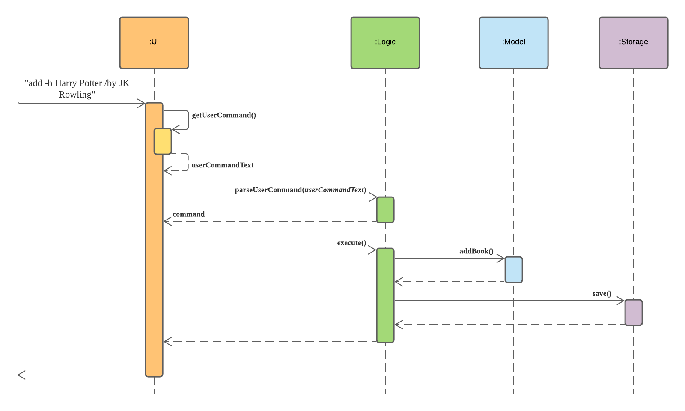
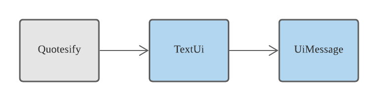
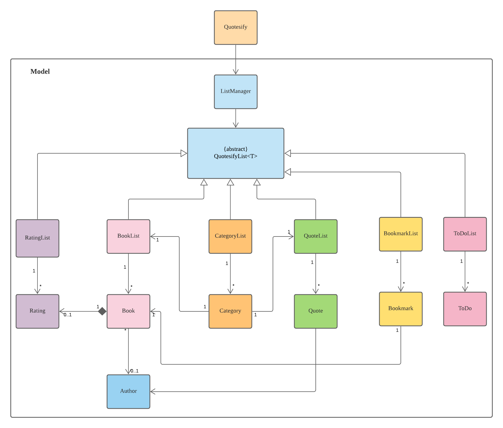
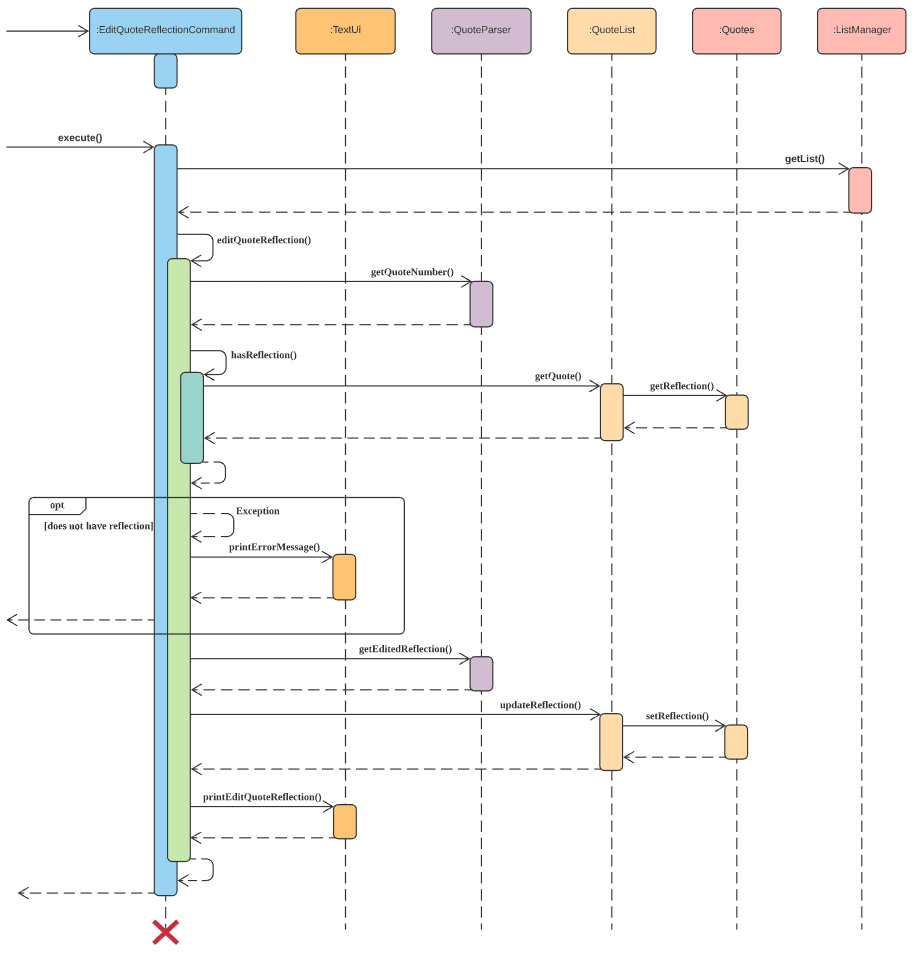
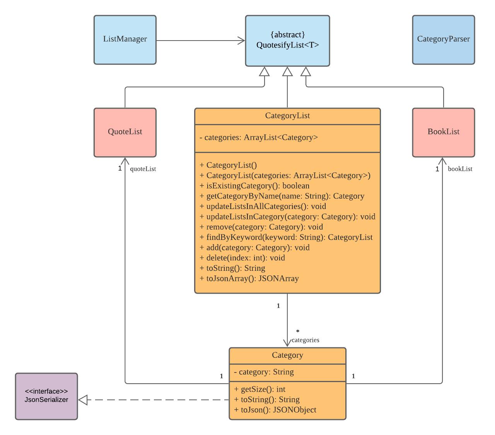
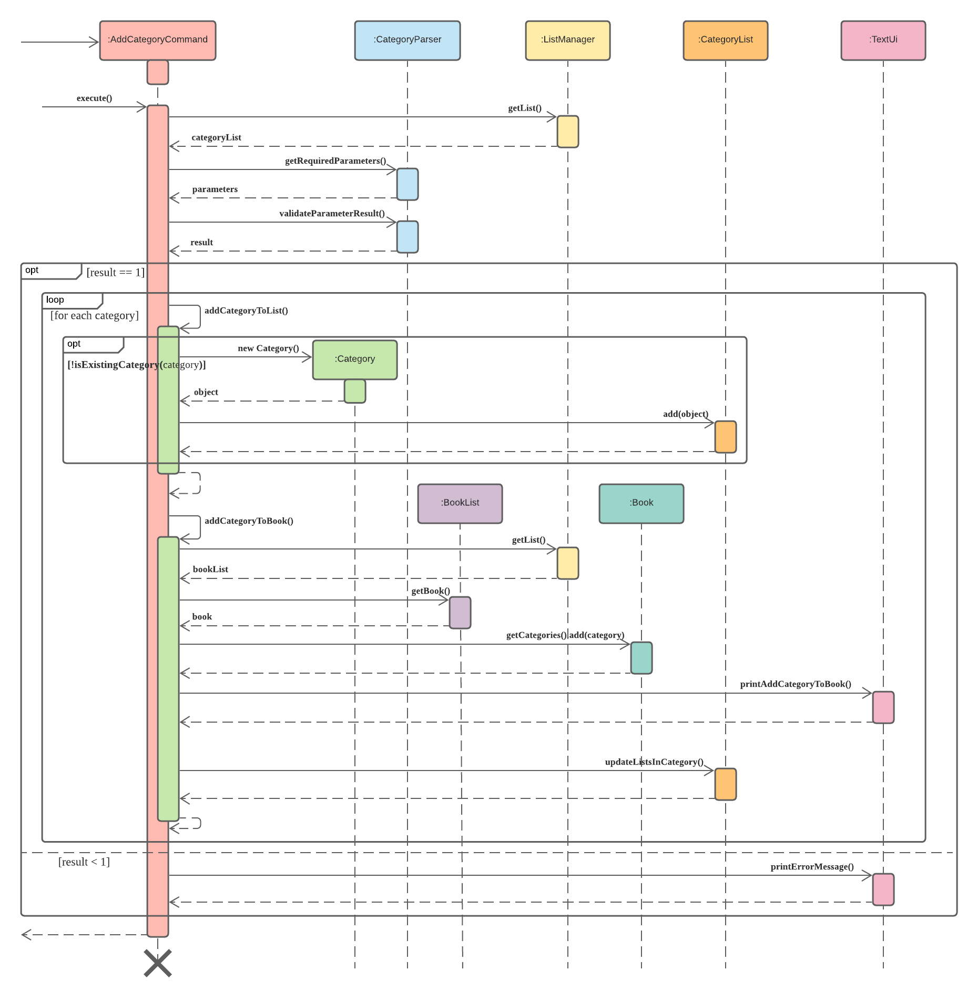
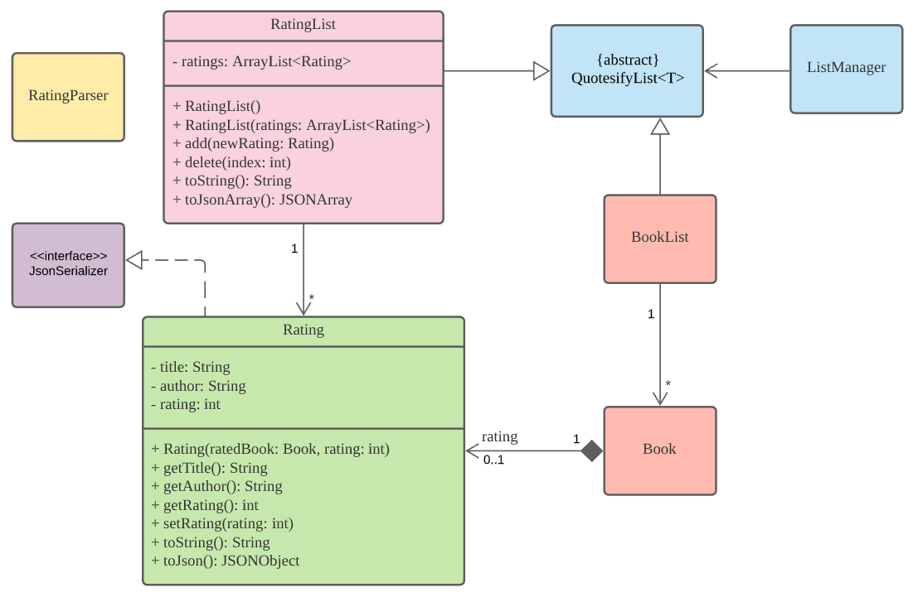
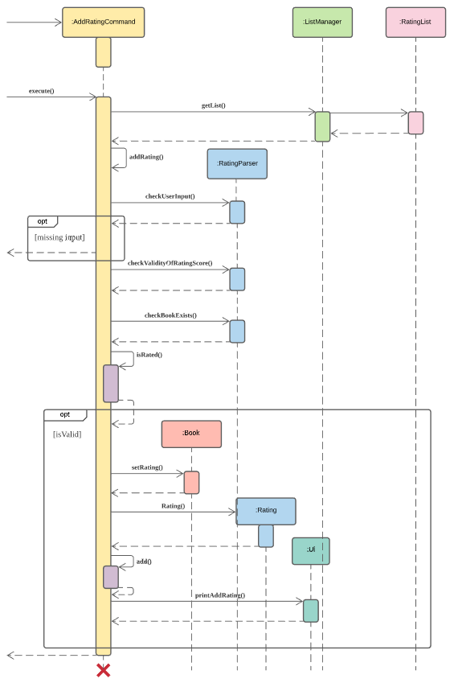
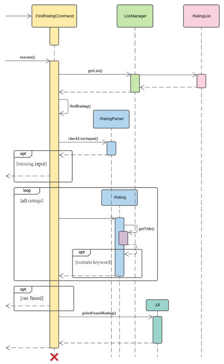

# Developer Guide

## Table of Contents
- [Introduction](#10-introduction)
- [Setting up](#20-setting-up)
- [Design](#30-design)
  * [Architecture](#31-architecture)
  * [UI component](#32-ui-component)
  * [Logic component](#33-logic-component)
  * [Model component](#34-model-component)
  * [Storage component](#35-storage-component)
- [Implementation](#40-implementation)
  * [Book Management](#41-feature-book-management)
  * [Quote Management](#42-feature-quote-management)
  * [Progress Tracker](#43-progress-tracker)
  * [Category Management](#44-feature-category-management)
  * [Rating System for books](#45-feature-rating-system-for-books)
- [Appendix: Requirements](#appendix-requirements)
  * [Product Scope](#product-scope)
  * [User Stories](#user-stories)
  * [Non-Functional Requirments](#non-functional-requirements)
  * [Glossary](#glossary)
- [Appendix: Instructions for manual testing](#appendix-instructions-for-manual-testing)
  * [Launch and Shutdown](#launch-and-shutdown)
  * [Adding a book](#adding-a-book)
  * [List all existing books](#list-all-existing-books)
  * [List book details](#list-book-details)
  * [List books by author](#list-books-by-author)
  * [Find books by keyword](#find-books-by-keyword)
  * [Delete books](#delete-books)
  * [Edit book](#edit-book)
  * [Adding a quote](#adding-a-quote)
  * [Listing all quotes](#listing-all-quotes)
  * [Listing quotes by a specific author](#listing-quotes-by-a-specific-author)
  * [Listing quotes from a specific reference](#listing-quotes-from-a-specific-reference)
  * [Listing quotes from a specific reference and by a specific author](#listing-quotes-from-a-specific-reference-and-by-a-specific-author)
  * [Editing a quote](#editing-a-quote)
  * [Deleting a quote](#deleting-a-quote)
  * [Finding a quote](#finding-a-quote)
  * [Adding reflection to quote](#adding-reflection-to-a-quote)
  * [Listing reflection of a quote](#listing-reflection-of-a-quote)
  * [Editing reflection of a quote](#editing-reflection-of-a-quote)
  * [Deleting reflection of a quote](#deleting-reflection-of-a-quote)
  * [Adding a bookmark to book](#adding-a-bookmark-to-book)
  * [List all existing bookmarks](#list-all-existing-bookmarks)
  * [Deleting an existing bookmark](#deleting-an-existing-bookmark)
  * [Editing an existing bookmark](#edit-an-existing-bookmark)
  * [Adding a task to todo list](#adding-a-task-to-todo-list)
  * [Listing all existing tasks](#listing-all-existing-tasks)
  * [Marking an existing task as done](#marking-an-existing-task-as-done)
  * [Deleting an existing task](#deleting-an-existing-task)
  * [Adding categories](#adding-categories)
  * [Listing all categories](#listing-all-categories)
  * [Listing a specific category](#listing-a-specific-category)
  * [Deleting existing categories](#deleting-existing-categories)
  * [Editing an existing category](#editing-an-existing-category)
  * [Finding an existing category](#finding-an-existing-category)
  * [Adding a book rating](#adding-a-book-rating)
  * [Listing all existing book ratings](#listing-all-existing-book-ratings)
  * [Listing books of a specific book rating](#listing-books-of-a-specific-book-rating)
  * [Deleting a book rating](#deleting-a-book-rating)
  * [Editing a book rating](#editing-a-book-rating)
  * [Finding a book rating](#finding-a-book-rating)

## 1.0 Introduction
**Welcome to Quotesify!**

Quotesify is a free desktop application to help you in your reading activities. With Quotesify, you can add
books and the related quotes that you wish to remember. You can categorize your books and quotes by author,
customized categories, and even rate your books. Quotesify also comes with a progress tracker just to improve
your reading experience.

This guide will provide information on the design and implementation of Quotesify. It will help you get started
on your journey of being a contributor to Quotesify. This guide will also explain the steps to test out the program,
so that you will have a better understanding of the current status of Quotesify.

## 2.0 Setting up
1. Fork the Quotesify repo from [here](https://github.com/AY2021S1-CS2113T-T09-3/tp),
and clone the fork to your computer.
2. Open up your IDE (IntelliJ is highly recommended). If you are not at the welcome screen,
click `File` > `Close Project` to close any existing project.
3. Set up the correct JDK version for Gradle:
    1. Click `Configure` > `Project Defaults` > `Project Structure`.
    2. Click `New…` and find the directory where you saved your JDK.
4. Click `Import Project`.
5. Locate the *build.gradle* file and select it.
6. Click `OK`.
7. Click `Open as Project`.
8. Click `OK` to accept all default settings.
9. To verify the set up, locate the `Quotesify.java` file, right-click it and select `Run Quotesify.main()`.
If the setup is correct, you should see something like this as shown below:

```
________                __                .__  _____       
\_____  \  __ __  _____/  |_  ____   _____|__|/ ____\__.__.
 /  / \  \|  |  \/  _ \   __\/ __ \ /  ___/  \   __<   |  |
/   \_/.  \  |  (  <_> )  | \  ___/ \___ \|  ||  |  \___  |
\_____\ \_/____/ \____/|__|  \___  >____  >__||__|  / ____|
       \__>                      \/     \/          \/    
Welcome to Quotesify v2.0!

What would you like to do with Quotesify?
```

## 3.0 Design
*`Note: All UML diagrams in this guide are stored in the images/ directory.`*

### 3.1 Architecture


The architecture diagram displayed above describes the high-level design of Quotesify. Below details a brief
description of each component shown.

#### Main class: `Quotesify.java`
* On program launch, the Main is responsible for initialising the required components in the correct sequence as well
as to connect these components to start Quotesify.
* On shutdown, the Main gracefully terminates the application and its running components.

The other components that make up Quotesify include:
* **UI**: Text-based User Interface (UI) of the application.
* **Logic**: Handles the execution of user input commands.
* **Model**: Stores Quotesify’s data objects in application memory.
* **Storage**: Stores and accesses program data in the hard disk.

The Sequence Diagram below shows an example of how the components work together upon receiving the command
`add -b Harry Potter /by JK Rowling`.



### 3.2 UI Component


The UI component is made up of main 2 classes:
* `TextUi`: Responsible for the majority display of Quotesify’s messages. 
* `UiMessage`: Holds all messages required for TextUI to print to the program console.

In essence, the UI is responsible for the majority display of all successful command executions, error messages
, as well as user interaction by prompting for the next command.

### 3.3 Logic Component


The Logic component is made up of 2 sub-components, namely the `Parser` and `Command`. Below describes the sequence
flow from the time a user input is read till command execution ends.

1. User input is fetched from the UI and passed into the Parser for parsing.
2. A Command object is returned and subsequently executed in the Main class.
3. The command execution outcome may affect Quotesify’s model objects. (e.g. adding a book)
4. Command instructs the UI component to print out relevant output messages depending on command type.
Also, Command may invoke saving of data via Storage at a given point in time.
5. Finally, Command will then inspect the exit status after command execution.
6. Control is handed back over to the UI.

* `XCommand` class represents the command type such as `AddCommand`, `FindCommand`, `DeleteCommand`, etc.
* `XYCommand` class represents the command to execute from a specific object. Such as `AddBookCommand`
, `FindBookCommand`, `DeleteQuoteCommand`, etc.

### 3.4 Model Component


The model component consists of several classes that make up the main features of Quotesify.
Each object holds in-application data unique to each feature and is stored in a list of their own.

### 3.5 Storage Component
The storage component consists of a single `Storage` class. It is responsible for saving user data as instructed
by the command component as well as to detect and load data on program launch.

On program launch:
1. `Storage` is initialised and checks for the existence of save data.
2. If save data exists, `Storage` will read the save data in JSON format and parses them back into their
model objects (e.g. Book).
3. If save data does not exist, `Storage` will create an empty save file in the specified directory.

On Command execution:
1. `Storage` parses all model objects in JSON format and writes into the save file.

## 4.0 Implementation
*`Note: All UML diagrams in this guide are stored in the images/ directory.`*

### 4.1 Feature: Book Management
Given below is the class diagram for classes related to Book Management in Quotesify:


#### 4.1.1 Add Books
The sequence diagram below demonstrates the command execution process when adding a book to the booklist.


* To reduce complexity and increase readability, the sequence diagram excludes error handling.
* Parsing of user input is done in the Parser and AddCommand classes, which is also not shown in the diagram.
* `checkMissingInformation()` method is also not included in the sequence diagram as it merely checks for possible
missing information given in the user input and throws exceptions.
* Upon ensuring there are no mistakes in the user input, `createNewBook()` will be called, which essentially creates a 
new book after ensuring there are no identical books already in the BookList.
* `sort()` method is called after adding the book to the BookList in order to sort the books in 
alphabetical order.

##### Design Considerations
* Title and author must be specified as <title,author> is used as the primary key.
    * Pros: Allows users to specify different books with the same title but different author.
    * Cons: Need to check for both title and author to prevent duplicates.
* BookList is always sorted in alphabetical order 
    * Alternative 1: Sort after adding the book
        * Pros: Only need to sort after every addition, listing is as per normal
        * Cons: Adding books may take longer if size of BookList is too large
    * Alternative 2: Sort before listing the books
        * Pros: Adding books will not take as long
        * Cons: Since there are multiple listing methods, may not be the best method to keep sorting before listing.

#### 4.1.2 Find Book by Keyword
The sequence diagram below demonstrates the command execution process when finding books by a keyword.


* Opt-frames ensure that the user input is correct and that the keyword results in a non-empty list of books.
* Parsing of user input is done in the Parser and FindCommand classes, which is not shown in the diagram.
* `findByKeyword()` method filters books regardless of case. 

##### Design Considerations
* Allows user to find books if either title or author contains the keyword.
    * Pros: Users can find books not just based on book title alone. The search range is increased to author name as well.
    * Cons: Need to check for both title and author for the list of results.
* Case insensitive
    * Pros: Users do not have to bother about the exact letter case when typing the keyword.
    * Cons: Need to ensure all title or author are converted to the same case before searching.
* Keyword or phrase
    * Alternative 1: Let users find by multiple space-separated keywords
        * Pros: Users can find books if they can only remember part of the book title.
        * Cons: Search list may not be narrowed as much. 
    * Alternative 2: Let users find by exact phrase
        * Pros: Users can narrow down the search using an exact phrase instead of just one word.
        * Cons: The exact phrase must be typed out for the correct result to show.

### 4.2 Feature: Quote Management
Given below is the class diagram for classes related to the Quote Management System in Quotesify:


* The `XRatingCommand` class represents `AddQuoteCommand`, `ListQuoteCommand`, `EditQuoteCommand`, `DeleteQuoteCommand`,
`FindQuoteCommand`, `AddQuoteReflectionCommand`, `ListQuoteReflectionCommand`, `EditQuoteReflectionCommand`,
`DeleteQuoteReflectionCommand`.

#### 4.2.1 Add quote
The add quote feature allows users to add quotes of multiple formats to Quotesify.
Quotes added can be of the following format:
* Quote with author name and reference title
* Quote with author name
* Quote with reference title
* Quote with no author name and reference title

The sequence diagram below reflects the command execution when a user adds a quote to Quotesify.


* Not shown in the sequence diagram is the parsing of user input by Quotesify's main parser class that creates an
`AddCommand` object which subsequently creates the `AddQuoteCommand` as seen in the diagram, and then calling it's 
`execute()` method.
* The `parseAddParameters()` method from `QuoteParser` will be called to identify the format desired by the user and 
creates the appropriate `Quote` object to be added into the `QuoteList`. 
* Appropriate validation checks will be conducted to identify if the quote field is empty. Similarly, if author and
reference tags are used, their respective fields will also be checked. If any missing field is found, the quote will
not be added and an error message will be displayed.
* Upon successful addition of a quote, the user will now be able to list, edit, delete, find and add a reflection to it.

#### Design Considerations
* Ability to add author name and reference title to quotes
    * Pros: Provides categorization and allows for the implementation of other useful features such as search and list
    * Cons: Increased memory overhead for each quote and implementation complexity
* Allowing users to add quotes of different formats with single command
    * Pros: Users will not be restricted to a single format or be required to use a different commands for each format.
    * Cons: Increased implementation complexity due to parsing different formats.
    
#### 4.2.2 Edit Quote Reflection
The edit quote reflection feature updates current reflection of a quote into a new one, keeping the remainding 
information such as quote, author name and reference the same.

The sequence diagram below reflects the command execution when a user edits the reflection of a quote.



* Not shown in the sequence diagram is the parsing of user input by Quotesify's main parser class that creates an
`EditCommand` object which subsequently creates the `EditQuoteReflectionCommand` as seen in the diagram, and then 
calling it's `execute()` method.
* Appropriate validation checks will be conducted to determine if the edit tag `/to` is present, and the updated 
reflection is not empty. If the following conditions are not met, the reflection will not be updated and an error 
message will be displayed.

#### Design Considerations
* Use of `/to` flag
    * Pros: Clear demarcation between quote number and start of updated reflection.
    * Cons: Additional parsing required and users are required to type more.
* Include a `updateReflection` method in `QuoteList` instead of editing quote object directly
    * Pros: Better encapsulation and data hiding as attributes can be set to private
    * Cons: Additional methods and passing of data required
    
### 4.3 Feature: Progress Tracker
Progress Tracker consists of two parts: Bookmark Management and Task Management.
Given below is the class diagram for classes related to Bookmark Management in Quotesify:


Given below is the class diagram for classes related to Task Management in Quotesify:


#### 4.3.1 Add/Update bookmark
The proposed add or update bookmark feature will rely on an existing `Book` object, and then a `Bookmark` object will 
be created in the process.
* The `Bookmark` object will be made up of the `Book` object and a page number, which is stored in a list of 
bookmarks named `BookmarkList`.

The sequence diagram below demonstrates the command execution process when adding or updating a bookmark to an existing book.


* To reduce complexity and increase readability, the sequence diagram excludes error handling.
* Not shown in the sequence diagram is the parsing of user input by Quotesify's main parser class that creates an
`BookmarkCommand` object as seen in the diagram, and then calling it's `execute()` method.

#### Design Considerations
* BookmarkList is always sorted in order of creation time
    * Pros: Allow user to easily find the earliest and the latest book they started to read.
    * Cons: Make user hard to find the bookmark they recently updated.

#### 4.3.2 Add task
The add task feature allows users to add tasks with a deadline to Quotesify. Tasks added can be of the following format:

* Task without any deadline
* Task with an unformatted deadline
* Task with a formatted deadline 
 
* The `ToDo` object (we mentioned as 'task' before) will be made up of a name and a deadline, which is stored in a list of 
tasks named `ToDoList`.

The sequence diagram below demonstrates the command execution process when adding a task.


* To reduce complexity and increase readability, the sequence diagram excludes error handling.
* Not shown in the sequence diagram is the parsing of user input by Quotesify's main parser class that creates an
`AddCommand` object which subsequently creates the `AddToDoCommand` as seen in the diagram, and then calling it's 
`execute()` method.

#### Design Considerations
* ToDoList is sorted in two ways:
    * Tasks with formatted deadline will be sorted in ascending order of time. (The one with an earlier deadline 
    is displayed ahead of the one with a later deadline)
    * Task with unformatted deadline and without specified deadline will be arranged in order of creation time.
    * Tasks with formatted deadline will be listed ahead of all other tasks.
    
        * Pros: User can view the most urgent task easily
        * Cons: It is hard for user to find a task with an unformatted deadline 
        even though the text in the deadline represents a high urgency.
    
### 4.4 Feature: Category Management
Given below is the class diagram for classes related to Category Management in Quotesify:



A `Category` object holds the following attributes:
* A `String` object that holds the category name.
* A `BookList` object that stores a list of `Book` objects tagged with the specified category name.
* A `QuoteList` object that stores a list of `Quote` objects tagged with the specified category name.
* An `int` value that indicates the total number of books/quotes tagged under the specified category.

#### 4.4.1 Add Categories
The proposed add categories feature allows a user to add multiple categories to an existing book, quote, or both. 

The sequence diagram below demonstrates the command execution process when adding a category to an existing book.



* For each category that the user has specified, the process will be executed in a loop until all categories have been processed.
* Additional checks include verifying the existence of the specified book and if the specified category already exists in the book. If either one of these checks fail, an error message will be prompted.
* On success, 
  * The category name will be added into the *categories* attribute of the `Book` object. 
  * A new `Category` object will be created and stored into the category list if it does not exist. 
  * The book will be added into the category's *bookList* attribute for record keeping.

##### Design Consideration
* Allowing users to specify multiple categories at once.
  * Pros: Increases efficiency for users
* Giving users an option to specify a book, quote, or both to be tagged with a category.
  * Pros: Increases efficiency for users.
  * Cons: Difficult to implement.
* Giving users an option to specify *multiple* books, quotes, or both to be tagged with a category:
  * Pros: Further increases efficiency for users.
  * Cons: Increased complexity in implementation. 

### 4.5 Feature: Rating system for books
Given below is the class diagram for classes related to the Rating System in Quotesify:



* A `Book` must exists before a `Rating` can be created.
* The `XRatingCommand` class represents `AddRatingCommand`, `DeleteRatingCommand`, `ListRatingCommand`
, `EditRatingCommand`, `FindRatingCommand` classes which all extends their respective parent `XCommand` classes.
* All the `XCommand` classes extends the abstract `Command` class.

#### 4.5.1 Add rating
The *add rating* feature will rely on an existing book object, and a rating object will then be created
in the process.
* The book object will store an attribute named *rating*, which will be set by this feature.
* The rating object will be made up of the book object and a rating score, which is stored in a list of ratings.

Given below is the sequence diagram for adding rating to a book:



* The sequence diagram shows the process of *Add Rating* from the `execute()` method in `AddRatingCommand` class,
which extends the `AddCommand` class. The switch statement in the `execute()` method to decide the item that the user
is adding is not shown in the diagram.
* The list of ratings will be retrieved from the `ListManager` class which stores all the different lists in Quotesify.
* In the `addRating()` method, if the user input such as book title, author or rating score is missing
, a message will be printed to inform the user and the method is returned.
* There will also be checks implemented to check if the rating score is within range, if the book to be rated exists
in Quotesify and if the book has been rated before. This is done by checking the list of books in Quotesify.
If all these conditions are met, the book will be rated.
* When rating a book, the attribute *rating* of the book is set to the rating score. A rating object containing the
book details and rating score will also be created and stored in the rating list.
This list of ratings will be used when listing or finding ratings.

##### Design Consideration
* Saving the ratings in a Rating List
    * Pros: Helps in listing and finding ratings as not all books are rated.
    * Cons: Increases memory usage.
* Using both book title and author to identify a rating instead of just book title
    * Pros: Allows books with the same title but different author to be rated.

#### 4.5.2 Find ratings
The *find ratings* feature will search if the rating for a particular book exists in Quotesify
and print details about the rating.

Given below is the sequence diagram for finding ratings:



* The sequence diagram shows the process of *Find Rating* from the `execute()` method in `FindRatingCommand` class
which extends the `FindCommand` class. The switch statement in the `execute()` method to decide the item that the
user is finding is not shown in the diagram.
* The list of ratings will be retrieved from the `ListManager` class which stores all the different lists in Quotesify.
* In the `findRating()` method, if the user input such as the book to search for is missing, a message will be printed
to inform the user and the method is returned.
* The list of ratings will be looped to see if the rating exists for the particular book.
* Since the ratings of book is unique, the loop will be broken when a rating is found and details of the rating
will be printed to the user.

## Appendix: Requirements

### Product scope

#### Target user profile
The intended user of Quotesify is someone that meets the following criterias:
* reads a lot
* has difficulty remembering content after reading them
* can type fast
* prefers typing over other means of input
* prefers using desktop applications
* comfortable with using Command Line Interface (CLI) applications

#### Value proposition
Quotesify will help you to improve your reading experience with quick and easy features such as book management,
quote management, progress tracker, category management and a rating system for your books.

#### User Stories

|Version| As a ... | I want to ... | So that I ...|
|--------|----------|---------------|------------------|
|v1.0|reader|enter good quotes and phrases from a book I read|can quickly refer back to it at any time|
|v1.0|user|categorize my listings|can view quotes from a specific category that I want|
|v1.0|long time user|have a page to see a list of books and categories of my notes|can navigate into the relevant book/category without having to remember the titles|
|v1.0|user|give rating for the books I read|can recommend book titles to others when asked|
|v1.0|beginner reader|add deadlines to books I am reading|can keep track of my readling deadlines|
|v1.0|avid reader|be able to keep track of books|can filter out books I have read and those that are on my list of books to read|
|v1.0|forgetful user|add bookmarks to my book|can find the page where I last stopped|
|v1.0|user|categorise my books or quotes|can view items from a specific category whenever I need|
|v1.0|user|save quotes I find meaningful|can view my favourite quotes whenever I want|
|v2.0|forgetful reader|be reminded of quotes I saved|can remember them better in the long run|
|v2.0|student and reader|pen my thoughts to a highlighted quote or text|can expand on certain ideas or express how I feel|
|v2.0|long time user|be able to search for keywords|can find specific quotes I want from the list|
|v2.0|user after some time|find a book rating by its book title|do not have to go through the whole list|

#### Non-Functional Requirements
1. Should work on major Operating Systems (OS) such as Windows and Mac with at least `Java 11` installed.
2. A user should have no problems using the various commands without referring to the help page after some time.

#### Glossary
* *glossary item* - Definition

## Appendix: Instructions for manual testing

### Launch and shutdown

#### Initial launch
   1. Ensure `Java 11` and above is installed.
   2. Download the latest **Quotesify JAR file** from [here](https://github.com/AY2021S1-CS2113T-T09-3/tp/releases).
   3. Save the jar file in a desired file directory.
   4. Open your command line or terminal and navigate into the file directory where Quotesify is saved.
   5. Run `java -jar Quotesify.jar` to launch Quotesify.
   
#### Shutdown
   1. To terminate Quotesify, enter the `bye` command.
   2. Data will be automatically saved into a data file.
   
#### Subsequent launch
   1. Open your command line or terminal and navigate into the file directory where Quotesify is saved.
   2. Run `java -jar Quotesify.jar` to launch Quotesify.
   3. Data will be automatically loaded from the data file upon launch.
   
### Adding a book
1. Test case: `add -b Harry Potter /by JK Rowling`
    
   Expected: Book is added to Quotesify. A message will be prompted to indicate that
   the book has been successfully added.
   
2. Other incorrect commands to try:
    * `add -b`: Book title left empty
    * `add -b /by JK Rowling`: Book title left empty with author name specified
    * `add -b title`: Author name left empty
    * `add -b title /by`: Author name left empty with author tag specified
    
    Expected: Book will not be added. An error message will by printed.
    
### List all existing books
1. Test case: `list -b`

   Expected: All existing books in booklist will be listed.
   
### List book details
1. Test case: `list -b 2`

   Expected: Book details of book with the book index 2 from list of all books will be printed.
   
2. Other incorrect commands to try:
   * `list -b Harry Potter /by JK Rowling`: Wrong format. 
   * `list -b 10000`: Index out of range of booklist.
   
   Expected: Book details will not be printed. An error message will be printed instead.
   
### List books by author
1. Test case: `list -b /by JK Rowling`

   Expected: Books with the author JK Rowling will be listed. 
   
2. Other incorrect commands to try:
   * `list -b JK Rowling`: Flag `/by` not specified
   
   Expected: Books will not be listed. An error message will be printed.
   
### Find books by keyword
1. Test case: `find -b Harry`

   Expected: Books with the title or author name containing Harry will be listed. 
   
2. Other incorrect commands to try:
   * `find -b`: Keyword not specified
   
   Expected: Books will not be listed. An error message will be printed.

### Delete books
1. Test case: `delete -b 3`

   Expected: Book with the book index of 3 in booklist will be deleted from list.
   Successful message will be printed.
   
2. Other incorrect commands to try:
   * `delete -b Harry Potter`: Wrong format
   * `delete -b 10000`: Index out of range of booklist.
   
   Expected: Book will not be deleted. An error message will be printed.

### Edit book
1. Test case: `edit -b 3 /to Harry Potterrrrr`

   Expected: Book title of book with the book index of 3 will be changed to Harry Potterrrrr.
   
2. Other incorrect commands to try: 
   * `edit -b Harry Potter /to Harry Potterrrrr`: Wrong format
   * `edit -b 3 Harry Potterrrrr`: Flag `/to` not specified. 
   * `edit -b 3 /to`: New title not specified. 
   
   Expected: Book title will not be edited. An error message will be printed. 
   
### Adding a quote

1. Add a quote without author and reference to Quotesify

    Test case: `add -q Life's short, smile while you still have teeth`
    
    Expected: Quote is added to Quotesify. message will be prompted to indicate that the quote has been successfully edited.

2. Add a quote with an author name to Quotesify

    Test case: `add -q Luke, I am your father /by Darth Vader`
    
    Expected: Quote is added to Quotesify. message will be prompted to indicate that the quote has been successfully edited.

3. Add a quote with reference to Quotesify

    Test case:`add -q Get schwifty /from Rick and Morty`
    
    Expected: Quote is added to Quotesify. message will be prompted to indicate that the quote has been successfully edited.
    
4. Add a quote with an author and reference to 

    Test case: `add -q So everyone’s supposed to sleep every single night now? /by Rick /from Rick and Morty`
    
    Expected: Quote is added to Quotesify. message will be prompted to indicate that the quote has been successfully edited. 
   
5. Incorrect commands to try:
   * `add -q` : quote field left empty
   * `add -q ` : empty space entered for quote field  
   * `add -q you can't see me /by` : author tag with missing author name
   * `add -q my name is inigo montoya /from` : reference tag with missing reference title
   * `add -q i am your father /by /from` : missing reference title and author name
   
   Expected: Quote will not be added. A message with error details will be shown.
   
### Listing all quotes

1. Test case: `list -q`

   Expected: The entire list of quotes with reference and author name (if present) in Quotesify will be displayed.
   
### Listing quotes by a specific author

1. Test case: `list -q /by rick`

   Expected: The list of quotes with the specified author name will be displayed.
   
2. Other incorrect commands to try:
   * `list -q /by` : author tag with missing author name
   
   Expected: No quotes are listed. A message with error details will be shown.
   
### Listing quotes from a specific reference

1. Test case: `list -q /from rick and morty`

   Expected: The list of quotes with the specified reference title will be displayed.
   
2. Other incorrect commands to try:
   * `list -q /from` : reference tag with missing reference title
   
   Expected: No quotes are listed. A message with error details will be shown.
   
### Listing quotes from a specific reference and by a specific author

1. Test case: `list -q /from rick and morty /by rick`

   Expected: The list of quotes with the specified reference title and author name will be displayed.
   
2. Other incorrect commands to try:
   * `list -q /from rick and morty /by` : reference and author tag with missing author name
   * `list -q /from /by rick` : reference and author tag with missing reference title
   * `list -q /from /by` : missing reference title and author name
   
   Expected: No quotes are listed. A message with error details will be shown.
   
### Editing a quote

1. Test case: `edit -q 2 /to No, I am your mummy /by Darth Vader`
   
   Expected: Quote will be updated, a prompt displaying old and updated quote will be shown.
   
2. Other incorrect commands to try:
   * `edit -q` : missing quote number and updated quote
   * `edit -q 1 /to`: missing updated quote
   * `edit -q 1 You can't see me` : missing "/to" flag
   * `edit -q 9999999 /to You can't see me` : non-existent quote number
   
   Expected: Quote will not be updated. A message with error details will be shown.
   
### Deleting a quote

1. Test case: `delete -q 1`

   Expected: Quote will be deleted from Quotesify. A message will be prompted to indicate that 
   the quote has been successfully deleted.
   
2. Other incorrect commands to try:
   * `delete -q`: missing quote number field
   * `delete -q X`: non integer input
   * `delete -q 9999999`: non existent quote number
   
   Expected: No quote is deleted. A message with error details will be shown.
   
### Finding a quote

1. Test case: `find -q sleep`

   Expected: Quotes related to the keyword will be shown.
   
2. Other incorrect commands to try:
   * `find -q`: missing keyword
   * `find -q `: empty space as keyword
   
   Expected: No quotes will be found and listed. A message with error details will be shown.
   
### Adding reflection to a quote

1. Test case: `add -qr 1 /reflect No, that's not true. It's impossible!`
    
   Expected: Reflection is added to quote. A message will be prompted to indicate that the reflection has been successfully added.
   * Quotes with reflection will have a "[R]" tag attached to differentiate.
   
5. Incorrect commands to try:
   * `add -qr` : missing quote number, reflection tag and reflection
   * `add -qr 1 /reflect` : reflection field missing
   * `add -qr 9999 /reflect Reflection is here` : non-existent quote
   
   Expected: Reflection will not be added. A message with error details will be shown.
   
### Listing reflection of a quote

1. Test case: `list -qr 1`

   Expected: The reflection attached to the specified quote will be displayed.
   
2. Other incorrect commands to try:
   * `list -qr` : missing quote number
   * `list -qr 9999` : non-existent quote
   
   Expected: Reflection is not listed. A message with error details will be shown.
   
### Editing reflection of a quote

1. Test case: `edit -qr 1 /to Who is Yoda’s daddy?`
   
   Expected: Reflection will be updated, a prompt displaying updated reflection will be shown.
   
2. Other incorrect commands to try:
   * `edit -qr` : missing quote number, to tag and updated reflection
   * `edit -qr 1 /to`: missing updated reflection
   * `edit -qr 1 nothing to reflect` : missing to flag
   * `edit -qr 9999999 /to updated reflection here!` : non-existent quote number
   
   Expected: Reflection will not be updated. A message with error details will be shown.
   
### Deleting reflection of a quote

1. Test case: `delete -qr 1`

   Expected: Reflection will be deleted from the quote. A message will be prompted to indicate that 
   the reflection has been successfully deleted.
   
2. Other incorrect commands to try:
   * `delete -qr`: missing quote number field
   * `delete -qr X`: non integer input
   * `delete -qr 9999999`: non existent quote number
   
   Expected: Quote reflection will not be deleted. A message with error details will be shown.
   
### Adding a bookmark to book
1. Test case: `bookmark -b 1 /pg 123`

   Expected: a page number will be marked at the book. A message will be prompted to indicate that 
   the bookmark has been tagged to the book successfully.

2. Other incorrect commands to try:
   * `bookmark -b 1 /pg`: missing page number field
   * `bookmark -b 0 /pg 123`: incorrect book number input
   
   Expected: Bookmark will not be added to any book. A message will error details will be shown.

### List all existing bookmarks
1. Test case: `list -bm`

   Expected: A list of bookmarks will be displayed. Each row contains an index assigned to the bookmark in the list,
    its book’s information, and a page number marked by the bookmark. 

### Deleting an existing bookmark
1. Test case: `delete -bm 1`

   Expected: Bookmark will be deleted from the book. A message will be prompted to indicate that 
   the bookmark has been removed from the book successfully.

2. Other incorrect commands to try:
   * `delete -bm 999` : bookmark number with given index does not exist
   * `delete -bm abc` : invalid bookmark number provided
   
   Expected: Bookmark will not be deleted from the book. A message with error details will be shown.

### Edit an existing bookmark
1. Test case: `bookmark -b 1 /pg 123`

   Expected: The page number will be updated in the bookmark. A message will be prompted to indicate that 
   the bookmark has been updated successfully.

2. Other incorrect commands to try:
   * `bookmark -b 1 /pg`: missing page number field
   * `bookmark -b 0 /pg 123`: incorrect book number input
   
   Expected: Bookmark will not be updated to any book. A message will error details will be shown.

### Adding a task to todo list
1. Adding a task without deadline
   - Test case: `add -t return Harry Potter`
   
     Expected: A message will be prompted to indicate that the task has been added to the todo list successfully,
    and the deadline is ‘not specified’.
    
2. Adding a task with unformatted deadline
   - Test case: `add -t return Harry Potter /by tmr`
   
     Expected: A message will be prompted to indicate that the task has been added to the todo list successfully, 
   and the deadline is the same as stated in the command line.
   
3. Adding a task with formatted deadline
   - Test case: `add -t return Harry Potter /by 2020-10-24`
   
     Expected: A message will be prompted to indicate that the task has been added to the todo list successfully, 
     and the deadline will be formatted as ‘Oct 24 2020, Saturday’.

### Listing all existing tasks
1. Test case: `list -t`

   Expected: A list of tasks will be displayed. The tasks with formatted deadlines will be displayed in the front, 
   and sorted in ascending order of timing, while other tasks will be displayed at the back without any order.

### Marking an existing task as done
1. Test case: `done -t 1`
   
   Expected: A message will be prompted to indicate that the task has been marked as done in the todo list successfully.

### Deleting an existing task
1. Test case: `delete -t 1`

   Expected: A message will be prompted to indicate that the task has been removed from the todo list successfully.
   
### Adding categories
1. Add one or more category to a book
   - Prerequisites: A book should exist in Quotesify.
   - Assume that the book "Harry Potter" is added into Quotesify assigned to index 1.
   - Test case: `add -c fantasy -b 1`
     
     Expected: A message will be prompted to indicate that category has been tagged to the book successfully.
   - Test case: `add -c fantasy romance -b 1`
     
     Expected: A message will be prompted to indicate that categories have been tagged to the book successfully.
     
2. Add one or more category to a quote
   - Prerequisites: A quote should exist in Quotesify.
   - Assume that the quote "Life is great!" is added into Quotesify assigned to index 1.
   - Test case: `add -c inspirational -q 1`
     
     Expected: A message will be prompted to indicate that category has been tagged to the quote successfully.
   - Test case: `add -c inspirational happy -q 1`
     
     Expected: A message will be prompted to indicate that categories have been tagged to the quote successfully.
     
3. Add one or more category to a book and quote
   - Prerequisites: A book and quote should exist in Quotesify.
   - Assume that an existing book and quote are both assigned to index 1.
   - Test case: `add -c inspirational -b 1 -q 1`
     
     Expected: A message will be prompted to indicate that category has been tagged to both book and quote successfully.
   - Test case: `add -c inspirational action -q 1`
     
     Expected: A message will be prompted to indicate that categories have been tagged to both book and quote successfully.

4. Incorrect commands to try
   - `add -c` missing category name, book or quote
   - `add -c action` missing a book or quote
   - `add -c action -b 0 -q 0` invalid book and quote index
   - `add -c -b 1 -q 1` missing category name
   
   Expected: An error message will be prompted. No changes will be made.
   
### Listing all categories
1. List all existing categories
   - Test case: `list -c`
     
     Expected: A list of categories with the total number of items tagged under each category will be displayed.

### Listing a specific category
1. List all books and quotes tagged by a specific category
   - Test case: `list -c action`
     
     Expected: A list of books and quotes tagged under that category will be displayed.

2. Incorrect commands to try
   - `list -c 123` invalid category name
   
   Expected: An error message will be displayed indicating that no such category exists.
   
### Deleting existing categories
1. Remove one or more category from a book
   - Prerequisites: Specified book index, quote index and category should exist in Quotesify.
   - Assume the book "Harry Potter" is tagged with [action, fantasy] category and assigned with index 1.
   - Test case: `delete -c action -b 1`
     
     Expected: A message will be prompted to indicate that category has been removed from book successfully.
   - Test case: `delete -c action fantasy -b 1`
   
     Expected: A message will be prompted to indicate that categories have been removed from book successfully.
     
2. Remove one or more category from a quote
    - Prerequisites: Specified book index, quote index and category should exist in Quotesify.
    - Assume the quote "Life is great!" is tagged with [inspirational, happy] category and assigned with index 1.
    - Test case: `delete -c inspirational -q 1`
     
      Expected: A message will be prompted to indicate that category has been removed from quote successfully.
    - Test case: `delete -c inspirational happy -q 1`
     
      Expected: A message will be prompted to indicate that categories have been removed from quote successfully.

3. Remove one or more category from a book and quote
   - Prerequisites: Specified book index, quote index and category should exist in Quotesify.
   - Assume that a book and quote are both tagged with [action, happy] categories.
   - Test case: `delete -c action -b 1 -q 1`
     
     Expected: A message will be prompted to indicate that category has been removed from both book and quote successfully.
   - Test case: `delete -c action happy -b 1 -q 1`
     
     Expected: A message will be prompted to indicate that categories have been removed from both book and quote successfully.

4. Remove one or more category from list
   - Test case: `delete -c action`
   
   Expected: A message will be prompted to indicate that category has been removed from all book and quotes.
   - Test case: `delete -c action fantasy`
   
   Expected: A message will be prompted to indicate that categories has been removed from all book and quotes.
   
5. Incorrect commands to try
   - `delete -c` missing category name, book or quote
   - `delete -c action -b 0 -q 0` invalid book and quote index
   - `delete -c -b 1 -q 1` missing category name
   
   Expected: An error message will be prompted. No changes will be made.
         
### Editing an existing category
1. Edit an existing category name
   - Test case: `edit -c love /to romance`
     
     Expected: A message will be prompted indicating that category has been changed successfully. All books and quotes tagged under the old category will be changed as well.

2. Incorrect commands to try
   - `edit -c` missing existing and new category name
   - `edit -c love` missing new category name
   
   Expected: An error message indicating invalid parameters and a command usage will be prompted. No changes will be made.
   
### Finding an existing category
1. Find existing categories related to a keyword.
   - Test case: `find -c man`
   
     Expected: Quotesify will list all categories containing the keyword "man".
     
2. Incorrect commands to try
   - `find -c` missing keyword
   - `find -c 123` invalid category name
   
   Expected: An error message will be prompted. No categories will be listed.

### Adding a book rating

1. Prerequisite: Book to be rated should exist in Quotesify.

2. Test case: `add -r 5 Harry Potter /by JK Rowling`

   Expected: Rating is added to the book. A message will be prompted to indicate rating has been added successfully.

3. Other incorrect commands to try:
   * `add -r`: rating score, book title and/or author fields left empty
   * `add -r 1000 Harry Potter`: rating score is out of the range
   * `add -r 3 x`: where x is a book that does not exist
   
   Expected: No rating is added. A message with error details will be prompted.
    
### Listing all existing book ratings

1. Test case: `list -r`

   Expected: The entire list of books and their ratings will be shown. Rating of books are sorted
   in descending order, with the highest rating at the top.

### Listing books of a specific book rating

1. Test case: `list -r 5`

   Expected: The list of books with the specified rating will be shown.
   
2. Other incorrect commands to try:
   * `list -r 1000`: rating score is out of the range
   * `list -r AAA`: invalid rating score
   
   Expected: No rating is listed. A message with error details will be prompted.
   
### Deleting a book rating

1. Test case: `delete -r Harry Potter /by JK Rowling`

   Expected: Rating is deleted from book. A message will be prompted to indicate rating has 
   been deleted successfully.
   
2. Other incorrect commands to try:
   * `delete -r`: book title and/or author fields left empty
   * `delete -r x`: where x is a book that has not been rated
   
   Expected: No rating is deleted. A message with error details will be prompted.
   
### Editing a book rating

1. Test case: `edit -r 4 Harry Potter /by JK Rowling`

   Expected: Rating is edited to the new rating. A message will be prompted to indicate rating has
   been edited successfully.
   
2. Other incorrect commands to try:
   * `edit -r`: rating score, book title and/or author fields left empty
   * `edit -r 1000 Harry Potter /by JK Rowling`: rating score is out of the range
   * `edit -r 3 x`: where x is a book that has not been rated
   
   Expected: No rating is edited. A message with error details will be prompted.
   
### Finding a book rating

1. Test case: `find -r Harry Potter /by JK Rowling`

   Expected: The rating for book titled "Harry Potter" by JK Rowling will be shown.
   
2. Other incorrect commands to try:
   * `find -r`: book title and/or author fields left empty
   * `find -r x`: where x is a book that has not been rated
   
   Expected: No rating is found and listed. A message with error details will be prompted.
