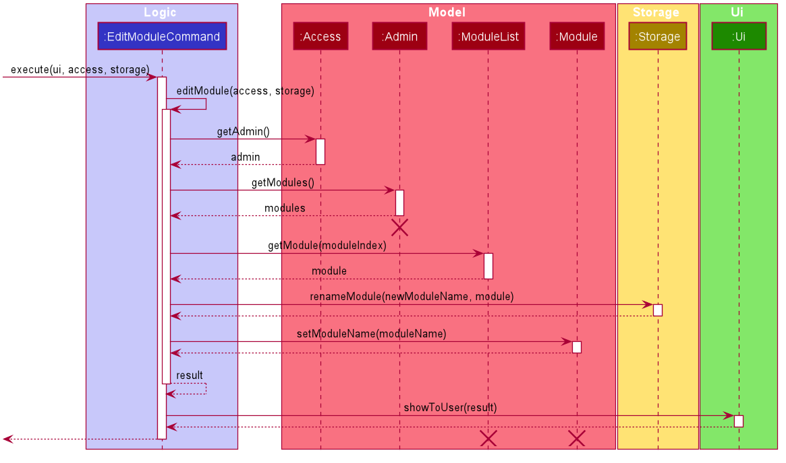

# Developer Guide

## Table of content
1. [<b>Introduction</b>](#1-introduction) 
1.1. [Overview](#11-overview) 
1.2. [Purpose](#12-purpose) 
1.3. [Scope](#13-scope) 
2. [<b>Setting Up</b>](#2-setting-up) 
2.1. [Prerequisites](#21-prerequisites) 
2.2. [Setting Up the Project in your Computer](#22-setting-up-the-project-in-your-computer) 
3. [<b>Design (Architecture)</b>](#3-design-architecture) 
3.1. [Ui Component](#31-ui-component) 
3.2. [Logic Component](#32-logic-component) 
3.3. [Model Component](#33-model-component) 
3.4. [Storage Component](#34-storage-component) 
3.5. [Common Classes](#35-common-classes) 
4. [<b>Implementation</b>](#4-implementation) 
4.1. [Admin Features](#41-admin-features) 
&nbsp;&nbsp;&nbsp;&nbsp;&nbsp;&nbsp;&nbsp;4.1.1. [Add Module Feature](#411-add-module-feature) 
&nbsp;&nbsp;&nbsp;&nbsp;&nbsp;&nbsp;&nbsp;4.1.2. [List Modules Feature](#412-list-modules-feature) 
&nbsp;&nbsp;&nbsp;&nbsp;&nbsp;&nbsp;&nbsp;4.1.3. [Edit Module Name Feature](#413-edit-module-name-feature) 
&nbsp;&nbsp;&nbsp;&nbsp;&nbsp;&nbsp;&nbsp;4.1.4. [Remove Module Feature](#414-remove-module-feature) 
&nbsp;&nbsp;&nbsp;&nbsp;&nbsp;&nbsp;&nbsp;4.1.5. [Access Module Level Feature](#415-access-module-level-feature) 
&nbsp;&nbsp;&nbsp;&nbsp;&nbsp;&nbsp;&nbsp;4.1.6. [Example of the Admin Feature](#416-example-of-the-admin-feature) 
&nbsp;&nbsp;&nbsp;&nbsp;&nbsp;&nbsp;&nbsp;4.1.7. [Conclusion](#417-conclusion) 
4.2. [Module Features](#42-module-features) 
&nbsp;&nbsp;&nbsp;&nbsp;&nbsp;&nbsp;&nbsp;4.2.1. [Add Chapter Feature](#421-add-chapter-feature) 
&nbsp;&nbsp;&nbsp;&nbsp;&nbsp;&nbsp;&nbsp;4.2.2. [List Chapters Feature](#422-list-chapters-feature) 
&nbsp;&nbsp;&nbsp;&nbsp;&nbsp;&nbsp;&nbsp;4.2.3. [Edit Chapter Name Feature](#423-edit-chapter-name-feature) 
&nbsp;&nbsp;&nbsp;&nbsp;&nbsp;&nbsp;&nbsp;4.2.4. [Remove Chapter Feature](#424-remove-chapter-feature) 
&nbsp;&nbsp;&nbsp;&nbsp;&nbsp;&nbsp;&nbsp;4.2.5. [Access Chapter Level Feature](#425-access-chapter-level-feature) 
&nbsp;&nbsp;&nbsp;&nbsp;&nbsp;&nbsp;&nbsp;4.2.6. [Return to Admin Level Feature](#426-return-to-admin-level-feature) 
&nbsp;&nbsp;&nbsp;&nbsp;&nbsp;&nbsp;&nbsp;4.2.7. [Rate Chapter Feature](#427-rate-chapter-feature) 
&nbsp;&nbsp;&nbsp;&nbsp;&nbsp;&nbsp;&nbsp;4.2.8. [Example of the Module Feature](#428-example-of-the-module-feature) 
&nbsp;&nbsp;&nbsp;&nbsp;&nbsp;&nbsp;&nbsp;4.2.9. [Conclusion](#429-conclusion) 
4.3. [Chapter Features](#43-chapter-features) 
&nbsp;&nbsp;&nbsp;&nbsp;&nbsp;&nbsp;&nbsp;4.3.1. [Add Flashcard Feature](#431-add-flashcard-feature) 
&nbsp;&nbsp;&nbsp;&nbsp;&nbsp;&nbsp;&nbsp;4.3.2. [List Flashcards Feature](#432-list-flashcards-feature) 
&nbsp;&nbsp;&nbsp;&nbsp;&nbsp;&nbsp;&nbsp;4.3.3. [Edit Flashcard Content Feature](#433-edit-flashcard-content-feature) 
&nbsp;&nbsp;&nbsp;&nbsp;&nbsp;&nbsp;&nbsp;4.3.4. [Remove Flashcard Feature](#434-remove-flashcard-feature) 
&nbsp;&nbsp;&nbsp;&nbsp;&nbsp;&nbsp;&nbsp;4.3.5. [Return to Module Level Feature](#435-return-to-module-level-feature) 
&nbsp;&nbsp;&nbsp;&nbsp;&nbsp;&nbsp;&nbsp;4.3.6. [Check Overall Performance for a Chapter Feature](#436-check-overall-performance-for-a-chapter-feature) 
&nbsp;&nbsp;&nbsp;&nbsp;&nbsp;&nbsp;&nbsp;4.3.7. [Example of the Chapter Feature](#437-example-of-the-chapter-feature) 
&nbsp;&nbsp;&nbsp;&nbsp;&nbsp;&nbsp;&nbsp;4.3.8. [Conclusion](#438-conclusion) 
4.4. [Revise Feature](#44-revise-feature) 
&nbsp;&nbsp;&nbsp;&nbsp;&nbsp;&nbsp;&nbsp;4.4.1. [Implementation](#441-implementation) 
4.5. [Scheduler feature](#45-scheduler-feature) 
&nbsp;&nbsp;&nbsp;&nbsp;&nbsp;&nbsp;&nbsp;4.5.1. [View Due Chapters Feature](#451-view-due-chapters-feature) 
&nbsp;&nbsp;&nbsp;&nbsp;&nbsp;&nbsp;&nbsp;4.5.2. [Preview Upcoming Dues Feature](#452-preview-upcoming-dues-feature) 
&nbsp;&nbsp;&nbsp;&nbsp;&nbsp;&nbsp;&nbsp;4.5.3. [Exclusion Feature](#453-exclusion-feature) 
&nbsp;&nbsp;&nbsp;&nbsp;&nbsp;&nbsp;&nbsp;4.5.4. [Reschedule Chapter Feature](#454-reschedule-chapter-feature) 
&nbsp;&nbsp;&nbsp;&nbsp;&nbsp;&nbsp;&nbsp;4.5.5. [View Revision History Feature](#455-view-revision-history-feature) 
5. [<b>Appendix: Requirements</b>](#5-appendix-requirements) 
5.1. [Product Scope](#51-product-scope) 
&nbsp;&nbsp;&nbsp;&nbsp;&nbsp;&nbsp;&nbsp;5.1.1. [Target User Profile](#511-target-user-profile) 
&nbsp;&nbsp;&nbsp;&nbsp;&nbsp;&nbsp;&nbsp;5.1.2. [Value Proposition](#512-value-proposition) 
5.2. [User Stories](#52-user-stories) 
5.3. [Use Cases](#53-use-cases) 
5.4. [Non-Functional Requirements](#54-non-functional-requirements) 
5.5. [Glossary](#55-glossary) 
6. [<b>Appendix: Instructions for Manual Testing</b>](#6-appendix-instructions-for-manual-testing) 

--------------------------------------------------------------------------------------------------------------------

## 1. Introduction

### 1.1. Overview

### 1.2. Purpose

### 1.3. Scope
This documentation describes the software architecture and software design decisions for the implementation of Kaji. The intended audience of this document is the developers, designers, and software testers of Kaji.

--------------------------------------------------------------------------------------------------------------------

## 2. Setting Up

### 2.1. Prerequisites
* JDK 11
* IntelliJ IDEA

### 2.2. Setting up the project in your computer
1. Fork this repository, and clone the fork into your computer.
2. Open IntelliJ (if you are not in the welcome screen, click `File` → `Close Project` to close the existing project dialog first).
3. Set up the correct JDK version for Gradle.
    1. Click `Configure` → `Project Defaults` → `Project Structure`.
    2. Click `New…` and set it to the directory of the JDK.
4. Click `Import Project` (or `Open or Import` in newer version of Intellij).
5. Locate the `build.gradle` file (not the root folder as you would do in a normal importing) and select it. Click `OK`.
If asked, choose to `Open as Project` (not `Open as File`).
7. Click `OK` to accept the default settings

--------------------------------------------------------------------------------------------------------------------

## 3. Design (Architecture)
(Zeyu)

The Architecture Diagram given above explains the high-level design of the App. Given below is a quick overview of each component.

The main class is `Kaji.java`. It is responsible for:

* Initializing the components in the correct sequence, and connects them up with each other at app launch.
* Shutting down the components and invoking cleanup methods where necessary at exit.

The rest of the App consists of 8 components:
* `Access`: Keeps track of the access level of the user.
* `UI`: The UI of the App.
* `Command`: Executes the different command types.
* `Common`: Contains common classes.
* `Manager`: Holds the data of the App in memory.
* `Paser`: Parses user input into specific command type.
* `Scheduler`: Schedules the revision schedule.
* `Storage`: Reads data from, and writes data to, the hard disk.

### 3.1. Ui Component 
(Jia Ern)

The UI component consists of a main class — Ui.java. The Kaji, Logic and Storage components have a dependency on the UI component due to the need to take in user input and show the results of execution.

The UI component is responsible for:
* Taking in user input.
* Printing result of execution for the different commands. 
* Printing error messages when certain exceptions occur. 

### 3.2. Logic Component 
(Jane)

The Logic component consists of the `Parser`, `Command` and `Scheduler` classes.

  
   Figure <>. Class diagram of Logic component  

1. `Kaji` uses the `Parser` class to parse the user command.
2. This results in a `Command` object which is executed by `Kaji`.
3. The command execution can affect the `Model` (e.g. adding a module).
4. The `Scheduler` is used in some command execution to schedule the due date of a chapter.
5. The result of the command execution is passed to the `Ui`.

Given below is the Sequence Diagram for interactions within the `Logic` component for the `parse("edit 1 CS2113T")` API call:

  
   Figure <>. Sequence diagram of Logic component  

:information_source: <b>Note:</b> The lifeline for `Parser` should end at the destroy marker (X) but due to a limitation of PlantUML, the lifeline reaches the end of diagram.

### 3.3. Model Component
(Jiayi)

### 3.4. Storage Component 
(Lucas)

### 3.5. Common Classes

--------------------------------------------------------------------------------------------------------------------

## 4. Implementation

### 4.1. Admin Features
[summary + scenario]

#### 4.1.1. Add Module Feature
(Jiayi)

#### 4.1.2. List Modules Feature
(Zeyu)

#### 4.1.3. Edit Module Name Feature
(Jane)
##### Implementation
The edit module name feature allows the user to edit the name of any existing module.

The user can edit the name of an existing module with the `edit` command, which follows the following format: `edit MODULE_INDEX MODULE_NAME`.

The edit module name feature is facilitated by `ModuleList` and `Module`.
In addition, it implements the following operations:
* `ModuleList#getModule()` - Returns a module based on the specified index from the list of modules.
* `Module#setModuleName()` — Sets the name of the module.
 
For instance, the user wants to edit the module `CS2113`, a detailed description of what happens is shown below: 
Step 1: The user is currently in `admin` level. 
Step 2: The user enters `edit 1 CS2113T` command to edit the first module in the list of modules — which in this case is `CS2113`. 
Step 3: The user input is parsed by `Parser`, and `Parser` creates a `EditModuleCommand` object. 
Step 5: `EditModuleCommand` is executed and calls the method `EditModuleCommand#editModule()`. 
Step 6: `EditModuleCommand#editModule()` gets the module based on the index provided by the method `ModuleList#getModule()`. 
Step 7: The module name is edited to `CS2113T` by the method `Module#setModuleName()`. 

The following sequence diagram shows how the edit module name feature works:

  
   Figure <>. Sequence diagram of edit chapter name feature  

:information_source: <b>Note:</b> The lifeline for `Parser` and `Admin` should end at the destroy marker (X) but due to a limitation of PlantUML, the lifeline reaches the end of diagram.

#### 4.1.4. Remove Module Feature
(Jia Ern)

The remove module feature allows the user to remove a module by specifying the index of the module in the list. 
The remove module mechanism is facilitated by `RemoveModuleCommand`. It extends from the abstract class `RemoveCommand`. 

In addition, it implements the following operations:
* `RemoveModuleCommand#execute()` — oversees entire execution for removing a module.
* `RemoveModuleCommand#removeModule()` — removes module from list of modules including the chapters and flashcards under it.
* `RemoveCommand#prepareResult()` — prepares the resulting message of the execution.

For instance, the user wants to start a remove the module `CS2113T`, a detailed description of what happens is shown below:

* Step 1: The user is currently in `admin` level. 

* Step 2: The user enters `remove 1` command to delete the first module in the list of modules — which in this case is `CS2113T`. The `remove` command creates `RemoveModuleCommand` which will then be executed. 

* Step 3: `RemoveModuleCommand#execute` gets the `module` based on the index provided and passes it to `Storage#deleteDirectory` to delete the module folder as well as the chapters and flashcards under it. 

The following sequence diagram shows how the remove module feature works:

#### 4.1.5. Access Module Level Feature
(Jiayi)

#### 4.1.6. Example of the Admin Feature

#### 4.1.7. Conclusion

### 4.2. Module Features
[summary + scenario]

#### 4.2.1. Add Chapter Feature
(Jiayi)

#### 4.2.2. List Chapters Feature
(Zeyu)

#### 4.2.3. Edit Chapter Name Feature
(Jane)
##### Implementation
The edit chapter name feature allows the user to edit the name of any existing chapter.

The user can edit the name of an existing chapter with the `edit` command, which follows the following format: `edit CHAPTER_INDEX CHAPTER_NAME`.

The edit module name feature is facilitated by `ChapterList` and `Chapter`.
In addition, it implements the following operations:
* `ChapterList#getChapter()` - Returns a chapter based on the specified index from the list of chapters.
* `Chapter#setChapterName()` — Sets the name of the chapter.
 
For instance, the user wants to edit the chapter `chap 1` from the module `CS2113T`, a detailed description of what happens is shown below: 
Step 1: The user is currently in `CS2113T` at the module level. 
Step 2: The user enters `edit 1 Chapter 1` command to edit the first chapter in the list of chapters — which in this case is `chap 1`. 
Step 3: The user input is parsed by `Parser`, and `Parser` creates a `EditChapterCommand` object. 
Step 5: `EditChapterCommand` is executed and calls the method `EditChapterCommand#editChapter()`. 
Step 6: `EditChapterCommand#editModule()` gets the chapter based on the index provided by the method `ChapterList#getChapter()`. 
Step 7: The chapter name is edited to `Chapter 1` by the method `Chapter#setChapterName()`. 

The following sequence diagram shows how the edit chapter name feature works:

  
   Figure <>. Sequence diagram of edit flashcard content feature  

:information_source: <b>Note:</b> The lifeline for `Parser` and `Chapter` should end at the destroy marker (X) but due to a limitation of PlantUML, the lifeline reaches the end of diagram.

#### 4.2.4. Remove Chapter Feature
(Jia Ern)

The remove chapter feature allows the user to remove a chapter by specifying the index of the chapter in the list. 
The remove chapter mechanism is facilitated by `RemoveChapterCommand`. It extends from the abstract class `RemoveCommand`. 

In addition, it implements the following operations:
* `RemoveChapterCommand#execute()` — oversees entire execution for removing a chapter.
* `RemoveChapterCommand#removeModule()` — removes chapter from list of chapters in a module including the flashcards under it.
* `RemoveCommand#prepareResult()` — prepares the resulting message of the execution.

For instance, the user wants to start a remove the chapter `Chapter 1` from the module `CS2113T`, a detailed description of what happens is shown below:

* Step 1: The user is currently in `CS2113T` at the module level. 

* Step 2: The user enters `remove 1` command to delete the first chapter in the list of chapters — which in this case is `Chapter 1`. The `remove` command creates `RemoveChapterCommand` which will then be executed. 

* Step 3: `RemoveChapterCommand#execute` gets the `chapter` based on the index provided and passes it to `Storage#deleteDirectory` to delete the chapter file as well as the flashcards under it. 

The following sequence diagram shows how the remove chapter feature works:

#### 4.2.5. Access Chapter Level Feature
(Lucas)

#### 4.2.6. Return to Admin Level Feature
(Lucas)

#### 4.2.7. Rate Chapter Feature
(Jiayi) 

#### 4.2.8. Example of the Module Feature

#### 4.2.9. Conclusion

### 4.3. Chapter Features
[summary + scenario]

#### 4.3.1. Add Flashcard Feature
(Jane)

#### 4.3.2. List Flashcards Feature
(Zeyu)

#### 4.3.3. Edit Flashcard Content Feature
(Jane)
The edit flashcard content feature allows the user to edit the content of any existing flashcard.

The user can edit the content of an existing flashcard with the `edit` command, which follows the following format: `edit FLASHCARD_INDEX q:QUESTION | a: ANSWER`.

The edit flashcard content feature is facilitated by `CardList` and `Card`.
In addition, it implements the following operations:
* `CardList#getCard()` - Returns a flashcard based on the specified index from the list of flashcards.
* `Card#setQuestion()` — Sets the question of a flashcard.
* `Card#setAnswer()` — Sets the answer of a flashcard.
 
For instance, the user wants to edit the flashcard `[Q] 2*1 | [A] 2` from the chapter `Chapter 1` for module `CS2113T`, a detailed description of what happens is shown below: 
Step 1: The user is currently in `Chapter 1` at the chapter level of the module `CS2113T`. 
Step 2: The user enters `edit 1 q:1+1 | a:` command to edit the first flashcard in the list of flashcards — which in this case is `[Q] 2*1 | [A] 2`. 
Step 3: The user input is parsed by `Parser`, and `Parser` creates a `EditCardCommand` object. 
Step 5: `EditCardCommand` is executed and calls the method `EditCardCommand#editCard()`. 
Step 6: `EditCardCommand#editCard()` gets the chapter based on the index provided by the method `CardList#getCard()`. 
Step 7: The question is edited to `1+1` by the method `Card#setQuestion()`. 
Step 8: As there is no content to edit the answer, the method `Card#setAnswer()` is not called. 

The following sequence diagram shows how the edit flashcard content feature works:

  
   Figure <>. Sequence diagram of edit flashcard content feature  

:information_source: <b>Note:</b> The lifeline for `Parser` and `Admin` should end at the destroy marker (X) but due to a limitation of PlantUML, the lifeline reaches the end of diagram.

#### 4.3.4. Remove Flashcard Feature
(Jia Ern)

The remove flashcard feature allows the user to remove a flashcard by specifying the index of the flashcard in the list. 
The remove flashcard mechanism is facilitated by `RemoveFlashcardCommand`. It extends from the abstract class `RemoveCommand`. 

In addition, it implements the following operations:
* `RemoveFlashcardCommand#execute()` — oversees entire execution for removing a flashcard.
* `RemoveFLashcardCommand#removeModule()` — removes flashcard from list of flashcards in a chapter.
* `RemoveCommand#prepareResult()` — prepares the resulting message of the execution.

For instance, the user wants to start a remove the flashcard `[Q] 1+1 | [A] 2` from the chapter `Chapter 1`, a detailed description of what happens is shown below:

* Step 1: The user is currently in `Chapter 1` at the chapter level of the module `CS2113T`. 

* Step 2: The user enters `remove 1` command to delete the first flashcard in the list of flashcards — which in this case is `[Q] 1+1 | [A] 2`. The `remove` command creates `RemoveCardCommand` which will then be executed. 

* Step 3: `RemoveCardCommand#execute` gets the `flashcard` based on the index provided and removes it from the `CardList` 

* Step 4: The updated `CardList` is passed to `Storage#saveCards()` to update the contents of the chapter with the removed card. 

The following sequence diagram shows how the remove flashcard feature works:

#### 4.3.5. Return to Module Level Feature
(Jia Ern)

The return to module level feature allows the user to return to the module level from the chapter level.
The return to module level mechanism is facilitated by `BackModuleCommand`. It extends from the abstract class `BackCommand`. 

In addition, it implements the following operation:
* `BackModuleCommand#execute` — lowers access level of the user.

For instance, the user wants to return to the module level from the chapter he is currently at in the module `CS2113T`, a detailed description of what happens is shown below:

* Step 1: The user is currently in `Chapter 1` at the chapter level in the module `CS2113T`. 

* Step 2: The user enters `back` command to return to `CS2113T`. The `back` command creates `BackModuleCommand` which will then be executed.

* Step 3: `BackModuleCommand#execute` passes an empty string to `Access#setChapterLevel()` to check the chapter level and calls `Access#setIsModuleLevel` to set the user back to module level.

The following sequence diagram shows how the return to module level feature works:

#### 4.3.6. Check Overall Performance for a Chapter Feature
(Jiayi)

#### 4.3.7. Example of the Chapter Feature

#### 4.3.8. Conclusion

### 4.4. Revise Feature
(Jia Ern)

The revise feature allows the user to start a revision on a chapter and can only be done when the user is in the module level. 

#### 4.4.1. Implementation
The revise mechanism is facilitated by `ReviseCommand`. It extends from the abstract class `Command`. 

In addition, it implements the following operations:
* `ReviseCommand#execute()` — oversees the entire revise process and calls the respective methods when necessary.
* `ReviseCommand#getChapter()` — gets `chapter` based on the index the user provided.
* `ReviseCommand#getCards()` — gets a list of `card` in `chapter`.
* `ReviseCommand#promptNotDue()` — prompts user if he still wants to revise a `chapter` that is not due.
* `ReviseCommand#reviseCard()` — makes use of `ui` to show the contents of each card to the user and gets rating input for the particular card.
* `ReviseCommand#addHistory()` — adds the `chapter` to storage to track past revisions.
* `ReviseCommand#rateCard()` — gets user input on difficulty of a flashcard.
* `ReviseCommand#repeatRevision()` — repeats revision for cards which user could not answer. 

For instance, the user wants to start a revision for `Chapter 1` in the module `CS2113T`, a detailed description of what happens is shown below:

* Step 1: The user is currently in `CS2113T` at the module level.

* Step 2: The user enters `revise 1` command to revise the first chapter in the module — which in this case is `Chapter 1`. The `revise` command creates `ReviseCommand` which will then be executed.

* Step 3: `ReviseCommand#execute` gets `Chapter1` based on the index provided as well as a list of `card` under the particular chapter by calling `ReviseCommand#getChapter` and `ReviseCommand#getCards` respectively.

* Step 4: If the `chapter` is not due for revision yet, `ReviseCommand#promptNotDue()` will prompt the user if he still wants to revise a `chapter` that is not due. If the user enters `Y`, the Revise feature will continue execution, else it will return to the main class Kaji, and wait for the next command.

* Step 5: `ReviseCommand#execute` loops through each flashcard and shows the user its contents by calling `ReviseCommand#reviseCard()`  and inside it, `ReviseCommand#rateCard()` is called and makes use of `Ui#getUserInput()` to get user to rate the difficulty of each flashcard. 

* Step 6: `ReviseCommand#repeatRevision` then repeats the revision session on cards which the user could not answer.

* Step 7: `ReviseCommand#addHistory` will call `Storage#createHistory` and `Storage#saveHistory` to keep a record of the chapter revised so that the user can look back next time.

The following sequence diagram shows how the revise feature works:

### 4.5. Scheduler Feature
[summary + scenario]

#### 4.5.1. View Due Chapters Feature
(Lucas)

#### 4.5.2. Preview Upcoming Dues Feature
(Lucas)

#### 4.5.3. Exclusion Feature
(Lucas)

#### 4.5.4. Reschedule Chapter Feature
(Jane)

#### 4.5.5. View Revision History Feature
(Zeyu)

--------------------------------------------------------------------------------------------------------------------

## 5. Appendix: Requirements
### 5.1. Product Scope
#### 5.1.1. Target User Profile

* needs to have an effective study schedule
* prefers typing to mouse interactions
* is comfortable with the usage of CLI applications

#### 5.1.2. Value Proposition

* implements Spaced Repetition for the user 

### 5.2. User Stories

|Version| As a ... | I want to ... | So that I can ...|
|--------|----------|---------------|------------------|
|v1.0|user|revise the flashcards by chapter|do my revision|
|v1.0|user|remove modules/chapters/flashcard|remove modules/chapters/flashcards that I no longer need from the scheduler|

### 5.3. Use Cases

### 5.4. Non-Functional Requirements

1. Should work on any mainstream OS as long as it has Java 11 installed.
2. A user with above average typing speed for regular English text (i.e. not code, not system admin commands) should be able to accomplish most of the tasks faster using commands than using the mouse.

### 5.5. Glossary

* **Mainstream OS**: Windows, Linux, Unix, OS-X
* **CLI**: Command Line Interface

--------------------------------------------------------------------------------------------------------------------

## 6. Appendix: Instructions for Manual Testing

{Give instructions on how to do a manual product testing e.g., how to load sample data to be used for testing}
