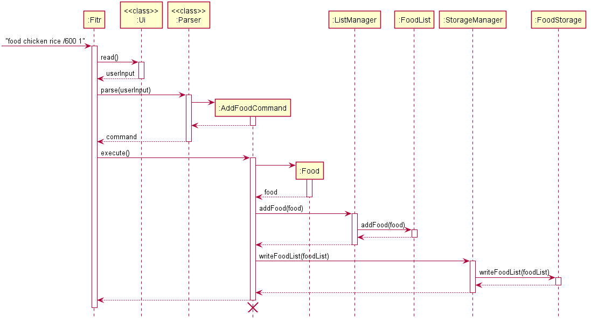
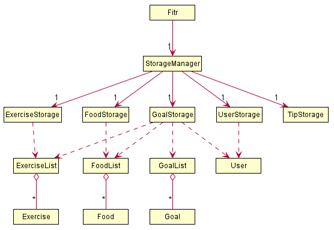
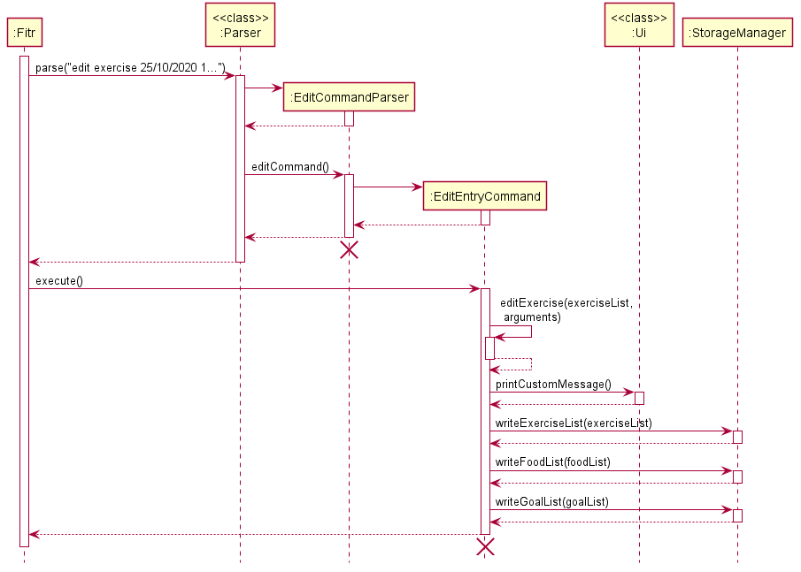
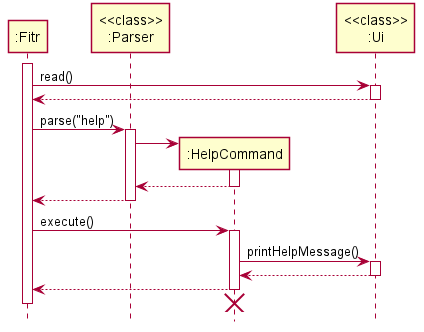
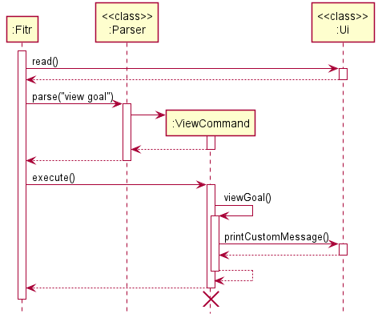

# Fitr Developer Guide

* Table of Contents
{:toc}

## 1. Introduction

**Fitr** is a command line application, helping university students keep track of your food intake and exercises.

This developer guide documents the architecture, software design decisions and implementation of Fitr.
This guide is targeted towards current and future developers, who wish to understand and work on this application, as well as designers and software testers.

## 2. Setting Up 
This section explains the prerequisites, and the steps to setting up Fitr on your computer.

### 2.1 Prerequisites
* You must have **Java 11** or above installed on your computer.
* You must have a GitHub account.
* You must have IntelliJ IDEA IDE installed on your computer.

### 2.2 Setting up Fitr in your computer

> :exclamation: **Caution:** Follow the steps in the following guide precisely. Things will not work out if you deviate in some steps.

This section provides a step-by-step procedure to set up Fitr in your computer.

1. **Fork** this [repository](https://github.com/AY2021S1-CS2113T-W13-2/tp/tree/v2.0).
1. **Clone** the fork to your computer using [Sourcetree](https://sourcetreeapp.com/) or using any other _Git GUI_.
1. Make sure your IDE is configured as **JDK 11**. If not, follow the steps below:
    1. Ensure you have the correct JDK version installed in your computer.
    1. Open IntelliJ (if you are not in the welcome screen, click `File` > `Close Project` to close the existing project dialog first).
    1. Set up the correct JDK version for Gradle.
        1. Click `Configure` > `Project Defaults` > `Project Structure`
        1. Click `New...` and set it to the directory of the JDK.
1. When prompted, **import** the project as a **Gradle project** (this can take a few minutes to complete). You can follow the following steps to import the project as a **Gradle Project**:

    > :exclamation: **Note:** Importing a Gradle project is slightly different from importing a normal Java project.

    1. IntelliJ IDEA by default has the Gradle plugin installed. If you have disabled it, click `File` > `Settings` > `Plugins` to enable them.
    1. Click `Import Project` (or `Open or Import` in newer version of IntelliJ).
    1. Locate the `build.gradle` file (not the root folder as you would do in normal importing) and select it. Click `OK`. If asked, choose to `Open as Project`, not `Open as File`.
    1. Click `OK` to accept the default settings but do ensure that the selected version of `Gradle JVM` matches the JDK 11.

### 2.3 Verifying Setup

 1. Run Fitr and enter a few commands to ensure that the application functions are as expected. You may refer to the _User Guide_ [here](https://ay2021s1-cs2113t-w13-2.github.io/tp/UserGuide.html) or enter `help` to find out what commands are supported in Fitr.
 1. Run the tests to ensure that they all pass, by executing the command `gradlew build` in IntelliJ's terminal.

## 3. Design

This section provides an overview of the design of the Fitr application.

### 3.1 Architecture

This section illustrates the high-level architecture of Fitr, as well as an illustration of the components used in Fitr.


_Figure 1: Architecture diagram of Fitr_

Figure 1 above explains the high-level design of Fitr. Given below is a quick overview of each component.

The main driver of the application is `Fitr` is responsible for mainly two phases:
* At app launch: Initialises or loads the respective lists and user profile in the correct sequence and is in charge of connecting the various components with each other.
* At shut down: Shuts down the components and invokes cleanup methods where necessary.

The rest of the App consists of:
* `Ui`: The user interface of the application.
* `Parser`: Handles and parses user commands.
* `Command`: Handles the various commands Fitr understands.
* `User`: Contains and handles all information related to user data.
* `StorageManager`: Reads data from and writes data back into a text file for future use.
* `ListManager`: Handles all the list operations in Fitr.

Figure 2 below shows how the components work with one another, when a user enters the following command `food chicken rice /600 1`:



_Figure 2: Sequence diagram when adding a food into Fitr_
 
### 3.2 Components

This section expands on the different components seen in the architecture section.

#### 3.2.1 Ui component

The `Ui` class handles all user inputs and system output.

This component also listens to other components and outputs the desired messages in specified formats.

#### 3.2.2 Parser component

The Parser component takes in the user input from the `Ui` class and handles the various commands. If the command is invalid, it calls the `Ui` class to prompt the user until valid commands are entered.
When a valid command is keyed in, the `Parser` class returns a `Command` object to execute the command.

#### 3.2.3 Command component

The Command component consists of an abstract `Command` class and the various different commands that inherit the `Command` class.
Each type of command class (e.g. `addFoodCommand`, `addExerciseCommand` etc) implements an abstract `execute()` method that carries out the command. 

#### 3.2.4 User component

The `User` class contains all information related to the user data (i.e. `name`, `age`, `height`, `weight`
and `gender`) and handles all operations on these user data (i.e. `getBmi()`)

The `User` class has two constructors and implementations differ based on the constructor used. 

If a `User` object is instantiated without parameters (i.e. `User user = new User()`), the `setup` method in the
 `user` object will be invoked, allowing users to go through a set of instructions to input their `name`, `age`, `gender`, `height`, `weight` and
 `fitnessLevel`.
 
If a `User` object is instantiated with defined parameters (i.e. `User user = new User(name, age, height, weight
, gender)`), the values from the given parameters will be stored within the user class without going through
 `setup()`.

On startup, the `Fitr` class instantiates a `Storage` object and calls its `loadUserProfile()` method. This method
returns a `User` type object and is referenced by a pre-declared `User` type variable, which is used throughout the
running session. 

#### 3.2.5 Storage component

Under the storage component, the `StorageManager` class handles the read and write operations of the various list classes available, such as `ExerciseList` and `FoodList`, through classes such as `ExerciseStorage` and `FoodStorage`.



_Figure 3: `StorageManager` class diagram_

Figure 3 above shows the associations and dependencies present with the `StorageManager` class.

On startup, the `Fitr` class creates a new `StorageManager` object. The `StorageManager` class will then create the various storage objects required to load that particular file into the program. 
This will cause the various storage objects to retrieve the text files from the given file paths and loads the data into the program. 
If the files do not exist, the various storage objects will create the files. For example, if the file that contains the user's exercise data does not exist, the `ExerciseStorage` object will create a new file to store the user's exercise data.

Each time there is a change in the `FoodList`, `ExerciseList` or `User` objects, or when the program is exiting, `writeExerciseList()`, `writeFoodList()` and `writeUserProfile()` methods in `StorageManager` are invoked. 
This will save the data onto the respective text files on the hard disk.

#### 3.2.6 Common classes

Classes used by multiple components are in the `fitr.common` package.

## 4. Implementation

This section describes how some of the features in Fitr are implemented.

### 4.1 Edit command

When the user enters an edit command, it first passes through `Parser`. Once the input is parsed as an edit command, it is then passed to `EditCommandParser`, where it further parses the user's input. As the user is able to edit either the individual profile characteristics, food or exercise entries, the `EditCommandParser` is able parse what the user intends to edit. For example, if the user intends to edit a food entry, the input is then passed to `EditEntryCommand`, which parses the remaining arguments, and performs the required edit.
Figure 4 below shows the sequence diagram when the user enters `edit exercise 25/10/2020 1 push ups /100`.



_Figure 4: Sequence diagram for edit command_

### 4.2 Help command

When the user enters 'help', the `Ui` class reads it and passes it through `Parser`.  Once the input is parsed as a help command, the user input is passed to `HelpCommand`, which calls `Ui` to print the help message.
Figure 5 below shows the sequence diagram when the user enters `help`.



_Figure 5: Sequence diagram for help command_

### 4.3 View command

When the user enters a view command, the `Ui` class reads it and passes it through `Parser`. Once the input is parsed as a view command, it is then passed to `ViewCommand`, where it is handled based on the type of view command. Then the respective view method is called to output the messages via the `Ui` class. For example, if you intend to view your goal entry, the input is passed to `ViewCommand`, which checks the arguments after 'view' and calls the `viewGoal()` method. It then performs the required steps to retrieve the goal status for each entry and prints the results using the `printCustomMessage()` method in the `Ui` class.



_Figure 6: Sequence diagram for view goal command_

### 4.4 Clear command

The `clear` command allows the user to clear either the exercise list, food list, or goal list, by specifying in the user's input as an argument (i.e. `clear exercise`, `clear food`, or `clear goal`). The user is also able to clear all the lists at the same time, if no argument is specified (i.e. `clear`).

The user's input is first parsed by the `Parser` class. It is then passed to the `ClearCommand` class, which is then executed. The arguments are parsed in the `ClearCommand` class, and the required list(s) is then cleared. After clearing, it then writes the new empty list(s) to local storage.

## Appendix A: Product Scope
### Target user profile

Our target user profile is university students, at all fitness levels, who values an application that integrates the logging of food, exercises performed and the tracking of calories in one application. 
It is also aimed at those who prefer typing over mouse interactions and are reasonably comfortable with using command-line applications.

### Value proposition

Our application helps users to keep fit without needing them to do any research on healthy living or workout options. 
We will be collecting user information such as age, weight, fitness level, and the application will recommend users preset exercises.

## Appendix B: User Stories

_Table 1: User stories_

|Version| As a ... | I want to ... | So that I can ...|
|--------|----------|---------------|------------------|
|v1.0|student|enter my food intake|log my calories|
|v1.0|student|view my past calories intake|track my calories|
|v1.0|student|store the food I consumed together with its calories in the application|add food that I previously consumed without having to enter the calories again|
|v1.0|new user|access the help function|I know what to do with the application|
|v1.0|student|print my past exercise records|see my workout progress|
|v1.0|student|enter my height and weight|the application can calculate my BMI|
|v1.0|student|save my past exercise and food records|access my past records at all times|
|v2.0|student|edit my previous food, exercise and goal entries|fix any mistakes I made previously|
|v2.0|student|clear my previous food, exercise and goal entries|declutter my exercise and food records|
|v2.0|student|indicate my fitness level|exercise based on the recommendations of the application|
|v2.0|student|edit my profile|update my information|
|v2.0|student|set goals|see if I am on track|
|v2.0|student|be recommended a set of workout|save time finding exercises to do|
|v2.0|student|set goals linked to my calories|know my goal status without calculating and comparing my calories|
|v2.0|student|view my food, exercise and goal entries on a specified date|find my entries easily

## Appendix C: Non-functional Requirements

1. This application should work on any mainstream operating system, such as Windows or macOS, as long as Java 11 or above is installed.
2. A user with above average typing speed for regular English text should be able to accomplish most of the tasks faster using commands than using the mouse.

## Appendix D: Instructions for manual testing

1. Initial launch
    1. Download the latest version of `Fitr` from [here](https://github.com/AY2021S1-CS2113T-W13-2/tp/releases).
    1. Open Command Prompt / Terminal
    1. Run the command java -jar {filename}.jar e.g., java -jar Fitr.jar (i.e., run the command in the same folder as the jar file).
    1. If the setup is correct, you should see something like the below:
       ``` 
        _______   __   __
       |    ___| |__| |  |_  .----.
       |    ___| |  | |   _| |   _|
       |___|     |__| |____| |__|
       Hello! Welcome to Fitr. 
       ```
1. Clear list feature
    1. Add a few food entries.
    1. View food entries, using the command `view food`.
    1. Enter the command `clear food` to clear the food list.
    1. View food entries again to check if the list has been cleared (i.e empty).
    1. If done correctly, you should see something like the following:
       ```
       The goal list is empty...
       ```
1. Saving your data feature
    1. Enter a few goal entries.
    1. View goal entries, using the command `view goal`.
    1. Exit the application by entering `bye`.
    1. Run Fitr again and view your goal entries with the same `view goal` command.
    1. If done correctly, you should see the same goals as previously shown.
