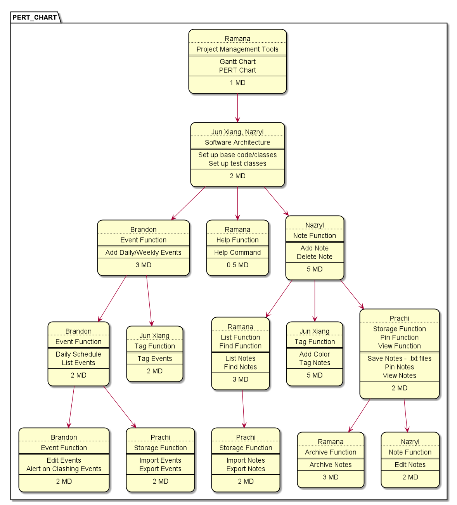

## Table of Contents
#### [1. Introduction](#intro) 
#### [2. Scrum (Agile Model)](#scrum) 
#### [3. Kanban Boards](#kanban) 
#### [4. PERT & Gantt Charts](#pert) 
#### [5. UML Diagrams](#uml) 
#### [6. Code Review](#code) 
#### [7. Testing & Logging](#testing) 
#### [8. Error Handling](#errors) 

 

## <a name="intro">1. Introduction</a>
Software Development is a complex topic that has many models and frameworks. This section will explain the methodologies and frameworks used in this project by the development team.

 

## <a name="scrum">2. Scrum (Agile Model)</a>
[Scrum](https://nus-cs2113-ay2021s1.github.io/website/schedule/week12/topics.html#W12-4) is a framework under the [Agile software development model](https://en.wikipedia.org/wiki/Agile_software_development). It serves to break a team's work into goals that can be achieved within a certain time frame.

For NotUS, there was one one-month long period for the submission of the project. With each milestone (v1.0, 2.0 and 2.1) coming in within 2 weeks of one another. Internally, the development team also had a mid-version review of the product, which would occur at the midway point of each deliverable.

The team made use of weekly meetings in which we discussed a high level overview of what was done, what was going to be done, and what else was left to be done. Task delegations were also done during the meeting. The meetings were meant to be very brief and followed the sprint requirements as specified under the SCRUM framework. Issues were raised but discussions on solving such issues were done outside of such meetings.

 

## <a name="kanban">3. Kanban Boards</a>
GitHub was used as the host for version control with Git, and GitHub's inbuilt features were used to a great extent in terms of the software engineering aspect of the project.

  
   <em>Figure 1</em>

[Kanban boards](https://en.wikipedia.org/wiki/Kanban_board) are a feature used under the Projects section of each GitHub repository, and are extremely useful in providing an overview of, and tracking the work at various stages of the project.

 

## <a name="pert">4. PERT and Gantt Charts</a>
A Program Evaluation Review Technique (PERT) Chart was created prior to the start of developing NotUS and was constantly updated based on progress and updates from the development team's weekly meetings. A PERT chart is a project management tool that provides a visual representation of a project's timeline. The chart breaks down the individual tasks and aids in identifying task dependencies. A diagram of the PERT chart used for this application is shown below.

  
   <em>Figure 2</em>

 

## <a name="uml">5. UML Diagrams</a>
The development team also made use of [UML Diagrams](https://nus-cs2113-ay2021s1.github.io/website/schedule/week8/topics.html#W8-3) to explain the flow of the logic and how the components interacted with eacg other which can be found in the [Developer Guide](DeveloperGuide.md).

 

## <a name="code">6. Version Control & Code Review</a>
In a software development project, [version control](https://nus-cs2113-ay2021s1.github.io/website/schedule/week7/topics.html#W7-8) is highly essential in making sure that the history of code development is logged. Bugs and features are common in the process of upgrading and adding features in the project, so it is essential to retrieve an older, working version of the code is important.

Git is the common and obvious choice to do so, and GitHub is highly convenient site to host the version control. The team also makes use of the [Pull Requests (PRs)](https://nus-cs2113-ay2021s1.github.io/website/schedule/week4/topics.html#W4-8) and the PRs were subjected to peer review from the development team in GitHub to protect the main code located in the master branch.

The advantage in conducting the code reviews is that there are more than one person involved in detecting any problems or bugs faced, ensuring higher quality code. They also aid in identifying any code that violates the [coding standard](https://se-education.org/guides/conventions/java/basic.html). Examples of the Version Control & Code Review practice can be found on the [PR page of this repository](https://github.com/AY2021S1-CS2113-T13-1/tp/pulls).

 

## <a name="testing">7. Testing & Logging</a>
It is important to ensure that the code continues to work even with constant updates.

The project uses GitHub actions for [Continuous Integration(CI)](https://nus-cs2113-ay2021s1.github.io/website/schedule/week7/topics.html#W7-6). When a PR is made in the repo, GitHub actions will run automatically to build and verify the code as updated by the PR.

Java's own Junit module can be used for Unit Testing. Manual test cases were created by the development team to verify the features worked. Test cases can be found in the [test folder](https://github.com/AY2021S1-CS2113-T13-1/tp/tree/master/src/test/java/seedu/notus).

The development team also made use of [logging](https://nus-cs2113-ay2021s1.github.io/website/schedule/week9/topics.html#W9-2) to record certain information during the program execution for future reference. This had helped the development team when a need to troubleshoot arose.

 

## 8. Error Handling <a name="errors">
Error prevention mechanisms and documentation would greatly improve the User Experience. Well-written applications include [error-handling](https://nus-cs2113-ay2021s1.github.io/website/schedule/week5/topics.html#W5-6) code that allows them to recover gracefully from unexpected errors. The team included many error prevention messages for the user during the execution of the application. The full list of error messages can be found [here](https://github.com/AY2021S1-CS2113-T13-1/tp/blob/master/src/main/java/seedu/notus/util/CommandMessage.java). Do note that these are just the messages users will see on their console. To understand where and how these were used, please refer to the main [code](https://github.com/AY2021S1-CS2113-T13-1/tp/tree/master/src/main/java/seedu/notus).