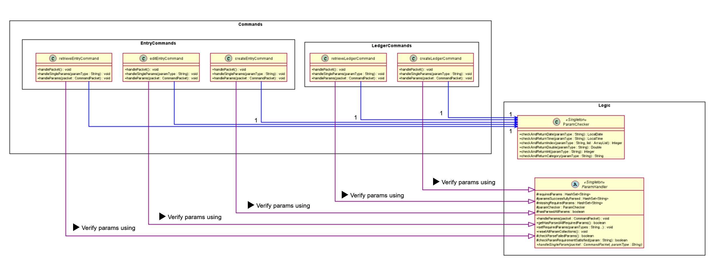

* __Feature modules__: Modules implementing the features of the application as follows:

    | Feature| Purpose|
    |-------|-------|
    |Manual Tracker| User can manually record daily transactions into the program
    |Recurring Tracker|
    |Goal Tracker|
    |Finance Tools| User can compute various finance-related calculations
    
* __Helper modules__: Modules that serve auxillary purposes to the program

    | Feature| Purpose|
    |-------|-------|
    |Data| Represents data relevant to the program.
    |Ui| Handles console output and user input at user interface.
    |Logic| Describes param handling and checking logic.
    |Storage| Handles saving and loading of program data.
    |Error Handling.Exceptions| Exception classes unique to each program error identified.
    |Error Handling.LoggerCentre| Class that consolidates ```Logger``` instances used throughout the program.

#2. Design & implementation
## 2.1 Parser Component
## 2.1.1 Summary
* Classes which require input parameters by users require the collection of
helper classes to handle the parsing, checking and organisation of the input string.
* The handling of parameter input is isolated into an abstract class ```ParamHandler```, whereby other classes which requires a param handling
feature will inherit from this abstract class. 
    * Such classes typically represent a particular operation: 
        1. ```Manual Tracker``` : Ledger creation
        1. ```FinanceTools``` : Calculation of interest.
* Specific behavior towards different ```param type```-```parameter``` pairs  will be defined within their 
own class declarations.


## 2.1.2 Details

__Input Conventions__
* The user input is composed of the following format:
```
    <command> <param type> <parameter> <param type> <parameter> ...
```
* The ```command``` string determines the current state of the Finite State Machine, and
hence the function executed. 
* The remainder of the string includes a series of  ```param type``` - ```param``` combinations, whereby
```param type``` indicates the type of the parameter which is to be identified by the user class,
and ```param``` indicates the parameter that is associated with the ```param type```. 

* Param types are restricted to two types: 
    * ```/<string>```, requires a corresponding parameter.
        * Eg. ```param type```: ```/date```
              <br>  ```param``` : ```2020-04-04```
    * ```-<string>```, does not require a corresponding parameter. 
        * Reserved for param types which are used to specify a property to be true/false
        * Eg. ```-auto```, to specify if an entry has automatic deduction. 
        
<a name="commandPacket"></a> __CommandPacket class__ 
* A helper class. Contains two particular attributes to store the user input in an organised fashion.
    * ```commandString``` :  ```String``` Store the command string from the input.
    * ```paramMap``` : ```HashMap``` Store the pairs of ```param type``` and ```param``` present in the input string.
        * Key: ```param type```
        * Value:  ```param```

__InputParser class__
* A helper class. Parses the input string and returns a corresponding [```commandPacket```](#commandPacket).
    * ```parseInput()```: 
        * Initializes a ```commandPacket``` and populates the ```commandString``` attribute.
        * Calls ParamParser instance to parse the segment of the input string
        that corresponds with the sequence of ```param type``` - ```param``` pairs, and
        return a HashMap populated with the aforementioned pairs.
        * Returns a fully populated ```commandPacket``` to be used by user classes.
         
__ParamsParser class__
* A helper class. Parses the subsequence of the input string that corresponds with sequence of 
```param type``` - ```param``` pairs.
    * Parsing of input for params via ```parseParams()```:
        * __Step 1__: Use a regex helper class ```RegexMatcher``` to identify and extract ```param type``` that matches the 
        pattern specified in "Input conventions":
        ```
        Param types are restricted to two types: 
          /<string>, requires a corresponding parameter.
              Eg. param type: /date
                    <br>  param : 2020-04-04
          -<string>, does not require a corresponding parameter. 
              Reserved for param types which are used to specify a property to be true/false
              Eg. -auto, to specify if an entry has automatic deduction. 
        ```
        * __Step 2__: Identify the substring of the rest of the input string before the next ```param type``` or end-of-line, 
        as the ```param``` to the previously identified ```param type```. Extract it from the input string.
        * __Step 3__: Put the ```param type``` - ```param``` pair into a ```HashMap```.
        * __Step 4__: Repeat steps 1 to 4 until there is the input string is fully extracted.
        * __Step 5__: Return a ```HashMap``` populated with the aforementioned pairs.

## <a name="paramHandling"></a> 2.2 Logic Component
### 2.2.1 Summary
After parsing from user input to produce a ```commandPacket``` instance, the instance needs to be handled by a particular ```ParamHandler``` children class,
which processes the ```commandPacket``` attributes to perform a specific function. 

### 2.2.2 Details
__ParamHandler Class__
* An abstract class that encapsulates general param handling behavior. 
    * Handling of params via```handleParams(packet)```:
        * Initialize the state of the handler 
            * Children class of ```ParamHandler``` call ```setRequiredParams()``` to set required Params that need to be parsed successfully to constitute an overall successful parse.
            * Resetting String arrays in the following ```param``` arrays:
                * ```missingRequiredParams```
                * ```paramsSuccessfullyParsed```
            * Set the ```CommandPacket``` instance in ```ParamChecker``` by calling ```ParamChecker.setPacket(packet)```.
        * For every```paramType``` in the ```CommandPacket``` instance, execute ```handleSingleParam(packet)``` method. 
            1. ```handleSingleParam(packet)``` is an abstract method, and it is implemented by children classes of ```ParamHandler``` depending on the needs and requirements of that particular class.
        1. Check if the parse was successful. The condition below that define a successful parse is:
            1. All ```param``` in ```createLedgerCommand.requiredParams``` string array are parsed with no exceptions thrown.
        1. If parse is successful, the process ends gracefully. Else, throw ```InsufficientParamsException()```.

## <a name="paramHandling"></a> 2.3 UI Component

## <a name="paramHandling"></a> 2.4 Storage Component

## <a name="paramHandling"></a> 2.5 Data Component

## <a name="paramHandling"></a> 2.6 Handler Component


### 1.1 Logic component
##### <a name="commandAndLogic"></a> Command and Logic



|Class| Function |
|--------|----------|
|```retrieveLedgerCommand```| Process ```paramTypes```-```param``` pairs from the ```CommandPacket``` instance to identify specified ```Ledger``` instance, then retrieves the instance from the existing ```LedgerList```.
|```createLedgerCommand```| Process ```paramTypes```-```param``` pairs from the ```CommandPacket``` instance to identify specified ```Ledger``` instance to be created, then creates the instance and append to existing ```LedgerList```.
|```retrieveEntryHandler```| Omitted and left as exercise for reader. : ^ )
|```createEntryCommand```| Omitted for brevity.
|```editEntryHandler```| Omitted for brevity.
|```ParamChecker```| Class contains a collection of methods that verify the correctness of the ```param``` supplied. <br><br> For instance, ```ParamChecker.checkAndReturnIndex``` checks if the index provided is out of bounds relative to the specified list, and throws the relevant exception if the input index is invalid. 
|```ParamHandler```| Abstract class that outlines the general param handling behavior of ```commands``` instances and other classes that need to handle ```params``` in its operation.  

##### <a name="handlerAndCommand"></a> Handler and Command


|Class| Function |
|--------|----------|
|```retrieveLedgerCommand```| [Refer to section above](#commandAndLogic).
|```createLedgerCommand```| [Refer to section above](#commandAndLogic).
|```retrieveEntryHandler```| Omitted for brevity.
|```createEntryCommand```| Omitted for brevity.
|```editEntryHandler```| Omitted for brevity.
|```ManualTracker```| Implements Manual Tracker. Contains handler methods that implements a particular operation capable by the Manual Tracker. <br><br> These methods use the above ```command``` instances for param handling operations from user input.
|```EntryTracker```| Omitted for brevity.

## Handler component